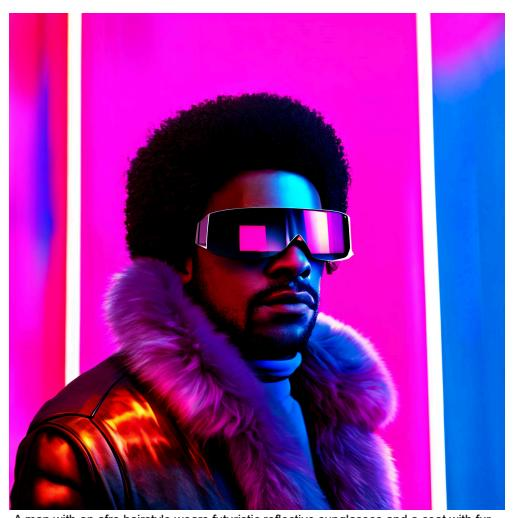
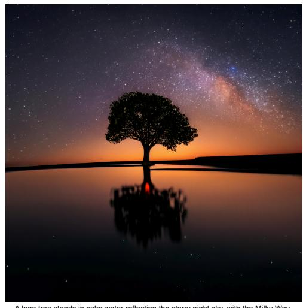
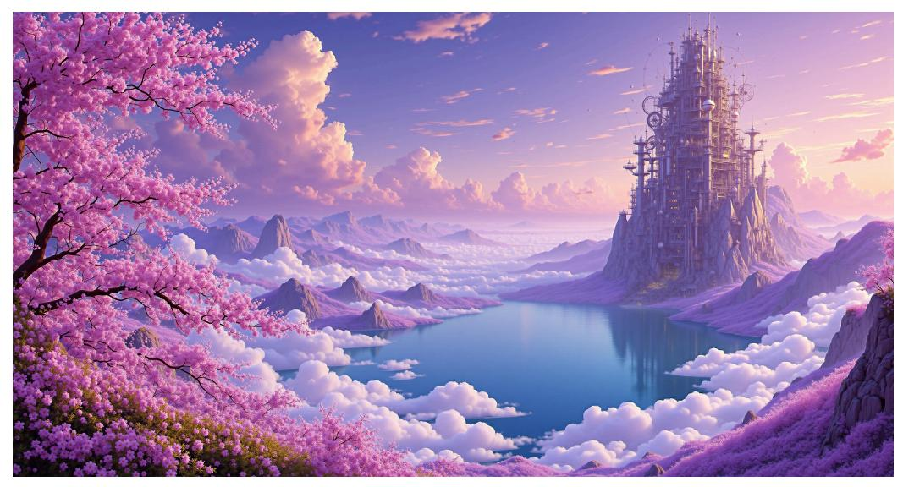
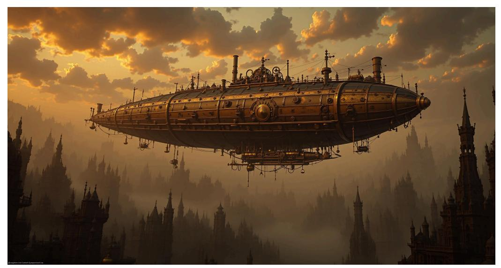
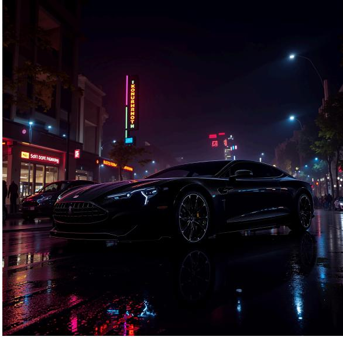
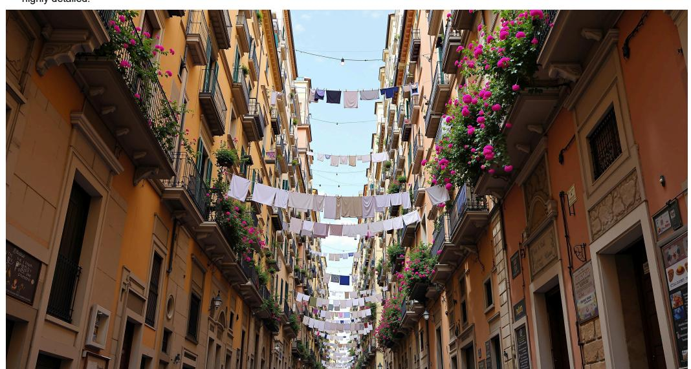
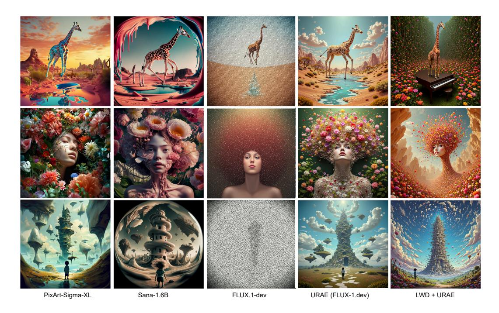

# A THEORETICAL AND IMPLEMENTATION DETAILS OF WAVELET-GUIDED MASKING

This section provides a detailed theoretical background on the Discrete Wavelet Transform (DWT) and its application in our framework, discusses specific implementation choices and hyperparameters, and analyzes the properties and trade-offs of our proposed method.

#### A.1 THEORETICAL FOUNDATION: DWT AND RELEVANCE MAPS

**Discrete Wavelet Transform (DWT).** The Discrete Wavelet Transform (DWT) decomposes a 2D signal, such as an image or a latent tensor, into orthogonal frequency subbands by applying separable cascades of low-pass and high-pass filters along both spatial dimensions. Given an input  $\mathbf{X} \in \mathbb{R}^{H \times W \times D}$ , a single-level DWT produces four spatial subbands:

- LL (Low-Low): Approximation coefficients capturing global structure and coarse semantics.
- LH (Low-High): Horizontal detail coefficients, sensitive to vertical edges.
- HL (High-Low): Vertical detail coefficients, highlighting horizontal edges.
- **HH** (High-High): Diagonal detail coefficients, encoding fine textures and high-frequency transitions.

Formally, the DWT of **X** is given by:

$$\mathrm{DWT}(\mathbf{X}) = \begin{cases} \mathrm{LL} = \mathbf{X} * h_{\mathrm{low}} \downarrow 2 * h_{\mathrm{low}} \downarrow 2 \\ \mathrm{LH} = \mathbf{X} * h_{\mathrm{low}} \downarrow 2 * h_{\mathrm{high}} \downarrow 2 \\ \mathrm{HL} = \mathbf{X} * h_{\mathrm{high}} \downarrow 2 * h_{\mathrm{low}} \downarrow 2 \\ \mathrm{HH} = \mathbf{X} * h_{\mathrm{high}} \downarrow 2 * h_{\mathrm{high}} \downarrow 2 \end{cases}$$

where  $h_{\text{low}}$ ,  $h_{\text{high}}$  are orthogonal wavelet filters (e.g., Haar or Daubechies), \* denotes convolution, and  $\downarrow 2$  indicates downsampling by a factor of 2.

**Relevance Map Construction.** To identify spatial regions that require enhanced refinement during generation, we compute a wavelet-based relevance map from the high-frequency subbands. Specifically, we calculate the aggregated energy of the directional detail coefficients:

$$M_{\text{relevance}} = LH^2 + HL^2 + HH^2$$

This yields a saliency map that highlights localized frequency-rich regions, such as edges, textures, and fine details. The relevance map is then resized to match the original latent resolution via bilinear interpolation and normalized to the range [0, 1]:

$$\mathbf{M}_{\text{norm}} = \frac{\mathbf{M}_{\text{relevance}} - \min(\mathbf{M}_{\text{relevance}})}{\max(\mathbf{M}_{\text{relevance}}) - \min(\mathbf{M}_{\text{relevance}}) + \epsilon}$$

where  $\epsilon$  is a small constant to avoid division by zero. The LL subband, which encodes coarse spatial content, offers limited information about local complexity and is thus excluded. In contrast, the aggregated energy of the LH, HL, and HH bands approximates the local gradient magnitude, similar in spirit to edge detectors like Sobel and Laplacian filters, and aligns with the intuition that visually salient regions often correspond to areas with rich high-frequency content. This approach is theoretically supported by prior work in multiscale signal analysis, which demonstrates that the local maxima of wavelet detail coefficients correspond to structural singularities and perceptual boundaries (Mallat & Hwang, 1992).

#### A.2 IMPLEMENTATION AND HYPERPARAMETERS

**Choice of Wavelet Basis.** We deliberately selected the Haar wavelet for its ideal trade-off of properties for our framework:

• **Computational Efficiency:** It is the most computationally efficient wavelet, minimizing training overhead.

- Preservation of Discontinuities: Its discontinuous nature makes it exceptionally effective at localizing and preserving sharp edges and contours.
- Sparsity and Non-Redundancy: Its orthogonality and compact support induce sparse, non-redundant representations, making our energy maps precise and ideal for our masking strategy.

Comparative Analysis with Other Transforms. To empirically validate the selection of Haar wavelets over other frequency analysis methods, we conducted a rigorous ablation study comparing our approach against Daubechies wavelets (db2) and FFT-based High-Pass filtering. The results are summarized in Table [5.](#page-18-0)

Two key principles dictate the superior performance of Haar in this context:

- 1. Spatial Localization: LWD requires a spatially precise mask Mt(i, j) to target specific latent regions. While global transforms like FFT/DCT provide excellent frequency resolution, they sacrifice spatial localization; a high-frequency coefficient corresponds to periodic patterns across the entire image, not specific positions. Recovering spatial energy maps via inverse transformation introduces Gibbs ringing near sharp transitions. These artifacts cause signal leakage into neighboring latent positions, blurring the mask and degrading texture precision (GLCM 0.71 vs 0.74).
- 2. Compact Support: Among wavelets, Haar has the most compact support (2 coefficients), minimizing cross-position interference. This is critical for generating sharp binary training masks. Smoother wavelets (e.g., Daubechies) introduce wider receptive fields, creating "gray areas" at mask boundaries that dilute supervision without semantic benefit.

As shown in Table [5,](#page-18-0) while FFT is computationally faster due to hardware optimizations, the spatial artifacts degrade generation quality (FID 39.45). Haar achieves the optimal balance, outperforming Daubechies in both efficiency and final texture fidelity.

Table 5: Ablation of Frequency Decomposition Methods. Comparison on Diffusion4k backbone (Aesthetic dataset, 2048 × 2048).

| Method              | Cost (ms) ↓ | FID ↓ | Aesthetics ↑ | GLCM ↑ |
|---------------------|-------------|-------|--------------|--------|
| LWD (Haar)          | 1.136       | 38.74 | 6.17         | 0.74   |
| LWD (Daubechies)    | 1.274       | 38.92 | 6.14         | 0.73   |
| LWD (FFT High-Pass) | 0.875       | 39.45 | 6.08         | 0.71   |

Wavelet Masking Lower Bound. The primary hyperparameter for our wavelet masking strategy is the lower bound l. The value l = 0.3 was chosen based on an ablation study (Table [6\)](#page-18-1). This study revealed a clear trade-off: a very low value (e.g., l < 0.1) can cause smooth regions to be under-trained, while a very high value (e.g., l > 0.7) diminishes the benefit of targeted refinement, causing performance to regress towards the baseline. The value l = 0.3 was found to be a robust sweet spot.

Table 6: Ablation on the Masking Lower Bound (l).

| Masking Lower Bound (l) | FID ↓ | GLCM Score ↑ | CLIPScore ↑ |  |
|----------------------------|-------|--------------|-------------|--|
| 0.0                        | 34.15 | 0.68         | 0.5411      |  |
| 0.1                        | 33.21 | 0.72         | 0.5420      |  |
| 0.3                        | 32.88 | 0.74         | 0.5423      |  |
| 0.5                        | 33.46 | 0.71         | 0.5419      |  |
| 0.7                        | 34.02 | 0.69         | 0.5407      |  |
|                            |       |              |             |  |

Intuition for the Masking Strategy. The time-dependent masking schedule is designed to allocate more training attention to structurally rich regions of the image, which are identified via higher wavelet energy. The schedule ensures that these areas are refined over more training steps, while still providing a minimum level of supervision to all regions. This enhances high-frequency details without overfitting to them.

#### A.3 ANALYSIS OF METHOD PROPERTIES AND TRADE-OFFS

Preservation of Global Structure. Our wavelet-masked loss is designed to preserve global coherence. The masking computation targets only the high-frequency subbands (LH, HL, HH), which encode localized detail. The LL subband, which captures low-frequency, global structure, is not involved. This ensures that while local refinement is emphasized, the global scene layout and object structure remain intact.

Robustness and Potential Artifacts. Our wavelet-based masking strategy is agnostic to the source of high-frequency information and has proven robust across diverse scenes without introducing noticeable artifacts. The VAE fine-tuning stage is key to this stability, as it regularizes the latent space to ensure that the high-frequency energy used for masking corresponds to meaningful content rather than spurious signals. While we have not observed failure cases in our benchmarks, investigating domain-specific behavior is an important direction for future work.

On the Synergy of Frequency Suppression and Utilization. A natural question arises from the apparent tension between our use of a multi-scale VAE loss to suppress spurious high-frequency components, and our later use of high-frequency energy to guide the adaptive masking. These two strategies serve complementary and sequential roles. The VAE loss does not eliminate all highfrequency content; rather, it penalizes frequency components inconsistent across scales, which often correspond to noise or artifacts. This regularization aligns the latent spectral distribution more closely with that of clean, natural images.

Crucially, it is precisely this filtered latent space that makes our frequency-based attention meaningful. Once the latent tensor is regularized, the remaining high-frequency energy (extracted via DWT) is more strongly correlated with visually salient features like edges and textures. In other words, by denoising the latent representation, the VAE enhances the signal-to-noise ratio of our wavelet attention mechanism. This sequential design, first purifying the latent space, then exploiting its structured frequency characteristics, ensures our method combines signal-domain regularization and content-adaptive computation in a synergistic manner.

## B ADDITIONAL RESULTS FOR 4K

To assess the efficacy of our proposed Latent Wavelet Diffusion (LWD), we conduct a detailed evaluation focusing on the challenging 4K resolution (4096×4096).

#### B.1 QUANTITATIVE RESULTS

Table [7](#page-23-0) presents the quantitative comparison on 4K image generation. We evaluate the generated images using several key metrics: MAN-IQA [\(Yang et al., 2022\)](#page-15-11) and QualiCLIP [\(Agnolucci et al.,](#page-11-12) [2024\)](#page-11-12), which assess perceptual image quality and alignment with textual prompts, respectively. Additionally, we compute the GLCM (Gray-Level Co-occurrence Matrix) score as a measure of texture complexity and detail richness in the generated high-resolution outputs. Finally, we report the Compression Ratio, indicating the compressibility of the generated images, which can be indicative of redundancy or lack of fine details.

Our LWD-enhanced URAE demonstrates competitive performance across all evaluated metrics. Notably, it achieves the highest MAN-IQA score and GLCM score, suggesting superior perceptual quality and richer textural details compared to the baselines. Furthermore, our LWD + URAE achieves a favorable Compression Ratio (28.77), better than URAE and PixArt-Sigma-XL, suggesting a good balance between detail and redundancy. These quantitative results underscore the effectiveness of our LWD approach in enhancing the visual quality and detail of images generated at 4K resolution.

A man with an afro hairstyle wears futuristic reflective sunglasses and a coat with fur lining, standing in front of a vibrant pink and blue neon sign.

A lone tree stands in calm water reflecting the starry night sky, with the Milky Way stretching above and warm orange hues from a distant horizon.

A young astronaut in a light-colored suit stands in a vibrant field of wildflowers, holding a helmet and gazing downward, with a warm, glowing sunset in the background.

A person wearing a Spider-Man suit in the game Half-Life Alyx."

Figure 6: Images generated at 4K resolution with LWD+SANA.

A surreal landscape depicting an ethereal fusion of natural beauty and fantastical architecture, reminiscent of Salvador Dali's dreamlike paintings. From above the clouds, one gazes upon a colossal tower emerging from the earth, its intricate gears visible as it merges seamlessly with a tranquil mountain lake. The scene is bathed in an otherworldly glow, casting lavender and gold hues across the sky, while delicate cherry blossoms flutter gently in the foreground, adding a sense of serenity to this breathtaking vision where time and nature intertwine.

Steampunk airship floating above a misty Victorian cityscape, intricate brass and copper mechanical details, golden hour lighting, billowing clouds, detailed architectural elements, rich warm color palette, cinematic composition.

Figure 7: Images generated at 4K resolution with LWD+URAE.

A sleek black luxury sedan parked on a rain-soaked city street at night, reflecting neon lights from nearby buildings. The wet pavement glistens, and the car's smooth curves are highlighted by the ambient glow of the urban environment.

Girl with pink hair, vaporwave style, retro aesthetic, cyberpunk, vibrant, neon colors, vintage 80s and 90s style, highly detailed.

A narrow and picturesque alley in the historic center of Naples, with laundry hanging out to dry between flower-filled balconies and the inviting aroma of freshly baked pizza in the air.

Figure 8: Images generated at 4K resolution with LWD+URAE.

Figure 9: Visual comparison of 4K image generations from LWD and competing baselines.

#### **B.2** QUALITATIVE ANALYSIS

To complement the quantitative evaluation, Figures 10, 11, 13, and 12 provide a qualitative comparison of LWD against selected baselines, presenting side-by-side comparisons of the generated images.

The visual comparisons highlight the benefits of our LWD enhancement. Our method demonstrates the generation of images with finer and more intricate details, particularly noticeable in complex textures and object boundaries. These qualitative observations align with our quantitative findings, reinforcing the effectiveness of the proposed LWD for high-resolution image generation.

Table 7: Evaluation on ultra resolution ( $4096 \times 4096$ ) image generation task with (Wu et al., 2023) prompts.

| Method                              | MAN-IQA (↑) | QualiCLIP (†) | GLCM Score ↑ | Compression Ratio ↓ |
|-------------------------------------|-------------|---------------|--------------|---------------------|
| PixArt-Sigma-XL (Chen et al., 2024) | 0.2935      | 0.2308        | 0.48         | 45.15               |
| Sana-1.6B (Xie et al., 2025)        | 0.3288      | 0.4979        | 0.71         | 25.89               |
| FLUX-1.dev (Labs, 2024)             | 0.3673      | 0.2564        |              | -                   |
| URAE (Yu et al., 2025)              | 0.3850      | 0.3758        | 0.41         | 38.86               |
| LWD + URAE                          | 0.4011      | 0.3855        | 0.74         | <u>28.77</u>        |

**Selection Protocol** All qualitative examples shown in the paper were generated following a strict, reproducible protocol to prevent cherry-picking. Prompts were sourced directly from the original papers of the baseline models (e.g., URAE, Diffusion-4K) or the HPD benchmark dataset. For each prompt, the displayed image is the first output generated using a fixed random seed, applied identically to both the baseline and our LWD-enhanced model. We have included our code in the supplementary materials to ensure full transparency. While subjective preferences for certain images may vary, our method consistently improves objective indicators of texture and detail.

#### C Frequency-Aware Evaluation

To rigorously assess the frequency characteristics of generated images, we propose a suite of frequency-sensitive metrics that extend beyond standard perceptual scores. These metrics are designed to quantify the degree to which generated images preserve the natural frequency distribution

Figure 10: 4K generation of URAE vs LWD + URAE. Upper caption: *"Eiffel Tower was Made up of more than 2 million translucent straws to look like a cloud, with the bell tower at the top of the building, Michel installed huge foam-making machines in*

*the forest to blow huge amounts of unpredictable wet clouds in the building's classic architecture."*.

Lower caption: *"Barbarian woman riding a red dragon, holding a broadsword, in gold armour."*

observed in real images, with particular attention to the presence and quality of high-frequency details.

High/Low Frequency Ratio (HLFR): We decompose each image using a 2D discrete wavelet transform (DWT) and compute the total energy in the detail coefficients (high-frequency subbands: LH, HL, HH) and in the approximation coefficients (low-frequency LL subband). The HLFR is defined as the ratio of high-frequency to low-frequency energy:

$$\text{HLFR} = \frac{E_{LH} + E_{HL} + E_{HH}}{E_{LL}}.$$

This ratio reflects the relative emphasis on fine-scale structures. A value similar to the reference (real images) indicates a natural distribution of frequency content. Large deviations can signal oversmoothing or hallucinated detail.

Ratio Difference from Real (RDR): To quantify deviation from the natural HLFR, we compute the absolute difference between the HLFR of the generated image and the real reference:

$$RDR = \left| HLFR_{gen} - HLFR_{real} \right|.$$

Lower values are better, indicating better alignment with the natural frequency distribution.

Wavelet Quality Score (WQS): This metric evaluates the structural similarity between generated and real images in the wavelet domain, where frequency components are explicitly separated by scale and orientation. Given a multi-level discrete wavelet transform (DWT) of both the generated image Ig and the reference image Ir, we compute the SSIM and MSE for each corresponding subband s across all decomposition levels l. The final WQS aggregates the per-subband scores using frequency-aware weights:

$$\text{WQS} = \sum_{l=1}^{L} \sum_{s \in \{LL, LH, HL, HH\}} w_{l,s} \cdot \text{SSIM}(I_r^{l,s}, I_g^{l,s}) - \lambda \cdot \text{MSE}(I_r^{l,s}, I_g^{l,s}),$$

where wl,s are weights that can prioritize perceptually important subbands (e.g., low-frequency LL or high-frequency HH), and λ is a scaling factor that penalizes distortion. The score is normalized to [0, 1], where 1 indicates perfect structural alignment. Higher WQS values reflect better reconstruction fidelity across frequency scales, meaning the model preserves both coarse structure and fine texture.

High-Frequency Energy (HFE): This metric quantifies the total energy of the image's high-frequency components after wavelet decomposition. For a given decomposition level, we define:

$$\label{eq:HFE} \text{HFE} = \sum_{l=1}^{L} \left( \|I^{l,LH}\|^2 + \|I^{l,HL}\|^2 + \|I^{l,HH}\|^2 \right).$$

This value provides an absolute measure of fine-scale activity in the image. While real images have characteristic HFE ranges, excessive HFE may indicate artifacts or noise, and too little HFE suggests oversmoothing. Alignment with the real HFE is typically ideal.

High-Frequency Emphasis Index (HFEI): This metric evaluates how much the model over- or under-emphasizes high-frequency content relative to the real distribution. We define it as:

$$HFEI = \left(\frac{HFE_{gen}}{TotalEnergy_{gen}}\right) - \left(\frac{HFE_{real}}{TotalEnergy_{real}}\right),$$

where total energy is computed over all wavelet subbands. HFEI > 0 indicates the generated image places more emphasis on high frequencies than real images (potentially hallucinated detail), while HFEI < 0 indicates a loss of fine detail. An HFEI near zero is ideal.

Perceptual Metrics: For completeness, we also report FSIM [\(Zhang et al., 2011\)](#page-16-4) and MS-SSIM [\(Wang et al., 2003\)](#page-15-12), which capture visual similarity and structural coherence, respectively. Both metrics are bounded between 0 and 1, with higher values indicating better perceptual quality.

Figure 11: 2K generation of PixArt-Sigma-XL vs LWD + PixArt-Sigma-XL. Upper caption: *"An elderly man with a prominent, bushy beard and deep-set eyes wears a vibrant orange turban, his weathered face marked by lines of age and experience."*. Lower caption: *"A lone figure on a horse stands in a misty forest, gazing up at a tall, multi-tiered temple surrounded by towering trees and soft, diffused light. Steam rises from the rocks near a stream, creating an atmospheric scene of tranquility and mystery."*

Figure 12: 4K generation of Sana vs LWD + Sana. Upper caption: *"A litter of golden retriever puppies playing in the snow. Their heads pop out of the snow, covered in."*. Lower caption: *"A curvy timber house near a sea, designed by Zaha Hadid, represent the image of a cold, modern architecture, at night, white lighting, highly detailed."*

Results: Table [8](#page-29-0) summarizes the performance of diffusion backbones, along with their respective versions enhanced with LWD. LWD consistently improves frequency alignment: for instance, the LWD+Diff4K variant achieves a high/low frequency ratio of 0.0556, nearly identical to the real reference (0.0560), while also minimizing the ratio difference (0.0438). Wavelet Quality Scores improve in both cases, and the HF energy is more tightly controlled, preventing oversharpening. Importantly, LWD preserves or improves FSIM and MS-SSIM, confirming that frequency fidelity does not come at the expense of perceptual quality. These results demonstrate that LWD enhances the frequency realism of generated images in a measurable and interpretable way, offering a principled approach to frequency-aware image synthesis.

## D HYPERPARAMETERS DETAILS AND PERFORMANCES

Training Configurations and Computational Cost All models were trained on NVIDIA A100 GPUs. VAE fine-tuning was performed for 60K steps with a batch size of 4 and a learning rate of 1 × 10−53. Table [9](#page-29-1) details the specific training requirements for each backbone architecture.

Figure 13: 2K generation of SD3-Diff4k-F16 vs LWD + SD3-F16. Upper caption: *"A serene landscape features a winding river, flanked by trees with autumn foliage, leading to a rustic wooden cabin with a corrugated roof, set against a softly blurred background."*. Lower caption: *"A grand interior featuring intricate stained glass windows, an elaborate rose window, ornate frescoes depicting biblical scenes, and elegant chandeliers illuminating the richly decorated walls and arches."*

Table 8: Comparison of frequency-sensitive metrics across different methods on Aesthetic-4K [\(Zhang](#page-16-0) [et al., 2025\)](#page-16-0) validation set.

| Metric                              | HLFR   | RDFR ↓ | WQS ↑  | HFE    | HFEI ↓ | FSIM ↑ | MS-SSIM ↑ |
|-------------------------------------|--------|--------|--------|--------|--------|--------|-----------|
| Real                                | 0.0560 | 0.0000 | 1.0000 | 0.0140 | 0.0000 | 1.0000 | 1.0000    |
| Sana-1.6B (Xie et al., 2025)        | 0.0784 | 0.0558 | 0.4673 | 0.0196 | 0.6108 | 0.6128 | 0.1324    |
| LWD + Sana-1.6B                     | 0.0610 | 0.0537 | 0.4701 | 0.0144 | 0.5227 | 0.6217 | 0.1324    |
| SD3-Diff4k-F16 (Zhang et al., 2025) | 0.0691 | 0.0470 | 0.4624 | 0.0158 | 0.8064 | 0.6155 | 0.1296    |
| LWD + SD3-F16                       | 0.0555 | 0.0437 | 0.4735 | 0.0144 | 0.4826 | 0.6245 | 0.1521    |
| PixArt-Sigma-XL                     | 0.0550 | 0.0409 | 0.4763 | 0.0119 | 0.6296 | 0.1354 | 0.4255    |
| LWD + PixArt-Sigma-XL               | 0.0564 | 0.0500 | 0.4730 | 0.0150 | 0.6239 | 0.1478 | 0.5094    |

Table 9: Training configurations and efficiency gains for LWD across different backbones.

| Backbone           | Res.      | Batch Size | Iterations | Training Time |
|--------------------|-----------|------------|------------|---------------|
| LWD + URAE (Flux)  | 2048      | 1          | 2k         | ∼4 hours      |
| LWD + URAE (Flux)  | 4096      | 1          | 2k         | ∼24 hours     |
| LWD + Diff4K (SD3) | 2048      | 8          | 10k        | ∼48 hours     |
| LWD + SANA         | 2048/4096 | 2/1        | 33k        | ∼24 hours     |
| LWD + PixArt-Σ     | 2048      | 2          | 1.5k       | ∼24 hours     |

Hyperparameters All experiments were conducted on a system with 4 NVIDIA A100 GPUs. Our VAE fine-tuning objective (Equation [1\)](#page-4-0) balances four terms. The weights were adopted from prior work [\(Wu et al., 2023\)](#page-15-10), which provides extensive validation for these values. Following established practice, we set the weights to α = 0.25, β = 0.001, and λ = 0.05.

Training Overhead LWD introduces a marginal overhead during training. The minor increase in peak GPU memory usage (Table [10\)](#page-29-2) is due to the storage of intermediate tensors for the wavelet transform and energy masks. These tensors are small (the size of the latent map) and their memory footprint is insignificant compared to the large diffusion model backbone.

Table 10: Computational Overhead Analysis during training on a single A100 GPU (64GB).

| Method     | Mem. Usage (%) | Mem. Usage (GB) | Time per 20 Steps (s) |
|------------|----------------|-----------------|-----------------------|
| Sana       | 90.5           | 57.9            | ∼47                   |
| Sana + LWD | 93.9           | 60.1            | ∼47                   |

Another key advantage of LWD is its efficiency. It is a training-only strategy that requires zero architectural modifications. Consequently, an LWD-enhanced model has the exact same number of parameters and identical inference time as its baseline counterpart.