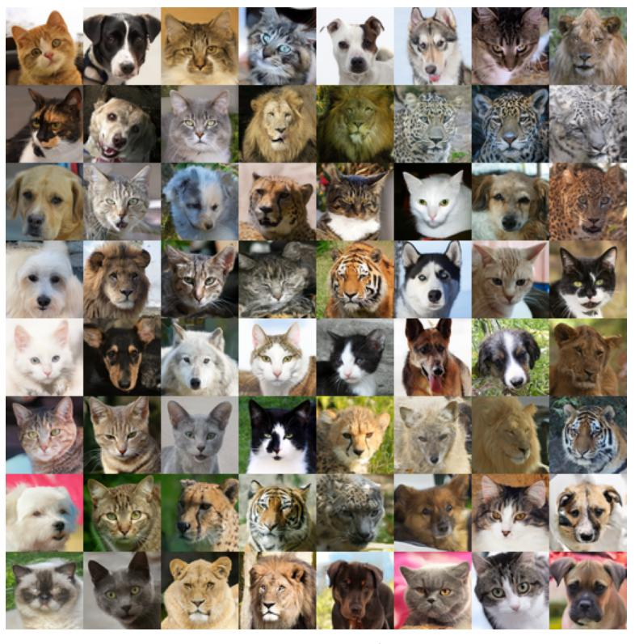
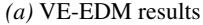
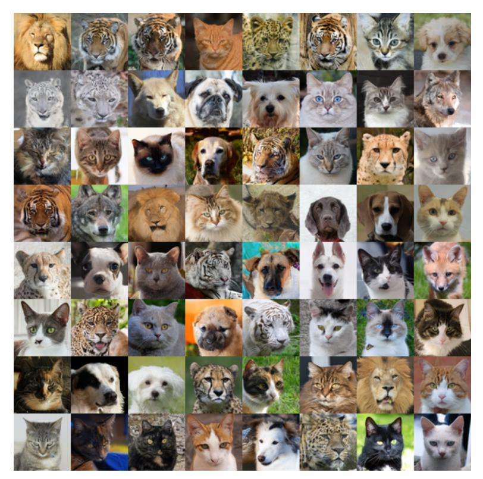
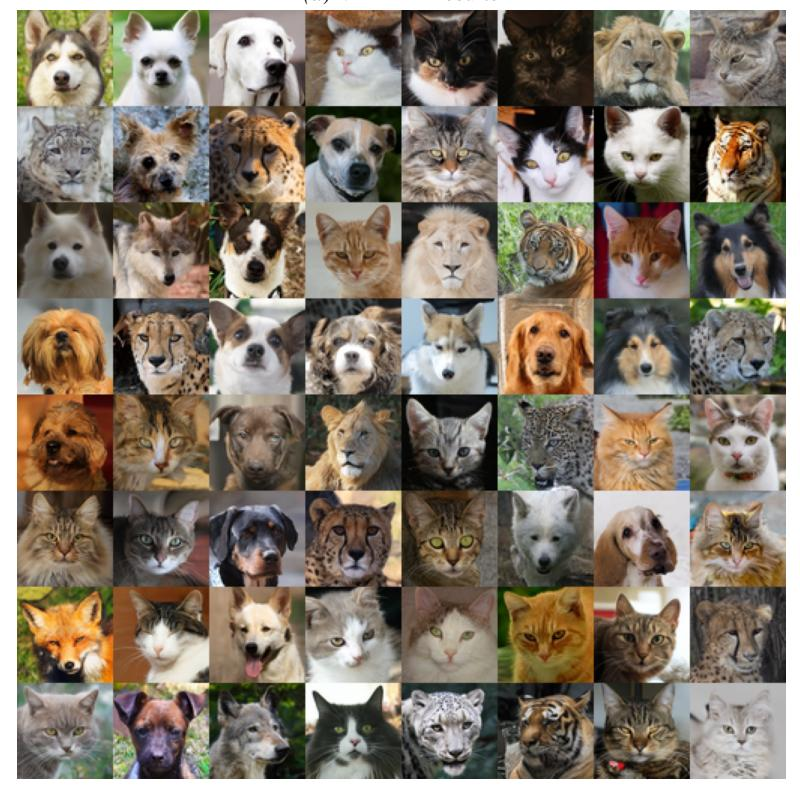
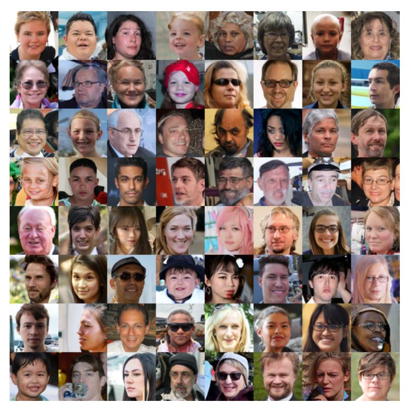
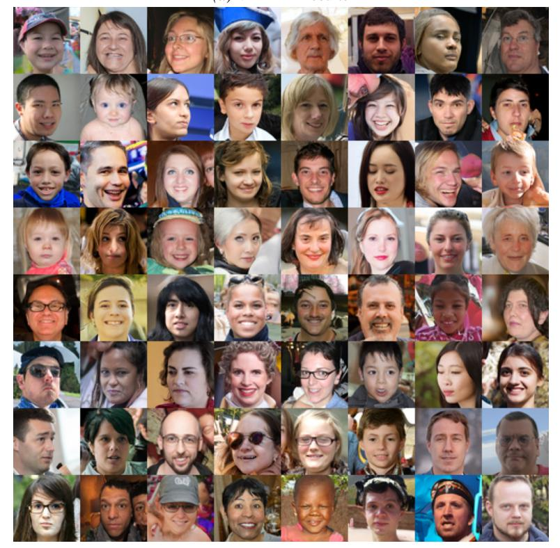
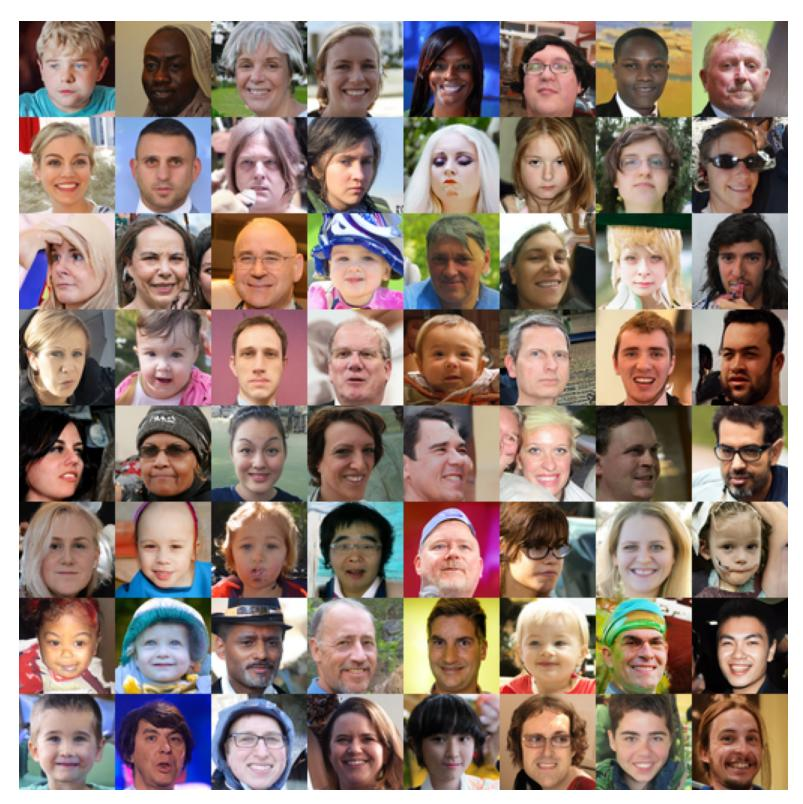
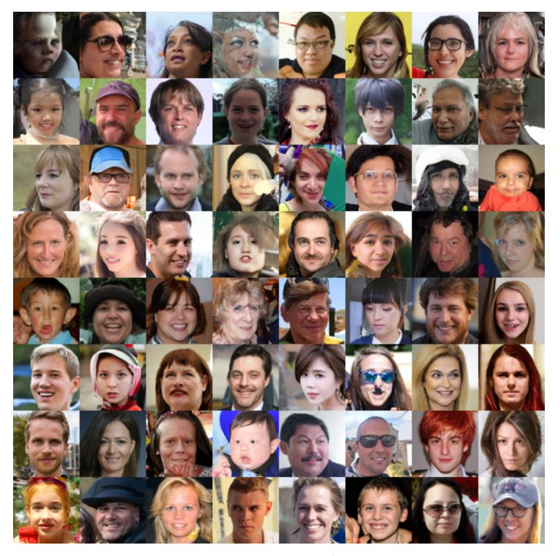
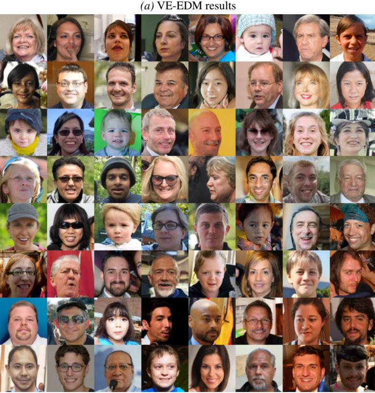

# C. Generated Images for AFHQ and FFHQ

Here we present some selected image samples from our models.

*(b)* VP-EDM results

*Figure 3.* Generated AFHQ samples obtained by fine-tuning with the unweighted Fourier amplitude loss under different EDM formulations.

*(b)* VP-EDM results

*Figure 4.* Generated AFHQ samples obtained by fine-tuning with the unweighted Fourier amplitude+phase loss under different EDM formulations.

*(a)* VE-EDM results

*(b)* VP-EDM results

*Figure 5.* Generated AFHQ samples obtained by fine-tuning with the unweighted Haar wavelet loss under different EDM formulations.

*(b)* VP-EDM results

*Figure 6.* Generated AFHQ samples obtained by fine-tuning with the unweighted bi-orthogonal 1.3 wavelet loss under different EDM formulations.

*(a)* VE-EDM results

*(b)* VP-EDM results

*Figure 7.* Generated FFHQ samples obtained by fine-tuning with the unweighted Fourier amplitude loss under different EDM formulations.

*(a)* VE-EDM results

*(b)* VP-EDM results

*Figure 8.* Generated FFHQ samples obtained by fine-tuning with the unweighted Fourier amplitude+phase loss under different EDM formulations.

*(a)* VE-EDM results

*(b)* VP-EDM results

*Figure 9.* Generated FFHQ samples obtained by fine-tuning with the unweighted Haar wavelet loss under different EDM formulations.

*(b)* VP-EDM results

*Figure 10.* Generated FFHQ samples obtained by fine-tuning with the unweighted bi-orthogonal 1.3 wavelet loss under different EDM formulations.