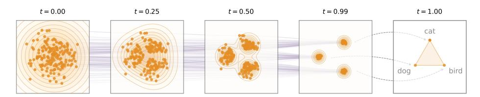

# 1 Introduction

Diffusion models [63, 64, 26] and flow-based models [37, 38, 3] have become prominent paradigms for generating continuous data, demonstrating strong performance at synthesizing images, videos, and data in other continuous domains. These advances have driven growing interest in extending diffusion methods to language modeling, leading to extensive work on diffusion language models (DLMs). DLMs are commonly formulated in one of two ways: continuous or discrete. Continuous DLMs map discrete tokens into continuous representations and perform denoising in the resulting continuous space [34, 13, 19]. Discrete DLMs, in contrast, operate directly in token space and formulate a probabilistic diffusion model over discrete random variables [5, 23, 40, 56, 57]. Recent progress in DLMs has been mostly in the discrete regime, in large part due to the stronger empirical performance of discrete DLMs [33, 48, 76, 58]. But it remains an open question whether the current performance gap of continuous DLMs is due to the inherently discrete nature of language modeling or to underexplored algorithmic design choices.

In this work, we introduce Embedded Language Flows (**ELF**), a class of continuous DLMs based on Flow Matching [37, 38, 3]. ELF is continuous in two senses. First, it operates in *continuous* 

Figure 2: Conceptual illustration of ELF. Orange points denote data represented in continuous embedding space, and purple lines show denoising trajectories from Gaussian noise to clean embeddings. Discretization is applied only at the final time step (t = 1) using a shared-weight network.

*embedding* space by directly denoising continuous representations throughout the flowing process, with discretization considered only at the final time step. Second, it is formulated with *continuous time*, following Flow Matching [\[37,](#page-11-0) [38,](#page-11-1) [3\]](#page-9-0), which allows us to define the velocity field via the time derivative. This formulation enables ELF to benefit from advances in Flow Matching, which is now widely used to instantiate diffusion models in image and video generation [\[43,](#page-11-4) [14,](#page-9-3) [6,](#page-9-4) [70\]](#page-12-5).

Following Latent Diffusion Models (LDM) [\[54\]](#page-11-5), ELF constructs the continuous embedding space by applying an encoder model to the input discrete tokens. The encoder can be pretrained, jointly trained, or frozen with random weights. *Unlike* latent diffusion, ELF does not require a separate decoder and thus introduces no additional component at inference time. This design is based on the observation that the final time step in Flow Matching can be naturally repurposed to map continuous embeddings back to discrete tokens, eliminating the need for an explicit decoder. As such, a shared-weight network is trained to perform denoising at all but the final step, and decoding (i.e. discretization) at the final step (see Fig. [2\)](#page-1-0).

ELF builds on prior continuous DLMs, but aims for a minimalist design that addresses the interface between continuous and discrete spaces. In contrast to pioneering works on continuous DLMs [\[34,](#page-10-1) [13,](#page-9-1) [19\]](#page-10-2) and many others that employ a per-step discretization loss (*e.g.*, cross-entropy), ELF performs denoising in continuous embedding space at nearly all steps, thereby offering maximal flexibility for the flow dynamics. And unlike latent diffusion methods [\[41,](#page-11-6) [45,](#page-11-7) [62\]](#page-12-6), which typically operate in a *compressed* latent space and rely on a separate decoder, ELF directly operates in a high-dimensional latent space [\[32\]](#page-10-5) and requires no extra decoder.

Empirically, we show that ELF outperforms leading methods on discrete DLMs and existing continuous DLMs (Fig. [1\)](#page-0-0), following the evaluation protocols established in those works. ELF achieves better generation quality with fewer sampling steps than leading discrete DLMs (*e.g.*, MDLM [\[56\]](#page-12-2) and Duo [\[57\]](#page-12-3)) and concurrent continuous DLMs (*e.g.*, FLM [\[30\]](#page-10-6) and LangFlow [\[10\]](#page-9-5)). Moreover, ELF achieves this performance using 10× *fewer* training tokens and *without* any distillation. We further show that ELF performs strongly on machine translation [\[7\]](#page-9-6) and summarization [\[46\]](#page-11-8). Overall, these results suggest that continuous DLMs can be highly competitive while requiring only minimal treatment of discretization, offering a promising direction for diffusion-based language modeling.

