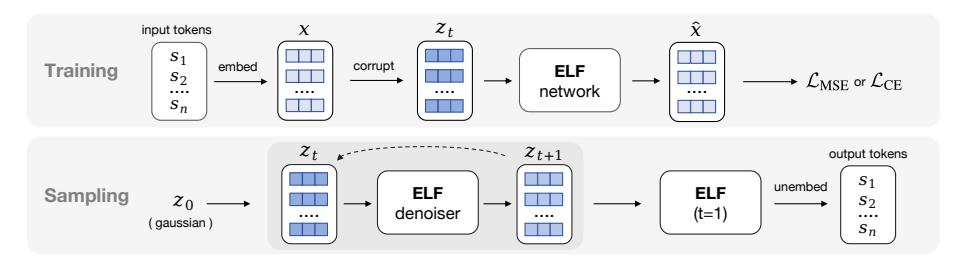
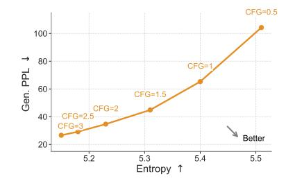
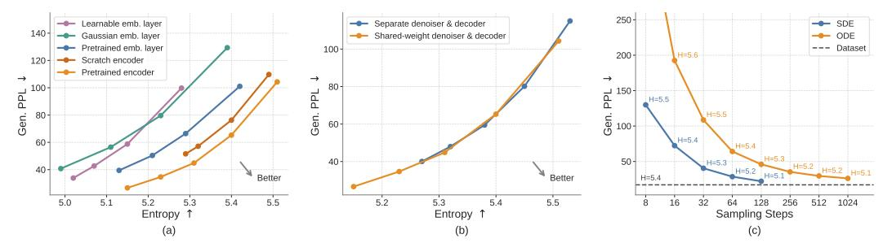
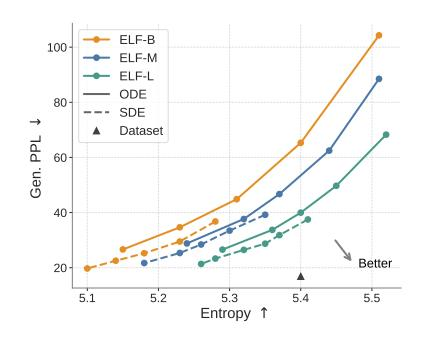
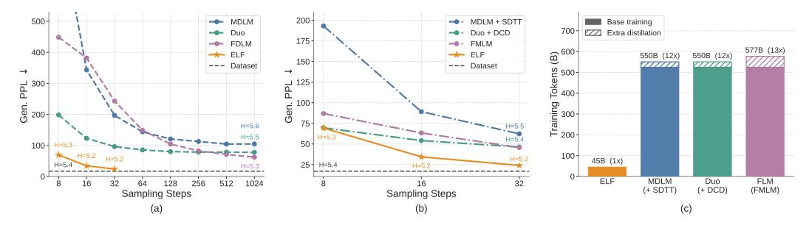
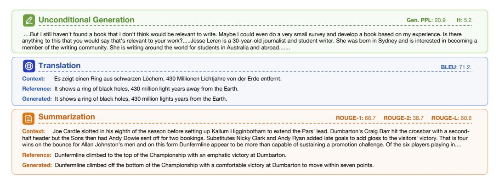

# 2 Background & Related Work

Diffusion-/Flow-based models. Diffusion models [\[63,](#page-12-0) [26,](#page-10-0) [64\]](#page-12-1) and flow-based models [\[37,](#page-11-0) [38,](#page-11-1) [2\]](#page-9-7) transform noise into data through ordinary or stochastic differential equations (ODEs/SDEs). In DDPM-style formulations, generation is defined by transitions between successive states [\[63,](#page-12-0) [26,](#page-10-0) [47\]](#page-11-9), which may be discrete or continuous. Discrete states require categorical transition distributions, as in discrete DLMs [\[5,](#page-9-2) [56\]](#page-12-2); continuous states are commonly modeled through score or noise prediction under Gaussian corruption [\[64,](#page-12-1) [26,](#page-10-0) [14\]](#page-9-3). Flow Matching extends this view to continuous time by learning the velocity field along a continuous path [\[37,](#page-11-0) [38,](#page-11-1) [2\]](#page-9-7), where noise, data, and velocity predictions can be reparameterized into one another [\[14,](#page-9-3) [32\]](#page-10-5). Our method adopts Flow Matching to formulate language generation in continuous embedding space and continuous time.

Continuous diffusion language models. Continuous DLMs map discrete tokens to a continuous space to perform denoising. *Embedding-space* methods, such as Diffusion-LM [\[34\]](#page-10-1), CDCD [\[13\]](#page-9-1), and DiffuSeq [\[19\]](#page-10-2), add Gaussian noise directly to token embeddings [\[66,](#page-12-7) [79,](#page-13-1) [21,](#page-10-7) [72,](#page-12-8) [77,](#page-13-2) [36,](#page-11-10) [74,](#page-13-3) [15\]](#page-9-8). A complementary direction studies *simplex-based* representations, including SSD-LM [\[22\]](#page-10-8) and TESS [\[44,](#page-11-11) [68\]](#page-12-9), as well as related manifold-based formulations [\[27\]](#page-10-9). Although these methods provide

<span id="page-2-1"></span><span id="page-2-0"></span>

Figure 3: **During training**, discrete tokens are encoded into clean embeddings x and corrupted to  $z_t$ , which ELF uses to predict  $\hat{x}$ . The model is trained with either the denoising loss  $\mathcal{L}_{MSE}$  or the token-wise cross-entropy loss  $\mathcal{L}_{CE}$ . **During inference**, ELF starts from Gaussian noise  $z_0$  and iteratively denoises embeddings from  $z_t$  to  $z_{t+1}$ . Only at the final step does ELF switch to decoding mode and project the final embeddings back to discrete tokens through an unembedding layer.

continuous relaxations of discrete tokens, their trajectories often remain tied to the discrete token space through mechanisms such as rounding losses, simplex constraints, and token-level cross-entropy objectives. In contrast, ELF denoises entirely in continuous embedding space without per-step token-level supervision and discretizes only at the final step.

Another line applies *latent diffusion* to frozen encoder representations, represented by LD4LG [41] and follow-up work [81, 59, 42, 45, 62]. Like many diffusion methods described above, these approaches typically follow DDPM-style or score-based formulations with DDPM noise schedules [26, 47], and additionally rely on a separately trained decoder to recover tokens. In contrast, ELF uses a continuous-time Flow Matching formulation with a linear (rectified-flow) interpolant [37, 38, 2], and does not require a separate decoder. This brings flow-based training and sampling into language diffusion, allowing ELF to benefit from recent advances in Flow Matching.

Several concurrent works also revisit continuous flow-based language modeling. DFM [51], CFM [55], FLM/FMLM [30], and LangFlow [10] all incorporate token-level cross-entropy supervision along the flow trajectory, though they differ in the continuous state space, including simplex space, one-hot token encodings, and embedding space. Some of these methods further introduce distillation for few-step generation, such as distilled DFM/CFM and FMLM. In contrast, ELF keeps the denoising trajectory entirely in an unrestricted continuous embedding space, applying token-level supervision only at the final decoding step. A more comprehensive survey is provided in Appendix A.

**Discrete diffusion language models.** Due to the discrete nature of language, another line of work applies diffusion directly in token space. D3PMs [5] define general discrete corruption processes, including absorbing and uniform transitions. Masked diffusion models, such as MDLMs [56], use a special [MASK] absorbing state and generate samples through iterative unmasking [23, 48, 76]. Subsequent work improves sampling and efficiency through remasking, adaptive inference [71, 73], and semi-autoregressive block diffusion, including E2D2 [4]. Uniform-state diffusion models, such as Duo [57], instead diffuse tokens toward a uniform categorical distribution, enabling repeated token revision during inference [57, 12, 58]. Recent studies further scale discrete DLMs and extend them to code and multimodal generation [20, 65, 75, 78, 31]. Overall, discrete diffusion models currently remain the dominant paradigm in diffusion-based language modeling [33].

## 3 Embedded Language Flows

In this section, we present our flow-based formulation for language modeling (Fig. 3). Our method leverages the iterative nature of flow models to perform denoising primarily in continuous embedding space, converting clean embeddings back to discrete tokens only at the final step. Following prior work [56, 57, 30, 10], we describe our method in the simpler setting of unconditional generation. The framework can be extended to conditional generation, as discussed in Sec. 3.3.

#### 3.1 The ELF Framework

From discrete tokens to continuous embeddings. To apply continuous diffusion to language, we first map discrete tokens to continuous representations. Given a sentence, we tokenize it into a sequence of tokens  $s = [s_1, \dots, s_L] \in V^L$ , where each  $s_i$  is drawn from the vocabulary V

<span id="page-3-2"></span>and L denotes the sequence length. We then map the discrete token sequence into a continuous embedding space. The choice of the embedding method is flexible. By default, we use a pretrained T5 encoder [53] for bidirectional contextual embeddings. We also explore other jointly trained and randomized embeddings (see Sec. 4.1). The encoder is only used during training, which does not incur additional modules at inference.

Flow Matching on continuous embeddings. After obtaining continuous language representations, we formulate the denoising process in the resulting embedding space using Flow Matching [37, 38, 3]. Flow Matching defines a continuous flow path from noise to data in this space. Let  $\boldsymbol{x} \sim p_{\text{data}}(\boldsymbol{x})$  denote the embedding distribution and  $\boldsymbol{\epsilon} \sim p_{\text{noise}}(\boldsymbol{\epsilon})$  denote the noise distribution (e.g.,  $\boldsymbol{\epsilon} \sim \mathcal{N}(0, \mathbf{I})$ ). The noisy latent variable is defined by linear interpolation ("rectified flows"):  $\boldsymbol{z}_t = t\boldsymbol{x} + (1-t)\boldsymbol{\epsilon}$ , where  $t \in [0,1]$ , and  $\boldsymbol{z}_0 \sim p_{\text{noise}}$  and  $\boldsymbol{z}_1 \sim p_{\text{data}}$ . In continuous time, the flow velocity  $\boldsymbol{v}$  is defined as the time derivative of  $\boldsymbol{z}$ , that is,  $\boldsymbol{v} = d\boldsymbol{z}/dt = \boldsymbol{x} - \boldsymbol{\epsilon}$ .

While standard Flow Matching directly parameterizes v via a neural network, ELF follows recent advances on image generation and instead parameterizes x [32] (x-prediction). Specifically, let  $x_{\theta} = \text{net}_{\theta}(z_t, t)$  denote the network's immediate output. We train the model by minimizing the mean squared error (MSE) between the predicted velocity and the target velocity:

<span id="page-3-0"></span>
$$\mathcal{L}_{\text{MSE}} = \mathbb{E}_{t, \boldsymbol{x}, \boldsymbol{\epsilon}} \|\boldsymbol{v}_{\theta}(\boldsymbol{z}_{t}, t) - \boldsymbol{v}\|^{2} = \mathbb{E}_{t, \boldsymbol{x}, \boldsymbol{\epsilon}} \frac{1}{(1 - t)^{2}} \|\boldsymbol{x}_{\theta}(\boldsymbol{z}_{t}, t) - \boldsymbol{x}\|^{2}, \tag{1}$$

where we leverage the relation  $v(z_t, t) = (x - z_t)/(1 - t)$  [32].

The x-prediction parameterization is important for ELF. First, it enables Flow Matching to perform effectively on high-dimensional representations (e.g., 768-d per-token embeddings), consistent with observations in [32] (see Appendix C.1 for ELF's ablations on prediction targets). Second, predicting clean embeddings (i.e., x) aligns naturally with the objective of predicting clean discrete tokens at the final step (discussed next), whereas the standard v-prediction in Flow Matching does not. Although v can be predicted by a network and transformed into x, the weight sharing that ties the denoising (MSE loss) and decoding (cross-entropy loss) objectives is compromised. Empirically, we observe that v-prediction works poorly when weights are shared with the final discretization step.

**Back to discrete tokens.** As the generation output consists of discrete tokens, we convert the clean embeddings back into tokens at the final time step (i.e., at t=1). By considering the final time step of ELF naturally as continuous-to-discrete decoding, our method does not require a separate decoder (or equivalently, it can be thought of as a decoder sharing weights with the denoiser).

The network input at this time step should be  $z_t$  in the limit  $t \to 1$ . But because  $z_t \to x$  as  $t \to 1$ , we introduce a token-level corruption process at this final step to create a nontrivial training input, denoted as  $\tilde{z}$  (detailed in Appendix B.1). The same network  $\text{net}_{\theta}$  maps  $\tilde{z}$  to a clean embedding  $x_{\theta}(\tilde{z})$ , which is subsequently projected by a learnable "unembedding" matrix W to obtain logits. We minimize a per-token cross-entropy (CE) loss against the ground-truth token s:

<span id="page-3-1"></span>
$$\mathcal{L}_{CE} = \mathbb{E}_{\tilde{\boldsymbol{z}}} \left[ \text{CrossEnt}(W \boldsymbol{x}_{\theta}(\tilde{\boldsymbol{z}}), \boldsymbol{s}) \right], \tag{2}$$

The network  $x_{\theta}$  shares weights with that in Eq. (1) and is conditioned on a binary "mode" token (denoise or decode) in addition to the time condition t=1. At inference time, we evaluate  $Wx_{\theta}(z_t)$  only at the final step t=1, and apply  $\operatorname{argmax}$  to obtain a discrete token.

#### 3.2 Pseudocode

The core concepts of ELF are summarized in Alg. 1 and Alg. 2 (detailed in Appendix Fig. 9).

**Training.** As in standard Flow Matching, ELF employs a single network  $\mathtt{net}_{\theta}$  to model all time steps, conditioned on t. This includes the final time step t=1, which uses different pre-processing (corruption) and post-processing (loss computation). For clarity, we illustrate this distinction using an explicit "if" branch in Alg. 1. In practice, samples from both branches are processed within a *single* batch, and masking is used to selectively apply the appropriate corruption and unembedding operations as well as the corresponding loss terms. The network is further conditioned on a binary "mode" token that indicates whether the operation is "denoise" or "decode".

**Inference.** During inference, ELF iteratively transforms noisy samples into clean embeddings. Starting from  $z_0 \sim \mathcal{N}(0, \mathbf{I})$ , ELF solves the ODE:  $dz_t/dt = v_\theta(z_t, t)$ , which is approximated with

#### <span id="page-4-3"></span><span id="page-4-1"></span>**Algorithm 1** ELF: training.

Two-branch computation is batched, adding no extra training cost.

```
# net(z, t, mode): ELF network
# s: a sequence of discrete tokens
x = encode(s)
if uniform(0, 1) < threshold:</pre>
   # denoising branch
   t = sample_t()
   e = randn_like(x)
   z = t * x + (1 - t) * e
   v = x - e
   x_pred = net(z, t, mode="denoise")
   v_{pred} = (x_{pred} - z) / (1 - t)
   loss = mse_loss(v_pred, v)
else:
   # decoding branch (t = 1)
   z = corrupt(x)
   x_pred = net(z, t=1, mode="decode")
   s_pred = unembed(x_pred)
   loss = ce_loss(s_pred, s)
```

#### **Algorithm 2** ELF: inference.

We show ODE for simplicity. SDE sampler is also applicable.

```
# shape: shape of embedded sequences
# ts: sampling time schedule, from 0 to 1

z = randn(shape)
for i in range(len(ts) - 1):
    t = ts[i]
    dt = ts[i + 1] - ts[i]
    x_pred = net(z, t, mode="denoise")

# convert x prediction to velocity
    v = (x_pred - z) / (1 - t)
    z = z + dt * v

# final step
h = net(z, t=1, mode="decode")

# unembedding
token_logits = unembed(h)
tokens = argmax(token_logits)
```

a numerical (e.g., Euler) solver. At the final time step t=1, we apply the network under the "decode" mode and perform unembedding and discretization.

Besides the ODE formulation, our method also supports an SDE-inspired sampler. The underlying SDE associated with Flow Matching can be derived following [43], where the dynamics can be interpreted as injecting infinitesimal noise at each step. In practice, we adopt a simpler approximation to emulate this behavior: we inject small noise at each step while correspondingly shifting the time variable t toward the noise regime (detailed in Appendix, Alg. 6). For brevity, we refer to the resulting SDE-inspired sampler as the "SDE" variant, while noting that it primarily captures the per-step stochastic behavior. We experimentally compare the ODE formulation with this SDE variant.

#### <span id="page-4-0"></span>3.3 Conditioning and Guidance

Controlling model generation is an important aspect of generative modeling. In image diffusion models, classifier-free guidance (CFG) [25] has been established as a highly effective technique for steering the generated output. CFG also enables a trade-off between generation quality and diversity. Because CFG was originally formulated for continuous quantities (*e.g.*, score functions or velocity fields), it is naturally applicable to ELF. This stands in contrast to discrete counterparts, where CFG remains largely unexplored and has been shown less effective [30, 51].

In the absence of class labels, we employ *self-conditioning* [9] to construct the conditioning signals required for CFG. Given that self-conditioning is already a standard component in DLMs [79, 13, 66, 41, 44, 59, 60], incorporating CFG introduces only marginal computational overhead. In what follows, we first describe the self-conditioning used in ELF and then introduce CFG.

**Self-conditioning.** In a standard Flow Matching model (*i.e.*, without self-conditioning), a forward pass at a given time step yields a single prediction. We denote this prediction by  $\hat{x}'$  in our case, indicating that it corresponds to a prediction of the clean embedding x. During training, self-conditioning [9] performs a second forward pass, conditioned on  $\hat{x}'$ , which serves as an intermediate prediction. The output of the second pass, denoted as  $\hat{x}$ , can be written as  $\hat{x} = \text{net}_{\theta}(z_t \mid \hat{x}', t)$ . This is implemented by concatenating  $[z_t, \hat{x}']$  as the network input [9]. During training, the model is conditioned on  $\hat{x}'$  with probability 50%, and uses a null condition 0 otherwise (see Appendix, Fig. 9 for details). During inference, the model conditions on the prediction from the previous time step, thus introducing no extra forward passes for inference.

The intermediate prediction  $\hat{x}'$  serves as a condition for the network. As such, it can be treated as the conditioning signal c in the application of CFG, introduced next.

<span id="page-4-2"></span><sup>&</sup>lt;sup>1</sup>CFG was historically introduced for *class*-conditional generation. However, the notion of a condition can be generalized to other inputs, *e.g.*, a text prompt. We use CFG in this broader sense, as our setting does not involve class labels.

<span id="page-5-2"></span>**CFG with self-conditioning.** CFG [25] combines the unconditional and conditional predictions through a linear extrapolation. Formally, given a conditioning signal c, CFG in Flow Matching defines a velocity field as  $v_{\rm cfg}(z_t \mid c) = \omega v(z_t \mid c) + (1 - \omega)v(z_t \mid \varnothing)$ , where  $\varnothing$  denotes the unconditional counterpart and  $\omega$  is the guidance scale. As discussed, our conditioning signal c is obtained from self-conditioning. In its original form [25], CFG is applied at inference time, requiring two forward passes per step.

To avoid inference-time overhead, we adopt *training-time* CFG techniques [8, 69, 16, 17] previously developed for image generation. These methods use a single network pass to model  $v_{cfg}$  instead of v (in our case,  $x_{cfg}$  instead of x). Because ELF is formulated similarly to its image-generation counterpart, adapting it to training-time CFG is straightforward, further illustrating the advantages of our continuous-based formulation. The implementation details, following the form in [16, 17], are in Appendix (Alg. 3, 4, & 5).

**Extension to conditional generation.** Thus far, we have presented our method in the setting of unconditional generation, as in prior work [56, 57, 30, 10]. Our method can be naturally extended to conditional generation, in which outputs are conditioned on an input sequence (*e.g.*, a prompt). In this setting, we prepend the clean embeddings of the conditioning sequence to the model input and preserve them without corruption during both training and inference. The model can then condition on them through self-attention.

CFG remains applicable in the conditional setting. The conditioning c now consists of both the self-conditioning and the prefix clean embeddings; the unconditional counterpart is obtained by zeroing out c. Analogous to text-to-image generation [14], CFG is effective in controlling generation quality in our scenario, which can be viewed as "text-to-text" generation.

## 4 Experiments

**Dataset and evaluation.** For unconditional generation, we follow the experimental design used in past work [56, 57, 30, 10]. We train on the OpenWebText (OWT) dataset [18], which has around 9B tokens, and pack sequences to length L=1024. For evaluation, we generate 1,000 samples and report generative perplexity (Gen. PPL), *i.e.*, the perplexity of generated samples under a pretrained GPT-2 Large model [52]; together with average unigram entropy as a measure of sample diversity.<sup>2</sup>

For conditional generation, we consider machine translation and summarization. For machine translation, we use the WMT14 German-to-English (De-En) dataset [7] with sequence length L=128 (condition length 64, target length 64; 144M total target tokens), and evaluate using BLEU [49]. For summarization, we use the XSum dataset [46] with sequence length L=1088 (condition length 1024, target length 64; 6M total target tokens), and report ROUGE-1 (R1), ROUGE-2 (R2), and ROUGE-L (R-L) [35]. We treat both as sequence-to-sequence tasks and do not use sequence packing for conditional generation.

**Model.** We use contextual embeddings from a frozen pretrained T5-small encoder [53] (35M) with embedding dimension 512. We use a bottleneck design that linearly projects embeddings into a lower-dimensional space of size 128, and then projects them back to the hidden size of the model [32]. We consider three model sizes: ELF-B (105M), ELF-M (342M), and ELF-L (652M), and use ELF-B as the default for ablations. Detailed configurations are shown in Appendix Tab. 3.

**Training and inference.** We train our model using the Muon optimizer [28] with a learning rate of 0.002 and a batch size of 512. The model is trained for 5 epochs on OWT (around 95K steps), and for 100 epochs on WMT14 and XSum (around 880K and 40K steps, respectively). Depending on the selected model mode, the network is trained with either the MSE loss in Eq. 1 (80%) or the CE loss in Eq. 2 (20%). During inference, we use the ODE or SDE sampler to generate samples.

### <span id="page-5-0"></span>4.1 Ablations

We begin by ablating several key design choices of our model on the simpler setting of unconditional generation on OWT, using the default ELF-B model and a 64-step ODE Euler sampler unless otherwise specified. More ablation studies are shown in Appendix C.

<span id="page-5-1"></span><sup>&</sup>lt;sup>2</sup>We do not use validation perplexity, since likelihood evaluation for flow-based models can require additional likelihood-specific training [1].

<span id="page-6-2"></span>Classifier-free guidance (CFG). Our flow-based continuous formulation is naturally compatible with CFG, a highly effective technique in standard diffusion models. Therefore, we first study the effect of the CFG scale. As shown in Fig. 4, increasing the CFG scale lowers generative perplexity but also reduces entropy, reflecting a quality-diversity trade-off. The preferred direction is toward the lower-right region of the plot, corresponding to lower generative perplexity and higher entropy. For most of the remaining ablations, we evaluate this quality-diversity trade-off by sweeping the CFG scale. Each point on the curve is computed from 1,000 generated samples at a specific CFG scale.

<span id="page-6-0"></span>

Figure 4: **Ablations on guidance.** We evaluate the generative perplexity–entropy trade-off across CFG scales: increasing the scale lowers generative perplexity but reduces entropy.

<span id="page-6-1"></span>

Figure 5: **Ablations on key design choices.** (a) Embedding choices: we compare contextual *vs.* noncontextual embeddings, as well as frozen *vs.* learnable embeddings; pretrained contextual embeddings achieve the best trade-off. (b) Decoding strategies: We compare a shared-weight denoiser-decoder with a two-stage, separately trained decoder. Both strategies achieve similar trade-offs, but the shared-weight variant extends further toward the regime of low generative perplexity. (c) Samplers: we compare ODE and SDE-inspired samplers across different sampling steps; SDE-inspired sampler consistently achieves lower generative perplexity in fewer steps.

**Embedding choices.** Since ELF operates in a continuous embedding space, we next study how the choice of embeddings affects performance. We ablate the continuous embeddings along two axes: whether the embeddings are contextual (*i.e.*, from an encoder) or non-contextual (*i.e.*, from a single embedding layer), and whether they are fixed or learnable. For contextual embeddings, we evaluate those from an off-the-shelf T5 encoder [53] and embeddings from an encoder trained from scratch on OWT using the original T5 objective. For non-contextual embeddings, we consider token embeddings from the pretrained T5 model, frozen Gaussian embeddings, and learnable embeddings. See Appendix D.3 for detailed setup. We show the results in Fig. 5a. Contextual embeddings achieve a better generative perplexity—entropy trade-off. Embeddings from an encoder trained from scratch on OWT perform well, but slightly lag behind those from a pretrained encoder. Among the non-contextual variants, pretrained token embeddings outperform frozen Gaussian embeddings. Learnable embeddings perform the worst, likely due to the difficulty of jointly optimizing the embeddings and the denoiser. Overall, these results suggest that *pretrained contextual embeddings* are favorable representations of language for ELF.

**Decoding strategies.** Since we use contextual embeddings as our continuous representations, we need to decode them back into discrete tokens. We use a shared-weight network, with training interleaving  $\mathcal{L}_{MSE}$  and  $\mathcal{L}_{CE}$ . Alternatively, we explore a two-stage strategy. In the first stage, we train a decoder from scratch with a frozen pretrained T5 encoder to reconstruct tokens from masked and noisy embeddings using  $\mathcal{L}_{CE}$ . In the second stage, we freeze both the encoder and decoder, and train a separate denoiser using  $\mathcal{L}_{MSE}$  (see Appendix D.3 for details). As shown in Fig. 5b, both strategies achieve a similar trade-off, but the shared-weight variant extends further toward the regime of low generative perplexity, while also simplifying the pipeline by avoiding an extra training stage.

**Samplers.** Since ELF is formulated in continuous time and continuous space, it naturally supports both deterministic ODE sampling and stochastic SDE-like sampling; see Appendix Alg. 6 for details. We compare ODE and SDE samplers across different sampling budgets with a self-conditioning CFG scale of 1. As shown in Fig. 5c, SDE sampling achieves substantially lower generative perplexity than

<span id="page-7-3"></span>ODE sampling in the few-step regime. These results suggest that introducing stochasticity during sampling can effectively reduce error accumulation and provide a better quality–efficiency trade-off.

Model scales. We study the scaling behavior of ELF across three model sizes: ELF-B (105M), ELF-M (342M), and ELF-L (652M) (detailed in Appendix Tab. 3). We evaluate each model using both ODE and SDE sampling. As shown in Fig. 6, scaling consistently improves the generative perplexity—entropy frontier. In particular, at matched entropy, larger models achieve lower generative perplexity, indicating higher sample quality with comparable diversity. Conversely, at similar generative perplexity, larger models maintain higher entropy. The effect of the sampler is consistent across model sizes: SDE sampling improves over ODE sampling by pushing the frontier in a more optimal direction. These results suggest that ELF scales effectively, demonstrating the potential of model scaling. See Appendix Tab. 7 for the detailed numbers.

<span id="page-7-1"></span>

Figure 6: **Scaling of ELF models.** We compare ELF-B, ELF-M, and ELF-L. Scaling model size consistently improves the Gen. PPL—entropy frontier.

<span id="page-7-0"></span>

Figure 7: **System-level comparison.** ELF-B outperforms both discrete and continuous DLMs trained under similar settings (a), rivals distilled variants of other baselines that require additional rounds of training (b), and uses substantially fewer training tokens (c).

#### 4.2 System-Level Comparison on Unconditional Generation

We first compare ELF-B against both discrete DLMs, including MDLM [56] and Duo [57], and continuous DLMs, including FLM [30] and LangFlow [10], under a comparable setting. All models are trained on the OWT dataset. ELF has 105M parameters, while the compared baselines have around 170M parameters. For ELF, we use our best configuration: SDE sampling with self-conditioning CFG scale of 3 (see Appendix D.2 for details). We show results in Fig. 7a. ELF achieves a generative perplexity of 24 using only 32 sampling steps, requiring substantially less inference-time compute than prior methods. ELF remains strong even compared with distilled models, which require extra training to distill a student model for few-step generation. As shown in Fig. 7b, in the few-step regime, ELF outperforms distilled models, including MDLM+SDTT [56, 11], Duo+DCD [57], and FMLM [30], even without any additional distillation.

ELF is also substantially more data-efficient in terms of estimated training tokens, as shown in Fig. 7c. While prior DLMs typically use over 500B tokens, ELF uses only 45B.<sup>3</sup> Together, these results show that, when combined with proper sampling and guidance, ELF achieves strong system-level performance. It not only improves inference efficiency, but also achieves strong performance with a much smaller training budget, demonstrating the potential of our flow-based language model. See Fig. 8 for qualitative examples of ELF-B's generations.

### 4.3 System-Level Comparison on Conditional Generation

We compare ELF-B with autoregressive and diffusion-based baselines at a similar model scale. These include discrete DLMs (MDLM [56], Duo [57], and E2D2 [4]) and continuous DLMs (SeqDif-

<span id="page-7-2"></span><sup>&</sup>lt;sup>3</sup>A per-method breakdown of training token counts is provided in Appendix Tab. 5. We also experimented with training on more tokens, but did not observe further performance improvement.

<span id="page-8-2"></span><span id="page-8-1"></span>

| Model            | Size        | <b>De-En</b> <sup>†</sup><br>BLEU ↑ | ROUGE-1↑           | <b>XSum</b> <sup>‡</sup><br>ROUGE-2 ↑ | ROUGE-L↑           |
|------------------|-------------|-------------------------------------|--------------------|---------------------------------------|--------------------|
| AR               | 99M         | 25.2                                | $30.5 \pm 0.13$    | $10.2 \pm 0.11$                       | $24.4 \pm 0.12$    |
| MDLM [56]        | 99M         | 18.4                                | $33.4 \pm 0.11$    | $11.6 \pm 0.10$                       | $25.8 \pm 0.10$    |
| Duo [57]         | 170M (+35M) | 21.3 <sup>‡</sup>                   | $31.4 \pm 0.12$    | $10.1 \pm 0.10$                       | $25.0 \pm 0.12$    |
| E2D2 [4]         | 99M         | 24.8                                | $28.4 \pm 0.11$    | $8.3 \pm 0.09$                        | $22.0 \pm 0.10$    |
| SeqDiffuSeq [79] | -           | 21.3                                | 19.3 <sup>†</sup>  | $1.7^{\dagger}$                       | $14.1^{\dagger}$   |
| CDCD [13]        | -           | 24.9                                | -                  | -                                     | -                  |
| Ours             | 105M (+35M) | 26.4                                | <b>36.0</b> ± 0.13 | $12.2 \pm 0.11$                       | <b>27.8</b> ± 0.12 |

Table 1: **Results on machine translation and summarization.** We evaluate ELF-B on WMT14 German-to-English (De-En) translation and XSum summarization, comparing against baselines of similar parameter scale. † denotes results taken directly from prior work and is the default source for De-En, while ‡ denotes results we reproduced using public codebases and is the default source for XSum. For XSum, we additionally report the standard error across evaluation examples when available. ELF achieves the best performance on both settings.

<span id="page-8-0"></span>

Figure 8: **Qualitative examples** of text generated by ELF-B. We show an unconditional sample, a German-to-English translation example, and a summarization example, along with their automatic evaluation metrics. Some text is omitted due to space limits; see Appendix E for more examples.

fuSeq [79] and CDCD [13]). Some results are taken from the literature and others are reproduced from public codebases. See Appendix Tab. 8 for a summary. We use the best sampling configuration selected on the validation set: a 64-step ODE sampler with the self-conditioning CFG scale set to 1 and the input-condition CFG scale set to 2.

We show the results in Tab. 1. On WMT14 De–En, ELF-B achieves a BLEU score of 26.4, outperforming all compared baselines. On XSum, ELF-B also outperforms all compared baselines across all ROUGE metrics. These results demonstrate the effectiveness of ELF on conditional generation tasks. Qualitative examples in Fig. 8 show that ELF-B generally follows the input context and produces outputs that semantically align with the ground-truth references.

#### 5 Conclusion

We introduced **Embedded Language Flows** (ELF), a continuous diffusion language model that formulates language generation in continuous embedding space using continuous-time Flow Matching. In contrast to prior DLMs, ELF keeps the denoising trajectory continuous and applies discretization only at the final step, enabling straightforward adaptation of techniques from continuous diffusion models. Empirically, compared with leading discrete DLMs and existing continuous DLMs, ELF achieves a strong quality–efficiency trade-off across language generation tasks, attaining lower generative perplexity with fewer sampling steps and fewer training tokens. These results suggest that continuous DLMs remain a promising direction for diffusion-based language modeling.

