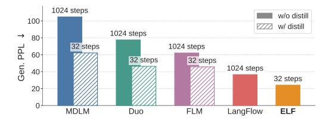

# **ELF: Embedded Language Flows**

Keya Hu\* Linlu Qiu\* Yiyang Lu Hanhong Zhao Tianhong Li Yoon Kim Jacob Andreas Kaiming He

**MIT** 

\*Equal contribution; order decided by a coin flip.

Code: https://github.com/lillian039/ELF

#### Abstract

Diffusion and flow-based models have become the *de facto* approaches for generating continuous data, *e.g.*, in domains such as images and videos. Their success has attracted growing interest in applying them to language modeling. Unlike their image-domain counterparts, today's leading diffusion language models (DLMs) primarily operate over discrete tokens. In this paper, we show that *continuous* DLMs can be made effective with minimal adaptation to the discrete domain. We propose *Embedded Language Flows (ELF)*, a class of diffusion models in continuous embedding space based on continuous-time Flow Matching. Unlike existing DLMs, ELF predominantly stays within the continuous embedding space until the final time step, where it maps to discrete tokens using a shared-weight network. This formulation makes it straightforward to adapt established techniques from image-domain diffusion models, *e.g.*, classifier-free guidance (CFG). Experiments show that ELF substantially outperforms leading discrete and continuous DLMs, achieving better generation quality with fewer sampling steps. These results suggest that ELF offers a promising path toward effective continuous DLMs.

Figure 1: **ELF** achieves lower generative perplexity with fewer sampling steps than prior DLMs, without using distillation. ELF achieves this while using 10× fewer training tokens. (Model size: 105M for ELF and 170M for others; dataset: OWT. Detailed comparison in Fig. 7.)

