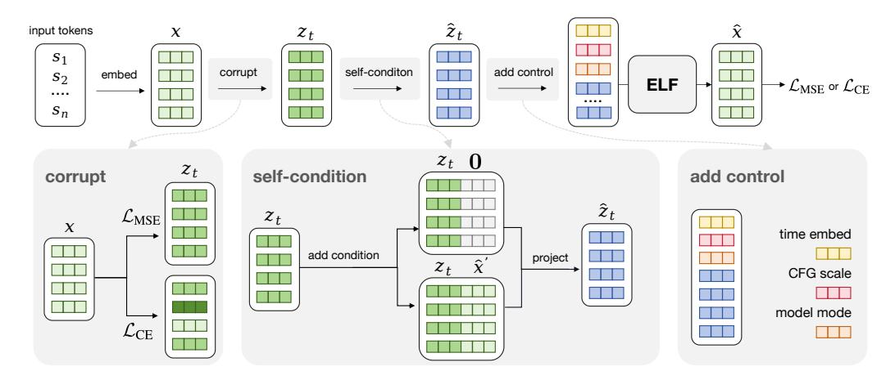

# <span id="page-14-0"></span>A Continuous Diffusion Language Model Survey

Survey details. We provide a detailed survey in Tab. [2.](#page-14-2) The survey summarizes representative continuous diffusion and flow-based language models along several design axes, including the underlying diffusion or flow process, the continuous state in which denoising is performed, whether intermediate denoising states are discretized during training or inference, and whether a separately trained decoder is required to map latent states back to text.

In particular, the *Train per-step discr.* and *Infer. per-step discr.* columns distinguish two different uses of intermediate discretization. *Train per-step discr.* indicates that intermediate denoising states are

<span id="page-15-2"></span><span id="page-15-1"></span>

Figure 9: Illustration of our training pipeline. Starting from the clean embeddings x, we apply different noise schedules in the two modes to obtain corrupted embeddings  $z_t$ . We then apply self-conditioning by concatenating either 0 or the previous prediction  $\hat{x}'$  along the channel dimension, and project the concatenated embeddings back to the original dimension to form  $\hat{z}_t$ . Next, we prepend control tokens to the embedding sequence, including time tokens in [0, 1], CFG scale tokens in [0.5, 5], and model-mode tokens indicating either denoising or decoding. The resulting sequence is fed into ELF to produce the final prediction  $\hat{x}$ , which is supervised using either a denoising loss  $\mathcal{L}_{\text{MSE}}$  or a token-wise cross-entropy loss  $\mathcal{L}_{\text{CE}}$ .

mapped to token predictions during training and supervised with token-level objectives such as crossentropy loss. This provides direct vocabulary-level guidance, but also couples intermediate denoising states to categorical predictions. *Infer. per-step discr.* indicates that intermediate sampling states are explicitly projected back to token-aligned representations during generation, such as nearest-neighbor rounding in embedding space or argmax projection on a simplex. Methods without inference-time per-step discretization keep the sampling trajectory continuous and discretize only at the final step. The *Sep. dec.* column indicates whether a method requires a separately trained decoder to map continuous latent representations back to discrete text.

**Positioning of ELF.** Tab. 2 shows that existing continuous DLMs differ substantially in where the denoising process is defined and how continuous states are mapped back to text. Many embedding-space and simplex-based methods use training-time per-step discretization through token-level objectives, commonly cross-entropy, at intermediate denoising steps. These objectives provide direct token-level guidance, while making the denoising trajectory more tightly coupled to vocabulary-level prediction. Latent Diffusion LMs often avoid such per-step vocabulary supervision, but typically rely on DDPM-style or score-based formulations with DDPM noise schedules [26, 47] and require a separately trained latent-to-text decoder, such as an autoregressive decoder, non-autoregressive decoder, or latent decompressor, to recover discrete tokens.

ELF occupies a different design point. It formulates language generation as continuous-time Flow Matching in a frozen contextual embedding space and keeps the sampling trajectory continuous, applying discretization only at the final decoding step. Unlike prior latent Diffusion LMs, ELF does not require a separately trained decoder: a single shared-weight network performs intermediate denoising and recovers tokens at the final step through the unembedding layer.

#### **B** Method Details

#### <span id="page-15-0"></span>**B.1** Training

We show the full training pipeline in Fig. 9. The input tokens are first encoded into clean embeddings x, which then go through three key steps before being fed into the ELF model: corruption, self-conditioning, and adding control tokens for conditioning and guidance. In the denoising branch, the model predicts clean embeddings  $\hat{x}$  and is supervised with  $\mathcal{L}_{MSE}$ . In the decoding branch, the same

#### <span id="page-16-0"></span>**Algorithm 3** ELF denoiser training with conditioning and guidance.

```
# net(z, t, c, w, mode): ELF network with in-context conditioning
# self_cond_proj(z): Self-conditioning projection layer that converts concatenated
    embeddings back to the original embedding dimension
# self_cond_prob: Self-conditioning probability
# s: a sequence of discrete tokens
# c: condition (only for conditional generation)
x = encode(s)
t = sample_t()
w = sample_sc_cfg_scale()
e = randn_like(x)
z = t * x + (1 - t) * e
v = x - e
# z w/o self-conditioning
z_no_sc = self_cond_proj(concat([z, zeros_like(z)], dim=-1))
x_no_sc = net(z_no_sc, t, c, w, mode="denoise")
v_{no}sc = (x_{no}sc - z) / (1 - t)
# z w/ self-conditioning
z_sc = self_cond_proj(concat([z, stopgrad(x_no_sc)], dim=-1))
x_sc = net(z_sc, t, c, w, mode="denoise")
v_sc = (x_sc - z) / (1 - t)
# Compute CFG target
v_target = v + (1 - 1 / w) * (v_sc - v_no_sc)
# Apply per-example self-conditioning mask
self_cond_mask = uniform(x.shape[0]) < self_cond_prob</pre>
v_pred = where(self_cond_mask, v_sc, v_no_sc)
v_target = where(self_cond_mask, v_target, v)
v_target = stopgrad(v_target)
# Compute v-loss
loss = mse_loss(v_pred, v_target)
```

shared-weight network predicts embeddings that are then passed through an unembedding layer and supervised with  $\mathcal{L}_{CE}$ . The full training algorithm is shown in Alg. 3 and Alg. 4.

**Embedding corruption.** First, we corrupt the clean embeddings x by adding noise. Specifically, we use  $z_t = tx + (1 - t)\epsilon$  to obtain noisy embeddings  $z_t$ , where  $\epsilon$  is Gaussian noise and t is the time step. Before corruption, we first normalize the clean embeddings using the estimated mean and standard deviation from the OWT dataset. We use different noise schedules for different modes.

For the denoising branch, we sample the time step t from a logit-normal distribution for each sequence. Specifically, we draw  $t' \sim \mathcal{N}(P_{\text{mean}}, P_{\text{std}}^2)$  and map it to the unit interval via  $t = \sigma(t')$ , where  $\sigma(\cdot)$  denotes the sigmoid function. In all experiments, we use  $P_{\text{mean}} = -1.5$  and  $P_{\text{std}} = 0.8$ . We rescale the Gaussian noise by a factor of 2.

For the decoding branch, we train final-step discretization by conditioning the model on the decoder mode, i.e., t=1. At this time step,  $z_t$  corresponds to clean embeddings. Therefore, to make the final-step input nontrivial, we corrupt the clean embeddings with a per-token corruption level p sampled from a different noise schedule. Specifically, we draw p from a logit-normal distribution with  $P_{\text{mean}}=0.8$  and  $P_{\text{std}}=0.8$ , and form  $\tilde{z}=px+(1-p)\epsilon$ , multiplying  $\epsilon$  by a noise scale. We use noise scales of 5 and 1 for OWT and conditional generation tasks, respectively. As a result, the corruption level varies across tokens within the same sequence. This design encourages the shared-weight decoder mode to recover corrupted embeddings from their surrounding context, making final-step discretization more robust to imperfect embeddings produced by the denoiser at inference time.

#### <span id="page-17-1"></span><span id="page-17-0"></span>Algorithm 4 ELF decoder training with conditioning and guidance.

```
# net(z, t, c, w, mode): ELF network with in-context conditioning
# self_cond_proj(z): Self-conditioning projection layer that converts concatenated
        embeddings back to the original embedding dimension
# s: a sequence of discrete tokens
# c: condition (only for conditional generation)

x = encode(s)
p = sample_per_token_p()
w = sample_sc_cfg_scale()\ne = randn_like(x)
z = p * x + (1 - p) * e

# use z w/o self-conditioning
z = self_cond_proj(concat([z, zeros_like(z)], dim=-1))
h = net(z, t=1, c, w, mode="decode")
s_pred = unembed(h)
loss = ce_loss(s_pred, s)
```

**Self-conditioning.** We apply self-conditioning following prior work [9]. During training, with a certain probability, we perform an additional forward pass to obtain the predicted embeddings  $\hat{x}'$ , which are concatenated with the noisy embeddings  $z_t$  along the channel dimension. We stop the gradient through the predicted embeddings  $\hat{x}'$ . For the remaining examples, we concatenate  $z_t$  with all-zero embeddings 0 instead. Since this concatenation doubles the channel dimension, we project it back to the original dimension using a linear layer. We apply self-conditioning with  $\hat{x}'$  in the denoising branch with 50% probability. For the decoding branch, we always use 0 as the self-conditioning input, as shown in Alg. 4.

**Training-time CFG.** As discussed in Sec. 3.3, our model performs training-time CFG [16, 17, 8, 69] with self-conditioning. In training-time CFG, the network is designed to model the post-combination quantity  $v_{\theta}^{\text{cfg}}$ , rather than the pre-combination quantity  $v_{\theta}$ . Following [16, 17], the regression target  $v_{\text{target}}$  is now:

$$v_{\text{target}} = x - \epsilon + \left(1 - \frac{1}{\omega}\right) \left(v_{\theta}^{\text{cfg}}(z_t \mid t, c, \omega) - v_{\theta}^{\text{cfg}}(z_t \mid t, \varnothing, \omega)\right), \tag{3}$$

where  $\omega$  is the guidance scale. When  $\omega=1$ , this reduces to the case without training-time CFG. In this case, the loss becomes  $\|\boldsymbol{v}_{\theta}^{\text{cfg}}(\cdot)-\boldsymbol{v}_{\text{target}}\|^2$  [16, 17]. See Alg. 3. For each training example, we randomly sample a self-conditioning CFG scale  $w\in[0.5,5.0]$  from a power distribution biased toward smaller values [16, 17]. Since ELF uses  $\boldsymbol{x}$ -prediction, the quantity  $\boldsymbol{v}$  is always converted from its  $\boldsymbol{x}$  prediction counterpart (conditional) or unconditional).

Our model uses a diverse set of conditions. Standard diffusion models typically implement conditioning through adaLN-Zero [50], which combines all conditioning signals through summation. This design becomes less effective when many heterogeneous conditions are present. Therefore, we adopt in-context conditioning [17] by prepending a set of *control* tokens that encode the conditioning information. Each control-token embedding has the same dimensionality as a standard language-token embedding. We prepend three types of control tokens: 4 time tokens with values in [0,1], 4 CFG-scale tokens sampled from [0.5,5], and 4 model-mode tokens indicating either denoising or decoding. These tokens are jointly trained with the model. All continuous values, *i.e.*, time and CFG scale, are encoded with positional embeddings.

For conditional generation, we place the clean embeddings of the conditioning sequence immediately after the control tokens and before the target sequence to be generated. The model then performs bidirectional self-attention over the concatenated sequence of conditioning and target tokens. The conditioning embeddings are kept uncorrupted during training. To enable CFG for conditional generation, we randomly drop the condition with 10% probability by zeroing out the embeddings of the conditioning sequence. This allows the model to learn both conditional and unconditional generation under the same framework.

### <span id="page-18-1"></span><span id="page-18-0"></span>Algorithm 5 ELF inference with conditioning and guidance.

```
# net(z, t, c, w, mode): ELF network with in-context conditioning
# self_cond_proj(z): Self-conditioning projection layer that converts concatenated
    embeddings back to the original embedding dimension
# shape: embeddings shape
# ts: discretized time grid over [0, 1] with N intervals
# c: condition (only for conditional generation)
# w: self-conditioning CFG scale
z = randn(shape)
x_pred = zeros(shape)
for i in range(len(ts) - 1):
   t = ts[i]
   dt = ts[i + 1] - ts[i]
   # Self-condition on the previous prediction
   z_sc = self_cond_proj(concat([z, x_pred], dim=-1))
   x_pred = net(z_sc, t, c, w, mode="denoise")
   # convert x prediction to velocity
   v = (x_pred - z) / (1 - t)
   z = z + dt * v
# decoding
z = self_cond_proj(concat([z, zeros_like(z)], dim=-1))
h = net(z, t=1, c, w, mode="decode")
# unembedding
token_logits = unembed(h)
tokens = argmax(token_logits)
```

### <span id="page-18-2"></span>B.2 Inference

We show the full inference algorithm in Alg. [5.](#page-18-0) Since the self-conditioning CFG scale is provided through in-context conditioning, changing w does not require an additional inference pass. By modifying w as a model input, we can flexibly control the trade-off between generation quality and diversity.

Time schedule. We discretize the continuous time interval t ∈ [0, 1] into T intervals using a logit-normal time schedule. Specifically, we sample T − 1 time steps from the same logit-normal distribution used for the denoising branch during training and sort them to form the intermediate points. We use Pmean = −1.5 and Pstd = 0.8 to match the training-time logit-normal distribution. We ensure that the first interval starts at t = 0 and the last interval ends at t = 1. This schedule produces smaller intervals when t is close to 0 and larger intervals as t approaches 1. It shows strong empirical performance, likely because the noisier regime requires finer discretization and the schedule better matches the noise distribution used during training.

Samplers. Our method supports both deterministic ODE sampling and an SDE-inspired stochastic sampler. The main algorithm in Alg. [2](#page-4-1) uses the ODE sampler for simplicity, while Alg. [6](#page-19-1) summarizes one-step updates for both samplers.

The SDE variant is motivated by the SDE associated with Flow Matching [\[43\]](#page-11-4), whose dynamics can be interpreted as injecting infinitesimal noise at each step. In practice, we adopt a simple approximation that re-injects Gaussian noise at each sampling step while shifting the time variable slightly toward the noise regime. We introduce a noise re-injection scale γ to control the amount of stochasticity added at each step. The denoiser is then evaluated on this perturbed state, and its clean-embedding prediction is used to update the original state. When γ = 0, no stochastic perturbation is applied, and the update reduces to deterministic ODE sampling.

### <span id="page-19-3"></span><span id="page-19-1"></span>Algorithm 6 ELF inference with different samplers.

```
# z: noisy embeddings of current time step
# t: current time step
# dt: time interval, t_next - t
# gamma: controls the amount of noise added back in the SDE sampler
def ode_step(z, t, dt):
   x_hat = net(z, t, mode="denoise")
   v = (x_hat - z) / (1 - t)
   z = z + dt * v
   return z
def sde_step(z, t, dt, gamma):
   # Re-inject noise and move back to the corresponding time step
   # The jump size is defined relative to the time-step interval
   e = randn_like(z)
   alpha = 1 - gamma * dt
   t_back = alpha * t
   z_back = alpha * z + (1 - alpha) * e
   x_hat = net(z_back, t_back, mode="denoise")
   v = (x_hat - z) / (1 - t)
   z = z + dt * v
   return z
```

CFG for conditional generation. We apply standard CFG by combining the conditional and unconditional predictions. Similarly, we use the CFG scale to control the guidance strength.

