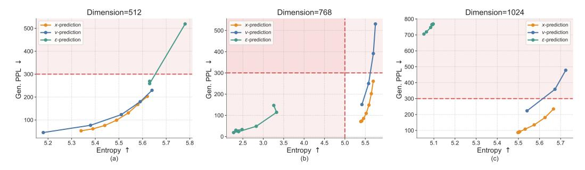
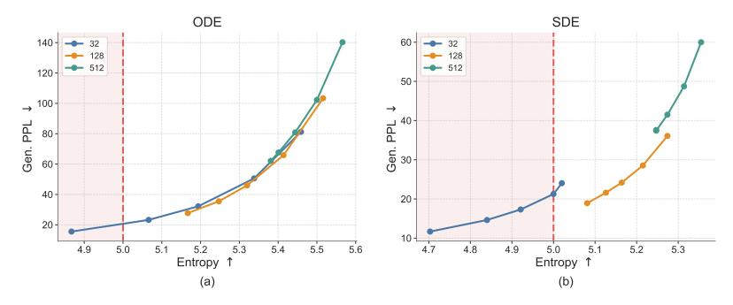
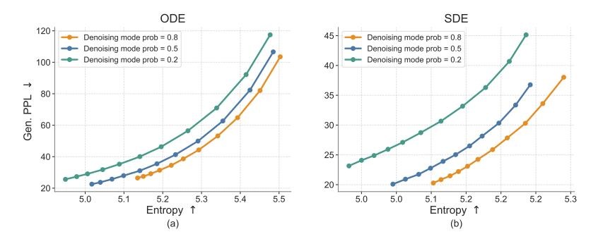
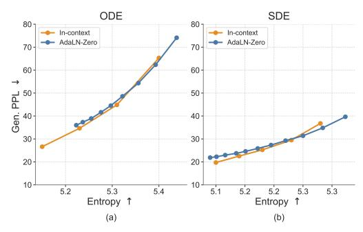
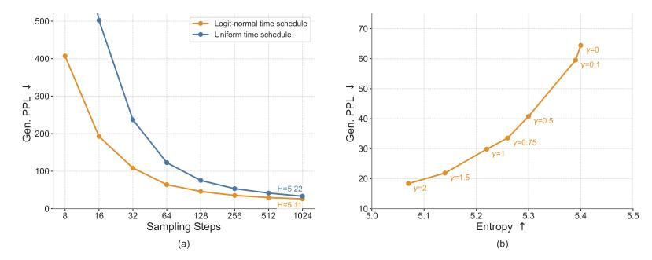
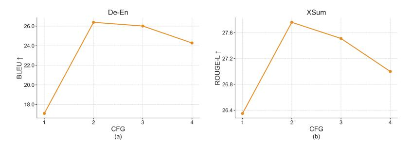

# C Additional Ablations

In this section, we present additional ablations of our design choices. Unless otherwise specified, all experiments use time schedule with either a 64-step ODE sampler or a 64-step SDE sampler with γ = 1. As before, we evaluate the generative perplexity–entropy trade-off by varying the self-conditioning CFG scale. We use red to indicate regions with poor generation quality, *i.e.*, entropy below 5.0, which often corresponds to repetitive or degenerate sentences, or generative perplexity above 300, which often corresponds to semantically meaningless or ungrammatical sentences. All models are trained for the same number of steps, with all other configurations kept the same as the default setting.

## C.1 Prediction Targets

Our model directly predicts the clean embeddings x (x-prediction). This allows us to use a unified denoiser and decoder through weight sharing and jointly optimize the model with both the denoising objective LMSE and the token-level objective LCE. Prior work has also suggested that x-prediction is essential, as high-dimensional clean data tends to lie on a low-dimensional manifold [\[32\]](#page-10-5).

Here, we further study the effect of prediction targets. Specifically, since there are three quantities and two constraints: linear interpolation zt = t x + (1 − t) ϵ and flow velocity v = x − ϵ, the network can be trained to predict one of these quantities, *i.e.*, x-, v-, or ϵ-prediction. To study this in a controlled setting, we use a two-stage pretrained encoder-decoder setup: a pretrained T5 encoder maps tokens into continuous embeddings, and a decoder is trained to reconstruct masked and noisy embeddings (See Sec. [D.3](#page-24-0) for details). We train only the denoising model while keeping both the encoder and decoder fixed. We use adaLN-Zero conditioning and a 64-step ODE sampler to plot the generative perplexity–entropy trade-off curve.

To study how prediction targets behave as the embedding dimension increases, we consider T5-small, T5-base, and T5-large encoders, corresponding to embedding dimensions of 512, 768, and 1024, respectively. We set the bottleneck dimension equal to the corresponding input embedding dimension.

Figure 10: **Effects of prediction targets.** We vary the input dimension from 512 to 768 and 1024 by using T5-small, T5-base, and T5-large encoders, respectively. Across all input dimensions, x-prediction remains stable and performs well. In contrast, v-prediction performs well at 512 dimensions but degrades at higher dimensions, while  $\epsilon$ -prediction collapses across all dimensions from 512 to 1024. The red region indicates poor-quality generations, where entropy falls below 5 (e.g., repetitive sentences) or generative perplexity exceeds 300 (e.g., meaningless or ungrammatical sentences). This aligns with the hypothesis from prior work that high-dimensional clean data often lies on a low-dimensional manifold [32].

Figure 11: **Effect of bottleneck dimension.** We compare bottleneck dimensions of 32, 128, and 512 under ODE and SDE sampling. A moderate bottleneck dimension of 128 provides the best generative perplexity—entropy trade-off, while overly small or large bottlenecks either reduce diversity or hurt generative perplexity. Red indicates regions with poor generation quality, *i.e.*, entropy below 5.

As shown in Fig. 10, x-prediction remains the most stable across all dimensions, maintaining a reasonable generative perplexity-entropy trade-off even at 1024 dimensions. In contrast, v-prediction is competitive at 512 dimensions but degrades as the dimension increases, with substantially higher generative perplexity at 768 and 1024 dimensions.  $\epsilon$ -prediction collapses across all dimensions, either achieving extremely low entropy or high generative perplexity, indicating repetitive, degenerate, or ungrammatical generations. These results support the hypothesis that clean-data prediction is better suited to high-dimensional language representations, consistent with findings from prior work [32].

#### C.2 Bottleneck

Our model uses a bottleneck design that projects encoder representations into a lower-dimensional space before mapping them back to the model hidden size. This design is motivated by the hypothesis that natural data may lie on a low-dimensional manifold within the high-dimensional embedding space. We compare bottleneck dimensions of 32, 128, and 512, and show the results in Fig. 11. The bottleneck dimension has a clear effect on the generative perplexity—entropy trade-off. Under ODE sampling, all three bottleneck sizes follow a similar frontier, but smaller bottlenecks tend to reach lower generative perplexity at the cost of lower entropy. Under SDE sampling, the differences become more significant: the 32-dimensional bottleneck achieves the lowest generative perplexity but often lies in the low-entropy region, indicating reduced diversity, whereas the 512-dimensional bottleneck maintains higher entropy but suffers from substantially worse generative perplexity. The 128-dimensional bottleneck provides the best overall balance, achieving strong generative perplexity while preserving reasonable entropy. We therefore use a bottleneck dimension of 128 as the default

Figure 12: Effect of the denoising mode probability during training. This probability controls the allocation between denoising and decoding updates in the shared-weight denoiser-decoder model. A denoising mode probability of 0.8 provides the best generative perplexity–entropy trade-off across both ODE and SDE samplers.

5.1 5.2 5.3 5.4 Entropy 10 20 30 40 50 60 70 80 n. P (a) ODE Muon AdamW 5.1 5.2 5.2 5.3 Entropy 10 20 30 40 50 60 70 80 (b) SDE Muon AdamW

Figure 13: Effect of conditioning strategies. We compare in-context conditioning with adaLN-Zero conditioning. In-context conditioning slightly improves performance while substantially reducing the number of model parameters.

Figure 14: Effect of optimizers. We compare generation quality under different optimizers using Muon and AdamW. Muon achieves lower generative perplexity at comparable entropy under both ODE and SDE sampling methods.

setting. This finding is also consistent with prior work [\[32\]](#page-10-5), which observes that an appropriate bottleneck can improve performance.

### C.3 Denoising Mode Probability

Since ELF is trained with both MSE and CE losses through a shared-weight denoiser-decoder, each training step is assigned to either denoising mode or decoding mode. The denoising-mode probability controls this allocation: a higher probability emphasizes learning the continuous denoising dynamics, while a lower probability provides more supervision for mapping embeddings back to tokens. We study this trade-off by varying the denoising-mode probability during training.

As shown in Fig. [12,](#page-21-1) assigning a low probability to the denoising mode consistently degrades the generative perplexity–entropy trade-off, especially under SDE sampling. This suggests that the model requires sufficient training on the denoising process. Among the configurations tested, a denoising mode probability of 0.8 achieves the best overall trade-off across both ODE and SDE samplers. We therefore use 0.8 as the default denoising mode probability in our main experiments.

### C.4 Conditioning Strategies

As discussed in Sec. [3.3,](#page-4-0) our model is conditioned on the time step, CFG scale, and model mode. We use in-context conditioning for these signals by prepending them as condition tokens to the input sequence, allowing the model to attend to them through full attention. This differs from the conventional adaLN-Zero conditioning design, which typically introduces additional model components to process the conditioning inputs. We compare these two designs in Fig. [13.](#page-21-2) In-context conditioning performs slightly better while avoiding the substantial parameter overhead introduced by

Figure 15: **Effect of time schedule and SDE noise re-injection scale.** (a) Logit-normal time schedule consistently improves generative perplexity across different sampling budgets, especially in the few-step regime. (b) The SDE noise re-injection scale  $\gamma$  controls the generative perplexity–entropy trade-off by adjusting the amount of stochastic noise injected during sampling.

Figure 16: **Effect of CFG scale on conditional generation.** We sweep the CFG scale on WMT14 De-En translation and XSum summarization. Moderate guidance substantially improves task performance, with CFG scale 2 achieving the best result on both tasks, while overly strong guidance slightly degrades performance.

adaLN-Zero (ELF-B's parameter count is reduced from 148M to 105M). Therefore, we use in-context conditioning as our default setting.

#### C.5 Optimizers

We evaluate the impact of optimizer choice, comparing Muon [28] and AdamW [39], and show the results in Fig. 14. We tune the hyperparameters for both optimizers to obtain their best performance: for Muon, we use a learning rate of  $2 \times 10^{-3}$ ; for AdamW, we use a learning rate of  $1 \times 10^{-4}$  with  $\beta_1 = 0.9$  and  $\beta_2 = 0.95$ . During training, Muon achieves lower loss within the same number of steps. During inference, models trained with Muon consistently achieve a better generative perplexity–entropy trade-off than those trained with AdamW under both samplers. The improvement is especially significant under SDE sampling, where Muon achieves lower generative perplexity at the same entropy level. These results highlight the importance of optimizer choice. Nevertheless, models trained with both optimizers still outperform other baselines, suggesting that the strong performance of ELF cannot be attributed to the optimizer alone.

## **C.6** Sampling Methods

We study two sampling design choices that improve inference efficiency and generation quality: sampling time schedule and stochastic SDE-inspired sampling. The logit-normal time schedule improves sampling efficiency by reducing the required number of denoising steps, while the SDE noise re-injection scale provides additional control over the generative perplexity—entropy trade-off.

**Time schedules.** By default, we use a logit-normal time schedule during inference [29]. We also evaluate an alternative uniform schedule. Fig. 15a shows the effect of the time schedule on ODE sampling across different numbers of sampling steps. Across all step counts, the logit-normal schedule consistently reduces generative perplexity compared with the uniform schedule. This improvement

| Model | Depth | Hidden size | # Heads | Params | Training epochs |
|-------|-------|-------------|---------|--------|-----------------|
| ELF-B | 12    | 768         | 12      | 105M   | 5               |
| ELF-M | 24    | 1056        | 16      | 342M   | 4               |
| ELF-L | 32    | 1280        | 16      | 652M   | 3               |

Table 3: ELF Model configurations across different scales.

is especially significant in the few-step regime. These results suggest that the logit-normal time schedule improves sampling efficiency and final sample quality, likely because it better aligns the inference-time trajectory with the training-time schedule and allocates more sampling steps to noisier time steps.

SDE noise re-injection scale. For SDE sampling, we introduce a noise re-injection scale hyperparameter γ that controls the amount of stochasticity injected at each sampling step, as discussed in Sec. [B.2.](#page-18-2) Intuitively, increasing γ introduces more stochasticity, while γ = 0 reduces to deterministic ODE sampling. As shown in Fig. [15b](#page-22-1), γ controls the generative perplexity–entropy trade-off: within a moderate range, larger γ leads to lower generative perplexity while slightly reducing entropy. We hypothesize that the noise re-injection process helps correct early denoising errors, rather than deterministically amplifying imperfect trajectories as in ODE sampling. We therefore choose γ = 1.0 as our default setting, which provides a strong balance between generative perplexity and entropy.

### C.7 CFG on Conditional Generation

We further study the effect of CFG scale on conditional generation tasks. As shown in Fig. [16,](#page-22-2) increasing the CFG scale from 1 to 2 substantially improves performance on both WMT14 De-En and XSum, suggesting that stronger conditioning helps the model better follow the source input. However, further increasing the scale leads to a gradual decline in performance, indicating that overly strong guidance can hurt generation quality. Based on this trend, we use CFG scale 2 as the default setting for conditional generation.

