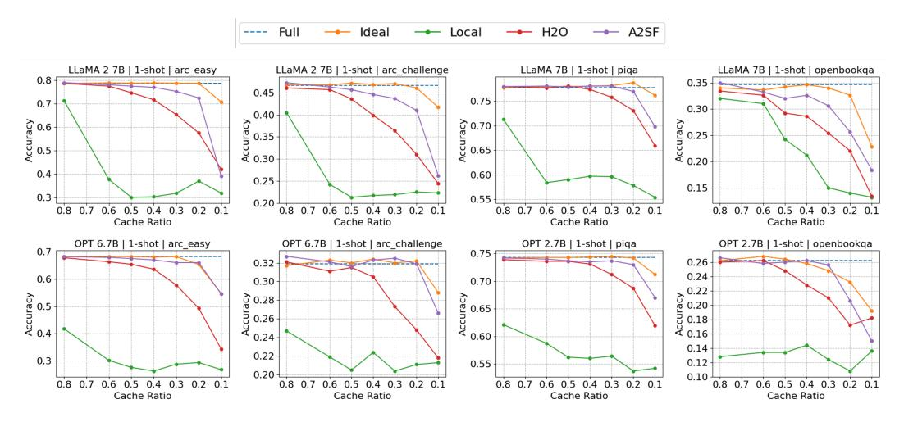

# 2 Related Works

### 2.1 Token pruning for Transformer Encoder

Prior to the exploration of token pruning in Transformer Decoder models, significant research was conducted on token pruning in Transformer Encoder models such as BERT [\[10\]](#page-9-7). These encoder models process all tokens simultaneously, and their primary use was to decrease computational load rather than to manage memory.

Longformer [\[11\]](#page-9-8) introduced predetermined mask for the attention operation. This included Sliding Window Attention, which only considers tokens within a certain distance from the current token, and Dilated Sliding Window Attention. These methods provided a straightforward approach to token pruning. However, since the same token pattern is applied irrespective of the input, there is a potential for accuracy loss due to the inability to consider the context.

In contrast, SpAttn proposed a token pruning technique that utilizes Accumulative Attention Score (A2S). A2S is a method for determining token importance that accumulates Attention Score, which is generated during the attention operation, in units of Key direction tokens. SpAttn further accumulates this A2S at the layer level, establishes the token importance after each layer's operation, and suggests a method to exclude tokens with low A2S from the input of the subsequent layer. This approach is based on that in human language, many tokens, such as prepositions, articles, and adverbs, carry less semantic weight.

### 2.2 Token pruning for Transformer Decoder

The popularity of generative LLM models such as GPT [\[12\]](#page-9-9) based on Transformer Decoder has been on the rise recently. Consequently, token pruning research for Decoder models has emerged as a significant issue. Unlike Encoder models, Decoder models store information about previous tokens in the form of a KV Cache, thereby token pruning reduces not only the computational load but also memory usage. Therefore, the application of the token pruning technique has become an essential requirement for rapidly utilizing LLM in various environments.

Sparse Transformers [\[13\]](#page-9-10) applied a fixed pattern method, similar to the previous Encoder token pruning technique, to LLM. The proposed pattern is a suitable mix of Strided Attention and Fixed Attention. However, this technique also employs a pattern that is independent of the input, so it cannot consider the context at all, leading to a decrease in accuracy.

StreamingLLM [\[14\]](#page-9-11) identified Attention Sink, a phenomenon where the Attention Score is concentrated on the first token during the attention operation of LLM. It also demonstrated that maintaining this Sink Token plays a crucial role in preserving the performance of LLM. Utilizing this, it was confirmed that accuracy could be significantly improved merely by retaining additional Sink Tokens in the above fixed patterns.

In H2O, the intuition of unnecessary tokens was analyzed more experimentally in Decoder models. Similar to Encoder models, most of the Attention Scores are produced by a few tokens, referred to as *Heavy-Hitter*. Also, when these H2 tokens were removed, the accuracy dropped significantly, proving that they play a vital role in the token processing process. And, H2O proposed to apply Accumulative Attention Score-based Token Pruning to prune the KV Cache. However, since there are differences in the token processing process between Encoder models and Decoder models, the method of accumulating A2S across layers was changed to accumulate along the Generation Step. That is, the Attention Score calculated when each token is generated is cumulatively added to the

A2S of each token, and some tokens with small A2S values are removed from the KV Cache. It also proposed head-wise Token Pruning, which maintains A2S in each head and therefore removes different Tokens, improving the existing technique of applying the same Token Pruning Mask in one layer. Through this, it was confirmed that A2S operates quite well in Decoder models.

Subsequent research uses the token selection technique of H2O, but points out that H2O merely deletes unimportant tokens. In response to this, No Token Left Behind [7] proposed to convert unimportant tokens to low bits through Quantization, and Get More with LESS [8] proposed to apply Low-rank Decomposition. Both papers propose methods about processing unimportant tokens after token selection, so they can be used together with A2SF in this paper to improve overall performance.

Keyformer [9] pointed out that after Token Pruning, the denominator of Softmax changes because tokens are removed, and therefore the distribution changes. To solve this problem, it proposed to use Gumbel-Softmax [15], which can flatten the distribution. This technique is also compatible with A2SF because they use A2S after Gumbel-Softmax.

Other research [16, 17] introduces additional learning in the process of selecting important tokens. However, LLM requires a lot of computation and memory during the learning process due to its size, which can be challenging to apply in environments with insufficient computing power and memory.

#### 3 Method

#### 3.1 Accumulative Attention Score

The A2S used in the Encoder model is defined as follows:

$$A_k^l = \sum_{i=1}^l \sum_{h=1}^H \sum_{q=1}^N S_{q,k}^{i,h}$$
 (1)

Here,  $A_k^l$  is the A2S for the kth token in the lth layer, N is the length of the entire sequence, H is the total number of heads, and  $S_{q,k}^{i,h}$  is the Attention Score calculated for the qth query and the kth key in the kth head of the kth layer. This A2S is calculated from the front layers as the operation progresses, allowing each token's importance to be set in that layer. Subsequently, tokens with low importance can be removed from the input of the next layer, reducing the amount of computation.

In H2O, the following changes were made to apply A2S to the Decoder model:

$$A_{n,k}^{l,h} = \sum_{q=1}^{n} S_{q,k}^{l,h} \tag{2}$$

Here, k < n, and by changing the overall accumulation direction to the Generation step instead of the layer, separate scores were maintained at the layer and head level. The above l and h mean the hth head of the lth layer. Then,  $A_{n,k}^{l,h}$  is the A2S of the kth token in the Generation Step where the nth token is generated, and  $S_{q,k}^{l,h}$  is the Attention Score of the kth token in the Step where the qth token is generated. Subsequently, the KV Cache of tokens with small A2S values is removed in the next Generation Step.

However, due to the introduction of the Casual Mask of Masked Self-Attention, the kth token does not perform Attention operations with the previous tokens:

$$S_{q,k}^{l,h} = 0, \forall q < k \tag{3}$$

Therefore, the actual A2S applied to the Decoder model is as follows:

$$A_{n,k}^{l,h} = \sum_{q=k}^{n} S_{q,k}^{l,h} \tag{4}$$

Figure 2: Toy examples illustrate the Accumulative Attention Score and the Accumulative Attention Score with Forgetting Factor.

Through this, n − k Attention Scores are accumulated in the A2S of the kth token, and n − k − 10 Attention Scores are accumulated in the A2S of the k + 10th token. That is, there is a difference of 10 Attention Scores between these two tokens. The Sof tmax operation does not output negative values due to its characteristics, so if more accumulations occur, the value is likely to be large, which means that the A2S of the token that appeared first is high and is less likely to be removed during Pruning.

### 3.2 Motivation

Figures [1\(](#page-1-0)a) and (b) display the results of applying A2S to BERT and LLaMA, respectively. The top 5 tokens in terms of importance are highlighted in red. In the BERT model (Figure [1\(](#page-1-0)a)), since the Casual Mask was not applied, the Attention Score is evenly distributed among all tokens. This is because the number of accumulations is the same for all tokens, allowing them to be compared fairly based solely on the difference in Attention Score. Conversely, in the case of LLaMA 7B (Figure [1\(](#page-1-0)b)), the importance of the initial tokens is abnormally high due to the effect of the Casual Mask. Also, the importance aligns with the order of generation, which can be considered absolute due to the number of accumulations according to the order of generation rather than the difference in Attention Score. Furthermore, even if the sequence lengthens, there is no change in the previously accumulated Score, making the progress of the sentence and the selected token irrelevant, and the token that was initially generated is always selected.

This differs from human language processing. Human language is written in one paragraph or one sentence, and after moving on, only the important keywords from the previous paragraph are remembered. This implies that humans naturally forget unnecessary parts that appeared in the past during the process of language processing. We derived from this point that the past Attention Score should also be forgotten over time. Also, we adopted a method of setting a Forgetting Factor and multiplying it exponentially based on the well-known human Forgetting study, Ebbinghaus's Forgetting Curve [\[18\]](#page-10-3). This reflects the fact that the simplified form of the Curve is exponential.

#### 3.3 Accumulative Attention Score with Forgetting Factor

We propose to modify the Accumulative Attention Score by introducing a Forgetting Factor α as follows:

$$A_{n,k}^h = \sum_{q=1}^n \alpha^{n-q} \times S_{q,k}^h \tag{5}$$

$$A_{n,k}^{h} = S_{n,k}^{h} + \alpha \cdot S_{n-1,k}^{h} + \alpha^{2} \cdot S_{n-2,k}^{h} + \dots + \alpha^{N-k} \cdot S_{k,k}^{h}$$
 (6)

Here, α is a float number satisfying 0 < α < 1. Because the Forgetting Factor is repeatedly multiplied by the Attention Score calculated in the past Generation Step, its value converges to 0. Therefore, even if many values are accumulated, the value becomes smaller, resolving the imbalance with tokens with fewer accumulations. This can be seen in Figure [2.](#page-4-0) In the case of the second token, it outputs a low Attention Score after its first self-attention and becomes an unnecessary token, but in A2S, it can be seen that it is not deleted due to the influence of the past. On the other hand, in A2SF, the

Figure 3: Comparison of accuracy between Full cache, Local Attention, and H2O

scores in the upper left, which are the Attention Scores created in the past from the old tokens, can be seen to gradually converge to 0 due to the influence of the Forgetting Factor. Through this, it can be confirmed that the token that is most unnecessary at the current point is removed, not the token that was removed with fewer accumulations. The results in actual data can also be confirmed through Figure [1\(](#page-1-0)c). Unlike Figure [1\(](#page-1-0)b) where A2S was applied, it can be seen that the distribution of scores between tokens is even. Through this, tokens can be compared more fairly in terms of importance, and more accurate results can be output by selecting actually important tokens.

Also, A2SF has the potential for tuning considered for the dataset by setting the value of α. If a value close to 1 is assigned to α, convergence occurs slowly, so the Attention Score that occurred in the past can still affect the present, but if α is close to 0, it converges quickly, so the Attention Score calculated recently is used to determine the importance of the token, which means comparing tokens using only recent trends. In other words, depending on the characteristics of the dataset, the degree of influence of the past on the present can be adjusted, and it means that the optimal accuracy for the situation can be achieved by setting an appropriate α.

