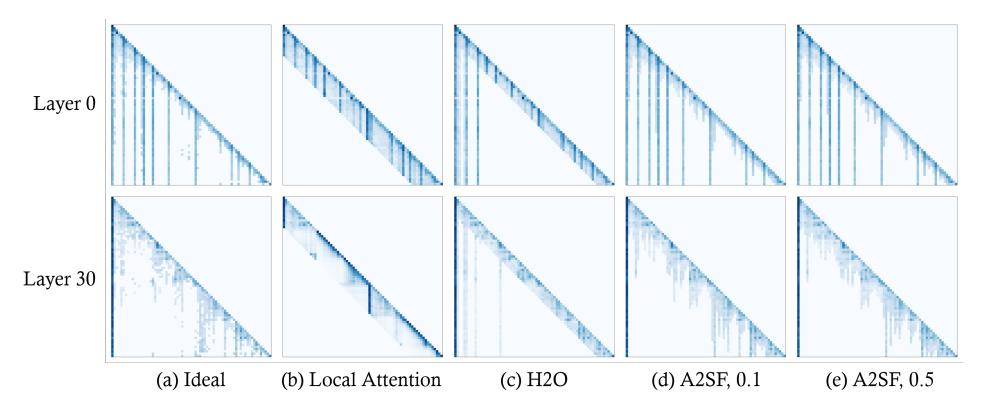
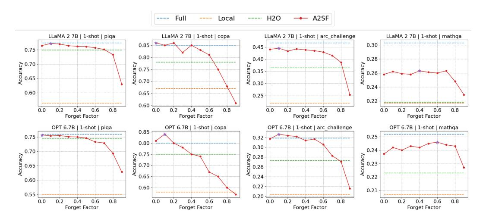

# 4 Experiments

#### 4.1 Experimental setup

For the accuracy measurement experiment of A2SF, we used the LLaMA-2-7B [\[19\]](#page-10-4), LLaMA-7B [\[20\]](#page-10-5), OPT-6.7B, OPT-2.7B [\[21\]](#page-10-6) models, and evaluated the Commonsense-reasoning performance with the dataset of OpenbookQA [\[22\]](#page-10-7), Winogrande [\[23\]](#page-10-8), PiQA [\[24\]](#page-10-9), COPA [\[25\]](#page-10-10), MathQA [\[26\]](#page-10-11), ARC-easy, ARC-challenge [\[27\]](#page-10-12). We used lm-eval-harness [\[28\]](#page-10-13)(v0.4.0) for evaluation. The experiment was conducted with an FP16 model in an RTX 3090 environment. In H2O, Local Attention and token selection through A2S are used together, and each ratio is set to half of the cache ratio. Since A2SF includes considering recent Attention Score trends in the algorithm, we did not allocate a separate local cache ratio and allocated all to selective cache ratio.

### 4.2 Model accuracy

We measured the accuracy of a total of 4 models in 1-shot and 0-shot tasks for cache ratios in the range of [0.1, 0.8] across 7 datasets. Among them, the results for the 1-shot task are summarized in Figure [3.](#page-5-0) Through this, we were able to draw the following conclusions: (1) In most cases, A2SF outperforms H2O in terms of accuracy. (2) At a cache ratio of 0.4 or higher, it can approach the accuracy of Ideal under many conditions. (3) There are cases where the limit of accuracy that can be achieved with a small number of tokens is low, depending on the dataset. The full experimental results of LLaMA 2 7B are in Table [1.](#page-6-0) We were able to confirm an accuracy improvement of 7.8% in the 1-shot environment and 5.1% in the 0-shot environment compared to H2O.

| Shots  | Method | Dataset |       |       |       |        |       |       |         |
|--------|--------|---------|-------|-------|-------|--------|-------|-------|---------|
|        |        | OBQA    | WG    | PiQA  | COPA  | MathQA | ARC-E | ARC-D | Average |
| 1-shot | Full   | 0.362   | 0.691 | 0.774 | 0.850 | 0.303  | 0.786 | 0.467 | 0.605   |
|        | Local  | 0.122   | 0.487 | 0.574 | 0.630 | 0.207  | 0.370 | 0.225 | 0.374   |
|        | H2O    | 0.224   | 0.511 | 0.726 | 0.660 | 0.202  | 0.575 | 0.310 | 0.458   |
|        | A2SF   | 0.268   | 0.526 | 0.756 | 0.820 | 0.251  | 0.724 | 0.410 | 0.536   |
| 0-shot | Full   | 0.324   | 0.688 | 0.781 | 0.860 | 0.282  | 0.763 | 0.423 | 0.589   |
|        | Local  | 0.130   | 0.487 | 0.540 | 0.640 | 0.194  | 0.330 | 0.215 | 0.362   |
|        | H2O    | 0.152   | 0.512 | 0.676 | 0.570 | 0.210  | 0.419 | 0.253 | 0.399   |
|        | A2SF   | 0.176   | 0.526 | 0.711 | 0.620 | 0.221  | 0.586 | 0.311 | 0.450   |

Table 1: Comparison of the performance of existing techniques and A2SF for different number of shots in LLaMA 2 7B, with a Cache Ratio of 0.2

### 4.3 Token selection

Figure [4](#page-6-1) depicts the Attention Score after applying each technique with a cache ratio of 0.2. The *Ideal* in Figure [4\(](#page-6-1)a) calculates the Attention Score of all tokens at each sequence generation step (each row), selects tokens with large values, and considers all tokens in the subsequent step without removing tokens with small values. This represents the Mask with the largest Attention Score given the Cache Size. However, since tokens are not removed, there is no compression effect, making it an ideal method. Therefore, the closer the result of applying the Token Pruning technique is to this Ideal Mask, the closer it is to achieving ideal accuracy.

Local Attention (Figure [4\(](#page-6-1)b)) exhibits a lower mask similarity because it only considers tokens of a certain size based on the most recent tokens. Also, due to the absence of an Attention Sink, a significant change in the distribution of Softmax can be observed. H2O (Figure [4\(](#page-6-1)c)) creates a λ-shaped Mask due to the issue of high scores of initial tokens, which differs from the Ideal Mask. In contrast, when A2SF was applied, a Mask is similar to the Ideal Mask compared to existing techniques. Moreover, the Attention Sink Token, which can significantly impact accuracy, is selected without any issues. This is because even when the Forgetting Factor is applied, the Sink Token is continuously calculated with a large value, allowing it to maintain a high value compared to other tokens.

Figure 4: Attention Score after applying each technique. The intensity of the color is directly proportional to the value it represents; a darker color signifies a higher value.

In Table [2,](#page-7-0) the average cosine similarity between the Attention Score of techniques and the Ideal is presented. Local Attention, where the Attention Score distribution is disrupted, shows a very low similarity. Although the Sink Token is included, H2O exhibits a relatively low similarity because the area in the middle of the λ disappears. On the other hand, the Mask created through A2SF has an average similarity close to 1. This result explains why the model's accuracy increases when A2SF is applied.

| Method   | WG    | PiQA  | OBQA  | ARC-E | Average |  |
|----------|-------|-------|-------|-------|---------|--|
| Local    | 0.320 | 0.315 | 0.317 | 0.318 | 0.318   |  |
| H2O      | 0.960 | 0.970 | 0.968 | 0.970 | 0.967   |  |
| A2SF 0.1 | 0.990 | 0.992 | 0.990 | 0.991 | 0.991   |  |
| A2SF 0.5 | 0.988 | 0.991 | 0.987 | 0.988 | 0.989   |  |

Table 2: Average cosine similarity between the Attention Score generated by each method and the Attention Score applied with Ideal Pruning. Average cosine similarity between the Attention Score generated by each method and the Attention Score applied with Ideal Pruning.

Figure 5: Factor graph

#### 4.4 Discussion

#### 4.4.1 Determining the optimal Forgetting Factor value

Figure [5](#page-7-1) illustrates the accuracy achieved when applying a Forgetting Factor within the range of [0.0, 0.9], with a fixed cache ratio of 0.3. Generally, the peak accuracy is observed within the Forgetting Factor range of [0.1, 0.3], and the accuracy tends to decline as the Factor increases. A relatively low Forgetting Factor implies that the model considers a shorter history. This observation suggests that when applying the A2S to the Transformer Decoder model, an extensive historical context can have a detrimental effect.

However, in the MathQA dataset, there were instances where a relatively high Forgetting Factor resulted in high accuracy, and in some cases, even the highest accuracy. This discrepancy can be attributed to the differences between the datasets. Here are some examples of sequences included in each dataset:

### • OpenbookQA

– If you wanted to make a necklace, how long would you have to wait for the materials to appear inside the Earth? Millions of years

#### • PiQA

– Question: What ingredient is left out of fluffy slime that is normally in regular slime? Answer: Borax

## • MathQA

– Question: In a 160 meters race, a beats b by 56 m or 7 seconds. What is a's time over the course? Answer: 22 seconds

Figure 6: Attention Score, A2S and A2SF of the important tokens according to the Generation Step. The starting point of the graph differs because each token is generated at different steps.

Compared to other datasets, a distinctive feature of MathQA is its clear problem structure due to the use of numbers. In other words, the distinction between necessary and unnecessary tokens is evident, suggesting that it could be beneficial to consider a longer history and prevent the removal of important tokens.

### 4.4.2 Influence of history

In Figure [5,](#page-7-1) we observed instances where the highest accuracy was attained when the Forgetting Factor was set to 0.0. A Forgetting Factor of 0.0 implies that the model does not consider history at all, and it determines the importance of a token solely based on the Attention Score from the immediate preceding sequence. This approach demonstrated higher accuracy across all cases compared to H2O, which takes into account all history. This suggests that for the Decoder model, it is more beneficial to disregard history entirely rather than considering an excessive amount of it. However, we generally observed higher accuracy when the model considered recent history through a low Forgetting Factor in the range of [0.1, 0.3], indicating that history can serve as a supplementary factor.

Figure [6](#page-8-0) illustrates the Attention Score generated by the primary tokens as the Generation Step progresses, along with the A2S and A2SF calculated from it. This figure reveals that the remaining tokens, excluding the Attention Sink, do not consistently have a large Score, even if they are major tokens. In this process, history plays a role in preventing a token, which had a large Score, from being eliminated during a certain Step by compensating the value when it outputs a small Score, or awarding extra points when it continuously outputs a large Score. Since A2S maintains the accumulated value from the past, a token that was initially created carries a high level of importance, even if the Score generated over time is small. If Token Pruning is performed at the point indicated by the red line in Figure [6,](#page-8-0) *Answer* is removed despite its high Attention Score due to its small accumulated value. In contrast, A2SF accounts for the reduced Score of past tokens, so the importance of the *Answer* remains high.

