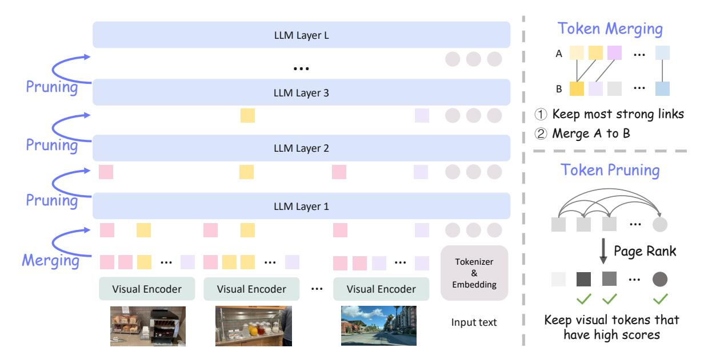

# 2. Related Work

Multi-modal LLMs. Large language models [\[47,](#page-9-4) [52,](#page-10-5) [53\]](#page-10-6) exhibit strong performance in text understanding and generation tasks, laying the foundation for developing image LLMs [\[8,](#page-8-2) [33,](#page-9-5) [41,](#page-9-0) [102\]](#page-12-0) and their chain-of-thoughts [\[50,](#page-9-6) [97,](#page-11-7) [99\]](#page-11-8). Meanwhile, video LLMs have also made progress via video instruction tuning [\[33,](#page-9-5) [39,](#page-9-2) [45,](#page-9-3) [69,](#page-10-7) [87,](#page-11-9) [95,](#page-11-10) [101\]](#page-11-11). Recent works [\[13,](#page-8-5) [32,](#page-9-7) [51,](#page-9-8) [71,](#page-10-8) [73,](#page-10-9) [76,](#page-10-10) [92\]](#page-11-5) focus on improving video LLMs for long video understanding, addressing the challenge of a large number of video frames. They either adopt Q-former [\[35\]](#page-9-9) or state-space models [\[21\]](#page-8-6) to aggregate the information before feeding visual tokens into the LLMs. Others extend the context window of LLMs [\[24,](#page-8-7) [74,](#page-10-11) [92\]](#page-11-5) or design sequence parallelism from a systems perspective [\[84\]](#page-11-12) to process the long video sequence. Built on top of the pre-trained image and video LLMs, our adaptive inference method aims to reduce token redundancy during inference and adapt to diverse efficiency requirements while maintaining model performance.

Token Merging and Pruning. Transformers are widely used in deep learning models, yet they come with high computational demands. Token merging and pruning methods aim to reduce the number of tokens to reduce this load, commonly developed in both NLP models [\[18,](#page-8-8) [29,](#page-9-10) [30,](#page-9-11) [67,](#page-10-12) [86\]](#page-11-13) and vision models [\[11,](#page-8-9) [31,](#page-9-12) [42,](#page-9-13) [59,](#page-10-13) [64,](#page-10-14) [75,](#page-10-15) [89\]](#page-11-14). These approaches typically require fine-tuning after token reduction. By contrast, some training-free methods have been developed for efficient vision Transformers [\[3,](#page-8-10) [14,](#page-8-11) [68\]](#page-10-16). Different from these works, we propose a training-free approach tailored for multi-modal LLMs.

For multi-modal LLMs, token pruning has been explored recently [\[5,](#page-8-12) [40,](#page-9-14) [62,](#page-10-4) [79\]](#page-11-15). FastV [\[5\]](#page-8-12) and VTW [\[40\]](#page-9-14) prune visual tokens at a particular selected LLM layer, while PDrop [\[79\]](#page-11-15) prunes tokens at the end of each stage of LLM layers. LLaVA-Prumerge [\[62\]](#page-10-4) leverages the key-value pairs from the vision encoder to prune visual tokens before LLM. Unlike them, our method performs token reduction both before and across LLM layers, allowing for adaptive inference fitting with various computation constraints.

There are concurrent efforts [\[65,](#page-10-17) [88,](#page-11-16) [96,](#page-11-17) [98\]](#page-11-18) that also seek to reduce the computation of multi-modal LLMs. They are only applied to image LLMs, prune tokens exclusively within LLM, or rely on fine-tuning for an accuracyefficiency balance. In comparison, our work is training-free,

Figure 2. **Overview** of our training-free method for pre-trained multi-modal LLMs, optimized for accuracy-efficiency trade-off. During inference, we first merge the input visual tokens of LLM based on the cosine similarity between token embeddings, reducing their redundancy. The retained tokens are then fed into the LLM. Token pruning is applied within the LLM layers using the Page Rank algorithm, with a scheduler controlling the retention ratio of each layer. By adjusting the merging ratio and pruning scheduler parameters, our approach enables adaptive inference of multi-modal LLMs, accommodating various computational constraints with minimal performance loss.

prunes visual tokens before and within LLM, generalizes to both video and image LLMs, and moreover, supports adaptive inference that accommodates a wide range of computation budgets with minimal performance loss.

Adaptive Inference. The ability to dynamically adjust the computational complexity of prediction models based on input data, latency constraints, or desired accuracy levels has received considerable interest in the vision and learning community [22]. Early attempts mainly focus on feature selection within multistage prediction pipelines [20, 28, 82]. More recent efforts have extended this concept to the adaptive inference of deep models. Methods have been developed for both convolutional networks and vision Transformers, enabling techniques such as input resampling, operation skipping, layer dropping, and early exiting [2, 15, 23, 27, 34, 48, 49, 56, 59, 70, 72, 77, 81]. Similar ideas have also been explored for LLMs [12, 60], and recently extended to MLLMs [83]. In contrast to these works, we propose an adaptive inference method tailored for multi-modal LLMs via merging similar tokens and pruning unimportant tokens in multi-modal reasoning.

#### 3. Method

Multi-modal LLMs for images and videos usually require processing a high volume of visual tokens, resulting in substantial computational costs, especially for video tasks. Such computational load arises from the redundancy within visual tokens. To tackle this efficiency problem, we propose a training-free adaptive inference method by pruning redundant tokens in two stages, as shown in Figure 2. First, before visual tokens enter the LLM, we merge highly similar visual tokens, significantly reducing their count while preserving performance. Second, within the LLM, we further rank the visual tokens and remove less important ones at each layer, by applying the Page Rank algorithm to the self-attention weights. Together, our approach enables adaptive inference of multi-modal LLMs, reducing computational demands without compromising reasoning performance, and moreover, supports a broad range of computational requirements.

#### 3.1. Multi-modal LLMs

Given an image, a typical image LLM [41] first transforms the image into visual tokens via a visual encoder, then projects visual tokens via an adapter (e.g., multilayer perceptron), and finally concatenates the projected visual tokens and text tokens to perform LLM reasoning. Video LLMs [33] adopt a similar approach to image LLMs, except that the input visual data become uniformly sampled images (video frames), and adaptive pooling is oftentimes applied before LLMs to reduce the number of visual tokens. Despite this pooling, the visual token count remains high (e.g., thousands of tokens per video), resulting in substantial computational demands for the LLM.

Our training-free method is designed to reduce the redundancy of visual tokens, by applying it to the input visual

tokens of the LLM and to the visual tokens at each LLM layer. We denote the visual tokens right before LLM as v 0 ∈ RN0×D, where N0 is the initial number of visual tokens. Within LLM, we denote the input visual tokens and the input text tokens at the l-th layer as v l ∈ RNl×D and t l ∈ RMl×D, respectively. l ∈ [1, L] denotes the index of LLM layer and Nl (Ml ) represents the number of visual (text) tokens at layer l.

## 3.2. Token Merging before LLM

The input to LLMs often consists of hundreds of visual tokens for an image or thousands for a video, resulting in substantial redundancy. Merging these redundant tokens before they enter the LLM can significantly reduce computational demands. Inspired by [\[3\]](#page-8-10), we merge the visual tokens with high similarity, where similarity is quantified by the cosine similarity between token embeddings. Unlike [\[3\]](#page-8-10) that merges tokens at each layer of visual encoder, our method perform token merging after visual encoder. This design is agnostic to encoder architectures and easy for plug-andplay. As illustrated in Figure [2,](#page-2-0) given an initial set of visual tokens v 0 at the first LLM layer, we divide adjacent tokens into sets A and B, calculate pairwise similarity scores between the sets, and identify the closest matching token in set B for each token in set A. We then merge the token pairs with the highest similarity scores by averaging their embeddings. This process reduces the number of tokens by half at most. We repeat this merging process iteratively (*e.g*., twice) to achieve the desired retention ratio.

For videos, we merge the visual tokens within individual frames. Empirical ablation studies suggest that merging tokens within individual frames has minimal impact on final reasoning performance in video tasks, while merging across frames can be harmful. We hypothesize that merging across frames disrupts temporal order of tokens, leading to a loss of crucial temporal information for video understanding.

## 3.3. Token Pruning within LLM

After merging similar visual tokens, we concatenate the merged visual tokens v 1 with text tokens t 1 , forming x 1 = [v 1 ; t 1 ], which is then passed to the LLM. At each LLM layer, we retain important tokens and prune the less important ones, based on the attention weights computed at each Transformer layer. Specifically, we compute the importance score of each token by applying the Page Rank algorithm [\[55,](#page-10-23) [68\]](#page-10-16), using the attention weights as the adjacency matrix. The importance score s l i of token x l i at layer l is computed as follows:

$$s_i^l = \frac{1}{N^l + M^l} \sum_{j=1}^{N^l + M^l} \mathbf{A}_{i,j}^l \cdot s_j^l$$
 (1)

where s j is initialized uniformly over all tokens and Al represents the softmax-normalized attention weights. Based on these importance scores, we only prune visual tokens and retain the most important visual tokens, leaving text tokens intact. Our rationale is that pruning text tokens substantially degrades performance, likely because multi-modal LLMs rely on text tokens to perform text-centric reasoning. As a result, the number of visual tokens input to the next layer is N1 × r l , where r is the retention ratio at layer l.

Further, we design a scheduler to control the retention ratio r at the l-th layer. It determines the number of visual tokens retained at each LLM layer. Specifically, it is designed as a piece-wise function:

$$r^{l} = \begin{cases} 1, & \text{if } l < l_{1} \\ 1 - k(l - l_{1}), & \text{if } l_{1} \le l \le l_{2} \\ 0, & \text{if } l > l_{2} \end{cases}$$
 (2)

where l denotes the layer index and k = l2−l1 represents the slope. In this function, l1 determines from which layer the token pruning starts, l2 defines the layer where the visual tokens are pruned at all, and the difference of l1 and l2 controls the pruning progress. By adjusting the parameters l1 and l2, our approach allows a flexible balance between reasoning accuracy and computational efficiency.

This scheduler design is supported by our empirical findings: pruning visual tokens at the early layers negatively impacts the performance, while in contrast, pruning a large proportion of visual tokens at later layers can still maintain performance. We hypothesize that the LLM prioritizes cross-modal fusion in early layers and shifts focus toward text reasoning in later layers.

## 3.4. Adaptive Inference

By combining token merging and token pruning, our method enables adaptive inference that can meet diverse computational demands. Specifically, we can vary the retention ratio of token merging and the scheduler parameters (l1 & l2) of token pruning, to create a broad range of accuracy-efficiency trade-offs. The specific inference configuration can be determined by the computational requirements in real use cases (*e.g*., FLOPs and prefill time). We demonstrate adaptive inference in our experiments and showcase that our method achieves considerable computation reduction while preserving accuracy.

## 4. Experiments

In this section, we first introduce our implementation details and benchmarks, and then present our results, including the results of video benchmarks, image benchmarks, ablation studies, computation overhead, and adaptive inference.

Implementation Details. Our method is applied during the inference of pre-trained multi-modal LLMs. For video

| Model               | FLOPs  | Prefill Time | VideoMME                                      | MVBench | MLVU  | EgoSchema | NextQA | PerceptionTest |
|---------------------|--------|--------------|-----------------------------------------------|---------|-------|-----------|--------|----------------|
|                     | (TB)   | (ms)         | wo / w-subs                                   | test    | m-avg | test      | mc     | val            |
|                     |        |              | Video LLMs                                    |         |       |           |        |                |
| LongVA-7B [92]      | 381.09 | 2186.04      | 52.6 / 54.3                                   | -       | 56.3  | -         | 68.3   | -              |
| LLaVA-OV-7B [33]    | 99.63  | 439.58       | 58.2 / 61.5                                   | 56.7    | 64.7  | 60.1      | 79.4   | 57.1           |
|                     |        |              | Training-free Method Applied during Inference |         |       |           |        |                |
| VTW [40]            | 22.38  | 101.93       | 41.0 / 50.0                                   | 44.3    | 39.6  | 38.0      | 52.1   | 41.3           |
| PDrop [79]          | 24.22  | 104.88       | 51.7 / 56.6                                   | 52.3    | 55.6  | 51.8      | 74.2   | 52.8           |
| FastV [5]           | 21.24  | 79.56        | 55.9 / 60.0                                   | 55.9    | 61.1  | 57.5      | 77.5   | 56.3           |
| LLaVA-Prumerge [62] | 23.65  | 86.89        | 57.0 / 59.9                                   | 56.5    | 60.6  | 61.0      | 77.6   | 55.8           |
| Ours                | 14.76  | 55.03        | 58.2 / 61.3                                   | 57.1    | 63.7  | 59.6      | 78.4   | 56.0           |

Table 1. Results on video benchmarks. Compared to the base model LLaVA-OV-7B, our method significantly reduces FLOPs and prefill time by a factor of 6.8 and 8.0, respectively, with minimum or even without performance loss. Compared to baseline methods, our method outperforms them on most benchmarks with only 69.5% FLOPs and 69.2% prefill time.

| Model            | Number of Frames | FLOPs (TB) | Prefill Time (ms)                          | VideoMME wo / w-subs | MLVU m-avg | EgoSchema test |  |  |
|------------------|---------------------|---------------|-----------------------------------------------|-------------------------|---------------|-------------------|--|--|
| Video LLMs       |                     |               |                                               |                         |               |                   |  |  |
| LLaVA-OV-7B [33] | 32                  | 99.63         | 439.58                                        | 58.2 / 61.5             | 64.7          | 60.1              |  |  |
|                  |                     |               | Training-free Method Applied during Inference |                         |               |                   |  |  |
| Ours             | 32                  | 14.76         | 55.03                                         | 58.2 / 61.3             | 63.7          | 59.6              |  |  |
| Ours             | 192                 | 99.27         | 471.20                                        | 59.2 / 62.3             | 69.3          | 60.8              |  |  |

Table 2. Results on long video benchmarks using more sampled frames as inputs. With comparable FLOPs and prefill time, our method can accommodate more sampled frames and thus improve the base model LLaVA-OV-7B for long video understanding.

LLMs, we follow the hyperparamers as base model LLaVA-OV-7B [\[33\]](#page-9-5), such as sampling 32 frames per video unless otherwise noted. It uses Qwen2 [\[85\]](#page-11-0) as LLM with 28 layers in total. For our method, we set the retention ratio of token merging as 25%, l1 as 14, and l2 as 22. For image LLMs, we follow the hyperparamers as base model LLaVA-1.5-7B [\[41\]](#page-9-0) which adopts Vicuna [\[6\]](#page-8-0) as LLM with 32 layers in total. For our method, we set the retention ratio of token merging as 12.5%, l1 as 13, and l2 as 21. We compute FLOPs and prefill time of LLMs using the library from LLM-Viewer [\[90\]](#page-11-22), and assume 100 (40) text tokens for video LLMs (image LLMs).

Benchmarks. We evaluate our method on both video and image benchmarks. For video LLMs, we consider the following widely adopted benchmarks. VideoMME [\[17\]](#page-8-18) is a comprehensive video benchmark with diverse video durations and video domains. MLVU [\[100\]](#page-11-6) highlights the reasoning for long videos. Egoschema [\[46\]](#page-9-20) focuses on ego-centric video understanding. MVBench [\[37\]](#page-9-21) and NextQA [\[78\]](#page-11-23) focus on temporal action understanding. PercetionTest [\[57\]](#page-10-24) is a comprehensive video benchmark that evaluates perception and reasoning skills. For image LLMs, we report results on 7 benchmarks. GQA [\[26\]](#page-9-22) and VQAv2 [\[19\]](#page-8-19) are classic VQA datasets that assess visual reasoning ability, with GQA placing a particular emphasis on visual attributes. MME [\[16\]](#page-8-20) serves as a broad benchmark for evaluating both perception and cognitive abilities. TextVQA [\[63\]](#page-10-25) specifically measures OCR reasoning skills. SQA-IMG [\[44\]](#page-9-23) covers questions across topics in natural sciences, language sciences, and social sciences. MMB [\[43\]](#page-9-24) tests perception and reasoning capabilities, while POPE [\[38\]](#page-9-25) addresses the problem of object hallucination.

## 4.1. Video Benchmarks

Table [1](#page-4-0) and Table [2](#page-4-1) show the results of our method applied to base video LLM and our method accepting more sampled video frames, respectively.

Setup. We choose LLaVA-OV-7B [\[33\]](#page-9-5) as our base model and follow its evaluation protocol. Specifically, during inference of the pre-trained base model, we apply our token merging to the input visual tokens of Qwen2 LLM and perform token pruning at layers of Qwen2. We measure our model performance on diverse video benchmarks and re-

| Model                | FLOPs | Prefill Time | VQA-v2                                        | GQA        | MME     | TextVQA | SQA-IMG | MMB     | POPE    |
|----------------------|-------|--------------|-----------------------------------------------|------------|---------|---------|---------|---------|---------|
|                      | (TB)  | (ms)         | (107,394)                                     | (12,578)   | (2,374) | (5,000) | (2,017) | (4,377) | (8,910) |
|                      |       |              |                                               | Image LLMs |         |         |         |         |         |
| Qwen-VL-Chat-7B [1]  | 6.44  | 22.51        | 78.2                                          | 57.5       | 1487.5  | 61.5    | 68.2    | 60.6    | -       |
| LLaVA-1.5-7B [41]    | 8.18  | 29.30        | 78.5                                          | 62.0       | 1510.7  | 58.2    | 66.8    | 73.7    | 85.9    |
|                      |       |              | Training-free Method Applied during Inference |            |         |         |         |         |         |
| VTW [40]             | 2.43  | 13.88        | 49.4                                          | 42.5       | 916.4   | 45.7    | 66.1    | 63.1    | 17.9    |
| PDrop [79]           | 2.36  | 13.31        | 58.1                                          | 47.3       | 999.0   | 50.4    | 68.7    | 63.5    | 46.6    |
| FastV [5]            | 2.58  | 10.34        | 74.1                                          | 56.6       | 1438.5  | 57.3    | 68.0    | 72.1    | 73.6    |
| LLaVA-Prumerge+ [62] | 2.41  | 9.73         | 74.6                                          | 57.4       | 1391.9  | 55.2    | 67.9    | 71.6    | 82.2    |
| Ours                 | 2.22  | 10.92        | 75.4                                          | 58.6       | 1443.5  | 53.8    | 68.4    | 72.5    | 85.7    |
| VTW [40]             | 1.24  | 10.66        | 42.3                                          | 38.9       | 683.7   | 43.0    | 65.6    | 36.5    | 25.2    |
| FastV [5]            | 1.12  | 9.56         | 55.4                                          | 45.5       | 960.4   | 51.3    | 66.0    | 61.5    | 33.4    |
| LLaVA-Prumerge [62]  | 1.04  | 8.99         | 66.7                                          | 51.3       | 1242.5  | 53.8    | 68.0    | 67.1    | 76.2    |
| Ours                 | 1.00  | 8.98         | 69.0                                          | 54.6       | 1277.7  | 48.4    | 67.1    | 69.4    | 79.5    |

Table 3. Results on image benchmarks. VQA-v2 and GQA are the most stable benchmarks that have the most evaluation samples. With less computation cost, our method outperforms baselines on most benchmarks. Note that PDrop keeps all tokens at the first 25% LLM layers and thus does not support low FLOPs, *i.e*., below 25% FLOPs of base model. Compared to the base model LLaVA-1.5-7B, our model significantly reduces FLOPs and prefill time (*e.g*., by a factor of 3.7 and 2.7, respectively), with a manageable performance loss.

port efficiency metrics (FLOPs and prefill time) and accuracy metrics of each video benchmark.

Baselines. Our baselines include (1) FastV [\[5\]](#page-8-12) that prunes visual tokens at a particular LLM layer, (2) VTW [\[40\]](#page-9-14) which abandons all visual tokens at a particular selected LLM layer, (3) PDrop [\[79\]](#page-11-15) that divides LLM layers into four stages and prunes tokens at the end of each stage, based on the attention scores between visual tokens and the last text token, and (4) LLaVA-1.5-Prumerge [\[62\]](#page-10-4) that leverages the key-query pairs in the visual encoder to prune and merge visual tokens. We conduct the experiments with the pretrained LLaVA-OV-7B model in the training-free setting.

Accuracy-efficiency balance. As Table [1](#page-4-0) shows, our model achieves substantial reductions in computational demands compared to the base model LLaVA-OV-7b (*e.g*., 14.76 vs. 99.63 FLOPs), decreasing FLOPs by a factor of 6.8 and prefill time by 8.0, with little or no performance drop across diverse benchmarks. Additionally, compared to the baseline methods, our model consistently achieves higher performance on most benchmarks, while only requiring 69.5% FLOPs and 69.2% prefill time at most. These results indicate that our method effectively reduces redundancy in visual tokens, providing an optimal balance between accuracy and efficiency.

More sampled frames improve long video understating with close efficiency. In Table [2,](#page-4-1) our model significantly reduces the FLOPs and prefill time of the base pretrained model, enabling the sampling of more frames in videos (*e.g*., from 32 to 192 frames). With comparable total computation (*i.e*., 99.27 vs. 99.63 FLOPs), our model improves performance on long video understanding benchmarks, especially on long video benchmark MLVU, with a notable gain of +4.6. This improvement is attributed to our method's ability to retain essential visual tokens with much less redundancy, while densely sampled frames capture additional information crucial for long video comprehension.

