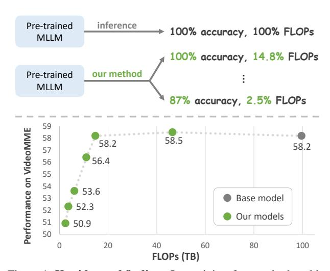

# AIM: Adaptive Inference of Multi-Modal LLMs via Token Merging and Pruning

Yiwu Zhong1, Zhuoming Liu2, Yin Li2, Liwei Wang1\*

1The Chinese University of Hong Kong, 2University of Wisconsin-Madison

### **Abstract**

Large language models (LLMs) have enabled the creation of multi-modal LLMs that exhibit strong comprehension of visual data such as images and videos. However, these models usually rely on extensive visual tokens from visual encoders, leading to high computational demands, which limits their applicability in resource-constrained environments and for long-context tasks. In this work, we propose a training-free adaptive inference method for multimodal LLMs that can accommodate a broad range of efficiency requirements with a minimum performance drop. Our method consists of a) iterative token merging based on embedding similarity before LLMs, and b) progressive token pruning within LLM layers based on multi-modal importance. With a minimalist design, our method can be applied to both video and image LLMs. Extensive experiments on diverse video and image benchmarks demonstrate that our method substantially reduces computation load (e.g., a 7-fold reduction in FLOPs) while preserving the performance of video and image LLMs. Further, at a similar computational cost, our method outperforms the state-of-the-art methods in long video understanding (e.g., +4.6 on MLVU). Additionally, our in-depth analysis provides insights into token redundancy and LLM layer behaviors, offering guidance for future research in designing efficient multi-modal LLMs. Our code is available at https://github.com/LaVi-Lab/AIM.

#### 1. Introduction

Large language models (LLMs) [6, 54, 66, 85, 93] have been recently adapted for visual understanding, fostering the developments in both image [4, 8, 25, 41, 102] and video LLMs [36, 39, 45, 80, 94]. However, these multimodal LLMs (MLLMs) usually rely on a large number of visual tokens generated by visual encoders [58, 91], especially for video data where token counts can reach thousands per video. Such high token number requires extensive computational resources for both training and inference, restricting their use in real-world applications (*e.g.*,

Figure 1. **Key idea and finding**. Our training-free method enables adaptive inference of pre-trained multi-modal LLMs, supporting a wide range of computational conditions. In comparison to the base pre-trained model, our method substantially reduces FLOPs, without or with a manageable performance drop.

real-time processing on mobile devices). Further, as the number of video frames increases, the total number of tokens also grows, limiting the model's capacity to handle dense video frames. This often results in the loss of crucial temporal information, which is essential for comprehending long videos [61, 92, 100].

To bridge the gap, we propose leveraging the inherent redundancy present in visual data to develop *adaptive inference* for multi-modal LLMs. Adaptive inference dynamically adjusts a model's computational load during inference based on contextual factors [22], *e.g.*, computational constraints, image content, or desired accuracy levels. Since retaining all visual tokens during inference is often unnecessary, our key insight is to strategically select these tokens throughout the inference process. This approach allows for controlling the amount of computation necessary for inference, so as to optimize the model's efficiency while preserving its accuracy.

In this work, we introduce a training-free method of adaptive inference tailored for multi-modal LLMs, consisting of token merging based on visual similarity and token

\*Corresponding author.

pruning based on multi-modal importance. Specifically, the visual encoder transforms the input visual data into visual tokens, which are iteratively merged based on their embedding similarities. The merged tokens are then fed into the LLM, where the tokens considered less important for multimodal reasoning are progressively pruned at each layer, resulting in a gradual reduction of tokens. By adjusting the key parameters in the token merging and token pruning process, our method enables adaptive inference that achieves various levels of computation reduction with manageable performance loss, shown in Figure [1.](#page-0-0) With this capability, we can select a configuration of token merging and pruning so that the model meets the resource constraint while the performance is optimized.

Additionally, during the development of our method, we have several findings that can be useful for designing efficient multi-modal LLMs in the future. First, the full set of video tokens is often unnecessary, as only 25% visual tokens fed into LLM can maintain close performance. Second, with fewer tokens per frame, LLMs can process a larger number of frames, thereby addressing information loss and improving performance, especially for long video understanding. Third, we observe that pruning text tokens across LLM layers or removing visual tokens in the early LLM layers significantly impacts performance. In contrast, pruning a large proportion of visual tokens in the later layers can maintain performance. These observations suggest that multi-modal LLMs focus on cross-modal fusion in the earlier layers while prioritizing text tokens in later layers.

We conduct extensive experiments on diverse video benchmarks and image benchmarks, with base models as LLaVA-OneVision [\[62\]](#page-10-4) and LLaVA-1.5 [\[41\]](#page-9-0), respectively. Without additional fine-tuning, our method achieves a substantial reduction in computational demands (*e.g*., decreasing FLOPs and prefill time by a factor of 6.8 and 8.0, respectively) while retaining performance close to the base video LLM and image LLM. Moreover, given the same computation resources, our method allows for involving more frames as inputs and even surpasses the state-of-theart (SOTA) video LLM on long video understanding (*e.g*., +4.6 on the MLVU benchmark). We further provide an indepth ablation study, offering insights into the redundancy of visual tokens and the behavior of individual LLM layers, which can guide future research on multi-modal LLMs. Altogether, these promising results are attributed to the capability of our adaptive inference that can accommodate diverse computational conditions (*e.g*., 40-fold reduction in FLOPs) with a manageable drop in performance.

Our contributions are summarized as follows:

• We introduce a training-free method that enables adaptive inference of pre-trained multi-modal LLMs. It can reduce visual token redundancy and computational demand while preserving the base model's performance.

- Our approach adopts a minimalist design that merges visual tokens before the LLM and prunes visual tokens within the LLM progressively. This design is applicable to various multi-modal LLM models.
- Thanks to adaptive inference, our method achieves a substantial reduction in computational cost while preserving the performance of base image and video LLMs, and even outperforms SOTA video LLMs given similar FLOPs.

