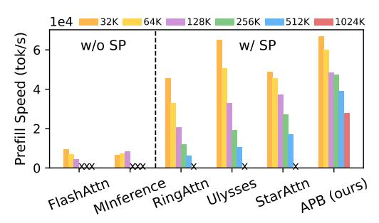

# **APB:** Accelerating Distributed Long-Context Inference by Passing Compressed Context Blocks across GPUs

Yuxiang Huang1\*, Mingye Li2\*†, Xu Han1‡, Chaojun Xiao1‡, Weilin Zhao1, Ao Sun3, Hao Zhou4, Jie Zhou4, Zhiyuan Liu1, Maosong Sun1

1NLP Group, DCST, IAI, BNRIST, Tsinghua University, Beijing, China.

2Department of CS&T, Central South University, Changsha, China.

3BUPT, Beijing, China. 4Pattern Recognition Center, WeChat AI, Tencent Inc. huang-yx21@mails.tsinghua.edu.cn, lmy2004@csu.edu.cn, han-xu@tsinghua.edu.cn, xiaocj20@mails.tsinghua.edu.cn

#### **Abstract**

While long-context inference is crucial for advancing large language model (LLM) applications, its prefill speed remains a significant bottleneck. Current approaches, including sequence parallelism strategies and compute reduction through approximate attention mechanisms, still fall short of delivering optimal inference efficiency. This hinders scaling the inputs to longer sequences and processing long-context queries in a timely manner. To address this, we introduce APB, an efficient long-context inference framework that leverages multi-host approximate attention to enhance prefill speed by reducing compute and enhancing parallelism simultaneously. APB introduces a communication mechanism for essential key-value pairs within a sequence parallelism framework, enabling a faster inference speed while maintaining task performance. We implement APB by incorporating a tailored FLASHATTN kernel alongside optimized distribution strategies, supporting diverse models and parallelism configurations. APB achieves speedups of up to  $9.2\times$ ,  $4.2\times$ , and  $1.6\times$  compared with FLASHATTN, RINGATTN, and STARATTN, respectively, without any observable task performance degradation. We provide the implementation and experiment code of APB in https://github.com/thunlp/APB.

#### 1 Introduction

Large language models (LLMs) (OpenAI, 2024; Anthropic, 2024; DeepSeek-AI, 2024) have demonstrated unprecedented proficiencies, pushing the boundaries of artificial intelligence research and practical applications. Recent advancements are not only transforming usage paradigms but also empowering intelligent systems such as LLM-based agents (Li, 2025; Qin et al., 2024; Zhao et al.,

Figure 1: The prefill speed of methods with and without sequence parallelism when processing different input lengths. "SP" indicates sequence parallelism. "x" represents that the setting triggers out-of-memory error.

2024), robotics (Zeng et al., 2023; Kim et al., 2024), and prompting methodologies (Chu et al., 2023; Sahoo et al., 2024). These systems often rely on extended context inference. To address the growing demand for longer inputs, contemporary foundation models have been increasingly designed to support extended context lengths. For instance, Llama-3.1 (Dubey et al., 2024) supports up to 128K tokens, Claude-3.5 (Anthropic, 2024) extends input capacity to 200K tokens, and MiniMax-01 (Li et al., 2025) can even process input sequences up to 4M tokens.

As context lengths grow, the quadratic computational cost of attention makes single-GPU inference both infeasible and inefficient for LLMs. To address this, various optimizations aim to enhance parallelism or reduce compute. Sequence parallelism (Li et al., 2023), which aims to enhance parallelism, partitions the sequence across devices (termed as hosts) and significantly improves the prefill speed, especially for extremely long inputs (Figure 1). However, the overall computations remain unchanged to ensure the accuracy of the attention results. On the other hand, approximate attention mechanisms (Zhang et al., 2024e; Li et al., 2024b; Jiang et al., 2024), which compute only those elements selected from the attention matrix, accelerate inference by reducing compute but face scalabil-

\* indicates equal contribution.

† Work done during internship at TsinghuaNLP.

&lt;sup>‡ indicates corresponding authors.

ity challenges and performance degradation when processing longer inputs. To this end, designing an approximate attention mechanism that fits in sequence parallelism frameworks offers a promising way to further enhance efficiency, particularly in accelerating long-context prefill. However, *designing such systems demands system and algorithm optimizations to address the key challenges.*

Challenge 1: *Localized Attention Pruning.* Existing widely-used approximate attention mechanisms, such as H2O [\(Zhang et al.,](#page-11-2) [2024e\)](#page-11-2) and SNAPKV [\(Li et al.,](#page-10-7) [2024b\)](#page-10-7), typically depend on full sequence information, such as the attention scores computed over the entire sequence, to prune the redundant compute of the attention scores. This requirement directly conflicts with the distributed architecture of sequence parallelism, where individual hosts only maintain partial context visibility without heavy host-to-host communication.

Challenge 2: *Multi-host Scalability.* Traditional sequence parallelism approaches face inherent scalability limitations due to model-architectural constraints and performance degradation risks. While sequence parallelism with attention head splitting for computation [\(Jacobs et al.,](#page-9-4) [2023\)](#page-9-4) offers substantial throughput improvements, its scalability remains fundamentally bounded by the fixed number of attention heads. Existing solutions that simply combine approximate attention with sequence parallelism, such as STARATTN [\(Acharya et al.,](#page-9-5) [2024\)](#page-9-5), suffer from progressive performance degradation when the number of hosts increases, as these solutions merely extend [Xiao et al.](#page-11-3) [\(2024b\)](#page-11-3) to multiple hosts with a large proportion of invisible context.

To address these challenges, we propose APB, a distributed inference framework designed to leverage approximate attention to reduce redundant compute and communication overhead. For *localized attention pruning*, APB introduces a local keyvalue (KV) cache compression technique that operates independently on each host, eliminating the need for a global sequence view to prune redundant attention compute. For *multi-host scalability*, APB ensures that each host processes all attention heads within its local context and selectively shares compressed critical context across hosts. This design enables APB to maintain stable model performance even as the number of hosts scales up.

We implement APB using a customized FLASH-ATTN [\(Dao,](#page-9-6) [2024\)](#page-9-6) kernel and an optimized distribution framework, enabling efficient scaling across diverse sequence lengths and multiple hosts. Comprehensive evaluations demonstrate that APB achieves an excellent trade-off between inference speed and model performance across a variety of tasks. Additionally, APB is compatible with various model sizes and distribution settings, making it a robust solution for scalable distributed inference. APB achieves speedups of up to 9.2×, 4.2×, and 1.6× compared with FLASHATTN, RINGATTN [\(Li et al.,](#page-10-6) [2023\)](#page-10-6), and STARATTN, respectively, without any observable performance degradation.

