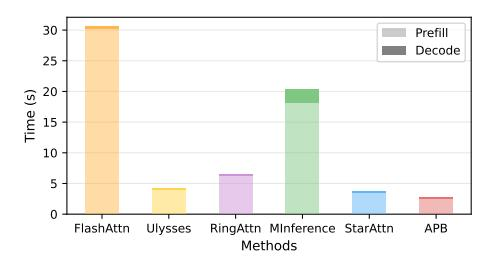

# E.1 Breakdown Analysis: Prefill and Decoding

We conduct a wall-time breakdown analysis to further investigate how APB achieves a higher inference speed. First, we measure the prefill and decoding times for each method, and the results shown in Figure 6 reveal that the prefill stage is the bottleneck, while the decoding stage takes up significantly less time. Since APB optimizes the prefill stage, it is able to address the most time-consuming part of the process.

Figure 6: The wall-time of prefill and decoding for various methods on 128K context. Prefill is the major bottleneck in long-context query processing.

#### **E.2** Hyperparameter Stability

There are two hyperparameters introduced in the APB framework: the length of the anchor block  $l_a$ , and the passing length  $l_p$ . In this study, we examine the sensitivity of these two parameters by measuring the performance on the E.QA task from  $\infty$ Bench for various lengths of  $l_a$  and  $l_p$ .

In this experiment, we use L1ama-3.1-8B as the model backbone. We test on the first 50 samples and set the sequence length to 128K. We present the results with  $l_a, l_p \in \{1\mathrm{K}, 2\mathrm{K}, 3\mathrm{K}, 4\mathrm{K}\}$ .

Figure 7: The E.QA performance of APB with various anchor block length  $l_a$  and passing length  $l_p$ . We select the hyperparameters from  $\{1024, 2048, 3072, 4096\}$ .

The experimental results shown in Figure 7 indicate that both  $l_a$  and  $l_p$  are stable. While there is a slight performance improvement with larger  $l_a$ , the variation remains insignificant. The performance change with varying  $l_p$  is also minimal. This suggests that it is not necessary to tune  $l_a$  and  $l_p$  delicately, making APB easy to use.

| Method   | FLOPs / forward                                                                                                                                                                                                                                                                                              |
|----------|--------------------------------------------------------------------------------------------------------------------------------------------------------------------------------------------------------------------------------------------------------------------------------------------------------------|
| FULLATTN | $L\times \left(4nd^2+\frac{4}{g}nd^2+2n^2d+6ndI\right)$                                                                                                                                                                                                                                                      |
| STARATTN | $\frac{L}{H} \times \left[ (8H - 4)nd^2 + \frac{8H - 4}{g}nd^2 + \frac{8H - 6}{H}n^2d + (12H - 6)ndI \right]$                                                                                                                                                                                                |
| APB      | $L \times \left[ 4 \left( 1 + \frac{1}{g} + \frac{0.5n}{Hd} + \frac{1.5I}{d} \right) \frac{n}{H} d^2 + 4(H-1) \left( 1 + \frac{1}{g} + \frac{0.5 \left( \frac{n}{H} + l_a \right)}{d} + \frac{1.5I}{d} \right) \left( \frac{n}{H} + l_a \right) d^2 + l_p H(H-1) \left( \frac{n}{H} + l_a \right) d \right]$ |

Table 9: The FLOPs per forward call of FULLATTN, STARATTN and APB. "L" stands for the number of layers, "n" stands for the input length, "d" is the hidden size of the model, and "I" is the intermediate size of FFN. "H" stands for the number of hosts, " $l_a$ " is the anchor length, and " $l_p$ " is the passing length. We calculate the compute of the model without the input embedding, the language-modeling head, positional embeddings, and all the normalizations.

| Method     | R.PassKey | R.Number | R.KV  | E.Sum    | E.QA     | E.MC  | E.Dia | Z.QA  | C.Debug | M.Find | Avg.  |
|------------|-----------|----------|-------|----------|----------|-------|-------|-------|---------|--------|-------|
|            |           |          |       | Llama-3. | 1-8B-ins | truct |       |       |         |        |       |
| FLASHATTN  | 4056      | 3998     | 3530  | 609      | 3985     | 3924  | 4280  | 4137  | 3959    | 5209   | 3769  |
| ULYSSES    | 30999     | 30426    | 25266 | 3423     | 27616    | 25860 | 29654 | 25332 | 31289   | 39967  | 26983 |
| RINGATTN   | 20440     | 20218    | 17507 | 3082     | 19476    | 18577 | 20826 | 18779 | 20092   | 25956  | 18495 |
| MINFERENCE | 7910      | 7686     | 5259  | 832      | 6186     | 7238  | 7016  | 6399  | 7719    | 8027   | 6427  |
| STARATTN   | 33968     | 32632    | 25840 | 2605     | 27896    | 31986 | 32267 | 27266 | 31942   | 37051  | 28345 |
| APB        | 44995     | 43111    | 32086 | 2848     | 32930    | 41040 | 36553 | 32057 | 44780   | 45117  | 35552 |
|            |           |          | (     | Qwen-2.5 | -14B-ins | truct |       |       |         |        |       |
| FLASHATTN  | 2155      | 2082     | 1736  | 706      | 1929     | 1758  | 1863  | 1882  | 2131    | 2347   | 1859  |
| ULYSSES    | 17214     | 16461    | 12623 | 1574     | 13374    | 13398 | 14092 | 11131 | 16932   | 18460  | 13526 |
| RINGATTN   | 11056     | 10589    | 8658  | 1314     | 10140    | 9539  | 9982  | 8977  | 10919   | 11676  | 9285  |
| MINFERENCE | 3527      | 3305     | 2244  | 618      | 2645     | 2498  | 2480  | 2222  | 3669    | 3785   | 2699  |
| STARATTN   | 18793     | 17892    | 13695 | 1641     | 14604    | 13874 | 14462 | 12453 | 18640   | 19640  | 14569 |
| APB        | 25218     | 23643    | 17192 | 1592     | 16875    | 17937 | 17267 | 13303 | 25134   | 25929  | 18409 |
|            |           |          |       | Yi-      | 34B-200K |       |       |       |         |        |       |
| FLASHATTN  | 1041      | 1089     | 907   | 372      | 1110     | 1137  | 1099  | 1125  | 1111    | 1208   | 1030  |
| ULYSSES    | 9192      | 8820     | 7383  | 1369     | 8523     | 8388  | 8841  | 8374  | 9016    | 9901   | 7981  |
| RINGATTN   | 6203      | 6032     | 5296  | 1281     | 6021     | 5785  | 5951  | 6024  | 5989    | 6552   | 5513  |
| MINFERENCE | 1732      | 1637     | 1199  | 400      | 1327     | 1760  | 1523  | 1062  | 1766    | 1806   | 1421  |
| STARATTN   | 9039      | 8675     | 7284  | 1893     | 8419     | 9007  | 8866  | 7877  | 9046    | 9373   | 7948  |
| APB        | 12441     | 9404     | 2059  | 10798    | 12726    | 12233 | 9327  | 12744 | 9328    | 12744  | 10624 |

Table 12: The inference speed of APB compared with all the baselines on  $\infty$ Bench. The "Avg." represents the average speed. The highest score in each column is marked in **bold**. We report the speed in "tok/s".

#### E.3 Short-Context Performance of APB

We report the details and hyperparameters of short-context performance experiment here.

As reperted in Section 4.4, we compare task performance and inference speed of RULER using FULLATTN (implemented with FLASHATTN) and APB, with the context length set to 4K tokens, utilizing Llama-3-8B-instruct-1M as the backbone model. In addition, the number of hosts H is set to 4, and both anchor length  $l_a$  and passing length  $l_p$  are set to 256. We evaluate each method on 50 samples per task. We align the settings for inference speed measurement with those used in Figure 3. The detailed results are reported in Table 19.

#### E.4 Accuracy Experiment on LoCoCo

To present a comparison of APB against optimization strategies that target KV cache size reduction to enable faster inference, we select LoCoCo as a baseline here for comparison with APB. We report its performance in this section. As Table 20 shows,

LoCoCo achieves low performance on RULER, as its fixed KV cache size leads to significant information loss, hindering its ability to handle complex long-context tasks effectively. The performance of FULLATTN and APB corresponds to the results reported in Table 2 of the main text, which were evaluated using the Llama-3.1-8B-instruct model. Meanwhile, for the evaluation of LoCoCo, we test only 20 samples for each task.

#### **E.5** The Detailed Experimental Results

Here, we present the detailed experimental results to extensively illustrate each figure in the main text, Section E.1 and E.2. In Section 4.2, the detailed experimental results of Figure 3 are provided in Table 12 and Table 15. Table 12 provides the accurate speed for all methods on ∞Bench, while the speed is the average value across all tasks. By contrast, Table 15 reports the precise speed measurements for all methods on RULER, with the values similarly averaged over all tasks. The performance of each method in Figure 3 is provided in Table 1

and Table 2. In Section 4.3, Figure 17 and Figure 18 present the detailed results corresponding to Figure 4. Specifically, Table 17 aligns with Figure 4(a) while Table 18 corresponds to Figure 4(b). In Section 4.4, the detailed experimental results of Figure 5 are provided in Table 16. In Section E.1, we add the breakdown analysis of the prefill and decoding wall-time for various methods, while the results are illustrated in Figure 6. The detailed experimental results are provided in Table 13. In Section 1, the detailed experimental results of Figure 1 are provided in Table 14. The anchor length and passing length are set to 1024 and 512 for 32K input length, 2048 and 1024 for 64K input length, 4096 and 2048 for 128K-1024K input length.

|            | Prefill Time | Decoding Time |
|------------|--------------|---------------|
| FLASHATTN  | 30137.03     | 422.31        |
| ULYSSES    | 4028.66      | 263.52        |
| RINGATTN   | 6317.03      | 185.33        |
| MINFERENCE | 18067.32     | 2275.61       |
| STARATTN   | 3556.60      | 208.23        |
| APB        | 2554.77      | 284.21        |

Table 13: The accurate time of Figure 6. All the time is reported in "ms". We breakdown the wall-time of Transformer inference into prefill and decoding time.

|            | 32K  | 64K  | 128K  | 256K  | 512K  | 1024K |
|------------|------|------|-------|-------|-------|-------|
| FLASHATTN  | 3.46 | 9.51 | 30.01 | OOM   | OOM   | OOM   |
| ULYSSES    | 0.50 | 1.30 | 3.95  | 13.49 | 49.55 | OOM   |
| RINGATTN   | 0.72 | 2.00 | 6.34  | 21.80 | 81.62 | OOM   |
| MINFERENCE | 4.95 | 8.72 | 15.16 | OOM   | OOM   | OOM   |
| STARATTN   | 0.67 | 1.43 | 3.50  | 9.63  | 30.43 | OOM   |
| APB        | 0.49 | 1.09 | 2.79  | 5.53  | 13.39 | 37.60 |

Table 14: The prefill time of Figure 1. We report the time in "s". "OOM" represents out-of-memory error.

| Method                | SG1                   | SG2   | SG3   | MK1   | MK2   | MK3   | MV     | MQ    | VT    | CWE   | FWE   | QA1   | QA2   | Avg.  |
|-----------------------|-----------------------|-------|-------|-------|-------|-------|--------|-------|-------|-------|-------|-------|-------|-------|
|                       | Llama-3.1-8B-instruct |       |       |       |       |       |        |       |       |       |       |       |       |       |
| FLASHATTN             | 4277                  | 4282  | 4062  | 4317  | 4293  | 4145  | 3908   | 3899  | 3847  | 4203  | 4056  | 4361  | 4382  | 4156  |
| ULYSSES               | 30138                 | 29537 | 25214 | 29611 | 29542 | 24749 | 20721  | 20212 | 27411 | 19994 | 21721 | 29547 | 31609 | 26154 |
| RINGATTN              | 19642                 | 19521 | 17318 | 19760 | 19622 | 17298 | 14582  | 15072 | 18716 | 14731 | 16244 | 20022 | 19862 | 17876 |
| MINFERENCE            | 7660                  | 7579  | 7555  | 7362  | 5780  | 5201  | 4509   | 3245  | 7720  | 7148  | 6544  | 5604  | 3617  | 6117  |
| STARATTN              | 31636                 | 32532 | 25900 | 32436 | 32314 | 25378 | 17494  | 20770 | 29319 | 22738 | 22901 | 19696 | 33661 | 26675 |
| APB                   | 43930                 | 44504 | 33106 | 44502 | 43717 | 33882 | 31328  | 25349 | 39680 | 25580 | 27828 | 42931 | 45664 | 37077 |
| Qwen-2.5-14B-instruct |                       |       |       |       |       |       |        |       |       |       |       |       |       |       |
| FLASHATTN             | 2175                  | 1958  | 1819  | 2054  | 1925  | 1438  | 1426   | 1315  | 1882  | 1352  | 1982  | 2038  | 2045  | 1801  |
| ULYSSES               | 16221                 | 13968 | 13761 | 15047 | 14713 | 11345 | 10552  | 9863  | 14312 | 11420 | 15174 | 15642 | 15464 | 13652 |
| RINGATTN              | 10571                 | 9558  | 9322  | 10070 | 9892  | 7771  | 7791   | 7487  | 9816  | 8267  | 10505 | 10464 | 10358 | 9375  |
| MINFERENCE            | 3391                  | 2097  | 2637  | 2408  | 2389  | 1476  | 1845   | 1634  | 2721  | 1465  | 2756  | 3134  | 3010  | 2382  |
| STARATTN              | 18226                 | 16314 | 15403 | 18285 | 15941 | 11292 | 13469  | 9292  | 15276 | 11039 | 16059 | 16118 | 15965 | 14821 |
| APB                   | 24576                 | 21588 | 19580 | 20732 | 23305 | 14292 | 15638  | 10786 | 18601 | 13469 | 19301 | 21758 | 20339 | 18767 |
|                       |                       |       |       |       |       | Yi-34 | B-200K |       |       |       |       |       |       |       |
| FLASHATTN             | 1194                  | 1146  | 1122  | 1147  | 1182  | 1144  | 1078   | 1099  | 1174  | 1140  | 1224  | 1167  | 1186  | 1154  |
| ULYSSES               | 8466                  | 5513  | 4427  | 5110  | 8659  | 7498  | 6144   | 6674  | 8152  | 7083  | 8099  | 8130  | 8130  | 7083  |
| RINGATTN              | 4478                  | 3895  | 3915  | 5158  | 5814  | 5286  | 4657   | 4862  | 5615  | 5092  | 5685  | 5620  | 5625  | 5054  |
| MINFERENCE            | 1644                  | 1279  | 1199  | 1340  | 1585  | 1293  | 1012   | 1101  | 1450  | 1210  | 1361  | 1484  | 1461  | 1340  |
| STARATTN              | 8554                  | 7569  | 6939  | 7690  | 8713  | 7442  | 6933   | 6704  | 8108  | 7086  | 7826  | 8160  | 8151  | 7683  |
| APB                   | 11989                 | 10176 | 8902  | 10030 | 12061 | 9768  | 7910   | 8396  | 10252 | 9135  | 10264 | 10990 | 10777 | 10050 |

Table 15: The inference speed of APB compared with all the baselines on RULER. The "Avg." represents the average speed. The highest score in each column is marked in **bold**. We report the speed in "tok/s".

|            | QKV Projection | Retaining Head | Communication | Attention | O Projection | FFN    | Others | Transformer Block |
|------------|----------------|----------------|---------------|-----------|--------------|--------|--------|-------------------|
| FLASHATTN  | 25.33          | -              | -             | 664.01    | 17.42        | 201.44 | 32.67  | 940.86            |
| ULYSSES    | 3.31           | _              | 3.90          | 84.53     | 2.27         | 25.88  | 4.62   | 124.51            |
| RINGATTN   | 3.21           | -              | 18.40         | 152.12    | 2.09         | 24.40  | 4.62   | 205.19            |
| MINFERENCE | 24.45          | _              | _             | 281.39    | 15.88        | 201.56 | 40.80  | 564.07            |
| STARATTN   | 6.67           | _              | _             | 41.84     | 4.29         | 50.01  | 8.56   | 111.37            |
| APB        | 4.01           | 1.72           | 0.62          | 34.07     | 2.67         | 30.76  | 6.33   | 80.18             |

Table 16: The accurate time of Figure 5. All the time is reported in "ms". We breakdown the wall-time of each Transformer block into 7 components. "—" indicates that the time of this component does not exist in the corresponding method.

| Method          | SG1    | SG2             | SG3    | MK1             | MK2            | MK3             | MV             | MQ             | VT             | CWE            | FWE   | QA1            | QA2            | Avg.           |
|-----------------|--------|-----------------|--------|-----------------|----------------|-----------------|----------------|----------------|----------------|----------------|-------|----------------|----------------|----------------|
|                 |        |                 |        |                 |                | n = 321         | K              |                |                |                |       |                |                |                |
| FULLATTN        | 100.00 | 100.00          | 98.00  | 100.00          | 96.00          | 82.00           | 97.00          | 98.50          | 92.00          | 40.20          | 88.00 | 82.00          | 64.00          | 87.52          |
| MINFERENCE      | 100.00 | 100.00          | 100.00 | 100.00          | 96.00          | 76.00           | 95.50          | 99.00          | 90.40          | 59.40          | 88.00 | 80.00          | 62.00          | 88.18          |
| STARATTN APB | 100.00 | 100.00 98.00 | 100.00 | 96.00 100.00 | 98.00 98.00 | 96.00 100.00 | 83.50 89.50 | 93.50 98.50 | 88.80 86.40 | 76.20 78.00 | 90.67 | 78.00 74.00 | 62.00 60.00 | 89.44 90.18 |
| AFD             | 100.00 | 98.00           | 100.00 | 100.00          | 96.00          |                 |                | 98.30          | 80.40          | 78.00          | 90.00 | 74.00          | 00.00          | 90.18          |
|                 |        |                 |        |                 |                | n = 641         | K.             |                |                |                |       |                |                |                |
| FULLATTN        | 100.00 | 100.00          | 98.00  | 100.00          | 98.00          | 56.00           | 99.00          | 98.00          | 84.40          | 1.20           | 78.67 | 68.00          | 54.00          | 79.64          |
| MINFERENCE      | 100.00 | 100.00          | 100.00 | 100.00          | 98.00          | 54.00           | 97.50          | 99.50          | 78.00          | 6.20           | 81.33 | 64.00          | 58.00          | 79.73          |
| STARATTN        | 100.00 | 94.00           | 100.00 | 96.00           | 96.00          | 86.00           | 81.50          | 94.50          | 82.40          | 16.00          | 82.00 | 70.00          | 52.00          | 80.80          |
| APB             | 100.00 | 96.00           | 100.00 | 98.00           | 98.00          | 100.00          | 95.00          | 97.50          | 80.40          | 11.40          | 85.33 | 72.00          | 58.00          | 83.97          |
| n = 128K        |        |                 |        |                 |                |                 |                |                |                |                |       |                |                |                |
| FULLATTN        | 100.00 | 100.00          | 100.00 | 98.00           | 100.00         | 36.00           | 98.50          | 95.50          | 77.20          | 0.00           | 72.00 | 68.00          | 46.00          | 76.25          |
| MINFERENCE      | 100.00 | 100.00          | 100.00 | 100.00          | 100.00         | 46.00           | 96.50          | 99.00          | 74.80          | 0.20           | 80.00 | 76.00          | 54.00          | 78.96          |
| STARATTN        | 100.00 | 100.00          | 100.00 | 96.00           | 96.00          | 90.00           | 79.50          | 90.50          | 84.40          | 0.20           | 72.00 | 68.00          | 52.00          | 79.12          |
| APB             | 100.00 | 100.00          | 100.00 | 98.00           | 94.00          | 98.00           | 97.00          | 98.00          | 73.20          | 0.20           | 70.67 | 68.00          | 52.00          | 80.70          |
|                 |        |                 |        |                 |                | n = 256         | K              |                |                |                |       |                |                |                |
| FULLATTN        | 100.00 | 100.00          | 96.00  | 94.00           | 97.22          | 22.00           | 92.50          | 95.00          | 64.00          | 0.60           | 76.67 | 78.00          | 44.00          | 73.85          |
| MINFERENCE      | 100.00 | 100.00          | 100.00 | 96.00           | 94.00          | 46.00           | 91.85          | 95.50          | 77.20          | 0.20           | 79.33 | 72.00          | 48.00          | 76.93          |
| STARATTN        | 100.00 | 96.00           | 100.00 | 94.00           | 86.00          | 66.00           | 78.50          | 83.00          | 70.00          | 0.20           | 80.67 | 68.00          | 42.00          | 74.18          |
| APB             | 100.00 | 96.00           | 100.00 | 94.00           | 94.00          | 94.00           | 93.00          | 98.00          | 47.60          | 0.40           | 78.00 | 70.00          | 46.00          | 77.77          |
|                 |        |                 |        |                 |                | n = 512         | K              |                |                |                |       |                |                |                |
| FULLATTN        | 98.00  | 98.00           | 100.00 | 94.00           | 76.00          | 10.00           | 90.50          | 96.00          | 46.80          | 0.60           | 86.67 | 70.00          | 46.00          | 70.20          |
| MINFERENCE      | 100.00 | 100.00          | 100.00 | 98.00           | 76.00          | 12.00           | 85.50          | 91.00          | 77.20          | 0.40           | 83.33 | 62.00          | 42.00          | 71.34          |
| STARATTN        | 100.00 | 98.00           | 100.00 | 88.00           | 74.00          | 20.00           | 71.50          | 80.00          | 45.20          | 0.40           | 88.00 | 60.00          | 38.00          | 66.39          |
| APB             | 100.00 | 100.00          | 100.00 | 90.00           | 88.80          | 80.00           | 88.80          | 95.00          | 25.20          | 0.80           | 83.33 | 72.00          | 44.00          | 74.33          |

Table 17: The task performance of APB compared with all the baselines on RULER across different input length n, where higher score represents better performance. "Avg." represents the average score.

| Method            | SG1   | SG2   | SG3   | MK1   | MK2   | MK3   | MV           | MQ    | VT    | CWE   | FWE   | QA1   | QA2   | Avg.  |
|-------------------|-------|-------|-------|-------|-------|-------|--------------|-------|-------|-------|-------|-------|-------|-------|
|                   |       |       |       |       |       | n =   | 32K          |       |       |       |       |       |       |       |
| FLASHATTN         | 8955  | 8764  | 8754  | 7369  | 8818  | 7534  | 6259         | 6751  | 8005  | 6614  | 8200  | 8333  | 8121  | 7883  |
| ULYSSES           | 42479 | 40140 | 22599 | 39735 | 45166 | 23239 | 14300        | 15644 | 27447 | 15465 | 26981 | 32685 | 25030 | 28532 |
| RINGATTN          | 31432 | 32855 | 16703 | 29762 | 32016 | 19901 | 14227        | 15243 | 21899 | 12687 | 20532 | 26173 | 22230 | 22743 |
| MINFERENCE        | 4940  | 4714  | 3116  | 4644  | 4725  | 3018  | 1771         | 2097  | 3765  | 2094  | 3608  | 3874  | 3657  | 3540  |
| STARATTN          | 33909 | 34256 | 17630 | 34951 | 36137 | 20604 | 14362        | 12704 | 23505 | 14008 | 23792 | 27637 | 24730 | 24479 |
| APB               | 50778 | 43160 | 18264 | 41896 | 45641 | 21149 | 24893        | 13909 | 30407 | 13457 | 25016 | 29156 | 30863 | 29892 |
| n=64K             |       |       |       |       |       |       |              |       |       |       |       |       |       |       |
|                   |       |       |       |       |       |       |              |       |       |       |       |       |       | 6191  |
| ULYSSES           | 38672 | 37904 | 22892 | 36890 | 38257 | 24925 | 13190        | 18511 | 28011 | 17790 | 27585 | 28760 | 30551 | 27995 |
| RINGATTN          | 27484 | 27209 | 20289 | 27089 | 27621 | 21167 | 11823        | 16726 | 22120 | 15897 | 22340 | 23076 | 23959 | 22062 |
| MINFERENCE        | 5531  | 5437  | 3954  | 5527  | 5156  | 4012  | 2069         | 2531  | 4609  | 3130  | 4364  | 4539  | 4868  | 4287  |
| STARATTN          | 35871 | 35840 | 21658 | 33590 | 33620 | 23213 | 17342        | 16487 | 28760 | 19524 | 27363 | 26143 | 26949 | 26643 |
| APB               | 48822 | 46944 | 32005 | 50754 | 51244 | 29646 | 19554        | 19655 | 30925 | 21003 | 28469 | 29516 | 30056 | 33738 |
| $n=128\mathrm{K}$ |       |       |       |       |       |       |              |       |       |       |       |       |       |       |
| FLASHATTN         | 4262  | 4233  | 3984  | 4285  | 4209  | 4062  | 3463         | 3766  | 4161  | 3910  | 4330  | 4184  | 4266  | 4086  |
| ULYSSES           | 30195 | 29300 | 25446 | 30020 | 30070 | 25720 | 16690        | 20717 | 28030 | 22484 | 28064 | 26920 | 26951 | 26200 |
| RINGATTN          | 20013 | 19221 | 17226 | 19559 | 19565 | 17264 | 13162        | 15344 | 18501 | 16042 | 18622 | 18715 | 18447 | 17822 |
| MINFERENCE        | 5389  | 5385  | 4459  | 5427  | 5097  | 4597  | 2275         | 3167  | 5149  | 3762  | 4851  | 4789  | 4734  | 4545  |
| STARATTN          | 34734 | 34416 | 29086 | 34171 | 33984 | 28468 | 19095        | 20370 | 31682 | 25456 | 31313 | 31339 | 30678 | 29600 |
| APB               | 46644 | 46110 | 36421 | 42653 | 46052 | 35107 | 18480        | 27517 | 40831 | 30995 | 39476 | 40254 | 37931 | 37575 |
|                   |       |       |       |       |       | n =   | 256K         |       |       |       |       |       |       |       |
| FLASHATTN         | OOM   | OOM   | OOM   | OOM   | OOM   | OOM   | OOM          | OOM   | OOM   | OOM   | OOM   | OOM   | OOM   | OOM   |
| ULYSSES           | 18365 | 18295 | 16987 | 18385 | 18265 | 17231 | 12866        | 15530 | 17689 | 16117 | 17894 | 17710 | 17735 | 17159 |
| RINGATTN          | 11847 | 11748 | 11335 | 11777 | 11849 | 11431 | 9325         | 10654 | 11642 | 10925 | 11799 | 11661 | 11663 | 11358 |
| MINFERENCE        | 5046  | 5223  | 4262  | 5027  | 4744  | 4411  | 2315         | 2711  | 4930  | 3705  | 4682  | 4519  | 4559  | 4318  |
| STARATTN          | 26455 | 26174 | 23985 | 26096 | 26304 | 24073 | 18374        | 18399 | 25383 | 22303 | 24674 | 25413 | 24953 | 24045 |
| APB               | 34126 | 33613 | 29983 | 34000 | 33914 | 30404 | 19710        | 25390 | 32728 | 26596 | 31437 | 31574 | 32469 | 30457 |
|                   |       |       |       |       |       | n =   | 512 <b>K</b> |       |       |       |       |       |       |       |
| FLASHATTN         | OOM   | OOM   | OOM   | OOM   | OOM   | OOM   | OOM          | OOM   | OOM   | OOM   | OOM   | OOM   | OOM   | OOM   |
| ULYSSES           | 10327 | 10249 | 10089 | 10299 | 10317 | 9993  | 8910         | 9334  | 10324 | 9797  | 10458 | 10192 | 10259 | 10042 |
| RINGATTN          | 6395  | 6337  | 6246  | 6331  | 6383  | 6253  | 5783         | 5937  | 6342  | 6138  | 6508  | 6332  | 6332  | 6255  |
| MINFERENCE        | 4796  | 4720  | 3999  | 4468  | 4465  | 4134  | 2261         | 2314  | 4585  | 3613  | 4562  | 4367  | 4332  | 4047  |
| STARATTN          | 16841 | 16661 | 16130 | 16556 | 16746 | 15988 | 13936        | 14365 | 16969 | 15737 | 16969 | 16798 | 16600 | 16177 |
| APB               | 28100 | 27614 | 25938 | 28315 | 28306 | 25773 | 19435        | 22188 | 27541 | 24470 | 27484 | 27087 | 27082 | 26102 |

Table 18: The inference speed of APB compared with all the baselines on RULER across different input length n. "Avg." represents the average speed. We report the speed in "tok/s". "OOM" represents out-of-memory error.

| Method   | SG1    | SG2   | SG3    | MK1   | MK2    | MK3    | MV     | MQ    | VT    | CWE   | FWE   | QA1   | QA2   Avg.    | tok/s.  |
|----------|--------|-------|--------|-------|--------|--------|--------|-------|-------|-------|-------|-------|---------------|---------|
| FULLATTN | 100.00 | 98.00 | 100.00 | 98.00 | 98.00  | 100.00 | 100.00 |       | 98.80 |       |       | 84.00 | 64.00   94.54 |         |
| APB      | 100.00 | 92.00 | 100.00 | 98.00 | 100.00 | 94.00  | 100.00 | 99.50 | 98.80 | 98.00 | 95.33 | 90.00 | 68.00 94.89   | 6597.47 |

Table 19: The task performance and inference speed of APB and FULLATTN (FLASHATTN) on RULER, where input length is set to 4K tokens. We report the speed in "tok/s". "Avg." represents the average score.

| Method                    | SG1                             | SG2                             | SG3  | MK1  | MK2   | MK3   | MV   | MQ   | VT    | CWE   | FWE   | QA1                      | QA2   | Avg   |
|---------------------------|---------------------------------|---------------------------------|------|------|-------|-------|------|------|-------|-------|-------|--------------------------|-------|-------|
| FULLATTN LoCoCo APB | 99.40 30.00 <b>100.00</b> | 99.80 10.00 <b>100.00</b> | 0.00 | 0.00 | 10.00 | 10.00 | 5.00 | 7.50 | 24.00 | 56.50 | 75.00 | <b>78.20</b> 40.00 70.00 | 20.00 | 22.15 |

Table 20: The task performance of LoCoCo compared with APB and FullAttn on RULER. "Avg." represents the average score. FullAttn represents FlashAttn, RingAttn, and Ulysses, as their computational results remain unchanged.