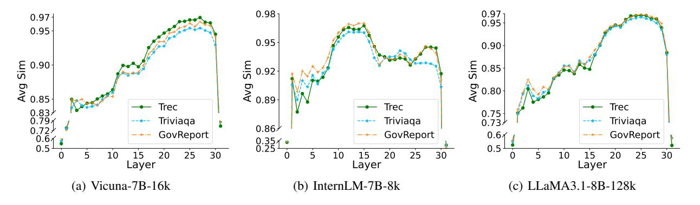

# Background and Motivation

In this section, we first perform a comprehensive exploration of the importance metric of the layer and sublayer-wise modules, then present observations on the characteristics of the importance distribution and motivate our design principles.

### IO Similarity and Transformer Module Importance

We first define the metric, *similarity*, to evaluate the importance of transformer layers and sublayer modules. Given two n-dimensional vectors, ⃗a and ⃗b, we characterize the cosine similarity between these vectors as their similarity, defined as follows:

$$Similarity(\vec{a}, \vec{b}) = \frac{\vec{a} \cdot \vec{b}}{\|\vec{a}\| \|\vec{b}\|} = \frac{\sum_{i=1}^{n} a_i b_i}{\sqrt{\sum_{i=1}^{n} a_i^2} \sqrt{\sum_{i=1}^{n} b_i^2}}$$
(1)

Following the existing works (Liu et al. 2023b; Jaiswal et al. 2024; Fan et al. 2024), the similarity between the input and output (IO) vectors of the transformer module, i.e., IO similarity, can be used to evaluate the importance of a transformer module. Specifically, following the forwarding of each module, if the input vector of the module closely resembles the output vector, it indicates that the module contributes minimally to the forward propagation process. In other words, the current module contributes less *importance* in terms of execution. Conversely, the current module possesses higher *importance* in terms of execution if the IO similarity is low.

We further empirically validate the correlation between the IO similarity and the importance of a transformer module. Given an inference task, we conduct a first-round inference process to profile the IO similarity of each transformer layer. Subsequently, we execute a second-round inference process that selectively skips the layers based on varying degrees of the profiled IO similarity. Then we assess the quality of generated output by evaluating its GPT score (Varshney et al. 2023; Jaiswal et al. 2024). The LeastSkip strategy, which skips the layers exhibiting the lowest IO similarity, experiences a substantial degradation in the GPT score (dropping below 1.0 even with one skipped layer), compared to the MostSkip strategy, which skips the layers with the highest IO similarity and yields GPT scores of 8.9, 6.1, and 4.2 when skipping 1, 3, and 5 layers, respectively.

### Existing Layer-wise Skipping Strategies

Existing layer-wise skipping strategies propose skipping fixed layers with certain preferences to reduce inference execution time. As shown in Figure 1, according to the strategies to skip layers, existing layer-wise skipping strategies can be broadly categorized into three types: early skipping (Del Corro et al. 2023), periodic skipping (Liu, Meng, and Zhou 2024), and early exit (Schuster et al. 2022; Varshney et al. 2023; Fan et al. 2024; Bae et al. 2023). Early skipping (Del Corro et al. 2023) always skips the first few layers that are predetermined. Early skipping can support batching operations but may skip the important layers. Periodic skipping (Liu, Meng, and Zhou 2024) periodically skips a few middle layers. It follows a predetermined frequency to skip one layer every several layers. Periodic skipping supports batching operations but cannot capture the varying importance of different layers. Early exit (Varshney et al. 2023; Fan et al. 2024) always skips the last few layers. It evaluates whether the conditions (e.g., confidence level) are met after finishing the computation of each layer and the execution immediately exits upon condition fulfillment. Early exit may overlook the important layers that come later. Moreover, existing early exit strategies need to pay additional efforts and costs to either train classifier (Del Corro et al. 2023) or fine-tune the model to counterbalance the information loss resulting from imperfect layer skipping (Liu, Meng, and Zhou 2024; Varshney et al. 2023; Fan et al. 2024).

### Motivation

This subsection analyzes the limitations of existing LLM acceleration strategies for long-context inference.

Observation 1: *The layer importance distribution exhibits significant variation across diverse models.* We follow the same way used in the previous section to investigate the IO similarities of different layers on various models, in both prefilling and decoding phases. Figure 2 shows significant variation in the IO similarities of transformer layers for different models in three long-context datasets. Taking InternLM-7B-8k and LLaMA3.1-8B-128k as examples, layers with high IO similarity in InternLM-7B-8k appear in the middle, such as layers 12,13,14, and the curve is more irregular. Whereas layers with high IO similarity in LLaMA3.1-8B-128k, appear towards the end, with layers 27, 25, 28, 29, and 26 being the top 5 layers, and the curve is approximately monotonically ascending. This suggests that layer importance distributions vary among different models. Existing layer-wise skipping strategies tend to consistently skip fixed layers, overlooking the differences in importance distribution across models, which restricts their adaptability to various models. Adaptive skipping strategies matching various models are required.

Observation 2: *The importance distributions of attention and FFN modules are different.* We study the IO similarities of the sublayer-wise modules, i.e., attention and FFN. As shown in Figure 3, the sublayer-wise modules show diverse IO similarity distributions. Taking LLaMA3.1-8B-128k as an example, in the last 11 layers, the average IO similarity of attention is consistently around 0.97, indicating a high IO similarity. However, the highest average IO similarity of FFN in the last 11 layers is only 0.95, and it is relatively scattered. Furthermore, compared to FFN, attention modules demonstrate higher and more concentrated similarity, implying that a greater number of attention modules can be skipped, with the potential to save more KV cache in long-

Figure 1: The comparisons of different skipping strategies. The dashed box indicates the layer to be skipped.

Figure 2: IO similarities of different layers in various transformer models.

context inference. The different characteristics in IO similarity distributions of attention and FFN suggest that the existing layer-wise skipping methodologies that monolithically skip entire transformer layers are sub-optimal. Consequently, the attention sublayer and FFN sublayer within one transformer layer should be considered separately.

Observation 3: The importance distribution of sublayers in the prefilling and decoding phases have similar trends but different fluctuation degrees. We further investigate the IO similarities of sublayer modules in the prefilling and decoding phases respectively. As shown in Figure 4, both attention and FFN sublayers display a consistent IO similarity trend between the prefilling and decoding phases, indicating that similar skipping strategies can be shared between the two phases. What's more, we found a phenomenon that among all three models, each FFN sublayer has a higher IO similarity in the decoding phase than in the prefilling phase, which is different from that of attention sublayers. This suggests that we have the opportunity to skip more FFN sublayers in the decoding phase without affecting the model performance.

**Challenges.** Based on the above observations, an efficient skipping strategy for long-context inference should have the following capabilities: (1) adaptability to various models, (2) independent decision-making for sublayer-wise skipping, and (3) the ability to skip the most unimportant layers in both the prefilling and decoding phases.

However, implementing such a skipping strategy encounters several challenges. First, limited prior information is available to guide the skipping decisions throughout the prefilling phase. Second, distinguishing the unique information corresponding to specific models and contexts, required for making adaptive choices, is far from straightforward.

### Methodology

#### Overview

To tackle the above challenges, we propose a novel skipping strategy for long-context inference, called AdaSkip, which adaptively selects sublayer-wise modules to skip considering the characteristics of models and inference context. Specifically, AdaSkip efficiently learns the importance distributions from the past inference execution to construct the skipping strategy for the prefilling phase. It further improves the skipping decision by online importance learning from on-the-fly intermediate data during the decoding phase. By integrating the above techniques, AdaSkip can accurately skip the least important sublayer-wise modules, avoiding the mismatch of layer importance and layer skipping decisions in fixed layer-wise skipping strategies.

