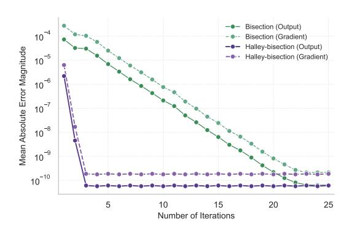
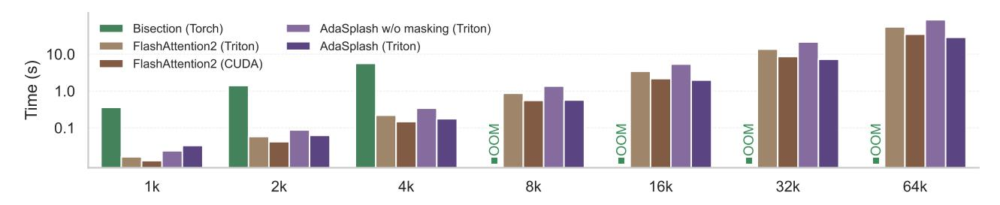
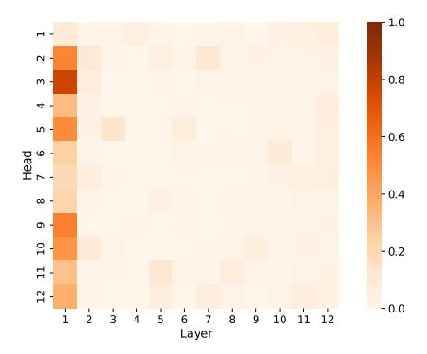

# 2. Background

## 2.1. Hardware Performance

Modern GPUs, such as the Nvidia H100, are designed for efficient parallel computation using a hierarchical memory architecture, with high-bandwidth memory (HBM) providing large capacity but slower access compared to the smaller, faster on-chip SRAM. Efficient use of SRAM is critical to minimize the memory bottlenecks caused by frequent HBM accesses. GPUs execute operations (kernels) via thousands of threads organized into thread blocks, where data is loaded from HBM into SRAM for computation before being written back. Kernel fusion is a key optimization strategy that combines multiple operations into a single kernel, reducing intermediate HBM accesses by directly computing and storing final results. While compilers like torch.compile can automate fusion for simple operations [\(Ansel et al.,](#page-8-0) [2024\)](#page-8-0), complex tasks such as attention mechanisms require custom strategies to reorder operations and optimize memory usage effectively. Our method leverages this GPU memory organization by implementing block-wise computations, recomputation strategies, and kernel fusion specifically tailored for sparse attention, as detailed in [§3.2.1](#page-3-0) and [§3.2.2.](#page-4-0)

### 2.2. Standard Attention

Given a set of matrices Q, K,V ∈ R n×d containing ddimensional representations for n queries, keys and values, the *dot-product self-attention* at a single head is computed

in the following way [\(Vaswani et al.,](#page-11-0) [2017\)](#page-11-0):

<span id="page-1-0"></span>
$$O = \pi \left( \underbrace{\frac{QK^{\top}}{\sqrt{d}}}_{S \in \mathbb{R}^{n \times n}} \right) V \in \mathbb{R}^{n \times d}.$$
 (1)

The π transformation usually maps rows to distributions, with π(S)ij = softmax (si) j being a common choice. For decoder-only models, S is masked in order to ignore the contribution from future tokens. Notably, a naive implementation of Equation [1](#page-1-0) leads to a O n 2 time and memory complexity for training.

### 2.3. FlashAttention

To address the costs of naive attention implementations, [Dao et al.](#page-9-6) [\(2022\)](#page-9-6) introduced FlashAttention, an algorithm that avoids the materialization of quadratic matrices via a GPU-aware implementation of online softmax [\(Milakov &](#page-10-4) [Gimelshein,](#page-10-4) [2018\)](#page-10-4), bringing the overall memory complexity to O (n). Subsequent versions of FlashAttention further improved GPU usage by reordering the loops, reducing the number of non-GEMM (general matrix multiply) operations [\(Dao,](#page-9-4) [2024\)](#page-9-4), and exploiting the asynchronicity and support for FP8 low-precision on the new Hopper GPUs [\(Shah et al.,](#page-11-7) [2024\)](#page-11-7). The key idea of FlashAttention is to split the inputs Q, K,V into blocks, load them from slow GPU high bandwidth memory (HBM) to the fast GPU on-chip SRAM, then compute the attention output regarding those blocks and, at the end, scale the output by the right normalization factor.

## 2.4. Sparse Attention

The original softmax-based attention is *dense*, i.e., it puts *some* probability mass on all tokens—not only a computational disadvantage, but also making interpretation and generalization harder [\(Voita et al.,](#page-11-2) [2019;](#page-11-2) [Treviso et al.,](#page-11-3) [2022;](#page-11-3) [Velickovi](#page-11-1) ˇ c et al. ´ , [2025\)](#page-11-1). An alternative to softmax is the α-entmax transformation [\(Peters et al.,](#page-10-3) [2019\)](#page-10-3), which is differentiable and leads to sparse outputs:

<span id="page-1-1"></span>
$$\alpha\text{-entmax}(\mathbf{s}) = [(\alpha - 1)\mathbf{s} - \tau \mathbf{1}]_{+}^{1/\alpha - 1}, \tag{2}$$

where [·]<sup>+</sup> is the ReLU function, and τ ∈ R is a normalizing constant to ensure the output is a valid probability distribution. Importantly, entries with score s<sup>i</sup> ≤ τ α−1 get exactly zero probability. In the limit α → 1, α-entmax recovers the softmax function, while for any value of α > 1 this transformation returns increasingly sparser probability vectors. When α = 2, we recover the sparsemax transformation [\(Martins & Astudillo,](#page-10-2) [2016\)](#page-10-2). However, in contrast to fixed sparse patterns, such as windowed sparse attention [\(Child](#page-9-7) [et al.,](#page-9-7) [2019;](#page-9-7) [Beltagy et al.,](#page-9-0) [2020\)](#page-9-0) and block-sparse variants [\(Zaheer et al.,](#page-11-4) [2020b;](#page-11-4) [Dao et al.,](#page-9-6) [2022\)](#page-9-6), α-entmax's sparsity patterns are dynamic and hence difficult to exploit

in order to reduce the quadratic burden of self-attention because we still need to materialize  $S = QK^{\top}$  before applying the transformation.

In the next section (§3), we outline ADASPLASH, our new method for computing  $\alpha$ -entmax attention, along with a novel custom Triton kernel (Tillet et al., 2019) that enables efficient training of transformers for extremely long context lengths. As shown in §4, our implementation maintains competitiveness with state-of-the-art algorithms such as FlashAttention by leveraging the sparsity given by  $\alpha$ -entmax, effectively exploiting the advantages of sparse attention at scale.

### <span id="page-2-0"></span>3. ADASPLASH

We start by revisiting the computation of  $\alpha$ -entmax for general values of  $\alpha$  in §3.1, and proposing a new algorithm that has a fast empirical convergence. We design an efficient Triton kernel in §3.2, dubbed ADASPLASH, that effectively leverages adaptive sparsity patterns in both the forward and backward passes of  $\alpha$ -entmax in order to minimize runtime.

### <span id="page-2-1"></span>3.1. $\alpha$ -entmax Computation

In order to compute Equation 2 for a given  $s \in \mathbb{R}^n$ , we need to find the threshold  $\tau \in \mathbb{R}$  such that the resulting output sums to 1. Mathematically, this is equivalent to finding the root of the following equation:

<span id="page-2-4"></span>
$$f(\tau) = \sum_{i} \left[ (\alpha - 1)s_i - \tau \right]_{+}^{1/(\alpha - 1)} - 1.$$
 (3)

Exact algorithms for  $\alpha \in \{1.5, 2\}$ . In particular, for  $\alpha = 2$ , the computation is reduced to an Euclidean projection onto the probability simplex, for which efficient algorithms have been extensively studied (Held et al., 1974; Duchi et al., 2008; Condat, 2016). Similarly, for  $\alpha = 1.5$ , Peters et al. (2019) introduced an exact sort-based algorithm. However, these methods either require complex data structures that are not efficiently handled in GPUs, or sorting-based algorithms, which require the materialization of the entire input.

**Bisection algorithm for**  $\alpha > 1$ . For a general  $\alpha$ , Blondel et al. (2019) introduced a bisection update rule to approximate  $\tau$  by iteratively refining its lower ( $\tau_{lo}$ ) and higher ( $\tau_{hi}$ ) bounds:

<span id="page-2-2"></span>
$$B_f(\tau) = \begin{cases} (\tau_{\text{lo}}, \tau) & \text{if } f(\tau) < 0, \\ (\tau, \tau_{\text{hi}}) & \text{otherwise,} \end{cases}$$
 (4)

obtaining  $\tau = \frac{1}{2}(\tau_{lo} + \tau_{hi})$  after the last iteration. While the bisection algorithm is simple and effective, it converges at a linear rate (Kaufman & Lenker, 1986), meaning the absolute error decreases by approximately half at each iter-

**Algorithm 1** Halley-bisection algorithm for  $\alpha$ -entmax.

```
1: Input: logits s \in \mathbb{R}^n, param. \alpha \in \mathbb{R}, iterations T
 2: Define f(\tau) := \sum_{i} [s_i - \tau]_+^{1/(\alpha - 1)} - 1
 3: Set s \leftarrow (\alpha - 1)\overline{s}
 4: Initialize \tau_{lo} = \max(s) - 1
 5: Initialize \tau_{hi} = \max(s) - n^{1-\alpha}
 6: Initialize \tau = (\tau_{lo} + \tau_{hi})/2
          Compute \tau_{lo}, \tau_{hi} = B_f(\tau) (Equation 4)
 8:
          Compute \tau_H = H_f(\tau) (Equation 5)
 9:
10:
          if \tau_H \in [\tau_{lo}, \tau_{hi}] then
                                                              ▷ (Halley's Update)
11:
12:
         \begin{aligned} \tau &\leftarrow \tfrac{1}{2}(\tau_{\text{lo}} + \tau_{\text{hi}}) \\ \text{end if} \end{aligned}
13:
                                                           ▷ (Bisection Update)
15: until T iterations are completed
16: Output: [s - \tau \mathbf{1}]_{+}^{1/(\alpha - 1)}
```

ation. Achieving high precision often requires many iterations, resulting in frequent memory accesses. As a result, in memory-bound scenarios where the time taken is mostly determined by the number of memory accesses—such as in attention—the number of iterations can significantly impact the runtime cost.

**Halley-bisection algorithm.** In order to obtain a faster runtime, we propose a hybrid algorithm for solving Equation 3 for any  $\alpha>1$  that combines the convergence guarantee of bisection with the faster convergence of Halley's method (Scavo & Thoo, 1995). As we show in §4.1, this approach achieves significant wall-clock speed-ups while requiring fewer iterations to attain the same precision.

The function defined in Equation 2 enjoys a cheap computation of its derivatives. Thus, methods that incorporate second-order information, such as Halley's method, can be leveraged to improve the approximation of  $\tau$  at each iteration. Halley's method, which uses both the first and second derivatives, updates the solution using the following rule:

<span id="page-2-7"></span><span id="page-2-6"></span><span id="page-2-3"></span>
$$H_f(\tau) = \tau - \frac{2f(\tau)f'(\tau)}{2f'(\tau)^2 - f(\tau)f''(\tau)},$$
 (5)

where the derivatives are given as follows:

$$f'(\tau) = -\frac{1}{\alpha - 1} \sum_{i} \left[ (\alpha - 1)s_i - \tau \right]_{+}^{1/(\alpha - 1) - 1}, \quad (6)$$

$$f''(\tau) = \frac{2 - \alpha}{(\alpha - 1)^2} \sum_{i} \left[ (\alpha - 1)s_i - \tau \right]_{+}^{1/(\alpha - 1) - 2}.$$
 (7)

While Halley's method offers faster convergence under ideal conditions, it does not always converge, particularly when



Figure 2. Comparison of mean absolute error magnitudes between Halley-bisection and Torch's bisection methods across iterations, measured against the exact solution for  $\alpha = 1.5$ .

the initial guess is far from the solution. To ensure convergence, we introduce a fail-safe mechanism that integrates the convergence guarantee of bisection: whenever Halley's method produces an update that moves the solution out of the bisection bounds, the algorithm reverts to a bisection update  $B_f(\tau)$ . This ensures that the algorithm converges, even in the worst cases, while leveraging the cubic convergence of Halley's method wherever possible. We outline our hybrid algorithm in Algorithm 1.

**Efficiency Benchmark.** We compare the runtime of Halley-bisection against existing algorithms for computing  $\alpha$ -entmax implemented in Torch. Specifically, we generate random tensors from a standard Gaussian distribution  $(\mu = 0, \sigma^2 = 1)$  with a fixed sequence length of n = 8192. For each configuration, we measure the average runtime over 1000 runs. Overall, we observe that Halley-bisection is significantly more efficient than the standard bisection algorithm implemented in Torch. Halley-bisection achieves a runtime of 2.38 ms, compared to 36.67 ms for the standard bisection algorithm, making it approximately  $15 \times$  faster. In addition, Halley-bisection reduces memory usage by  $1.75\times$ , requiring only 512 MB compared to 896.15 MB for bisection. Furthermore, in Figure 2 we show that Halley-bisection  $(\alpha = 1.5)$  requires only 3 iterations to converge to machine precision for both the output and the gradient. On the other hand, the standard bisection algorithm takes 23 iterations to achieve the same precision for both cases.

### <span id="page-3-1"></span>3.2. Flash $\alpha$ -entmax Attention

Given an algorithm to compute the entmax mapping that requires T iteration steps, a naive implementation of entmax attention proceeds as follows: (1) multiply  $S = QK^{\top} \in$  $\mathbb{R}^{n \times n}$  and write the result to slow HBM on the GPU; (2) load S from HBM T times to compute  $\tau$ ; (3) load S from HBM again, and write the result  $P = \alpha$ -entmax (S) to HBM; (4) perform a matrix multiplication to get the output

Algorithm 2 ADASPLASH forward pass (w/o masking)

- <span id="page-3-3"></span>1: **Require:** Matrices  $Q, K, V \in \mathbb{R}^{n \times d}$  in HBM, block sizes  $B_c, B_r$ , param.  $\alpha \in \mathbb{R}$ 2: Divide Q into  $T_r = \lceil n/B_r \rceil$  blocks  $Q_1, \ldots, Q_{T_r}$  of size  $B_r \times d$
- 3: Divide K, V into  $T_c = \lceil n/B_c \rceil$  blocks  $K_1, \dots, K_{T_c}$  $V_1, \ldots, V_{T_c}$  of size  $B_c \times d$
- 4: Divide  $O \in \mathbb{R}^{n \times d}$  into  $T_r$  blocks  $O_1, \dots, O_{T_r}$  of size  $B_r \times d$
- <span id="page-3-2"></span>5: Divide  $\tau$  into  $T_r$  blocks  $\tau_1, \ldots, \tau_{T_r}$  of size  $B_r$
- 6: **for** i = 1 to  $T_r$  **do**
- Load  $Q_i$  from HBM to on-chip SRAM 7:
- 8: On chip, initialize  $O_i$
- On chip, compute  $\tau_i$  using Hybrid Halley's with predefined  $\alpha$ , using a block version of Algorithm 1.
- 10: for j = 1 to  $T_c$  do
- Load  $\bm{K}_j, \bm{V}_j$  from HBM to on-chip SRAM Compute  $\bm{S}_i^{(j)} = \bm{Q}_i \bm{K}_j^\top \in \mathbb{R}^{B_r \times B_c}$ 11:
- 12:

13: Compute 
$$P_i^{(j)} = \left[ (\alpha - 1) S_i^{(j)} - \tau_i \right]_+^{1/\alpha - 1}$$

- Accumulate  $O_i \leftarrow O_i + P_i^{(j)} V_j$ 14:
- 15:
- 16: Write  $O_i$  and  $\tau_i$  to HBM
- 17: end for
- 18: **Return:** Output O and  $\tau$

O = PV. However, since most of these operations are memory-bound, the excessive number of HBM accesses leads to slow wall-clock times. Moreover, having to materialize S and P in memory poses a major bottleneck, as their sizes quickly exceed GPU memory capacity when the sequence length n increases. To address these issues and speed up  $\alpha$ -entmax attention on hardware accelerators like GPUs, we propose an algorithm that reduces HBM reads and writes while producing the same outputs as the naive implementation.

### <span id="page-3-0"></span>3.2.1. FORWARD PASS

We outline the forward pass in Algorithm 2 (without masking full-zero blocks, which we introduce later on this section). Concretely, given the inputs  $Q, K, V \in \mathbb{R}^{n \times d}$ stored in HBM, the goal is to compute the attention output  $O \in \mathbb{R}^{n \times d}$  efficiently and write it back to HBM. Akin to the approach taken in FlashAttention (Dao et al., 2022), we employ two well-known techniques—tiling and recomputation—to address the challenge of materializing the matrices  $S \in \mathbb{R}^{n \times n}$  and  $P \in \mathbb{R}^{n \times n}$ .

**Tiling.** The key idea involves splitting the inputs Q, K, Vinto smaller blocks, and then computing attention block by block. We start by loading only Q and K from the slower HBM to the faster SRAM to compute  $\tau \in \mathbb{R}^n$  using the

Halley-bisection algorithm (Alg. 1). In order to use the aforementioned algorithm, we need to accumulate three values:  $f(\tau)$ ,  $f'(\tau)$ ,  $f''(\tau)$ . Since f, as well as its derivatives, is additive over its inputs, their computation can also be computed in blocks. Let  $B_r$  and  $B_c$  be the row and column block sizes, respectively, and define  $T_r = \lceil n/B_r \rceil$  and  $T_c = \lceil n/B_c \rceil$ . Divide Q into  $Q_1, ..., Q_{T_r}$  blocks, and K into  $K_1, ..., K_{T_c}$  blocks. Then,  $f(\tau)$  can be computed as:

$$f(\boldsymbol{\tau}_i) = \sum_{j=1}^{T_c} f(\boldsymbol{\tau}_i; \boldsymbol{S}_i^{(j)})$$
 (8)

where  $S_i^{(j)} = Q_i K_j^\top \in \mathbb{R}^{B_r \times B_c}$  and  $\tau_i$  represents the  $i^{\text{th}}$  sliced block of  $\tau$  with size  $T_r$ . Thus, these quantities do not need to ever be materialized and can be accumulated directly in fast memory. Afterwards, we load V to compute the attention output O for those blocks. In contrast to FlashAttention, our approach requires loading K to compute S at least two additional times. Therefore, the forward pass is bound to always be slower than FlashAttention's due to the extra HBM reads and computation.

**Recomputation.** In order to avoid the materialization of the matrices S and P, we recompute them again in Algorithm 1, which is used to compute  $\tau$ , and also recompute them for obtaining the gradients for the backward pass. By doing this we are increasing the required FLOPs to reduce the maximum amount of memory required. While this might suggest an increase in runtime, the opposite is observed (Dao et al., 2022). Despite the need for additional matrix multiplications, the reduction in total HBM reads and writes more than offsets the extra FLOPs, leading to improved performance overall.

Sparsity-aware implementation. The key challenge of  $\alpha$ -entmax attention lies in finding the threshold  $\tau$ , which requires multiple evaluations of the function  $f(\tau)$ , which, in turn, depends on the score matrix S. While our proposed Halley-bisection algorithm alleviates the number of iterations needed to recompute  $S_i^{(j)}$  by providing a faster empirical convergence, our current implementation still iterates over all blocks of S, including **null blocks**—blocks where the corresponding entries of the sparse attention matrix P are zero.

Furthermore, empirical evidence from Jiang et al. (2024) and (Xiao et al., 2024) suggests that for long inputs (e.g., 128k tokens in LLaMa-3-8b), approximately 3% of the entries in P suffice to capture over 96% of the total attention, which motivates an approach to leverage the adaptive and unstructured sparsity of  $\alpha$ -entmax attention weights. To this end, we propose to only compute necessary blocks of P by skipping the null blocks. Concretely, let  $\mathcal{I}(i)$  denote the set of all indices i' such that  $|i'/T_T| = i$ , and  $\mathcal{J}(j)$  denote the

set of all indices j' such that  $\lfloor j'/T_c \rfloor = j$ . We construct a **block mask** matrix  $M \in \{0,1\}^{T_r \times T_c}$  as follows:

<span id="page-4-2"></span>
$$M_{ij} = \begin{cases} 1 & \text{if } \exists_{i' \in \mathcal{I}(i), j' \in \mathcal{J}(j)} : S_{i', j'} > \tau_{i'}, \\ 0 & \text{otherwise,} \end{cases}$$
 (9)

Importantly, M is created dynamically after a small predefined number of Halley-bisection iterations.

While the introduction of M breaks the linear memory complexity of dense fused-attention by requiring  $T_r \times T_c$  extra memory, the overhead is still manageable as it only contains binary values and is substantially smaller than the full  $P \in \mathbb{R}^{n \times n}$  matrix. Furthermore, M needs to be materialized only once and its memory can be shared across all attention layers. To leverage M in practice, we propose to create two **pointer-increment lookup tables**:

- 1.  $\mathcal{K}_j = \{i \mid M_{ij} = 1\}$ : A table containing the row indices i of M that lead to non-null blocks in  $P_i^{(j)}$ .
- 2.  $Q_i = \{j \mid M_{ij} = 1\}$ : A table containing the column indices j of M that lead to non-null blocks in  $P_i^{(j)}$ .

These tables enable efficient skipping of K and V blocks that do not contribute to the final attention output O, significantly reducing unnecessary computations. Moreover, the same mechanism can be extended to accelerate the backward pass, where gradients with respect to Q, K, and V are computed, which we describe next.

## <span id="page-4-0"></span>3.2.2. BACKWARD PASS

In FlashAttention (Dao et al., 2022), the backward pass is executed using a single kernel that parallelizes computation across batch, head, and sequence dimensions. However, following Triton's official implementation of FlashAttention, we separate the backward pass into two kernels: one for dQ (the gradient w.r.t. Q) and another for dK and dV (the gradients w.r.t. K and V).

**Sparse Jacobian of**  $\alpha$ **-entmax.** The sparsity in the Jacobian of  $\alpha$ -entmax plays a crucial role in the backward pass. For  $p = \alpha$ -entmax(s), the Jacobian is (Peters et al., 2019)

$$\frac{\partial \alpha \text{-entmax}(\mathbf{s})}{\partial \mathbf{s}} = \text{Diag}(\mathbf{u}) - \frac{\mathbf{u}\mathbf{u}^{\top}}{\|\mathbf{u}\|_{1}}, \quad (10)$$

where  $u_j = (p_j)^{2-\alpha}$ . Importantly, this Jacobian is sparse and only depends on p, which, in turn, is a function of  $\tau$  computed during the forward pass. We denote by  $U \in \mathbb{R}^{n \times n}$  the matrix defined element-wise as  $U_{lk} = P_{lk}^{2-\alpha}$ , and by  $U_i^{(j)} \in \mathbb{R}^{B_r \times B_c}$  its  $(i,j)^{\text{th}}$  block. Using this information,

<span id="page-4-1"></span><sup>2</sup>https://github.com/triton-lang/triton/blob/main/python/tutorials/06-fused-attention.py



<span id="page-5-2"></span>Figure 3. Efficiency of algorithms for computing non-causal attention in terms of the average training step time for increasingly longer sequence lengths. We use  $\alpha = 1.5$  for  $\alpha$ -entmax based methods (Bisection and ADASPLASH).

the gradient w.r.t. the score matrix  $S_i^{(j)} \in \mathbb{R}^{B_r \times B_c}$  can be efficiently computed as:

$$dS_i^{(j)} = U_i^{(j)} \odot dP_i^{(j)} - \text{Diag}(\delta_i)U_i^{(j)}, \quad (11)$$

where  $dP_i^{(j)} = dO_iV_j^{\top} \in \mathbb{R}^{B_r \times B_c}$ , with  $dO_i \in \mathbb{R}^{B_r \times n}$  and  $V_j \in \mathbb{R}^{B_c \times n}$ , and  $\delta_i \in \mathbb{R}^{B_r}$  denotes the  $i^{\text{th}}$  block of the vector  $\delta \in \mathbb{R}^n$  defined element-wise as  $\delta_l = (\sum_k U_{lk} dP_{lk})/(\sum_k U_{lk})$ .

**Efficient gradient computation.** In ADASPLASH, instead of storing P, we store the lookup tables K and Q computed during the forward pass, allowing us to to efficiently skip the computations of null blocks during backpropagation. Given  $dS_i$ , the gradients for  $Q_i$ ,  $K_i$ ,  $V_i \in \mathbb{R}^{B_r \times d}$  are computed as follows using the pointer-increment lookup tables:

$$dQ_i = \sum_{j \in \mathcal{Q}_i} dS_i^{(j)} \cdot K_j,$$
 (12)

$$dK_j = \sum_{i \in \mathcal{K}_j} dS_i^{(j)} \cdot Q_i, \tag{13}$$

$$dV_j = \sum_{i \in \mathcal{K}_j} P_i^{(j)} \cdot dO_i. \tag{14}$$

Hence, by splitting the backward pass into separate kernels and exploiting the sparsity of  $\alpha$ -entmax through the Jacobian structure, we can achieve efficient gradient computation. Overall, ADASPLASH allows users to choose between memory efficiency (without block masking) and computational speed (with block masking) depending on the task requirements and hardware constraints. We provide a detailed derivation of  $\alpha$ -entmax attention's backward pass and its implementation in Appendix A.2.

## <span id="page-5-0"></span>4. Experiments

We evaluate ADASPLASH across various scenarios to show its computational efficiency and impact on downstream tasks. Our experiments address the following questions:

• Performance efficiency: How does ADASPLASH compare with baseline methods in terms of runtime as sequence length and sparsity vary?

- Generalization to architectures: How does ADAS-PLASH perform when integrated with encoder-only and decoder-only models?
- Effectiveness in finetuning: Can ADASPLASHpretrained models outperform or match their dense counterparts in short and long-context tasks?

### <span id="page-5-1"></span>4.1. Efficiency Benchmark

We compare the efficiency of ADASPLASH against FlashAttention-2 and naive implementations of  $\alpha$ -entmax. For a fair comparison, we also include a variant of FlashAttention-2 implemented in Triton that follows closely our kernel implementation of ADASPLASH. We set the number of iterations of ADASPLASH to 3 and Bisection to 10. As input, we generate random tensors from a Gaussian distribution ( $\mu=0$ ), simulating attention scores with a high level of sparsity by setting the Gaussian variance to  $\sigma^2=6$  of query vectors. Sequence lengths range from 1k to 64k, with a fixed head size of d=64.

<span id="page-5-3"></span>**Runtime.** We show the average training step time for each method in Figure 3. ADASPLASH demonstrates superior scalability, efficiently handling sequences up to 64k, unlike the Bisection method implemented in Torch, which runs out of memory beyond 4k context length. We also note that, as context length increases, the amount of block sparsity naturally increases as well, leading to an advantage for our method over both implementations of FlashAttention-2.

### 4.2. Performance on Real Tasks

Encoder-only models, such as RoBERTa (Liu et al., 2019) and ModernBERT (Warner et al., 2024), exhibit higher attention sparsity than decoder-only models, making them well-suited for adaptive sparse attention mechanisms like ADASPLASH. Following ModernBERT's evaluation setup, we opt to evaluate these models on standard NLP tasks, such as text classification, natural language inference, textual similarity, and information retrieval. Moreover, following FlashAttention's evaluation setup (Dao et al., 2022), we also benchmark ADASPLASH with GPT-2, a decoder-only

<span id="page-6-0"></span>Table 1. Results for single-vector retrieval models on different tasks from the BEIR benchmark in terms of nDCG@10.

| Model                     |      |      |      |      | Seq. SciFact NFC FiQA TREC-C |
|---------------------------|------|------|------|------|------------------------------|
| RoBERTa                   | 512  | 51.7 | 23.1 | 27.8 | 60.1                         |
| RoBERTa (α = 1.5)         | 512  | 50.8 | 24.2 | 27.6 | 71.0                         |
| RoBERTa (α = 2.0)         | 512  | 52.2 | 23.8 | 25.7 | 65.5                         |
| ModernBERT                | 8192 | 57.7 | 22.4 | 25.7 | 67.6                         |
| ModernBERT (α = 1.5) 8192 |      | 58.4 | 25.7 | 29.6 | 75.2                         |
| ModernBERT (α = 2.0) 8192 |      | 58.0 | 25.4 | 29.3 | 71.1                         |

<span id="page-6-1"></span>Table 2. Long document classification performance (F<sup>1</sup> micro) with softmax and α-entmax attention.

|                              |              | Sequence Length |              |              |              |  |  |  |
|------------------------------|--------------|-----------------|--------------|--------------|--------------|--|--|--|
| Model                        | 512          | 1024            | 2048         | 4096         | 8192         |  |  |  |
| RoBERTa<br>RoBERTa (α = 1.5) | 71.5<br>71.8 | 74.4<br>75.5    | 75.1<br>76.4 | 77.9<br>78.0 | 79.2<br>78.6 |  |  |  |

model, to assess its efficiency in autoregressive settings where attention patterns are denser. This ensures a comprehensive comparison with optimized softmax-based methods while validating the benefits of sparsity across different architectures. We provide more training and evaluation details for each task in Appendix [B.](#page-15-0)

Continuous pretraining. We conducted continuous pretraining of RoBERTa-base and ModernBERT-base on 2B tokens of the English subset of Fineweb-edu [\(Lozhkov et al.,](#page-10-9) [2024\)](#page-10-9) using ADASPLASH for α ∈ {1.5, 2}, and PyTorch's scaled dot product attention for α = 1.0. To ensure a smooth transition from dense to sparse attention, we linearly increased α from α = 1.0 to the target values α ∈ {1.5, 2.0} over the first 1B tokens and kept it fixed afterwards. We provide more details on the continuous pretraining phase in Appendix [B.1,](#page-15-1) including efficiency results.

Single-vector retrieval. We evaluate our pretrained models on single-vector retrieval performance using the BEIR benchmark (SciFact, NFCorpus, FiQA2018, TREC-COVID), following the setup in [\(Warner et al.,](#page-11-10) [2024\)](#page-11-10). Table [1](#page-6-0) highlights the performance of RoBERTa and ModernBERT models using α-entmax attention in terms of the standard nDCG@10 metric. ModernBERT with α = 1.5 consistently outperformed its dense counterpart, achieving the highest scores on all tasks, demonstrating its ability to focus on relevant signals effectively. While ModernBERT with α = 2.0 remained competitive, its higher sparsity might have excluded relevant information, affecting task performance. Finally, sparse versions of ModernBERT achieve better results than the sparse versions of RoBERTa on all tasks, highlighting the benefit of modeling long contexts.

<span id="page-6-2"></span>Table 3. Runtime per epoch (hh:mm:ss) and peak memory usage (GB) for long document classification with different sequence lengths. In cases where the full batch could not fit in memory, gradient accumulation was used. Memory values represent the effective peak memory required to process a batch of 16 samples.

| Runtime (hh:mm:ss) | Sequence Length |       |       |         |         |  |  |
|--------------------|-----------------|-------|-------|---------|---------|--|--|
| Model              | 512             | 1024  | 2048  | 4096    | 8192    |  |  |
| RoBERTa            | 2:39            | 5:00  | 9:35  | 18:36   | 35:51   |  |  |
| RoBERTa (α = 1.5)  | 2:45            | 5:20  | 10:24 | 19:54   | 38:08   |  |  |
| w/ Torch Bisect    | 4:51            | 8:44  | 22:48 | 1:11:53 | 4:12:34 |  |  |
| Memory (GB)        | Sequence Length |       |       |         |         |  |  |
|                    | 512             | 1024  | 2048  | 4096    | 8192    |  |  |
| RoBERTa            | 6.75            | 11.43 | 20.35 | 37.49   | 75.00   |  |  |
| RoBERTa (α = 1.5)  | 6.75            | 11.45 | 20.38 | 39.17   | 79.88   |  |  |
| w/ Torch Bisect    | 7.75            | 16.92 | 44.06 | 142.76  | 508.16  |  |  |
|                    |                 |       |       |         |         |  |  |

Long document classification. We fine-tuned a pretrained RoBERTa model [\(Liu et al.,](#page-10-8) [2019\)](#page-10-8) on the ECtHR [\(Chalkidis et al.,](#page-9-11) [2019;](#page-9-11) [2021\)](#page-9-12) dataset while progressively increasing the sequence length up to 8192 tokens. Positional embeddings were extended by repetition, following the approach of [Beltagy et al.](#page-9-0) [\(2020\)](#page-9-0). As a baseline, we fine-tuned the model using standard softmax-based attention. For αentmax attention, we linearly increased the α from 1.0 to 1.5 during training to ensure smooth convergence. The results, summarized in Table [2,](#page-6-1) show a consistent improvement in model performance with longer context lengths. Notably, despite the base model being pretrained with standard attention, α-entmax attention was capable of effectively learning the task, achieving a slightly higher micro F<sup>1</sup> score than the model fine-tuned with standard attention up to a sequence length of 4096 tokens.

Table [3](#page-6-2) compares the runtime per epoch and peak memory usage for different sequence lengths on the long document classification task. We report results for RoBERTa with FlashAttention-2 (α = 1), RoBERTa with ADASPLASH (α = 1.5), and RoBERTa using Torch's bisection-based implementation. ADASPLASH enables scalable training with α-entmax attention. Prior to this, implementations had to resort to Torch's bisection, which leads to both extremely slow runtimes or even out-of-memory problems, rendering it infeasible for most realistic training setups. In contrast, our method brings the cost of α-entmax attention down to the level of existing dense attention implementations, as both runtime and memory usage with ADASPLASH remain well aligned with those of FlashAttention-2.

Language understanding. We also evaluate RoBERTa and ModernBERT models with α-entmax attention on the GLUE benchmark [\(Wang et al.,](#page-11-11) [2018\)](#page-11-11) in Appendix [B.2.](#page-16-0) Overall, the results indicate that models with sparse attention

<span id="page-7-0"></span>Table 4. Results on language modeling with GPT-2 in terms of final validation loss and accuracy on the HellaSwag task (Zellers et al., 2019), along with the average runtime per training step (in seconds) and peak memory usage (GB) per GPU.

| Model                    | Val. Loss | HS Acc. | Runtime | Memory |
|--------------------------|-----------|---------|---------|--------|
| GPT-2                    | 3.283     | 30.4    | 0.98    | 52.5   |
| GPT-2 ( $\alpha = 1.5$ ) | 3.263     | 30.6    | 1.03    | 52.5   |
| w/ Torch sorting         | -         | -       | 3.61    | 73.8   |
| w/ Torch bisection       | -         | -       | 7.78    | 77.6   |

achieve comparable performance to their dense counterparts, which underscores the ability to efficiently train  $\alpha$ -entmax models without sacrificing accuracy.

**Language modeling.** Following (Dao et al., 2022), we trained a small 124M GPT-2 model (Radford et al., 2019) from scratch on 10B tokens of the FineWeb dataset (Penedo et al., 2024) with a context length of 1024 tokens. For a consistent evaluation between softmax and  $\alpha$ -entmax attention, we also trained a softmax-based GPT-2 to serve as baseline. After training, we evaluated both models on the HellaSwag task (Zellers et al., 2019). Table 4 presents a side-by-side comparison of the final validation loss and accuracy on HellaSwag, along with runtime and memory usage numbers. Sparse GPT-2 achieves a slight improvement in validation loss (3.263 vs. 3.283) and final accuracy (30.6% vs. 30.4%) compared to its softmax counterpart, while obtaining comparable runtime and memory efforts. Furthermore, our approach achieves a runtime comparable to the GPT-2 using the highly optimized FA2 (1.03 s/step vs. 0.98 s/step) and matches its memory footprint (52.5 GB), while outperforming the sorting and bisection variants by large margins in both speed (1.03 s/step vs. 3.61 and 7.78 s/step) and memory usage (52.5 GB vs. 73.8 and 77.6 GB). In Appendix B.4, we report all training and evaluation details, including the validation loss curves of each method.

**Sparsity in attention heads.** Figure 4 presents the sparsity observed in attention heads for all layers for an input of 1024 tokens for our sparse GPT-2 model ( $\alpha=1.5$ ). Except for the first layer, all subsequent layers exhibit a high degree of sparsity, highlighting the potential efficiency gains from leveraging this property. Moreover, in Figure 5 (Appendix B.1), we illustrate the sparsity patterns in ModernBERT-base attention heads for  $\alpha \in \{1.5, 2.0\}$ , reinforcing similar conclusions.

### 5. Related Works

**Sparse Probability Transformations.** The sparsity inherent to the  $\alpha$ -entmax transformation, as demonstrated by Blondel et al. (2019), is directly controlled by the  $\alpha$  pa-



<span id="page-7-1"></span>Figure 4. Ratio of non-zero attention scores for GPT-2 ( $\alpha = 1.5$ ).

rameter. For  $\alpha=2$ , the problem simplifies to a projection onto the probability simplex, a well-established optimization problem. Its solution forms the base of sparsemax (Martins & Astudillo, 2016), which can be efficiently computed using sorting and root-finding methods (Held et al., 1974; Condat, 2016; Liu & Ye, 2009). Moreover, for intermediate values such as  $\alpha=1.5$ , Peters et al. (2019) proposed an exact sorting-based algorithm along with an implementation of a bisection algorithm applicable to any  $\alpha$ . However, these approaches remain suboptimal for long contexts due to slow convergence or reliance on complex data structures and sorting operations, which are difficult to optimize for hardware.

Sparse Attention Mechanisms. Efficient sparse attention mechanisms have been widely studied to reduce the quadratic cost of transformers. The Sparse Transformer (Child et al., 2019) introduces a fixed windowed attention that can be efficiently computed using CUDA kernels, a strategy also adopted by Longformer (Beltagy et al., 2020), and BigBird (Zaheer et al., 2020a). However, datadependent sparse attention methods, such as Reformer (Kitaev et al., 2020) and Routing Transformer (Roy et al., 2021), aimi to approximate softmax in return for efficiency, not leveraging the sparsity of attention weights. Other methods, such as Top-k attention (Gupta et al., 2021) and NSA (Yuan et al., 2025), provide sparsity but require a fixed, nonadaptable budget. In contrast,  $\alpha$ -entmax attention provides natural, input-dependent sparsity patterns with an exact and differentiable transformation that generalizes softmax, making it more flexible for modeling attention distributions. Adaptively sparse transformers (Correia et al., 2019) uses  $\alpha$ -entmax attention where attention heads can learn  $\alpha$  dynamically, improving interpretability but without leveraging sparsity for efficiency. SparseFinder (Treviso et al., 2022) aims to address efficiency issues by predicting the sparsity pattern of entmax attention a priori; however, it does not scale efficiently for long sequences.

Hardware-Aware Attention. Recent works have explored optimizing attention mechanisms with hardwareaware implementations. Flex Attention [\(Dong et al.,](#page-9-5) [2024\)](#page-9-5) provides an API for efficient attention computation, though they remain tied to softmax-based transformations and do not support more complex operations such as those considered in our work. Closely related to our approach, FlashAttention-1 and 2 [\(Dao et al.,](#page-9-6) [2022;](#page-9-6) [Dao,](#page-9-4) [2024\)](#page-9-4) optimize softmax-based attention using tiling and recomputation techniques implemented in CUDA. While FlashAttention includes a sparse block variant, its sparsity pattern must be predefined, limiting adaptability. In this work, we compare our method, ADASPLASH, with FlashAttention-2 and demonstrate that our approach can outperform both its CUDA and Triton implementations at high input sparsity levels. Similarly, Sparse Flash Attention [\(Pagliardini et al.,](#page-10-15) [2023\)](#page-10-15) extends FlashAttention-1 with a sparse variant that reduces computational cost by either dropping queries and keys per head or grouping them using a hash-based bucketing approach. However, despite its efficiency improvements, it relies on slow sorting operations and is constrained to causal attention, making its sparsity a by-product of bucketing rather than an inherently adaptive feature, as in our case.

Efficiency at Inference Time. Another line of work focuses on optimizing transformers at inference time. Methods such as Paged Attention [\(Kwon et al.,](#page-10-16) [2023\)](#page-10-16) and KV cache sparsification [\(Devoto et al.,](#page-9-13) [2024;](#page-9-13) [Luohe et al.,](#page-10-17) [2024\)](#page-10-17) aim to alleviate the linear complexity of inference by modifying key-value caching strategies. While our approach does not directly provide KV cache compression benefits, these methods are orthogonal and can be combined with our work to further improve inference efficiency.

