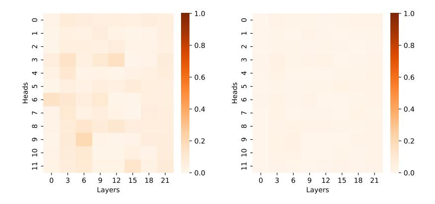

# A. Algorithm Details

We first derive a high-level view of the forward and backward passes of the entmax attention and then present the full algorithms for both mentioned versions. For consistency and ease of comparison, we follow the notation adopted by FlashAttention-1 (Dao et al., 2022).

### A.1. $\alpha$ -entmax Attention Forward Pass

We recall that given the input sequences  $Q, K, V \in \mathbb{R}^{n \times d}$ , we want to compute the attention output  $O \in \mathbb{R}^{n \times d}$  as follows:

$$S = QK^{\top} \in \mathbb{R}^{n \times n}, \ P = \alpha \text{-entmax}(S) \in \mathbb{R}^{n \times n}, \ O = PV \in \mathbb{R}^{n \times d}$$

Therefore all we need is the  $\tau \in \mathbb{R}^n$  that solves Equation 2, for which we can use Algorithm 1. We note that we do not need to materialize S as we only need to accumulate the derivatives of  $f(\tau)$ , defined in Equation 3. Once  $\tau$  is computed, we can compute each row of O as follows:

<span id="page-12-1"></span>
$$O_i = P_i V = \sum_j P_{ij} V_j = \sum_{j=1}^n \max \left( 0, (\alpha - 1) Q_i^{\top} K_j - \tau_i \right)^{1/\alpha - 1} V_j$$
(15)

As in FlashAttention, we can compute  $O_i$  without extra memory by incrementally summing the contributions of each  $\alpha$ -entmax $(Q_i^{\top}K_j)V_j$  term. We can then compute the forward pass with  $\mathcal{O}(n)$  extra memory as follows:

- 1. Compute  $\tau_i$  for all  $1 \le i \le n$  according to Algorithm 1, which takes  $\mathcal{O}(n)$  extra memory.
- 2. Compute  $O_i$  for all  $1 \le i \le n$  according to Equation 15 which takes O(n) extra memory.

### <span id="page-12-0"></span>A.2. $\alpha$ -entmax Attention Backward Pass

For the  $\alpha$ -entmax attention backward pass, we need to compute the gradients with respect to V, K, and Q. Let  $\mathcal{L}$  be a scalar loss function, and  $dO \in \mathbb{R}^{n \times d}$  denote  $\frac{\partial \mathcal{L}}{\partial O}$ . Our goal is to compute the input gradients dV, dK,  $dQ \in \mathbb{R}^{n \times d}$ .

## 1. Gradient of V

Using reverse-mode autodifferentiation, we first compute dV:

$$dV = P^{\top}dO, \tag{16}$$

where  $P = \alpha$ -entmax(S) is the output of the  $\alpha$ -entmax transformation applied row-wise to the score matrix  $S = QK^{\top}$ . Expressed element-wise, we obtain:

<span id="page-12-2"></span>
$$dV_j = \sum_{i=1}^n P_{ij} dO_i, \tag{17}$$

which is analogous to the softmax case. Since  $P_{ij}$  is sparse due to the nature of  $\alpha$ -entmax, we can skip  $Q_i$  blocks that leads to blocks of P full of zeros using the pointer increment tables, as shown in Equation 14.

### 2. Gradient of P and S

The next step involves computing dP and dS. From O = PV, we have:

$$dP_{ij} = dO_i^{\top} V_j. \tag{18}$$

Next, let us recall the Jacobian of the  $\alpha$ -entmax mapping (Peters et al., 2019). Defining  $p = \alpha$ -entmax(s), the Jacobian is:

$$\frac{\partial \alpha - \operatorname{entmax}(\boldsymbol{s})}{\partial \boldsymbol{s}} = \operatorname{Diag}(\boldsymbol{u}) - \frac{\boldsymbol{u} \boldsymbol{u}^{\top}}{\|\boldsymbol{u}\|_{1}}, \tag{19}$$

where u is defined element-wise as:

$$u_k = \begin{cases} (p_k)^{2-\alpha}, & \text{if } p_k > 0\\ 0, & \text{otherwise.} \end{cases}$$
 (20)

Let U denote a stack of  $[u_1, ..., u_n]$  for each row of P. From the relationship  $P = \alpha$ -entmax (S), and the Jacobian of the  $\alpha$ -entmax function, we can propagate the gradients back to S as follows:

$$dS_i = \left[ \text{Diag}(U_i) - \frac{U_i U_i^{\top}}{\|U_i\|_1} \right] dP_i$$
 (21)

$$= U_i \odot dP_i - \left(\frac{U_i^{\top} dP_i}{\|U_i\|_1}\right) U_i. \tag{22}$$

We can further simplify by defining a new quantity  $\delta \in \mathbb{R}^n$ :

$$\delta_i = \frac{\boldsymbol{U}_i^{\top} d\boldsymbol{P}_i}{\|\boldsymbol{U}_i\|_1} \tag{23}$$

<span id="page-13-0"></span>
$$= \frac{1}{\|\boldsymbol{U}_i\|_1} \sum_{j=1}^{n} U_{ij} \left( \boldsymbol{dO}_i^{\top} \boldsymbol{v}_j \right)$$
 (24)

<span id="page-13-1"></span>
$$= dO_i^{\top} \underbrace{\frac{\left(\sum_{j=1}^n U_{ij} V_j\right)}{\|U_i\|_1}}_{Q^{(2)}}$$
(25)

In standard softmax attention, instead of the right-side term in the above product, we would simply obtain  $O_i$ . Since this new quantity is required for the backward pass, and to avoid passing once more through Q, K and V, we compute and store this quantity during the forward pass solely during training. Unlike in softmax attention, however, the backward pass for  $\alpha$ -entmax does not require saving the output matrix O; instead, we only require this new quantity, which we label  $O^{(2)}$ . Then, we can simplify the computation of dS to:

$$dS_i = U_i \odot (dP_i - \delta_i) \tag{26}$$

Again, we can use the sparsity stored in M (see Equation 9) from the forward pass to efficiently skip the computation of null blocks of P.

## 3. Gradients of Q and K

Using the definition of  $S_{ij} = \mathbf{Q}_i^{\top} \mathbf{K}_j$ , the gradients for Q and K are:

$$dQ_i = \sum_{i=1}^n dS_{ij} K_j, \tag{27}$$

<span id="page-13-3"></span><span id="page-13-2"></span>
$$dK_j = \sum_{i=1}^n dS_{ij} Q_i.$$
 (28)

Substituting  $dS_{ij}$ , we get:

$$dQ_i = \sum_{j=1}^n U_{ij} \left( dP_{ij} - \delta_i \right) K_j$$
(29)

$$d\mathbf{K}_{j} = \sum_{i=1}^{n} U_{ij} \left( dP_{ij} - \delta_{i} \right) \mathbf{Q}_{i}$$
(30)

Effectively, we can only iterate through the blocks that will result in  $P_{ij} \neq 0$ . As in FlashAttention, the backward pass can also be computed with  $\mathcal{O}(n)$  extra memory:

- 1. Compute  $dV_j$  for all j according to Equation 17, which takes  $\mathcal{O}(d)$  extra memory.
- 2. Compute  $\delta_i$  for all i according to Equation 23, which takes  $\mathcal{O}(n)$  extra memory.
- 3. Compute  $O_{i}^{(2)}$  for all i, as defined in Equation 25, which takes  $\mathcal{O}\left(d\right)$  extra memory.
- 4. Compute  $dQ_i$  for all i according to Equation 29, which takes  $\mathcal{O}(d)$  extra memory.
- 5. Compute  $d\mathbf{K}_{j}$  for all j according to Equation 30, which takes  $\mathcal{O}(d)$  extra memory.

We note that the only extra memory requirement compared to FlashAttention is in having to additionally compute and storing  $O^{(2)} \in \mathbb{R}^{n \times d}$ . When using block masking, we also need  $O(T_r \times T_c)$  extra memory to store the binary mask M. However, we recall that this memory can be shared across attention layers, as it is merely a temporary matrix used to compute the pointer-increment tables.

### A.3. ADASPLASH: Forward Pass (without block masking)

The full ADASPLASH's forward pass is presented in Algorithm 2. For completeness, we also provide in Algorithm 3 the steps for approximating  $\tau$  without the need to materialize S in a block-wise manner.

## **Algorithm 3** Halley-bisection for computing $\tau$ – Block Version

```
Require: Matrices Q, K \in \mathbb{R}^{n \times d} in HBM, block sizes B_c, B_r and number of iterations M.
 1: Divide Q into T_r = \lceil n/B_r \rceil blocks Q_1, \dots, Q_{T_r} of size B_r \times d
 2: Divide K into T_c = \lceil n/B_c \rceil blocks K_1, \ldots, K_{T_c} of size B_c \times d
 3: Divide \tau into T_r blocks \tau_1, \ldots, \tau_{T_r} of size B_r
 4: for i = 1 to T_r do
        Load Q_i from HBM to on-chip SRAM
 5:
        On chip, initialize \tau_i, \tau_{lo_i}, \tau_{hi_i} according to Algorithm 1.
                                                                                                  \triangleright Note: this requires one pass over K_j for all j.
 6:
 7:
            On chip, initialize f, f', f'' = \mathbf{0} \in \mathbb{R}^{B_r}
 8:
            for j = 1 to T_c do
 9:
               Load \bm{K}_j, \bm{V}_j from HBM to on-chip SRAM Compute \bm{S}_i^{(j)} = \bm{Q}_i \bm{K}_j^{\top} \in \mathbb{R}^{B_r \times B_c}
10:
11:
               Accumulate f, f', f'' according to Equations 3, 6 and 7, respectively.
12:
13:
14:
            Update \tau_i, \tau_{lo_i}, \tau_{hi_i} according to Algorithm 1.
        until M iterations are completed
15:
        Write \tau_i to HBM
16:
17: end for
18: Return: \tau
```

### A.4. ADASPLASH: Backward Pass (without block masking)

As mentioned in §3.2.2, in contrast to FlashAttention, we propose to separate the kernels that compute the gradients dQ, dK, dV. However, as in FlashAttention, we need to compute  $\delta$  before being able to compute the gradients, which we do in a separate kernel following Equation 25. We present the full steps for computing dK and dV in Algorithm 4, and for computing dQ in Algorithm 5.

### A.5. ADASPLASH: Block Masked Version

In this version, as outlined in Section 3, a boolean block mask  $M \in \mathbb{R}^{T_r \times T_c}$  is created dynamically in the forward pass, allowing the exploitation of the sparsity in the matrix P at the cost of linear memory complexity. The mask is populated

## $\overline{\text{Algorithm 4}}$ ADASPLASH Backward Pass for dK and dV

```
Require: Matrices Q, K, V, O, dO \in \mathbb{R}^{n \times d} in HBM, vector \tau \in \mathbb{R}^n in HBM, block sizes B_c, B_r, parameter \alpha
  1: Divide Q into T_r = \lceil n/B_r \rceil blocks Q_1, \ldots, Q_{T_r} of size B_r \times d each, and divide K, V into T_c = \lceil n/B_c \rceil blocks
      K_1, \ldots, K_{T_c}, V_1, \ldots, V_{T_c} of size B_c \times d each.
 2: Divide dO into T_r blocks dO_1, \ldots, dO_{T_r} of size B_r \times d each.
 3: Divide \tau into T_r blocks \tau_1, \ldots, \tau_{T_r} of size B_r each.
 4: Initialize and divide dK, dV \in \mathbb{R}^{n \times d} into T_c blocks dK_1, \dots, dK_{T_c} and dV_1, \dots, dV_{T_c} of size B_c \times d each.
 5: Divide \delta into T_r blocks \delta_1, \ldots, \delta_{T_r} of size B_r each.
 6: for 1 \le j \le T_c do
          Load K_i, V_i from HBM to on-chip SRAM.
 7:
          Initialize dK_j = \mathbf{0}_{B_c \times d} on SRAM.
 8:
 9:
          Initialize dV_j = \mathbf{0}_{B_c \times d} on SRAM.
          for 1 \leq i \leq T_r do
10:
              Load Q_i, dO_i, \tau_i, \delta_i from HBM to on-chip SRAM.
11:
              On chip, compute S_i^{(j)} = Q_i K_i^{\top} \in \mathbb{R}^{B_r \times B_c}.
12:
              On chip, compute P_i^{(j)} = \max(0, (\alpha - 1)S_i^{(j)} - \tau_i)^{1/\alpha - 1} \in \mathbb{R}^{B_r \times B_c}.
13:
             On chip, compute dV_j \leftarrow dV_j + (P_i^{(j)})^\top dO_i \in \mathbb{R}^{B_c \times d}. On chip, compute dP_i = dO_iV_j^\top \in \mathbb{R}^{B_r \times B_c}.
14:
15:
             On chip, compute \bm{U}_i^{(j)} = \bm{P}_i^{(j)^{2-\alpha}} \in \mathbb{R}^{B_r \times B_c}. On chip, compute \bm{dS}_i^{(j)} = \bm{U}_i^{(j)} \odot (\bm{dP}_i^{(j)} - \bm{\delta}_i) \in \mathbb{R}^{B_r \times B_c}.
16:
17:
             On chip, compute d\boldsymbol{K}_j \leftarrow d\boldsymbol{K}_j + (d\boldsymbol{S}_i^{(j)})^\top \boldsymbol{Q}_i \in \mathbb{R}^{B_c \times d}.
18:
19:
          Write dK_j, dV_j to HBM.
20:
21: end for
22: Return: Gradients dK, dV.
```

during the final iteration of the Halley-bisection algorithm (Algorithm 3) by evaluating the condition  $\operatorname{any}(S_i^{(j)} > \tau_i)$  and storing the result as a boolean value. Thus, the mask M indicates whether a specific Q,K block pair contributes to the output. This process enables the creation of a lookup table that associates each query block with the set of key blocks that contribute non-zero values, thereby allowing to skip unnecessary computations for future computations. Similarly, a reverse lookup table can be created for each key block. Both tables can be used in the backward pass (Line 10 in Algorithm 4 and Line 9 in Algorithm 5) to avoid looping over unnecessary query/key blocks.

In practice, to create the lookup tables, we use the torch argwhere function to extract the (i,j) indices of entries where  $M_{ij}=1$ . Combined with row-wise summation of non-zero entries, this approach efficiently skips computations for irrelevant blocks within the remaining kernels. Consequently, during the forward pass, only the K,V pairs identified in the lookup table are loaded, avoiding redundant memory and computational overhead. As mentioned, for the backward pass, given that we separated the computation of dQ and dK, dV, we can further use both tables (Q and K) to speedup the gradient computation.

### <span id="page-15-0"></span>**B.** Experimental Setup

### <span id="page-15-1"></span>**B.1. Continuous Pre-training**

We conducted continuous pretraining of RoBERTa-base<sup>3</sup> and ModernBERT-base<sup>4</sup> models with our custom sparse attention Triton kernel, ADASPLASH. The pretraining process was carried on 2B tokens of the FineWeb-Edu dataset,<sup>5</sup> due to its high-quality, diverse and large-scale content. We used the HuggingFace Transformers library for model training and implementation and the Datasets library for data handling. Concretely, we used a batch size of 32 and a learning rate of  $5 \times 10^{-5}$ , optimized with the AdamW optimizer. Training was conducted for 100,000 steps using mixed-precision (fp16).

<span id="page-15-3"></span><sup>&</sup>lt;sup>3</sup>https://huggingface.co/FacebookAI/roberta-base

<span id="page-15-4"></span><sup>4</sup>https://huggingface.co/answerdotai/ModernBERT-base

<span id="page-15-5"></span><sup>&</sup>lt;sup>5</sup>https://huggingface.co/datasets/HuggingFaceFW/fineweb-edu

### **Algorithm 5** ADASPLASH Backward Pass for dQ

```
Require: Matrices Q, K, V, O, dO \in \mathbb{R}^{n \times d} in HBM, vector \tau \in \mathbb{R}^n in HBM, block sizes B_c, B_r, parameter \alpha.
 1: Divide Q into T_r = \lceil n/B_r \rceil blocks Q_1, \dots, Q_{T_r} of size B_r \times d each, and divide K, V into T_c = \lceil n/B_c \rceil blocks
       K_1, \ldots, K_{T_c}, V_1, \ldots, V_{T_c} of size B_c \times d each.
 2: Divide dO into T_r blocks dO_1, \ldots, dO_{T_r} of size B_r \times d each.
 3: Divide \tau into T_r blocks \tau_1, \ldots, \tau_{T_r} of size B_r each.
 4: Initialize dQ in HBM and divide it into T_r blocks dQ_1, \dots, dQ_{T_r} of size B_r \times d each.
 5: Divide \delta into T_r blocks \delta_1, \ldots, \delta_{T_r} of size B_r each.
 6: for i = 1 to T_r do
           Load Q_i, dO_i, \delta_i, \tau_i, from HBM to on-chip SRAM
 7:
 8:
           Initialize dQ_i = \mathbf{0}_{B_c \times d} on SRAM.
 9:
           for j = 1 to T_c do
               On chip, compute S_i^{(j)} = Q_i K_i^{\top} \in \mathbb{R}^{B_r \times B_c}.
10:
              On chip, compute B_i^{(j)} = \max(0, (\alpha - 1)S_i^{(j)} - \tau_i)^{1/\alpha - 1} \in \mathbb{R}^{B_r \times B_c}. On chip, compute dP_i = dO_iV_j^{(j)} \in \mathbb{R}^{B_r \times B_c}. On chip, compute U_i^{(j)} = P_i^{(j)^{2-\alpha}} \in \mathbb{R}^{B_r \times B_c}. On chip, compute dS_i^{(j)} = U_i^{(j)} \odot (dP_i^{(j)} - \delta_i) \in \mathbb{R}^{B_r \times B_c}. On chip, compute dQ_i \leftarrow dQ_i + dS_i^{(j)}K_j \in \mathbb{R}^{B_r \times d}.
11:
12:
13:
14:
15:
16:
           Write dQ_i to HBM
17:
18: end for
19: Return: Gradient dQ
```

<span id="page-16-2"></span>Table 5. Runtime (s) of ModernBERT-base ( $\alpha = 1.5$ ) for varying context lengths.

|                                                                                |                              | Sequence Length              |                              |                              |                             |  |  |  |  |
|--------------------------------------------------------------------------------|------------------------------|------------------------------|------------------------------|------------------------------|-----------------------------|--|--|--|--|
| Algorithm                                                                      | 512                          | 1024                         | 2048                         | 4096                         | 8192                        |  |  |  |  |
| Sorting (Torch) Bisection (Torch) Halley-bisection (Triton) ADASPLASH (Triton) | 0.09<br>0.11<br>0.10<br>0.10 | 0.11<br>0.15<br>0.11<br>0.12 | 0.26<br>0.42<br>0.26<br>0.21 | 0.76<br>1.35<br>0.46<br>0.48 | OOM<br>4.99<br>1.61<br>1.53 |  |  |  |  |

The sparsity parameter ( $\alpha$ ) was initialized at 1.01 and annealed linearly to a final value of 1.5 or 2.0 over 50,000 steps. We kept ModernBERT's window attention layers untouched, only replacing the full softmax layers by  $\alpha$ -entmax. Finally, we also performed continuous pretraining of RoBERTa and ModernBERT with standard softmax attention with a fixed  $\alpha = 1.0$ .

As shown in Figure 5, the attention mechanisms of our sparse ModernBERT model ( $\alpha=1.5$ ) obtain high sparsity levels in practice, with an overall sparsity of 95% for  $\alpha=1.5$  and 99% for  $\alpha=2.0$ . For this reason, we used the version of ADASPLASH that leverages the pointer increment tables for training ModernBERT, which has a maximum sequence length of 8,192. For RoBERTa, which has a sequence length of 512, we opted to use the Halley-bisection algorithm implemented in Triton. In Table 5 we report efficiency results in terms of runtime and memory usage for different attention algorithms with ModernBERT-base. Overall, we observe that the sorting approach is slower than bisection, which is slower than our Halley-bisection and ADASPLASH, in that order.

### <span id="page-16-0"></span>**B.2. GLUE and BIER tasks**

For GLUE tasks, we used the checkpoints of continuous pre-trained models for both RoBERTa-base and ModernBERT-base. Then, we fine-tuned them on each GLUE task with the default hyperparameters from the Transformer library. Importantly, we capped the maximum sequence length at 128 tokens to reduce computational cost while preserving task-relevant context and used fp16 for training.

<span id="page-16-3"></span> $<sup>^6</sup>$ https://github.com/huggingface/transformers/tree/main/examples/pytorch/text-classification



Figure 5. Ratio of non-zeros for non-local layers of ModernBERT-base with  $\alpha = 1.5$  (left) and  $\alpha = 2.0$  (right).

|                               |        |      | Single Sentence |       | Paraphrase and Similarity |       |      | Natural Language Inference |      |      |      |
|-------------------------------|--------|------|-----------------|-------|---------------------------|-------|------|----------------------------|------|------|------|
| Model                         | Params | Seq. | CoLA            | SST-2 | MRPC                      | STS-B | QQP  | MNLI                       | QNLI | RTE  | Avg. |
| BERT                          | 110M   | 512  | 58.6            | 91.9  | 86.9                      | 89.0  | 89.3 | 84.0                       | 91.0 | 69.3 | 82.5 |
| RoBERTa                       | 125M   | 512  | 59.8            | 93.7  | 89.5                      | 89.6  | 89.8 | 87.7                       | 92.3 | 69.3 | 83.9 |
| RoBERTa ( $\alpha = 1.5$ )    | 125M   | 512  | 58.5            | 93.2  | 91.5                      | 90.2  | 89.7 | 87.3                       | 92.5 | 68.6 | 83.9 |
| RoBERTa ( $\alpha = 2.0$ )    | 125M   | 512  | 56.8            | 93.0  | 90.9                      | 88.8  | 89.0 | 86.7                       | 91.9 | 67.2 | 83.0 |
| ModernBERT                    | 149M   | 8192 | 63.2            | 95.0  | 88.2                      | 90.3  | 90.4 | 87.9                       | 93.0 | 61.7 | 83.7 |
| ModernBERT ( $\alpha = 1.5$ ) | 149M   | 8192 | 62.2            | 96.1  | 87.7                      | 89.4  | 90.2 | 87.9                       | 92.6 | 61.7 | 83.5 |
| ModernBERT ( $\alpha = 2.0$ ) | 149M   | 8192 | 62.2            | 94.8  | 89.0                      | 89.9  | 90.5 | 87.8                       | 93.1 | 62.5 | 83.7 |

<span id="page-17-1"></span>Table 6. Results on different tasks from the GLUE benchmark (Wang et al., 2018).

To evaluate the generalization of ADASPLASH in retrieval tasks, we fine-tuned ModernBERT-base and RoBERTa-base models on the MS MARCO dataset (Bajaj et al., 2016) and evaluated them on the BEIR benchmark (Thakur et al., 2021). This benchmark suite assesses performance across diverse information retrieval tasks, including SciFact, NFCorpus, FiQA-2018, and TREC-COVID. The fine-tuning and evaluation process closely follows the approach proposed in the ModernBERT paper (Warner et al., 2024). Fine-tuning was performed using the SentenceTransformers library. The models were evaluated on BEIR tasks using the MTEB benchmark toolkit. The evaluation metric for each task was nDCG@10 (Normalized Discounted Cumulative Gain), following standard information retrieval practices.

### **B.3. Long Document Classification**

The European Court of Human Rights (ECtHR) dataset comprises legal cases from the European Court of Human Rights, each associated with specific articles of the Convention on Human Rights allegedly violated. For this task, we fine-tuned the RoBERTa base model (Liu et al., 2019) with a classification head. Since this is a multi-label classification task, we used a binary cross-entropy loss. To accommodate longer contexts, we followed the approach proposed by (Beltagy et al., 2020), repeating the 512 position embeddings until the target context size was reached. We used the AdamW optimizer for training. For hyperparameters, we follow the recipe of Dai et al. (2022). For the attention mechanism, bfloat16 precision was used.

### <span id="page-17-0"></span>**B.4.** Language Modeling

We trained both the standard GPT-2 model and sparse GPT-2 ( $\alpha=1.5$ ) using the configuration provided in the 11m.c repository, following their training recipe. Specifically, we trained a GPT-2 (124M parameters) from scratch on 10B tokens of the FineWeb dataset, with a maximum sequence length of 1024 tokens. Training was conducted using bfloat16 precision. We use an effective batch size of 512, and use gradient accumulation to fit into available GPU memory. We

<span id="page-17-2"></span><sup>&</sup>lt;sup>7</sup>https://sbert.net/

<span id="page-17-3"></span><sup>8</sup>https://github.com/embeddings-benchmark/mteb

<span id="page-17-4"></span><sup>9</sup>https://github.com/karpathy/llm.c

use the AdamW optimizer, with learning rate  $6\times 10^{-4}$  and weight decay of 0.1. The learning rate followed a warm-up phase, linearly ramping from zero to a maximum of  $6\times 10^{-4}$  over the first 700 iterations, equivalent to 350 million tokens. Subsequently, the learning rate decayed to zero across the remaining training steps. We show the validation loss curves for both softmax and  $\alpha$ -entmax ( $\alpha=1.5$ ) in Figure 6.

Given that, for this task, the context size was not high enough, for sparse attention we opted to use the algorithm that does not take advantage of the pointer increment tables. For the benchmarking of the time spent per step, we averaged across 50 steps after the model had trained for at least 100 steps.


<span id="page-18-0"></span>Figure 6. FineWeb withheld validation loss comparison between GPT-2 and Sparse GPT-2 during training.

