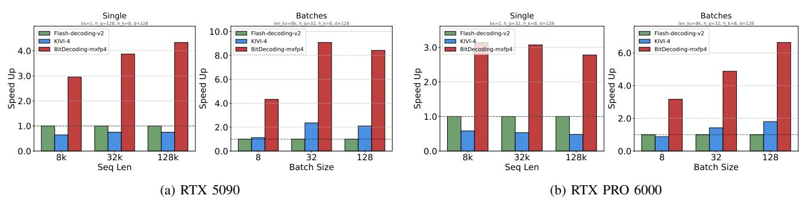
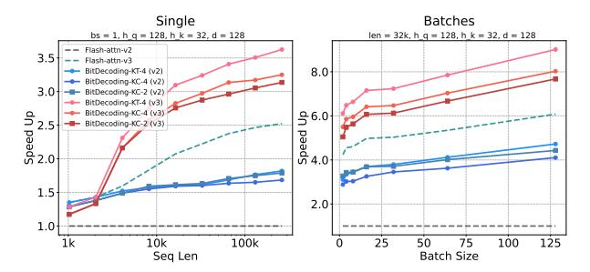
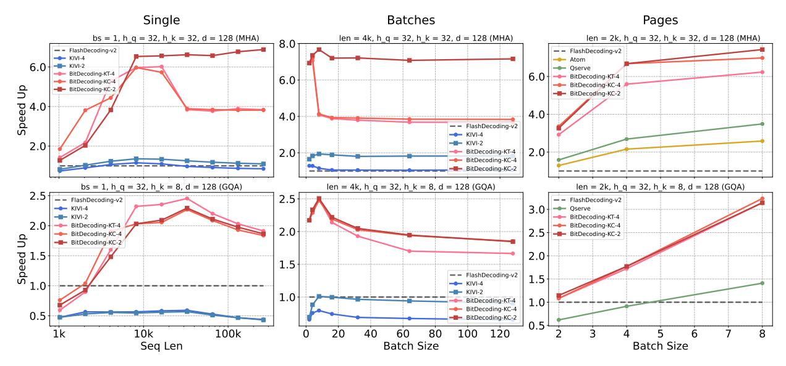
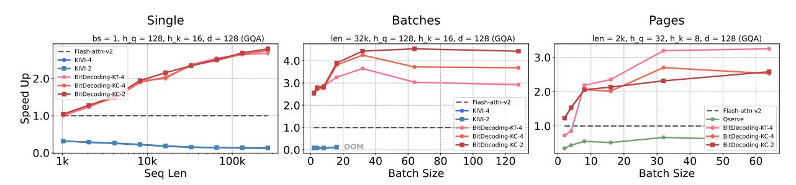
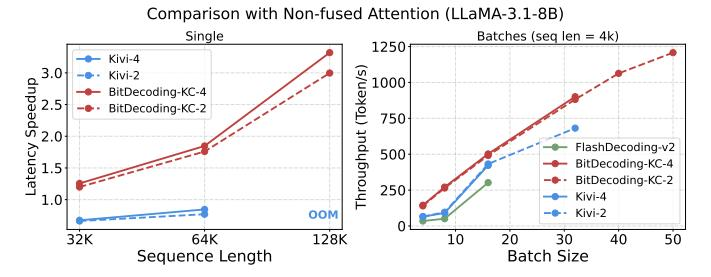
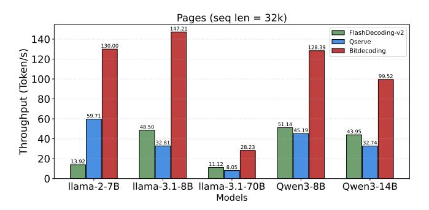
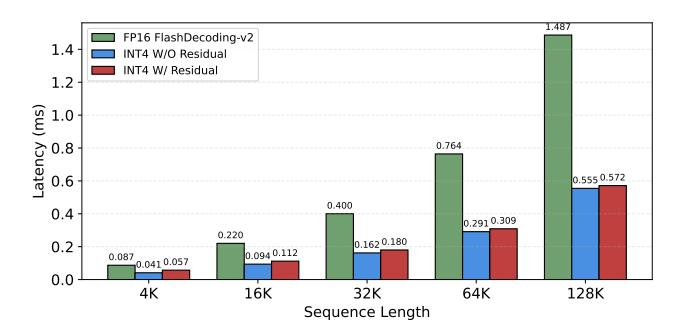
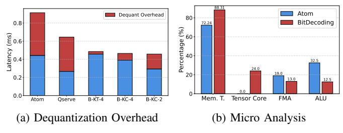
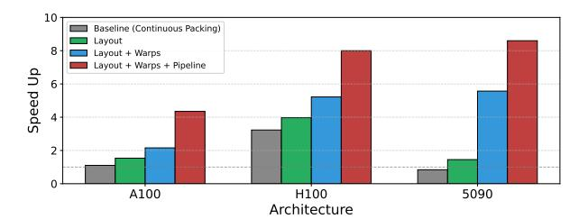

# *B. Residual Kernel*

A primary challenge in low-bit KV-cache design is supporting diverse quantization algorithms—especially differing scaling granularities (e.g., tensor-wise, channel-wise)—without sacrificing performance. Quantization involves reductions and element-wise operations to compute scale and zero-point, followed by bit-packing; during decoding these must run online, adding runtime overhead and risking misalignment with the rigid layouts expected by Tensor Cores. To address this, we design the *Residual Kernel* with two key optimizations:

(1) Partitioning KV cache based on residual block size. During prefill with context length L, we split the KV cache based on a Tensor Cores-aligned residual block size Nr (see Eq. 1). The first Np = L − (L mod Nr) entries are quantized and packed into the low-bit KV cache using a fused quantization and packing operation. The remaining KV Tensor with size res\_len = L mod Nr are stored in the half-precision residual KV cache. At each decode step, the newly generated K, V tensors are appended to the residual cache and used for attention computation. This cache grows incrementally until it reaches the residual block size Nr. Once per token generation, the Residual Kernel computes attention using the half-precision residual KV cache and optionally quantizes it (when res\_len = Nr) into packed format.

With this KV cache partitioning during decoding, we can naturally perform channel-wise quantization along the seq len and tensor-wise quantization along the hidden dimension within the residual block.

(2) Optimizing reduction with warp-level instructions. As shown in Fig. 7 (mid), once the half-precision KV data is computed, it remains in registers as Tensor Cores fragments—structured in the native interleaved layout used by mma operations. To efficiently compute the quantization parameters (scale and zero-point), we first perform thread-level reductions to obtain local min/max statistics within each group.

These local results are then aggregated across the warp using the PTX instruction \_\_shfl\_xor\_sync, enabling efficient warp-level reduction without shared memory. When the warp repetition factor Wn > 1, we introduce a small shared memory buffer to coordinate the final reduction across warps.

After computing the quantization parameters, each thread performs in-register quantization and packs the low-bit values into INT16 format. This avoids extra memory movement and keeps data in a computation-ready state. To minimize overhead, both the scale and zero-point are stored in a compact half2 format, enabling efficient memory access and fused multiply-add during dequantization in the decode phase.

## C. Packing Kernel

Another challenge is the auxiliary low-bit metadata (scale and zero-point), which increases memory traffic, while dequantization still runs on CUDA cores. Without careful scheduling, this disrupts the load—compute pipeline and prevents overlap with Tensor Core operations. We therefore design a fine-grained asynchronous pipeline: CUDA cores handle dequantization, Tensor Cores execute matrix multiplications, and both are orchestrated to overlap with memory transfers through the GPU hierarchy—enabling efficient mixed-precision computation.

(1) Optimizing asynchronous data movement. From Global to Shared Memory, we follow FlashAttention [6] via block-wise tiling [32] and strategic recomputation. It processes input matrices  $Q \in \mathbb{R}^{T_m \times d}$ ,  $K, V \in \mathbb{R}^{T_n \times d}$  in tiles within shared memory, using block sizes  $T_m$  and  $T_n$ . The number of key-value tiles is  $C_n = \lceil L/T_n \rceil$ .

To efficiently manage quantization parameters, we introduce dedicated shared memory buffers for quantization parameter  $K_{pack}$  params  $(K_p)$  and  $V_{pack}$  param  $(V_p)$ , facilitating efficient tiling for memory copy. These buffers store scale and zeros in the half2 format, allowing them to be loaded in a single instruction.

The shape of  $K_p$  is determined by the quantization granularity setting, and the  $V_p$  follows a Tensor-wise layout:

- Channel-wise:  $(T_n/\text{group\_size}, d)$ .
- **Tensor-wise:**  $(T_n, d/\text{group\_size})$ .

To achieve optimal memory overlapping, all global-toshared memory transfers are executed asynchronously using the cp.async intrinsic, ensuring efficient pipeline execution, as shown in Fig. 7 (right). We optimize memory transactions using instructions with different caching strategies:

- cp.async.cg: Used for Q,  $K_{\text{pack}}$ , and  $V_{\text{pack}}$ , which cache only in global memory as they are not reused within the same kernel
- cp.async.ca: Applied to  $K_p$  and  $V_p$ , ensuring smaller byte-level alignment for fine-grained memory access.

In Hopper architecture, we follow FA3, leveraging the tma.copy instruction for data loading. This facilitates warp-specialized scheduling, improving data locality and reducing memory latency across multiple warps.

From Shared Memory to Register, we use the PTX instruction ldmatrix to efficiently load  $K_{\rm pack}$ ,  $V_{\rm pack}$  and sAcc from shared memory into registers with the Tensor Cores tiling layout. To eliminate bank conflicts, we use a sizzling scheme [5] defined as:

$$\operatorname{col}_{id} = \operatorname{row}_{id} \oplus \operatorname{col}_{id}$$
 (2)

achieve bank conflict-free access. Additionally, we restructure the shared memory layout of  $K_p$  and  $V_p$  to further reduce bank conflict and maximize throughput efficiency.

(2) Asynchronous pipeline for overlapping CUDA Cores and Tensor Cores. To fully utilize both CUDA cores and Tensor Cores, we implement a register-level, asynchronous pipeline that overlaps computation with memory operations. In this pipeline, shared-memory loads via ldmatrix and dequantization (Dequant) run concurrently with Tensor Core matrix multiplications (mma) under the SM warp scheduler.

As shown in Fig. 7 (right), while the i-th slice is being processed by mma on Tensor Cores, the (i+1)-th slice is simultaneously loaded from shared memory (ldmatrix) and dequantized. This sustains a continuous producer—consumer flow, improving instruction throughput and maximizing utilization of both CUDA cores and Tensor Cores.

## D. Latest Architectures Support

While the design presented thus far effectively targets pre-Hopper architectures (e.g., Ampere), newer generations introduce distinct hardware features that require tailored optimization strategies. Below, we detail how our approach adapts to leverage the specialized instructions and native data formats of the Hopper and Blackwell architectures.

- (1) Unlocking Hopper for warpgroup acceleration capabilities via smart uses of PTX-level instructions. Hopper Tensor Cores, increasingly introduce Warpgroup Matrix Multiply-Accumulate (wgmma) instruction. This instruction however imposes a key constraint: in a matrix multiplication C = AB, only A and C can be sourced from registers, while B must reside in shared memory. This presents a challenge for low-bit quantized data, as values are typically upconverted to FP16 in registers before computation. To resolve this, we leverage Hopper's STSM PTX instruction to store dequantized FP16 values in shared memory efficiently, accessible for wgmma\_SS operations. Remarkably, the asynchronous nature of WGMMA overlaps storage with computation, optimizing performance.
- (2) Accelerating Blackwell with native low-precision format. The Blackwell architecture introduces native support for low-precision tensor operations, eliminating the need for explicit dequantization. Consequently, the lop3-based register remapping described earlier is bypassed in favor of direct execution. We target Blackwell's low-precision mma instructions—specifically those supporting the micro-scaling formats (e.g., mxfp4 / nvfp4)—to execute GEMM operations directly on packed 4-bit data. While these instructions enforce rigid layout constraints for both the packed values and their block-scaling factors, the layout transformation strategy proposed in Section IV-A is designed to be layout-agnostic. It automatically aligns the packed KV data with the hardware-mandated format, ensuring seamless integration with Blackwell's native tensor pipelines.

#### VI. EVALUATION

In this section, we comprehensively evaluate BitDecoding against state-of-the-art approaches and systems. Our evaluation

Fig. 8: Kernel performance with mxfp4 on Blackwell architectures.

highlights the following key results:

- 1) BitDecoding outperforms FP16 FlashDecoding-v2 by significant margins across GPU generations, achieving speedups of up to 8.6× on Blackwell (using native MXFP4), 8.0× on Hopper, and 7.5× on Ada architectures, while surpassing the state-of-the-art low-bit system QServe by up to 4.3× (Section VI-A).
- 2) In end-to-end long-context inference, BitDecoding reduces single-batch latency by 3x (on LLaMA-3.1-8B with 128K context) and achieves over 4x higher serving throughput than QServe, demonstrating superior scalability in GQA settings where prior CUDA Core-only methods degrade (Section VI-B).
- 3) BitDecoding preserves near-FP16 accuracy while deriving significant performance gains from each system component, demonstrating only a 0.2% accuracy degradation with 4-bit quantization, while our ablation study confirms that every design module contributes to the overall speedup (Section VI-C).

#### A. Kernels Performance Across GPU Architectures

**Kernels Settings.** Since different LLM serving scenarios require varying workloads and attention kernel designs, we evaluate performance under the following three representative settings:

- **Single:** A scenario where batch\_size = 1, representing inference for edge users with long context.
- **Batches:** A setting with a larger batch\_size, maintaining the same input length while applying simple padding.
- Page: A high-throughput scenario where a larger batch\_size is managed using the page management technique [15].

**Baselines.** We compare BitDecoding against several representative attention kernel implementations. For FP16 KV cache, we use FlashDecoding [6], [25]—a split-partitioned variant of FlashAttention optimized for long-context decoding—as our baseline for speedup normalization. For low-bit KV cache, we evaluate Kivi [18], a non-fused kernel supporting 4-bit and 2-bit quantization; Atom [37] and QServe [16], both fused-kernel implementations with CUDA Cores-only approach and supporting 4-bit cache with page management. Notably, Atom does not support GOA.

Fig. 9: Kernel performance on Hopper (H100).

**Quantization Settings.** We evaluate BitDecoding under various quantization configurations, supporting 4-bit and 2-bit Key tensors with both Channel-wise (KC) and Tensor-wise (KT) schemes.

**Results on MXFP4 / NVFP4 (RTX5090, RTX PRO 6000).** The Blackwell architecture provides native support for low-precision data formats, eliminating on-the-fly dequantization overhead while delivering very high compute throughput on low-bit operations. As shown in Fig. 8a, BitDecoding achieves remarkable performance, reaching up to  $8.6\times$  speedup in batched scenarios and over  $4.3\times$  in single-batch long-context decoding (128k), significantly outpacing the nonfused attention baseline. Similarly, Fig. 8b demonstrates that the RTX PRO 6000 attains substantial gains, peaking at  $6.5\times$  speedup with large batch sizes.

Results on Advanced Tensor Cores Acceleration (H100). Newer GPU architectures often introduce advanced compute instructions that significantly accelerate kernel execution. As illustrated in Fig. 9, FlashDecoding-v3, optimized for Hopper Tensor Cores, delivers notable performance gains over its v2 counterpart. While BitDecoding-v2 reaches up to 4.1× speedup, the v3 implementation further boosts performance to 8.0×. This is enabled by BitDecoding's use of Hopper's wgmma and asynchronous memory instructions, ensuring high Tensor Cores utilization even in mixed-precision settings.

Results on Bandwidth-constrained GPU (RTX 4090). Leveraging low-precision data is critical for accelerating inference on bandwidth-constrained GPUs. As shown in Fig. 10, BitDecoding achieves roughly  $4\times$  (4-bit) and over  $7\times$  (2-bit) speedups over FlashDecoding-v2 in Single and Batches

Fig. 10: Kernel performance on RTX4090.

Fig. 11: Kernel performance on A100.

settings, gains that stem directly from alleviating DRAM bottlenecks via low-bit KV caching.

BitDecoding significantly outperforms baselines across all scenarios; unlike the non-fused KIVI, which relies on separate kernels and suffers severe degradation in GQA, BitDecoding's fully fused design maintains high efficiency. In Page settings, it surpasses fused CUDA-core baselines: for MHA, BitDecoding achieves over  $6\times$  speedup compared to QServe's  $3.5\times$ . Crucially, in compute-intensive GQA, it maintains a  $3\times$  speedup while QServe drops to  $1.4\times$ , confirming that leveraging Tensor Cores provides robust acceleration where CUDA-only approaches falter.

Results on High-Bandwidth GPU (A100). On architectures with high memory bandwidth like the A100, computation pressure becomes more pronounced, as performance bottlenecks shift from memory access to compute utilization—especially when kernel designs fail to fully exploit available compute resources. As shown in Fig. 11, both KIVI and QServe suffer from poor performance—KIVI due to its non-fused kernel design, and QServe due to underutilization of Tensor Cores—even performing worse than the FP16 baseline. In contrast, BitDecoding consistently outperforms all baselines across workloads, achieving up to  $3\times$  speedup, thanks to

its efficient utilization of Tensor Cores and fused execution pipeline. An interesting observation is that the performance gap between 4-bit and 2-bit variants narrows on A100, as the increased DRAM bandwidth reduces memory bottlenecks and shifts the performance balance toward compute-bound execution.

#### B. Performance across LLMs Inference Systems

**Model settings.** We evaluate on a range of LLMs, including LLaMA-2-7B, LLaMA-3.1-8B, LLaMA-3.1-70B, Qwen3-8B, and Qwen3-14B. Among them, only LLaMA-2-7B adopts MHA, while the others use GQA. All models are run on a single A100 GPU, except LLaMA-3.1-70B, which is evaluated on 8×A100 GPUs.

**Quantization settings.** We choose channel-wise quantization for LLMs KV cache as it brings better accuracy and aligns with the Kivi.

Compared with Non-fused Attention. As illustrated in Fig. 12, in the Single setting, BitDecoding achieves up to 3.3× speedup at a 128K context length, where KV cache loading becomes the dominant bottleneck in LLMs inference. In contrast, Kivi suffers from limited scalability and encounters out-of-memory (OOM) failures at 128K due to the lack of block-tiling kernel support. For the Batches setting, BitDecoding sig-

Fig. 12: Comparing Kivi with (a) end-to-end generation time and (b) decoding throughput.

Fig. 13: Comparing Oserve with decoding throughput.

nificantly outperforms KIVI in throughput: BitDecoding-KC-4 and KC-2 reach up to 900 and 1200 tokens/s, respectively, while KIVI-4 and KIVI-2 peak below 700 tokens/s.

Compared with CUDA Cores-only fused Attention. We compare BitDecoding with Qserve for page-setting inference, as Qserve supports both MHA and GQA attention structures. The maximum throughput is evaluated under the largest batch sizes available within GPU memory. As illustrated in Fig. 13, Qserve achieves higher throughput than FlashDecoding-v2 on LLaMA-2-7B but suffers from degraded performance on all other models due to inefficiencies in handling GQA. In contrast, BitDecoding consistently outperforms QServe across both LLaMA and Qwen architectures, under both single-GPU and multi-GPU settings, achieving more than 2× higher maximum throughput compared to QServe.

## C. Accuracy, Overhead and Performance Breakdown

Accuracy analysis. As shown in Table I, we evaluate throughput and accuracy across different bit widths. The 2-bit quantization reduces memory consumption significantly, enabling larger batch sizes and achieving a  $4.25\times$  higher throughput compared to FP16. Meanwhile, the 4-bit quantization achieves a  $2.98\times$  speedup while maintaining near full-precision accuracy with only a minimal 0.2% degradation. These results highlight the trade-off, with 4-bit quantization offering balance and 2-bit maximizing throughput at a slight accuracy cost.

Half-precision Residual Kernel Overhead. Half-precision residual KV Cache would introduce quite a small portion memory overhead as  $seq\_len >> N_r$ , while  $seq\_len$  would

TABLE I: Efficiency and accuracy tradeoff with low-bit KV cache. We use Llama-3.1-8B-Instruct with  $seq\_len = 32K$ , and evaluate average accuracy on longbench [3].

| KV Cache | Throughput      | Longbench Acc |
|----------|-----------------|---------------|
| FP16     | 49.25           | 48.25         |
| INT4     | 147.21 (+2.98x) | 48.16 (-0.2%) |
| INT2     | 209.48 (+4.25x) | 47.38 (-2.7%) |

TABLE II: Latency (ms) comparison of quantization and packing during inference.

| Inference Phase | Marlin | Ladder | BitDecoding |
|-----------------|--------|--------|-------------|
| Prefill         | 58.02  | 4.79   | 0.0599      |
| Decode          | 0.41   | 0.65   | 0.008       |

TABLE III: Impact of cooperative softmax and warps on performance and validity.

| $W_n$ | Coop. Soft   | Latency (ms) | TCs Utilization (%) | Valid        |
|-------|--------------|--------------|---------------------|--------------|
| 1     | ×            | 3.746        | 10.91               | $\checkmark$ |
| 4     | ×            | 0.610        | 19.71               | ×            |
| 4     | $\checkmark$ | 0.613        | 19.66               | $\checkmark$ |

be more than 32K and  $N_r$  is always less than 256. The half-precision residual KV cache introduces only a slight runtime overhead due to an extra kernel launch, as shown in Fig. 14. Moreover, this overhead becomes increasingly negligible as the sequence length grows, since the residual portion constitutes a smaller fraction of the total KV cache.

Quantization and Packing Overhead. We evaluate the latency of quantization and packing under a sequence length of  $seq\_len=128K$ , comparing BitDecoding with Marlin [9] and Ladder [33]. As shown in Table II, the pre-transformation and packing step in previous mixed-precision computing methods introduce significant overhead, which cannot be ignored. Our kernel incurs minimal overhead after the Prefill phase, primarily due to kernel launch overhead. Moreover, during decoding, we achieves nearly negligible overhead, as it is fully fused into kernel computation.

**Dequantization Overhead.** Fig. 15a illustrates the high computational overhead of dequantization in Atom and QServe, consuming nearly half the kernel execution time. In contrast, BitDecoding significantly reduces this overhead to less than 15% (4-bit) and 35% (2-bit), thanks to better Tensor Cores overlap.

A further microbenchmark comparing Atom and BitDecoding (Fig. 15b) reveals BitDecoding's superior memory throughput from effective Tensor Core usage. Conversely, Atom relies heavily on CUDA cores, increasing pressure on FMA and ALU operations.

Multi-warps Cooperative Softmax Overhead. Table III shows that increasing  $W_n$  improves Tensor Cores utilization and reduces latency, but breaks correctness without cooperative softmax. Enabling cooperative softmax restores correctness with only 0.5% overhead. Although it introduces shared

Fig. 14: Runtime overhead of the residual KV cache.

Fig. 15: Dequantization overhead analysis.

memory access, the overhead is minimal since low-bit data reduces memory bandwidth pressure and shifts the kernel from memory-bound to compute-bound.

**BreakDown Analysis.** To further analyze the performance gains of BitDecoding, we decompose our optimizations in Fig. 16. Following [2], we use a continuous-packing baseline that quantizes and packs the KV cache at every generation step, which introduces substantial overhead and requires manual effort to maintain valid layouts. In contrast, our layout design automatically induces Tensor Core–compatible layouts for arbitrary low-bit formats, fully unlocking the compute potential of Tensor Cores. On top of this, the warp-parallelism strategy contributes significant additional speedups, while the pipeline optimizations further enhance end-to-end performance.

#### VII. RELATED WORKS

- a) KV Cache Quantization Algorithms: KV cache quantization reduces memory usage in LLMs with long contexts while maintaining performance. Recent works explore 4-bit, 2-bit, and even 1-bit KV cache quantization, aiming to push the limits of compression. Methods like KIVI [18], Gear [13], and KVQuant [12] use per-channel quantization to handle key-value outliers, while RotateKV [27] applies rotation to smooth channel-wise distributions. Although effective at higher compression ratios, these methods lack efficient system implementations, leading to suboptimal performance.
- b) Mixed-precision Matrix Multiplication: Low-bit weight and low-bit KV cache in LLMs create a unique requirement for mixed-precision matrix multiplication (mpGEMM), where one input matrix is in lower precision (e.g., INT4/2/1) while the other matrix remains in higher precision (e.g., FP16/8). Optimized kernels like

Fig. 16: Breakdown of BitDecoding optimizations across architectural generations.

Ladder [33] and Marlin [9] improve performance via layout transformations and efficient dequantization. However, these methods require pre-packing and pre-transforming weights, limiting applicability to low-bit KV cache in autoregressive decoding.

c) System Implementation for Low-bit KV Cache: KIVI [31] uses Triton with separate kernels for low-bit KV Cache implementation. Atom [37] integrates quantization within the preceding linear layer, while QServe [16] fuses quantization directly into FlashAttention kernels. However, they both rely on GEMV operations with fused multiply—add (FMA) instructions, missing Tensor Core acceleration.

#### VIII. CONCLUSION

BitDecoding establishes a new system foundation for efficient low-bit KV-cache decoding by demonstrating how CUDA cores and Tensor Cores can be cooperatively orchestrated using principled system designs. Its layout-induction and warp-level coordination techniques generalize across attention variants, quantization schemes, and GPU generations, and naturally extend to emerging architectures such as Blackwell and even beyond. We expect BitDecoding to enable future work on algorithm—system co-design for KV-cache quantization, nearlossless test-time scaling, and more capable GPU execution models for long-context LLMs inference.

