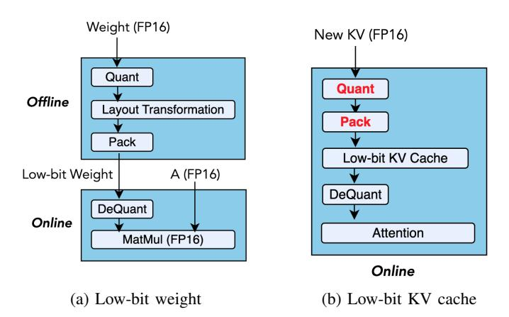
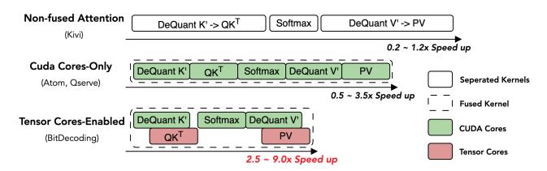

# BitDecoding: Unlocking Tensor Cores for Long-Context LLMs with Low-Bit KV Cache

Dayou Du1† , Shijie Cao2∗ , Jianyi Cheng1 , Luo Mai1 , Ting Cao3 , Mao Yang2 1University of Edinburgh 2Microsoft Research 3 Institute for AI Industry Research (AIR), Tsinghua University

{dayou.du, jianyi.cheng, luo.mai}@ed.ac.uk, {shijiecao, maoyang}@microsoft.com, tingcao@mail.tsinghua.edu.cn

*Abstract*—The growth of long-context Large Language Models (LLMs) significantly increases memory and bandwidth pressure during autoregressive decoding due to the expanding Key–Value (KV) cache. While accuracy-preserving KV-cache quantization (e.g., 4-bit or 2-bit) reduces memory footprint, existing systems decode inefficiently by relying solely on CUDA cores, underutilizing Tensor Cores—the dominant compute resource on GPUs.

We present BitDecoding, the first inference system to efficiently decode low-bit KV caches by cooperatively leveraging CUDA cores and Tensor Cores. BitDecoding smartly induces Tensor-Core-friendly layouts, introduces warp-level dequantization parallelism, and provides unified system support through query transformation, high-performance tensor- and channelwise quantization, and a software-pipelined dequantization kernel enabling mixed-precision execution. Architecture-aware optimizations further leverage Hopper's warpgroup tensor instructions and Blackwell's NVFP4 (MXFP4) tensor formats.

Evaluated on Blackwell, Hopper, and Ampere GPUs, BitDecoding achieves an average 7.5× decoding speedup over FP16 FlashDecoding-v2, up to 8.6× on Blackwell with NVFP4, and up to 4.3× over state-of-the-art approaches. On LLaMA-3.1-8B with a 128K context, BitDecoding reduces single-batch decoding latency by 3×. BitDecoding is open-sourced at https://github.com/ OpenBitSys/BitDecoding.

## I. INTRODUCTION

The ability of Large Language Models (LLMs) to process long contexts [7], [23], [30] has unlocked new capabilities, such as book summarization [4], multi-modal understanding [35], and test-time scaling [11], [22]. However, these advancements come with significant memory and computational challenges, primarily due to the large size of the Key-Value (KV) cache in long-context scenarios. During autoregressive decoding, LLMs must repeatedly access this growing cache for each generated token, which increases memory usage and slows down decoding. The problem worsens with larger batch sizes, as the KV cache scales linearly with the number of concurrent queries. For example, a 7B model requires approximately 14GB GPU memory for its parameters, but with a 32K context length and a batch size of 8, the KV cache alone consumes 128GB GPU memory [12], creating a significant memory bottleneck.

To address this growing bottleneck, KV cache quantization has emerged as a promising solution. By reducing the bit-width of the KV cache, quantization lowers memory overhead and improves overall efficiency. Recent quantization algorithms have shown that low-bit KV cache can retain high accuracy. QServe [16] demonstrates 4-bit KV cache improves throughput on models like LLaMA-3 and Qwen-1.5 while maintaining strong accuracy, even together with 4-bit weight and 8-bit activation. Further research [13], [18], [27] shows that 2-bit KV cache can achieve near fp16 accuracy. Kivi [18], for instance, incurs only a 0.6% accuracy drop on LongBench [3] with a 2-bit KV cache on LLaMA-2- 7B-Chat. Recent studies [29], [36] explore 1-bit quantization for KV cache, maintaining acceptable accuracy under specific conditions. These results confirm that KV cache quantization strikes an effective balance between efficiency and accuracy, making it viable for long-context LLM deployment.

*Despite the memory savings, current system support for low-bit KV cache struggles to deliver the expected speedup.* Previous implementations [16], [18], [37] remain preliminary and case-specific, with significant room for further systematic optimization. A major bottleneck lies in the overhead introduced by quantization and dequantization. Although the KV cache is low-bit, the query (Q) values and attention scores remain in high precision. This results in mixed-precision matrix multiplications (mpGEMM), which existing hardware does not natively support, requiring dequantization before multiplication. Previous mpGEMM kernels like Ladder [33] and Marlin [9] are designed for low-bit weights but cannot be directly applied to low-bit KV caches. This is because weights are *static and stored offline*, while KV caches are *dynamic and generated online*. In autoregressive decoding, each newly generated token requires quantization, packing, and dequantization of the low-bit KV cache, introducing significant overhead and complexity in GPU kernel design, as illustrated in Fig. 1.

To address this, our insight is to leverage Tensor Cores for intensive matrix multiplications while efficiently utilizing CUDA cores for KV cache dequantization. Previous work either implemented with separated kernels or fused attention operations relied solely on CUDA cores, leaving Tensor Cores underutilized, as shown in Fig. 2. Our approach is based on three key observations: First, modern language models employ Grouped-Query Attention (GQA) and Multi-Query Attention (MQA), which share a group of keys across multiple queries,

†Work partially done during an internship at Microsoft Research.

∗Corresponding author.

Fig. 1: Comparison of mixed-precision matrix multiplication for low-bit weight and low-bit KV cache. (a) Quantized weights can be preprocessed offline. (b) KV cache requires online quantization and packing for each newly generated token.

enabling Tensor Cores to accelerate dot products in the selfattention mechanism. Second, leveraging Tensor Cores can alleviate computational pressure on CUDA cores, enabling more efficient execution of low-bit operations. Finally, newer GPU architectures provide distinct mechanisms: Hopper's support for asynchronous execution and warp specialization allows low-bit operations to overlap with computation [19], while Blackwell's native support for low-precision formats (e.g., MXFP4) reduces these overheads by minimizing the need for on-the-fly data conversion.

Efficiently leveraging Tensor Cores for decoding with lowbit KV caches poses significant challenges. First, Tensor Cores require dequantized low-bit data to be aligned with highprecision formats, which is difficult in autoregressive decoding as the KV cache grows dynamically and must conform to Tensor Cores-specific layouts. Without optimized layouts, Tensor Cores may exhibit poor utilization or even produce incorrect results. Second, the high cost of dequantization can stall Tensor Cores execution, reducing GPU occupancy due to mismatched workloads between CUDA cores and Tensor Cores. Third, supporting low-bit KV caches across diverse attention mechanisms and quantization algorithms—with varying tensor-wise and channel-wise scaling—demands a general yet highly optimized implementation. Without careful design, either CUDA cores or Tensor Cores become performance bottlenecks during long-context generation.

To address the above challenges, we have designed and implemented BitDecoding, a high-performance long-context LLMs inference system with low-bit KV cache. The design of BitDecoding delivers several contributions essential for exploiting Tensor Cores, including: (i) inducing low-bit optimized layouts based on hardware instructions, (ii) aligning warps with residual buffer to saturate Tensor Cores, (iii) remapping layouts for faster dequantization, and (iv) coordinating kernels for quantization and dequantization. In addition,

Fig. 2: Comparison of different low-bit KV cache systems against half-precision FlashAttention. Each system follows the attention formulation Out = softmax(Q D(K′⊤)) D(V ′ ), where K′ and V ′ are low-bit quantized Key and Value tensors, and D(·) denotes the dequantization function.

we contribute new strategies for parallelizing GPU warps to mitigate low-bit operations overhead, including (i) efficient warp parallelism layout, and (ii) enhancing attention algorithms for fast warp synchronization leveraging the GPU memory hierarchy.

We further contribute implementation techniques in BitDecoding for LLMs inference, including: (i) a query transformation approach that enables efficient execution of diverse attention variants, allowing BitDecoding to be easily adopted in existing LLMs; (ii) a high-performance quantization kernel that supports both channel-wise and tensor-wise scaling, ensuring generality across quantization algorithms; and (iii) a dequantization kernel with a software-defined pipeline that coordinates CUDA and Tensor Cores for GEMM and dequantization, while overlapping data movement, including extra low-bit metadata; furthermore, BitDecoding incorporates architecture-specific optimizations that unlock Hopper's warpgroup tensor operations and Blackwell's native low-precision tensor formats to maximize decoding performance on the latest GPU generations.

BitDecoding is evaluated at both the kernel and endto-end levels across Blackwell, Hopper, Ada, and Ampere GPU architectures. At the kernel level, it outperforms FP16 FlashDecoding-v2 by up to 8.6× on Blackwell (e.g., RTX 5090, using native MXFP4 format support), 8.0× on Hopper, 7.5× on Ada, and 4.8× on Ampere, while surpassing QServe by up to 4.3×. At the end-to-end model level, BitDecoding reduces single-batch decoding latency by 3× on LLaMA-3.1- 8B with a 128K sequence length and achieves over 4× higher serving throughput than QServe.

## II. BACKGROUND AND MOTIVATION

LLMs inference and low-bit KV cache. LLMs inference comprises two stages: (i) *Prefill*, which processes the prompt and computes Key (K) and Value (V) tensors for caching; and (ii) *Decode*, which updates the KV cache token-by-token for autoregressive generation. For a model with n layers, hkv KV heads, and hidden size d, the KV cache requires 2 · 16 · n · hkv · d · b · l bits (assuming FP16), where b is the batch size and l is the sequence length. Because this requirement grows linearly with both b and l, the KV cache often dominates memory usage, especially for longcontext and large-batch workloads. In batched inference, each sequence has an independent past context, so there is little batch-level parallelism or reuse when loading cached Keys and Values; *consequently, KV-cache access is typically bound by memory bandwidth*. These constraints have spurred extensive research and industrial efforts on lower-bit KV caches [12], [18], [36] to reduce memory footprint and improve throughput while preserving accuracy close to non-quantized baselines.

Tensor Cores and CUDA cores on modern GPUs. When optimizing LLM inference and low-bit KV caches on GPUs, it is crucial to exploit both Tensor Cores and CUDA cores. Tensor Cores deliver the majority of compute FLOPS in modern GPUs but are specialized for matrix operations (e.g., GEMM), whereas CUDA cores provide more flexible vector, scalar, and control-flow capabilities at substantially lower peak FLOPS. For example, on the A100, Tensor Cores deliver up to 312 TFLOPS in FP16/BF16—far exceeding the 19.5 TFLOPS FP32 offered by CUDA cores.

This performance gap has widened significantly in recent generations. The Hopper architecture introduces Warpgroup Matrix Multiply-Accumulate (WGMMA) instructions and warp-specialized pipelines to maximize asynchronous execution efficiency. The Blackwell architecture further exacerbates this disparity by supporting native micro-scaling formats (e.g., MXFP4, NVFP4), delivering up to 20 PFLOPS.

For fast LLM inference, substantial effort has gone into optimizing attention variants to exploit Tensor Cores. SOTA LLMs [10], [17], [34] increasingly adopt MQA [26] and GQA [1], which reduce memory bandwidth by reusing KV heads across multiple queries. This reuse increases arithmetic intensity and improves compute efficiency [28], aligning well with the high-throughput, matrix-centric design of Tensor Cores. Consequently, leveraging Tensor Cores is becoming essential for efficient inference in long-context and groupedattention LLMs.

Limitations of existing low-bit KV cache systems. To support low-bit KV caches for long-context LLM inference, a number of systems have been proposed [16], [18], [37]. However, they often leave GPUs underutilized, leading to suboptimal performance. We summarize the key reasons below.

- *Attention with separated low-bit KV-cache kernels:* The most straightforward approach, exemplified by Kivi [18], decomposes mixed-precision attention into multiple standalone kernels and embeds them in a non-fused attention implementation. This design is highly flexible and readily supports many attention variants [1], [26]. Yet the isolated launches repeatedly load and store intermediate data, inflate global-memory traffic, and break on-chip data reuse. The result is high launch overhead, increased memory bandwidth pressure, and lower effective throughput.
- *Fused attention with low-bit KV-cache kernels on CUDA cores solely:* Given the generality of CUDA cores for mixed-precision operations, a natural extension of FlashAttention-style fusion [6] is a CUDA-cores–only implementation of low-bit KV caches. While this outperforms non-fused designs, it still underutilizes Tensor Cores. In these systems, both dequantization and ma-

trix operations (GEMV/GEMM) are executed on CUDA cores via fused multiply–add (FMA) instructions. Under mixed precision, CUDA cores must handle expensive dequantization (e.g., int4/8 → FP16/BF16), scaling, and element-wise ops—tasks that are memory-bound and consume instruction slots, register bandwidth, and L1/L2 capacity. This reduces occupancy and limits tile sizes, leaving fewer resources for the compute-heavy matrix multiplications. Consequently, running both dequantization and matmul on CUDA cores introduces significant overhead, especially for attention variants with higher arithmetic intensity.

