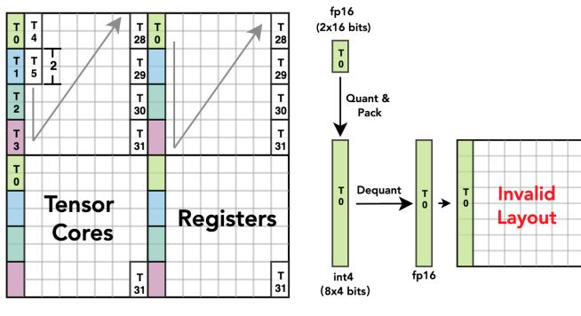
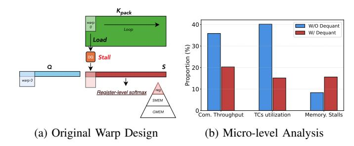
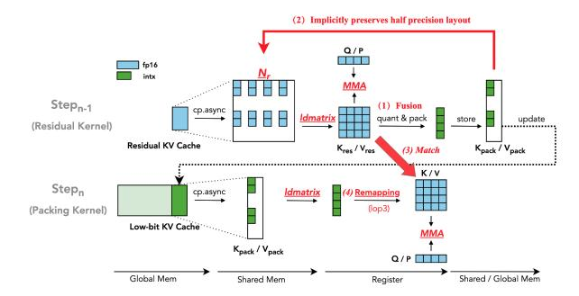
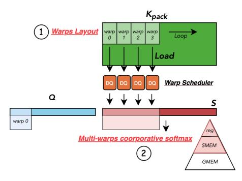

# III. PROPOSED SOLUTIONS AND CHALLENGES

## *A. Solution: Cooperative use of Tensor Cores & CUDA Cores*

In this paper, we want to explore a solution that can achieve a *cooperative* use of Tensor Cores and CUDA cores to support low-bit KV caches during long-context LLMs inference. Our design introduces new designs and implementations that (i) construct and schedule matrix multiplications on Tensor Cores, and (ii) execute non-matrix-multiplication operations—quantization, packing and dequantization—efficiently on CUDA cores. To make this cooperation effective, we balance workloads across the Tensor Cores and CUDA cores and carefully orchestrate data movement so that dequantization feeds Tensor-Core GEMM without stalls, memory traffic is minimized, and end-to-end decoding throughput is maximized.

To ensure broad adoption, we aim to realize this cooperative design as a system that (i) supports low-bit KV caches across multiple attention variants (including MHA, MQA, and GQA), and (ii) spans multiple GPU generations. The former requires a clean interface that integrates with existing attention implementations; the latter requires designs that are easy to adapt, enabling rapid targeting of different GPU backends while sustaining high decoding throughput.

We expect significant benefits from this proposed solution. For example, by enabling low-bit decoding that builds on FlashAttention-3 (FA-3) [25], we can leverage SM90-specific features—such as warp-specialized pipelines—that yield up to 6× speedups over prior implementations, avoiding the 35% throughput penalty associated with legacy SM80 instructions. Furthermore, this design anticipates the architectural capabilities of Blackwell, where native support for low-precision formats will drive even more substantial throughput improvements.

## *B. Open challenges*

Although promising, the *cooperative* use of Tensor Cores and CUDA cores for low-bit KV caches is particularly challenging to implement for several reasons:

Challenge 1: Tensor Cores often suffer from low-bit layout mismatches. Aligning low-bit data layouts with Tensor Cores requirements is difficult, especially in autoregressive generation where KV caches expand dynamically.

At runtime, after quantization and packing, the low-bit KV cache must dequantize into a half-precision layout that

- (a) FP16 Fragment layout
- (b) Int4 Fragment layout

Fig. 3: (a) mma.m16n8k16 fragment layout for matrix B. Each thread  $(T_i)$  is assigned a specific set of values based on the instruction-defined interleaved mapping. (b) For INT4, quantization packs values contiguously per thread. After dequantization, the layout misaligns with the expected interleaved pattern.

matches what Tensor Cores expect. This matching is challenging for three reasons.

First, fragment layouts vary across instructions and GPU generations. After using the optimized data-movement instruction ldmatrix, the fragment residing in registers enforces a strict value-to-thread mapping. Fig. 3a illustrates the registers read by each thread (T) for ldmallelllellellellellellellellellellellell

Second, low-precision bitwidths exacerbate alignment issues. Although Tensor Cores instructions require specific compute types, their rigid, interleaved register layout makes lower-precision data hard to match directly. Without a layout transform, the low-bit register layout becomes an invalid **layout** for MMA execution due to misalignment with the interleaved access patterns. As shown in Fig. 3b, two FP16 values originally computed by Thread 0 (T0) may be quantized and packed as eight consecutive low-bit values in the KV cache; after unpacking and dequantization, they no longer align with the expected Tensor Core register layout, yielding incorrect values. Even with native low-precision formats in Blackwell, hardware support remains limited, especially for the KV cache, which still depends on continuous quantization and packing; software must therefore carefully handle lowprecision values and micro-scaling factors [20].

Finally, dequantization can bottleneck execution: naive low-bit—FP16 casts are slow [14] and require a **friendly layout** to run efficiently. Prior work such as Ladder [33] and Marlin [9] mitigates mismatch for static weights by inserting separate layout-transformation kernels, but this adds substantial overhead and is unsuitable for dynamic decoding. Experimental details are given in Table II.

#### Challenge 2: Frequent stalls limit Tensor Cores uti-

Fig. 4: (a) A single warp along N for register-level operations will experience stalls due to dequantization (DQ) (b) Microlevel comparision with and without dequantization.

**lization.** We observe that empirically tuned warp layouts and partitioning in high-performance attention kernels often inadvertently degrade low-bit KV-cache performance.

Under FlashAttention's original warp partitioning, the additional dequantization (DQ) can substantially reduce throughput and Tensor Core utilization. As shown in Fig. 4a, FlashAttention assigns a single warp along the N dimension to perform register-level softmax and the matrix multiplication PV, with P stored in registers aligned to the Tensor Core layout. When DQ is inserted before the matmul, this strategy becomes inefficient: small warp tiles of K or V must traverse N sequentially, so DQ frequently stalls the warp. Nsight Compute profiling [21] in Fig. 4b confirms that the added DQ overhead increases memory-access stalls and depresses compute throughput and Tensor Cores utilization, consistent with prior observations [8].

Furthermore, native low-precision formats introduce their own overhead despite eliminating dequantization. Specifically, to utilize low-precision Tensor Cores for the second matrix multiplication (PV), the probability matrix P must be dynamically re-quantized after the softmax operation:  $P_{f16} = \text{softmax}(Q_{f4}K_{f4}^T)$ ,  $O_{f16} = \text{Quant}(P_{f16})V_{f4}$ . This onthe-fly quantization creates a new computational bottleneck that can similarly stall Tensor Cores execution.

Challenge 3: Lack of generalizable system optimizations for different low-bit KV-cache methods. Popular KV-cache quantization methods use diverse scaling granularities for the Key tensor—tensor-wise [12], [37] and channel-wise [13], [18]—which complicates building a unified system that supports them all. Online quantization and packing require reductions and element-wise transforms, adding nontrivial runtime overhead. Moreover, auxiliary metadata (scale and zero-point) increases memory traffic and, without careful scheduling, disrupts the load—compute pipeline. Prior mixed-precision kernel optimizations [9], [33] target static weight quantization and do not generalize to the dynamic, step-by-step nature of KV caches. To date, generalizable system-level optimization techniques for high-performance, low-bit KV-cache quantization are lacking.

Fig. 5: Overview of methods for optimizing low-bit layout on Tensor Cores. (1) Fused computation and quantization within Tensor Cores fragments. (2) The low-bit packing data preserves FP16 values. (3) Low-bit Layout matches with the dequantized half-precision layout. (4) Layout remapping for faster dequantization.

## IV. BITDECODING DESIGN

In this section, we present the design of BitDecoding system which realizes the cooperative use of Tensor Cores and CUDA cores in supporting low-bit KV cache. The design primarily contains (i) new methods and principles for optimizing the low-bit layout in using Tensor Cores, and (ii) new strategies for parallelizing and coordinating GPU warps that can minimize the stalls due to dequantization.

## *A. Methods for optimizing low-bit layout on Tensor Cores*

The first challenge our design aims to address is to ensure BitDecoding can automatically generate an optimized layout that can fully utilize Tensor Cores across different GPU generations and different configurations of the low-bit KV caches. For this, we have designed the following principles and methods:

(1) Inducing low-bit optimized layout with hardware instructions. Our design is motivated by a novel insight: the thread-to-register mapping of ldmatrix loads data in Tensor Core's interleaved fragment layout. As shown in Fig. 5- (2), if each thread then quantizes and packs locally, the resulting low-bit packing *implicitly preserves* the half-precision (FP16) interleaved layout. On unpacking and dequantization, values already match Tensor Core registers—no global reshape is required. Thus, rather than relying on heavyweight global transforms via manual implementations [9] or iterative search [33] as in prior methods, we use hardware instructions to automatically induce a valid low-bit packing layout while computing. This yields zero-overhead remapping that is efficient, compatible with Tensor Cores execution, and avoids extra data movement.

Building on this insight, we design a dedicated GPU *Residual Kernel* that fuses computation, quantization, and packing for newly generated FP16 KV tensors. Using ldmatrix, we load the high-precision KV tensor into registers structured for Tensor Cores, perform the matrix operation (e.g., QK⊤ or P V ), and then have each thread quantize and pack its portion in registers (see Fig. 5-(1)). The result is interleaved, layoutcompatible low-bit data written directly to global memory, updating the low-bit KV cache.

To consume this cache, we introduce a *Packing Kernel* that fuses dequantization with computation. To guarantee correct register layout during unpacking, it mirrors the Residual Kernel's instruction configuration which (i) uses the same ldmatrix variant and (ii) follows the same mma variant and warp-tiling configuration. Consequently, when the Packing Kernel loads packed low-bit data via ldmatrix, the unpacked values are inherently aligned with Tensor Core registers and can participate in matrix multiplication immediately, without explicit layout correction.

(2) Aligning warps with residual KV cache to saturate Tensor Cores. Tensor Cores execute warp-tiled matrix operations, which require input tiles to be fully populated to achieve optimal throughput. Based on this, *our insight* is that by allocating a residual buffer with size matching the tiling capacity of Tensor Cores, we ensure that low-bit data aligns with the compute granularity of the hardware to fully utilize the computing ability of the computing unit.

To implement this idea, we introduce a half-precision residual KV cache with a residual block size Nr. Let X ∈ R L×d denote the entire KV cache. We partition X into:

$$X = X_{\text{pack}} \cup X_{\text{res}}, \quad \text{where} \quad \begin{dcases} X_{\text{pack}} = X[:L-N_r] \ X_{\text{res}} = X[L-N_r:] \end{cases}$$

We define β as the bit-width for low-bit quantization (e.g., β = 4 or 2), and ω as the word size used for packed storage (e.g., ω = 16 for INT16). The corresponding *packing ratio* is given by R = ω/β. Let Wn denote the number of warps along the N dimension, and Pn the number of elements each warp tile processes (e.g., Pn = 8 under mma.m16n8k16). To ensure each Tensor Cores fragment is fully populated for each warp, the residual block size is computed as:

$$N_r = P_n \times W_n \times R \tag{1}$$

This guarantees that low-bit KV cache fragments align precisely with the warp-level tiling of Tensor Core operations, enabling dense, layout-compatible packing and maximizing compute unit occupancy.

(3) Re-mapping layout for faster dequantization. Though compatible with Tensor Cores layout, the layout is inefficient to dequantization due to directly casting low-bit values to FP16 using static\_cast introduces significant overhead.

To mitigate this inefficiency, we further design a faster dequantization mapping approach based on low-level bitwise operations and instructions inspired by [14]. After loading packed data into registers using ldmatrix, we cast them to INT32 before mapping them to the interleaved Tensor Core layout following the 75316420 pattern. This layout enables efficient conversion of INT4/INT2 data to FP16 using the lop3 instruction for bitwise manipulation while aligning with the Tensor Core computation pattern.

(4) Coordinating Residual and Packing Kernels with Configuration Setup. This design is executed by coordinating the Residual and Packing kernels under a unified instruction configuration. First, the hardware instruction configuration—including ldmatrix and mma variants—can be determined based on GPU architectures. With this configuration, the residual block size  $N_r$  is computed based on the bitwidth of the low-bit KV cache. As shown in Fig. 5, the Residual kernel loads high-precision KV entries into registers via ldmatrix, performs computation using Tensor Cores, and then fuses quantization and packing before storing the results into the low-bit KV cache. The Packing kernel, using the same instruction configuration, loads the packed data into registers, performs efficient dequantization, and proceeds with Tensor Core computation.

## B. Strategies for parallelizing warps

The second challenge is ensuring BitDecoding avoids the pitfalls of existing warp-parallelization strategies for mixed-precision attention, which suffer from low hardware utilization due to frequent warp stalls. Our key insight is that low-bit data moves at much higher bandwidth than full precision, shifting the bottleneck from memory to compute. We therefore design a warp layout that exploits the GPU memory hierarchy to parallelize low-precision operations efficiently, minimizing data movement and substantially improving Tensor Cores utilization (Table III demonstrates minimal overhead).

(1) Enhancing warps parallelism for low-precision operations. We introduce a novel warps layout to enable parallel operations of multiple packed data chunks. Using dequantization as an example, we modify the warp partitioning strategy to better exploit parallelism. As illustrated in Fig. 6, instead of the original strategy that allocates multiple warps along the M dimension, we constrain the allocation to  $W_m=1$ —leveraging the fact that the decoding query length is typically small (< 16)—and reallocate resources to increase the number of warps along the N dimension ( $W_n$ ).

By increasing  $W_n$ , dequantization stalls can be effectively mitigated by the Streaming Multiprocessor (SM) warp scheduler [24], as multiple warps concurrently execute dequantization on packed data before proceeding to Tensor Cores-based matrix multiplication.

Similarly, this parallelism strategy alleviates the stalls introduced by on-the-fly quantization in native low-precision attention, ensuring that neither quantization nor dequantization becomes a serialization bottleneck.

(2) Leveraging memory hierarchy for warps synchronization. However, with results now distributed across different registers and warps, the original register-level softmax becomes infeasible. Moreover, a key challenge emerges due to the incompatibility between the new warp layout and the expected format for MMA operations on PV.

To address this, we leverage a multi-level memory hierarchy—spanning registers and shared memory—to enable cross-warp reduction and synchronization for the softmax computation. As illustrated in Algorithm 1, we extend existing high-performance attention algorithms, such as FlashAttention, by introducing two additional shared memory buffers:  $sTMP \in$ 

Fig. 6: Enhancing parallism for efficient Tensor Cores utilization with (1) new warp layout design reduces dequantization stalls and (2) cooperative softmax leverages data movement between GPU register and shared memory for cross-warp reduction with minimal overhead.

 $\mathbb{R}^{W_n}$  and  $sAcc \in \mathbb{R}^{T_m \times T_n}$ . The buffer sTMP facilitates cross-warp reduction for computing the row-wise maximum during softmax. This is achieved by first performing intra-warp reduction within registers, followed by inter-warp reduction via shared memory. The buffer sAcc temporarily stores the attention scores P computed in Tensor Core registers and later reloads them via ldmatrix, ensuring proper alignment for subsequent Tensor Core mma operations.

Since  $W_n$  is typically small, we reuse the shared memory pointer of sTMP for sAcc to minimize memory overhead. Moreover, on Hopper Tensor Cores, WGMMA supports direct shared memory access, eliminating the need for explicit data movement from shared memory to registers.

