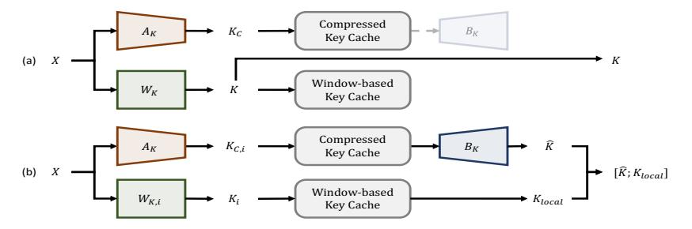
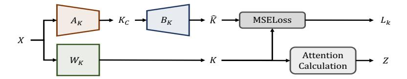

# 2 Method

### 2.1 Inference with Bi-Branch KV Cache

To reduce the memory overhead, we design to reduce the memory overhead of the KV cache by using low-rank decomposition for both the Key and Value weight matrix. Without loss of generality, we will detail the workflow of compressing the key cache, as the process is identical to that of the value cache.

As shown in Figure [1,](#page-2-0) we use two matrices, AK ∈ Rhin×hcomp and BK ∈ Rhcomp×hout , to approximate the weight matrix of WK ∈ Rhin×hout . Here the hin, hout, hcomp are the input dimension of WK, the output dimension of WK, and the intermediate dimension of the low-rank decompression. Keeping the hcomp smaller than hout and storing the intermediate features as the compressed Key cache, we can significantly save the memory overhead, especially in the long context scenario.

To maintain the high performance, we propose to follow the prior research by preserving the recently used tokens [\[1,](#page-4-13) [18\]](#page-4-3) because they are crucial for accurate next-token prediction. To prevent the degradation of this local information during inference, we propose the bi-branch KV cache that preserves the recently used tokens effectively during both the prefilling and decoding stages. With a pre-defined window size lw, we compress the KV cache only after the tokens fill a complete window while retaining the residual tokens in their original hidden dimensions.

Specifically, for the prefilling stage, as shown in Figure [1\(](#page-2-0)a), given an input sequence with n tokens, we first use the AK to generate the compressed Key matrix and store it in the Compressed Key Cache KC . In this case, the Compressed Key Cache contains all of the historical information of the given sentence. On the other branch, we use the original WK to generate the full-precision Key matrix K for computation, which can guarantee that the computation results of the prefilling stage are the same as the original LLMs. Then, we only store the full-precision Key activation of the last m tokens Klocal to preserve the local information for the decoding stage.

Moreover, during the decoding stage, as shown in Figure [1\(](#page-2-0)b), we only process one token during each forward pass. We take the process of the (n + 1)-th token as an example. For the cache update, we compute both the compressed Key activation KC and full-precision Key activation K and update both Key caches with the new activations. In this case, the compressed Key cache has (n + 1) tokens, and the full-precision Key cache has (m + 1) tokens. To get the (n + 1) tokens' Key matrix, we use the (m + 1) tokens from the full-precision Key cache as Klocal and use the BK to process the oldest (n − m) tokens in the compressed Key cache as Kˆ . By concatenating the Kˆ and Klocal, we

Figure 1: The overview of the inference process. (a) The prefilling stage. (b) The decoding stage.

Figure 2: The overview of the efficient layer-wise reconstruction fine-tuning.

can get the target Key matrix for attention computation. Finally, we remove the oldest token from the full-precision Key cache to keep the window size as m.

#### 2.2 Efficient Fine-tuning by SVD-based Initialization

Directly applying low-rank decomposed weight matrices for KV cache compression would result in the degradation of model performance when the compression ratio becomes high. To further enhance the model performance, we propose to introduce an efficient training process. We find that the initialization method to the proposed  $A_K$  and  $B_K$  is of great importance for convergence and final performance. In this case, we proposed to use the ASVD-based decomposition results for initialization. As shown in Figure 2, we train LLMs in a layer-wise manner by minimizing the layer-wise reconstruction loss for the compressed keys and values.

Specifically, for each layer, we can use the  $W_K$  to generate the full-precision Key matrix  $K = XW_K$  and use  $A_K$ ,  $B_K$  to generate the lossy key matrix  $\hat{K} = XA_KB_K$ . The local reconstruction loss of this layer could be defined as Equation 1:

$$L_K = \text{MSELoss}(K, \hat{K}) \tag{1}$$

where  $L_K$  denotes the loss of keys in this layer, and  $\mathrm{MSELoss}(\cdot,\cdot)$  is the Mean Square Error (MSE) loss function. Finally, define the loss of keys and values in the i-th layer as  $L_{K,i}, L_{V,i}$ , the loss for the whole model is shown in Equantion 2:

$$\mathcal{L}_{all} = \sum_{j=0}^{n_l} (L_{K,j} + L_{V,j})$$
 (2)

where  $\mathcal{L}_{all}$  denotes the loss for the whole model, and  $n_l$  denotes the number of layers.

### 3 Experiment

#### 3.1 Experimental Setup

We evaluate our method on LongChat-7B-v1.5-32k [9] and Mistral-7B-Instruct-v0.2 [7]. We evaluate our method on three widely-used long-context benchmarks: LongEval [9], LongBench [21], and LVEval [19]. For comparison, we include results from StreamingLLM [18], H2O [22] 1, and ASVD [20]. The first two are token pruning methods, while the latter is a SOTA channel-shrinking method. More details can be found in the Appendix.

 $^{1}$ Here we only compare the effect of  $H_{2}O$  on Longchat-7b-v1.5-32k, as it only supports LLaMA architecture in its official implementation.

Table 1: Performance of models with CSKV on long-context benchmarks.

| Model                    | C. Ratio | Method       | LongEval ↑ |      |      | LongBench ↑ |      |      | LV-Eval ↑ |      |
|--------------------------|----------|--------------|------------|------|------|-------------|------|------|-----------|------|
|                          |          | Weirod       | 4k         | 6k   | 8k   | 10k         | 0-4k | 4-8k | 8k+       | 16k  |
| Longchat-7b-v1.5-32k     | 0%       | -            | 1.00       | 1.00 | 0.98 | 0.98        | 0.46 | 0.43 | 0.46      | 0.13 |
|                          | 50%      | StreamingLLM | 0.12       | 0.16 | 0.06 | 0.20        | 0.37 | 0.39 | 0.40      | 0.09 |
|                          |          | $H_2O$       | 0.62       | 0.56 | 0.52 | 0.50        | 0.40 | 0.38 | 0.38      | 0.09 |
|                          |          | ASVD         | 0.92       | 0.96 | 0.92 | 0.94        | 0.44 | 0.41 | 0.43      | 0.11 |
|                          |          | CSKV (Ours)  | 0.98       | 0.94 | 0.96 | 0.94        | 0.46 | 0.42 | 0.45      | 0.12 |
|                          | 80%      | StreamingLLM | 0.06       | 0.06 | 0.02 | 0.02        | 0.31 | 0.35 | 0.39      | 0.06 |
|                          |          | $H_2O$       | 0.18       | 0.24 | 0.26 | 0.10        | 0.34 | 0.30 | 0.32      | 0.05 |
|                          |          | ASVD         | 0.26       | 0.12 | 0.06 | 0.04        | 0.36 | 0.31 | 0.32      | 0.04 |
|                          |          | CSKV (Ours)  | 0.92       | 0.94 | 0.94 | 0.90        | 0.43 | 0.40 | 0.41      | 0.10 |
| Mistral-7b-instruct-v0.2 | 0%       | -            | 1.00       | 1.00 | 0.98 | 0.94        | 0.50 | 0.47 | 0.45      | 0.20 |
|                          | 50%      | StreamingLLM | 0.06       | 0.12 | 0.04 | 0.14        | 0.39 | 0.38 | 0.37      | 0.12 |
|                          |          | ASVD         | 1.00       | 0.98 | 0.92 | 0.94        | 0.49 | 0.45 | 0.44      | 0.17 |
|                          |          | CSKV (Ours)  | 1.00       | 1.00 | 0.96 | 0.94        | 0.50 | 0.47 | 0.47      | 0.20 |
|                          | 80%      | StreamingLLM | 0.06       | 0.04 | 0.00 | 0.04        | 0.34 | 0.34 | 0.33      | 0.06 |
|                          |          | ASVD         | 0.04       | 0.00 | 0.04 | 0.00        | 0.33 | 0.29 | 0.29      | 0.05 |
|                          |          | CSKV (Ours)  | 0.98       | 0.96 | 0.90 | 0.92        | 0.45 | 0.42 | 0.41      | 0.17 |

#### 3.2 Main Results

We apply compression ratios of 50% and 80% consistently for both keys and values. The results are presented in Table 1.

According to the evaluation results in table 1, the token pruning methods are especially not skilled in retrieval tasks like LongEval, even at a 50% compression ratio, when ASVD and CSKV only incur minor performance loss. As the compression ratio reaches 80%, all methods except for CSKV suffer great performance degradation on all three tasks. To dive deeper, we examine the failure cases of token pruning methods, and found that although the model could generate coherent sentences based on instructions, a great deal of the retrieved answers deviate from the ground truth by a small portion, like answering "4244" when the label is "42440", or give an irrelevant answer such as "1386". This might be caused by their token eviction mechanisms which inherently have to discard the information of some tokens completely, facing great risk of losing the ground truth information. In contrast, the abundant failure cases of ASVD at 80% compression are mainly caused by the loss of the model's language modeling capabilities, like responding with dozens of tokens that could hardly form a sentence. Different from the aforementioned methods, CSKV consistently enables the model to generate instruction-following responses and give accurate answers on either retrieval tasks or QA tasks, showing its superior capability of keeping the model's long-context abilities even at high compression ratios.

#### 3.3 Ablation Studies

We conduct several ablation studies to further explore the potential of our method, and the main conclusions include: 1) The SVD-based initialization methods is crucial to the success of training; 2) The model performance is positively correlated with the window size, while the benefit would become less significant after it reaches a certain level; 3) In most cases, it would be better to compress the key cache more than the value cache given a certain budget; 4) CSKV could be seamlessly integrated with 4-bit QAT with very small performance loss. See Appendix for details.

### 4 Limitation and Future Directions

While demonstrating competitive performance, the proposed method's compression ratio assignment is user-defined and might not be optimal, offering the potential to achieve higher compression ratios. Future work could explore the application of automated search algorithms to dynamically assign compression ratios to individual layers, accounting for their varying sensitivity to compression. Similarly, automated strategies could optimize memory budget allocation for keys and values, maximizing performance within a given constraint. We leave those directions for future works to explore.

## References

- [1] Iz Beltagy, Matthew E. Peters, and Arman Cohan. Longformer: The long-document transformer, 2020.
- [2] William Brandon, Mayank Mishra, Aniruddha Nrusimha, Rameswar Panda, and Jonathan Ragan Kelly. Reducing transformer key-value cache size with cross-layer attention, 2024.
- [3] DeepSeek-AI et al. Deepseek-v2: A strong, economical, and efficient mixture-of-experts language model, 2024.
- [4] Leo Gao, Stella Biderman, Sid Black, Laurence Golding, Travis Hoppe, Charles Foster, Jason Phang, Horace He, Anish Thite, Noa Nabeshima, et al. The pile: An 800gb dataset of diverse text for language modeling. *arXiv preprint [arXiv:2101.00027](http://arxiv.org/abs/2101.00027)*, 2020.
- [5] Dan Hendrycks, Collin Burns, Steven Basart, Andy Zou, Mantas Mazeika, Dawn Song, and Jacob Steinhardt. Measuring massive multitask language understanding. *Proceedings of the International Conference on Learning Representations (ICLR)*, 2021.
- [6] Yunpeng Huang, Jingwei Xu, Junyu Lai, Zixu Jiang, Taolue Chen, Zenan Li, Yuan Yao, Xiaoxing Ma, Lijuan Yang, Hao Chen, Shupeng Li, and Penghao Zhao. Advancing transformer architecture in long-context large language models: A comprehensive survey, 2024.
- [7] Albert Q. Jiang, Alexandre Sablayrolles, Arthur Mensch, Chris Bamford, Devendra Singh Chaplot, Diego de las Casas, Florian Bressand, Gianna Lengyel, Guillaume Lample, Lucile Saulnier, Lélio Renard Lavaud, Marie-Anne Lachaux, Pierre Stock, Teven Le Scao, Thibaut Lavril, Thomas Wang, Timothée Lacroix, and William El Sayed. Mistral 7b, 2023.
- [8] Sehoon Kim, Sheng Shen, David Thorsley, Amir Gholami, Woosuk Kwon, Joseph Hassoun, and Kurt Keutzer. Learned token pruning for transformers. In *Proceedings of the 28th ACM SIGKDD Conference on Knowledge Discovery and Data Mining*, pages 784–794, 2022.
- [9] Dacheng Li\*, Rulin Shao\*, Anze Xie, Ying Sheng, Lianmin Zheng, Joseph E. Gonzalez, Ion Stoica, Xuezhe Ma, and Hao Zhang. How long can open-source llms truly promise on context length?, June 2023.
- [10] Shiyao Li, Xuefei Ning, Luning Wang, Tengxuan Liu, Xiangsheng Shi, Shengen Yan, Guohao Dai, Huazhong Yang, and Yu Wang. Evaluating quantized large language models, 2024.
- [11] Yujun Lin, Haotian Tang, Shang Yang, Zhekai Zhang, Guangxuan Xiao, Chuang Gan, and Song Han. Qserve: W4a8kv4 quantization and system co-design for efficient llm serving. *arXiv preprint [arXiv:2405.04532](http://arxiv.org/abs/2405.04532)*, 2024.
- [12] Zichang Liu, Aditya Desai, Fangshuo Liao, Weitao Wang, Victor Xie, Zhaozhuo Xu, Anastasios Kyrillidis, and Anshumali Shrivastava. Scissorhands: Exploiting the persistence of importance hypothesis for llm kv cache compression at test time, 2023.
- [13] Zirui Liu, Jiayi Yuan, Hongye Jin, Shaochen Zhong, Zhaozhuo Xu, Vladimir Braverman, Beidi Chen, and Xia Hu. Kivi: A tuning-free asymmetric 2bit quantization for kv cache. *arXiv preprint [arXiv:2402.02750](http://arxiv.org/abs/2402.02750)*, 2024.
- [14] Aleksandra Piktus. https://huggingface.co/datasets/ola13/small-the\_pile, 2022.
- [15] Ying Sheng, Lianmin Zheng, Binhang Yuan, Zhuohan Li, Max Ryabinin, Beidi Chen, Percy Liang, Christopher Ré, Ion Stoica, and Ce Zhang. Flexgen: High-throughput generative inference of large language models with a single gpu. In *International Conference on Machine Learning*, pages 31094–31116. PMLR, 2023.
- [16] Yutao Sun, Li Dong, Yi Zhu, Shaohan Huang, Wenhui Wang, Shuming Ma, Quanlu Zhang, Jianyong Wang, and Furu Wei. You only cache once: Decoder-decoder architectures for language models, 2024.
- [17] Hugo Touvron et al. Llama 2: Open foundation and fine-tuned chat models, 2023.
- [18] Guangxuan Xiao, Yuandong Tian, Beidi Chen, Song Han, and Mike Lewis. Efficient streaming language models with attention sinks, 2024.
- [19] Tao Yuan, Xuefei Ning, Dong Zhou, Zhijie Yang, Shiyao Li, Minghui Zhuang, Zheyue Tan, Zhuyu Yao, Dahua Lin, Boxun Li, Guohao Dai, Shengen Yan, and Yu Wang. Lv-eval: A balanced long-context benchmark with 5 length levels up to 256k, 2024.
- [20] Zhihang Yuan, Yuzhang Shang, Yue Song, Qiang Wu, Yan Yan, and Guangyu Sun. Asvd: Activation-aware singular value decomposition for compressing large language models, 2024.
- [21] Bai Yushi, Lv Xin, Zhang Jiajie, Lyu Hongchang, Tang Jiankai, Huang Zhidian, Du Zhengxiao, Liu Xiao, Zeng Aohan, Hou Lei, Dong Yuxiao, Tang Jie, and Li Juanzi. Longbench: A bilingual, multitask benchmark for long context understanding. *arXiv preprint [arXiv:2308.14508](http://arxiv.org/abs/2308.14508)*, 2023.

[22] Zhenyu Zhang, Ying Sheng, Tianyi Zhou, Tianlong Chen, Lianmin Zheng, Ruisi Cai, Zhao Song, Yuandong Tian, Christopher Ré, Clark Barrett, Zhangyang Wang, and Beidi Chen. H2o: Heavy-hitter oracle for efficient generative inference of large language models, 2023.

