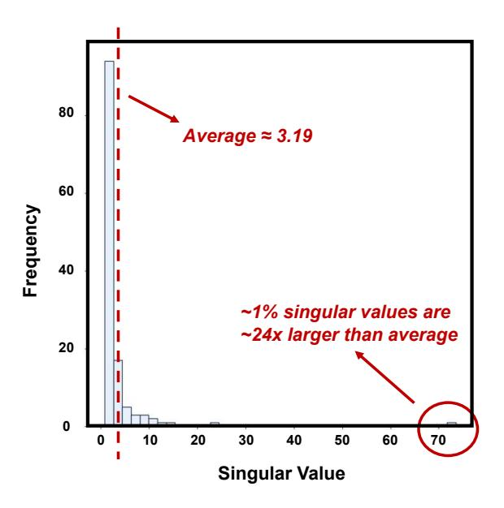
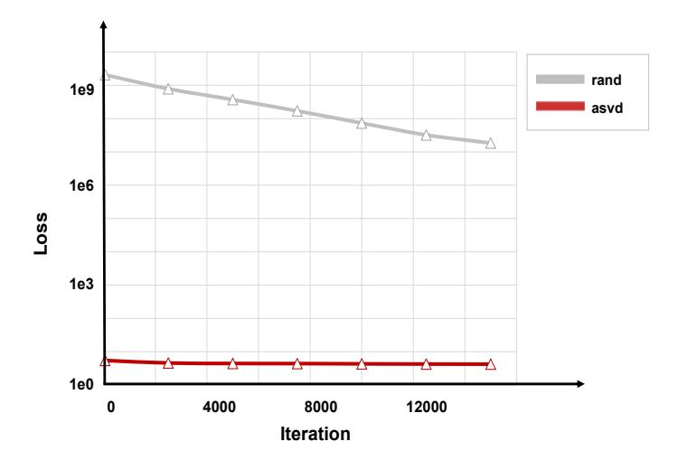

# Appendix

### A. Distribution of Singular Values of key cache

We visualize the distribution of singular values of key cache in the 14-th layer of LLaMA-2-7B-chat model, using data randomly sampled from the Pile [\[4\]](#page-4-19) dataset. We find that the singular value of the key cache has a significant long-tailed distribution, and a similar phenomenon also appears in the value cache. In this case, only a tiny fraction of singular values have large magnitudes, while the vast majority are around zero, which can be removed without significant degradation of model performance.

Figure 3: Distribution of of Singular Values of key cache.

### B. Details of Experimental Setup

We evaluate our method on widely used long-context models, including LongChat-7B-v1.5-32k [\[9\]](#page-4-14) and Mistral-7B-Instruct-v0.2 [\[7\]](#page-4-15). For fine-tuning, we use a scaled-down version of the Pile [\[4\]](#page-4-19) dataset [\[14\]](#page-4-20) and is conducted with both the epoch and batch size set to 1, using the AdamW optimizer with an initial learning rate of 5e-5. The entire fine-tuning process for each 7B model is completed within 90 minutes on a single NVIDIA A100-80G GPU, resulting in minimal training costs. We initialize the model with ASVD [\[20\]](#page-4-18), selecting 256 samples from the fine-tuning dataset as calibration data. We set α = 0.5 and use the Absolute Mean Value method for configuring the scaling matrix S.

The evaluation of our method is performed on three widely-used long-context benchmarks, including LongEval [\[9\]](#page-4-14), LongBench [\[21\]](#page-4-16) and LVEval [\[19\]](#page-4-17). Specifically, we choose the 200,300,400,500 lines subsets in LongEval (with an average length of 4k,6k,8k,10k), the qasper, hotpotqa, multifieldqa\_en, gov\_report, triviaqa subset of LongBench-E, along with the 16K subset of LVEval. To compare the results with other methods, we choose StreamingLLM[\[18\]](#page-4-3), H2O[\[22\]](#page-5-0) and ASVD[\[20\]](#page-4-18), in which the first two are token pruning methods and the last one could be regarded as a channel shrinking method[2](#page-6-0) We select compression ratios of 50% and 80% for the experiments, with the same compression ratios for keys and values.

.

2While the standard ASVD perform low-rank decomposition on all weights, here we merely decompose the WK, WV in each layer.

### C. Ablation Study

Without loss of generality, we perform an ablation study on LongEval with the Longchat-7b-v1.5-32k model. The window size is set to 32 and the compression ratio is evenly distributed on keys and values by default. The "Avg.Acc" column in the following tables indicates the average accuracy on the four chosen subsets of LongEval.

### C.1 Effect of Initialization Methods

We test three initialization methods for the low-rank decomposed matrices: 1) random initialization, 2) standard SVD initialization, and 3) ASVD initialization. We keep their fine-tuning settings the same as mentioned in the Experimental Setups. The loss curves of 80% compression are shown in Figure [4,](#page-7-0) and the evaluation results for the trained models with a bi-branch strategy are shown in Table [2.](#page-7-1)

Figure 4: Loss curve with 80% compression ratio. "asvd" means initialize with ASVD, "rand" means random initialization. We drop the curve for standard SVD initialization as it almost overlaps with the ASVD one in the figure.

Table 2: Results of different initialization methods

| C. Ratio | Init. Method | Avg. Acc |  |
|----------|--------------|----------|--|
| 0%       | -            | 0.99     |  |
|          | Random       | 0.00     |  |
| 50%      | SVD          | 0.94     |  |
|          | ASVD         | 0.95     |  |
|          | Random       | 0.00     |  |
| 60%      | SVD          | 0.93     |  |
|          | ASVD         | 0.94     |  |
|          | Random       | 0.00     |  |
| 70%      | SVD          | 0.89     |  |
|          | ASVD         | 0.93     |  |
|          | Random       | 0.00     |  |
| 80%      | SVD          | 0.87     |  |
|          | ASVD         | 0.92     |  |

It could be found that the loss of the random initialization method remains extremely high (∼1e9) and is very hard to converge in a reasonable time, leading to the deterioration of model performance. This is quite intuitive as the information stored in the initial WK, WV are completely destroyed and their information cannot be utilized. In contrast, the SVD-based initialization methods' loss could converge quickly from approximately 5.5 to 4.0, leading to superior model performance. Therefore, the SVD-based initialization methods is crucial to the success of training. Specifically, the ASVD-initialized model performs slightly better than the SVD-initialized one after training, so we choose ASVD as the default initialization method.

### C.2 Effect of Window Size

The window size determines how much local information could be preserved, which is of vital importance to the quality of generated content. We fix the compression ratio to 80% and evaluate the performance of the bi-branch trained model with multiple window size settings. The results are shown in Table [3.](#page-8-0)

| C. Ratio | Window Size | Avg. Acc |  |  |
|----------|-------------|----------|--|--|
| 0%       | -           | 0.99     |  |  |
|          | 2           | 0.77     |  |  |
|          | 4           | 0.83     |  |  |
|          | 8           | 0.85     |  |  |
|          | 16          | 0.88     |  |  |
|          | 32          | 0.92     |  |  |
| 80%      | 64          | 0.93     |  |  |
|          | 128         | 0.94     |  |  |
|          | 256         | 0.94     |  |  |
|          | 512         | 0.94     |  |  |
|          | 1024        | 0.95     |  |  |
|          | 2048        | 0.96     |  |  |
|          | 4096        | 0.96     |  |  |

Table 3: Results of different window sizes.

The accuracy of the model shows a positive correlation with the window size, which is quite intuitive. Specifically, as the window size increases from 2 to 32, the accuracy improves relatively rapidly. However, when the window size exceeds 32, the rate of accuracy improvement notably decreases. This might indicate that a window size around 32 would be enough for local information preservation, while greater window sizes could not bring obvious improvement. Therefore, we may conclude that the model performance is positively correlated with the window size, while the benefit would become less significant after it reaches a certain level. Considering that an excessively large window size incurs non-negligible memory overhead, practitioners should carefully balance the trade-off between memory budget and accuracy when selecting the optimal window size for real-world applications.

### C.3 Effect of Compression Ratio Allocation for KV

Different from the token pruning methods that have to keep or discard a certain token's keys and values simultaneously, our channel shrinking method allows for the key cache and value cache to have different compression ratios. To investigate the impact of allocating a certain compression ratio to the key cache and value cache in different proportions, we conduct experiments by fixing the total compression rate at 50% and 75%, respectively. We then evaluate the model's performance under various combinations of compression ratios for keys and values. The results are shown in Table [4.](#page-9-0)

It could be found from the evaluation results that among the selected combinations, the optimal configuration consistently occurs when the compression ratio for the key cache exceeds that of the value cache, showing that it would be better to compress the key cache more than the value cache given a certain budget, in most cases. This potentially reveals that the sensitivity of keys towards compression is weaker than that of values, making the key cache much easier to compress.

Table 4: Results of different compression ratio assignments

| C. Ratio | KV C. Ratio         | Avg. Acc |  |
|----------|---------------------|----------|--|
| 0%       | -                   | 0.99     |  |
|          | K(87.5%) V(12.5%)   | 0.97     |  |
|          | K(75.0%) V(25.0%)   | 0.98     |  |
| 50%      | K(62.5%) V(37.5%)   | 0.96     |  |
|          | K(50.0%) V(50.0%)   | 0.95     |  |
|          | K(37.5%) V(62.5%)   | 0.95     |  |
|          | K(25.0%) V(75.0%)   | 0.94     |  |
|          | K(12.5%) V(87.5%)   | 0.80     |  |
|          | K(43.75%) V(6.25%)  | 0.73     |  |
| 75%      | K(37.50%) V(12.50%) | 0.89     |  |
|          | K(31.25%) V(18.75%) | 0.95     |  |
|          | K(25.00%) V(25.00%) | 0.93     |  |
|          | K(18.75%) V(31.25%) | 0.88     |  |
|          | K(12.59%) V(37.50%) | 0.80     |  |
|          | K(6.25%) V(43.75%)  | 0.43     |  |

### C.4 Compatibility with Quantization

As the low-bit quantization methods are orthogonal with our method, we further demonstrate that quantization could be seamlessly combined with our method. Specifically, we apply KIVI [\[13\]](#page-4-6) with 4-bit quantization on the compressed keys and values, using per-channel quantization for the former and per-token quantization for the latter. Both the window size and the residual size are set to 32. We separately perform the experiments with two quantization manners: PTQ (Post-Training Quantization) and QAT (Quantization-Aware Training). The results are shown in Table [5,](#page-9-1) where the "None" rows are the referenced results from the full-precision model.

Table 5: Results of integration with quantization

| C. Ratio (origin) | C. Ratio (4-bit) | Q. Mode            | Avg. Acc             |
|-------------------|------------------|--------------------|----------------------|
| 0%                | 0%               | -                  | 0.99                 |
| 50%               | 87.5%            | None PTQ QAT | 0.95 0.00 0.96 |
| 60%               | 90.0%            | None PTQ QAT | 0.94 0.00 0.94 |
| 70%               | 92.5%            | None PTQ QAT | 0.93 0.00 0.92 |
| 80%               | 95.0%            | None PTQ QAT | 0.92 0.00 0.90 |

According to the results in Table [5,](#page-9-1) directly applying PTQ would completely deteriorate the model's performance, while the QAT results show minor degradation compared with their full-precision counterparts. The failure of PTQ might be a result of the significant density of the compressed representations, which are a lot more intact and difficult to directly quantize. In contrast, the QAT method includes the quantization loss during the optimization process and shows great compatibility with our channel shrinking method, where a total of 95% compression would still keep more than 90% of the model's long-context capability. Therefore, it could be concluded that it would be better to compress the key cache more than the value cache given a certain budget, in most cases.