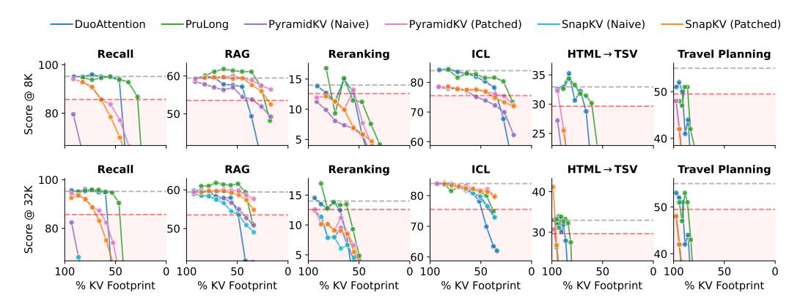

# F Hardware metrics

Measurements In this Appendix, we augment our comparison of the various methods on our idealized metrics (KV footprint and peak KV) with a comparison on the basis of "real" metrics—peak GPU memory utilization and throughput. We measure the former in GiBs of memory, and the latter in terms of the number of requests per second. The results for the various tasks are reported in Tables [7](#page-20-0) through [12.](#page-22-0) We also ablate our two modifications to PyramidKV and SnapKV: (1) the mean-pooling of attention within KV groups to avoid replicating KVs (C), and (2) patching in chunked eviction (P). DuoAttention and PruLong were run with a head sparsity of 70% (corresponding to a KV footprint slightly above 30%), and PyramidKV and SnapKV were allowed a total cache size of 30% of the context window in these experiments—this leads to a KV footprint around 35% in most cases.

We make the following observations:

Table 6: Performance of different SFT data mixtures. We find that adding the Tulu-v3 SFT mixture [Lambert et al., 2025] makes a difference especially on LongProc reasoning tasks such as HTML (HTML $\rightarrow$ TSV), Pseudo (Pseudo $\rightarrow$ Code), Travel (Travel Planning) and Countd. (Countdown). Note that in these results, we average across all available generation settings in these results.

| Model (SFT Mixture)   | HTML | Pseudo | Travel | Countd. | RAG  | Rerank | Recall |
|-----------------------|------|--------|--------|---------|------|--------|--------|
| Llama-3.1-8B-Base     | 14.4 | 1.5    | 12.5   | 0.3     | 54.5 | 9.3    | 76.6   |
| (UltraChat)           | 24.4 | 4.0    | 10.0   | 21.7    | 57.5 | 15.1   | 88.2   |
| (Tulu-v3)             | 33.4 | 41.0   | 15.0   | 27.7    | 56.2 | 15.2   | 94.3   |
| (Both, 1:1 ratio)     | 32.6 | 41.5   | 16.0   | 30.3    | 57.4 | 17.3   | 95.6   |
| Llama-3.1-8B-Instruct | 33.0 | 47.5   | 27.5   | 7.7     | 59.5 | 14.0   | 95.2   |
| ProLong-8B-512K-Base  | 31.0 | 44.0   | 7.5    | 35.7    | 59.6 | 17.4   | 97.8   |
| (Ultrachat)           | 34.6 | 12.5   | 6.0    | 8.7     | 64.5 | 21.2   | 99.0   |
| (Tulu-v3)             | 40.5 | 35.5   | 20.5   | 12.7    | 61.1 | 20.0   | 97.4   |
| (Both, 1:1 ratio)     | 42.8 | 33.0   | 15.5   | 27.7    | 63.1 | 20.8   | 99.4   |

Figure 8: Performance vs. KV Footprint for the baselines and PruLong. The gray dashed line denotes the original model's performance, and the red one represents 90% of model performance. We show results at both 8K and 32K prefilling chunk sizes.

- 1. DuoAttention and PruLong usually achieve the highest throughput and the lowest peak memory.
- 2. Mean-pooling (C) usually reduces peak memory utilization by around 25%, but reduces throughput slightly for PyramidKV and SnapKV. It does not usually affect performance.
- 3. Patching (P) leads to a higher score in most settings, and does not substantially affect the throughput or peak memory. The combination of P + C is usually the best-performing variant in both the PyramidKV and SnapKV groups.
- 4. The ranking of methods generally tracks with those in Section 5, demonstrating that our idealized metrics lead to reliable takeaways. On the other hand, the precise values of the real metrics are noisy and show some variation across different runs.

Why not just use hardware metrics then? We saw above that our idealized metrics roughly track with hardware metrics. One could then attempt to compare methods based on these hardware metrics alone. Unfortunately, these hardware metrics are often confounded by differences between the implementations of different algorithms. For instance, one implementation might utilize an optimized CUDA kernel, whereas another might not. Another factor is that PyTorch often performs delayed garbage collection, which can confuse measurements of peak utilization. Fixes like repeatedly clearing the CUDA cache might affect throughput instead. There's also the issue of there not being a single ascribable value of peak memory and throughput—for instance, reducing peak memory by 5% might suddenly allow a method to fit batch sizes twice as large, which may then translate to a higher throughput. In essence, our idealized metrics represent the best achievable values of these

real metrics—those that may be achieved with the optimal kernels and implementation, in theory. Focusing on this ideal allows us to ignore all the implementational differences mentioned above.

Table 7: Real metrics for Recall. C denotes compression by mean-pooling the attention from different queries in the same KV group. P denotes patched eviction.

| Method       | Throughput (×10−2 −1 s ) | Peak Memory (GiB) | Score |
|--------------|-----------------------------------|-------------------|-------|
| DuoAttention | 10.0                              | 26.6              | 59.75 |
| PruLong      | 10.8                              | 26.3              | 92.50 |
| PyramidKV    | 7.8                               | 43.8              | 28.63 |
| + C          | 7.6                               | 33.7              | 34.81 |
| + P          | 8.1                               | 43.8              | 74.06 |
| + P + C      | 8.0                               | 33.7              | 88.00 |
| SnapKV       | 8.0                               | 43.7              | 24.94 |
| + C          | 8.6                               | 33.7              | 32.50 |
| + P          | 8.2                               | 43.8              | 65.38 |
| + P + C      | 8.2                               | 33.7              | 79.25 |

Table 8: Real metrics for RAG. C denotes compression by mean-pooling the attention from different queries in the same KV group. P denotes patched eviction.

| Method       | Throughput (×10−2 −1 s ) | Peak Memory (GiB) | Score |
|--------------|-----------------------------------|-------------------|-------|
|              | None                              | None              | 59.46 |
| DuoAttention | 9.6                               | 28.8              | 53.83 |
| PruLong      | 9.4                               | 28.6              | 61.00 |
| PyramidKV    | 8.1                               | 46.4              | 55.00 |
| + C          | 8.1                               | 34.5              | 54.67 |
| + P          | 8.2                               | 46.4              | 59.88 |
| + P + C      | 8.0                               | 34.6              | 60.46 |
| SnapKV       | 8.1                               | 46.4              | 53.46 |
| + C          | 7.6                               | 34.5              | 53.25 |
| + P          | 8.1                               | 46.4              | 58.67 |
| + P + C      | 7.9                               | 34.6              | 58.79 |

Table 9: Real metrics for Reranking. C denotes compression by mean-pooling the attention from different queries in the same KV group. P denotes patched eviction.

| Method       | Throughput (×10−2 −1 s ) | Peak Memory (GiB) | Score |
|--------------|-----------------------------------|-------------------|-------|
| DuoAttention | 5.8                               | 24.5              | 1.20  |
| PruLong      | 5.8                               | 24.3              | 8.28  |
| PyramidKV    | 4.8                               | 40.5              | 4.06  |
| + C          | 4.2                               | 33.3              | 2.99  |
| + P          | 4.4                               | 40.6              | 6.60  |
| + P + C      | 4.1                               | 33.4              | 5.79  |
| SnapKV       | 4.5                               | 40.5              | 4.55  |
| + C          | 4.5                               | 33.3              | 3.78  |
| + P          | 4.3                               | 40.6              | 5.48  |
| + P + C      | 4.2                               | 33.4              | 6.56  |

Table 10: Real metrics for ICL. C denotes compression by mean-pooling the attention from different queries in the same KV group. P denotes patched eviction.

| Method       | Throughput (×10−2 −1 s ) | Peak Memory (GiB) | Score |
|--------------|-----------------------------------|-------------------|-------|
| DuoAttention | 11.0                              | 27.4              | 78.16 |
| PruLong      | 11.0                              | 27.1              | 81.36 |
| PyramidKV    | 9.6                               | 45.3              | 79.36 |
| + C          | 9.3                               | 34.5              | 79.24 |
| + P          | 9.4                               | 45.4              | 81.72 |
| + P + C      | 8.9                               | 34.6              | 82.64 |
| SnapKV       | 9.5                               | 45.3              | 79.84 |
| + C          | 9.1                               | 34.5              | 78.80 |
| + P          | 9.2                               | 45.4              | 81.40 |
| + P + C      | 8.7                               | 34.6              | 81.64 |

Table 11: Real metrics for HTML → TSV. C denotes compression by mean-pooling the attention from different queries in the same KV group. P denotes patched eviction.

| Method         | Throughput (×10−2 −1 s ) | Peak Memory (GiB) | Score        |
|----------------|-----------------------------------|-------------------|--------------|
| DuoAttention   | 1.8                               | 17.0              | 18.24        |
| PruLong        | 1.9                               | 16.9              | 30.47        |
| PyramidKV      | 1.1                               | 22.0              | 1.43         |
| + C            | 1.8                               | 16.9              | 2.33         |
| + P + P + C | 1.1 1.8                        | 22.0 16.9      | 1.05 2.14 |
| SnapKV         | 1.2                               | 22.0              | 1.12         |
| + C            | 1.3                               | 19.0              | 1.50         |
| + P            | 1.1                               | 22.0              | 1.06         |
| + P + C        | 1.3                               | 19.0              | 1.62         |

Table 12: Real metrics for Travel Planning. C denotes compression by mean-pooling the attention from different queries in the same KV group. P denotes patched eviction.

| Method       | Throughput (×10−2 −1 s ) | Peak Memory (GiB) | Score |
|--------------|-----------------------------------|-------------------|-------|
| DuoAttention | 1.2                               | 16.1              | 22.00 |
| PruLong      | 1.5                               | 16.1              | 37.00 |
| PyramidKV    | 0.8                               | 18.9              | 3.00  |
| + C          | 1.1                               | 17.1              | 4.00  |
| + P          | 0.8                               | 18.9              | 3.00  |
| + P + C      | 1.1                               | 17.1              | 4.00  |
| SnapKV       | 1.0                               | 18.9              | 5.00  |
| + C          | 1.4                               | 17.1              | 5.00  |
| + P          | 1.1                               | 18.9              | 5.00  |
| + P + C      | 1.4                               | 17.1              | 5.00  |