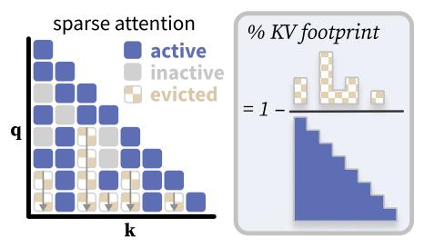
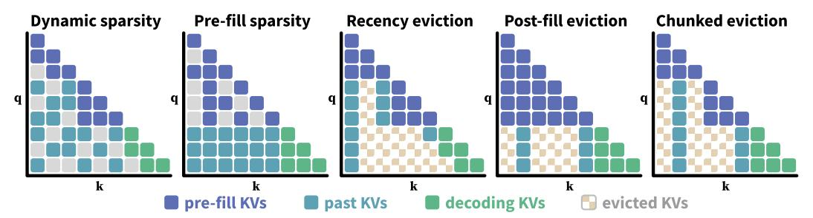

# 2 A Unified Framework for KV Cache Eviction

### 2.1 Measuring the Critical KV Footprint

Given a prompt x1:n with n tokens, a transformer-based language model conventionally generates a response xn+1:n+m in two stages:

- 1. **Pre-filling**: The entire prompt  $\mathbf{x}_{1:n}$  is processed in one forward pass. The key-value states  $\{\mathbf{k}_{1:n}^h, \mathbf{v}_{1:n}^h\}$  for each attention head h are stored in a KV cache. Here  $\mathbf{k}_i^h, \mathbf{v}_i^h \in \mathbb{R}^d$  where d is the head dimension.
- 2. **Decoding**: Tokens  $\mathbf{x}_{n+1}, \mathbf{x}_{n+2}, \dots \mathbf{x}_{n+m}$  are decoded one-by-one, reading and updating the KV cache each time.

The memory consumption of the KV cache grows linearly with increasing prompt and generation lengths, and researchers have proposed many methods to address this overhead. Broadly, these methods work by sparsifying the attention patterns and hence allowing certain KV entries to be evicted. Still, they are tailored to different stages in the inference pipeline—some discard KV entries after the pre-fill stage (e.g. Cai et al. [2024]), while others also trim the KV cache during pre-fill (e.g. Xiao et al. [2025]). This makes a fair and holistic comparison between methods difficult. We first discuss why the common metric of KV cache size fails to capture the model's usefulness in real-world applications.

In practice, it is expensive to conduct only a single pass of pre-fill for long-context inference. *Chunked pre-filling*—splitting the input sequence into chunks and processing it in multiple forward passes—is increasingly standard practice for long input sequences2. This typically reduces the peak GPU memory associated with long inputs3 and enables decoding for shorter prompts to co-occur with additional chunks of longer prompts [Agrawal et al., 2023]. While beyond the scope of this paper, scenarios like multi-turn conversations or interleaved tool calling also necessitate multiple decoding and pre-fill stages, requiring a holistic approach to measuring KV footprint. Speculative decoding [Leviathan et al., 2022, Sadhukhan et al., 2025] further blurs the lines between the pre-fill and decoding stages, by making decoding more compute-bound.

When considering inference with multiple forward passes during both pre-filling and, of course, decoding, the "KV footprint" should account for memory usage over time. For example, it should reflect if we already evicted KVs in chunked pre-filling before pre-filling is completed. The exact inference is characterized by input and output lengths, as well as implementation details that vary across methods. In the absence of a metric that can capture all these nuances, we propose an idealized metric that (1) tracks KV cache memory usage throughout pre-filling and decoding, and (2) accounts for the lifespan of each KV entry, enabling apples-to-apples comparisons across methods.

We examine the methods' attention patterns (Figure 1) and classify each KV entry as *active* (used in the current step), *inactive* (stored but not used at the current step), or *evicted* (not used at any future step and removed from memory). We define the **KV footprint** as the number of attention entries that have not been *evicted*, aggregated across all timesteps. This number is normalized to full causal attention. For example, in Figure 1, the KV footprint is 26/36 = 72.2%. An ideal method minimizes the footprint by evicting KVs *as early* as possible.

Figure 1: The KV footprint.

In Appendix A, we consider an alternative metric that tracks peak KV occupancy in the attention matrix, and both metrics yield similar takeaways in our experiments. We also discuss how our methods relate to real performance metrics such as total token throughput and GPU memory utilization. We find that in many cases the KV footprint correlates well with throughput, yet the precise rankings depend on implementation details beyond KV evictions—and practical efficiency varies widely for the different implementation frameworks across methods.

The critical KV footprint. Prior work often reports task performance at a fixed sparsity level [Li et al., 2025], but we argue a more meaningful metric is the sparsity achievable while preserving most of the original performance. We define the *critical KV footprint* as the smallest footprint at which a method retains a fraction  $\mathcal{F}$  of the full-attention performance on a long-context task. This paper uses  $\mathcal{F} = 90\%$ . Below this threshold, the performance drop is likely too severe for the method to remain

&lt;sup>2For instance, SGLang [Zheng et al., 2024b] pre-fills long inputs in chunks of 8192 tokens by default.

&lt;sup>3Both the KV states and the hidden states and query layer contribute towards the peak memory. With grouped-query attention [Ainslie et al., 2023] or multi-latent attention [Liu et al., 2024a], the latter two can have much higher footprints than the KV states for a layer, and pre-filling smaller chunks reduces the size of hidden states and query vectors present at any given step in memory.

Figure 2: Overview of relevant methods for efficient inference discussed in Section 2.2 and Section 3. The example visualizes the generation of 3 output tokens after two steps of chunked pre-filling, except for pre-fill sparsity and post-fill eviction, which require a single pre-fill.

Table 1: Comparison of prior works for efficient long-context inference. Methods measure sparsity in varied ways and focus on different stages of the generation process, and not all methods are relevant to our goal of reducing the KV cache footprint.

| Approach                                                                                                                                 | Sparsity Measure                             | Pros/Cons                                                                                                                                              |
|------------------------------------------------------------------------------------------------------------------------------------------|----------------------------------------------|--------------------------------------------------------------------------------------------------------------------------------------------------------|
| Dynamic Sparsity NSA [Yuan et al., 2025] MoBA [Lu et al., 2025] TokenButler [Akhauri et al., 2025]                                       | % inactive attention weights                 | <ul><li>✓ Fewer memory accesses</li><li>✓ Increased throughput</li><li>✗ No reduction in KV footprint</li></ul>                                        |
| Pre-fill Sparsity MInference [Jiang et al., 2024] FTP [Xu et al., 2025]                                                                  | % inactive attention weights (pre-fill only) | ✓ Speeds up pre-fill  ✗ No reduction in KV footprint  ✗ No impact during decoding                                                                      |
| Recency Eviction StreamingLLM [Xiao et al., 2024] DuoAttention [Xiao et al., 2025] MoA [Fu et al., 2024]                                 | % local heads; local window size          | ✓ Reduces KV footprint ✓ Compatible with chunked pre-filling ✗ Fixed, context-invariant sparsity                                                       |
| Post-fill Eviction H 2 O [Zhang et al., 2023] FastGen [Ge et al., 2024] SnapKV [Li et al., 2024] PyramidKV [Cai et al., 2024] | % evicted KVs after pre-fill              | ✓ Reduced KV memory during decoding  ✗ High peak memory during pre-fill  ✗ Only evaluated with single pre-fill  ✗ No KV reduction for long generations |

attractive in practice. Our approach differs from SCBench [Li et al., 2025], who propose separate performance metrics for each generation scenario (pre-fill, decoding, and multi-turn) and report their main results at a fixed sparsity setting for each method.

#### 2.2 Existing Approaches to Efficient Long-Context Inference

We survey efficient long-context methods and discuss how they fit into our framework of KV footprint. Table 1 gives an overview over prominent approaches, showing how methods make different trade-offs and use different notions of sparsity.

**Dynamic and pre-fill sparsity.** Native Sparse Attention [Yuan et al., 2025], MoBA [Lu et al., 2025], QUEST [Tang et al., 2024], and TokenButler [Akhauri et al., 2025] treat the KV cache as a two-level hierarchy, where only relevant attention blocks are loaded from high-bandwidth memory (HBM) to on-chip SRAM for processing. Techniques like MInference [Jiang et al., 2024] or FTP [Xu et al., 2025] use dynamic sparse attention to approximate the full attention specifically during the pre-filling phase. Dynamic sparsity approaches lead to more *inactive* KVs and can improve throughput, but they do not reduce the KV memory, and therefore these methods are orthogonal to our focus.

**Recency eviction.** Xiao et al. [2024] identify streaming attention heads, which only attend to a local sliding window and a set of initial "sink tokens". Evicting distant KV entries reduces the KV footprint substantially (Figure 2), as the size of the KV cache remains fixed despite increasing context

length, and this can be applied during both pre-filling and decoding. However, recency eviction may "forget" relevant distant context, motivating DuoAttention [\[Xiao et al.,](#page-13-1) [2025\]](#page-13-1) and MoA [\[Fu et al.,](#page-10-2) [2024\]](#page-10-2) to convert only a subset of attention heads to streaming heads. As promising candidates to KV cache compression, we discuss these methods in more detail in [Section 4.](#page-5-0)

Post-fill eviction. We use the term *post-fill eviction* to refer to methods that drop tokens from the KV cache after the prefill phase ends. These methods rely on heuristics typically based on attention scores [\[Zhang et al.,](#page-14-1) [2023,](#page-14-1) [Ge et al.,](#page-10-3) [2024,](#page-10-3) [Li et al.,](#page-11-0) [2024,](#page-11-0) [Cai et al.,](#page-9-1) [2024,](#page-9-1) [Chen et al.,](#page-9-5) [2024,](#page-9-5) [Wang](#page-13-8) [et al.,](#page-13-8) [2025\]](#page-13-8) to identify the most important KVs in the context. These methods can heavily trim the KVs after the pre-fill and reduce KV memory during decoding. However, in inference scenarios with long prompts and short generations, post-fill eviction can only achieve a limited reduction of the KV footprint, as all KV entries are kept in memory during pre-fill, which also leads to a substantial peak memory before eviction. We adapt these methods for the chunked pre-filling setting in [Section 3.](#page-4-0)

Orthogonal techniques. Quantization [\[Lin et al.,](#page-11-4) [2024,](#page-11-4) [Xiao et al.,](#page-13-9) [2023,](#page-13-9) [Frantar et al.,](#page-10-4) [2023\]](#page-10-4) saves memory by reducing the precision rather than the cardinality of the KV cache, and could be combined with any method considered in this paper. Another direction is to design memory-efficient architectures before pre-training a new language model. This may involve re-using the KV states across queries [\[Ainslie et al.,](#page-9-3) [2023\]](#page-9-3) or layers [\[Sun et al.,](#page-13-10) [2024,](#page-13-10) [Qiao et al.,](#page-12-2) [2024\]](#page-12-2), reducing the key-value dimensionality [\[DeepSeek-AI,](#page-9-6) [2024,](#page-9-6) [Zhang et al.,](#page-14-2) [2025\]](#page-14-2), or interleaving global and local attention layers [\[Rajput et al.,](#page-12-3) [2024,](#page-12-3) [Team,](#page-13-11) [2025\]](#page-13-11). Other approaches replace softmax attention with recurrent layers [\[Peng et al.,](#page-12-4) [2023\]](#page-12-4), linear attention [\[Sun et al.,](#page-12-5) [2023,](#page-12-5) [Katharopoulos et al.,](#page-11-5) [2020\]](#page-11-5) or state-space layers [\[Gu et al.,](#page-10-5) [2022,](#page-10-5) [Gu and Dao,](#page-10-6) [2024,](#page-10-6) [Poli et al.,](#page-12-6) [2023,](#page-12-6) [Wang et al.,](#page-13-12) [2024\]](#page-13-12). These methods are orthogonal to KV eviction, and we leave their analysis to future work.

### 3 Chunked Eviction: Making Post-Fill Eviction Pre-Fill Friendly

[Figure 2](#page-3-2) illustrates that post-fill eviction has a limited scope for reducing the overall KV footprint for long input sequences, since all KVs are retained during the pre-fill and temporarily lead to a high peak memory. Chunked pre-filling presents an opportunity to reduce the KV footprint by evicting KV entries after each chunk is processed. We visualize this kind of *chunked eviction* in Figure [2.](#page-3-2) This is in contrast to storing all KVs until the end of chunked pre-filling, which would be functionally equivalent to post-fill eviction but exemplifies why this incurs a large KV footprint in our framework.

We adapt two popular post-fill eviction methods, SnapKV [\[Li et al.,](#page-11-0) [2024\]](#page-11-0) and PyramidKV [\[Cai](#page-9-1) [et al.,](#page-9-1) [2024\]](#page-9-1) to the chunked pre-filling setting. Both methods use the total attention received by a KV entry from the last k input tokens (where k = 64) as a proxy for its importance during decoding, and evict all but the highest-scoring KVs (after smoothing the attention with a moving average). The two methods primarily differ in how they allocate the KV budget across layers. SnapKV selects an equal number of KVs in each layer, whereas PyramidKV uses a successively smaller budget for later layers. We focus on PyramidKV in the main text to avoid clutter since it generally performs better, but present results with SnapKV in [Appendix E.](#page-17-0)

We investigate two ways of making these methods compatible with chunked-prefilling:

- 1. Naive chunked eviction simply applies the eviction heuristic after the forward pass of each chunk, using the last k of the chunk to decide which KV entries to evict.
- 2. Patched chunked eviction respects that token importance should be computed based on the last k tokens of the prompt. In practice, we append these query tokens to the end of each chunk before computing the forward pass, but discard their KVs unless we process the final chunk.

Besides enabling chunked eviction, we notice that both PyramidKV and SnapKV may actually *increase* the KV footprint of LMs using grouped-query-attention (e.g., all Llama models), as the KV entries are replicated across each query group to select separate entries based on the attention scores of each individual query head. We address this oversight by selecting a single set of KV entries for each query group based on the total attention scores across queries—in small-scale experiments, this improves performance while reducing memory usage by a factor of 8x for Llama-3.1-8B-Instruct.

We note that there are a few eviction methods [\[Devoto et al.,](#page-9-7) [2024,](#page-9-7) [Huang et al.,](#page-10-7) [2025\]](#page-10-7) which compute the importance of a KV entry only using local representations (e.g., evict based on the L2 norm of the key vector), which works out-of-the-box with chunked pre-filling.

