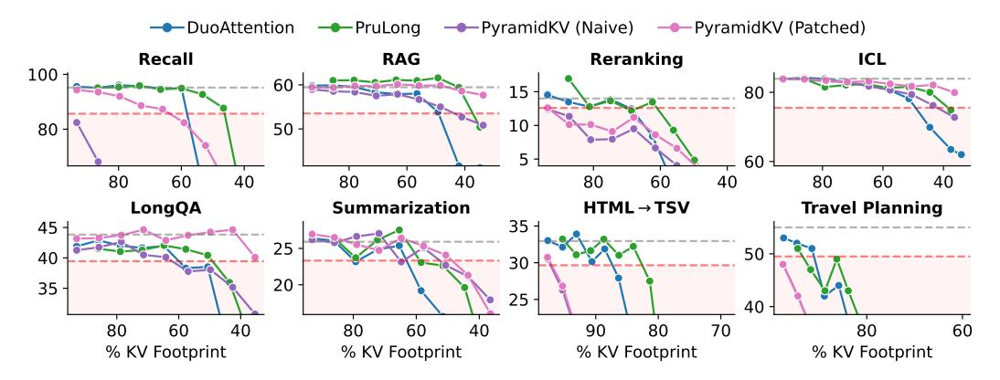
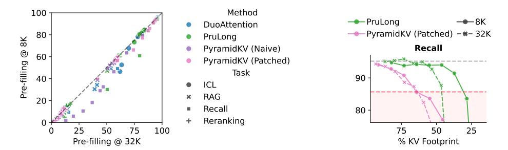
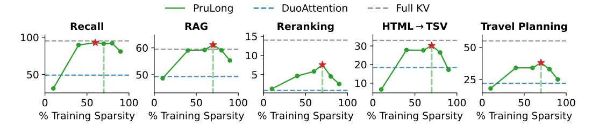
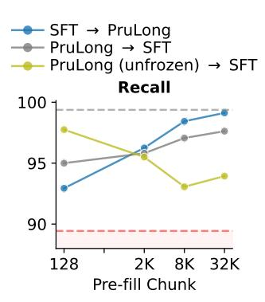
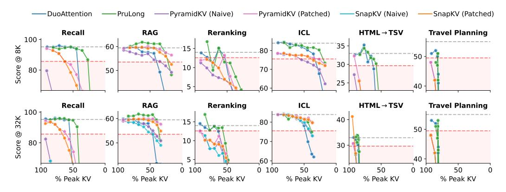

# 4 PruLong: An End-to-End Approach for Specializing Attention Heads

We discussed in Section [2.2](#page-3-0) how evicting "stale" KVs may substantially reduce the KV footprint, but risks losing important past information. This has motivated follow-up work to understand *which* attention heads focus on global vs. local context, and only evict KVs in local attention heads.

DuoAttention [\[Xiao et al.,](#page-13-1) [2025\]](#page-13-1) categorizes attention heads into two types: *retrieval heads*, which recall relevant information from the entire context and *streaming heads* [\[Xiao et al.,](#page-13-6) [2024\]](#page-13-6), which only attend to recent tokens and a small set of "sink" tokens at the beginning of the input sequence. DuoAttention learns the attention head type by expressing the attention mechanism as a superposition of streaming and full attention, parametrized by

$$Attn_{i,j}(\mathbf{Q}, \mathbf{K}, \mathbf{V}) = z_{i,j} \cdot Attn_{full}(\mathbf{Q}, \mathbf{K}, \mathbf{V}) + (1 - z_{i,j}) \cdot Attn_{streaming}(\mathbf{Q}, \mathbf{K}, \mathbf{V})$$
(1)

where i and j run over the L layers and H attention heads of the transformer, respectively. The masks zi,j are trained with an L2 reconstruction loss between the final hidden states of the original and interpolated models, and the masks z are encouraged to be sparse via L1 regularization. DuoAttention uses long-context training data which consists of synthetic needle-in-a-haystack tasks. Upon convergence, a head sparsity of s% is obtained by setting the bottom s% of zi,j to 0 and the rest to 1. MoA [\[Fu et al.,](#page-10-2) [2024\]](#page-10-2) is another method that uses natural text, but is difficult to scale beyond sequences longer than 8K tokens, as it materializes the full attention matrix.

While DuoAttention shows strong empirical performance, we identify several ways to push its critical KV footprint even lower. We combine these insights to design PruLong, an end-to-end method for KV eviction. PruLong classifies attention heads into one of the two roles like Duo, but innovates upon the training objective, parametrization, and training data. We now describe each in turn.

- 1. Next-token prediction loss. PruLong directly minimizes the next-token prediction loss of the hybrid attention model, rather than the reconstruction error of the last hidden state, aligning better with how these models are used in text generations.
- 2. Optimizing discrete masks over attention types. DuoAttention learns a continuous gating variable zi,j ∈ [0, 1], which is easy to optimize, but does not reflect that zi,j will be rounded to 0 or 1 during inference, therefore introducing a train-test gap. PruLong treats zi,j as binary masks drawn from a Bernoulli distribution parameterized by πi,j , and enable end-to-end optimization via established approaches from the pruning literature [\[Louizos et al.,](#page-12-7) [2018\]](#page-12-7)—reparameterizing Bernoulli distributions as *hard concrete* random variables. The final objective is as follows:

$$\max_{\lambda_{1},\lambda_{2}} \min_{\boldsymbol{\pi}} \underbrace{\mathbb{E}}_{\mathbf{z} \sim \operatorname{Bern}(\boldsymbol{\pi})} \underbrace{\left[\frac{1}{N} \sum_{n=0}^{N-1} \log p_{\theta}(\mathbf{x}_{n+1} | \mathbf{x}_{:n}; \mathbf{z})\right]}_{\mathcal{L}_{\operatorname{next-token}}} + \underbrace{\lambda_{1} \left(s(\boldsymbol{\pi}) - t\right) + \lambda_{2} \left(s(\boldsymbol{\pi}) - t\right)^{2}}_{\mathcal{L}_{\operatorname{reg}}}, \quad (2)$$

where Lreg constraints the overall sparsity of the masks s(π) towards a target value t. This is enabled via min-max optimization, where λ1 and λ2 are trainable Lagrange parameters optimized via gradient *ascent*. We provide more details in Appendix [B.](#page-15-1)

3. PruLong leverages natural long-context data. DuoAttention's synthetic training data only requires simple long-range recall, whereas real-world application may demand more complex abilities. PruLong is trained on natural long-context pre-training data (such as code repositories and books) by [Gao et al.](#page-10-8) [\[2025\]](#page-10-8), containing diverse long-range dependencies.

### 5 Experiments

#### 5.1 Evaluation Setting

Diverse and challenging tasks. Our evaluation consists of tasks from HELMET [\[Yen et al.,](#page-13-2) [2025\]](#page-13-2) (long inputs → short outputs) and LongProc [\[Ye et al.,](#page-13-3) [2025\]](#page-13-3) (short/long inputs → long outputs) on which Llama-3.1-8B-Instruct (the model we use for evaluation) achieves non-trivial performance. We evaluate the HELMET tasks at the 128K context setting to stress-test KV reduction methods with information-rich contexts. Overall, we evaluate on 21 datasets report average performance across 8 task categories, which cover various long-context applications (RAG, reranking, summarization) and capabilities (recall, reasoning—in travel planning, ignoring distractions—in RAG, and in-context learning). HELMET also covers recall tasks sourced from RULER [\[Hsieh et al.,](#page-10-9) [2024\]](#page-10-9), as well as QA and summarization tasks from ∞ Bench [\[Zhang et al.,](#page-14-3) [2024\]](#page-14-3). A detailed description of the task setup, datasets, and input and output lengths is provided in Appendix [C.](#page-16-0)

Table 2: The minimum effective KV footprint for various methods on HELMET and LongProc. Due to the high cost of running the evaluation, we interpolate this metric by linear interpolation of the data points in [Figure 3.](#page-6-0)

| Method                |        |       |         |       | Critical KV footprint (%) ↓ |      |      |        |
|-----------------------|--------|-------|---------|-------|-----------------------------|------|------|--------|
|                       | Recall | RAG   | Re-Rank | ICL   | LongQA                      | Summ | HTML | Travel |
| DuoAttention          | 58.0   | 49.0  | 69.0    | 49.0  | 60.0                        | 63.0 | 87.0 | 91.0   |
| → PruLong             | 46.0   | 37.0  | 61.0    | 38.0  | 49.0                        | 59.0 | 83.0 | 93.0   |
| PyramidKV (Naive)     | >93.0  | 44.0  | >94.0   | 42.0  | 62.0                        | 53.0 | 97.0 | >98.0  |
| → PyramidKV (Patched) | 64.0   | <34.0 | 94.0    | <36.0 | <35.0                       | 49.0 | 97.0 | >98.0  |

Figure 3: Performance vs. KV footprint for the baselines and PruLong (green). The gray dashed line denotes the original model's performance, and the red one represents 90% of model performance.

Methods and hyperparameters. We use Llama-3.1-8B-Instruct [\[Dubey et al.,](#page-10-0) [2024\]](#page-10-0) as a capable long-context language model. To obtain a wide range of KV footprints, we evaluate each method with a grid of hyperparameters. We run DuoAttention and PruLong with head sparsities ranging from 10% to 90%, but fix the local window size to be 1024 tokens and use 128 attention sink tokens—this has a comparatively small impact on the KV footprint given the long context lengths of our evaluation tasks. We were not able to run MoA [\[Fu et al.,](#page-10-2) [2024\]](#page-10-2) since its training method did not scale to sequences longer than 8K tokens. For chunked eviction, our primary focus is PyramidKV [\[Cai et al.,](#page-9-1) [2024\]](#page-9-1), as it performs slightly better than SnapKV [\[Li et al.,](#page-11-0) [2024\]](#page-11-0) (see comparison in [Appendix E\)](#page-17-0), and far better than key magnitude-based eviction by [\[Devoto et al.,](#page-9-7) [2024\]](#page-9-7) in our setting. We use the recommended setting of using the last 64 input tokens to compute KV importance, and evict p% of input KVs at each pre-filling step, where p% also ranges from 10% to 90%. Unless otherwise noted, we evaluate methods with a pre-filling chunk size of 32K.

#### 5.2 How many KVs Are Needed for Long-Context Abilities?

[Figure 3](#page-6-0) visualizes the efficacy of the methods with varying KV footprint. [Table 2](#page-6-1) summarizes the critical KV footprint, i.e., the smallest value for which task performance remains within 90% of the performance with a full KV cache. We report results with other metrics of KV usage in [Appendix C.](#page-16-0)

PruLong reliably reduces KV footprint for recall tasks. Recall is a good stress-test of longcontext modeling ability, as it directly evaluates the ability to pick out relevant information from long ago, without confounding factors like the model's ability to reason about the retrieved information. We see that DuoAttention and PruLong excel on this task in comparison to more heuristic eviction methods. In particular, PruLong reduces the critical KV footprint by roughly 12 points compared to its predecessor. PruLong also exhibits the lowest critical footprint on re-ranking, reordering retrieved passages from MS MARCO [\[Bajaj et al.,](#page-9-8) [2016\]](#page-9-8), and HTML → TSV, a structured prediction task, and improves upon DuoAttention on all tasks except Travel Planning. Even though patched PyramidKV achieves substantially lower critical KV footprints on LongQA and ICL, it is not clear whether this

Figure 4: Left: Pre-filling with a smaller chunk size (8K tokens vs. 32K tokens) tends to deteriorate performance on the same task. The axes track the performance on the four tasks at the specified pre-fill length. Right: Pre-filling with smaller chunks (8K tokens) achieves smaller KV footprints and lies on the pareto frontier, particularly when aiming for high KV reduction.

Table 3: We explore different training settings for the DuoAttention/PruLong methods. We report task performance at a fixed sparsity of 70% streaming heads, where the color corresponds to retaining 90% of the base performance. The gray shading indicates the default setting of each method.

|                                       | Recall | RAG  | Rerank | ICL  | HTML | Travel |
|---------------------------------------|--------|------|--------|------|------|--------|
| Llama-3.1-8B-Instruct                 | 95.2   | 59.5 | 14.0   | 83.9 | 32.9 | 55.0   |
| DuoAttention                          |        |      |        |      |      |        |
| <ul> <li>BookSum Passkey</li> </ul>   | 49.2   | 49.3 | 0.9    | 78.2 | 18.3 | 22.0   |
| <ul> <li>Pre-training Mix</li> </ul>  | 38.6   | 51.9 | 2.1    | 77.4 | 17.0 | 43.0   |
| (+ 4x steps)                          | 39.3   | 46.2 | 0.8    | 73.6 | 17.0 | 45.0   |
| PruLong                               |        |      |        |      |      |        |
| <ul><li>Pre-training Mix</li></ul>    | 91.4   | 61.1 | 7.6    | 81.6 | 30.2 | 38.0   |
| <ul> <li>BookSum Passkey</li> </ul>   | 65.2   | 55.3 | 1.8    | 80.8 | 16.9 | 23.0   |
| <ul> <li>Context Synthesis</li> </ul> | 21.6   | 46.2 | 0.9    | 71.2 | 3.4  | 17.0   |

would be truly reliable in practice given its recall performance. The difference between the two methods is especially pronounced when targeting low KV footprints.

**Patching is important for chunked eviction.** Chunked eviction allows PyramidKV to reduce KV footprints meaningfully; with a single pre-fill the minimum KV footprint if bounded by 0.1-5% depending on the task as reported in Appendix E. In Figure 3, we observe that patching is important for retaining reliable performance in tasks—allowing PyramidKV to come out as the best method on ICL, RAG, LongQA, and Summarization. While PyramidKV still lags behind Duo on recall tasks, patching reduces the critical KV footprint by 30% compared to naive eviction.

Sensitivity to pre-fill chunk size. We observe in Figure 4, that suprisingly, both DuoAttention and PruLong are more susceptible to performance loss (up to 20%) when reducing the chunk size from 32K to 8K than patched chunked eviction. However, smaller chunk sizes dominate the Pareto frontier as they evict KVs more frequently. In terms of reliability, we also note that no method achieves any meaningful reduction in KV footprint on the reasoning-heavy Travel Planning task.

#### 5.3 Explaining the Strength of PruLong

We investigates which factors explain the superior performance of PruLong compared to DuoAttention. Here, we evaluate both methods at a fixed KV footprint corresponding to a 70% of attention heads used as streaming heads and 8K chunked pre-filling.

1. **PruLong works better with natural long data.** DuoAttention creates passkey retrieval data to learn the streaming heads. To capture more diverse long-context operations, we perform language modeling on broad long-context pre-training data sourced from Gao et al. [2025]. In Table 3, we show that unlike our method, DuoAttention does not learn well with noisy pre-training data, even when increasing the training budget by 4 times. We also confirm that our method favors pre-training data over Context Synthesis—a well-performing long-context

Figure 5: We investigate how masks trained with different sparsities perform when evaluated at 70% sparsity. Regularization with target sparsity leads to better performance across the board, although PruLong outperforms DuoAttention at other sparsities as well.

instruction tuning dataset [\[Zhu et al.,](#page-14-4) [2025\]](#page-14-4). Note that we don't update regular model weights during training, as this would degrade the instruction-following abilities of the model.

2. Precise regularization. Our objective allows us to train a model against a specific target sparsity used for evaluation. Figure [5](#page-8-0) reveals the outcome of evaluating models trained with different target sparsities at a 70% sparsity. We note that the correctly regularized model (green dashed line) achieves the highest performance (red marker) in many diverse task categories.

#### 5.4 At What Training Stage Should We Use PruLong?

Instead of applying PruLong to the final instruction-tuned model, one could learn the attention head types for the long-context base model and keep them fixed during the instruction tuning stage.

Since the supervised fine-tuning (SFT) data of Llama-3.1-8B-Instruct is not public, we use ProLong-8B [\[Gao et al.,](#page-10-8) [2025\]](#page-10-8) based on Llama-3-8B but with known long-context data and SFT recipe—we provide details in [Appendix D.](#page-17-1) We run experiments to compare whether PruLong should be applied before or after SFT. Since both the training data and the language modeling objective matches the training of the ProLong base model, we explore unfreezing the weights during the PruLong training process. In [Figure 6,](#page-8-1) we observe an interesting trend where updating the weights of the model leads to the best Recall at a chunk pre-filling size of 128 tokens—corresponding to the sliding window block size during training—but deteriorates at greater chunk sizes. We hypothesize that updating the model weights allows the model to specialize to a fixed attention window during training. However, this makes it sensitive to the distribution shift when changing the attention window via the pre-filling chunk size during inference.

Figure 6: PruLong applied to different training stages. Evaluated at a context length of 128K.

### 6 Conclusions and Future Work

In this paper, we presented a unified view of various KV-cache sparsification techniques through the lens of a unifying metric: the *critical KV footprint*. We then studied how we might achieve a lower footprint using two promising classes of KV eviction: post-fill eviction and recency eviction. We adapted post-fill eviction methods to evict KVs during intermediate stages of pre-filling via *chunked eviction*. In the recency eviction class, we proposed a new KV eviction method that uses structured sparsity: *PruLong*. PruLong optimizes the next token prediction loss while leveraging tools from the pruning literature to learn attention head roles from unlabeled text, allowing it to integrate natively with model training. In empirical evaluation, we found that recency eviction generally achieved a lower critical footprint than post-fill eviction. PruLong achieved a 10 − 15% reduction in the critical KV footprint over the next best method in 3 out of 6 tasks. An ablation study of PruLong revealed that it was effective both before and after instruction tuning. We hope that our results inspire future work to take a holistic view of the KV-eviction problem and tackle it natively during model training. Limitations and future work. Several promising directions for future work exist. For one, rather than evict all but a fixed local window of tokens, one may apply pruning methods to make flexible decisions depending on the context. None of the methods achieve strong results across all tasks; future work should make KV eviction methods robust to wider applications. Since the KV footprint assumes an idealized model, it may not correlate perfectly with throughput or other hardware metrics; future work may look into designing metrics that holistically capture the generation process. Finally, due to computational constraints, our experiments only focus on a single model.

### Acknowledgements

We are thankful to Howard Yen and Xi Ye for their feedback on an earlier draft of the paper. We would also like to thank the Princeton NLP group for helpful discussions and advice. This work is gratefully supported by an NSF CAREER award (IIS-2239290) and a grant from Intel.

### References

- Amey Agrawal, Ashish Panwar, Jayashree Mohan, Nipun Kwatra, Bhargav S. Gulavani, and Ramachandran Ramjee. SARATHI: Efficient LLM inference by piggybacking decodes with chunked prefills. *arXiv preprint arXiv:2308.16369*, 2023. URL <https://arxiv.org/abs/2308.16369>. Submitted on 31 Aug 2023.
- Joshua Ainslie, James Lee-Thorp, Michiel de Jong, Yury Zemlyanskiy, Federico Lebron, and Sumit Sanghai. GQA: Training generalized multi-query transformer models from multi-head checkpoints. In Houda Bouamor, Juan Pino, and Kalika Bali, editors, *Proceedings of the 2023 Conference on Empirical Methods in Natural Language Processing*, pages 4895–4901, Singapore, December 2023. Association for Computational Linguistics. doi: 10.18653/v1/2023.emnlp-main.298. URL <https://aclanthology.org/2023.emnlp-main.298/>.
- Yash Akhauri, Ahmed F AbouElhamayed, Yifei Gao, Chi-Chih Chang, Nilesh Jain, and Mohamed S. Abdelfattah. TokenButler: Token importance is predictable, 2025. URL [https://arxiv.org/](https://arxiv.org/abs/2503.07518) [abs/2503.07518](https://arxiv.org/abs/2503.07518).
- Payal Bajaj, Daniel Campos, Nick Craswell, Li Deng, Jianfeng Gao, Xiaodong Liu, Rangan Majumder, Andrew McNamara, Bhaskar Mitra, Tri Nguyen, et al. Ms marco: A human generated machine reading comprehension dataset. *arXiv preprint arXiv:1611.09268*, 2016.
- Zefan Cai, Yichi Zhang, Bofei Gao, Yuliang Liu, Tianyu Liu, Keming Lu, Wayne Xiong, Yue Dong, Baobao Chang, Junjie Hu, and Wen Xiao. PyramidKV: Dynamic KV cache compression based on pyramidal information funneling, 2024. URL <https://arxiv.org/abs/2406.02069>.
- Iñigo Casanueva, Tadas Temcinas, Daniela Gerz, Matthew Henderson, and Ivan Vuli ˇ c. Efficient ´ intent detection with dual sentence encoders. In *Proceedings of the 2nd Workshop on Natural Language Processing for Conversational AI*, pages 38–45, 2020.
- Yilong Chen, Guoxia Wang, Junyuan Shang, Shiyao Cui, Zhenyu Zhang, Tingwen Liu, Shuohuan Wang, Yu Sun, Dianhai Yu, and Hua Wu. NACL: A general and effective KV cache eviction framework for LLM at inference time. In Lun-Wei Ku, Andre Martins, and Vivek Srikumar, editors, *Proceedings of the 62nd Annual Meeting of the Association for Computational Linguistics (Volume 1: Long Papers)*, pages 7913–7926, Bangkok, Thailand, August 2024. Association for Computational Linguistics. doi: 10.18653/v1/2024.acl-long.428. URL [https://aclanthology](https://aclanthology.org/2024.acl-long.428/) [.org/2024.acl-long.428/](https://aclanthology.org/2024.acl-long.428/).
- DeepSeek-AI. DeepSeek-V2: A strong, economical, and efficient mixture-of-experts language model, 2024. URL <https://arxiv.org/abs/2405.04434>.
- DeepSeekAI. DeepSeek-R1: Incentivizing reasoning capability in llms via reinforcement learning, 2025. URL <https://arxiv.org/abs/2501.12948>.
- Alessio Devoto, Yu Zhao, Simone Scardapane, and Pasquale Minervini. A simple and effective l\_2 norm-based strategy for KV cache compression. In Yaser Al-Onaizan, Mohit Bansal, and Yun-Nung Chen, editors, *Proceedings of the 2024 Conference on Empirical Methods in Natural*

- *Language Processing*, pages 18476–18499, Miami, Florida, USA, November 2024. Association for Computational Linguistics. doi: 10.18653/v1/2024.emnlp-main.1027. URL [https:](https://aclanthology.org/2024.emnlp-main.1027/) [//aclanthology.org/2024.emnlp-main.1027/](https://aclanthology.org/2024.emnlp-main.1027/).
- Ning Ding, Yulin Chen, Bokai Xu, Yujia Qin, Shengding Hu, Zhiyuan Liu, Maosong Sun, and Bowen Zhou. Enhancing chat language models by scaling high-quality instructional conversations. In Houda Bouamor, Juan Pino, and Kalika Bali, editors, *Proceedings of the 2023 Conference on Empirical Methods in Natural Language Processing*, pages 3029–3051, Singapore, December 2023. Association for Computational Linguistics.
- Abhimanyu Dubey, Abhinav Jauhri, Abhinav Pandey, Abhishek Kadian, Ahmad Al-Dahle, Aiesha Letman, Akhil Mathur, Alan Schelten, Amy Yang, Angela Fan, et al. The Llama 3 herd of models. *arXiv preprint arXiv:2407.21783*, 2024.
- Elias Frantar, Saleh Ashkboos, Torsten Hoefler, and Dan Alistarh. GPTQ: Accurate post-training quantization for generative pre-trained transformers. In *International Conference on Learning Representations (ICLR) 2023 Poster*, 2023. URL [https://openreview.net/forum?id=tcbB](https://openreview.net/forum?id=tcbBPnfwxS) [PnfwxS](https://openreview.net/forum?id=tcbBPnfwxS).
- Tianyu Fu, Haofeng Huang, Xuefei Ning, Genghan Zhang, Boju Chen, Tianqi Wu, Hongyi Wang, Zixiao Huang, Shiyao Li, Shengen Yan, Guohao Dai, Huazhong Yang, and Yu Wang. MoA: Mixture of sparse attention for automatic large language model compression, 2024. URL [https:](https://arxiv.org/abs/2406.14909) [//arxiv.org/abs/2406.14909](https://arxiv.org/abs/2406.14909).
- Tianyu Gao, Alexander Wettig, Howard Yen, and Danqi Chen. How to train long-context language models (effectively), 2025. URL <https://arxiv.org/abs/2410.02660>.
- Suyu Ge, Yunan Zhang, Liyuan Liu, Minjia Zhang, Jiawei Han, and Jianfeng Gao. Model tells you what to discard: Adaptive KV cache compression for LLMs. In *The Twelfth International Conference on Learning Representations*, 2024. URL [https://openreview.net/forum?id=](https://openreview.net/forum?id=uNrFpDPMyo) [uNrFpDPMyo](https://openreview.net/forum?id=uNrFpDPMyo).
- Albert Gu and Tri Dao. Mamba: Linear-time sequence modeling with selective state spaces. In *First Conference on Language Modeling*, 2024.
- Albert Gu, Karan Goel, and Christopher Re. Efficiently modeling long sequences with structured state spaces. In *International Conference on Learning Representations*, 2022.
- Cheng-Ping Hsieh, Simeng Sun, Samuel Kriman, Shantanu Acharya, Dima Rekesh, Fei Jia, and Boris Ginsburg. RULER: What's the real context size of your long-context language models? In *First Conference on Language Modeling*, 2024.
- Yuxiang Huang, Binhang Yuan, Xu Han, Chaojun Xiao, and Zhiyuan Liu. Locret: Enhancing eviction in long-context llm inference with trained retaining heads on consumer-grade devices, 2025. URL <https://arxiv.org/abs/2410.01805>.
- Eric Jang, Shixiang Gu, and Ben Poole. Categorical reparameterization with gumbel-softmax. In *International Conference on Learning Representations*, 2017. URL [https://openreview.net](https://openreview.net/forum?id=rkE3y85ee) [/forum?id=rkE3y85ee](https://openreview.net/forum?id=rkE3y85ee).
- Huiqiang Jiang, Yucheng Li, Chengruidong Zhang, Qianhui Wu, Xufang Luo, Surin Ahn, Zhenhua Han, Amir H. Abdi, Dongsheng Li, Chin-Yew Lin, Yuqing Yang, and Lili Qiu. MInference 1.0: Accelerating pre-filling for long-context LLMs via dynamic sparse attention. In *Proceedings of the 38th Conference on Neural Information Processing Systems (NeurIPS 2024)*, 2024.
- Mandar Joshi, Eunsol Choi, Daniel Weld, and Luke Zettlemoyer. TriviaQA: A large scale distantly supervised challenge dataset for reading comprehension. In Regina Barzilay and Min-Yen Kan, editors, *Proceedings of the 55th Annual Meeting of the Association for Computational Linguistics (Volume 1: Long Papers)*, pages 1601–1611, Vancouver, Canada, July 2017. Association for Computational Linguistics.

- Angelos Katharopoulos, Apoorv Vyas, Nikolaos Pappas, and François Fleuret. Transformers are RNNs: Fast autoregressive transformers with linear attention. In Hal Daumé III and Aarti Singh, editors, *Proceedings of the 37th International Conference on Machine Learning*, volume 119 of *Proceedings of Machine Learning Research*, pages 5156–5165. PMLR, 13–18 Jul 2020. URL <https://proceedings.mlr.press/v119/katharopoulos20a.html>.
- Tomáš Kociský, Jonathan Schwarz, Phil Blunsom, Chris Dyer, Karl Moritz Hermann, Gábor Melis, ˇ and Edward Grefenstette. The NarrativeQA reading comprehension challenge. *Transactions of the Association for Computational Linguistics*, 6:317–328, 2018.
- Tom Kwiatkowski, Jennimaria Palomaki, Olivia Redfield, Michael Collins, Ankur Parikh, Chris Alberti, Danielle Epstein, Illia Polosukhin, Jacob Devlin, Kenton Lee, Kristina Toutanova, Llion Jones, Matthew Kelcey, Ming-Wei Chang, Andrew M. Dai, Jakob Uszkoreit, Quoc Le, and Slav Petrov. Natural questions: A benchmark for question answering research. *Transactions of the Association for Computational Linguistics*, 7:452–466, 2019.
- Nathan Lambert, Jacob Morrison, Valentina Pyatkin, Shengyi Huang, Hamish Ivison, Faeze Brahman, Lester James V. Miranda, Alisa Liu, Nouha Dziri, Shane Lyu, Yuling Gu, Saumya Malik, Victoria Graf, Jena D. Hwang, Jiangjiang Yang, Ronan Le Bras, Oyvind Tafjord, Chris Wilhelm, Luca Soldaini, Noah A. Smith, Yizhong Wang, Pradeep Dasigi, and Hannaneh Hajishirzi. Tulu 3: Pushing frontiers in open language model post-training, 2025. URL [https://arxiv.org/abs/](https://arxiv.org/abs/2411.15124) [2411.15124](https://arxiv.org/abs/2411.15124).
- Stefan Larson, Anish Mahendran, Joseph J. Peper, Christopher Clarke, Andrew Lee, Parker Hill, Jonathan K. Kummerfeld, Kevin Leach, Michael A. Laurenzano, Lingjia Tang, and Jason Mars. An evaluation dataset for intent classification and out-of-scope prediction. In *Proceedings of the 2019 Conference on Empirical Methods in Natural Language Processing and the 9th International Joint Conference on Natural Language Processing (EMNLP-IJCNLP)*, pages 1311–1316, 2019.
- Yaniv Leviathan, Matan Kalman, and Yossi Matias. Fast inference from transformers via speculative decoding. *arXiv preprint arXiv:2211.17192*, 2022. doi: 10.48550/arXiv.2211.17192. URL <https://arxiv.org/abs/2211.17192>. ICML 2023 Oral.
- Xin Li and Dan Roth. Learning question classifiers. In *COLING 2002: The 19th International Conference on Computational Linguistics*, 2002. URL [https://aclanthology.org/C02-115](https://aclanthology.org/C02-1150/) [0/](https://aclanthology.org/C02-1150/).
- Yucheng Li, Huiqiang Jiang, Qianhui Wu, Xufang Luo, Surin Ahn, Chengruidong Zhang, Amir H. Abdi, Dongsheng Li, Jianfeng Gao, Yuqing Yang, and Lili Qiu. SCBench: A KV cache-centric analysis of long-context methods. In *The Thirteenth International Conference on Learning Representations*, 2025. URL <https://openreview.net/forum?id=gkUyYcY1W9>.
- Yuhong Li, Yingbing Huang, Bowen Yang, Bharat Venkitesh, Acyr Locatelli, Hanchen Ye, Tianle Cai, Patrick Lewis, and Deming Chen. SnapKV: LLM knows what you are looking for before generation. In *The Thirty-eighth Annual Conference on Neural Information Processing Systems*, 2024. URL <https://openreview.net/forum?id=poE54GOq2l>.
- Ji Lin, Jiaming Tang, Haotian Tang, Shang Yang, Wei-Ming Chen, Wei-Chen Wang, Guangxuan Xiao, Xingyu Dang, Chuang Gan, and Song Han. AWQ: Activation-aware weight quantization for LLM compression and acceleration. In *MLSys*, 2024.
- Aixin Liu, Bei Feng, Bin Wang, Bingxuan Wang, Bo Liu, Chenggang Zhao, Chengqi Dengr, Chong Ruan, Damai Dai, Daya Guo, et al. Deepseek-v2: A strong, economical, and efficient mixture-ofexperts language model. *arXiv preprint arXiv:2405.04434*, 2024a.
- Nelson F. Liu, Kevin Lin, John Hewitt, Ashwin Paranjape, Michele Bevilacqua, Fabio Petroni, and Percy Liang. Lost in the Middle: How Language Models Use Long Contexts. *Transactions of the Association for Computational Linguistics*, 12:157–173, 02 2024b.
- Xingkun Liu, Arash Eshghi, Pawel Swietojanski, and Verena Rieser. Benchmarking natural language understanding services for building conversational agents. In *Increasing naturalness and flexibility in spoken dialogue interaction: 10th international workshop on spoken dialogue systems*, pages 165–183. Springer, 2021.

- Christos Louizos, Max Welling, and Diederik P. Kingma. Learning sparse neural networks through L0 regularization. In *International Conference on Learning Representations*, 2018. URL [https:](https://openreview.net/forum?id=H1Y8hhg0b) [//openreview.net/forum?id=H1Y8hhg0b](https://openreview.net/forum?id=H1Y8hhg0b).
- Enzhe Lu, Zhejun Jiang, Jingyuan Liu, Yulun Du, Tao Jiang, Chao Hong, Shaowei Liu, Weiran He, Enming Yuan, Yuzhi Wang, Zhiqi Huang, Huan Yuan, Suting Xu, Xinran Xu, Guokun Lai, Yanru Chen, Huabin Zheng, Junjie Yan, Jianlin Su, Yuxin Wu, Neo Y. Zhang, Zhilin Yang, Xinyu Zhou, Mingxing Zhang, and Jiezhong Qiu. MoBA: Mixture of block attention for long-context llms, 2025. URL <https://arxiv.org/abs/2502.13189>.
- Chris J. Maddison, Andriy Mnih, and Yee Whye Teh. The concrete distribution: A continuous relaxation of discrete random variables. In *International Conference on Learning Representations*, 2017. URL <https://openreview.net/forum?id=S1jE5L5gl>.
- Alex Mallen, Akari Asai, Victor Zhong, Rajarshi Das, Daniel Khashabi, and Hannaneh Hajishirzi. When not to trust language models: Investigating effectiveness of parametric and non-parametric memories. In Anna Rogers, Jordan Boyd-Graber, and Naoaki Okazaki, editors, *Association for Computational Linguistics (ACL)*, pages 9802–9822, Toronto, Canada, July 2023. Association for Computational Linguistics.
- Bo Peng, Eric Alcaide, Quentin Anthony, Alon Albalak, Samuel Arcadinho, Stella Biderman, Huanqi Cao, Xin Cheng, Michael Chung, Leon Derczynski, Xingjian Du, Matteo Grella, Kranthi Gv, Xuzheng He, Haowen Hou, Przemyslaw Kazienko, Jan Kocon, Jiaming Kong, Bartłomiej Koptyra, Hayden Lau, Jiaju Lin, Krishna Sri Ipsit Mantri, Ferdinand Mom, Atsushi Saito, Guangyu Song, Xiangru Tang, Johan Wind, Stanisław Wo´zniak, Zhenyuan Zhang, Qinghua Zhou, Jian Zhu, and Rui-Jie Zhu. RWKV: Reinventing RNNs for the transformer era. In Houda Bouamor, Juan Pino, and Kalika Bali, editors, *Findings of the Association for Computational Linguistics: EMNLP 2023*, pages 14048–14077, Singapore, December 2023. Association for Computational Linguistics. doi: 10.18653/v1/2023.findings-emnlp.936. URL [https://aclanthology.org/2023.findings](https://aclanthology.org/2023.findings-emnlp.936/) [-emnlp.936/](https://aclanthology.org/2023.findings-emnlp.936/).
- Michael Poli, Stefano Massaroli, Eric Nguyen, Daniel Y Fu, Tri Dao, Stephen Baccus, Yoshua Bengio, Stefano Ermon, and Christopher Re. Hyena hierarchy: Towards larger convolutional language models. In Andreas Krause, Emma Brunskill, Kyunghyun Cho, Barbara Engelhardt, Sivan Sabato, and Jonathan Scarlett, editors, *Proceedings of the 40th International Conference on Machine Learning*, volume 202 of *Proceedings of Machine Learning Research*, pages 28043–28078. PMLR, 23–29 Jul 2023. URL <https://proceedings.mlr.press/v202/poli23a.html>.
- Aurick Qiao, Zhewei Yao, Samyam Rajbhandari, and Yuxiong He. SwiftKV: Fast prefill-optimized inference with knowledge-preserving model transformation, 2024. URL [https://arxiv.org/](https://arxiv.org/abs/2410.03960) [abs/2410.03960](https://arxiv.org/abs/2410.03960).
- Shashank Rajput, Ying Sheng, Sean Owen, and Vitaliy Chiley. Inference-friendly models with MixAttention. In Mehdi Rezagholizadeh, Peyman Passban, Soheila Samiee, Vahid Partovi Nia, Yu Cheng, Yue Deng, Qun Liu, and Boxing Chen, editors, *Proceedings of The 4th NeurIPS Efficient Natural Language and Speech Processing Workshop*, volume 262 of *Proceedings of Machine Learning Research*, pages 370–381. PMLR, 14 Dec 2024. URL [https://proceedings.mlr.](https://proceedings.mlr.press/v262/rajput24a.html) [press/v262/rajput24a.html](https://proceedings.mlr.press/v262/rajput24a.html).
- Ranajoy Sadhukhan, Jian Chen, Zhuoming Chen, Vashisth Tiwari, Ruihang Lai, Jinyuan Shi, Ian En-Hsu Yen, Avner May, Tianqi Chen, and Beidi Chen. Magicdec: Breaking the latency-throughput tradeoff for long context generation with speculative decoding. In *The Thirteenth International Conference on Learning Representations*, 2025. URL [https://openreview.net/forum?id=](https://openreview.net/forum?id=CS2JWaziYr) [CS2JWaziYr](https://openreview.net/forum?id=CS2JWaziYr).
- Zejiang Shen, Kyle Lo, Lauren Yu, Nathan Dahlberg, Margo Schlanger, and Doug Downey. Multilexsum: Real-world summaries of civil rights lawsuits at multiple granularities. In *Advances in Neural Information Processing Systems*, volume 35, pages 13158–13173. Curran Associates, Inc., 2022.
- Yutao Sun, Li Dong, Shaohan Huang, Shuming Ma, Yuqing Xia, Jilong Xue, Jianyong Wang, and Furu Wei. Retentive network: A successor to transformer for large language models. *arXiv preprint arXiv:2307.08621*, 2023.

- Yutao Sun, Li Dong, Yi Zhu, Shaohan Huang, Wenhui Wang, Shuming Ma, Quanlu Zhang, Jianyong Wang, and Furu Wei. You only cache once: Decoder-decoder architectures for language models. *arXiv preprint arXiv:2405.05254*, 2024.
- Jiaming Tang, Yilong Zhao, Kan Zhu, Guangxuan Xiao, Baris Kasikci, and Song Han. QUEST: Query-Aware Sparsity for Efficient Long-Context LLM Inference. In *Proceedings of the International Conference on Machine Learning (ICML)*, 2024.
- Gemma Team. Gemma 3 technical report, 2025. URL <https://arxiv.org/abs/2503.19786>.
- Ashish Vaswani, Noam Shazeer, Niki Parmar, Jakob Uszkoreit, Llion Jones, Aidan N Gomez, Łukasz Kaiser, and Illia Polosukhin. Attention is all you need. *Advances in Neural Information Processing Systems (NIPS)*, 30, 2017. URL [https://papers.nips.cc/paper/2017/hash/3f5ee2435](https://papers.nips.cc/paper/2017/hash/3f5ee243547dee91fbd053c1c4a845aa-Abstract.html) [47dee91fbd053c1c4a845aa-Abstract.html](https://papers.nips.cc/paper/2017/hash/3f5ee243547dee91fbd053c1c4a845aa-Abstract.html).
- Guangtao Wang, Shubhangi Upasani, Chen Wu, Darshan Gandhi, Jonathan Li, Changran Hu, Bo Li, and Urmish Thakker. Llms know what to drop: Self-attention guided kv cache eviction for efficient long-context inference, 2025. URL <https://arxiv.org/abs/2503.08879>.
- Junxiong Wang, Daniele Paliotta, Avner May, Alexander M Rush, and Tri Dao. The mamba in the llama: Distilling and accelerating hybrid models. In *Workshop on Efficient Systems for Foundation Models II @ ICML2024*, 2024. URL <https://openreview.net/forum?id=UBSOUBC8Fd>.
- Guangxuan Xiao, Ji Lin, Mickael Seznec, Hao Wu, Julien Demouth, and Song Han. SmoothQuant: Accurate and efficient post-training quantization for large language models. In Andreas Krause, Emma Brunskill, Kyunghyun Cho, Barbara Engelhardt, Sivan Sabato, and Jonathan Scarlett, editors, *Proceedings of the 40th International Conference on Machine Learning*, volume 202 of *Proceedings of Machine Learning Research*, pages 38087–38099. PMLR, 23–29 Jul 2023. URL <https://proceedings.mlr.press/v202/xiao23c.html>.
- Guangxuan Xiao, Yuandong Tian, Beidi Chen, Song Han, and Mike Lewis. Efficient streaming language models with attention sinks. In *The Twelfth International Conference on Learning Representations*, 2024.
- Guangxuan Xiao, Jiaming Tang, Jingwei Zuo, junxian guo, Shang Yang, Haotian Tang, Yao Fu, and Song Han. Duoattention: Efficient long-context LLM inference with retrieval and streaming heads. In *The Thirteenth International Conference on Learning Representations*, 2025. URL <https://openreview.net/forum?id=cFu7ze7xUm>.
- Guo-Hao Xu, Jingzhen Ding, Huping Ding, Zhao Xu, and Kaifu Zhang. FTP: Efficient prefilling for long-context LLM inference via FFN token pruning, 2025. URL [https://openreview.net/f](https://openreview.net/forum?id=fL8Zp8o6RL) [orum?id=fL8Zp8o6RL](https://openreview.net/forum?id=fL8Zp8o6RL).
- Zhilin Yang, Peng Qi, Saizheng Zhang, Yoshua Bengio, William Cohen, Ruslan Salakhutdinov, and Christopher D. Manning. HotpotQA: A dataset for diverse, explainable multi-hop question answering. In *Proceedings of the 2018 Conference on Empirical Methods in Natural Language Processing*, pages 2369–2380, 2018.
- Xi Ye, Fangcong Yin, Yinghui He, Joie Zhang, Howard Yen, Tianyu Gao, Greg Durrett, and Danqi Chen. Longproc: Benchmarking long-context language models on long procedural generation, 2025. URL <https://arxiv.org/abs/2501.05414>.
- Howard Yen, Tianyu Gao, Minmin Hou, Ke Ding, Daniel Fleischer, Peter Izsak, Moshe Wasserblat, and Danqi Chen. Helmet: How to evaluate long-context language models effectively and thoroughly. In *International Conference on Learning Representations (ICLR)*, 2025.
- Jingyang Yuan, Huazuo Gao, Damai Dai, Junyu Luo, Liang Zhao, Zhengyan Zhang, Zhenda Xie, Y. X. Wei, Lean Wang, Zhiping Xiao, Yuqing Wang, Chong Ruan, Ming Zhang, Wenfeng Liang, and Wangding Zeng. Native sparse attention: Hardware-aligned and natively trainable sparse attention, 2025. URL <https://arxiv.org/abs/2502.11089>.

- Xinrong Zhang, Yingfa Chen, Shengding Hu, Zihang Xu, Junhao Chen, Moo Hao, Xu Han, Zhen Thai, Shuo Wang, Zhiyuan Liu, and Maosong Sun. ∞Bench: Extending long context evaluation beyond 100K tokens. In *Proceedings of the 62nd Annual Meeting of the Association for Computational Linguistics (Volume 1: Long Papers)*, pages 15262–15277, 2024.
- Yifan Zhang, Yifeng Liu, Huizhuo Yuan, Zhen Qin, Yang Yuan, Quanquan Gu, and Andrew Chi-Chih Yao. Tensor product attention is all you need, 2025. URL [https://arxiv.org/abs/2501.064](https://arxiv.org/abs/2501.06425) [25](https://arxiv.org/abs/2501.06425).
- Zhenyu Zhang, Ying Sheng, Tianyi Zhou, Tianlong Chen, Lianmin Zheng, Ruisi Cai, Zhao Song, Yuandong Tian, Christopher Re, Clark Barrett, Zhangyang Wang, and Beidi Chen. H2O: Heavyhitter oracle for efficient generative inference of large language models. In *Thirty-seventh Conference on Neural Information Processing Systems*, 2023. URL [https://openreview.net/forum](https://openreview.net/forum?id=RkRrPp7GKO) [?id=RkRrPp7GKO](https://openreview.net/forum?id=RkRrPp7GKO).
- Huaixiu Steven Zheng, Swaroop Mishra, Hugh Zhang, Xinyun Chen, Minmin Chen, Azade Nova, Le Hou, Heng-Tze Cheng, Quoc V Le, Ed H Chi, et al. Natural plan: Benchmarking llms on natural language planning. *arXiv preprint arXiv:2406.04520*, 2024a.
- Lianmin Zheng, Liangsheng Yin, Zhiqiang Xie, Chuyue Sun, Jeff Huang, Cody Hao Yu, Shiyi Cao, Christos Kozyrakis, Ion Stoica, Joseph E. Gonzalez, Clark Barrett, and Ying Sheng. SGLang: Efficient execution of structured language model programs. In *The Thirty-eighth Annual Conference on Neural Information Processing Systems*, 2024b. URL [https://openreview.net/forum?i](https://openreview.net/forum?id=VqkAKQibpq) [d=VqkAKQibpq](https://openreview.net/forum?id=VqkAKQibpq).
- Wenhao Zhu, Pinzhen Chen, Hanxu Hu, Shujian Huang, Fei Yuan, Jiajun Chen, and Alexandra Birch. Generalizing from short to long: Effective data synthesis for long-context instruction tuning. *ArXiv*, abs/2502.15592, 2025.

### A Alternatives to KV footprint

In Section 2, we defined the KV footprint as the number of un-evicted (i.e., active or inactive) KV entries aggregated across the query dimension. Since we interpret the axis of time to run along the query dimension, the KV footprint is closely tied to the time aggregate of GPU memory utilization. One could also consider, then, the *peak KV*—which we define as the maximum number of un-evicted KV entries across all query indices (once again including inactive entries). This metric is similarly related to the peak GPU memory utilization of the KV cache. We normalize the peak KV to the sequence length and express the result as a percentage.

Figure 7: Performance vs. Peak KV for the baselines and PruLong. The gray dashed line denotes the original model's performance, and the red one represents 90% of model performance. We show results at both 8K and 32K prefilling chunk sizes.

We could then plot the score of the Llama-3.1-8B-Instruct model with different methods against the various peak KV values they achieve. We do this in Figure 7 for DuoAttention [Xiao et al., 2025], PruLong (ours), PyramidKV, and SnapKV. For the latter two, we include results both with the naive version and with the patched version described in Section 3. The results tell a story similar to Figure 3: on Recall, Rerank, HTML  $\rightarrow$  TSV, and Travel Planning, PruLong and DuoAttention usually achieve lower peak KV percentages than PyramidKV and SnapKV. In fact, PruLong's curves are strictly better than DuoAttention on all of the task groups. Between PyramidKV and SnapKV, the former usually achieves a better score at the same footprint. The addition of patching allows a further boost in the score, which in turn permits the method to achieve a local critical peak KV (which equals the peak KV at which the score drops below 90% of the original model's). We also note that PyramidKV and SnapKV worsen more at a pre-filling chunk size of 8K tokens compared to 32K, whereas DuoAttention and PruLong are more robust.

### B The details of the pruning process

This appendix describes the process of learning the mask parameters z in greater detail. We reproduce below the objective used by PruLong:

$$\max_{\lambda_{1},\lambda_{2}} \min_{\boldsymbol{\mathbf{z}}} \mathbb{E}_{\boldsymbol{\mathbf{z}} \sim \operatorname{Bern}(\pi)} \underbrace{\left[\frac{1}{N} \sum_{n=0}^{N-1} \log p_{\theta}(\mathbf{x}_{n+1} | \mathbf{x}_{:n}; \mathbf{z})\right]}_{\mathcal{L}_{\text{lagrange}}} + \underbrace{\lambda_{1} \left(s(\pi) - t\right) + \lambda_{2} \left(s(\pi) - t\right)^{2}}_{\mathcal{L}_{\text{lagrange}}}$$
(3)

The first term in Equation 3 is the familiar next-token prediction loss over sequences  $\mathbf{x}_{1:N}$  drawn from the training corpus D. The second term is a Lagrangian penalty that forces a certain target sparsity t on the masks  $\mathbf{z}$ . We will now describe different aspects of the pruning process.

The hard-concrete reparametrization Objective 3 parametrizes the masks  $z_{i,j}$  as Bernoulli random variables with parameters  $\pi_{i,j}$ . One may equivalently reparametrize them in terms of the

hard concrete distribution [Louizos et al., 2018]:

$$\mathbf{u} \sim \text{Uniform}(0,1)$$
 (4)

$$\mathbf{s} = \sigma \left( \frac{1}{\tau} \cdot \log \frac{\mathbf{u}}{1 - \mathbf{u}} + \log \alpha \right) \tag{5}$$

$$\tilde{\mathbf{g}} = l + \mathbf{g} \cdot (r - l) \tag{6}$$

$$\tilde{\mathbf{z}} = \min(1, \max(0, \tilde{\mathbf{g}})) \tag{7}$$

Equation 5 is a special case of the *Gumbel* reparametrization [Jang et al., 2017], also known as the Concrete distribution [Maddison et al., 2017]. In the simple case of  $\beta=1$ , it can be understood as a smooth relaxation of the indicator  $\mathbb{I}(\log u_{i,j} - \log(1-u_{i,j}) + \log \alpha_{i,j} > 0)$ , which itself is a Bernoulli random variable with success probability  $\pi_{i,j} \triangleq \sigma(\log \alpha_{i,j})$ . The distribution rapidly converges to a discrete support  $\{0,1\}$  as the temperature  $\tau \to 0$ . In practice, the uniform distribution is truncated at  $(10^{-6},1-10^{-6})$ , and the temperature  $\tau$  is fixed at  $\frac{3}{2}$ . Line 6 then stretches this distribution to the interval  $[-0.1,1] \equiv [l,r]$ , and the excess probability on either side is accumulated into a delta function at 0 and 1 (line 7). This places a non-zero probability weight on the support 0,1 to better represent the discrete nature of the modeled variables. The hard concrete reparametrization allows us to re-express the expectation  $\mathbb{E}_{\pi}$  as  $\mathbb{E}_{\mathbf{u}}$ , which allows a gradient to be taken through the expectation using Monte Carlo sampling. In this scheme, the parameters  $\log \alpha$  are trainable and learned via gradient descent.

The Lagrange penalty The expected  $L_0$  sparsity  $s = \mathbb{E}[||\mathbf{z}||_0]$  can be calculated in closed form as

$$s = 1 - \frac{1}{LH} \sum_{i,j} \mathbf{P}(z_{i,j} > 0) = 1 - \frac{1}{LH} \sum_{i,j} \sigma \left( \alpha_{i,j} - \log \frac{-l}{r} \right)$$

Then, the Lagrangian  $\mathcal{L}_{\text{lagrange}}$  penalizes the deviation of s from a desired sparsity t. The parameters  $\lambda_1$  and  $\lambda_2$  are trainable and optimized with gradient *ascent*, which forces the model to converge to s=t to keep the objective low. The target t is warmed up over training from 0 (which corresponds to the full model) to a desired value  $t_\infty$  over the course of several (usually more than half of the total) training steps.

At the end of training, the top k of the log alphas are marked up to  $+\infty$  (corresponding to z=1), and the rest down to  $-\infty$ . Any desired sparsity in [0,1] may be achieved by choosing a suitable value of k, although best performance is obtained at sparsities near t (Section 5).

### C Experimental Details

#### C.1 Hyperparameters

Unless otherwise stated, we use Llama-3.1-8B-Instruct [Dubey et al., 2024] in our experiments. The hyperparameters used for pruning, for the SFT in the ablations of Section 5, and during evaluation are listed in Table 5. Our default training data is derived from the stage-II continued pre-training mix by Gao et al. [2025] (length 512K), which consists of a short and long data mixture component in a ratio of 40%: 60%. We adjust the long data component to fit the context size of Llama-3.1-8B by truncating the 512K documents to length 128K, which also replace any 64K token documents in the long data component.

#### C.2 Evaluation datasets

We list the datasets that make up each task category of HELMET and LongProc in Table 4. Note that we evaluate across a wide range of long-context capabilities, including RAG, re-ranking, summarization, text extraction, and planning. HELMET improves evaluation by providing in-context demonstrations and reliable metrics (e.g., model outputs judged by GPT-40 with respect to reference summary). We refer to the HELMET paper for details [Yen et al., 2025].

Table 4: Overview of evaluation datasets. We use the tasks from HELMET [Yen et al., 2025] and LongProc [Ye et al., 2025], but focus on task categories and generation settings where 8B parameter models attain non-trivial performance. "# Input" and "# Output" refer to the average number of input and output tokens respectively.

| Category                | Dataset                    | Metrics        | Description                                                                                                           | # Input    | # Output |
|-------------------------|----------------------------|----------------|-----------------------------------------------------------------------------------------------------------------------|------------|----------|
|                         |                            |                | HELMET                                                                                                                |            |          |
|                         | JSON KV RULER MK Needle | SubEM SubEM | Retrieve a key in JSON [Liu et al., 2024b] Retrieve the needle (a number) within noisy                             | 91K 95K | 100 6 |
|                         | RULER MK Needle            | SubEM          | needles [Hsieh et al., 2024]                                                                                          | 93K        | 0        |
| Recall                  | RULER MK UUID              | SubEM          | Retrieve the needle (a UUID) within noisy needles                                                                     | 93K        | 40       |
|                         | RULER MV                   | SubEM          | Retrieve multiple values for one needle (key)                                                                         | 117K       | 50       |
|                         | Natural Questions          | SubEM          | Factoid QA [Kwiatkowski et al., 2019]                                                                                 | 121K       | 20       |
| RAG                     | TriviaQA                   | SubEM          | Trivia QA [Joshi et al., 2017]                                                                                        | 121K       | 20       |
| KAU                     | PopQA                      | SubEM          | Long-tail entity QA [Mallen et al., 2023]                                                                             | 113K       | 20       |
|                         | HotpotQA                   | SubEM          | Multi-hop QA [Yang et al., 2018]                                                                                      | 121K       | 20       |
| Re-ranking              | MS MARCO                   | NDCG@10        | Rerank passage for a query [Bajaj et al., 2016]                                                                       | 85K        | 200      |
|                         | TREC Coarse                | Accuracy       | Question classification, 6 labels [Li and Roth, 2002]                                                                 | 106K       | 20       |
| Mannahat                | TREC Fine                  | Accuracy       | Question classification, 50 labels                                                                                    | 104K       | 20       |
| Many-shot in-context | NLU                        | Accuracy       | Task intent classification, 68 labels [Liu et al., 2021]                                                              | 107K       | 20       |
| learning (ICL)       | BANKING77                  | Accuracy       | Banking intent classification, 77 labels [Casanueva et al., 2020]                                                     | 108K       | 20       |
|                         | CLINC150                   | Accuracy       | Intent classification, 151 labels [Larson et al., 2019]                                                               | 106K       | 20       |
| Long-                   | NarrativeQA                | Model-based    | Book/movie script QA [Kočiský et al., 2018]                                                                           | 112K       | 25       |
| document QA             | $\infty$ QA                | ROUGE F1       | Novel QA with entity replacement [Zhang et al., 2024]                                                                 | 109K       | 7        |
| Summarization           | ∞ Sum                      | Model-based    | Novel summarization with entity replacement                                                                           | 108K       | 810      |
| Summarization           | Multi-LexSum               | Model-based    | Summarizing multiple legal documents [Shen et al., 2022]                                                              | 105K       | 400      |
|                         |                            |                | LongProc                                                                                                              |            |          |
| HTML→TSV                | -                          | F1 (row)       | Extract website info into TSV                                                                                         | 12K        | 1K       |
|                         |                            |                | Averaged over three input/ouput lengths                                                                               | 24K        | 3K       |
|                         |                            |                | C F F F F F                                                                                                           | 38K        | 10K      |
| Travel Planning         | -                          | Accuracy       | Generate multi-city itineraries under constraints [Zheng et al., 2024a]. We only use the $6K{\rightarrow}3K$ setting. | 6K         | 3K       |

### D SFT training

We explore the interaction between PruLong and SFT training. For these experiments, we use the ProLong-8B-Base model Gao et al. [2025], for which both the long-context pre-training distribution (which is shared by our PruLong training) and the SFT data mixture is known. Gao et al. [2025] find that short-context SFT data produces good long-context abilities after sufficient long-context pre-training. By default, the SFT dataset is UltraChat-200K Ding et al. [2023]. However, in exploratory experiments, we found that a mix of both UltraChat-200K and the Tulu-3-SFT mixture [Lambert et al., 2025] produced slightly better downstream results when applied to ProLong-8B-Base, and for Llama-3.1-8B-Base, produced an instruction-tuned model almost on par with Llama-3.1-8B-Instruct, see Table 6 However, as we discovered the sensitivity to pre-filling chunk size when applying PruLong before SFT, our focus shifted to performing extended experiments on the Llama-3.1-8B-Instruct model, which no longer required us to find a stronger SFT setting.

The hyperparameters for the SFT training stage are provided in Table 5.

#### **E** Additional Results

In Section 5, we plotted the score of the Llama-3.1-8B-Instruct model on various task groups from HELMET and LongProc, at a 32K pre-filling chunk size. In this appendix, we expand those results on two axes: we include results at a pre-filling chunk size of 8K tokens, and include another method: SnapKV. Once again, we include a naive version of SnapKV and a patched version as per Section 3. The expanded plots are displayed in Figure 8.

Table 5: Hyperparameters used for PruLong, SFT (in ablations), and for evaluation.

| Hyperparameter                             | Value                                      |
|--------------------------------------------|--------------------------------------------|
| PruLong                                    |                                            |
| Batch size (tokens)                        | 1,048,576                                  |
| Sequence length                            | 131,072                                    |
| Learning rate (log α)                      | 1                                          |
| Learning rate (λ1, λ2)                     | 1                                          |
| Learning rate (model weights)              | frozen (1 · 10−5 in ablations)          |
| Training steps                             | 1,000                                      |
| LR schedule                                | Linear warmup for first 10% of steps       |
|                                            | then linear decay to 1% peak LR            |
| Adam (β1, β2)                              | (0.9, 0.95)                                |
| Initial target sparsity                    | 0.0                                        |
| Final target sparsity                      | {0.1,0.2,0.3,0.4,0.5,0.6,0.7,0.8,0.9,1.0}  |
| Sparsity warmup steps                      | 800                                        |
| Local window size                          | 1,024                                      |
| Sink size                                  | 128                                        |
| SFT (in ablations)                         |                                            |
| Batch size (tokens)                        | 4,194,304                                  |
| Sequence length                            | 65,536                                     |
| Learning rate                              | 2 · 10−5                                   |
| Training steps                             | 2500                                       |
| LR schedule                                | Linear warmup for first 5% of steps        |
|                                            | then linear decay to 10% peak LR           |
| Adam (β1, β2)                              | (0.9, 0.95)                                |
| Local window size                          | 1,024                                      |
| Sink size                                  | 128                                        |
| Evaluation                                 |                                            |
| Prefill chunk size                         | 32,768 (128 / 8,192 / 32,768 in ablations) |
| Evaluation sparsity (DuoAttention/PruLong) | {0.1,0.2,0.3,0.4,0.5,0.6,0.7,0.8,0.9,1.0}  |
| Token retention sparsity (PyramidKV)       | {0.1,0.2,0.3,0.4,0.5,0.6,0.7,0.8,0.9,1.0}  |
| Always retained window size (PyramidKV)    | 64                                         |
| Patch amount (PyramidKV)                   | 64                                         |
|                                            |                                            |

In the 32K setting, we observe that PyramidKV almost always outperforms SnapKV. Once again, the patched version of SnapKV achieves a higher score than the naive version at the same footprint. Similar to the results of Appendix [A,](#page-15-0) we notice that PyramidKV and SnapKV suffer more when the pre-filling chunk size is shrunk to 8K tokens. The effect is particularly true on Recall and ICL.

