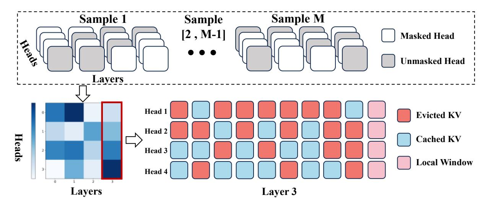
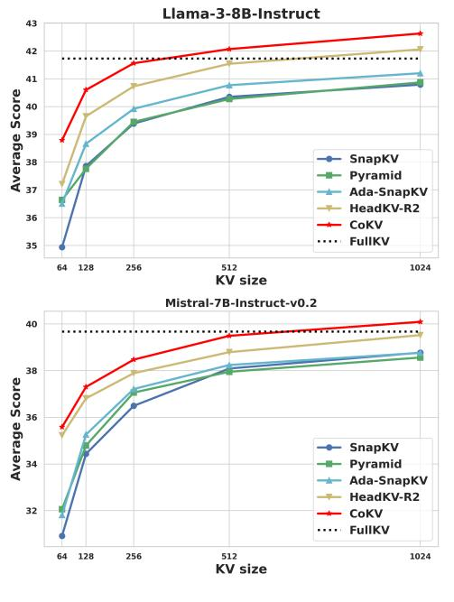
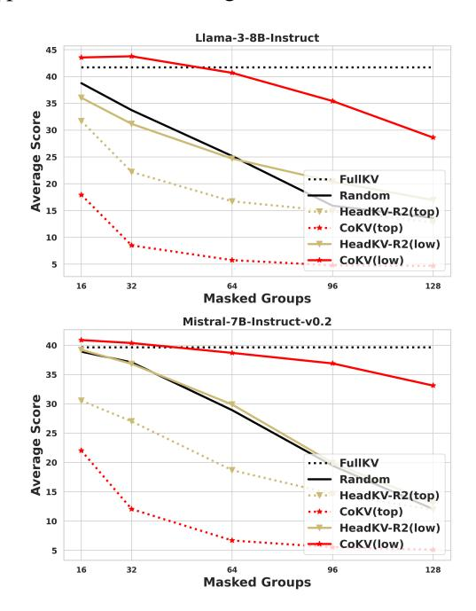
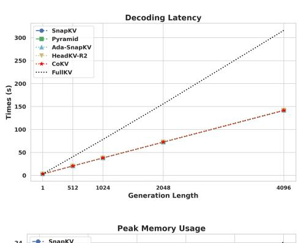
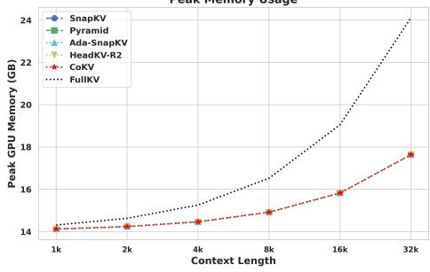

## CoKV: Optimizing KV Cache Allocation via Cooperative Game

Qiheng Sun<sup>1</sup>,<sup>2</sup> , Hongwei Zhang<sup>1</sup>,<sup>2</sup> , Haocheng Xia<sup>3</sup> , Jiayao Zhang<sup>1</sup>,<sup>2</sup> , Jinfei Liu<sup>1</sup>,2\* Kui Ren<sup>1</sup> 1 the State Key Laboratory of Blockchain and Data Security, Zhejiang University <sup>2</sup>Hangzhou High-Tech Zone (Binjiang) Institute of Blockchain and Data Security <sup>3</sup>Siebel School of Computing and Data Science University of Illinois Urbana-Champaign {qiheng\_sun,hongweizhang, jiayaozhang, jinfeiliu, kuiren}@zju.edu.cn hxia7@illinois.edu

## Abstract

Large language models (LLMs) have achieved remarkable success on various aspects of human life. However, one of the major challenges in deploying these models is the substantial memory consumption required to store key-value pairs (KV), which imposes significant resource demands. Recent research has focused on KV cache budget allocation, with several approaches proposing head-level budget distribution by evaluating the importance of individual attention heads. These methods, however, assess the importance of heads independently, overlooking their cooperative contributions within the model, which may result in a deviation from their true impact on model performance. In light of this limitation, we propose CoKV, a novel method that models the cooperation between heads in model inference as a cooperative game. By evaluating the contribution of each head within the cooperative game, CoKV can allocate the cache budget more effectively. Extensive experiments show that CoKV achieves state-of-the-art performance on the LongBench benchmark using LLama-3-8B-Instruct and Mistral-7B models. Code is provided in [https://github.com/](https://github.com/nawei1010/CoKV) [nawei1010/CoKV](https://github.com/nawei1010/CoKV).

## 1 Introduction

Large language models (LLMs) are widely applied across various domains, including content generation [\(Li et al.,](#page-9-0) [2024a\)](#page-9-0), automated services [\(Chen](#page-8-0) [et al.,](#page-8-0) [2024a\)](#page-8-0), and decision support systems [\(Bao](#page-8-1) [et al.,](#page-8-1) [2023\)](#page-8-1). To enhance the application capabilities of large language models, it is essential for them to handle long texts. For example, GPT-4 [\(OpenAI,](#page-9-1) [2024\)](#page-9-1) and Llama-3 [\(Dubey et al.,](#page-8-2) [2024\)](#page-8-2) support a context size of 128k tokens, while the context size of Claude 3 [\(Anthropic,](#page-8-3) [2024\)](#page-8-3) is up to 200k tokens. LLMs consist of multiple transformer

blocks that store key and value states (KV) during inference. KV cache allows efficient decoding in token generation without recomputing key and value states by using previously cached KV pairs. However, the KV cache grows excessively large when dealing with long texts, inevitably straining GPU memory and increasing decoding latency.

Eviction of less important key and value states in the cache has garnered significant attention. Many studies have explored methods for ranking the importance of tokens within a single attention head, retaining only the top k most significant ones. For example, H2O [\(Zhang et al.,](#page-9-2) [2023b\)](#page-9-2) evaluates token importance using the sum of attention weights. StreamingLLM [\(Xiao et al.,](#page-9-3) [2024\)](#page-9-3) directly removes KV from the middle segment of the cache to reduce the cache size as they incorporate less information. SnapKV [\(Li et al.,](#page-9-4) [2024b\)](#page-9-4) calculates token scores by pooling the attention weights between tokens in the local window and those in the cache. Recently, some studies have recognized that the importance of each attention head varies, enabling methods like AdaKV [\(Feng et al.,](#page-9-5) [2025\)](#page-9-5) and HeadKV [\(Fu](#page-9-6) [et al.,](#page-9-6) [2025\)](#page-9-6). AdaKV improves budget utilization by adaptively allocating the overall budget across different attention heads based on their varied concentration degrees. Heads with sparse concentrations require a small cache proportion, whereas more dispersed heads demand larger allocations. HeadKV evaluates the retrieval-reasoning scores of different heads and allocates a larger cache size to those with higher scores.

Motivated by evidence that attention heads vary in importance, we propose a novel approach to better evaluate and utilize this variability. We identify two key insights. First, existing methods evaluate attention head importance independently. For example, AdaKV evaluates the concentration degrees of heads while HeadKV assesses the retrievalreasoning capability of each head in isolation as a measure of importance. However, these approaches

<sup>\*</sup>Jinfei Liu is the corresponding author.

treat heads as isolated units, overlooking the fact that their true importance emerges from their cooperation rather than individual capabilities. As a result, independently assessing head importance may lead to suboptimal allocation. Second, existing methods evaluate head importance in a taskagnostic manner. However, heads that play a critical role in query answering may not hold the same level of significance in code generation. Consequently, applying the same importance scores to heads across all tasks within a model may fail to reflect the practical need of each specific task accurately. Based on these insights, we propose CoKV (Cooperation-based Key-Value), a method that evaluates the contribution of all attention heads in their cooperation within the model and dynamically allocates cache budgets based on their contribution to the specific task.

CoKV is inspired by the Shapley value (Shapley, 1953) from cooperative game theory. The Shapley value of a player  $p_i$  measures the expected marginal contribution that  $p_i$  provides to a coalition of players. Similarly, we can use the Shapley value to assess the importance of each attention head by viewing each head as a player. Marginal contribution is defined as  $\mathcal{U}(\mathcal{S} \cup \{p_i\}) - \mathcal{U}(\mathcal{S})$  where  $\mathcal{S}$  is a coalition of players excluding i and  $\mathcal{U}$  is the utility function. A simple intuition for computing the Shapley value of each head in the model is to define  $\mathcal{U}$  as the model performance metric. However, calculating the Shapley value is #P-hard (Deng and Papadimitriou, 1994), as there are an exponential number of coalitions and corresponding marginal contributions. As a result, evaluating the Shapley value for each head in LLMs requires an enormous number of model inferences. Although many studies (Jia et al., 2019; Mitchell et al., 2022) have explored approximating the Shapley value to reduce computational costs, the process remains costly.

The computational bottleneck in calculating the Shapley value arises from the fact that each sample of the marginal contribution only can be applied to a single player. Fortunately, Shapley value can be expressed as the expectation of the weighted complementary contribution, defined as  $\mathcal{U}(\mathcal{S}) - \mathcal{U}(\mathcal{N} \setminus \mathcal{S})$ , where  $\mathcal{N}$  represents the set of all players (Zhang et al., 2023a). Complementary contribution has an advantage over marginal contribution is that  $\mathcal{U}(\mathcal{S}) - \mathcal{U}(\mathcal{N} \setminus \mathcal{S})$  can be used to update the Shapley values for all players  $i \in \mathcal{S}$ . By expressing the Shapley value in terms of complementary contributions, we can interpret it as

an expectation over these contributions computed at different coalition sizes |S|. However, in the LLM setting, the cost of computing the complementary contributions in all coalition sizes is still prohibitively high. We observe that the average complementary contribution at each coalition size exhibits a strong correlation with the Shapley value of the players in Appendix Section B.3. This insight allows us to approximate attention head importance by computing complementary contributions at only a few selected coalition sizes, rather than evaluating all possible sizes (i.e., from 1 to  $|\mathcal{N}|$ ). By focusing on a few representative coalition sizes, we can significantly reduce the computational cost of estimating the contributions of heads. Additionally, we provide a theoretical analysis of this approach and demonstrate its efficiency.

CoKV is a simple-yet-effective method and can integrate well with other inference optimization techniques. We integrate CoKV with widely used methods including FlashAttention (Dao et al., 2022) and grouped-query attention (GQA) (Ainslie et al., 2023). CoKV achieves state-of-the-art performance in LongBench (Bai et al., 2024) using Llama-3-8B-Instruct (Dubey et al., 2024) and Mistral-7B (Jiang et al., 2023) models. Results from the Llama-3-8B-Instruct model show that when each KV cache retains an average of 128 KV pairs (1.6%) of the full cache), it achieves 97.29%of the performance of the full KV cache. Furthermore, when each cache retains just 512 tokens on average, CoKV outperforms the full KV cache in terms of average accuracy. This demonstrates that CoKV not only reduces computational costs but also improves inference performance by identifying which heads benefit from cache retention and which may have a detrimental effect. Additionally, we evaluate all methods within the token range of 1k to 31k in the Needle-in-a-Haystack test, where CoKV also demonstrated the best retrieval capability.

## 2 Preliminaries

## 2.1 Key-Value Caching and Compression

In Multi-Head Attention (MHA), for each attention head  $h_i$  in one layer, the embedded input  $X = \{x_1, x_2, \dots, x_m\} \in \mathbb{R}^{m \times d_{\text{model}}}$  of m tokens is mapped into different subspaces using query  $W_i^Q$ , key  $W_i^K$ , and value  $W_i^V \in \mathbb{R}^{d_{\text{model}} \times d_h}$  matrices:

$$Q_i = XW_i^Q, K_i = XW_i^K, V_i = XW_i^V \in \mathbb{R}^{m \times d_h}$$

where  $d_h$  is the dimension of attention heads,  $d_h = d/\tau$ , and  $\tau$  is the number of heads in one layer.

All the computed KV for the input sequence are cached to avoid recalculating them during the subsequent decoding stages. Assume there is a new input token  $x \in \mathbb{R}^{1 \times d_{\text{model}}}$ , then it will be mapped to a new query, key, and value as follows,

$$q_i = xW_i^Q, k_i = xW_i^K, v_i = xW_i^V \in \mathbb{R}^{1 \times d_h}.$$

The KV cache is updated by adding the new key and value pair

$$K_i = \operatorname{Cat}[K_i, k_i], V_h = \operatorname{Cat}[V_i, v_i].$$

The attention output is computed as follows,

$$O_i = A_i V_i$$

where  $A_i = \operatorname{softmax}(q_i K_i^T / \sqrt{d_h})$ . The final output  $y \in \mathbb{R}^{1 \times d_{\text{model}}}$  is obtained through a linear transformation

$$y = \operatorname{Cat}[O_1, \cdots, O_{\tau}]W^O$$

where  $W^O \in \mathbb{R}^{d \times d_{\text{model}}}$  output weight matrix.

Furthermore, KV cache eviction methods can be employed to discard unimportant KV cache entries while preserving performance. For each head  $h_i$ , the compressed KV cache is reduced to  $\hat{K}_i \in \mathbb{R}^{s \times d_h}$  and  $\hat{V}_i \in \mathbb{R}^{s \times d_h}$ , where some unimportant KV pairs are evicted and  $s \ll m$ , resulting in a significant improvement in computational efficiency and memory usage. Specifically, the compressed KV cache is updated by appending the new key and value pair:

$$\hat{K}_i = \operatorname{Cat}[\hat{K}_i, k_i], \quad \hat{V}_i = \operatorname{Cat}[\hat{V}_i, v_i].$$

The attention output for each head  $h_i$  is computed using the compressed KV cache:

$$\hat{O}_i = \hat{A}_i \hat{V}_i$$

where the attention weights  $A_i$  are calculated as:  $\hat{A}_i = \operatorname{softmax}(q_i \hat{K}_i^T / \sqrt{d_h}).$ 

#### 2.2 Shapley Value

Consider a set of players  $\mathcal{N} = \{p_1, \dots, p_n\}$ . A coalition  $\mathcal{S}$  is a subset of  $\mathcal{N}$  that cooperates to complete a task. A utility function  $\mathcal{U}(\mathcal{S})$  ( $\mathcal{S} \subseteq \mathcal{N}$ ) is the utility of coalition  $\mathcal{S}$  for the task. The marginal contribution of player  $p_i$  with respect to a coalition

S is  $U(S \cup \{p_i\}) - U(S)$ . The Shapley value measures the expectation of marginal contribution of player  $p_i$  in all possible coalitions. That is

<span id="page-2-0"></span>
$$SV_i = \frac{1}{n} \sum_{S \subset \mathcal{N} \setminus \{p_i\}} \frac{\mathcal{U}(S \cup \{p_i\}) - \mathcal{U}(S)}{\binom{n-1}{|S|}}. \quad (1)$$

According to Equation 1, it is evident that computing the exact Shapley value requires enumerating the utilities for all possible subsets of players and each marginal contribution can only be used to update the Shapley value of a single player. Therefore, the computational complexity of exactly calculating the Shapley value is exponential. Recently, the Shapley value of player  $p_i$  is proven to be equal to the weighted complementary contributions (Zhang et al., 2023a) as follows,

$$SV_i = \frac{1}{n} \sum_{S \subset \mathcal{N} \setminus \{p_i\}} \frac{\mathcal{U}(S) - \mathcal{U}(\mathcal{N} \setminus S)}{\binom{n-1}{|S|}}.$$
 (2)

 $\mathcal{U}(\mathcal{S}) - \mathcal{U}(\mathcal{N} \setminus \mathcal{S})$  is called complementary contribution which has an advantage that can be reused to update Shapley value estimation for all players in  $\mathcal{S}$ . In the context of KV caches, attention heads are treated as players for evaluating their importance to each specific task.  $\mathcal{U}(\mathcal{S})$  is defined as the model accuracy when the attention heads in  $\mathcal{N} \setminus \mathcal{S}$  are masked, we retain only the KV pairs within the local window for masked heads.

#### 3 Method

Our method consists of two phases. First, we precompute the importance scores for each attention head. Second, these scores are utilized for KV cache compression during inference. The overview of our approach is illustrated in Figure 1.

## 3.1 Head Importance Evaluation

Although the complementary contribution helps in increasing efficiency when approximating the Shapley value, it is still computationally costly, especially in the LLM setting. Given a set of players  $\mathcal{N}=\{p_1,\ldots,p_n\}$ , a coalition of j players  $(1\leq j\leq n)$  is called a j-coalition. Moreover, for a player  $p_i$   $(1\leq i\leq n)$ , a j-coalition that contains  $p_i$  is called a (i,j)-coalition. Denote by  $\mathfrak{S}_{i,j}=\{\mathcal{S}\cup\{p_i\}|\mathcal{S}\subseteq\mathcal{N}\setminus\{p_i\},|\mathcal{S}|=j-1\}$  the set of (i,j)-coalitions, and by  $\mathcal{SV}_{i,j}$  the expected complementary contributions of (i,j)-coalitions. That is,

$$\mathcal{SV}_{i,j} = \sum_{\mathcal{S} \in \mathfrak{S}_{i,j}} \frac{\mathcal{U}(\mathcal{S}) - \mathcal{U}(\mathcal{N} \setminus \mathcal{S})}{\binom{n-1}{j-1}}.$$

<span id="page-3-0"></span>

Figure 1: Overview of our proposed method: (1) **Head Importance Evaluation (Upper Part):** For a 4-layer  $\times$  4-head model, We measure head importance using the Sliced Shapley Value (SSV). To approximate SSV, we sample M different sets of masked heads and compute their complementary contributions. The average complementary contribution of each head is its estimated SSV. (2) **KV Cache Compression (Lower Part):** Using the 4 heads in Layer 3 as an example, all heads store KV pairs for a small local window of recent tokens, while heads with higher SSV (darker in the heatmap) are allocated more cache size to retain KV pairs before the local window.

It is clear that  $SV_i = \frac{1}{n} \sum_{j=1}^n SV_{i,j}$ . Computing the Shapley value needs to calculate  $SV_{i,j}$  for j ranging from 1 to n, which becomes costly when n is large.

We observe that the expected complementary contributions of j-coalitions for heads in LLMs follow a similar distribution across different j values, as shown in Appendix Section B.3. This suggests that the contributions of heads can be effectively captured using a subset of j-coalitions. Based on this insight, we propose assessing the importance of heads using the expected complementary contribution of several j-coalitions, which can significantly reduce the computation cost while maintaining effectiveness. Formally, we introduce a new definition called the Sliced Shapley value as follows.

**Definition 1** (Sliced Shapley Value) Let  $\mathcal{H} \subseteq \{1, \cdots, n\}$  denote the selected set of j-coalitions, representing a specific slice of the coalition size space. The *Sliced Shapley value* of head  $h_i$  with respect to  $\mathcal{H}$  is defined as:

$$\mathcal{SSV}_i^{\mathcal{H}} = \frac{1}{|\mathcal{H}|} \sum_{j=1}^n \mathcal{SV}_{i,j} \cdot \mathbb{I}_j^{|\mathcal{H}|},$$

where  $\mathbb{I}_{j}^{\mathcal{H}}$  is an indicator function, which is 1 if j is the element in  $\mathcal{H}$  and 0 otherwise.

**Algorithm Description.** The detailed steps of approximating  $\mathcal{SSV}_i^{\mathcal{H}}$  are shown in Algorithm 1. In each iteration, sample a random permutation  $\pi^k$ 

of the heads  $\{h_1,\ldots,h_n\}$ , which defines a random ordering of the heads. Randomly select a split point and create a set  $\mathcal{S}$  of selected heads. Mask heads in the set  $\mathcal{N}\setminus\mathcal{S}$ , and evaluate the model accuracy after masking, which is denoted as  $\mathcal{U}(\mathcal{S})$ . Similarly, calculate  $\mathcal{U}(\mathcal{N}\setminus\mathcal{S})$  by masking heads in  $\mathcal{S}$  (Lines 3-6). For each head in  $\mathcal{S}$ , update  $\mathcal{SV}_{\pi^k(j),i}$  and count matrix  $m_{\pi^k(j),i}$  (Lines 7-10). After  $\mathcal{M}$  iterations are completed, calculate the approximated Sliced Shapley value for each head by averaging the complementary contributions.

<span id="page-3-1"></span>**Theorem 1** Algorithm 1 returns an  $(\epsilon, \delta)$ -approximation of Sliced Shapley value with time complexity  $\mathcal{O}(\frac{T|\mathcal{H}|\ln\frac{2|\mathcal{H}}{\delta}}{\epsilon^2})$  where T is the time cost of evaluating a complementary contribution which is the time to inference on the validation dataset of each task in our setting. In contrast, Shapley value requires the time complexity of  $\mathcal{O}(\frac{Tn\ln\frac{2\pi}{\delta}}{\epsilon^2})$  to achieve an  $(\epsilon, \delta)$ -approximation. The proof is provided in Appendix Section C.

#### 3.2 KV Cache Compression

Existing KV cache compression methods have partially addressed the importance of layers, yet this consideration remains insufficient during cache allocation. While AdaKV attempts to preserve tokens with larger attention weights across all heads when allocating cache size, it overlooks the varying importance of different attention heads. Conversely,

**Algorithm 1:** Evaluating Head Importance in LLMs.

```
input: Heads \mathcal{N} = \{h_1, \dots, h_n\} and
                          sampling number \mathcal{M} > 0
      output: approximate Sliced Shapley value
                         \overline{SSV_i^{\mathcal{H}}} for each head h_i
                         (1 < i < n)

\overline{SV_i^{\mathcal{H}}} \leftarrow 0 \ (1 \leq i \leq n); \overline{SV_{i,j}}, m_{i,j} \leftarrow 0

        (1 \le i, j \le n);
 2 for k=1 to \mathcal{M} do
               let \pi^k be a random permutation of
                  \{1, \ldots, n\};
               let i be a randomly selected element
 4
                 from the set \mathcal{H};
              \begin{split} \mathcal{S} &\leftarrow \{\pi^k(1), \dots, \pi^k(i)\}; \\ \mathcal{N} &\setminus \mathcal{S} \leftarrow \{\pi^k(i+1), \dots, \pi^k(n)\}; \\ \text{$//$ $\mathcal{U}(\mathcal{S})$ is the model performance when heads in } \\ &\quad \mathcal{N} &\setminus \mathcal{S} \text{ are masked and vice versa for } \mathcal{U}(\mathcal{N} \setminus \mathcal{S}). \end{split}
 5
               u \leftarrow \mathcal{U}(\mathcal{S}) - \mathcal{U}(\mathcal{N} \setminus \mathcal{S});
 7
               for j=1 to i do
 8
                    \overline{\mathcal{SV}_{\pi^k(j),i}} + = u;
                  m_{\pi^k(i),i} + = 1;
11 for i = 1 \text{ to } n \text{ do}
        \overline{\mathcal{SSV}_{i}^{\mathcal{H}}} = \frac{1}{\mathcal{H}} \sum_{i=1}^{n} \overline{\mathcal{SV}_{i,j}} / m_{i,j};
13 return \overline{SSV_n^H}, \dots, \overline{SSV_n^H}
```

HeadKV acknowledges the differential importance of attention heads but suffers from several limitations. First, its evaluation primarily relies on the retrieval capability of individual heads, incorporating only basic reasoning abilities that prove inadequate for more complex scenarios, such as few-shot learning. Second, it assesses each head in isolation, ignoring the discrepancy between a head's individual contribution and its collaborative importance when working in conjunction with other heads. Our proposed method addresses these limitations by introducing a SSV-based scoring mechanism, which evaluates each head's importance based on its collaborative contribution to the task. This approach offers a more comprehensive and accurate representation of each head's significance in the overall model inference process.

**Budget Allocation.** An intuitive approach suggests that the least important heads, which contribute minimally or even negatively to the model performance, may not require cache allocation. Let  $\alpha$  represent the number of such heads, which serves as the sole hyperparameter in our alloca-

tion scheme. For the remaining  $n-\alpha$  heads, we employ a normalization method to normalize their importance scores and allocate the cache size proportionally based on their normalized scores.

Specifically, we normalize their contributions using min-max normalization for the  $n-\alpha$  heads:

$$\mathcal{NSV}_i^{\mathcal{H}} = \frac{\mathcal{SSV}_i^{\mathcal{H}} - \min^{\alpha}(\mathcal{SSV}^{\mathcal{H}})}{\max(\mathcal{SSV}^{\mathcal{H}}) - \min^{\alpha}(\mathcal{SSV}^{\mathcal{H}})},$$

where  $\min^{\alpha}(\cdot)$  and  $\max(\cdot)$  extract the  $\alpha$ -th smallest and maximum value, respectively. For the  $\alpha$  heads with the smallest Sliced Shapley values, we set the normalized score as 0. This ensures that all normalized scores lie in the range [0,1].

Next, the cache size  $c_i$  allocated to head  $h_i$  is determined by the local window size s and linearly distributing the remaining shared cache size s based on the normalized scores:

<span id="page-4-1"></span>
$$c_i = B \cdot \frac{\mathcal{NSV}_i^{\mathcal{H}}}{\sum_{j=1}^n \mathcal{NSV}_j^{\mathcal{H}}} + s.$$
 (3)

Algorithm Description. First, we allocate the KV cache size for each head based on their normalized Sliced Shapley values. Next, we rank the importance of KV pairs within each head using SnapKV. Specifically, the most recent tokens within local windows guide the KV cache selection. Attention scores from these local windows to the remaining tokens are aggregated via pooling, with higher-scoring tokens retained in the cache for each head. The detailed eviction steps for a single head are outlined in Algorithm 2.

#### 4 Experiments

#### 4.1 Experiment Settings

**Datasets.** LongBench is a multitask benchmark for long context understanding and exhibits a wide range of average input lengths, spanning from 1,235 to 18,409 tokens.

**Baselines and Settings.** We compare CoKV with four strong KV cache compression methods. All methods keep the same total cache size for fair comparison. Besides, we implement all methods with GQA (Ainslie et al., 2023) and FlashAttention (Dao et al., 2022) for efficient computation.

 SnapKV (Li et al., 2024b) uses the last several tokens as local windows to guide KV cache selection. Attention scores from these windows to the remaining tokens are pooled to cluster and guide the selection process.

#### Algorithm 2: Token Eviction Using CoKV.

```
input: Shared budget size B, local
              window size s, tokens in local
              window X^{win} \in \mathbb{R}^{s \times d}, KV in local
              window \{K_i^{win}, V_i^{win}\}, KV
              outside local window \{K_i^{out}, V_i^{out}\}
   output : Retained KV Cache \{\hat{K}_i, \hat{V}_i\}
Q_i^{win} = X^{win} W_i^Q;
   // Compute attention weights of queries in local window
      and prefix Keys.
\overline{A}_i = \operatorname{softmax}(Q_i^{win} K_i^T);
\overline{A}_i = \overline{A}_i.max pooling(dim =
    1).mean(dim = 0);
   // Calculate token scores outside the local window.
4 Get c_i using Algorithm 1 and Equation 3;
 indices = \overline{A}_i.topk(c_i).indices; 
6 Select \{\hat{K}_i, \hat{V}_i\} from \{K_i^{out}, V_i^{out}\}
    according indices;
7 \{\hat{K}_i, \hat{V}_i\} = \text{Cat}(\{\hat{K}_i, \hat{V}_i\}, \{K_i^{win}, V_i^{win}\});
```

 PyramidKV (Cai et al., 2024) allocates more KV cache to lower layers to retain key information while reducing the budget for higher layers where information is already aggregated.

// Keep top  $c_i$  KV pairs in the cache.

8 **return** Retained KV Cache  $\{K_i, V_i\}$ .

- Ada-KV (Feng et al., 2025) dynamically allocates budgets to heads within each layer based on their concentration degrees, and can be combined with SnapKV or PyramidKV. Ada-SnapKV is used as the baseline due to its superior performance over Ada-PyramidKV.
- HeadKV-R2 (Fu et al., 2025) allocate budgets to heads based on their retrieval-reasoning score, and it uses SnapKV to rank the importance of KV pairs in each head.

In CoKV, we allocate the KV cache size for each head based on the normalized Sliced Shapley value of  $\mathcal{H}=\{32,64,96,128\}$ . Following HeadKV-R2, we set the local window size to 8, and randomly split each dataset into a validation dataset and a test dataset, with proportions of 15% and 85%, respectively. The hyperparameter  $\alpha$  is selected from the set  $\{1,5,10,15,20,30,40\}$ . The validation dataset is used to compute Sliced Shapley value and determine the optimal  $\alpha$  for each task. We evaluate CoKV on the Llama-3-8B-Instruct and Mistral-7B-Instruct-v0.2 models. Due to the page limit, the Mistral-7B-Instruct-v0.2 results are provided in Appendix. For test data that exceeds the maximum input length of Llama-3-8B-Instruct, we adopt the

approach of HeadKV by utilizing the first 4k tokens and the last 4k tokens. Following standard practices in prior studies (Feng et al., 2025; Fu et al., 2025), we perform cache eviction after the prefilling phase of each layer for consistent comparison. In GQA, a group of 4 heads shares the same KV cache. We treat each cache within a group as a player in a cooperative game, evaluating their Sliced Shapley value to determine their importance scores. For HeadKV-R2, we calculate the importance score of each group by averaging the retrieval-reasoning scores of the 4 heads within the group. This adaptation ensures compatibility with GQA, as HeadKV is implemented with MHA in the original paper. For the efficiency and computation cost analysis of Sliced Shapley value, please refer to Appendix Section B.1. For the test in Needle-in-a-Haystack, please refer to Appendix Section B.5.

#### 4.2 Main Results

**Benchmark Results.** The complete benchmark results are presented in Tables 4 and 5 in the appendix. We include a simplified table (Table 1), showing the performance of Llama-3-8B-Instruct when keeping 64-128 KV pairs on average. The results demonstrate that CoKV consistently outperforms all baseline methods. The average accuracy of the two models on 16 datasets are presented in Figure 2. Notably, in Llama-3-8B-Instruct, with

<span id="page-5-1"></span>

Figure 2: Results for varying KV cache sizes (64, 128, 256, 512, 1024), showing the average accuracy across 16 datasets from the LongBench benchmark.

Table 1: Benchmark Results of Llama-3-8B-Instruct

<span id="page-6-0"></span>

| Method     | Single-Doc. QA |        |       | Multi-Doc. QA |        | Sum     | ımariza | tion    | Few-s    | hot Lea | rning     | Synt   | hetic   | Code  |                  |       |
|------------|----------------|--------|-------|---------------|--------|---------|---------|---------|----------|---------|-----------|--------|---------|-------|------------------|-------|
|            | NirO4          | Pasper | Mr.cn | Hopporo.      | Wiking | Musique | Gorkepo | CAISUIN | MultiNeu | PREC.   | Trivia Q4 | SAMSUM | PCOUNT. | PR.   | ζ <sub>c</sub> , | Pop.  |
| Full Cache | 24.12          | 31.24  | 39.85 | 45.23         | 34.56  | 21.09   | 28.38   | 23.24   | 26.52    | 74.12   | 90.96     | 42.37  | 4.55    | 71.76 | 58.1             | 51.64 |
|            |                |        |       |               |        |         | KV siz  | e=64    |          |         |           |        |         |       |                  |       |
| SnapKV     | 19.94          | 13.21  | 28.91 | 40.06         | 28.58  | 18.12   | 17.29   | 21.71   | 17.05    | 49.41   | 89.00     | 35.48  | 3.99    | 71.57 | 54.35            | 50.42 |
| Pyramid    | 20.11          | 16.54  | 32.67 | 40.25         | 27.71  | 17.54   | 18.67   | 22.37   | 20.03    | 62.55   | 89.89     | 36.63  | 4.30    | 71.76 | 54.27            | 50.96 |
| Ada-SnapKV | 20.40          | 14.46  | 32.62 | 42.39         | 31.48  | 17.58   | 18.57   | 22.18   | 18.71    | 58.82   | 90.13     | 35.25  | 4.41    | 71.57 | 54.02            | 51.68 |
| HeadKV-R2  | 20.30          | 16.76  | 35.96 | 38.08         | 26.41  | 17.98   | 18.68   | 21.75   | 20.58    | 67.06   | 88.19     | 37.30  | 3.21    | 71.76 | 56.20            | 54.49 |
| CoKV       | 20.77          | 19.67  | 35.11 | 44.37         | 34.36  | 17.83   | 17.89   | 22.33   | 18.55    | 71.76   | 90.73     | 38.51  | 4.71    | 71.76 | 55.45            | 55.82 |
|            |                |        |       |               |        | K       | V size  | =1024   |          |         |           |        |         |       |                  |       |
| SnapKV     | 23.95          | 26.95  | 37.81 | 44.03         | 30.88  | 20.93   | 24.26   | 23.09   | 25.79    | 72.35   | 90.87     | 41.43  | 4.31    | 71.76 | 59.29            | 54.91 |
| Pyramid    | 23.62          | 26.76  | 39.44 | 45.79         | 33.41  | 19.87   | 23.57   | 22.98   | 25.13    | 73.02   | 90.93     | 40.86  | 4.71    | 71.76 | 58.43            | 53.67 |
| Ada-SnapKV | 23.52          | 28.33  | 40.39 | 45.20         | 32.95  | 20.11   | 24.55   | 23.33   | 25.37    | 73.53   | 90.87     | 41.38  | 4.46    | 71.76 | 58.88            | 54.65 |
| HeadKV-R2  | 23.35          | 29.60  | 40.09 | 45.82         | 35.81  | 21.39   | 25.57   | 23.32   | 26.30    | 74.12   | 90.77     | 40.27  | 4.19    | 71.76 | 61.58            | 59.03 |
| CoKV       | 24.01          | 31.70  | 40.64 | 48.13         | 37.89  | 20.64   | 23.02   | 23.89   | 25.71    | 74.12   | 91.01     | 42.02  | 4.71    | 71.20 | 63.33            | 63.74 |

an average of 128 tokens cached per group KV cache, CoKV retains 97.29% of the model performance. Furthermore, CoKV significantly surpasses FullKV when it maintains an average of over 512 KV pairs per group cache. When retains an average of 1024 KV, the average results of both models outperform FullKV. This demonstrates that CoKV achieves near-lossless performance under resourceconstrained settings. The superior performance of CoKV arises from its ability to effectively evaluate the importance of each cache within a group while considering the cooperation among all groups. It is not only capable of identifying which groups are important but also able to recognize those groups that do not contribute or even have a negative contribution. By optimizing the cache size to enhance overall cooperation, CoKV ensures efficient and high-quality inference.

Hyperparameter Free Results. Since both HeadKV-R2 and CoKV provide importance scores for each group, we conduct an experiment to compare their effectiveness without introducing any additional hyperparameters. In this experiment, we mask the caches of groups based on the importance scores assigned by each algorithm. Specifically, we mask the caches of both the highest-ranked (top) and lowest-ranked groups (low). The complete results are shown in Tables 6 and 7 in the appendix. We include a simplified table for the results of masking 16,128 groups of Llama-3-8B-Instruct model in Table 2. The results show that when masking the top-ranked groups identified by each method, the performance of CoKV

degrades more significantly than that of HeadKV-R2. Conversely, when masking the unimportant groups (**low**), the performance of CoKV declines more gradually than HeadKV-R2. This suggests that CoKV is more effective at ranking group importance, as it better distinguishes between critical and non-critical caches. The results of masking 16 groups in both models outperformed the FullKV approach as shown in Figure 3. This further demon-

<span id="page-6-1"></span>

Figure 3: Results for varying masked groups (16,32,64,96,128), showing the average accuracy across 16 datasets from the LongBench benchmark.

strates that CoKV can identify groups that have a negative impact on the model. By removing the

Table 2: Results of masking groups with Llama-3-8B-Instruct

<span id="page-7-0"></span>

| Method                                                               | Single-Doc. QA             |              |                                | Multi-Doc. QA                                                                                                                                                                                      |                                  |                  | Summarization        |                                          |              | Few-shot Learning                                                                    |                                      | Synthetic                      |                      | Code |                                                                                                       |          |
|----------------------------------------------------------------------|----------------------------|--------------|--------------------------------|----------------------------------------------------------------------------------------------------------------------------------------------------------------------------------------------------|----------------------------------|------------------|----------------------|------------------------------------------|--------------|--------------------------------------------------------------------------------------|--------------------------------------|--------------------------------|----------------------|------|-------------------------------------------------------------------------------------------------------|----------|
|                                                                      | NtrQ<br>A                  | Qasp<br>er   | MF<br>-en                      | Hotp<br>otQA                                                                                                                                                                                       | 2Wik<br>iMQ                      | Mus<br>ique<br>A | GovR<br>eport        | QMS<br>um                                | Mult<br>iNew | TRE<br>C<br>s                                                                        | Trivi<br>aQA                         | SAM<br>Sum                     | PCo<br>unt           | PRe  | Lcc                                                                                                   | RB<br>-P |
| Full Cache                                                           |                            |              |                                | 24.12 31.24 39.85 45.23 34.56 21.09 28.38 23.24 26.52 74.12 90.96 42.37 4.55                                                                                                                       |                                  |                  |                      |                                          |              |                                                                                      |                                      |                                |                      |      | 71.76 58.10 51.64                                                                                     |          |
|                                                                      |                            |              |                                |                                                                                                                                                                                                    |                                  |                  | Masking 16 groups    |                                          |              |                                                                                      |                                      |                                |                      |      |                                                                                                       |          |
| Random<br>HeadKV-R2(top)<br>CoKV(top)<br>HeadKV-R2(low)<br>CoKV(low) | 6.55                       | 9.46         | 19.45 12.97 27.75 34.2<br>9.47 | 20.93 28.48 33.69 44.93 20.01 20.6<br>21.83 14.36 33.34 31.37 27.23 12.55 27.29 23.82 26.99 74.12 91.03 42.18 4.12<br>23.74 33.76 41.71 49.27 40.48 19.99 29.13 23.25 27.79 74.12 91.45 42.37 4.71 | 10.19 12.27 5.67                 |                  | 28.43 23.7<br>5.73   | 16.96 4.47<br>Masking 128 groups         |              | 26.67 74.12 91.07 41.12 4.26<br>17.33 14.32 19.74 22.76 22.05 67.06 87.91 35.53 4.71 |                                      | 43.53 71.21 23.77 3.91         |                      |      | 71.76 49.83 40.55<br>68.49 26.62 26.53<br>34.98 11.58 17.18<br>70.59 37.35 38.55<br>70.55 63.38 61.26 |          |
| Random                                                               | 3.34                       | 2.50         | 5.33                           | 10.59 5.12                                                                                                                                                                                         |                                  | 2.73             | 2.15                 | 9.19                                     | 0.16         |                                                                                      | 44.12 31.33 9.05                     |                                | 4.18                 |      | 66.74 12.27 9.23                                                                                      |          |
| HeadKV-R2(top)<br>CoKV(top)<br>HeadKV-R2(low)<br>CoKV(low)           | 2.34<br>0.59<br>12.02 7.97 | 2.17<br>0.80 | 5.38<br>1.38<br>8.92           | 7.21<br>2.96<br>15.31 12.15 28.44 35.35 23.27 10.67 2.93                                                                                                                                           | 7.19<br>3.42<br>14.87 12.83 5.26 | 1.85<br>1.11     | 1.80<br>1.16<br>2.41 | 10.34 0.31<br>4.05<br>9.12<br>12.24 9.41 | 0.13<br>1.42 | 34.12 2.89                                                                           | 34.71 26.08 7.87<br>55.88 40.96 10.2 | 7.17<br>73.82 76.32 37.70 4.71 | 4.71<br>1.09<br>4.71 | 7.52 | 66.92 13.94 11.76<br>2.91<br>68.42 10.14 6.03<br>68.24 22.20 24.93                                    | 3.55     |

KV pairs from these groups, the model inference not only optimizes storage and decoding speed but also enhances overall performance.

#### 4.3 Decoding Latency and Memory Usage

We conduct experiments using the Mistral-7B-Instruct-v0.2 model, which supports a maximum context window of 32k tokens, with FlashAttention enabled as the default setting, on an A100 GPU with 40GB of memory. We design two key experiments with the average KV cache size set to 128 tokens(comparative experiments showed less than 2% variation across 64/256/512/1024 tokens).

Decoding Latency With a fixed input context length of 28k tokens, we measure decoding latency (including both the pre-filling time and the decoding time) across different generation lengths (1/512/1024/2048/4096 tokens). As shown in the Decoding Latency of Figure [4,](#page-7-1) CoKV achieves less than 50% of the total latency compared to the FullKV baseline, with negligible differences observed between the other baselines.

Peak Memory Usage Under fixed generation length (1 token), we measure the peak GPU memory usage (including model parameters and runtime states) across varying input contexts (1k/2k/4k/8k/16k/32k tokens). As shown in the Peak Memory Usage of Figure [4,](#page-7-1) CoKV reduces memory usage by 64% compared to FullKV baseline at 32k input length.

<span id="page-7-1"></span>



Figure 4: Results of Decoding Latency and Peak Memory Usage, demonstrating that CoKV maintains comparable performance with other baseline methods while achieving significant improvements over FullKV.

## 5 Conclusion

Large language models (LLMs) face significant challenges in handling long texts due to the excessive memory and latency overhead caused by the growing size of the KV cache. To this end, we introduce the Sliced Shapley value (SSV) to evaluate the collaborative importance of attention heads and a novel method called CoKV to dynamically allocate cache sizes based on SSV. Our experimental results

demonstrate that CoKV achieves state-of-the-art performance across 16 LongBench datasets, outperforming the full KV cache in 9 datasets while reducing memory and latency overhead. CoKV provides a scalable and practical solution for enhancing the efficiency of LLMs in real-world applications.

## Limitations

Our work has two main limitations that suggest future research directions:

Task-specific constraint: CoKV requires calculating head importance scores for different tasks. While experiments in Appendix Section [B.4](#page-11-3) demonstrate strong generalizability across datasets within the same task category. Despite this constraint, CoKV is highly practical for LLM providers serving diverse users. Users can simply select their task type, and the model will apply the corresponding head importance scores for KV cache compression. Importantly, the underlying inference process remains consistent across all tasks; only the cache budget allocation varies based on the task-specific importance scores. This ensures both flexibility and efficiency, enabling the model to adapt to various user needs without requiring significant changes to its core architecture.

Precomputation cost: The computation of importance based on cooperative game theory for attention heads is computationally intensive. Although we propose the Sliced Shapley Value (SSV), which significantly reduces the computational cost, our precomputation overhead remains higher than that of baseline methods. However, our experiments in Appendix Section [B.1](#page-11-1) demonstrate that this precomputation is still entirely acceptable. We plan to address optimizing computational complexity as one of our future research directions by developing efficient approximation algorithms and parallel computing strategies.

## References

<span id="page-8-6"></span>Joshua Ainslie, James Lee-Thorp, Michiel de Jong, Yury Zemlyanskiy, Federico Lebron, and Sumit Sanghai. 2023. [GQA: Training generalized multi-query trans](https://openreview.net/forum?id=hmOwOZWzYE)[former models from multi-head checkpoints.](https://openreview.net/forum?id=hmOwOZWzYE) In *The 2023 Conference on Empirical Methods in Natural Language Processing*.

<span id="page-8-3"></span>Anthropic. 2024. The claude 3 model family: Opus, sonnet, haiku. [https://www-cdn.anthropic.com/](https://www-cdn.anthropic.com/de8ba9b01c9ab7cbabf5c33b80b7bbc618857627/Model_Card_Claude_3.pdf) [de8ba9b01c9ab7cbabf5c33b80b7bbc618857627/](https://www-cdn.anthropic.com/de8ba9b01c9ab7cbabf5c33b80b7bbc618857627/Model_Card_Claude_3.pdf)

[Model\\_Card\\_Claude\\_3.pdf](https://www-cdn.anthropic.com/de8ba9b01c9ab7cbabf5c33b80b7bbc618857627/Model_Card_Claude_3.pdf). Accessed: 2025-02- 04.

<span id="page-8-7"></span>Yushi Bai, Xin Lv, Jiajie Zhang, Hongchang Lyu, Jiankai Tang, Zhidian Huang, Zhengxiao Du, Xiao Liu, Aohan Zeng, Lei Hou, Yuxiao Dong, Jie Tang, and Juanzi Li. 2024. [LongBench: A bilingual, multi](https://doi.org/10.18653/v1/2024.acl-long.172)[task benchmark for long context understanding.](https://doi.org/10.18653/v1/2024.acl-long.172) In *Proceedings of the 62nd Annual Meeting of the Association for Computational Linguistics (Volume 1: Long Papers)*, pages 3119–3137, Bangkok, Thailand. Association for Computational Linguistics.

<span id="page-8-1"></span>Keqin Bao, Jizhi Zhang, Yang Zhang, Wenjie Wang, Fuli Feng, and Xiangnan He. 2023. [Tallrec: An ef](https://doi.org/10.1145/3604915.3608857)[fective and efficient tuning framework to align large](https://doi.org/10.1145/3604915.3608857) [language model with recommendation.](https://doi.org/10.1145/3604915.3608857) In *Proceedings of the 17th ACM Conference on Recommender Systems, RecSys 2023, Singapore, Singapore, September 18-22, 2023*, pages 1007–1014. ACM.

<span id="page-8-8"></span>Zefan Cai, Yichi Zhang, Bofei Gao, Yuliang Liu, Tianyu Liu, Keming Lu, Wayne Xiong, Yue Dong, Baobao Chang, Junjie Hu, and Wen Xiao. 2024. [Pyramidkv:](https://arxiv.org/abs/2406.02069) [Dynamic kv cache compression based on pyramidal](https://arxiv.org/abs/2406.02069) [information funneling.](https://arxiv.org/abs/2406.02069) *Preprint*, arXiv:2406.02069.

<span id="page-8-0"></span>Jin Chen, Zheng Liu, Xu Huang, Chenwang Wu, Qi Liu, Gangwei Jiang, Yuanhao Pu, Yuxuan Lei, Xiaolong Chen, Xingmei Wang, Kai Zheng, Defu Lian, and Enhong Chen. 2024a. [When large language models](https://doi.org/10.1007/S11280-024-01276-1) [meet personalization: perspectives of challenges and](https://doi.org/10.1007/S11280-024-01276-1) [opportunities.](https://doi.org/10.1007/S11280-024-01276-1) *World Wide Web (WWW)*, 27(4):42.

<span id="page-8-9"></span>Renze Chen, Zhuofeng Wang, Beiquan Cao, Tong Wu, Size Zheng, Xiuhong Li, Xuechao Wei, Shengen Yan, Meng Li, and Yun Liang. 2024b. [Arkvale: Efficient](http://papers.nips.cc/paper_files/paper/2024/hash/cd4b49379efac6e84186a3ffce108c37-Abstract-Conference.html) [generative LLM inference with recallable key-value](http://papers.nips.cc/paper_files/paper/2024/hash/cd4b49379efac6e84186a3ffce108c37-Abstract-Conference.html) [eviction.](http://papers.nips.cc/paper_files/paper/2024/hash/cd4b49379efac6e84186a3ffce108c37-Abstract-Conference.html) In *Advances in Neural Information Processing Systems 38: Annual Conference on Neural Information Processing Systems 2024, NeurIPS 2024, Vancouver, BC, Canada, December 10 - 15, 2024*.

<span id="page-8-5"></span>Tri Dao, Daniel Y Fu, Stefano Ermon, Atri Rudra, and Christopher Re. 2022. [Flashattention: Fast and](https://openreview.net/forum?id=H4DqfPSibmx) [memory-efficient exact attention with IO-awareness.](https://openreview.net/forum?id=H4DqfPSibmx) In *Advances in Neural Information Processing Systems*.

<span id="page-8-4"></span>Xiaotie Deng and Christos H. Papadimitriou. 1994. [On the complexity of cooperative solution concepts.](https://doi.org/10.1287/MOOR.19.2.257) *Math. Oper. Res.*, 19(2):257–266.

<span id="page-8-2"></span>Abhimanyu Dubey, Abhinav Jauhri, Abhinav Pandey, Abhishek Kadian, Ahmad Al-Dahle, Aiesha Letman, Akhil Mathur, Alan Schelten, Amy Yang, Angela Fan, Anirudh Goyal, Anthony Hartshorn, Aobo Yang, Archi Mitra, Archie Sravankumar, Artem Korenev, Arthur Hinsvark, Arun Rao, Aston Zhang, Aurélien Rodriguez, Austen Gregerson, Ava Spataru, Baptiste Rozière, Bethany Biron, Binh Tang, Bobbie Chern, Charlotte Caucheteux, Chaya Nayak, Chloe Bi, Chris Marra, Chris McConnell, Christian Keller, Christophe Touret, Chunyang Wu, Corinne Wong, Cristian Canton Ferrer, Cyrus Nikolaidis, Damien Allonsius, Daniel Song, Danielle Pintz, Danny Livshits,

- David Esiobu, Dhruv Choudhary, Dhruv Mahajan, Diego Garcia-Olano, Diego Perino, Dieuwke Hupkes, and et al. 2024. [The llama 3 herd of models.](https://doi.org/10.48550/ARXIV.2407.21783) *CoRR*, abs/2407.21783.
- <span id="page-9-5"></span>Yuan Feng, Junlin Lv, Yukun Cao, Xike Xie, and S. Kevin Zhou. 2025. [Ada-kv: Optimizing kv cache](https://arxiv.org/abs/2407.11550) [eviction by adaptive budget allocation for efficient](https://arxiv.org/abs/2407.11550) [llm inference.](https://arxiv.org/abs/2407.11550) *Preprint*, arXiv:2407.11550.
- <span id="page-9-6"></span>Yu Fu, Zefan Cai, Abedelkadir Asi, Wayne Xiong, Yue Dong, and Wen Xiao. 2025. [Not all heads matter:](https://openreview.net/forum?id=FJFVmeXusW) [A head-level KV cache compression method with](https://openreview.net/forum?id=FJFVmeXusW) [integrated retrieval and reasoning.](https://openreview.net/forum?id=FJFVmeXusW) In *The Thirteenth International Conference on Learning Representations*.
- <span id="page-9-13"></span>Suyu Ge, Yunan Zhang, Liyuan Liu, Minjia Zhang, Jiawei Han, and Jianfeng Gao. 2024. [Model tells you](https://openreview.net/forum?id=uNrFpDPMyo) [what to discard: Adaptive KV cache compression for](https://openreview.net/forum?id=uNrFpDPMyo) [LLMs.](https://openreview.net/forum?id=uNrFpDPMyo) In *The Twelfth International Conference on Learning Representations*.
- <span id="page-9-8"></span>Ruoxi Jia, David Dao, Boxin Wang, Frances Ann Hubis, Nick Hynes, Nezihe Merve Gürel, Bo Li, Ce Zhang, Dawn Song, and Costas J. Spanos. 2019. [Towards](https://proceedings.mlr.press/v89/jia19a.html) [efficient data valuation based on the shapley value.](https://proceedings.mlr.press/v89/jia19a.html) In *Proceedings of the Twenty-Second International Conference on Artificial Intelligence and Statistics*, volume 89 of *Proceedings of Machine Learning Research*, pages 1167–1176. PMLR.
- <span id="page-9-11"></span>Albert Q. Jiang, Alexandre Sablayrolles, Arthur Mensch, Chris Bamford, Devendra Singh Chaplot, Diego de las Casas, Florian Bressand, Gianna Lengyel, Guillaume Lample, Lucile Saulnier, Lélio Renard Lavaud, Marie-Anne Lachaux, Pierre Stock, Teven Le Scao, Thibaut Lavril, Thomas Wang, Timothée Lacroix, and William El Sayed. 2023. [Mistral 7b.](https://arxiv.org/abs/2310.06825) *Preprint*, arXiv:2310.06825.
- <span id="page-9-0"></span>Junyi Li, Tianyi Tang, Wayne Xin Zhao, Jian-Yun Nie, and Ji-Rong Wen. 2024a. [Pre-trained language mod](https://doi.org/10.1145/3649449)[els for text generation: A survey.](https://doi.org/10.1145/3649449) *ACM Comput. Surv.*, 56(9):230:1–230:39.
- <span id="page-9-4"></span>Yuhong Li, Yingbing Huang, Bowen Yang, Bharat Venkitesh, Acyr Locatelli, Hanchen Ye, Tianle Cai, Patrick Lewis, and Deming Chen. 2024b. [SnapKV:](https://openreview.net/forum?id=poE54GOq2l) [LLM knows what you are looking for before gener](https://openreview.net/forum?id=poE54GOq2l)[ation.](https://openreview.net/forum?id=poE54GOq2l) In *The Thirty-eighth Annual Conference on Neural Information Processing Systems*.
- <span id="page-9-12"></span>Zichang Liu, Aditya Desai, Fangshuo Liao, Weitao Wang, Victor Xie, Zhaozhuo Xu, Anastasios Kyrillidis, and Anshumali Shrivastava. 2023. [Scis](https://openreview.net/forum?id=JZfg6wGi6g)[sorhands: Exploiting the persistence of importance](https://openreview.net/forum?id=JZfg6wGi6g) [hypothesis for LLM KV cache compression at test](https://openreview.net/forum?id=JZfg6wGi6g) [time.](https://openreview.net/forum?id=JZfg6wGi6g) In *Thirty-seventh Conference on Neural Information Processing Systems*.
- <span id="page-9-18"></span>Zirui Liu, Jiayi Yuan, Hongye Jin, Shaochen Zhong, Zhaozhuo Xu, Vladimir Braverman, Beidi Chen, and Xia Hu. 2024. [KIVI: A tuning-free asymmetric 2bit](https://openreview.net/forum?id=L057s2Rq8O) [quantization for KV cache.](https://openreview.net/forum?id=L057s2Rq8O) In *Forty-first International Conference on Machine Learning, ICML 2024, Vienna, Austria, July 21-27, 2024*. OpenReview.net.

- <span id="page-9-9"></span>Rory Mitchell, Joshua Cooper, Eibe Frank, and Geoffrey Holmes. 2022. [Sampling permutations for shap](https://jmlr.org/papers/v23/21-0439.html)[ley value estimation.](https://jmlr.org/papers/v23/21-0439.html) *J. Mach. Learn. Res.*, 23:43:1– 43:46.
- <span id="page-9-1"></span>OpenAI. 2024. [Gpt-4 technical report.](https://arxiv.org/abs/2303.08774) *Preprint*, arXiv:2303.08774.
- <span id="page-9-7"></span>Lloyd S Shapley. 1953. A value for n-person games. *Contribution to the Theory of Games*, 2.
- <span id="page-9-19"></span>Noam Shazeer. 2019. [Fast transformer decod](https://arxiv.org/abs/1911.02150)[ing: One write-head is all you need.](https://arxiv.org/abs/1911.02150) *Preprint*, arXiv:1911.02150.
- <span id="page-9-20"></span>Qiheng Sun, Jiayao Zhang, Jinfei Liu, Li Xiong, Jian Pei, and Kui Ren. 2024. [Shapley value approxima](https://doi.org/10.1109/TKDE.2024.3438213)[tion based on complementary contribution.](https://doi.org/10.1109/TKDE.2024.3438213) *IEEE Transactions on Knowledge and Data Engineering*, 36(12):9263–9281.
- <span id="page-9-14"></span>Hanlin Tang, Yang Lin, Jing Lin, Qingsen Han, Shikuan Hong, Danning Ke, Yiwu Yao, and Gongyi Wang. 2025. [Razorattention: Efficient KV cache compres](https://openreview.net/forum?id=tkiZQlL04w)[sion through retrieval heads.](https://openreview.net/forum?id=tkiZQlL04w) In *The Thirteenth International Conference on Learning Representations*.
- <span id="page-9-16"></span>Wenhao Wu, Yizhong Wang, Guangxuan Xiao, Hao Peng, and Yao Fu. 2025. [Retrieval head mechanis](https://openreview.net/forum?id=EytBpUGB1Z)[tically explains long-context factuality.](https://openreview.net/forum?id=EytBpUGB1Z) In *The Thirteenth International Conference on Learning Representations*.
- <span id="page-9-15"></span>Guangxuan Xiao, Jiaming Tang, Jingwei Zuo, junxian guo, Shang Yang, Haotian Tang, Yao Fu, and Song Han. 2025. [Duoattention: Efficient long-context](https://openreview.net/forum?id=cFu7ze7xUm) [LLM inference with retrieval and streaming heads.](https://openreview.net/forum?id=cFu7ze7xUm) In *The Thirteenth International Conference on Learning Representations*.
- <span id="page-9-3"></span>Guangxuan Xiao, Yuandong Tian, Beidi Chen, Song Han, and Mike Lewis. 2024. [Efficient streaming lan](https://openreview.net/forum?id=NG7sS51zVF)[guage models with attention sinks.](https://openreview.net/forum?id=NG7sS51zVF) In *The Twelfth International Conference on Learning Representations*.
- <span id="page-9-17"></span>June Yong Yang, Byeongwook Kim, Jeongin Bae, Beomseok Kwon, Gunho Park, Eunho Yang, Se Jung Kwon, and Dongsoo Lee. 2024. [No to](https://doi.org/10.48550/ARXIV.2402.18096)[ken left behind: Reliable KV cache compression](https://doi.org/10.48550/ARXIV.2402.18096) [via importance-aware mixed precision quantization.](https://doi.org/10.48550/ARXIV.2402.18096) *CoRR*, abs/2402.18096.
- <span id="page-9-10"></span>Jiayao Zhang, Qiheng Sun, Jinfei Liu, Li Xiong, Jian Pei, and Kui Ren. 2023a. [Efficient sampling ap](https://doi.org/10.1145/3588728)[proaches to shapley value approximation.](https://doi.org/10.1145/3588728) *Proc. ACM Manag. Data*, 1(1).
- <span id="page-9-2"></span>Zhenyu Zhang, Ying Sheng, Tianyi Zhou, Tianlong Chen, Lianmin Zheng, Ruisi Cai, Zhao Song, Yuandong Tian, Christopher Re, Clark Barrett, Zhangyang Wang, and Beidi Chen. 2023b. [H2o: Heavy-hitter](https://openreview.net/forum?id=RkRrPp7GKO) [oracle for efficient generative inference of large lan](https://openreview.net/forum?id=RkRrPp7GKO)[guage models.](https://openreview.net/forum?id=RkRrPp7GKO) In *Thirty-seventh Conference on Neural Information Processing Systems*.

## <span id="page-10-0"></span>Appendix

## A Related Works

KV Cache Compression The memory overhead of storing key-value (KV) pairs for LLM has motivated extensive research on KV cache compression. StreamingLLM [\(Xiao et al.,](#page-9-3) [2024\)](#page-9-3) preserves the initial and recent tokens, which empirically exhibit higher informativeness during generation. Similarly, Scissorhands [\(Liu et al.,](#page-9-12) [2023\)](#page-9-12) proposes the persistence of importance to identify and retain pivotal tokens. H2O [\(Zhang et al.,](#page-9-2) [2023b\)](#page-9-2) employs a heavy-hitter oracle to drop tokens with low attention scores. SnapKV [\(Li et al.,](#page-9-4) [2024b\)](#page-9-4) uses the attention scores of the recent tokens to retain critical tokens. While these methods reduce memory usage and accelerate inference, they implicitly assume uniform importance across attention heads, limiting their applicability. Recent works address head diversity through layer-wise and head-wise optimizations. PyramidKV [\(Cai et al.,](#page-8-8) [2024\)](#page-8-8) implements a hierarchical allocation strategy, assigning larger cache budgets to lower layers based on the observed attention patterns across layers. Fast-Gen [\(Ge et al.,](#page-9-13) [2024\)](#page-9-13) is an adaptive KV cache compression method that reduces LLMs' memory usage by profiling attention modules and constructing caches adaptively. RazorAttention [\(Tang](#page-9-14) [et al.,](#page-9-14) [2025\)](#page-9-14) and Duoattention [\(Xiao et al.,](#page-9-15) [2025\)](#page-9-15) divide attention heads into retrieval heads(critical for long-context processing [\(Wu et al.,](#page-9-16) [2025\)](#page-9-16)) and nonretrieval heads, apply full KV cache to retrieval heads and compressed KV cache to non-retrieval heads. ArkVale [\(Chen et al.,](#page-8-9) [2024b\)](#page-8-9) proposes a page-based KV cache manager that asynchronously copies filled pages into external memory (e.g., CPU memory) as a backup and supports the recall of important tokens that were previously evicted. AdaKV [\(Feng et al.,](#page-9-5) [2025\)](#page-9-5) dynamically adjusts cache budgets across heads based on their concentration degrees and HeadKV [\(Fu et al.,](#page-9-6) [2025\)](#page-9-6) calculates head importance scores to allocate cache budget before inference. However, these methods assess heads in isolation, neglecting their collaborative interactions. For example, the standalone score of a head may not reflect its true contribution when working synergistically with others. Additionally, these approaches overlook the task-dependent variations in head importance. Our approach tackles these limitations by modeling head interactions as a cooperative game, dynamically allocating cache resources based on the varying complementary contributions of heads across different tasks.

In addition to KV cache eviction methods, KV cache quantization is also one of the mainstream approaches for KV cache compression [\(Yang et al.,](#page-9-17) [2024;](#page-9-17) [Liu et al.,](#page-9-18) [2024\)](#page-9-18). However, while eviction methods can be used to retain less than 1% of the cache, KV cache compression cannot be applied to such an extent because it must preserve at least 1 bit. Nevertheless, the combination of these two methods is an interesting direction for future research.

Model Architecture and Computation Optimization Modern LLMs employ architectural optimizations to balance efficiency and performance. Multi Query Attention (MQA) [\(Shazeer,](#page-9-19) [2019\)](#page-9-19) shares a single key-value pair across all attention heads, drastically reducing memory usage but potentially sacrificing performance. Group Query Attention (GQA) [\(Ainslie et al.,](#page-8-6) [2023\)](#page-8-6) strikes a balance by grouping heads to share key-value pairs, preserving performance while maintaining memory efficiency, which is widely adopted in recent LLMs like Llama [\(Dubey et al.,](#page-8-2) [2024\)](#page-8-2) and Mistral [\(Jiang](#page-9-11) [et al.,](#page-9-11) [2023\)](#page-9-11). Concurrently, Flash Attention [\(Dao](#page-8-5) [et al.,](#page-8-5) [2022\)](#page-8-5) optimizes hardware utilization by minimizing memory reads/writes during attention computation, significantly accelerating inference. Notably, our approach is fully compatible with GQA and Flash Attention, ensuring seamless integration with current LLMs.

Cooperative Game Theory Cooperative game theory offers a principled framework for understanding how multiple players can jointly contribute to overall system performance. Shapley value [\(Shapley,](#page-9-7) [1953\)](#page-9-7), a classic solution in cooperative game theory, provides a method for fairly allocating joint benefits based on the marginal contribution of each player. However, traditional Shapley value computation methods allow each sample to be used to calculate the marginal contribution of only a single player. Recent works [\(Zhang](#page-9-10) [et al.,](#page-9-10) [2023a;](#page-9-10) [Sun et al.,](#page-9-20) [2024\)](#page-9-20) address this limitation through complementary contributions that enable simultaneous estimation of multiple players' contributions. In the context of LLMs, these methods still encounter scalability issues, as the cost of computing complementary contributions across all coalition sizes remains prohibitively high. We propose the Sliced Shapley value, which samples only a subset of coalition sizes. This approach not only accelerates the computation but also accurately reflects the contributions of different heads.

## **B** Supplementary experiments

We introduce the detailed information of Long-Bench in Table 3, including the task types, evaluation metrics, average length, languages, and the number of samples for each task.

#### <span id="page-11-1"></span>**B.1** Computation Efficiency

We conduct experiments to demonstrate the efficiency of approximating the Sliced Shapley value using the qasper dataset with the Llama-3-8B-Instruct model. We randomly select 15% of the gasper dataset as the validation set to compute the Sliced Shapley value. The experiments are performed on a server equipped with 8 RTX 3090 GPUs. We compute the Sliced Shapley value for coalition sizes of {32, 64, 96, 128}. GPUs 0-3 are assigned to compute the complementary contributions for coalitions of sizes {32, 64, 96, 128}, respectively, while GPUs 4-7 compute another independent Sliced Shapley value. Table 8 shows the computation time for each GPU from 50 to 500 samples of complementary contributions, as well as the mean absolute error (MAE) between the two independently computed Sliced Shapley values. The MAE is calculated as:

$$MAE = \frac{\sum_{i=1}^{n} |\overline{\mathcal{SSV}}_{i}^{\mathcal{H}} - \overline{\mathcal{SSV}}_{i}^{\mathcal{H}'}|}{n},$$

where  $\overline{\mathcal{SSV}}_i^{\mathcal{H}}$  and  $\overline{\mathcal{SSV}}_i^{\mathcal{H}'}$  represent the Sliced Shapley values from the two independent computations. The experimental results show that when the number of samples reaches 250 for each coalition size, the MAE is  $3.8e-3 \leq 1/256$  with 20.93 hours. In GQA inference, the Llama-3-8B-Instruct model has a total of  $32 \times 8 = 256$  groups. Since the model accuracy lies in the range [0,1], when the MAE between two sampling runs is less than 1/256, the sum of absolute errors across all groups is less than 1. At this point, the Sliced Shapley value can reliably reflect the contributions of the groups.

We recommend performing two independent sampling runs when computing the Sliced Shapley value for a task. The sampling results are considered stable when the mean absolute error between the two runs is less than 1/n, where n represents the number of players in the cooperative game. At this point, the results from the two sampling runs can be averaged and used as the importance scores of the heads in the model.

#### **B.2** Distribution of Sliced Shapley Value

Figures 5 and 6 illustrate the distribution of the Sliced Shapley values computed for selected coalition sizes  $H = \{32, 64, 96, 128\}$  in our experiment. We observe that the distributions of Sliced Shapley values exhibit significant differences across datasets of different task categories, while showing relatively smaller variations within datasets of the same domain type.

