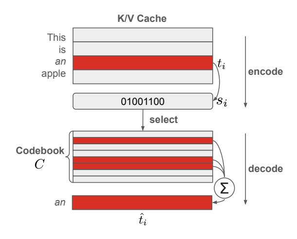

# 3.1. Self-Attention and KV Cache

Self-attention is the fundamental building block of LLMs. It takes query (Q), key (K), and value (V) matrices as inputs and produces an output (O) with the same shape as Q. The causal attention mask used in self-attention allows us to cache the key and value matrices, significantly speeding up token generation. During LLM inference, the process is divided into two stages:

**Prefilling Stage.** At this stage, given the input prompt, the attention output is computed while simultaneously generating the KV cache. Given the hidden states of the prompt,  $X \in \mathbb{R}^{N \times d}$ , where N is the number of tokens, and d is the hidden size, the Q, K, and V matrices, as well as the self-attention output, are computed as follows:

$$Q = XW_Q, \quad K = XW_K, \quad V = XW_V$$
 
$$Self-Attn = Softmax \left(\frac{QK^T}{\sqrt{d}}\right)V$$

Here,  $W_Q$ ,  $W_K$ , and  $W_V \in \mathbb{R}^{d \times d}$  are the projection matrices for the query, key, and value, respectively. The computed K and V matrices are then cached for use in the subsequent decoding stage.

**Decoding Stage.** During this stage, the KV cache is reused for self-attention computations. Given the current input hidden state  $x \in \mathbb{R}^{1 \times d}$ , the KV cache is updated as follows:

$$K \leftarrow \operatorname{Concat}(K, xW_K), V \leftarrow \operatorname{Concat}(V, xW_V)$$
 (2)

The updated KV cache is then used to compute the selfattention output, following the same equation as in Eqn. 1:

$$Q = xW_Q$$
 Self-Attn = Softmax  $\left(\frac{QK^T}{\sqrt{d}}\right)V$  (3)

The prefilling stage occurs once to process the input tokens and generate the first output token. This is followed by multiple iterations of the decoding stage, which produces all subsequent output tokens.

#### 3.2. Rotary Position Embedding

Positional encoding is added to the query (Q) and key (K) matrices to encode token position information during self-attention computation. Recent open-source LLMs, such as LLaMA (Dubey et al., 2024), Mistral (Jiang et al., 2023), and Qwen (Yang et al., 2024), commonly utilize Rotary Position Embedding (RoPE) (Su et al., 2024) for this purpose:

$$q_m \leftarrow q_m R_m, \quad k_m \leftarrow k_m R_m$$
 (4)

where  $q_m, k_m \in \mathbb{R}^{1 \times d}$  represent the query and key vector for the  $m^{\text{th}}$  token, respectively, while  $R_m \in \mathbb{R}^{d \times d}$  denotes the RoPE matrix applied to the  $m^{\text{th}}$  token. RoPE matrix is a sparse matrix with nonzero values only in its  $2 \times 2$  diagonal blocks. Therefore, the application of RoPE can be reformulated by first dividing the  $k_m$  vector (and similarly  $q_m$ ; here, we use  $k_m$  as an example) into multiple 2-dimensional sub-vectors:

$$k_m = [k_{1x}, k_{1y}, ..., k_{(d/2)x}, k_{(d/2)y}]$$
  
=  $[k_m^1, ..., k_m^{d/2}]$  (5)

where each 2-dimensional sub-vector  $k_m^i=(k_{ix},k_{iy})$  consists of two scalars within the  $k_m$  vector. The corresponding  $2\times 2$  diagonal sub-matrix of  $R_m$ , denoted as  $R_m^i\in\mathbb{R}^{2\times 2}$ , is then applied to each sub-vector  $k_m^i$ 

$$R_m^i = \begin{pmatrix} \cos m\theta_i & -\sin m\theta_i \\ \sin m\theta_i & \cos m\theta_i \end{pmatrix}$$

$$k_m^i \leftarrow k_m^i R_m^i$$
(6)

where  $\theta_i=10000^{-2(i-1)/d}$ . The  $2\times 2$  diagonal sub-matrix  $R_m^i$  is, in fact, a rotation matrix, which satisfies the following property:

**Property 1** (Commutativity): Let  $C \in \mathbb{R}^{2 \times 2}$  defined as

$$C = \begin{pmatrix} x & y \\ -y & x \end{pmatrix} \tag{7}$$

*The following commutativity holds:* 

$$R_m^i C = C R_m^i \tag{8}$$

This property shows that C and  $R_m^i$  are commutative under matrix multiplication. We leverage this key property to optimize our method in Sec. 4.2.

#### 4. Method

The KV cache is a dominant factor in long-context LLM inference scenarios, as storing and loading the large KV cache becomes a significant memory and latency bottleneck. Therefore, compressing the KV cache, even at the cost of additional encoding and decoding processes, is advantageous. Motivated by vector quantization, a classical quantization technique from signal processing, and particularly inspired by its recent variant, additive quantization (Babenko & Lempitsky, 2014), we adopt a similar approach to quantize each vector in the KV cache into a compressed representation using a learned encoder and codebook, as described in Sec. 4.1.

To efficiently integrate vector quantization into self-attention while minimizing the computational overhead introduced by the additional decoding process, we innovatively reformulate the self-attention computation by designing a RoPE-commutative codebook and reordering the matrix multiplications involved in self-attention. This refinement enables a large portion of computation reuse and significantly reduces the computational cost of our method, as detailed in Sec. 4.2.

### 4.1. Learning Additive Quantization for KV Cache

Additive quantization (Babenko & Lempitsky, 2014) aims to represent a given d-dimensional vector as the element-wise

Figure 1. An illustration of vector quantization for KV cache compression. Each vector in the KV cache, corresponding to a token, is first encoded into a low-bitwidth representation, significantly reducing storage size. This process is applied to all vectors in the KV cache individually. When needed, the compressed representations are loaded and decoded back to the original KV cache using a codebook.

summation of several vectors from a learned codebook C. For simplicity, we adopt a per-token quantization scheme for both the key and value matrices, meaning that the d-dimensional key and value vectors are quantized individually for each token.

Inspired by additive quantization, our method incorporates a learned encoder E to **encode** the given d-dimensional vector into a binary sequence, consisting of 0s and 1s, of length  $N_c$ , and a codebook  $C \in \mathbb{R}^{N_c \times d}$  to **decode** the original vector back using a simple matrix multiplication, as illustrated in Figure 1.

**Encoding.** Given a key or value vector for the  $i^{th}$  token,  $t_i \in \mathbb{R}^d$ , we use an encoder E to encode this vector into a quantized vector  $s_i \in \{0,1\}^{N_c}$ , namely  $s_i = E(t_i)$ . In our implementation, the encoder E consists of a simple linear layer followed by an activation function, and then another linear layer for output. Gumbel-softmax (Jang et al., 2016) is used to make the encoder end-to-end differentiable. The encoding step takes place after the generation of the KV cache, and the quantized vector  $s_i$  for each token is concatenated and stored together to form the quantized KV cache S.

**Decoding.** When loading the KV cache, the quantized KV cache S is retrieved. For each token's  $s_i$ , we perform a simple matrix multiplication with the codebook C to reconstruct the decoded tensor  $\hat{t}_i$ :

$$\hat{t}_i = s_i C \tag{9}$$

The decoded key and value can then participate in the sub-

sequent computations in the self-attention mechanism.

The encoder E and codebook C are optimized via gradient descent to minimize the MSE loss between the original tensor  $t_i$  and its decoded counterpart  $\hat{t}_i$ .

KV Cache Reduction Analysis. The size of the original FP16 KV cache for each layer can be calculated as  $B \times N \times d \times 2 \times 16$  bits, where B is the batch size, N is the number of tokens and d is the hidden size. After quantization, the size of the quantized KV cache for each layer becomes  $B \times N \times N_c \times 2 \times 1$  bits. Therefore, the reduction rate RR can be expressed as  $1 - \frac{N_c}{16d}$ . Subsequently, the average bit width used to represent each scalar in the KV cache is:

**Avg. bit** = 
$$16 - 16 \times RR = \frac{N_c}{d}$$
 (10)

For instance, the hidden size d for the key and value for a LLaMA-3.1-8B-Instruct model is 1024. If we set  $N_c$  to 1024, the reduction rate will be  $\frac{15}{16}$ , which is equivalent to 1-bit quantization. We will use **Avg. bit** as the metric to measure the compression rate in our experiment section. A lower **Avg. bit** indicates a higher compression rate and more reduced GPU memory usage compared to FP16.

Computation Complexity. The computational overhead arises from both encoding and decoding the KV cache. Since the KV cache only needs to be encoded once, the primary source of computational overhead comes from decoding the full KV cache each time it is used during the generation of the next token.

The computation for self-attention with KV cache decoding during inference step t can be summarized as:

$$q \leftarrow qR_t$$
 (11)

$$K \leftarrow \begin{bmatrix} s_0 C_K R_0 \\ s_1 C_K R_1 \\ \dots \\ s_{N-1} C_K R_{N-1} \end{bmatrix}$$
 (12)

$$V \leftarrow S_V C_V \tag{13}$$

$${\rm Self-Attn} = {\rm Softmax} \Big( \frac{qK^T}{\sqrt{d}} \Big) V \tag{14}$$

where  $q \in \mathbb{R}^{1 \times d}$  is the current query, N is the number of tokens generated so far,  $S_V \in \{0,1\}^{N \times N_c}$  are the quantized value,  $s_i \in \{0,1\}^{N_c}$  is the quantized vector for token- $i^{th}$  key,  $C_K, C_V \in \mathbb{R}^{N_c \times d}$  are the codebook for the key and value, respectively, and  $R_i$  denote the RoPE matrix for  $i^{th}$  token. The computational complexity can be expressed as:

$$O((2d+1)N + 2dN_cN)$$
 (15)

where d is the hidden dimension, N is the number of tokens, and  $N_c$  is the number of rows in the codebook. The first

term in Eqn. 15 corresponds to the computation for Eqn. 14, which represents vanilla self-attention. The second term,  $2dN_cN$ , accounts for the KV cache decoding process for the key and value, where each contributes  $dN_cN$ .

Comparing the first and second terms in Eqn. 15, we see that the computational overhead from the additional vector quantization decoding process is  $N_c$  times higher than that of vanilla self-attention. This increase arises from the need to first sum a large number of rows in the codebook to reconstruct the decoded vector, after which the decoded vector can participate in the self-attention computation. The overhead is particularly significant because  $N_c$  is typically large (e.g., 1024 for 1-bit quantization in LLaMA-3.1 8B model).

In the next section, we introduce our novel redesign, which leverages commutative codebooks to more efficiently integrate vector quantization with self-attention. This method will significantly reduce the overall computational overhead.

#### 4.2. Commutative Codebook for Efficiency

To simplify notation, we focus on the calculation within the softmax and ignore the  $\sqrt{d}$  constant:  $\alpha = qK^T$ , where the output  $\alpha$  is an N-dimensional vector. Each scalar entry  $\alpha_i$  in  $\alpha$  is computed as:

$$\alpha_i = qR_t(s_i C_K R_i)^T = (qR_t)R_i^T C_K^T s_i^T \tag{16}$$

where  $R_t$  denotes the RoPE matrix for the query,  $R_i$  denotes the RoPE matrix for the  $i^{th}$  key, and  $s_i$  is the quantized vector for the  $i^{th}$  key. Notice that  $qR_t$  and  $C_K$  remain unchanged as i varies. If  $R_i$  were independent of i as well, then the computation of  $(qR_t)R_i^TC_K^T$  would only need to be performed once across different i, significantly reducing the computational cost. Unfortunately, since  $R_i$  varies with i, such a reduction is not possible.

However, if we could design the codebook  $C_K$  to be commutative with  $R_i$ , then the right-hand-side of Eqn. 16 could be rewritten as  $(qR_t)C_K^TR_i^Ts_i^T$ , which makes the bulk of computation,  $(qR_t)C_K^T$ , independent of i and thus reusable, leading to substantial computational savings.

Next, we discuss how to define our new commutative code-book  $\mathcal{C}_K$  as well as how to learn it.

**Designing a Commutative Codebook.** As explained in Sec. 3.2, since the RoPE matrix is block-diagonal, we can break the problem into 2-dimensional subspaces and design the commutative codebook within each block. Formally, as defined in Eqns. 5 and 6,  $k_i^j$  and  $R_i^j$  represent the j-th 2-dimensional sub-vector/sub-matrix of  $k_i$  and  $R_i$ , respectively. Extending **Property 1**, we can obtain a design for a sub-space codebook.

Specifically, let  $\mathcal{C}_K^{\mathfrak{I}}$  be a set of codebooks for subspace j of

the key vector, i.e.,

$$C_K^j = \{C_K^{j0}, C_K^{j1}, \dots, C_K^{j(N_{c'}-1)}\}$$
(17)

where  $N_{c'}$  is the number of quantization levels, and each  $C_K^{jl}$  is a  $2\times 2$  matrix that satisfies the form defined in Eqn. 7, and thus has the commutative property  $R_i^j C_K^{jl} = C_K^{jl} R_i^j$ .

The quantized vector for  $k_i^j$ , denoted as  $s_i^j$ , is a 2-dimensional vector taking the values from  $\{0,\ldots,N_{c'}-1\}$ . The decoded key is represented as

$$\hat{k}_i^j = \sum_{l=0}^{N_{c'}-1} [s_i^j = l] C_K^{jl}$$
 (18)

where  $[s_i^j = l]$  is a 2-dimensional boolean indicator vector, with each dimension equal to 1 if the corresponding dimension of  $s_i^j$  is equal to l, and 0 otherwise.

Notice that the decoding scheme in Eqn. 18 is more complicated than previously discussed (Eqn. 9). This is because previously we used the same codebook for all the dimensions, but now the codebook for different dimensions is different. Please refer to Appendix A.1 for more explanations.

With the new decoding scheme, the benefit of commutativity remains. To see this, notice that Eqn. 16 should now be rewritten as

$$\alpha_{i} = \sum_{j} (q^{j} R_{t}^{j}) (\hat{k}_{i}^{j} R_{i}^{j})^{T}$$

$$= \sum_{j} (q^{j} R_{t}^{j}) (\sum_{l} [s_{i}^{j} = l] C_{K}^{jl} R_{i}^{j})^{T}$$

$$= \sum_{j,l} (q^{j} R_{t}^{j}) R_{i}^{jT} C_{K}^{jlT} [s_{i}^{j} = l]^{T}$$

$$= \sum_{j,l} (q^{j} R_{t}^{j}) C_{K}^{jlT} R_{i}^{jT} [s_{i}^{j} = l]^{T}$$
(19)

The first equality decompose the inner products into those of the sub-vectors; the last equality applies the commutativity property, making  $(q^jR_t^j)C_K^{jlT}$  reusable across i.

**Learning the Codebook.** The codebook is learned by minimizing the reconstruction error:

$$\min_{\cup_i (\mathcal{C}_K^j, s_i^j)} \sum_i \|\hat{k}_i^j - k_i^j\|^2, \text{s.t. Eqn. 18} \tag{20}$$

This is a canonical clustering objective and can be efficiently solved via an EM-like algorithm, where the E-step minimizes over  $s_i^j$  holding  $\mathcal{C}_K^j$  fixed, and the M-step minimizes over  $\mathcal{C}_K^j$  holding  $s_i^j$  fixed, as described in **Algorithm 1**. More details can be found in Appendix A.2, including the actual update formula and the techniques used to stabilize the optimization process.

Algorithm 1 EM Algorithm for Learning RoPE Commutative Codebook.

- 1: **Input:** A calibration set  $K \in \mathbb{R}^{N \times 2}$
- 2: **Parameters:** codebook  $C_K^{\jmath}$
- 3: **Goal:** Optimize  $C_K^j$  to minimize the clustering error over calibration set K.
- 4: while  $\mathcal{C}_K^{\jmath}$  converges do
- 5: **E Step:** Fix  $C_K^j$ , update the assignment S such that each  $k \in K$  is assigned to its nearest clustering center.
- 6: **M Step:** Fix S, update  $C_K^{\jmath}$  such that the MSE loss between each k and its assigned clustering center is minimized.

