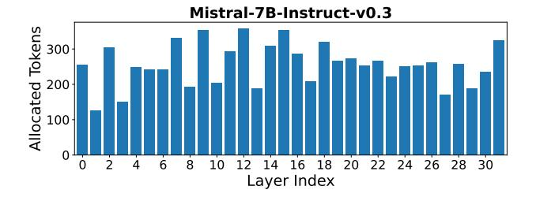

# Algorithm 1: Error-aware Layer-adaptive Cache Allocation

**Require:** Scores  $\tilde{\mathbf{e}}$ , total budget  $B_{\text{total}}$ , per-layer bounds [m, M]

```
Ensure: Allocations B
  1: B_i \leftarrow m, \forall i
 2: R \leftarrow B_{\text{total}} - \sum_{i} B_{i}

3: B_{i} \leftarrow \text{clip}(B_{i} + \text{round}(\tilde{e}_{i} \cdot R), m, M), \forall i

4: \Delta \leftarrow B_{\text{total}} - \sum_{i} B_{i}

5: while \Delta \neq 0 do
  6:
             if \Delta > 0 then
  7:
                   \mathcal{L} \leftarrow \{i \mid B_i < M\}
                   if \mathcal{L} = \emptyset then
  8:
  9:
                        Break
10:
                   end if
                   j \leftarrow \arg\max_{i \in \mathcal{L}} \tilde{e}_i, B_j \leftarrow B_j + 1, \Delta \leftarrow \Delta - 1
11:
12:
                   \mathcal{L} \leftarrow \{i \mid B_i > m\}
13:
                   if \mathcal{L} = \emptyset then
14:
15:
                        Break
16:
                   end if
                   j \leftarrow \arg\min_{i \in \mathcal{L}} \tilde{e}_i, B_j \leftarrow B_j - 1, \Delta \leftarrow \Delta + 1
17:
19: end while
20: return B
```

### C Head visualization

In Figures 11 and 12, we present a comparison between traditional Retrieval Heads and Semantic Retrieval Heads identified using Mistral-7B-Instruct-v0.3 and Llama-3.1-8B-Instruct. All scores are L1-normalized across the attention head importance distributions. Unlike traditional

| Dataset             | Source            | Task Type          | Avg Len | Metric         | Language       | # Samples |
|---------------------|-------------------|--------------------|---------|----------------|----------------|-----------|
| NarrativeQA         | Literature, Film  | Single-Document QA | 18,409  | F1             | English        | 200       |
| Qasper              | Science           | Single-Document QA | 3,619   | F1             | English        | 200       |
| MultiFieldQA-en     | Multi-field       | Single-Document QA | 4,559   | F1             | English        | 150       |
| HotpotQA            | Wikipedia         | Multi-Document QA  | 9,151   | F1             | English        | 200       |
| 2WikiMultihopQA     | Wikipedia         | Multi-Document QA  | 4,887   | F1             | English        | 200       |
| MuSiQue             | Wikipedia         | Multi-Document QA  | 11,214  | F1             | English        | 200       |
| GovReport           | Government report | Summarization      | 8,734   | Rouge-L        | English        | 200       |
| QMSum               | Meeting           | Summarization      | 10,614  | Rouge-L        | English        | 200       |
| MultiNews           | News              | Summarization      | 2,113   | Rouge-L        | English        | 200       |
| TREC                | Web question      | Few-shot Learning  | 5,177   | Accuracy (CLS) | English        | 200       |
| TriviaQA            | Wikipedia, Web    | Few-shot Learning  | 8,209   | F1             | English        | 200       |
| SAMSum              | Dialogue          | Few-shot Learning  | 6,258   | Rouge-L        | English        | 200       |
| PassageCount        | Wikipedia         | Synthetic Task     | 11,141  | Accuracy (EM)  | English        | 200       |
| PassageRetrieval-en | Wikipedia         | Synthetic Task     | 9,289   | Accuracy (EM)  | English        | 200       |
| LCC                 | Github            | Code Completion    | 1,235   | Edit Sim       | Python/C#/Java | 500       |
| RepoBench-P         | Github repository | Code Completion    | 4,206   | Edit Sim       | Python/Java    | 500       |

Table 4: An overview of the dataset statistics in LongBench.

methods that require exact top-k attention hits, our approach aggregates scores over entire answer spans, capturing heads that contribute semantically relevant context even when they never achieve top-1 attention for individual tokens, thus significantly reducing zero-score heads. For instance, as shown in Figure 11, layers 0 and 1 of the Mistral model have zero scores for all heads using the traditional method, whereas our approach successfully identifies heads of lower yet meaningful importance. Likewise, Figure 12 shows that Llama layer 4 head 16 and layer 26 head 3—missed by the standard criterion—are successfully identified by our Semantic Retrieval Heads (similar behavior is observed for Mistral's layer 7 head 18). These examples highlight our method's superior ability to detect Semantic Retrieval Heads—patterns that traditional approaches miss.



Figure 9: Per-layer KV cache allocation for Mistral-7B-Instruct-v0.3 under a total budget of 256 tokens per layer.

