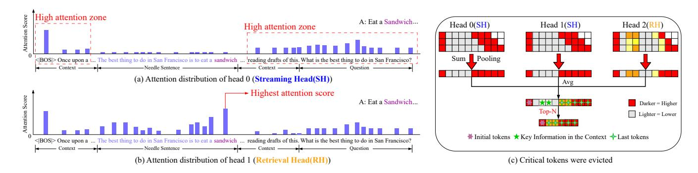
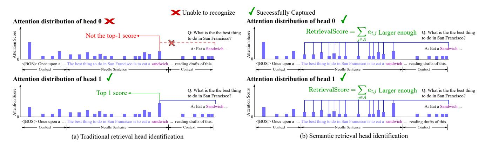

# CompressKV: Semantic Retrieval Heads Know What Tokens are Not Important Before Generation

Xiaolin Lin1 , Jingcun Wang1 , Olga Kondrateva1 , Yiyu Shi2 , Bing Li3 , Grace Li Zhang1

1Technical University of Darmstadt 2University of Notre Dame 3University of Siegen xiaolin.lin@tu-darmstadt.de, jingcun.wang@tu-darmstadt.de, olga.kondrateva@tu-darmstadt.de, yshi4@nd.edu, bing.li@uni-siegen.de, grace.zhang@tu-darmstadt.de

#### Abstract

Recent advances in large language models (LLMs) have significantly boosted long-context processing. However, the increasing key-value (KV) cache size poses critical challenges to memory and execution efficiency. Most KV cache compression methods rely on heuristic token eviction using all attention heads in Grouped Query Attention (GQA)-based LLMs. This method ignores the different functionalities of attention heads, leading to the eviction of critical tokens and thus degrades the performance of LLMs.

To address the issue above, instead of using all the attention heads in GQA-based LLMs to determine important tokens as in the previous work, we first identify the attention heads in each layer that are not only capable of retrieving the initial and final tokens of a prompt, but also capable of retrieving important tokens within the text and attending to their surrounding semantic context. Afterwards, we exploit such heads to determine the important tokens and retain their corresponding KV cache pairs. Furthermore, we analyze the cache eviction error of each layer individually and introduce a layer-adaptive KV cache allocation strategy. Experimental results demonstrate the proposed CompressKV consistently outperforms state-of-the-art approaches under various memory budgets on LongBench and Needle-in-a-Haystack benchmarks. Notably, it retains over 97% of full-cache performance using only 3% of KV cache on LongBench's question-answering tasks and achieves 90% of accuracy with just 0.07% of KV storage on Needle-in-a-Haystack benchmark. Our code is publicly available at: https://github.com/TUDa-HWAI/CompressKV.git.

### Introduction

Recent advances in large language models (LLMs) (Achiam et al. 2024; Anthropic 2024; Dubey et al. 2024; Hui et al. 2025; Wang et al. 2025) have boosted their long-context processing capabilities. However, with the increasing length of texts, the resulting key-value (KV) cache size grows linearly. The large KV cache leads to slow inference due to the attention calculation across past KV cache. In addition, the large KV cache requires substantial memory storage, which creates a major bottleneck in the deployment of long-context LLMs. Therefore, effective compression of KV cache is essential for optimizing the computational efficiency and model scalability.

State-of-the-art KV cache compression focuses on quantization, low-rank approximation, and KV cache eviction (Liu et al. 2024; Kang et al. 2024; Ge et al. 2024; Xiao et al. 2024; Li et al. 2024; Cai et al. 2025; Yang et al. 2024; Qin et al. 2025). Among such techniques, KV cache eviction strategy where KV pairs corresponding to those unimportant tokens are eliminated and the remaining KV pairs are kept has started to draw more and more attention.

There are different criteria to determine unimportant tokens for KV cache compression. For example, StreamingLLM (Xiao et al. 2024) retain the first and last tokens and neglects potentially important tokens in the middle of the prompt. SnapKV (Li et al. 2024) clusters recent attention scores within an observation window at the end of the prompt, either per head or per head group, to identify and retain the important tokens receiving the highest attention values. CAKE (Qin et al. 2025) extends SnapKV's method by adding the attention variance in an observation window to the eviction score, enabling it to capture tokens whose importance fluctuates over time.

The criteria described above are effective in many scenarios in compressing KV cache. However, they treat all heads equally without examining their distinct functionalities, so that they use the sum of the attention scores across all the attention heads to make decisions on KV cache eviction. In fact, attention heads exhibit different functionalities. For example, in Grouped Query Attention (GQA) based LLMs (Ainslie et al. 2023), some attention heads, called Streaming Heads, exclusively focus on the beginning and the end of a prompt (Xiao et al. 2024, 2025)). When the attention heads within a GQA group are dominated by Streaming Heads, those heads have the largest influence on KV cache eviction, resulting in only the initial and last tokens' KV pairs being retained. This leads to the eviction of crucial tokens in the middle of a prompt and thus degrades the performance of LLMs.

Besides eliminating KV pairs for those unimportant tokens, state-of-the-art research also allocates specified memory budgets to layers. For example, (Xiao et al. 2024; Li et al. 2024) allocates each layer to a fixed number of KV pairs without considering layer difference. (Yang et al. 2024; Cai et al. 2025; Qin et al. 2025) allocates KV cache budget across layers based on attention distributions or layer-wise statistics such as attention entropy or variance, which often require additional online computation cost. Moreover, since attention distributions can vary significantly across different models, limiting their generalization ability and effectiveness.

In this paper, we observe that certain attention heads are capable of retrieving important tokens within the text and attending to their surrounding semantic context. We refer to these heads as Semantic Retrieval Heads. Motivated by this observation, we identify such Semantic Retrieval Heads in each layer and use them to determine the crucial tokens and share a unified set of crucial token indices across all heads within that layer. This approach can substantially address the dominance of Streaming Heads in KV cache evictions, so that it can enhance the performance of GQA-based models. Furthermore, we analyze the cache eviction error of each layer individually and introduce a layer-adaptive KV cache allocation strategy. Our contributions are as follows:

- (1) We identify which attention heads are Semantic Retrieval Heads capturing both copy-and-paste and semantic information. Such heads are used to determine unimportant tokens for KV cache eviction. Our experimental results demonstrate Semantic Retrieval Heads know what tokens are unimportant before generation.
- (2) We estimate each layer's compression impact by computing the Frobenius norm of the difference between its attention-block outputs with the compressed cache and those with the full cache, during the decoding stage. Cache budgets are then proportionally assigned across layers, prioritizing layers with higher errors. Importantly, this analysis is performed offline and does not introduce any additional overhead during online inference.
- (3) CompressKV is validated on multiple LLMs using LongBench and Needle-in-a-Haystack (NIAH). On Long-Bench, CompressKV maintains over 99% of full-cache performance with only 19% of KV entries and retains 97% of question-answering accuracy using just 3% of the cache. On Needle-in-a-Haystack retrieval benchmark, it achieves 90% of the baseline accuracy with only 0.07% of KV storage.

#### **Background and Related Work**

#### **KV-Cache Basics**

The motivation of KV cache is to reduce the signification computation cost of attention evaluation. To explain this, consider the case of a single attention head. This attention head can be evaluated with weight matrices, denoted as  $\mathbf{W_Q}$ ,  $\mathbf{W_K}$ ,  $\mathbf{W_V} \in \mathbb{R}^{d \times d}$ , and a prompt, denoted as  $\mathbf{X} \in \mathbb{R}^{l \times d}$ , where where l is the sequence length and d the hidden dimension. The attention evaluation includes two phases, i.e., prefilling phase and decoding phase.

Prefilling Phase: in this phase, the query  $\mathbf{Q}$ , key  $\mathbf{K}$ , and value  $\mathbf{V}$  are evaluated with the entire input embeddings as follows

$$Q = XW_{Q}, K = XW_{K}, V = XW_{V}$$
 (1)

With K, V and Q, the output of the attention can be evaluated as follows

$$\mathbf{O} = \operatorname{Softmax}(\mathbf{Q} \mathbf{K}^{\top}) \mathbf{V}$$
 (2)

The key K and the value V are then stored in cache memory, which is also called KV cache. *Decoding Phase*: In this

phase, the previously stored KV cache is used to generate new tokens and the newly generated KV pair is then appended to the previously stored KV cache to refresh KV cache. Specifically, at a decoding step t, given a new token embedding  $x_t \in \mathbb{R}^{1 \times d}$ , we first evaluate the newly generated KV pairs with this new token as follows

$$\mathbf{k_t} = x_t \, \mathbf{W_K}, \quad \mathbf{v_t} = x_t \, \mathbf{W_V}. \tag{3}$$

Afterwards, we use such new KV pairs to update the cache via

$$\mathbf{K} \leftarrow Concat[\mathbf{K}, \mathbf{k_t}], \mathbf{V} \leftarrow Concat[\mathbf{V}, \mathbf{v_t}].$$
 (4)

In GQA-based LLMs, query heads in a layer are partitioned into multiple groups. Multiple query heads within the same group share the same KV cache. The shared key and value are evaluated once per group and reused to produce the output of each head in the group. Although KV caching removes the need to recompute keys and values at every step, the cache itself grows linearly with prompt sequence length, becoming especially problematic for long-text tasks.

**KV Cache Compression** To alleviate the burden of KV cache storage, various KV cache compression methods, e.g., quantization (Liu et al. 2024), low-rank approximations (Kang et al. 2024), and KV cache eviction strategy have been proposed. In particular, KV cache eviction reduces cache size by removing KV cache pairs of unimportant tokens without retraining. There are different eviction strategies. For example, StreamingLLM (Xiao et al. 2024) focuses solely on retaining the first and last tokens, which only addresses the Streaming Head scenario and neglects potentially important tokens in the middle of the sequence. To overcome this limitation, more advanced methods have been proposed(Liu et al. 2023; Zhang et al. 2023; Li et al. 2024; Han et al. 2024; Oren et al. 2024). A representative example is SnapKV (Li et al. 2024), which clusters recent attention scores, either per head or per head group to identify important token and retain the KV cache pairs of such tokens. Besides, recent approaches, including PyramidKV (Cai et al. 2025), D2O (Wan et al. 2025), and CAKE (Oin et al. 2025), dynamically allocate cache budgets based on attention statistics or modeled attention dynamics of all the layers in an LLM. Their selection strategies for important tokens are an extended version of SnapKV's eviction strategy.

The KV cache eviction approaches above have two major limitations. First, they treat all attention heads equally, ignoring their functional heterogeneity; Recent work (Olsson et al. 2022; Kwon et al. 2022; Zheng et al. 2024; Ren et al. 2024; Wu et al. 2025; Todd et al. 2024; Yin and Steinhardt 2025) has shown that different attention heads have distinct roles. For example, some attention heads, called Streaming Heads in the state-of-the-art research, always focus on the beginning and the end of a prompt. For example, in Figure 1(a), head 0 is such a Streaming Head since the attention scores of the initial token and the last tokens are larger than the remaining tokens. On the contrary, some attention heads, called Retrieval heads in Wu et al. (2025), exhibit copy-and-paste behaviors for long-context scenarios. For example, in Figure 1(b), head 1 is such a retrieval head since

Figure 1: Motivation. (a) The attention score distribution of a streaming head (SH). (b) The attention score distribution of a retrieval head (RH). (c) Streaming attention heads in a GQA group dominate the token eviction, indicating only initial and final tokens are remained. The critical tokens are evicted.

the attention scores of the correct answer "sandwich" are larger. In GQA-based LLMs, Streaming Heads tend to have larger effect than the other heads for KV cache eviction, which indicates only KV cache pairs corresponding to initial and last tokens are retained. This leads to the eviction of crucial tokens in the middle of a prompt and thus degrades the performance of LLMs. Figure 1(c) illustrates such an example, where Streaming Heads including head0 and head1 dominate token eviction for KV cache compression.

Second, the layer budget allocation in the previous work typically relies on attention distributions or layer-wise statistics such as attention entropy or variance, which often require additional online computation. Moreover, since attention distributions can vary significantly across different models, directly adopting a fixed allocation strategy according to attention distributions may not yield optimal results.

#### CompressKV

CompressKV includes three key components: (1) Identification of the attention heads that are capable of retrieving important tokens within the text and attending to their surrounding semantic context. (2) Important token selection driven by such identified heads. (3) Error-aware layer-adaptive cache allocation. In the following subsections, we will first explain our observations and insights into identification of attention heads with specified functionalities. Afterwards, we will take advantage of such heads to select tokens for KV cache eviction. Furthermore, different cache budgets will be allocated to different layers.

#### **Observations and Insights**

To avoid that streaming attention heads dominate the KV cache eviction as illustrated in Figure 1(c), intuitively, retrieval heads instead of all the attention heads can be used to identify important tokens for KV cache eviction. However, the state-of-the-art research on identification of Retrieval Heads consider only those attention heads, the highest attention score of which aligns exactly with the correct token answer during generation, as retrieval attention heads. Such retrieval attention heads exhibits copy-and-paste behaviors. However, such an identification might lose some attention

heads that are capable of retrieving important tokens within the text and attending to their surrounding semantic context.

Figure 2(a) illustrates an example to explain the drawback of the state-of-the-art identification technique of retrieval heads. Head 0 is not considered as Retrieval Head since its highest attention score does not falls on the "sandwich" token in the needle sentence when generating "sandwich". Head 1 is considered as the Retrieval Head. However, sum of the attention scores surrounding "sandwich" in head 0 is still large, which indicate that it is still capable of retrieving important tokens within the text and attending to their surrounding semantic context.

In long-context scenarios, the attention distribution is particularly sparse, with a substantial amount of attention often allocated to initial tokens and trailing tokens. As a result, traditional identification methods of Retrieval Heads that rely on top-1 or top-k matches exhibit extremely low hit rates, causing most retrieval scores to be zero. Moreover, these metrics capture only copy-and-paste behaviors and ignore deeper semantic dependencies. For example, as shown in Figure 2(a), when generating "sandwich," the model attends not only to "sandwich" itself but also to related tokens like "eat" or "a thing." Under a strict top-1/top-k criterion, such attentions may not be credited. Accordingly, the identification of retrieval attention heads is not effective.

To address the issue above, we propose a new standard to identify the heads that capture not only copy-and-paste behaviors and but also deeper semantic dependencies. We call such attention heads as Semantic Retrieval Heads. We use such heads to identify important tokens for KV cache eviction.

#### **Semantic Retrieval Head Identification Standards**

Instead of requiring exact top-k hits in the traditional Retrieval Head identification, we aggregate a head's attention scores over the entire answer span inserted into a long context whenever the model generates a correct answer token as the score of this head. This evaluation is expressed with the

Figure 2: Illustration of Semantic Retrieval Head identification versus traditional Retrieval Head selection. Semantic Retrieval Heads capture attention over the entire answer span, addressing the limitations of traditional methods that rely solely on copyand-paste behavior.

following equation as follows

SemanticRetrievalScore(h) = 
$$\sum_{t=1}^{N} \mathbb{I}[y_t \in A] \sum_{j \in A} a_{t,j}^h$$
 (5)

where  $y_t$  is the generated token at step t, A is the answer span, and  $a_{t,j}^h$  is head h's attention weight on the j-th token of A. The higher the score of a head is, the more capable of capturing semantic information this head is.

Figure 2(b) illustrates the concept of this new identification standard. By summing over the entire span, we can capture attention heads that contribute semantically relevant context even when they never achieve top-1 attention on a single token, dramatically reducing the fraction of zero-score heads. Aggregation over multiple tokens enables the method to recognize heads that attend to semantic cues—such as "eat" or "a thing" around "sandwich"—rather than only pure copy-and-paste patterns. For example, head 0 in Figure 2 is considered as Semantic Retrieval Head in our new standard although it is not considered as Retrieval Head in the traditional identification methods. For a visual comparison between Semantic Retrieval Heads and traditional Retrieval Heads, please refer to Appendix C

#### **Token Selection Driven by Semantic Retrieval Heads**

In GQA-based LLMs, for each layer, we will select top top-k Semantic Retrieval Heads with high scores defined with equation (5) as the criterion for selecting important tokens for KV cache eviction. All the attention heads within this layer share a common set of selected token indices determined by these top Semantic Retrieval Heads. This concept is illustrated in Figure 3, where a layer has two groups. In this example, head2 and head3 are top 2 Semantic Retrieval Heads. The attention score matrices of such heads are compressed by summing over the observation window and pooling across the token dimension. Afterwards, such compressed vectors are averaged. The tokens with the top N highest attention scores will be selected and their corresponding KV cache pairs will be retained. The KV cache

pairs for the remaining tokens will be evicted to compress KV cache.

#### **Error-Aware Layer-Adaptive Cache Allocation**

To maximize memory efficiency under strict budget constraints, we propose an error-aware and layer-adaptive cache allocation strategy. Instead of relying on attention statistics as in the previous methods, this approach quantifies the compression error caused by KV cache compression, using full-cache outputs as the reference. We specifically focus on the extreme compression setting, where only a small fraction of tokens are retained in each layer's KV cache. For each layer l and decoding step t, let  $\mathbf{O}_{\text{full},t}^l$  and  $\mathbf{O}_{\text{comp},t}^l$  denote the attention outputs using the full and compressed KV caches, respectively:

$$\mathbf{O}_{\text{full},t}^{l} = \mathbf{W}_{O}^{l} \text{ Attention} \left(\mathbf{Q}_{t}^{l}, \mathbf{K}_{\text{full}}^{l}, \mathbf{V}_{\text{full}}^{l}\right)$$
 (6)

$$\mathbf{O}_{\mathrm{comp},t}^{l} = \mathbf{W}_{O}^{l} \text{ Attention} \left( \mathbf{Q}_{t}^{l}, \mathbf{K}_{\mathrm{comp}}^{l}, \mathbf{V}_{\mathrm{comp}}^{l} \right)$$
 (7)

where  $\mathbf{W}_O^{(l)}$  is the output projection matrix of layer l,  $\mathbf{Q}_t^l$  is the query,  $\mathbf{K}^l$  is the key, and  $\mathbf{V}^l$  is the value representation at layer l. To evaluate the error incurred by compressing KV cache per layer, the error score for layer l is computed and normalized as:

$$e^{(l)} = \sum_{t=1}^{T} \frac{\left\| \mathbf{O}_{\text{comp},t}^{l} - \mathbf{O}_{\text{full},t}^{l} \right\|_{F}}{\left\| \mathbf{O}_{\text{full},t}^{l} \right\|_{F} + \epsilon}, \tilde{e}^{(l)} = \frac{e^{(l)}}{\sum_{k} e^{(k)}}$$
(8)

where T is the total number of decoding steps, $|\cdot|_F$  denotes the Frobenius norm and  $\epsilon$  is a small positive constant (e.g.,  $10^{-6}$ ) to prevent division by zero.

Given the normalized per-layer error scores  $\tilde{\mathbf{e}}$  and total cache budget  $B_{total}$ , we first assign a minimum allocation m and a maximum allocation M to each layer to avoid a layer either has no memory budget or a large memory budget. The remaining budget is distributed in proportion to the error scores. More details can be found in Appendix B.

Figure 3: Illustration of the token selection driven by Semantic Retrieval Heads.

