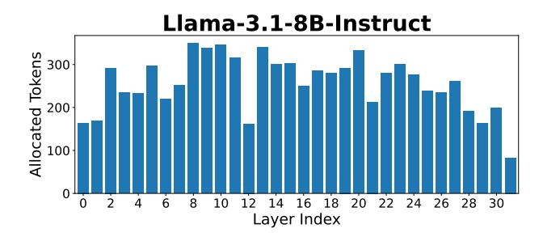
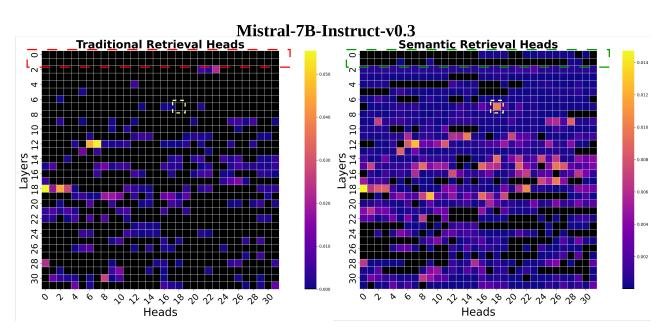
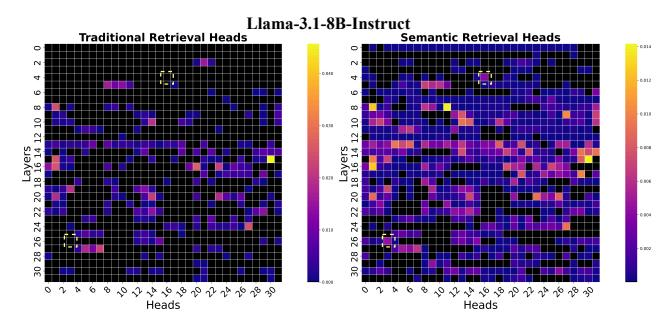

# D Comprehensive Results on the LongBench Dataset

In table 5, we provide the detailed results of Figure 4 in the main paper. Across every KV cache budget, CompressKV outperforms all baseline methods—an advantage

Figure 10: Per-layer KV cache allocation for Llama-3.1-8B-Instruct under a total budget of 256 tokens per layer.

Figure 11: Head visualization for Mistral-7B-Instruct-v0.3. Left: Traditional Retrieval Heads. Right: Semantic Retrieval Heads identified.

Figure 12: Head visualization for Llama-3.1-8B-Instruct. Left: Traditional Retrieval Heads. Right: Semantic Retrieval Heads identified.

that becomes especially pronounced under tight memory constraints (i.e., smaller cache sizes).

