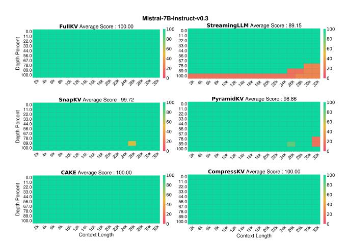
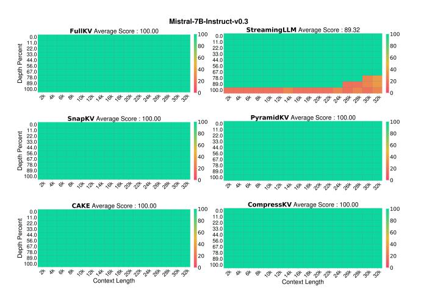
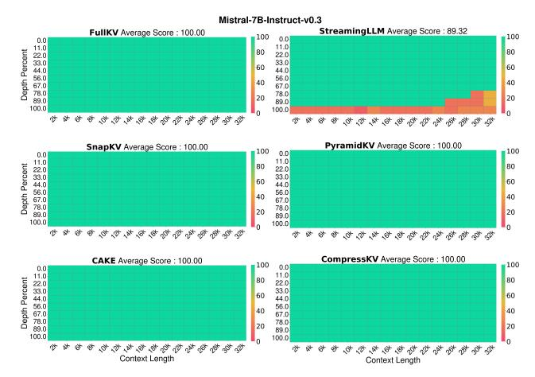
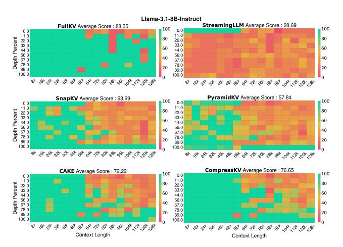
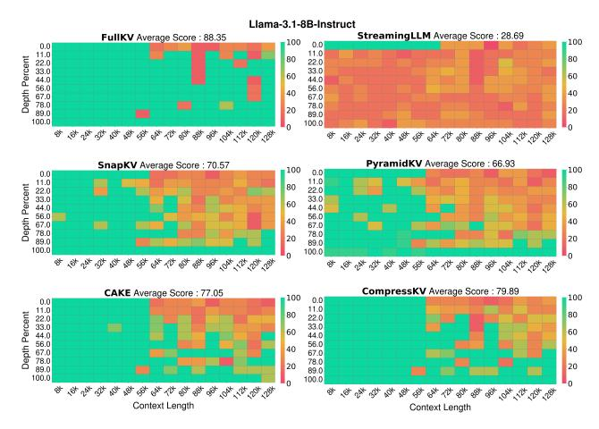
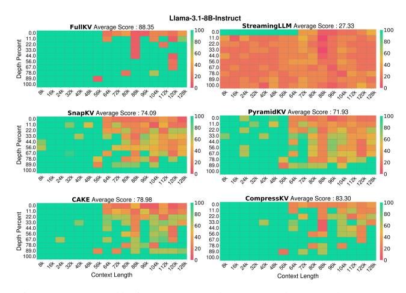
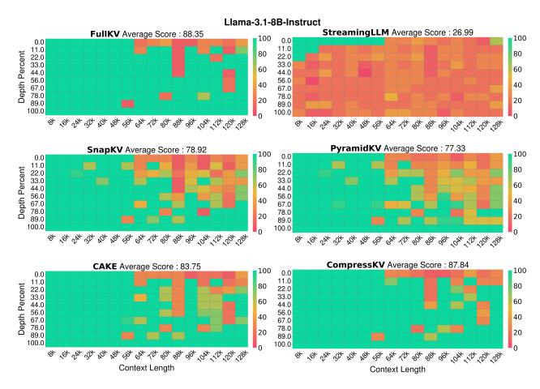

# E Detailed Results for Needle-in-a-Haystack Evaluation

This section provides detailed results for the Needle-ina-Haystack evaluation referenced in the main paper. Figures 13–17 present the performance of the Mistral-7B-Instruct-v0.3 model under KV cache budgets ranging from 128 to 2048. Figures 18–22 present the corresponding results for the Llama-3.1-8B-Instruct model under the same cache budgets. CompressKV consistently achieves the highest accuracy across all settings, demonstrating its superiority over competing compression strategies.

Figure 13: Needle-in-a-Haystack test results on Mistral-7B-Instruct-v0.3 with KV cache = 128.

Figure 14: Needle-in-a-Haystack test results on Mistral-7B-Instruct-v0.3 with KV cache = 256.

Figure 15: Needle-in-a-Haystack test results on Mistral-7B-Instruct-v0.3 with KV cache = 512.

Figure 16: Needle-in-a-Haystack test results on Mistral-7B-Instruct-v0.3 with KV cache = 1024.

| Method       | KV Size | Single-doc QA | Multi-doc QA | Summarization            | Few-shot Learning | Synthetic | Code  | Avg.  |
|--------------|---------|---------------|--------------|--------------------------|-------------------|-----------|-------|-------|
|              |         |               |              | Llama-3.1-8B-Instruct    |                   |           |       |       |
| FullKV       | Full    | 43.41         | 44.44        | 29.22                    | 69.48             | 52.75     | 60.06 | 49.08 |
| StreamingLLM | 2048    | 37.02         | 33.10        | 25.76                    | 56.57             | 38.74     | 44.51 | 38.99 |
| SnapKV       |         | 42.95         | 44.01        | 27.29                    | 69.02             | 52.75     | 60.09 | 48.47 |
| PyramidKV    |         | 42.85         | 44.19        | 26.93                    | 69.15             | 53.03     | 59.01 | 48.34 |
| CAKE         |         | 42.56         | 43.87        | 27.45                    | 68.67             | 52.84     | 59.45 | 48.26 |
| CompressKV   |         | 43.43         | 44.17        | 27.88                    | 69.11             | 52.75     | 60.02 | 48.71 |
| StreamingLLM | 1024    | 31.90         | 30.83        | 24.58                    | 53.81             | 44.39     | 39.57 | 36.96 |
| SnapKV       |         | 42.82         | 43.90        | 26.21                    | 67.91             | 52.81     | 58.53 | 47.82 |
| PyramidKV    |         | 42.80         | 43.86        | 25.74                    | 68.28             | 52.79     | 57.39 | 47.65 |
| CAKE         |         | 42.48         | 43.82        | 26.57                    | 68.57             | 52.84     | 58.76 | 47.97 |
| CompressKV   |         | 42.96         | 44.22        | 26.63                    | 68.72             | 52.75     | 59.38 | 48.24 |
| StreamingLLM | 512     | 29.07         | 30.11        | 23.16                    | 50.51             | 47.10     | 38.31 | 35.59 |
| SnapKV       |         | 41.03         | 44.02        | 24.70                    | 66.09             | 52.52     | 57.38 | 46.71 |
| PyramidKV    |         | 41.07         | 43.95        | 24.58                    | 66.09             | 52.79     | 55.58 | 46.49 |
| CAKE         |         | 41.86         | 43.38        | 25.47                    | 67.91             | 52.92     | 57.12 | 47.25 |
| CompressKV   |         | 42.78         | 44.29        | 25.36                    | 68.67             | 53.04     | 57.56 | 47.78 |
| StreamingLLM | 256     | 26.52         | 29.73        | 21.16                    | 47.60             | 47.06     | 36.83 | 33.92 |
| SnapKV       |         | 38.84         | 43.57        | 23.41                    | 63.40             | 52.63     | 55.21 | 45.21 |
| PyramidKV    |         | 37.28         | 43.41        | 23.04                    | 62.40             | 52.38     | 53.29 | 44.36 |
| CAKE         |         | 41.01         | 43.30        | 24.38                    | 66.02             | 52.82     | 55.56 | 46.30 |
| CompressKV   |         | 41.84         | 43.75        | 24.26                    | 66.52             | 52.82     | 56.29 | 46.71 |
| StreamingLLM | 128     | 25.51         | 29.46        | 19.25                    | 43.94             | 45.23     | 35.79 | 32.28 |
| SnapKV       |         | 34.84         | 42.90        | 21.62                    | 60.40             | 48.15     | 52.86 | 42.58 |
| PyramidKV    |         | 33.96         | 42.74        | 21.53                    | 59.32             | 50.25     | 49.62 | 42.02 |
| CAKE         |         | 39.46         | 42.47        | 23.08                    | 63.79             | 52.67     | 52.83 | 44.84 |
| CompressKV   |         | 39.10         | 43.67        | 22.68                    | 64.16             | 52.64     | 53.70 | 45.10 |
|              |         |               |              | Mistral-7B-Instruct-v0.3 |                   |           |       |       |
| FullKV       | Full    | 41.16         | 38.99        | 29.50                    | 70.70             | 52.00     | 60.03 | 47.82 |
| StreamingLLM | 2048    | 34.17         | 28.72        | 25.85                    | 53.99             | 38.50     | 39.47 | 36.51 |
| SnapKV       |         | 41.21         | 38.65        | 26.66                    | 70.18             | 51.50     | 59.87 | 47.05 |
| PyramidKV    |         | 40.54         | 38.69        | 26.70                    | 70.39             | 51.50     | 58.83 | 46.85 |
| CAKE         |         | 41.18         | 38.32        | 27.83                    | 70.24             | 51.50     | 59.96 | 47.22 |
| CompressKV   |         | 41.28         | 39.52        | 27.93                    | 70.58             | 51.50     | 59.97 | 47.55 |
| StreamingLLM | 1024    | 30.54         | 27.33        | 24.92                    | 53.62             | 36.94     | 36.26 | 34.73 |
| SnapKV       |         | 39.65         | 38.58        | 25.39                    | 70.32             | 51.75     | 59.22 | 46.49 |
| PyramidKV    |         | 39.42         | 37.96        | 25.05                    | 70.18             | 51.25     | 57.54 | 45.96 |
| CAKE         |         | 39.76         | 38.36        | 26.82                    | 69.96             | 51.50     | 59.40 | 46.66 |
| CompressKV   |         | 40.48         | 39.08        | 26.70                    | 70.47             | 51.25     | 59.35 | 46.96 |
| StreamingLLM | 512     | 25.96         | 26.68        | 23.40                    | 51.71             | 35.63     | 33.92 | 32.65 |
| SnapKV       |         | 38.87         | 37.74        | 23.66                    | 69.26             | 51.00     | 57.74 | 45.38 |
| PyramidKV    |         | 37.57         | 37.32        | 23.63                    | 68.85             | 51.00     | 56.47 | 44.82 |
| CAKE         |         | 39.73         | 38.73        | 25.32                    | 69.18             | 51.50     | 57.53 | 46.06 |
| CompressKV   |         | 40.41         | 38.45        | 25.10                    | 70.10             | 51.50     | 58.53 | 46.39 |
| StreamingLLM | 256     | 25.26         | 26.40        | 20.76                    | 49.37             | 34.50     | 32.58 | 31.22 |
| SnapKV       |         | 35.20         | 37.08        | 22.35                    | 67.72             | 51.00     | 55.59 | 43.76 |
| PyramidKV    |         | 34.73         | 36.80        | 21.89                    | 67.66             | 49.75     | 53.10 | 43.06 |
| CAKE         |         | 38.29         | 37.73        | 24.03                    | 67.81             | 50.00     | 56.06 | 44.73 |
| CompressKV   |         | 39.34         | 38.48        | 23.56                    | 69.99             | 50.50     | 55.89 | 45.43 |
| StreamingLLM | 128     | 23.47         | 25.96        | 18.82                    | 46.08             | 36.12     | 31.16 | 29.85 |
| SnapKV       |         | 32.40         | 36.51        | 20.54                    | 63.20             | 45.50     | 51.85 | 40.79 |
| PyramidKV    |         | 31.91         | 35.32        | 20.75                    | 62.48             | 47.50     | 49.13 | 40.29 |
| CAKE         |         | 35.88         | 37.69        | 22.69                    | 65.09             | 49.75     | 52.55 | 43.04 |
| CompressKV   |         | 37.47         | 37.61        | 21.96                    | 67.41             | 49.75     | 52.01 | 43.56 |

Table 5: Details Performance comparison of CompressKV with StreamingLLM, SnapKV, PyramidKV, CAKE, and FullKV on LongBench for Llama-3.1-8B-Instruct and Mistral-7B-Instruct-v0.3. CompressKV generally outperforms other KV cache compression methods across various KV cache sizes, from 128 to 2048 per layer.

Figure 17: Needle-in-a-Haystack test results on *Mistral-7B-Instruct-v0.3* with KV cache = 2048.

Figure 18: Needle-in-a-Haystack test results on Llama-3.1- 8B-Instruct with KV cache = 128.

Figure 19: Needle-in-a-Haystack test results on *Llama-3.1- 8B-Instruct* with KV cache = 256.

Figure 20: Needle-in-a-Haystack test results on *Llama-3.1- 8B-Instruct* with KV cache = 512.

Figure 21: Needle-in-a-Haystack test results on *Llama-3.1- 8B-Instruct* with KV cache = 1024.

Figure 22: Needle-in-a-Haystack test results on *Llama-3.1- 8B-Instruct* with KV cache = 2048.

