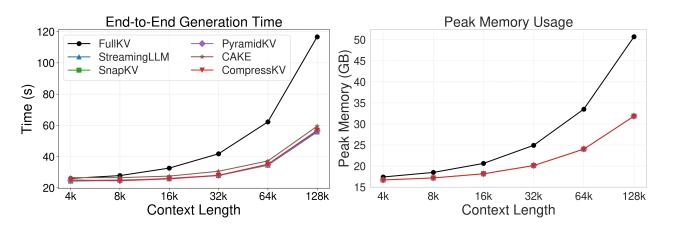

# Experiments

Baselines and Backbone LLMs We compare CompressKV with four representative work: StreamingLLM (Xiao et al. 2024), SnapKV (Li et al. 2024), PyramidKV (Cai et al. 2025), CAKE (Qin et al. 2025)). All methods are evaluated on state-of-the-art opensource LLMs, including Llama-3.1-8B-Instruct (Dubey et al. 2024) and Mistral-7B-Instruct-v0.3 (Jiang et al. 2024). Evaluations are conducted in a generative setting using greedy decoding to ensure fair comparison across tasks.

Evaluating Tasks To evaluate CompressKV's performance under different memory budgets, we adopt two comprehensive benchmarks and one masking-based ablation analysis: (1) LongBench (Bai et al. 2024), which evaluates long-context understanding across 16 datasets; see Appendix A for more details. (2) Needle-in-a-Haystack (Kamradt 2023), which measures the retrieval of a target answer hidden in extended text; and (3) a masking-based ablation study of different head types, in which we selectively disable each type to quantify its contribution to overall performance.

Implementation Details Our experiments evaluate CompressKV and baseline methods under total memory budgets ranging from 128 to 2048 tokens for each layer. The KV cache budget is distributed equally across layers for baseline methods: StreamingLLM and SnapKV, while methods such as PyramidKV, CAKE, and CompressKV distributes the cache differently across layers but keeps total memory usage fixed. To ensure a fair comparison, tokens are evicted only during the prefilling phase. For CompressKV, we select the top four Semantic Retrieval Heads in each layer to identify and preserve the most important tokens. Using the LongBench benchmark, we derive each layer's normalized error scores by simulating minimal-size KV compression and computing the Frobenius-norm reconstruction error of its attention-block outputs. During budget allocation, we impose per-layer bounds [m, M] with m = 32 and M = 3 × Bper-layer —and distribute the remaining KV pairs proportionally to the normalized errors.

#### Evaluation on LongBench Benchmark

Table 1 demonstrates performance comparison under two KV cache regimes—low (256) and high (2048)—with full results across additional budgets in Appendix D. CompressKV consistently ranks the top performers across various tasks. The advantage of CompressKV is particularly pronounced in low-memory scenarios. CompressKV improves accuracy by nearly 2 percentage points over SnapKV and outperforms CAKE by 0.7 points; even in the 2048 cache budget setting scenario, where CAKE falls behind SnapKV on Llama-3.1-8B-Instruct, CompressKV still maintains superior accuracy. By leveraging a small number of Semantic Retrieval Heads to accurately identify semantically important tokens, combined with an effective adaptive layer budget allocation strategy, CompressKV achieves the best overall performance.

As illustrated in Figure 4, we benchmark CompressKV on LongBench across KV cache sizes from 128 to 2048, presenting results for both Llama-3.1-8B-Instruct and Mistral-7B-Instruct-v0.3. The evaluation metric is the average score across all LongBench datasets. SnapKV outperforms the legacy method StreamingLLM. Despite its methodological similarities to SnapKV, PyramidKV underperforms in many scenarios, possibly due to its limited adaptability. CAKE achieves better results than previous baseline methods in most cases by dynamically allocating memory to each layer and incorporating additional computations of variance and entropy scores. CompressKV consistently surpasses all aforementioned methods across all cache budgets, with the performance gap being particularly notable under small KV cache sizes where memory constraints are more severe.

Figure 4: Average performance on 16 LongBench datasets under different KV cache budget settings compared with various baseline methods.

| Method                                                    |      |                                           |                                           |                                           | KV Size Single-doc QA Multi-doc QA Summarization Few-shot Learning Synthetic |                                           | Code | Avg.                                                                    |
|-----------------------------------------------------------|------|-------------------------------------------|-------------------------------------------|-------------------------------------------|------------------------------------------------------------------------------|-------------------------------------------|------|-------------------------------------------------------------------------|
| Llama-3.1-8B-Instruct                                     |      |                                           |                                           |                                           |                                                                              |                                           |      |                                                                         |
| FullKV                                                    | Full | 43.41                                     | 44.44                                     | 29.22                                     | 69.48                                                                        | 52.75                                     |      | 60.06 49.08                                                             |
| StreamingLLM SnapKV PyramidKV CAKE CompressKV | 2048 | 37.02 42.95 42.85 42.56 43.43 | 33.10 44.01 44.19 43.87 44.17 | 25.76 27.29 26.93 27.45 27.88 | 56.57 69.02 69.15 68.67 69.11                                    | 38.74 52.75 53.03 52.84 52.75 |      | 44.51 38.99 60.09 48.47 59.01 48.34 59.45 48.26 60.02 48.71 |
| StreamingLLM SnapKV PyramidKV CAKE CompressKV | 256  | 26.52 38.84 37.28 41.01 41.84 | 29.73 43.57 43.41 43.30 43.75 | 21.16 23.41 23.04 24.38 24.26 | 47.60 63.40 62.40 66.02 66.52                                    | 47.06 52.63 52.38 52.82 52.82 |      | 36.83 33.92 55.21 45.21 53.29 44.36 55.56 46.30 56.29 46.71 |
|                                                           |      |                                           |                                           | Mistral-7B-Instruct-v0.3                  |                                                                              |                                           |      |                                                                         |
| FullKV                                                    | Full | 41.16                                     | 38.99                                     | 29.50                                     | 70.70                                                                        | 52.00                                     |      | 60.03 47.82                                                             |
| StreamingLLM SnapKV PyramidKV CAKE CompressKV | 2048 | 34.17 41.21 40.54 41.18 41.28 | 28.72 38.65 38.69 38.32 39.52 | 25.85 26.66 26.70 27.83 27.93 | 53.99 70.18 70.39 70.24 70.58                                    | 38.50 51.50 51.50 51.50 51.50 |      | 39.47 36.51 59.87 47.05 58.83 46.85 59.96 47.22 59.97 47.55 |
| StreamingLLM SnapKV PyramidKV CAKE CompressKV | 256  | 25.26 35.20 34.73 38.29 39.34 | 26.40 37.08 36.80 37.73 38.48 | 20.76 22.35 21.89 24.03 23.56 | 49.37 67.72 67.66 67.81 69.99                                    | 34.50 51.00 49.75 50.00 50.50 |      | 32.58 31.22 55.59 43.76 53.10 43.06 56.06 44.73 55.89 45.43 |

Table 1: Performance comparison of CompressKV with StreamingLLM, SnapKV, PyramidKV, CAKE, and FullKV on Long-Bench for Llama-3.1-8B-Instruct and Mistral-7B-Instruct-v0.3. CompressKV generally outperforms other KV cache compression methods across various KV cache sizes and LLMs.

#### Evaluation on Needle In A Haystack

In the Mistral-7B-Instruct-v0.3, both CompressKV and CAKE achieve lossless compression under a 256 KV cache budget for 32K long-context inputs, as shown in Figure 5. Notably, CompressKV attains performance comparable to other methods even under 128K long-context inputs in Llama3.1-8B-Instruct, as shown in Figure 6. Remarkably, CompressKV reaches 90% of the original accuracy using only 256 KV cache entries (0.07% of the full capacity). Together with the LongBench evaluation, these results demonstrate that CompressKV effectively maintains general LLM performance across diverse long-context tasks while achieving efficient KV cache compression. For more results, please refer to the Appendix E.

#### Masking-Based Ablation of Different Head Types

To isolate the contribution of Semantic Retrieval Heads, we perform targeted ablation by masking the top 20 of these heads and comparing against traditional Retrieval Heads, as shown in Figure 7. Even masking a small subset of Semantic Retrieval Heads causes a sharp drop in retrieval accuracy and a significant rise in hallucinations, underscoring their essential role in preserving factual consistency and their ability to retrieve and localize textual information. For more results, please refer to the Appendix F.

#### Evaluation of Latency and Peak Memory

We evaluate the end-to-end generation latency and peak memory usage on Llama-3.1-8B-Instruct, implemented with FlashAttention-2 (Dao 2024), running on a single NVIDIA A100 GPU. The evaluation spans context lengths from 4K to 128K tokens with a fixed generation length of 1024 tokens. We compare our proposed CompressKV method against a full cache baseline and four KV cache eviction methods—StreamingLLM, SnapKV, PyramidKV, and CAKE—each constrained by a KV cache budget of 1024. As illustrated in Figure 8, the end-to-end generation latency increases with longer context lengths for all methods. However, all KV cache eviction strategies—including CompressKV—significantly reduce latency compared to the full cache baseline, especially as the context length grows. CAKE exhibits slightly higher latency than the other methods, likely due to the additional computations required for entropy and variance estimation. Figure 8 shows that, under a fixed KV budget, all eviction methods (including CompressKV) incur similar peak memory, whereas the full-cache baseline uses substantially more—especially at longer contexts.

Figure 5: Needle-in-a-Haystack test results on Mistral-7B-Instruct-v0.3 with KV cache = 256. All methods are evaluated under identical settings.

Figure 6: Needle-in-a-Haystack test results on Llama-3.1- 8B-Instruct with KV cache = 256. All methods are evaluated under identical settings.

#### Ablation Studies

To understand the contributions of each component in our CompressKV framework, we conduct a series of ablation studies on the LongBench benchmark using Mistral-7B-Instruct-v0.3 with a fixed KV cache budget of 256.

Ablation Study on the Number of Selected Heads per Layer. To quantify how many Semantic Retrieval Heads are needed per layer, we vary the selection from 2 up to 24 heads and measure average accuracy on LongBench (Table 2). Moving from 2 to 4 heads yields the largest gain (+0.63 percentage points), while increasing beyond 4 offers no further improvement (Top-6: -0.17; Top-12: 0.00). Selecting 24 heads slightly degrades performance. This indicates that a small subset of around four heads is sufficient to capture the majority of semantic retrieval capacity.

Ablation Study on Token Selection and Layer-Wise Cache Allocation. We conduct an ablation study to evalu-

Figure 7: Ablation analysis on masking different head types in Mistral-7B-Instruct-v0.3.

Figure 8: Comprehensive evaluation of LLaMA-3.1-8B-Instruct on a single NVIDIA A100 GPU. Both the KV cache budget and generation length are fixed at 1024 tokens.

| Heads per Layer | Mean Accuracy (%) | ∆ vs. Top-4 (%) |
|-----------------|-------------------|-----------------|
| Top-2           | 44.33             | –0.63           |
| Top-4           | 44.96             | 0.00            |
| Top-6           | 44.79             | –0.17           |
| Top-12          | 44.96             | 0.00            |
| Top-24          | 44.30             | –0.66           |

Table 2: Ablation study on the number of Semantic Retrieval Heads per layer; ∆ denotes the change relative to selecting four heads.

ate the individual contribution of Semantic Retrieval Head driven token selection and layer-aware budget allocation methods on LongBench. Results on Mistral-7B-Instructv0.3 are shown in Table 3. Introducing the proposed selection mechanism over the SnapKV baseline yields a clear gain, and incorporating our layer-aware allocation further improves accuracy, confirming that both components are complementary.

| Method                        | Acc. (%) |
|-------------------------------|----------|
| SnapKV                        | 43.76    |
| + SRH Selection               | 44.96    |
| + SRH Selection + Layer Alloc | 45.43    |

Table 3: Ablation on token selection strategy (SRH = Semantic Retrieval Heads) and layer-aware cache allocation

### Conclusion

In this work, we have proposed CompressKV, a novel KVcache compression framework for GQA-based LLMs that (1) identifies Semantic Retrieval Heads, which not only focus on initial and terminal tokens but also retrieve semantically important tokens and their contexts—and (2) allocates a layer-adaptive cache budget by measuring each layer's offline cache-eviction error. Extensive experiments on LongBench and Needle-in-a-Haystack across multiple model architectures and cache budgets confirm CompressKV's consistently superior performance under diverse memory constraints.

## References

- Achiam, J.; Adler, S.; Agarwal, S.; Ahmad, L.; Akkaya, I.; Aleman, F. L.; Almeida, D.; Altenschmidt, J.; Altman, S.; Anadkat, S.; et al. 2024. GPT-4 Technical Report. arXiv:2303.08774.
- Ainslie, J.; Lee-Thorp, J.; de Jong, M.; Zemlyanskiy, Y.; Lebron, F.; and Sanghai, S. 2023. GQA: Training Generalized Multi-Query Transformer Models from Multi-Head Checkpoints. In *The 2023 Conference on Empirical Methods in Natural Language Processing*.
- Anthropic. 2024. The Claude 3 Model Family: Opus, Sonnet, Haiku. Technical report, Anthropic. Accessed: 2024- 07-09.
- Bai, Y.; Lv, X.; Zhang, J.; Lyu, H.; Tang, J.; Huang, Z.; Du, Z.; Liu, X.; Zeng, A.; Hou, L.; Dong, Y.; Tang, J.; and Li, J. 2024. LongBench: A Bilingual, Multitask Benchmark for Long Context Understanding. In *Proceedings of the 62nd Annual Meeting of the Association for Computational Linguistics (Volume 1: Long Papers)*.
- Cai, Z.; Zhang, Y.; Gao, B.; Liu, Y.; Li, Y.; Liu, T.; Lu, K.; Xiong, W.; Dong, Y.; Hu, J.; and Xiao, W. 2025. PyramidKV: Dynamic KV Cache Compression based on Pyramidal Information Funneling. arXiv:2406.02069.
- Dao, T. 2024. FlashAttention-2: Faster Attention with Better Parallelism and Work Partitioning. In *The Twelfth International Conference on Learning Representations*.
- Dubey, A.; Jauhri, A.; Pandey, A.; Kadian, A.; Al-Dahle, A.; Letman, A.; Mathur, A.; Schelten, A.; Yang, A.; Fan, A.; et al. 2024. The Llama 3 Herd of Models. arXiv:2407.21783.
- Ge, S.; Zhang, Y.; Liu, L.; Zhang, M.; Han, J.; and Gao, J. 2024. Model Tells You What to Discard: Adaptive KV Cache Compression for LLMs. In *The Thirteenth International Conference on Learning Representations*.
- Han, C.; Wang, Q.; Peng, H.; Xiong, W.; Chen, Y.; Ji, H.; and Wang, S. 2024. LM-Infinite: Zero-Shot Extreme Length Generalization for Large Language Models. In *Proceedings of the 2024 Conference of the North American Chapter of the Association for Computational Linguistics: Human Language Technologies (Volume 1: Long Papers)*, 3991–4008.
- Hui, B.; Yang, J.; Cui, Z.; Yang, J.; Liu, D.; Zhang, L.; Liu, T.; Zhang, J.; Yu, B.; Lu, K.; et al. 2025. Qwen2.5 Technical Report. arXiv:2412.15115.
- Jiang, D.; Liu, Y.; Liu, S.; Zhao, J.; Zhang, H.; Gao, Z.; Zhang, X.; Li, J.; and Xiong, H. 2024. From CLIP to DINO: Visual Encoders Shout in Multi-modal Large Language Models. arXiv:2310.08825.
- Kamradt, G. 2023. NeedleInAHaystack. https://github.com/ gkamradt/LLMTest NeedleInAHaystack. Accessed: 2025- 07-13.

- Kang, H.; Zhang, Q.; Kundu, S.; Jeong, G.; Liu, Z.; Krishna, T.; and Zhao, T. 2024. GEAR: An Efficient KV Cache Compression Recipe for Near-Lossless Generative Inference of LLM. arXiv:2403.05527.
- Kwon, W.; Kim, S.; Mahoney, M. W.; Hassoun, J.; Keutzer, K.; and Gholami, A. 2022. A Fast Post-Training Pruning Framework for Transformers. In Oh, A. H.; Agarwal, A.; Belgrave, D.; and Cho, K., eds., *Advances in Neural Information Processing Systems*.
- Li, Y.; Huang, Y.; Yang, B.; Venkitesh, B.; Locatelli, A.; Ye, H.; Cai, T.; Lewis, P.; and Chen, D. 2024. SnapKV: LLM Knows What You are Looking for Before Generation. In *The Thirty-eighth Annual Conference on Neural Information Processing Systems*.
- Liu, Z.; Desai, A.; Liao, F.; Wang, W.; Xie, V.; Xu, Z.; Kyrillidis, A.; and Shrivastava, A. 2023. Scissorhands: Exploiting the Persistence of Importance Hypothesis for LLM KV Cache Compression at Test Time. In *Thirty-seventh Conference on Neural Information Processing Systems*.
- Liu, Z.; Yuan, J.; Jin, H.; Zhong, S.; Xu, Z.; Braverman, V.; Chen, B.; and Hu, X. 2024. KIVI: A Tuning-Free Asymmetric 2bit Quantization for KV Cache. In *Forty-first International Conference on Machine Learning*.
- Olsson, C.; Elhage, N.; Nanda, N.; Joseph, N.; DasSarma, N.; Henighan, T.; Mann, B.; Askell, A.; Bai, Y.; Chen, A.; Conerly, T.; Drain, D.; Ganguli, D.; Hatfield-Dodds, Z.; Hernandez, D.; Johnston, S.; Jones, A.; Kernion, J.; Lovitt, L.; Ndousse, K.; Amodei, D.; Brown, T.; Clark, J.; Kaplan, J.; McCandlish, S.; and Olah, C. 2022. In-context Learning and Induction Heads. arXiv:2209.11895.
- Oren, M.; Hassid, M.; Yarden, N.; Adi, Y.; and Schwartz, R. 2024. Transformers are Multi-State RNNs. In *Proceedings of the 2024 Conference on Empirical Methods in Natural Language Processing*, 18724–18741.
- Qin, Z.; Cao, Y.; Lin, M.; Hu, W.; Fan, S.; Cheng, K.; Lin, W.; and Li, J. 2025. CAKE: Cascading and Adaptive KV Cache Eviction with Layer Preferences. In *The Thirteenth International Conference on Learning Representations*.
- Ren, J.; Guo, Q.; Yan, H.; Liu, D.; Zhang, Q.; Qiu, X.; and Lin, D. 2024. Identifying Semantic Induction Heads to Understand In-Context Learning. In *Findings of the Association for Computational Linguistics: ACL 2024*.
- Todd, E.; Li, M.; Sharma, A. S.; Mueller, A.; Wallace, B. C.; and Bau, D. 2024. Function Vectors in Large Language Models. In *The Twelfth International Conference on Learning Representations*.
- Wan, Z.; Wu, X.; Zhang, Y.; Xin, Y.; Tao, C.; Zhu, Z.; Wang, X.; Luo, S.; Xiong, J.; Wang, L.; and Zhang, M. 2025. D2O: Dynamic Discriminative Operations for Efficient Long-Context Inference of Large Language Models. In *The Thirteenth International Conference on Learning Representations*.
- Wang, J.; Chen, Y.-G.; Lin, I.-C.; Li, B.; and Zhang, G. L. 2025. Bsis Sharing: Cross-Layer Parameter Sharing for Large Language Model Compression. In *International Conference on Learning Representations*.

- Wu, W.; Wang, Y.; Xiao, G.; Peng, H.; and Fu, Y. 2025. Retrieval Head Mechanistically Explains Long-Context Factuality. In *The Thirteenth International Conference on Learning Representations*.
- Xiao, G.; Tang, J.; Zuo, J.; junxian guo; Yang, S.; Tang, H.; Fu, Y.; and Han, S. 2025. DuoAttention: Efficient Long-Context LLM Inference with Retrieval and Streaming Heads. In *The Thirteenth International Conference on Learning Representations*.
- Xiao, G.; Tian, Y.; Chen, B.; Han, S.; and Lewis, M. 2024. Efficient Streaming Language Models with Attention Sinks. In *The Twelfth International Conference on Learning Representations*.
- Yang, D.; Han, X.; Gao, Y.; Hu, Y.; Zhang, S.; and Zhao, H. 2024. PyramidInfer: Pyramid KV Cache Compression for High-throughput LLM Inference. In *Findings of the Association for Computational Linguistics ACL 2024*, 3258–3270.
- Yin, K.; and Steinhardt, J. 2025. Which Attention Heads Matter for In-Context Learning? arXiv:2502.14010.
- Zhang, Z.; Sheng, Y.; Zhou, T.; Chen, T.; Zheng, L.; Cai, R.; Song, Z.; Tian, Y.; Re, C.; Barrett, C.; Wang, Z.; and Chen, B. 2023. H2O: Heavy-Hitter Oracle for Efficient Generative Inference of Large Language Models. In *Thirty-seventh Conference on Neural Information Processing Systems*.
- Zheng, Z.; Wang, Y.; Huang, Y.; Song, S.; Yang, M.; Tang, B.; Xiong, F.; and Li, Z. 2024. Attention Heads of Large Language Models: A Survey. arXiv:2409.03752.

#### A Dataset Details

Table 4 presents the LongBench benchmark used in our experiments, which consists of 14 English subtasks and 2 code-completion subtasks organized into six categories—single-document QA, multi-document QA, summarization, few-shot learning, synthetic tasks, and code completion. Each subtask contains 150–500 samples with input lengths ranging from 1,235 to 18,409 words. Evaluation metrics include F1, Rouge-L, classification accuracy, and edit similarity.

#### **B** More Implementation Details

In this section, we provide additional details of our experimental setup and a comprehensive description of the erroraware, layer-adaptive cache allocation algorithm used by CompressKV. To ensure a fair comparison across all KV cache compression methods, we use identical hyperparameters: an observation window of 8 tokens, a 1D pooling kernel of size 5, and average-pooling to aggregate attention scores.

### Detailed Description of Error-Aware Layer-Adaptive Cache Allocation

Using the LongBench benchmark, we simulate an extreme compression scenario by restricting each layer's KV cache size to 32 tokens (approximately 0.3% of full capacity). Unlike completely skipping an attention block (binary on/off), retaining a small subset of tokens allows us to explicitly quantify the direct impact of KV cache compression on the attention outputs. This approach effectively captures finegrained compression errors without incurring multiple forward computations that would otherwise be necessary for evaluating the complete removal of attention blocks.

Formally, for each dataset  $d \in D$ , transformer layer l, and decoding step t, we compute the per-layer compression-induced reconstruction error as follows:

$$e_d^{(l)} = \sum_{t=1}^{T} \frac{\|\mathbf{O}_{\text{comp},t}^{(l)} - \mathbf{O}_{\text{full},t}^{(l)}\|_F}{\|\mathbf{O}_{\text{full},t}^{(l)}\|_F + \epsilon}$$
(9)

where T denotes the total decoding steps,  $\|\cdot\|_F$  represents the Frobenius norm, and  $\epsilon=10^{-6}$  ensures numerical stability. Next, we perform an L1 normalization of the per-layer errors within each dataset:

$$\hat{e}_d^{(l)} = \frac{e_d^{(l)}}{\sum_l e_d^{(k)}}.$$
 (10)

Then, we average these normalized per-layer errors across all datasets:

$$\bar{e}^{(l)} = \frac{1}{|D|} \sum_{d \in D} \hat{e}_d^{(l)}.$$
 (11)

Finally, we apply another L1-normalization across layers to obtain the final importance scores:

$$\tilde{e}^{(l)} = \frac{\bar{e}^{(l)}}{\sum_{k} \bar{e}^{(k)}}.$$
 (12)

Averaging normalized errors across all datasets ensures both generalizability and fairness: by averaging errors from diverse datasets, we capture consistent trends in layer importance rather than overfitting to any single task or domain. Compared with budget allocation methods that rely solely on attention-score distributions, our error-aware approach explicitly quantifies the impact of compression on the model's final attention outputs, resulting in a more precise and effective allocation strategy. These normalized, dataset-averaged error scores  $\tilde{e}^{(\ell)}$  guide our error-aware, layer-adaptive cache allocation as detailed in Algorithm 1 below.

To safeguard against extreme cases, we impose per-layer bounds [m,M], where the minimum allocation m=32 ensures that each layer receives at least a small, baseline cache allocation, preventing any single layer from becoming completely inactive under extreme conditions. The upper bound  $M=3\times B_{\text{per-layer}}$  prevents excessive cache allocation to any individual layer, ensuring a balanced distribution of cache resources and maintaining overall model performance. Additionally, we plot the performance of both the Mistral-7B-Instruct-v0.3 and Llama-3.1-8B-Instruct models under a per-layer KV cache budget of 256 tokens as bar charts (see Figures 9 and 10), illustrating the distinct allocation characteristics of each model.

