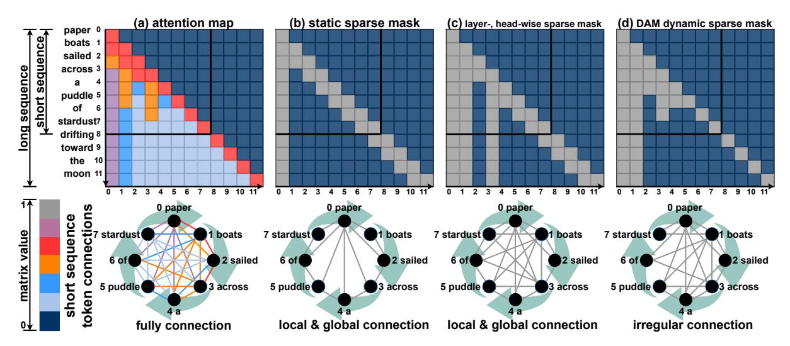

# Abstract

Long-context understanding is crucial for many NLP applications, yet transformers struggle with efficiency due to the quadratic complexity of self-attention. Sparse attention methods alleviate this cost but often impose static, predefined masks, failing to capture heterogeneous attention patterns. This results in suboptimal token interactions, limiting adaptability and retrieval accuracy in long-sequence tasks. This work introduces a dynamic sparse attention mechanism that assigns adaptive masks at the attention-map level, preserving heterogeneous patterns across layers and heads. Unlike existing approaches, our method eliminates the need for fine-tuning and predefined mask structures while maintaining computational efficiency. By learning context-aware attention structures, it achieves high alignment with full-attention models, ensuring minimal performance degradation while reducing memory and compute overhead. This approach provides a scalable alternative to full attention, enabling the practical deployment of largescale Large Language Models (LLMs) without sacrificing retrieval performance. *DAM* is available at: [https://github.com/](https://github.com/HanzhiZhang-Ulrica/DAM) [HanzhiZhang-Ulrica/DAM](https://github.com/HanzhiZhang-Ulrica/DAM) .

### 1 Introduction

Understanding long contexts is essential for document summarization, question answering, and retrieval-augmented generation. Long-context NLP applications power legal analysis, financial reporting, and knowledge graph construction, where maintaining coherence across tokens is critical. However, existing LLMs struggle with long sequences due to inefficiency in self-attention.

LLMs leverage the Transformer architecture, which models long-range token dependencies through self-attention, enabling direct interactions between all tokens. Multi-head attention enhances expressivity by capturing multiple token relationships, while positional embeddings preserve order

information. Dynamic token representations allow contextual meaning to evolve across layers, ensuring coherent and accurate long-term recall.

However, transformers process long contexts inefficiently. Quadratic complexity makes full attention computationally prohibitive, forcing models to truncate inputs, leading to information loss in longdocument tasks. Attempts to mitigate this through fixed context windows or uniform attention fail to distinguish between critical and redundant information. Meanwhile, streaming applications suffer from recomputing at every step, as each newly generated token attends to all previous tokens. This results in redundant computation, growing memory usage, and increased latency, making real-time processing impractical.

The inability to process long contexts also directly impacts businesses and researchers. Legal and financial institutions rely on AI to analyze contracts and reports[\(Pingili](#page-10-0) , [2025\)](#page-10-0), but truncated inputs cause critical details to be lost. AI assistants in customer service forgetting past interactions may fail to maintain coherent conversations. Researchers pushing transformer efficiency face skyrocketing computational costs, making largescale deployment unsustainable. Without an efficient solution, enterprises must rely on costly and ineffective workarounds like document chunking, which may destroy contextual coherence.

Sparse attention is an efficiency-driven approach to mitigating long-context inefficiency in generative LLMs by enforcing structured sparsity. Figure [1\(](#page-1-0)b) illustrates static sparse attention methods that reduce computational cost by enforcing fixedspan sliding window and global masks across all heads and input lengths. This approach improves efficiency but sacrifices flexibility, forcing models to rely only on local interactions. As a result, these models fail to adapt to long-range dependencies, reducing accuracy in complex retrieval and reasoning tasks. Figure [1\(](#page-1-0)c) improves flexibility by assigning

Figure 1: Attention patterns from  $queries \times keys$ . The short input sequence "paper boats sailed across a puddle of stardust" is a subset of the longer input sequence "paper boats sailed across a puddle of stardust drifting toward the moon". (a) Each query attends to all keys, and longer attention patterns are extensions of short patterns. (b) Static attention map captures same classical global and sliding-window patterns to attention maps from every layers and heads. (c) Different masks are assigned to corresponding maps with predefined patterns. (d) Heterogeneous map remains feature patterns from each attention map.

different masks to layers and heads, removing the need for fine-tuning. However, it assumes attention structures can be predefined, failing to capture heterogeneous token interactions that emerge dynamically. The result is a rigid sparsity pattern that still requires processing all sequence lengths, making it resource-intensive for long-context applications.

This work introduces *DAM*, a novel framework for dynamic sparse attention, as illustrated in Figure 1(d). *DAM* generates adaptive sparse attention masks at the granularity of individual attention maps, thereby capturing both layer-specific structural patterns and input-dependent variations in attention. In contrast to prior approaches that often rely on fixed or globally-defined sparsity patterns, *DAM* preserves the heterogeneity of attention patterns across different layers and heads, leading to improved expressiveness. Furthermore, the method eliminates the need for manual, task-specific finetuning of the sparsity structure, while maintaining the computational benefits of sparse attention.

Our contributions are summarized as follows:

- We propose a dynamic sparse attention framework that assigns distinct, adaptive sparse masks to each attention map, preserving heterogeneous patterns across heads and layers.
- Our approach is fine-tuning-free and generalizes seamlessly to varying input lengths, eliminating the need for manual sparsity pattern design.
- We incorporate a flexible "true mask" mechanism to focus attention on relevant regions, reducing unnecessary computations on padding tokens or less informative areas.

 We demonstrate that DAM achieves performance comparable to full-attention models while improving computational efficiency.

#### 2 Related Work

Attention mechanisms enable transformers to model dependencies across sequences but introduce computational challenges at scale. Researchers have explored multiple strategies to address these inefficiencies, including KV-caching for faster inference, sparse and hierarchical attention for memory reduction, state-space models for efficient streaming, and hybrid architectures for improved long-term memory tracking. While these approaches enhance scalability, each introduces trade-offs that limit their applicability to long-sequence processing.

KV-cache enhances autoregressive decoding by storing key and value representations from previous steps, allowing reuse instead of recomputing attention scores for all tokens (Ge et al., 2023; Li et al., 2024; Zhang et al., 2024b; Zhao et al., 2024; Chen et al., 2024; Liu et al., 2024; Adnan et al., 2024; Ge et al., 2023). This reduces redundant computation and accelerates inference but increases memory usage, limiting scalability for long sequences (Zhang et al., 2024a; Ye et al., 2024; Hu et al., 2024). Cache management adds complexity, and performance gains depend on reuse efficiency (Zheng et al., 2024b,a; Xiong et al., 2024; Gao et al., 2024). While KV-cache mitigates inefficiencies in autoregressive generation, it does not reduce the fundamental complexity of self-attention.

Sparse attention reduces token interactions to improve efficiency (Child et al., 2019; Yun et al., 2020; Ho et al., 2019). Static sparse attention applies predefined masks across all processed sentences to lower computational cost and improve hardware utilization (Roy et al., 2021; Kitaev et al., 2020; Tay et al., 2019; Choromanski et al., 2020). Common approaches include global, sliding window, and random masks, with local attention patterns enabling KV-cache eviction beyond the attention span to reduce memory usage (Beltagy et al., 2020a; Ainslie et al., 2004; Zaheer et al., 2020). However, static masks remain uniform across layers and heads, ignoring token-specific dependencies. This rigidity leads to information loss in longsequence tasks, where retrieval accuracy relies on adapting attention spans dynamically.

Other strategies generate distinct masks by leveraging statistical information, defining role-specific constraints for attention heads, or introducing context-dependent sparsity (Wang et al., 2020; Fu et al., 2024; Correia et al., 2019). While these approaches increase flexibility, they fail to dynamically capture heterogeneous attention within individual maps and still process all sequence lengths, raising resource costs.

To introduce flexibility, some approaches assign different predefined sparse patterns to layers and heads (Fu et al., 2024; Wang et al., 2020; Fu et al.; Correia et al., 2019). They select masks based on input length, improving adaptability without requiring fine-tuning. However, it assumes optimal attention structures are predefined, missing dynamic token interactions, and require evaluating multiple sequence lengths, thereby increasing computational overhead. This limitation motivates methods to infer sparse structures without exhaustive manual design or repeated inference.

#### 3 Preliminaries

Transformer models adopt the scaled dot-product attention mechanism, a core component for capturing relationships between tokens in a sequence (Vaswani, 2017). Attention scores are calculated as  $S = \frac{QK^\top}{\sqrt{d_k}}$ , where  $Q \in \mathbb{R}^{n \times d_k}$  and  $K \in \mathbb{R}^{m \times d_k}$  denote the query and key matrices, respectively. Here, n and m denote the number of query and key/value vectors, while  $d_k$  represents the dimensionality of each key/query vector. The resulting matrix  $S \in \mathbb{R}^{n \times m}$  contains the unnormalized attention logits, representing the pairwise similarities

between queries and keys. The scaling factor  $\frac{1}{\sqrt{d_k}}$  is crucial for maintaining numerical stability during training, preventing the dot products from growing excessively large, which can lead to vanishing gradients during backpropagation. This scaling mitigates issues caused by large variances in the logits, particularly when applying a masking operation.

The computation of attention scores for all pairs of tokens has a quadratic time complexity of  $\mathcal{O}(n^2)$  with respect to the sequence length, which becomes computationally expensive for long sequences. Sparse attention mechanisms address this computational bottleneck by imposing structured sparsity on the attention matrix. This is achieved through a binary mask  $M_{\ell,h} \in \{0,1\}^{n\times m}$  for each layer  $\ell$  and head h, defined as:

$$M_{\ell,h,i,j} = \begin{cases} 1, & \text{if token } i \text{ attends to token } j \ & \text{in layer } \ell \text{ and head } h, \ 0, & \text{otherwise.} \end{cases}$$

The mask  $M_{\ell,h}$  is applied element-wise to the attention logits  $S' = S \odot M_{\ell,h}$ , where  $\odot$  denotes the Hadamard product (element-wise multiplication). This effectively prevents attention between specific token pairs. The masked attention logits are then normalized using the softmax function:

$$A_{ij} = \frac{\exp(S'_{ij})}{\sum_{k=1}^{m} \exp(S'_{ik})}.$$

The output of the attention mechanism is computed as a weighted sum of the values, where  $V \in \mathbb{R}^{m \times d_v}$  is the value matrix as O = AV.

While sparse attention mechanisms substantially improve computational efficiency, they inherently restrict the model's ability to learn long-range dependencies by limiting token interactions. A key limitation of many sparse attention approaches is their reliance on fixed sparsity patterns. Such patterns are unable to adapt to the dynamic nature of attention, including variations in sequence length and the diversity of attention distributions across different inputs. This rigidity can result in a significant reduction in performance, especially when dealing with long sequences or tasks requiring the modeling of intricate relationships. Moreover, predefined sparse attention structures like sliding window (Beltagy et al., 2020b) or global attention (Liu et al., 2021) often overlook the critical variations in attention patterns that occur across different layers and heads within the network. The optimal set of token interactions evolves across layers, rendering fixed sparsity patterns a bottleneck. This motivates

the need for a dynamic, structure-aware sparsity mechanism that adapts to position-wise attention patterns while maintaining compatibility with pretrained transformer architectures.

#### 4 Dynamic Attention Masks (*DAM*)

This section introduces our proposed Dynamic Attention Mask (*DAM*) mechanism. We first motivate the design by illustrating the dynamic nature of attention patterns across layers and heads in Transformer models. Then, we detail the architecture of *DAM*, and finally, we describe its integration into the standard Transformer framework.

#### 4.1 Dynamic Attention Patterns

Figure 2: Visualization of dynamic attention patterns across layers and heads. The figure compares the effect of averaging (top row) and applying the Box-Cox transformation (bottom row) to attention values from a LLaMA 3.2 3B Instruct model on the Multi-News dataset. The Box-Cox transformation enhances the visibility of dynamic patterns.

Prior research has investigated and validated the existence of dynamic attention patterns across attention heads and layers in Transformer models (Goindani and Shrivastava, 2021; Xiao et al., 2024a). To visualize these patterns, we analyze attention maps obtained from a LLaMA 3.2 3B Instruct model (AI, 2024) evaluated on the Multi-News summarization benchmark (Fabbri et al., 2019). Figure 2 presents these attention maps, revealing inconsistencies in the underlying sparse structures across different heads and layers. The top row of Figure 2 displays the average attention values across the dataset. While these average maps suggest the presence of dynamic patterns, the patterns themselves are not readily discernible, hindering a deeper understanding and impeding the design of effective sparsity-inducing techniques.

We posit that enhancing the contrast between significant and less significant attention values can reveal these dynamic patterns more clearly. Specifically, we aim to preserve the largest attention values (e.g., those corresponding to the leftmost column in each attention map), while simultaneously accentuating the intermediate values (e.g., those distributed along the diagonal) and differentiating them from the smallest values (e.g., those in the bottom-left regions). To achieve this, we evaluated **nine different transformation methods** (more details in the Appendix B) and found the Box-Cox transformation (Box and Cox, 1964) consistently yielded the most informative visualizations, as shown in the bottom row of Figure 2.

The Box-Cox transformation enhances the visualization clarity of attention maps and **amplifies small and medium attention values**, making subtle yet important structural patterns more discernible, while **preserving the scale of larger values without introducing distortion**. It directly facilitates the intuitive selection and tuning of the threshold parameters ( $\tau$  in Section 4.2.3 and  $\mu$  in Section 4.2.4).

#### 4.2 Two-Stage Dynamic Attention Masks

DAM enhances the efficiency of Transformer models by learning adaptive sparse attention masks. It addresses the limitation of predefined sparsity patterns, which can discard valuable, low-magnitude connections, by dynamically adjusting the attention mask based on observed attention patterns. The framework operates in two stages in Figure 3. First, a frozen pre-trained model processes input sequences (truncated to a manageable Pattern Capture Length, PCL) to extract full attention maps. These maps undergo a Box-Cox transformation for normalization, followed by thresholding to generate "true masks" representing key dependencies. Structural pattern analysis (identifying vertical and diagonal patterns) then enables the extrapolation of these masks to lengths exceeding the PCL, creating "extended masks". The Appendix A describes the detailed extension observation.

The second stage applies these generated, adaptive sparse attention masks (either true or extended, depending on sequence length) to a sparse Transformer model. This application occurs *before* the softmax operation within the attention mechanism, effectively limiting computations to the unmasked connections. This significantly reduces both memory and computational overhead compared to full attention, while preserving the crucial dependencies identified in the first stage. By focusing on

Figure 3: Two-stage *DAM* overview. The first stage extracts full attention patterns from sequences of varying lengths, applies a Box-Cox transformation, and generates masks that capture essential dependencies. The second stage applies these masks to a sparse model, enabling efficient inference while preserving key attention structures.

observed attention patterns and extrapolating structural regularities, *DAM* achieves a balance between efficiency and the ability to capture nuanced, longrange dependencies in input sequences, making it suitable for processing long sequences that would otherwise be computationally prohibitive.

#### 4.2.1 Pattern Capture Length (PCL)

The Pattern Capture Length (PCL), denoted as L, represents a critical parameter within the DAM framework. It defines the maximum sequence length processed by the frozen model to extract the initial, full attention distributions. This constraint is essential for maintaining computational feasibility, particularly given the quadratic complexity of full attention mechanisms.

Let S represent the length of an input sequence. The PCL, L, is determined as  $L = \min(S, L_{\max})$  where  $L_{\max}$  is the maximum sequence length for which full attention computation remains computationally tractable given the available resources (e.g., GPU memory). As shown in Table 1, the original LLaMA 3.2 3B model runs out of memory (OOM) when processing sequences longer than 8k tokens on an A100 GPU (40GB). Based on this, we **select the longest sequence length that the hardware can stably support**, and then adjust downward only if necessary. Unlike tuning from small to large values, which is inefficient and error-prone,

starting from the maximum supported length and adjusting downward as needed makes PCL tuning both simple and reliable.

In essence, the PCL acts as a truncation point, ensuring that the initial attention map extraction is performed on sequences of a manageable length, while still capturing representative attention patterns. The choice of  $L_{\rm max}$  is a hyperparameter that depends on the specific hardware and model architecture.

#### 4.2.2 Feature Amplification via Box-Cox

This section details the process of amplifying and normalizing attention scores using the Box-Cox transformation. This step aims to address the often-observed skewness in attention distributions, where a few connections dominate while many others have very low values. By amplifying smaller attention values, we reveal potentially significant connections that might otherwise remain masked.

First, mean attention scores are computed across all valid position pairs within the dataset. Let  $A_{\ell,h,i,j}$  denote the accumulated attention value at layer  $\ell$ , head h, from token position i to token position j, summed across multiple batches. A binary mask  $m_{i,j}^{(b)} \in \{0,1\}$  indicates whether the attention weight for position pair (i,j) was computed in batch b. The count matrix  $C_{\ell,h,i,j}$  records the number of times each position pair (i,j) appears across

all batches, we have  $C_{\ell,h,i,j} = \sum_b m_{i,j}^{(b)}$ . The mean attention score,  $\bar{A}_{\ell,h,i,j}$ , is then calculated as:

$$\bar{A}_{\ell,h,i,j} = \frac{A_{\ell,h,i,j}}{C_{\ell,h,i,j} + \epsilon},$$

where  $\epsilon$  is a small constant (e.g.,  $10^{-8}$ ) added to the denominator to prevent division by zero and ensure numerical stability.

To mitigate the skewness of the attention scores and emphasize smaller values, a Box-Cox transformation is applied. To ensure the input to the transformation is strictly positive, a small constant  $\epsilon$  is added to the mean attention scores as  $X_{\ell,h,i,j} = \max(\bar{A}_{\ell,h,i,j},\epsilon)$ . The Box-Cox transformation is then applied to  $X_{\ell,h,i,j}$  as follows:

$$B_{\ell,h,i,j} = \begin{cases} \frac{X_{\ell,h,i,j}^{\lambda} - 1}{\lambda}, & \text{if } \lambda \neq 0\\ \ln(X_{\ell,h,i,j}), & \text{if } \lambda = 0 \end{cases}$$

where  $\lambda$  is the transformation parameter. In practice, we find that  $\lambda=0.5$  improves visualization, which does not require to be tuned in the future.

To ensure the transformed values  $B_{\ell,h,i,j}$  remain non-negative, we subtract the minimum value across all heads and layers:

$$B^*_{\ell,h,i,j} = B_{\ell,h,i,j} - \min_{\ell',h',i',j'} (B_{\ell',h',i',j'}).$$
 Finally, the normalized attention map  $\tilde{A}_{\ell,h,i,j}$ 

Finally, the normalized attention map  $A_{\ell,h,i,j}$  is defined as  $\tilde{A}_{\ell,h,i,j} = B^*_{\ell,h,i,j}$ . With amplified smaller values,  $\tilde{A}_{\ell,h,i,j}$  is then used for subsequent mask generation.

#### 4.2.3 True Mask Generation

We detail the process of generating "true masks", denoted as  $M_{\ell,h}$ , which represent the binarized and thresholded version of the normalized attention maps. These masks serve as the basis for identifying structural patterns and subsequently constructing the extended, sparse attention masks.

A binary thresholding operation is applied to the normalized attention maps,  $\tilde{A}_{\ell,h}$  (obtained as described in Section 4.2.2), to produce the true masks. Each true mask  $M_{\ell,h}$  has the same dimensions as the corresponding attention map:  $M_{\ell,h} = [m_{i,j}] \in \{0,1\}^{L\times L}$ , where L is the Pattern Capture Length (PCL). The elements of the true mask,  $m_{i,j}$ , are determined by comparing the corresponding normalized attention values,  $\tilde{A}_{\ell,h,i,j}$ , to a predefined threshold,  $\tau$ :

$$m_{i,j} = \begin{cases} 1, & \text{if } \tilde{A}_{\ell,h,i,j} \geq \tau, \\ 0, & \text{if } \tilde{A}_{\ell,h,i,j} < \tau. \end{cases}$$

This thresholding operation is applied independently to each layer  $\ell$  and attention head h. The

threshold,  $\tau$ , acts as a hyperparameter controlling the sparsity of the true masks. A higher value of  $\tau$  results in a sparser mask, retaining only the strongest attention connections.

