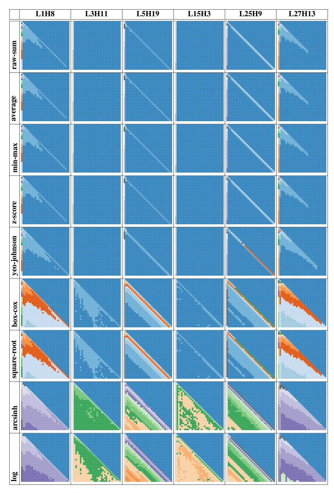

# **Feature Amplification Transformation** Methods

Let  $A_{\ell,h,i,j}$  denote the accumulated attention weight from layer  $\ell$ , head h, between token positions i and j, and let  $C_{\ell,h,i,j}$  be the corresponding valid token count. We compute the average attention as:

$$\bar{A}_{\ell,h,i,j} = \frac{A_{\ell,h,i,j}}{C_{\ell,h,i,j} + \epsilon}$$

where  $\epsilon = 10^{-10}$  ensures numerical stability. Let  $X = \max(\bar{A}, \epsilon)$  denote the stabilized input. The transformed value is denoted by  $\tilde{A}_{\ell,h,i,j}$ , and unless otherwise stated, we subtract the global minimum such that  $\tilde{A} := \tilde{A} - \min(\tilde{A})$ .

The nine transformation methods are defined as

1. Raw Sum:  $\tilde{A}_{\ell,h,i,j} = A_{\ell,h,i,j}$ 

**2.** Average:  $\bar{A}_{\ell,h,i,j} = \bar{A}_{\ell,h,i,j}$ 

**3. Log:**  $A_{\ell,h,i,j} = \log(X)$ 

4. Box-Cox: 
$$\tilde{A}_{\ell,h,i,j} = \begin{cases} \frac{X^{\lambda} - 1}{\lambda}, & \lambda \neq 0 \\ \log(X), & \lambda = 0 \end{cases}$$

$$\tilde{A}_{\ell,h,i,j} = \begin{cases} \log(X), & \lambda = 0 \\ \text{5. Yeo-Johnson:} \\ \log(X + 1), & X \ge 0, \ \lambda \ne 0 \\ \log(X + 1), & X \ge 0, \ \lambda = 0 \\ -\frac{(-X+1)^{2-\lambda} - 1}{2-\lambda}, & X < 0, \ \lambda \ne 2 \\ -\log(-X + 1), & X < 0, \ \lambda = 2 \end{cases}$$
**6. Z-Score:**  $\tilde{A}_{\ell,h,i,j} = \frac{X - \mu}{2}$ 

6. **Z-Score:**  $\tilde{A}_{\ell,h,i,j} = \frac{X-\mu}{\sigma+\epsilon}$  where  $\mu = \operatorname{mean}(X)$ ,  $\sigma = \operatorname{std}(X)$ 7. **Min-Max:**  $\tilde{A}_{\ell,h,i,j} = \frac{X-\min(X)}{\max(X)-\min(X)+\epsilon}$ 8. Square Root:  $\tilde{A}_{\ell,h,i,j} = \sqrt{X}$ 

$$\tilde{A}_{\ell,h,i,j} = \sinh^{-1}(X) = \log\left(X + \sqrt{X^2 + 1}\right)$$

Figure 8 compares the resulting attention maps across six representative heads. The first two rows-raw-sum and average-serve as baselines but fail to reveal an informative structure. Raw-sum maps are dominated by large values in early tokens, while average maps mildly reduce saturation but still obscure subtle patterns, particularly in deeper layers (e.g., L25H9, L27H13).

In contrast, box-cox and square-root transformations enhance interpretability by exposing structural features such as diagonals, stripes, and offdiagonal regions. These patterns are most evident in L3H11 and L15H3, which remain hidden in the baseline maps.

The remaining transformations, including yeojohnson, z-score, min-max, arcsinh, and log, either overcompress the range or introduce artifacts. resulting in flattened or noisy maps that hinder downstream use.

Table 2 quantifies the numerical differences between square-root and Box-Cox transformations for Layer 25 Head 9. Although both produce visually informative outputs, Box-Cox maps have bounded and compact ranges (e.g., max  $\sim 2.0$ , mean  $\sim$ 0.27), while square-root maps exhibit large variance and extreme values (e.g., max  $\sim$ 150), mak-

Figure 8: Feature amplification examples across six attention maps from the LLaMA 3.2 3B model under nine transformation methods. Column headers indicate the layer and head indices of each attention map; row headers correspond to the transformation methods. Box-Cox and Square Root transformations yield more uniform attention value distributions.

Figure 9: LongEval retrieval accuracy for LLaMA 3.2 3B and 1B models across input lengths to 40K tokens. DAM maintains alignment with the dense LLaMA baseline across retrieval positions and sequence lengths. In contrast, MoA, StreamingLLM, and H2O exhibit early and progressive degradation.

ing thresholding less stable. These results support the use of Box-Cox as the default transformation for attention pattern visualization.

| Metric            | Square-root | Box-Cox    |
|-------------------|-------------|------------|
| Max Value         | 149.95      | 2.00       |
| Min (non-zero)    | 4.93        | 0.07       |
| Mean (non-zero)   | 13.57       | 0.27       |
| Std (non-zero)    | 21.91       | 0.35       |
| # Non-zero Values | 500         | 500        |
| 99th Percentile   | $\sim 100$  | $\sim 1.5$ |

Table 2: Comparison of square-root and Box-Cox transformed attention values for Layer 25 Head 9. Box-Cox yields compact and stable value ranges that are easier to filter or threshold.

#### C Long-Context Retrieval

We evaluate long-context retrieval using the LongEval benchmark, which measures a model's ability to recover predefined tokens inserted at various positions within input sequences. Figure 9

presents results up to 40K tokens for LLaMA 3.2 3B and 1B models.

For the 3B models, DAM closely tracks the retrieval accuracy of the dense LLaMA baseline across all lengths. While accuracy gradually declines beyond 30K tokens, DAM preserves similar positional trends. In contrast, MoA, StreamingLLM, and H2O begin diverging much earlier, with noticeable color shifts appearing as early as 3K–7K tokens.

For the 1B models, the differences are more pronounced. LLaMA and DAM maintain high accuracy up to 33K tokens, while MoA and StreamingLLM show early degradation starting around 6K. H2O degrades almost immediately across all target positions.

Overall, DAM preserves fine-grained retrieval performance and retains long-range, position-sensitive dependencies without requiring full attention computation, outperforming alternative efficient methods that degrade under longer contexts.