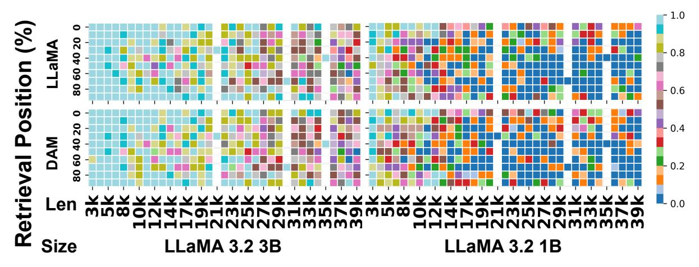

# 4.2.4 Dynamic Mask Generation via Structural Pattern Matching

We construct DAM by identifying and combining predefined structural patterns within the true attention masks. A pattern pool,  $\mathcal{P}$ , is defined, consisting of a set of predefined attention patterns. Each pattern is represented as a binary matrix  $P_k = [p_{i,j}] \in \{0,1\}^{L \times L}$ , where L denotes the PCL and  $P_k$  represents the k-th pattern in the pool. The pattern pool, in this work, includes diagonal and vertical patterns, reflecting common attention structures observed in Transformer models.

A diagonal pattern,  $P_{\text{diag},r}$ , starts at row index r and extends diagonally downwards:

$$p_{i,j} = \begin{cases} 1, & \text{if } j = i - r, \\ 0, & \text{otherwise.} \end{cases}$$

for  $r \in \{0, 1, \dots, L-1\}$ . A vertical pattern,  $P_{\text{vert},c}$ , captures column-wise attention (i.e., tokens attending to a specific column c):

$$p_{i,j} = \begin{cases} 1, & \text{if } j = c \text{ and } i \ge c, \\ 0, & \text{otherwise.} \end{cases}$$

for  $c \in \{0, 1, ..., L-1\}$ . The complete pattern pool is the union of these sets:

$$\mathcal{P} = \{P_{\mathrm{diag},r}\} \cup \{P_{\mathrm{vert},c}\}.$$

Each true mask  $M_{\ell,h}$  is compared against patterns in  $\mathcal{P}$ . The match score  $\gamma_k$  for a pattern  $P_k$  is computed as:

$$\gamma_k = \frac{\sum_{i,j} M_{\ell,h}^{(i,j)} \cdot P_k^{(i,j)}}{\sum_{i,j} P_k^{(i,j)}}.$$

A pattern  $P_k$  is considered a valid match if its match score  $\gamma_k$  exceeds a predefined threshold  $\mu$ , where  $\mu \in [0,1]$  is a hyperparameter controlling the sensitivity of the pattern matching. Higher values of  $\mu$  lead to fewer patterns being matched, resulting in sparser masks. It is robust across a relatively wide range, from 0.7 to 1.0, while still preserving the model's language understanding capabilities.

The extended mask,  $\tilde{M}_{\ell,h}$ , is constructed by extrapolating the structural patterns identified in the true masks, which are initially computed using sequences up to the PCL. These patterns—such as diagonal and vertical structures—are selected from a predefined pattern pool. Because patterns may overlap, the extended mask is formed by summing

all matched patterns whose match score exceeds a threshold:

$$\tilde{M}_{\ell,h} = \sum_{P_k \in \mathcal{P}, \gamma_k \ge \mu} P_k.$$
 Finally, to ensure the extended mask is binary, a

thresholding operation is applied:

$$\tilde{M}_{\ell,h}^{(i,j)} = \begin{cases} 1, & \text{if } \sum_{P_k \in \mathcal{P}, \gamma_k \ge \mu} P_k^{(i,j)} \ge 1, \\ 0, & \text{otherwise.} \end{cases}$$

#### 4.3 Applying Dynamic Attention Masks

**Case 1:** If the input sequence length S satisfies  $S \leq L$ ,  $M_{\ell,h}$  will be applied as the attention mask. Case 2: If S > L, the method constructs an extended mask  $M_{\ell,h}$  of size  $S \times S$ . The first  $L \times L$ region remains unchanged:

$$\tilde{M}_{\ell,h}^{(i,j)} = M_{\ell,h}^{(i,j)}, \quad \text{for } i, j \le L.$$

$$\begin{split} \tilde{M}_{\ell,h}^{(i,j)} &= M_{\ell,h}^{(i,j)}, \quad \text{for } i,j \leq L. \\ \text{For } i,j &> L, \text{ attention is allowed if the token} \end{split}$$
pair (i, j) is in the stored matched positions  $\mathcal{P}_{\ell,h}$ :

$$\tilde{M}_{\ell,h}^{(i,j)} = \begin{cases} 1, & \text{if } (i,j) \in \mathcal{P}_{\ell,h}, \\ 0, & \text{otherwise}. \end{cases}$$
 The attention mask applies before softmax. The

modified attention score matrix is:

$$A'_{\ell,h} = \frac{Q_{\ell,h} K_{\ell,h}^T}{\sqrt{d_k}} \odot \tilde{M}_{\ell,h}.$$

The model sets masked positions  $\tilde{M}_{\ell h}^{(i,j)} = 0$  to  $-\infty$  before softmax, ensuring a probability of zero. The final output is:  $O'_{\ell,h} = \operatorname{softmax}(A'_{\ell,h})V_{\ell,h}$ .

#### **Experiment**

#### 5.1 Experiment Setup

Figure 4: Line-level retrieval accuracy on the LongEval benchmark using the base LLaMA 3.2 3B model. Each sequence contains a predefined target line to be retrieved. Input lengths range from 200 to 3100 lines (3.1k to 38.7k tokens). DAM maintains high retrieval accuracy across all lengths with minimal degradation.

We evaluate DAM on long-context retrieval and QA tasks, comparing against full attention and structured sparsity baselines across multiple sequence lengths and model scales.

Baselines. We compare DAM against FlashAttention (Dao, 2023), MoA (Fu et al., 2024), StreamingLLM (Xiao et al., 2024b), and H2O (Zhang et al., 2023). MoA uses predefined sparse attention patterns per layer and head, while StreamingLLM and H2O enhance efficiency during autoregressive decoding.

Base Models. The experiments use LLaMA-3.2-1B-Instruct and LLaMA-3.2-3B-Instruct to analyze scalability across different parameter sizes.

Benchmarks. The evaluation uses LongEval (Krishna et al., 2023) and LV-Eval (Yuan et al., 2024) to assess long-context understanding. LongEval measures key-value retrieval accuracy with 100 data items per sequence length level, offering insights into contextual recall performance.

Hardware. The experiments run on multiple GPU configurations:  $4 \times A100$  (40GB) for LongEval,  $2 \times H100$  (80GB) for LV-Eval, and  $1 \times A100$ (40GB) for efficiency evaluations.

#### **DAM Configuration:**

- Dataset for attention map capture: Multi-News (Fabbri et al., 2019), a large-scale multidocument dataset that captures diverse attention patterns for general language capability.
- Pattern Capture Length: 512, balancing feasibility with attention pattern extraction.
- Threshold for true masks: 0.3, determined through attention sparsity analysis.
- Threshold for approximate masks: 0.8, ensuring effective structural alignment while minimizing unnecessary attention connections.

#### **5.2** Performance Evaluation

Long-Context Retrieval. The LongEval lines task evaluates retrieval accuracy across different sequence lengths by measuring a model's ability to extract predefined tokens embedded within input sequences ranging from 3K to 104K tokens (illustration ends with base model accuracy smaller than 0.5). Figure 4 shows that DAM maintains an average accuracy of 0.7966, closely matching full attention (0.8011). The accuracy gap remains minimal across all tested lengths, confirming DAM's ability to preserve long-range dependencies. MoA and StreamingLLM experience sharp performance declines beyond 20K tokens, with accuracy dropping to 0.394 and 0.356, respectively. These mod-

Figure 5: Retrieval accuracy on LongEval for LLaMA 3.2 3B and 1B models. Even at fixed token lengths, performance varies based on the target keyword's position within the sequence. DAM closely matches the dense model's retrieval accuracy across all settings.

Figure 6: LV-Eval retrieval score across long-context QA tasks. DAM closely matches full attention, achieving 18.61 score at 64K tokens. MoA, StreamingLLM, and H2O lose performance as sequence length increases, with DAM outperforming alternative sparse attention methods.

els fail to capture heterogeneous attention patterns dynamically, leading to reduced retrieval accuracy.

The retrieval accuracy task evaluates the ability to locate predefined tokens across different sequence lengths. Figure 5 illustrates the performance of DAM compared to the full attention baseline on LLaMA 3.2 1B and 3B models. DAM consistently aligns with the dense model's performance across all evaluated sequence lengths and keyword positions. Notably, even at the same token length, retrieval accuracy varies depending on the keyword's relative position, highlighting the importance of modeling position-sensitive dependencies. DAM preserves such fine-grained retrieval capabilities, demonstrating its effectiveness at retaining long-range and position-sensitive attention patterns without incurring the full computational cost of dense attention. The Appendix C shows the full comparison of other methods.

**Long-Context Tasks.** The LV-Eval benchmark evaluates retrieval performance in long-context

question-answering tasks. This experiment examines sequence lengths from 16K to 256K tokens, with results showing up to 64K tokens. Beyond 128K tokens, base model performance remains stable, while retrieval score declines at 256K tokens. The benchmark includes single-hop and multi-hop QA tasks that require retrieving relevant information from long input contexts. Single-hop QA datasets include cmrc-mixup, multifieldqa-en-mixup, and multifieldqa-zh-mixup, Multi-hop QA datasets include dureader-mixup, loogle-CR-mixup, loogle-MR-mixup, hotpotwikiqa-mixup, and lic-mixup.

Figure 6 shows that DAM closely follows full attention across all datasets. At 64K tokens, DAM reaches an average score of 18.61, compared to 19.29 for full attention. The small gap confirms DAM's ability to retain retrieval scores without quadratic attention costs. MoA and StreamingLLM lose scores as sequence length increases. At 64K tokens, MoA reaches 7.56 and StreamingLLM

| Mdl                    | Method    | Len | Mem   | Tupt    | AvgTim  |
|------------------------|-----------|-----|-------|---------|---------|
| 1B 3.2 MA LLa | Original  | 1k  | 5.21  | 1677.63 | 9766.18 |
|                        |           | 2k  | 12.13 | 1025.84 | 31942.5 |
|                        |           | 4k  | 38.10 | 928.18  | 70607   |
|                        |           | 8k  | OOM   | —       | —       |
|                        | FlashAttn | 1k  | 3.82  | 1763.55 | 9290.38 |
|                        |           | 2k  | 5.32  | 1099.35 | 29806.8 |
|                        |           | 4k  | 8.33  | 633.456 | 103458  |
|                        |           | 8k  | 10.21 | 69823.4 | 1877.19 |
|                        | DAM       | 1k  | 3.84  | 2574.84 | 6363.11 |
|                        |           | 2k  | 5.35  | 1656.09 | 19786.4 |
|                        |           | 4k  | 8.35  | 941.22  | 69628.8 |
|                        |           | 8k  | 10.64 | 639.653 | 204911  |
|                        | Original  | 1k  | 9.89  | 689.20  | 23772.5 |
|                        |           | 2k  | 16.70 | 403.58  | 81194.1 |
|                        |           | 4k  | OOM   | —       | —       |
| 3B                     |           | 8k  | OOM   | —       | —       |
| 3.2                    | FlashAttn | 1k  | 9.88  | 710.65  | 23055.1 |
|                        |           | 2k  | 13.76 | 419.17  | 78173.8 |
| MA                     |           | 4k  | 21.52 | 232.15  | 282298  |
| LLa                    |           | 8k  | 21.15 | 25796.4 | 5081.03 |
|                        | DAM       | 1k  | 9.90  | 1095.52 | 14955.4 |
|                        |           | 2k  | 13.79 | 651.14  | 50324.3 |
|                        |           | 4k  | 21.53 | 354.96  | 184631  |
|                        |           | 8k  | 31.71 | 238.08  | 550541  |
| 7B                     | Original  | 1k  | 28.81 | 451.42  | 36294.7 |
|                        |           | 2k  | OOM   | —       | —       |
| Vicuna                 | DAM       | 1k  | 28.84 | 738.97  | 22171.5 |
|                        |           | 2k  | 39.14 | 437.05  | 74976   |

Table 1: Comparison of GPU memory (GB), throughput (tokens/s), and average latency (ms) for Original, FlashAttention, and DAM across LLaMA 3.2 (1B, 3B) and Vicuna 7B models at various sequence lengths.

7.47, both lower than DAM and full attention. These models fail to retain long-range dependencies, reducing effectiveness in multi-hop retrieval. H2O holds performance better than MoA and StreamingLLM but scores lower than DAM. At 64K tokens, H2O records 7.59, slightly above MoA and StreamingLLM but below DAM.

