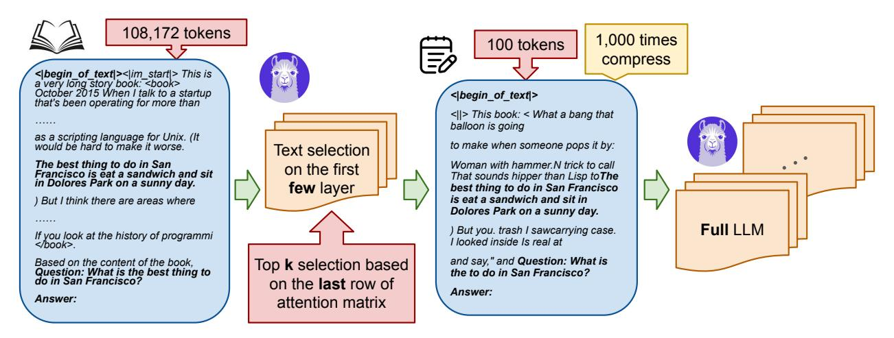

# Contents

| 1 | Introduction                                           | 2  |
|---|--------------------------------------------------------|----|
| 2 | Related Works                                          | 4  |
| 3 | Method                                                 | 5  |
|   | 3.1 Notations and Preliminary                    | 5  |
|   | 3.2 Our Algorithm: GemFilter                     | 5  |
|   | 3.3 Running Time and Memory Complexity Analysis  | 6  |
|   | 3.4 Comparison with Other Methods                | 8  |
| 4 | Experiments                                            | 8  |
|   | 4.1 Needle in a Haystack                         | 8  |
|   | 4.2 LongBench                                    | 10 |
|   | 4.3 Filter Layer Choice                          | 11 |
|   | 4.4 Running Time and GPU Memory Consumption      | 12 |
| 5 | Conclusion                                             | 13 |
| A | More Preliminary                                       | 16 |
| B | Proof of Time Complexity                               | 16 |
| C | More Details about Experiments                         | 17 |
|   | C.1 PyTorch Code                                 | 17 |
|   | C.2 Implementation Details                       | 17 |
|   | C.3 More Needle in a Haystack                    | 18 |

### 1 Introduction

Large Language Models (LLMs) have demonstrated impressive abilities [WTB+22, BCE+23] and found widespread application in various AI systems, such as ChatGPT [SZK+22], Gemini [ABW+23], and Claude [Ant24], and so on. They are also a fundamental component in building language-based AI agents that can orchestrate plans and execute complex tasks through interaction with external tools. A key requirement for many of these applications is the ability to process long-context inputs. This ability can also potentially eliminate the need of a retriever in retrieval augmented generation (RAG) [XPW+24] or enhance its performance [JMC24]. Therefore, significant efforts have been made recently to build LLMs that support long context inputs. For instance, LLaMA 3.1 [DJP+24], Mistral [JSM+23], and Phi 3.5 [AJA+24] now support input sequences of up to 128K tokens, while Gemini can handle inputs of up to 1M tokens. However, processing such lengthy inputs comes at a substantial cost in terms of computational resources and time. Therefore, accelerating the LLM generation speed while simultaneously reducing GPU memory consumption for long-context inputs is essential to minimize response latency and increase throughput for LLM API calls.

One prominent optimization for fast text generation in decoder-only LLMs (i.e., using a causal attention mask) is the KV cache. Specifically, there are two phases involved in auto-regressive generation. Given a long context input, the first is the prompt computation phase, when the LLM computes the KV cache for all layers, storing the intermediate attention keys and values of the input tokens. Next, in the iterative generation phase, the LLM generates tokens iteratively using the pre-computed KV cache, avoiding redundant computations. GPU memory usage and running time scale linearly with the KV cache size, meaning that the computational is high for long inputs.

To reduce GPU memory usage and running time during the iterative generation phase, H2O [ZSZ+23] and SnapKV [LHY+24] introduce static methods to compress/evict the KV cache. These techniques can shrink the KV cache size from 128K to 1024 with negligible performance loss, resulting in faster speeds and lower GPU memory consumption during the iterative generation phase. However, these methods do not improve the efficiency of the prompt computation phase, which becomes the dominant bottleneck as the input context lengthens. Thus, we ask:

Can we accelerate the speed and reduce memory usage during the prompt computation phase?

We observe that when serving a query, LLMs often find the necessary information in the early layers, even before generating the answer. Specifically, the relevant tokens can be identified using the attention matrix from these early layers (Figure 2), which we refer to as filter layers. Figure 1 provides a real example from the Needle in a Haystack task, where LLMs must find a small piece of information within a large context. For LLaMA 3.1 8B, we observe that the information needed to answer the query can be distilled from the attention matrix in any of the 13th-19th layers. Furthermore, LLMs explicitly summarize the required information in these filter layers. As a consequence, we only need to perform the prompt computation on a long context input for the filter layers, allowing us to compress the input tokens into a smaller subset (e.g., reducing from 128K tokens to 100), saving both time and GPU memory. We then feed the selected tokens for full model inference and proceed with a standard generation function. Algorithm 1 in Section 3 presents our method GemFilter.

Figure 2: The last row of attention matrices in early layers can locate answer-related tokens.

Figure 1: Illustration of our method GemFilter: generation with context selection based on early filter layers. We demonstrate a real Needle in a Haystack task (Section 4.1). The original input consists of 108,172 tokens, including the initial instruction, key message, and the query. In the first step, we use the 13th layer of the LLM (LLaMA 3.1 8B Instruct) as a filter to compress the input tokens by choosing the top k indices from the last row of the attention matrix. Notably, the selected input retains the initial instruction, key message, and query. GemFilter achieves a  $1000 \times 1000$  compression, reducing the input token length to 100. In the second step, we feed the selected tokens for full LLM inference using a standard generation function, which produces the correct output. GemFilter significantly reduces running time and GPU memory with negligible performance loss.

Figure 3: Comparison of time and GPU memory usage across different methods on LLaMA 3.1 8B Instruct. 'gemfilter' represents our method, using the 13th layer as the filter. It achieves a  $2.4 \times$  speedup and reduces GPU memory usage by 30% compared to SnapKV. Additional results can be found in Section 4.4.

As shown in Figure 3, GemFilter runs faster and consumes less GPU memory than Snap-KV/H2O and standard attention (full KV cache) during the prompt computation phase. During the iterative generation phase, GemFilter has the same running time and GPU memory consumption as SnapKV/H2O, both of which outperform standard attention. We discuss the complexity further in Section 3.3 theoretically and in Section 4.4 empirically. GemFilter significantly outperforms standard attention and SnapKV on the Needle in a Haystack benchmark (Section 4.1). Additionally, on LongBench, a multi-task benchmark designed to rigorously evaluate long-context understanding across various datasets, GemFilter achieves performance comparable to SnapKV/H2O (Section 4.2).

Furthermore, our ablation study in Section [4.3](#page-11-0) show that our method is quite robust to the filter layer selection strategy.

#### Our contributions and advantages are:

- We found that LLMs can identify relevant tokens using attention matrices in the early layers, suggesting crucial information is recognized before the answer generation. Furthermore, LLMs explicitly summarize this information within specific filter layers. This observation provides insights into LLM mechanisms and opens avenues for LLM understanding and algorithm design.
- Leveraging this insight, we develop GemFilter, formulated in Algorithm [1,](#page-6-1) an inference strategy which utilizes early LLM layers as a filter to select and compress input tokens into a small subset to be processed by the full model (Figure [1\)](#page-3-0). GemFilter achieves a 2.4× speedup and reduces GPU memory consumption by 30% compared to the state-of-the-art methods like SnapKV.
- GemFilter significantly outperforms both standard attention (all KV cache) and SnapKV on the Needle in a Haystack benchmark (Section [4.1\)](#page-8-2), while maintaining performance comparable to SnapKV/H2O on the LongBench benchmark (Table [1\)](#page-10-1).
- Our approach offers several advantages: it is simple, training-free, and broadly applicable to various LLMs. Furthermore, it enhances interpretability by allowing humans to directly inspect the selected token sequence.

