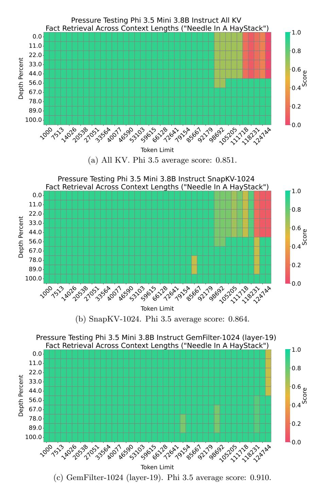

# <span id="page-17-0"></span>C More Details about Experiments

## <span id="page-17-1"></span>C.1 PyTorch Code

We provide the PyTorch code of Algorithm [1](#page-6-1) GemFilter below, where our method only needs a few lines of adaptation based on standard attention[8](#page-17-3) .

```
1 # find the selected input for the specific attention layer
2 def find_context ( self , query_states , key_states , k ) :
3 # repeat kv for group query attention
4 key_states = repeat_kv ( key_states , self . num_key_value_groups )
5 # only use the last query token for the top k selection
6 top_k_indices = top_index ( key_states , query_states [: , : , -1: , :] , k )
7 # sort the index into the correct order
8 return torch . sort ( top_k_indices , dim = -1) . indecies
9
10 def top_index ( keys , queries , k , kernel =5) :
11 # calculate the inner product
12 in_pro = torch . matmul ( queries , keys . transpose ( -1 , -2) )
13 # cumulate the score over all attention heads in one attention layer
14 in_pro = torch . sum( in_pro , dim =1 , keepdim = True )
15 # use 1D pooling for clustering , similar as SnapKV
16 in_pro = F . avg_pool1d ( in_pro , kernel = kernel , padding = kernel //2 , stride =1)
17 return torch . topk ( in_pro , k , dim = -1) . indices
```

### <span id="page-17-2"></span>C.2 Implementation Details

All the Needle in a Haystack and LongBench experiments run on A100-40GB GPUs. All the experiments of running time and memory complexity are evaluated on H100-80GB GPUs. We use

<span id="page-17-3"></span><sup>8</sup> [https://github.com/huggingface/transformers/blob/v4.43-release/src/transformers/models/mistral/modeling\\_](https://github.com/huggingface/transformers/blob/v4.43-release/src/transformers/models/mistral/modeling_mistral.py) [mistral.py](https://github.com/huggingface/transformers/blob/v4.43-release/src/transformers/models/mistral/modeling_mistral.py)

HuggingFace v4.43 PyTorch implementation. There is no randomness or training in all baseline methods or our method. For the SnapKV/H2O, we use 32 recent size/observation window, which is the optimal choice suggested by [\[LHY](#page-14-4)+24, [XJD](#page-15-4)+24]. However, GemFilter does not have an observation window. We use a maximum pooling kernel size (line 16 of the PyTorch code below) of 5 for SnapKV and our method. For generation, we use standard generation (greedy generation)[9](#page-18-1) , where num beams=1, do sample = False.

### <span id="page-18-0"></span>C.3 More Needle in a Haystack

We provide more results of Section [4.1](#page-8-2) here. In Figure [7,](#page-19-0) GemFilter outperforms All KV (standard attention) and SnapKV by a large margin with Phi 3.5 Mini 3.8B Instruct. In Figure [8,](#page-20-0) we use layer 14 of LLama 3.1 as the input filter layer, which is an empirical support of the ablation study in Section [4.3,](#page-11-0) as it can also obtain good performance on the Needle in a Haystack benchmark.

<span id="page-18-1"></span><sup>9</sup> [https://huggingface.co/docs/transformers/v4.43.2/en/main\\_classes/text\\_generation](https://huggingface.co/docs/transformers/v4.43.2/en/main_classes/text_generation)

<span id="page-19-0"></span>

Figure 7: Needle in a Haystack performance comparison of different methods using the Phi 3.5 Mini 3.8B Instruct model. The x-axis represents the length of the input tokens, while the y-axis shows the position depth percentage of the 'needle' information (e.g., 0% indicates the beginning, and 100% indicates the end). A higher score reflects better performance, meaning more effective retrieval of the 'needle' information. GemFilter significantly outperforms both standard attention (full KV cache) and SnapKV.

<span id="page-20-0"></span>

Figure 8: Needle in a Haystack performance comparison of different filter layers with LLaMA 3.1 8B Instruct model. The x-axis represents the length of the input tokens, while the y-axis shows the position depth percentage of the 'needle' information (e.g., 0% indicates the beginning, and 100% indicates the end). A higher score reflects better performance, meaning more effective retrieval of the 'needle' information.