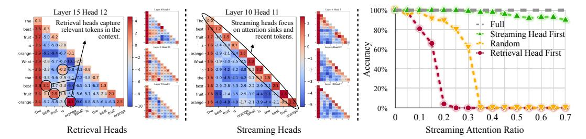
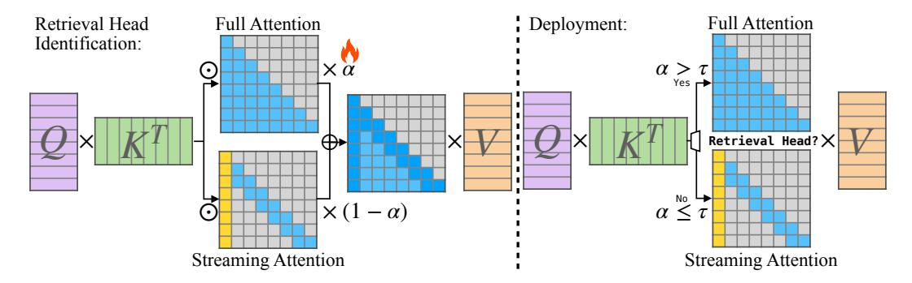

# 1 INTRODUCTION

Large language models (LLMs) [\(Touvron et al., 2023a;](#page-15-0)[b;](#page-15-1) [OpenAI, 2023;](#page-14-0) [Black et al., 2022\)](#page-11-0) are at the forefront of the AI revolution, powering advanced applications such as multi-round dialogues [\(Schul](#page-14-1)[man et al., 2022;](#page-14-1) [Taori et al., 2023;](#page-15-2) [Chiang et al., 2023\)](#page-11-1), long document summarization [\(Goyal](#page-13-0) [& Durrett, 2020;](#page-13-0) [Zhang et al., 2023a\)](#page-15-3), and tasks involving mixed modalities like visual and video understanding [\(Liu et al., 2023b;](#page-14-2) [Lin et al., 2023\)](#page-14-3). These applications often require processing extensive numbers of contextual tokens; for instance, summarizing the entire Harry Potter series could involve analyzing approximately one million tokens. The challenge intensifies with visual language models (VLMs), where a single 224×224 image corresponds to 256 tokens [\(Liu et al.,](#page-14-2) [2023b\)](#page-14-2), and a three-minute video at 24 FPS generates around 1.1 million tokens.

A critical issue in deploying LLMs in such applications is the long-context inference problem. The full attention mechanism demands that all tokens attend to every previous token for accurate representation, resulting in linearly increasing decoding and quadratically increasing pre-filling latency as the sequence length grows. Additionally, the Key-Value (KV) Cache technique, which stores keys and values from all preceding tokens, causes memory usage to scale linearly with context length. As sequences lengthen, memory is increasingly consumed by the KV cache, placing a significant computational burden on the attention mechanism. For instance, in the Llama-3-8B [\(Dubey](#page-11-2) [et al., 2024\)](#page-11-2) model architecture, serving with FP16 KV cache for 1 million tokens would require at least 137 GB of memory—exceeding the capacity of a single 80GB GPU. Additionally, the latencies

∗ Part of the work done during an internship at NVIDIA.

Figure 1: Visualization of attention maps in the Llama-2-7B model for the sentence "The best fruit is orange. What is the best fruit? Orange." shows the distinct roles of retrieval heads (e.g., Layer 15, Head 12) and streaming heads (e.g., Layer 10, Head 1). On the left, retrieval heads capture contextually relevant tokens such as "best," "fruit," and "orange," which are crucial for processing long-context information and, therefore, require a full KV cache. In the middle, streaming heads primarily focus on initial and recent tokens without emphasizing past contextual relevance. On the right, the impact of limiting attention to the sink and recent tokens on long-context passkey retrieval accuracy is shown: modifying retrieval heads severely damages performance, while constraining streaming heads has minimal impacts.

of pre-filling and decoding with such large contexts are significant, posing substantial challenges to the effective use of LLMs in long-context scenarios.

Despite numerous efforts to overcome the challenges of attention mechanisms in long-context inference, significant computational and memory issues persist. Architectural modifications, such as Grouped-Query Attention (GQA)(Ainslie et al., 2023), require model pre-training and fail to reduce computational costs. Linear Attention methods (Gu & Dao, 2023; Poli et al., 2023), while less demanding in terms of computation and memory, often underperform in long-context scenarios compared to Transformer models. Approximative attention methods, such as H2O (Zhang et al., 2023b), StreamingLLM (Xiao et al., 2023b), TOVA (Oren et al., 2024), and FastGen (Ge et al., 2024), often compromise accuracy in long-context applications and are incompatible with essential KV cache optimization techniques like GQA. KV cache quantization (Liu et al., 2024; Hooper et al., 2024), although useful, does not reduce the computation time of the attention mechanism. System-level optimizations, including FlashAttention (Dao et al., 2022; Dao, 2023), FlashDecoding (Hong et al., 2024), and PagedAttention (Kwon et al., 2023), while effective, do not reduce the KV cache size and still require significant computation for extended contexts. These limitations emphasize the need for further advancements to deploy models that handle million-level context lengths.

In this paper, we introduce a key observation that attention heads in LLMs can be categorized into two distinct types: Retrieval Heads (Wu et al., 2024) and Streaming Heads, as shown in Figure 1. *Retrieval Heads*, which represent only a fraction of the total, are crucial for processing long contexts and require full attention across all tokens. In contrast, the majority of attention heads, termed *Streaming Heads*, primarily focus on recent tokens and attention sinks (Xiao et al., 2023b), and can operate effectively with a reduced KV cache that includes only recent tokens and attention sinks.

Building on the dichotomy of retrieval and streaming heads, we propose DuoAttention, a general, straightforward, and easily integrated approach that significantly accelerates both LLM's decoding and pre-filling and reduces memory footprints, particularly in long-context scenarios. The core innovation of DuoAttention is a lightweight, optimization-based procedure that identifies non-compressible retrieval heads using synthetic datasets. Unlike existing methods that rely on attention pattern profiling (Wu et al., 2024; Ge et al., 2024; Tang et al., 2024a), DuoAttention directly measures output deviation resulting from token dropping, achieving higher compression rates and improved deployment efficiency. DuoAttention is designed with simplicity and efficiency in mind: each Transformer layer has two KV caches—a full KV cache for crucial retrieval heads and a constant KV cache for streaming heads, which stores only attention sinks and recent tokens. This design allows DuoAttention to dramatically reduce memory usage and improve decoding speed in models like Llama-2/3 and Mistral, achieving up to  $2.55\times$  for MHA and  $1.67\times$  for GQA models while speeding up decoding by up to  $2.18\times$  and  $1.50\times$  and accelerating pre-filling by up to  $1.73\times$  and  $1.63\times$  for MHA and GQA models, respectively, with minimal accuracy loss compared to full attention.

Moreover, DuoAttention is fully compatible with important optimization techniques like GQA and quantization. We show that when combined with 8-bit weight 4-bit KV cache quantization,

Figure 2: Overview of DuoAttention: (1) In the retrieval head identification phase, we assign a trainable gate value, α, to each attention head, which blends the outputs of full attention and streaming attention. The training objective is to optimize these values to minimize the deviation from the full attention model's output, while simultaneously applying a regularization loss to encourage lower gate values. This training phase is efficient, requiring only the gate values to be trainable—leaving all other model parameters frozen—thus allowing it to be completed within several hours on an 8 GPU node. (2) During deployment, these gate values are binarized to classify heads as either retrieval or streaming based on a threshold τ . Retrieval heads, identified by a gate value above the threshold, use full attention, caching the KV pairs for all tokens. In contrast, streaming heads cache only the KV pairs of recent tokens and attention sinks.

DuoAttention enables a Llama-3-8B model to handle up to 3.3 million contextual tokens measured on a single A100 GPU, achieving a 6.4× capacity increase compared to standard full attention FP16 deployments. DuoAttention paves the way for deploying LLMs in applications requiring million-level context handling.

