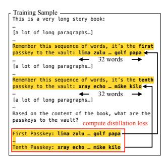
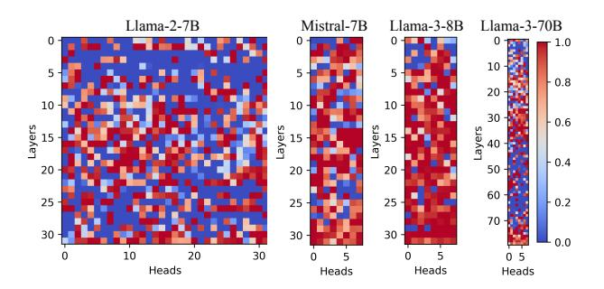
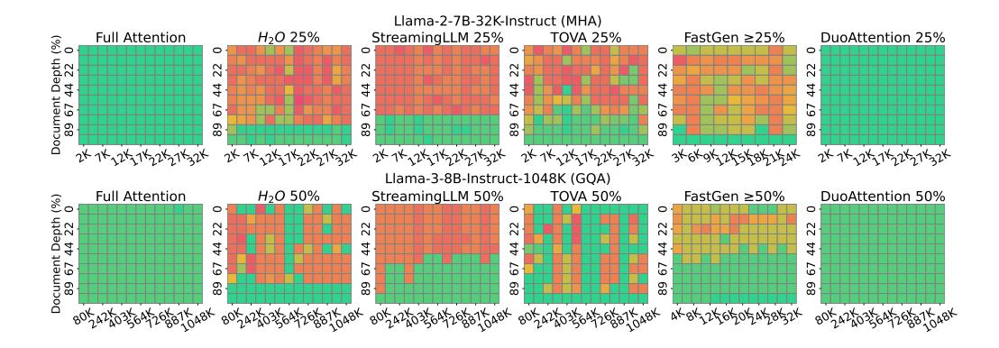
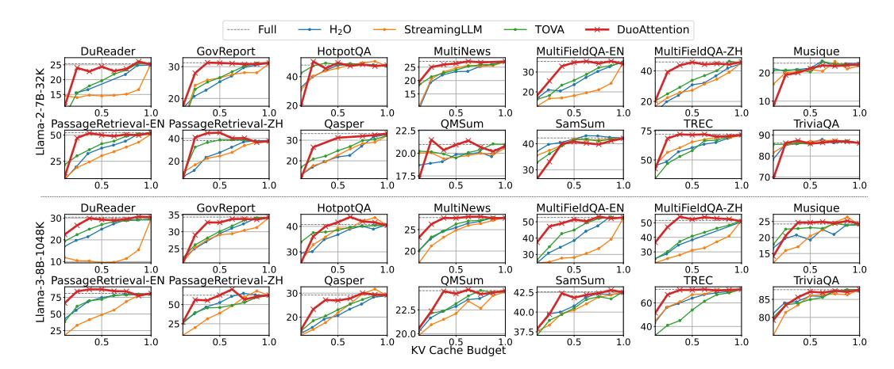
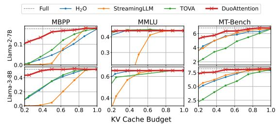
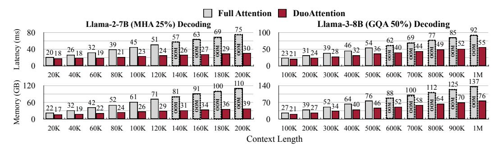
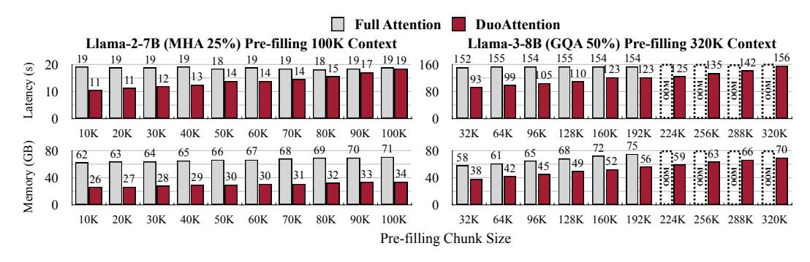
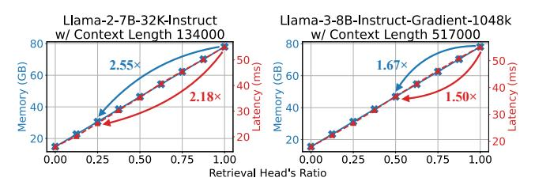
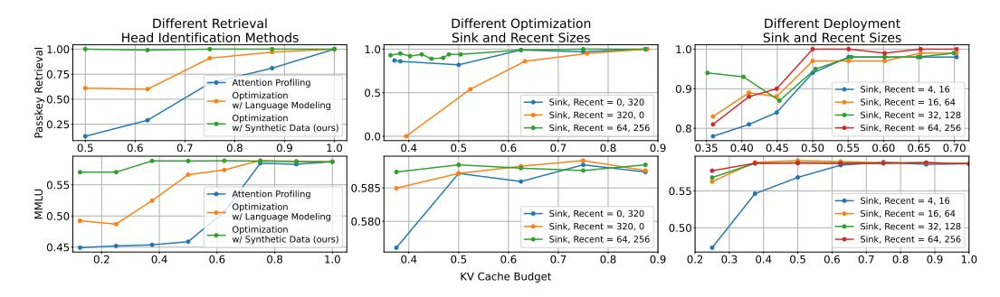

# 2 DUOATTENTION

### 2.1 RETRIEVAL AND STREAMING HEADS

Retrieval Heads In Transformer-based LLMs, attention heads exhibit distinct and consistent patterns, reflecting their specialized functionalities [\(Clark et al., 2019;](#page-11-6) [Xiao et al., 2023b;](#page-15-5) [Wu et al.,](#page-15-6) [2024\)](#page-15-6). Figure [1](#page-1-0) visualizes two types of attention heads in the Llama-2-7B-32K-Instruct model using the sentence "*The best fruit is orange. What is the best fruit? Orange*". The left panel highlights an attention head that emphasizes relevant tokens during decoding; for instance, the first occurrence of "best fruit" is accentuated while decoding the second "best fruit," and the initial "orange" is highlighted when inferring the second "orange." These attention heads, which we term *Retrieval Heads*, are crucial for context processing as they capture contextually relevant tokens. Compressing the KV cache for retrieval heads would lead to the loss of vital contextual information, and thus they require full attention across all tokens.

Streaming Heads In contrast, the attention head depicted in the middle panel of Figure [1](#page-1-0) primarily attends to recent tokens and attention sinks [\(Xiao et al., 2023b\)](#page-15-5), without highlighting earlier relevant tokens in the context. We refer to these as *Streaming Heads*. Compressing the KV cache for Streaming Heads is feasible because dropping the unattended middle tokens does not significantly alter the attention output. Therefore, streaming heads can be optimized by retaining only the KV states of attention sinks and recent tokens, without compromising the model's ability to manage long contexts.

Impact of Token Pruning on Retrieval and Streaming Heads The right panel of Figure [1](#page-1-0) shows a preliminary passkey retrieval experiment, showing that the model's performance drops significantly when the middle tokens in the KV cache of retrieval heads are pruned, i.e., replaced with streaming attention. In contrast, removing the middle tokens for streaming heads has no significant impact on passkey retrieval accuracy. This observation indicates that we can enhance computational efficiency without sacrificing the model's long-context capabilities: By dropping middle tokens for streaming heads while keeping full attention for retrieval heads, we reduce the memory demands of streaming heads to O(1), thereby improving the efficiency of processing long contexts.

Figure 3: Example from the synthetic dataset used to identify retrieval heads. We embed ten 32-word passkeys within a long text and ask the model to recall these passkeys. Distillation loss is calculated solely on the passkeys.

Figure 4: Optimized gate values of four LLMs. Llama-2-7B uses MHA with 32 heads per layer, while Mistral and Llama-3 models use GQA with 8 heads per layer. Retrieval heads have higher scores. MHA models have a lower ratio of retrieval heads compared to GQA models.

### 2.2 OPTIMIZATION-BASED IDENTIFICATION OF RETRIEVAL HEADS

Definition of Retrieval Heads Section [2.1](#page-2-0) qualitatively defines retrieval and streaming heads, but for precise identification, we need a concrete and quantitative definition. In this paper, we define "retrieval heads" as the attention heads that:

*significantly alter model outputs when restricted to recent tokens and attention sinks.*

We use this criterion to distinguish retrieval heads from streaming heads. Note that this definition differs from existing works [\(Ge et al., 2024;](#page-13-2) [Wu et al., 2024;](#page-15-6) [Tang et al., 2024a\)](#page-15-7) that rely solely on attention scores to identify retrieval heads, which overlook 1) the end-to-end impact of compressing the KV cache for specific attention heads, 2) the role of value states, and 3) the variability of attention distributions across layers and heads. In contrast, our definition directly measures output deviation, allowing us to identify attention heads crucial for long-context processing, *even when they are not apparent in attention scores*. We support this argument with ablation studies presented in Section [3.5.](#page-9-0)

Optimization-based Identification We employ an optimization-based approach to identify retrieval heads, drawing inspiration from prior work in CNN filter pruning [\(Liu et al., 2017\)](#page-14-8), as illustrated in Figure [2.](#page-2-1) First, we assign a gate value αi,j , to each key-value (KV) head in the LLM. This value intuitively represents the importance of the j-th KV head in layer i for processing long-context information. Note that in models using GQA, one KV head can be associated with multiple attention heads, and our method accounts for the KV cache compression of an entire group of attention heads.

Our optimization-based identification method directly assesses the impact of compressing the KV cache with only sink and recent tokens for each KV head. We begin by initializing the gate value αi,j ∈ [0, 1] for each head at 1, assuming that all heads initially serve as retrieval heads. These gate values are then optimized, with the LLM's parameters remaining fixed, limiting the number of trainable parameters to N × H and preventing the impact to the model's original abilities.

During the forward pass, we combine the outputs of full and streaming attention (which attends only to sink and recent tokens) for each KV head, using the gate value as the mixing weight:

attn
$$_{i,j} = \alpha_{i,j} \cdot \texttt{full\_attn} + (1-\alpha_{i,j}) \cdot \texttt{streaming\_attn}$$

where the attention calculations are defined as:

$$\text{full_attn} = \text{softmax}(\bm{Q}\bm{K}^T\odot\bm{M}_{\text{causal}})\bm{V},$$
  $\text{streaming_attn} = \text{softmax}(\bm{Q}\bm{K}^T\odot\bm{M}_{\text{streaming}})\bm{V},$ 

where Mcausal is the causal attention mask (a lower triangular matrix), and Mstreaming represents a Λ-like mask [\(Han et al., 2023;](#page-13-5) [Xiao et al., 2023b\)](#page-15-5) that attends only to recent and initial tokens.

Synthetic Dataset for Identifying Retrieval Heads However, relying solely on natural language modeling objectives is insufficient for identifying retrieval heads because the supervision signal in

Figure 5: **Decoding (left) and Chunked Pre-filling (right) Processes in DuoAttention:** (1) The retrieval heads' KV cache stores all tokens, while the streaming heads' KV cache retains only recent tokens and attention sinks, ensuring constant memory usage. (2) The chunked pre-filling process of DuoAttention's streaming heads on a 16-token sequence, with one attention sink, two recent tokens, and a chunk size of 4. DuoAttention's streaming heads have linear time and constant memory complexity during long sequence pre-filling.

natural text that requires inference over long spans is sparse, and most tokens can be inferred using local context. To address this, we design a synthetic dataset specifically aimed at enhancing the model's long-context retrieval capabilities, allowing us to effectively identify which KV heads can be compressed without compromising the model's performance. As depicted in Figure 3, we create a passkey-retrieval dataset by embedding ten randomly generated passkey sequences of s tokens in ten random locations within a very long context (s=32 in experiments). The model is then tasked with recalling these ten sequences at the end of the context.

**Training and Loss Functions** We optimize the distillation loss, which is the L2 difference between the e last hidden state of the full attention model ( $H_{\text{full}}$ ) and those of the model using DuoAttention ( $H_{\text{mixed}}$ ), focusing only on the last l passkey tokens in the entire inputs with T tokens:

$$\mathcal{L}_{\text{distill}} = \frac{1}{N} \sum_{i=1}^{N} \sum_{j=T-l+1}^{T} (\boldsymbol{H}_{\text{full}}^{(i)}[j] - \boldsymbol{H}_{\text{mixed}}^{(i)}[j])^{2}$$
 (1)

Our synthetic dataset ensures that every supervision signal is relevant to the final compression strategy, making the process lossless in terms of information retrieval accuracy. It proves to be more effective than using natural language modeling alone (see ablation studies in Section 13). We use the L1 regularization term (a.k.a, Lasso (Tibshirani, 1996)) to encourage sparsity in the gate values:

$$\mathcal{L}_{\text{reg}} = \sum_{i=1}^{L} \sum_{j=1}^{H} |\alpha_{i,j}|. \tag{2}$$

The final training loss is a combination of the distillation loss and the regularization loss, weighted by a hyperparameter  $\lambda$ , which we set as 0.05 in our experiments:

$$\mathcal{L} = \mathcal{L}_{\text{distill}} + \lambda \mathcal{L}_{\text{reg}}.$$
 (3)

Since the total number of trainable parameters is only thousands of floating-point numbers, this optimization process is fairly fast, with only 2,000 steps needed. All training experiments in our paper can be conducted on 8×NVIDIA A100 GPU servers.

### 2.3 Deploying LLMs with DuoAttention

**Binarizing Attention Implementations** At inference time, we apply full attention exclusively to the designated retrieval heads, identified using the optimized gate values from the training phase (as shown in Figure 4). We binarize the attention policy for each head based on a threshold  $\tau$ , determined by a specified sparsity quantile, to differentiate between retrieval heads and streaming heads:

$$attn_{i,j} = \begin{cases} full\_attn & \text{if } \alpha_{i,j} > \tau \\ streaming\_attn & \text{otherwise} \end{cases}$$
 (4)

Figure 6: DuoAttention provides comparable accuracy as full attention on the Needle-in-a-Haystack benchmark using 25% full attention ratio on the MHA model and 50% full attention ratio on the GQA model.

**Reordering Attention Heads** Before deployment, we preprocess the model by reordering the output channels of the Query, Key, and Value projection weights according to the attention head assignments. This reordering groups retrieval heads and streaming heads into two distinct, consecutive clusters, allowing for efficient slicing and concatenation operations when managing the KV cache for these two types of heads within a layer, rather than relying on scattering and gathering operations.

**Decoding** As shown in Figure 5, we allocate two KV caches for each layer in the LLM during decoding: one for retrieval heads, which stores all past Keys and Values, and another for streaming heads, which stores only attention sinks and recent tokens, maintaining a constant size. When a new token is processed, its query, key, and value vectors are split along the head dimension to compute full attention for retrieval heads and streaming attention for streaming heads. The results are then concatenated along the head dimension for the output projection.

Chunked Pre-filling We use FlashAttention-2 (Dao, 2023) to pre-fill the KV caches for both retrieval and streaming heads. In long-context LLMs, chunked pre-filling is a common practice (Agrawal et al., 2023; Kwon et al., 2023), dividing the prompt into fixed-length chunks to pre-fill the KV cache. This technique significantly reduces peak memory usage (see Table 10) by lowering the peak intermediate activation size in linear layers from sequence length to chunk size. DuoAttention is fully compatible with chunked pre-filling, and the streaming heads' pre-filling in DuoAttention can be achieved with linear time and constant memory complexity, without requiring specialized kernels. As shown in Figure 5, once a layer's KVs are computed, the streaming head's KV cache is immediately pruned to keep only the sink and recent tokens. The next chunk of incoming tokens will only attend to a constant number of contextual tokens during pre-filling. Let L represent the sequence length and K the chunk size. The pre-filling time complexity for streaming heads is optimized from  $O(L^2)$  to O(LK), and the memory complexity is reduced from O(L) to O(K).

It's important to note that DuoAttention's design is well-suited for batch operations, which can further enhance LLM efficiency in serving scenarios with large batch sizes.

### 3 EXPERIMENTS

#### 3.1 SETUPS

Models, Datasets, and Baselines We evaluate DuoAttention on both long-context and short-context benchmarks to demonstrate that our method preserves model performance on tasks requiring both long and short contexts while significantly improving efficiency. For long-context evaluations, we use the Needle-in-a-Haystack (NIAH) benchmark (Kamradt, 2024) and LongBench (Bai et al., 2023). For short-context evaluations, we assess performance on MMLU (Hendrycks et al., 2021), MBPP (Austin et al., 2021), and MT-Bench (Zheng et al., 2023). We employ state-of-the-art open-source models, including Llama-2-7B-chat (Touvron et al., 2023b) (and its long-context variant

Figure 7: DuoAttention provides better KV budget and accuracy trade-off on LongBench benchmarks.

Llama-2-7B-32K-Instruct (Together, 2023)), Llama-3-[8,70]B-Instruct (and its long-context variant Llama-3-8B-Instruct-Gradient-1048k \*), and Mistral-7B-v0.2-Instruct (Jiang et al., 2023). We compare our method against KV cache compression algorithms, including H2O (Zhang et al., 2023b), TOVA (Oren et al., 2024), FastGen (Ge et al., 2024), and StreamingLLM (Xiao et al., 2023b).

**Implementation Details** We implement DuoAttention in PyTorch (Paszke et al., 2019) using RoPE (Su et al., 2021) and RMSNorm kernels from FlashInfer (Ye et al., 2024). For retrieval head identification, we use a batch size of 1, inserting ten 32-word passkeys into the BookSum (Kryściński et al., 2021) dataset. The identification process uses 128 sink tokens and 256 recent tokens. Training samples are drawn from 50 intervals ranging from 1,000 tokens to the model-specific maximum length. Passkeys are randomly inserted at 1000 points within the context. Further details are included in Appendix Section A.1. We optimize gate values using the AdamW (Kingma & Ba, 2015) optimizer, starting with a learning rate of 0.02, warming up from 0.002 in the first 400 steps, and reducing back to 0.002 in the final 400 steps. All experiments run for 2,000 steps on NVIDIA A100 GPUs.

#### 3.2 Long-Context Benchmarks

We evaluate DuoAttention using the Needle-in-a-Haystack (NIAH) benchmark and LongBench (Bai et al., 2023). We use two long-context models: Llama-2-7B-32K-Instruct and Llama-3-8B-Instruct-Gradient-1048k. We configure DuoAttention with a 25% retrieval head ratio for Llama-2-7B-32K-Instruct and a 50% ratio for Llama-3-8B-Instruct-Gradient-1048k. We compare DuoAttention with H2O, TOVA, and StreamingLLM using the same KV cache budget. We use 64 sink, 256 recent tokens, and 32,000 pre-filling chunk size for DuoAttention. Since the original designs of H2O and TOVA do not support long contexts, we modify their algorithms by replacing the pre-filling stage with FlashAttention and simulating decoding for the last 50 tokens of the input, following Tang et al. (2024b). FastGen's algorithm does not allow for the specification of the KV compression ratio, as it fluctuates with inputs. Therefore, we adjust the attention recovery ratio to ensure the KV cache budget is, on average, above 25% or 50% in the experiments shown in Figure 6. Additionally, FastGen's quadratic memory cost during the attention profiling phase limits its ability to handle long-context samples. We measure FastGen's performance on NIAH for Llama-2-7B up to a 24K context and for Llama-3-8B up to a 32K context; beyond these sizes, it results in out-of-memory errors. Detailed baseline implementations and justifications are provided in Appendix Section A.3 and Section A.5.

**Needle-in-a-Haystack** (**NIAH**) is a challenging pressure test designed to assess the ability of models to accurate identify and retrieve relevant information from lengthy context. As shown in Figure 6, all baseline methods fail to retrieve correct answers from the various depths of the long sequence, as they discard the KV cache containing the necessary information during generation. In contrast, DuoAttention retains all KV caches in the retrieval heads while discarding only those in the streaming

\*https://huggingface.co/gradientai/Llama-3-8B-Instruct-Gradient-1048k

Table 1: Llama-3-70B results on short benchmarks.

|         | Budget | MMLU   | MBPP   | MT-B |
|---------|--------|--------|--------|------|
| Full    | 100%   | 79.38% | 47.85% | 8.93 |
| H2O     | 50%    | 79.26% | 32.12% | 7.16 |
| TOVA    | 50%    | 79.15% | 36.09% | 7.96 |
| SLLM    | 50%    | 77.46% | 5.57%  | 5.41 |
| DuoAttn | 50%    | 79.35% | 47.09% | 9.14 |

Figure 8: Results on short benchmarks.

Figure 9: **Per-token decoding latency and memory** usage of DuoAttention compared to full attention across varying **context sizes**. DuoAttention uses a 25% retrieval head ratio for Llama-2-7B (MHA) and 50% for Llama-3-8B (GQA). DuoAttention achieves up to  $2.45 \times$  memory reduction for MHA and  $1.65 \times$  for GQA models, along with up to  $2.13 \times$  latency reduction for MHA and  $1.5 \times$  for GQA models. These reductions approach the inverse of the retrieval head ratios as context length increases. Out-of-memory (OOM) results are linearly extrapolated from measured data.

heads, preserving the model's retrieval capability. As a result, DuoAttention demonstrates strong performance across all sequence depths, handling lengths up to 1048K tokens effectively.

**LongBench** (Bai et al., 2023) is a comprehensive suite of long-context datasets encompassing multiple tasks and natural texts, designed to assess long-context understanding capabilities more thoroughly. Figure 7 shows the performance on 14 LongBench tasks, comparing different methods based on their KV cache budgets. DuoAttention shows a superior trade-off between KV budget and accuracy on most tasks, underscoring its generalizability. Notably, DuoAttention achieves performance comparable to full attention on most tasks, using a 25% KV cache budget for MHA and a 50% KV cache budget for GQA, consistent with the results observed in the needle-in-a-haystack benchmark. We compare DuoAttention with FastGen in Table 5 and 6 in the Appendix. Table 3 and 4 in the Appendix provides full results for all 21 LongBench tasks using the 25% and 50% KV cache budget for the two models, showing that DuoAttention consistently outperforms baselines across most tasks and achieves the highest average scores.

### 3.3 SHORT-CONTEXT BENCHMARKS.

To ensure that DuoAttention does not compromise the model's performance on short-context tasks, we evaluate it alongside all baselines on three short-context benchmarks: MMLU, MBPP, and MT-Bench. These benchmarks assess the model's knowledge, coding abilities, and helpfulness. We use one-shot prompting for MMLU and zero-shot prompting for MBPP and MT-Bench. For DuoAttention, we configure 32 sink tokens and 128 recent tokens on MMLU, and 16 sink tokens and 64 recent tokens on MBPP and MT-Bench. As shown in Figure 8 and Table 1, DuoAttention consistently outperforms all baselines under the same KV cache budget across various models, including Llama-2-7B, Llama-3-8B, and Llama-3-70B-Instruct. With a 50% KV cache budget, DuoAttention achieves near-lossless performance on most benchmarks, demonstrating that it preserves the model's original capabilities.

Figure 10: **Pre-filling latency and memory** usage of DuoAttention compared to full attention across varying **pre-filling chunk sizes**. DuoAttention uses a 25% retrieval head ratio for Llama-2-7B (MHA), pre-filling a context of 100K tokens, and a 50% ratio for Llama-3-8B (GQA), pre-filling a context of 320K tokens. As the pre-filling chunk size decreases, DuoAttention achieves up to  $1.73 \times$  latency reduction for MHA and  $1.63 \times$  for GQA models, with memory reductions up to  $2.38 \times$  for MHA and  $1.53 \times$  for GQA models.

4 +DuoAttention 3.30 +8-bit Weight 4-bit KV 1.84 1 0.52 1

Figure 11: DuoAttention's decoding memory and latency vs. KV budget with a fixed context length. Memory and latency are reduced linearly when the ratio of retrieval heads is reduced. DuoAttention achieves up to  $2.55\times$  memory reduction for MHA and  $1.67\times$  for GQA models, along with up to  $2.18\times$  latency reduction for MHA and  $1.50\times$  for GQA models.

Figure 12: Combined with 8-bit weight and 4-bit KV cache quantization, DuoAttention can accommodate 3.30 million tokens on a single A100-80G GPU for the Llama-3-8B model.

#### 3.4 EFFICIENCY RESULTS

We evaluate DuoAttention's decoding latency and memory usage on Llama-2-7B and Llama-3-8B models on a single NVIDIA A100 GPU. We pre-allocate the KV cache for the entire benchmark sequence to prevent the extra overheads of dynamic memory allocations. The default number format for weights and activations is BFloat16. By employing a retrieval head ratio of 25% for Llama-2-7B and 50% for Llama-3-8B, DuoAttention maintains accuracy while significantly improving efficiency.

**Decoding Efficiency** As shown in Figure 9, DuoAttention's decoding speed scales linearly, though with a flatter slope compared to full attention, reflecting the chosen retrieval head ratio. This efficient scaling leads to significant reductions in memory usage and notable improvements in decoding speed. These improvements approach the inverse of the retrieval head ratios as context length increases. Figure 11 shows DuoAttention's speedup and memory savings across various KV budget settings for a fixed context size. Both decoding latency and memory usage decrease linearly as the ratio of retrieval heads is reduced in the deployment configuration. Under the settings in Figure 11, DuoAttention achieves maximum improvements on an A100 GPU:  $2.55 \times$  memory reduction for MHA and  $1.67 \times$  for GQA models, and  $2.18 \times$  latency reduction for MHA and  $1.50 \times$  for GQA models.

**Pre-filling Efficiency** DuoAttention also accelerates long-context pre-filling for LLMs, as discussed in Section 2.3. Figure 10 shows that DuoAttention significantly reduces both pre-filling latency and memory usage, with these savings increasing as the pre-filling chunk size decreases. This is because the time and memory complexity for the streaming heads are reduced with smaller chunk sizes. DuoAttention achieves up to  $1.73 \times$  latency reduction for MHA and  $1.63 \times$  for GQA models, with memory reductions of up to  $2.38 \times$  for MHA and  $1.53 \times$  for GQA models.

Figure 13: Ablation studies: (1) Comparison of retrieval head identification methods, showing the superiority of our optimization-based approach with synthetic data over attention profiling and language modeling. (2) Analysis of start and recent token sizes shows that combining sink and recent attention optimally identifies retrieval heads. (3) Deployment performance indicates 16 attention sinks and 64 recent tokens are optimal, with minimal gains beyond these values.

Combiniation with Quantization To fit more tokens into limited memory, we can integrate weight and KV cache quantization with DuoAttention to maximize KV cache capacity. Previous studies have shown that weight quantization (Xiao et al., 2023a; Lin et al., 2024) and 4-bit KV cache quantization (Lin\* et al., 2024; Liu et al., 2024; Hooper et al., 2024) do not compromise model performance. We combine DuoAttention with the QServe (Lin\* et al., 2024) quantization method and kernels to enable 8-bit weight and 4-bit KV cache LLM inference. Measured results are shown in Figure 12. Combining quantization techniques with DuoAttention allows us to accommodate up to 3.30 million tokens on a single A100-80G GPU using the Llama-3-8B model, resulting in a  $6.4 \times$  increase in capacity compared to the naive full attention BF16 deployment.

#### 3.5 ABLATION STUDIES

We conduct ablation studies using the Mistral-7B-Instruct-v0.2 on passkey retrieval and MMLU datasets. For the passkey retrieval task, we embed an 8-word passkey within a 30K-word text and perform a linear sweep across 100 insertion depths, reporting exact match accuracies.

**Optimization-based vs. Attention Profiling-based Retrieval Head Identification** We assess our optimization-based method against attention profiling, as used in FastGen (Ge et al., 2024) and RazorAttention (Tang et al., 2024a), utilizing the same synthetic passkey dataset for both. Results in Figure 13 (1) show our method significantly outperforms attention profiling, which struggles to identify retrieval heads, affecting model optimization accurately.

**Optimizing with Synthetic Data vs. Language Modeling** As illustrated in Figure 13 (1), our approach of using synthetic data to identify retrieval heads produces significantly better results than traditional language modeling, which computes loss on all tokens in natural data.

**Necessity of Sink+Recent Attention in Optimization** Figure 13 (2) highlights the importance of combining sink and recent attention during the optimization phase. Exclusive reliance on either starting or recent token attention is inadequate for effective retrieval head identification.

**Deployment Phase Configuration** We analyze the deployment configuration for attention sinks and recent tokens within streaming heads. Our findings indicate that performance plateaus at 16 sink tokens and 64 recent tokens (Figure 13 (3)). Further increases yield marginal improvements.

### 4 RELATED WORK

Various approaches have been developed to scale up LLMs and improve their efficiency in handling long contexts. These methods can be grouped into four main categories: optimizing model architectures, using approximate attention mechanisms, applying KV cache quantization, and system-level optimizations.

Model Architecture Multi-Query Attention (MQA)[\(Shazeer, 2019\)](#page-14-16) and Grouped-Query Attention (GQA)[\(Ainslie et al., 2023\)](#page-11-3) reduce the size of the Key-Value (KV) cache by sharing KV heads across query heads. However, these methods require pre-training with specific architectures and do not reduce computational costs. Linear attention Transformers [\(Gu & Dao, 2023\)](#page-13-1) reduce memory usage but tend to underperform on tasks requiring long-context processing.

Approximate Attention Methods like Sparse Transformer [\(Child et al., 2019\)](#page-11-10) and Long-Former [\(Beltagy et al., 2020\)](#page-11-11) use local or block attention patterns to reduce computational complexity. BigBird [\(Zaheer et al., 2020\)](#page-15-14) achieves linear complexity by combining local and global attention, but many of these methods require custom GPU kernels or retraining, limiting their practicality. H2O [\(Zhang et al., 2023b\)](#page-15-4) and TOVA [\(Oren et al., 2024\)](#page-14-5) simplify attention by discarding tokens based on query patterns. StreamingLLM [\(Xiao et al., 2023b\)](#page-15-5) identifies "attention sinks" and proposes always retaining initial and recent tokens to maintain constant decoding latency and memory usage, allowing the model to process significantly more input tokens than the pre-training sequence length. FastGen [\(Ge et al., 2024\)](#page-13-2) profiles attention heads to discard tokens during decoding. However, our experiments show that these methods degrade the long-context abilities of LLMs. Also, these methods cannot reduce the pre-filling cost of long-context LLMs.

KV Cache Quantization Techniques such as 8-bit and 4-bit quantization [\(Liu et al., 2024;](#page-14-6) [Hooper](#page-13-3) [et al., 2024;](#page-13-3) [Lin\\* et al., 2024\)](#page-14-15) reduce the size of KV caches, but they do not address the computational overhead of attention kernels. These methods are complementary to DuoAttention and can be used together to further reduce memory usage.

System Optimizations vLLM [\(Kwon et al., 2023\)](#page-14-7) and FlashAttention [\(Dao et al., 2022;](#page-11-4) [Dao,](#page-11-5) [2023\)](#page-11-5) improve attention computation efficiency by optimizing batch processing and utilizing GPU memory hierarchies. FlashDecoding [\(Hong et al., 2024\)](#page-13-4) and RingAttention [\(Liu et al., 2023a\)](#page-14-17) introduce further improvements in decoding speed and sequence-level parallelism. While these methods enhance computational performance, they do not address KV cache size reduction, making them complementary to DuoAttention for additional speed and memory optimization.

Recent Works Several recent works share similar ideas with DuoAttention. [Wu et al.](#page-15-6) [\(2024\)](#page-15-6) introduces the concept of retrieval heads to explain LLMs' long-context capabilities. However, their approach does not compress the KV cache for non-retrieval heads, focusing solely on accuracy. MInference [\(Jiang et al., 2024\)](#page-13-8) accelerates pre-filling for long-context LLMs by using sparse attention patterns but does not optimize KV cache storage or latency during decoding. RazorAttention [\(Tang](#page-15-7) [et al., 2024a\)](#page-15-7) also divides attention heads into retrieval and non-retrieval categories but relies on attention profiling, which, as our experiments show, is less accurate than our optimization-based approach. Also, RazorAttention doesn't optimize pre-filling. DuoAttention offers more effective KV cache management and higher compression rates, leading to better performance for both pre-filling and decoding in long-context applications.

