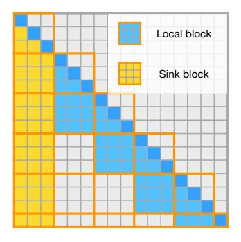
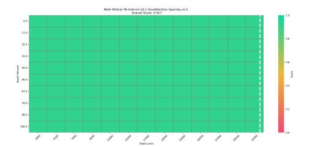
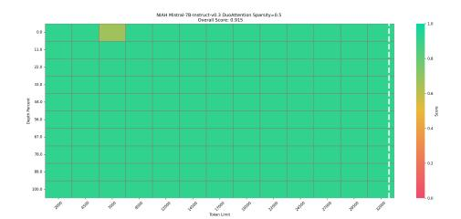

# REFERENCES

- Griffin Adams, Faisal Ladhak, Hailey Schoelkopf, and Raja Biswas. Cold compress: A toolkit for benchmarking kv cache compression approaches, 8 2024. URL [https://www.answer.ai/](https://www.answer.ai/posts/2024-08-01-cold-compress.html) [posts/2024-08-01-cold-compress.html](https://www.answer.ai/posts/2024-08-01-cold-compress.html).
- Amey Agrawal, Ashish Panwar, Jayashree Mohan, Nipun Kwatra, Bhargav S. Gulavani, and Ramachandran Ramjee. Sarathi: Efficient llm inference by piggybacking decodes with chunked prefills, 2023. URL <https://arxiv.org/abs/2308.16369>.
- Joshua Ainslie, James Lee-Thorp, Michiel de Jong, Yury Zemlyanskiy, Federico Lebrón, and Sumit Sanghai. Gqa: Training generalized multi-query transformer models from multi-head checkpoints, 2023.
- Jacob Austin, Augustus Odena, Maxwell Nye, Maarten Bosma, Henryk Michalewski, David Dohan, Ellen Jiang, Carrie Cai, Michael Terry, Quoc Le, et al. Program synthesis with large language models. *arXiv preprint arXiv:2108.07732*, 2021.
- Yushi Bai, Xin Lv, Jiajie Zhang, Hongchang Lyu, Jiankai Tang, Zhidian Huang, Zhengxiao Du, Xiao Liu, Aohan Zeng, Lei Hou, Yuxiao Dong, Jie Tang, and Juanzi Li. Longbench: A bilingual, multitask benchmark for long context understanding. *arXiv preprint arXiv:2308.14508*, 2023.
- Iz Beltagy, Matthew E. Peters, and Arman Cohan. Longformer: The long-document transformer, 2020. arXiv:2004.05150.
- Sid Black, Stella Biderman, Eric Hallahan, Quentin Anthony, Leo Gao, Laurence Golding, Horace He, Connor Leahy, Kyle McDonell, Jason Phang, Michael Pieler, USVSN Sai Prashanth, Shivanshu Purohit, Laria Reynolds, Jonathan Tow, Ben Wang, and Samuel Weinbach. GPT-NeoX-20B: An open-source autoregressive language model, 2022. arXiv: 2204.06745.
- Wei-Lin Chiang, Zhuohan Li, Zi Lin, Ying Sheng, Zhanghao Wu, Hao Zhang, Lianmin Zheng, Siyuan Zhuang, Yonghao Zhuang, Joseph E. Gonzalez, Ion Stoica, and Eric P. Xing. Vicuna: An open-source chatbot impressing gpt-4 with 90%\* chatgpt quality, March 2023. URL [https:](https://lmsys.org/blog/2023-03-30-vicuna/) [//lmsys.org/blog/2023-03-30-vicuna/](https://lmsys.org/blog/2023-03-30-vicuna/).
- Rewon Child, Scott Gray, Alec Radford, and Ilya Sutskever. Generating long sequences with sparse transformers. 2019.
- Kevin Clark, Urvashi Khandelwal, Omer Levy, and Christopher D. Manning. What does BERT look at? an analysis of BERT's attention. In Tal Linzen, Grzegorz Chrupała, Yonatan Belinkov, and Dieuwke Hupkes (eds.), *Proceedings of the 2019 ACL Workshop BlackboxNLP: Analyzing and Interpreting Neural Networks for NLP*, pp. 276–286, Florence, Italy, August 2019. Association for Computational Linguistics. doi: 10.18653/v1/W19-4828. URL [https://aclanthology.](https://aclanthology.org/W19-4828) [org/W19-4828](https://aclanthology.org/W19-4828).
- Tri Dao. FlashAttention-2: Faster attention with better parallelism and work partitioning, 2023.
- Tri Dao, Daniel Y. Fu, Stefano Ermon, Atri Rudra, and Christopher Ré. FlashAttention: Fast and memory-efficient exact attention with IO-awareness, 2022. arXiv:2205.14135.
- Abhimanyu Dubey, Abhinav Jauhri, Abhinav Pandey, Abhishek Kadian, Ahmad Al-Dahle, Aiesha Letman, Akhil Mathur, Alan Schelten, Amy Yang, Angela Fan, Anirudh Goyal, Anthony Hartshorn, Aobo Yang, Archi Mitra, Archie Sravankumar, Artem Korenev, Arthur Hinsvark, Arun Rao, Aston Zhang, Aurelien Rodriguez, Austen Gregerson, Ava Spataru, Baptiste Roziere, Bethany Biron, Binh Tang, Bobbie Chern, Charlotte Caucheteux, Chaya Nayak, Chloe Bi, Chris Marra, Chris McConnell, Christian Keller, Christophe Touret, Chunyang Wu, Corinne Wong, Cristian Canton Ferrer, Cyrus Nikolaidis, Damien Allonsius, Daniel Song, Danielle Pintz, Danny Livshits, David Esiobu, Dhruv Choudhary, Dhruv Mahajan, Diego Garcia-Olano, Diego Perino, Dieuwke Hupkes, Egor Lakomkin, Ehab AlBadawy, Elina Lobanova, Emily Dinan, Eric Michael Smith, Filip Radenovic, Frank Zhang, Gabriel Synnaeve, Gabrielle Lee, Georgia Lewis Anderson, Graeme Nail, Gregoire Mialon, Guan Pang, Guillem Cucurell, Hailey Nguyen, Hannah Korevaar, Hu Xu, Hugo Touvron, Iliyan Zarov, Imanol Arrieta Ibarra, Isabel Kloumann, Ishan Misra, Ivan Evtimov,

Jade Copet, Jaewon Lee, Jan Geffert, Jana Vranes, Jason Park, Jay Mahadeokar, Jeet Shah, Jelmer van der Linde, Jennifer Billock, Jenny Hong, Jenya Lee, Jeremy Fu, Jianfeng Chi, Jianyu Huang, Jiawen Liu, Jie Wang, Jiecao Yu, Joanna Bitton, Joe Spisak, Jongsoo Park, Joseph Rocca, Joshua Johnstun, Joshua Saxe, Junteng Jia, Kalyan Vasuden Alwala, Kartikeya Upasani, Kate Plawiak, Ke Li, Kenneth Heafield, Kevin Stone, Khalid El-Arini, Krithika Iyer, Kshitiz Malik, Kuenley Chiu, Kunal Bhalla, Lauren Rantala-Yeary, Laurens van der Maaten, Lawrence Chen, Liang Tan, Liz Jenkins, Louis Martin, Lovish Madaan, Lubo Malo, Lukas Blecher, Lukas Landzaat, Luke de Oliveira, Madeline Muzzi, Mahesh Pasupuleti, Mannat Singh, Manohar Paluri, Marcin Kardas, Mathew Oldham, Mathieu Rita, Maya Pavlova, Melanie Kambadur, Mike Lewis, Min Si, Mitesh Kumar Singh, Mona Hassan, Naman Goyal, Narjes Torabi, Nikolay Bashlykov, Nikolay Bogoychev, Niladri Chatterji, Olivier Duchenne, Onur Çelebi, Patrick Alrassy, Pengchuan Zhang, Pengwei Li, Petar Vasic, Peter Weng, Prajjwal Bhargava, Pratik Dubal, Praveen Krishnan, Punit Singh Koura, Puxin Xu, Qing He, Qingxiao Dong, Ragavan Srinivasan, Raj Ganapathy, Ramon Calderer, Ricardo Silveira Cabral, Robert Stojnic, Roberta Raileanu, Rohit Girdhar, Rohit Patel, Romain Sauvestre, Ronnie Polidoro, Roshan Sumbaly, Ross Taylor, Ruan Silva, Rui Hou, Rui Wang, Saghar Hosseini, Sahana Chennabasappa, Sanjay Singh, Sean Bell, Seohyun Sonia Kim, Sergey Edunov, Shaoliang Nie, Sharan Narang, Sharath Raparthy, Sheng Shen, Shengye Wan, Shruti Bhosale, Shun Zhang, Simon Vandenhende, Soumya Batra, Spencer Whitman, Sten Sootla, Stephane Collot, Suchin Gururangan, Sydney Borodinsky, Tamar Herman, Tara Fowler, Tarek Sheasha, Thomas Georgiou, Thomas Scialom, Tobias Speckbacher, Todor Mihaylov, Tong Xiao, Ujjwal Karn, Vedanuj Goswami, Vibhor Gupta, Vignesh Ramanathan, Viktor Kerkez, Vincent Gonguet, Virginie Do, Vish Vogeti, Vladan Petrovic, Weiwei Chu, Wenhan Xiong, Wenyin Fu, Whitney Meers, Xavier Martinet, Xiaodong Wang, Xiaoqing Ellen Tan, Xinfeng Xie, Xuchao Jia, Xuewei Wang, Yaelle Goldschlag, Yashesh Gaur, Yasmine Babaei, Yi Wen, Yiwen Song, Yuchen Zhang, Yue Li, Yuning Mao, Zacharie Delpierre Coudert, Zheng Yan, Zhengxing Chen, Zoe Papakipos, Aaditya Singh, Aaron Grattafiori, Abha Jain, Adam Kelsey, Adam Shajnfeld, Adithya Gangidi, Adolfo Victoria, Ahuva Goldstand, Ajay Menon, Ajay Sharma, Alex Boesenberg, Alex Vaughan, Alexei Baevski, Allie Feinstein, Amanda Kallet, Amit Sangani, Anam Yunus, Andrei Lupu, Andres Alvarado, Andrew Caples, Andrew Gu, Andrew Ho, Andrew Poulton, Andrew Ryan, Ankit Ramchandani, Annie Franco, Aparajita Saraf, Arkabandhu Chowdhury, Ashley Gabriel, Ashwin Bharambe, Assaf Eisenman, Azadeh Yazdan, Beau James, Ben Maurer, Benjamin Leonhardi, Bernie Huang, Beth Loyd, Beto De Paola, Bhargavi Paranjape, Bing Liu, Bo Wu, Boyu Ni, Braden Hancock, Bram Wasti, Brandon Spence, Brani Stojkovic, Brian Gamido, Britt Montalvo, Carl Parker, Carly Burton, Catalina Mejia, Changhan Wang, Changkyu Kim, Chao Zhou, Chester Hu, Ching-Hsiang Chu, Chris Cai, Chris Tindal, Christoph Feichtenhofer, Damon Civin, Dana Beaty, Daniel Kreymer, Daniel Li, Danny Wyatt, David Adkins, David Xu, Davide Testuggine, Delia David, Devi Parikh, Diana Liskovich, Didem Foss, Dingkang Wang, Duc Le, Dustin Holland, Edward Dowling, Eissa Jamil, Elaine Montgomery, Eleonora Presani, Emily Hahn, Emily Wood, Erik Brinkman, Esteban Arcaute, Evan Dunbar, Evan Smothers, Fei Sun, Felix Kreuk, Feng Tian, Firat Ozgenel, Francesco Caggioni, Francisco Guzmán, Frank Kanayet, Frank Seide, Gabriela Medina Florez, Gabriella Schwarz, Gada Badeer, Georgia Swee, Gil Halpern, Govind Thattai, Grant Herman, Grigory Sizov, Guangyi, Zhang, Guna Lakshminarayanan, Hamid Shojanazeri, Han Zou, Hannah Wang, Hanwen Zha, Haroun Habeeb, Harrison Rudolph, Helen Suk, Henry Aspegren, Hunter Goldman, Ibrahim Damlaj, Igor Molybog, Igor Tufanov, Irina-Elena Veliche, Itai Gat, Jake Weissman, James Geboski, James Kohli, Japhet Asher, Jean-Baptiste Gaya, Jeff Marcus, Jeff Tang, Jennifer Chan, Jenny Zhen, Jeremy Reizenstein, Jeremy Teboul, Jessica Zhong, Jian Jin, Jingyi Yang, Joe Cummings, Jon Carvill, Jon Shepard, Jonathan McPhie, Jonathan Torres, Josh Ginsburg, Junjie Wang, Kai Wu, Kam Hou U, Karan Saxena, Karthik Prasad, Kartikay Khandelwal, Katayoun Zand, Kathy Matosich, Kaushik Veeraraghavan, Kelly Michelena, Keqian Li, Kun Huang, Kunal Chawla, Kushal Lakhotia, Kyle Huang, Lailin Chen, Lakshya Garg, Lavender A, Leandro Silva, Lee Bell, Lei Zhang, Liangpeng Guo, Licheng Yu, Liron Moshkovich, Luca Wehrstedt, Madian Khabsa, Manav Avalani, Manish Bhatt, Maria Tsimpoukelli, Martynas Mankus, Matan Hasson, Matthew Lennie, Matthias Reso, Maxim Groshev, Maxim Naumov, Maya Lathi, Meghan Keneally, Michael L. Seltzer, Michal Valko, Michelle Restrepo, Mihir Patel, Mik Vyatskov, Mikayel Samvelyan, Mike Clark, Mike Macey, Mike Wang, Miquel Jubert Hermoso, Mo Metanat, Mohammad Rastegari, Munish Bansal, Nandhini Santhanam, Natascha Parks, Natasha White, Navyata Bawa, Nayan Singhal, Nick Egebo, Nicolas Usunier, Nikolay Pavlovich Laptev, Ning Dong, Ning Zhang, Norman Cheng, Oleg Chernoguz, Olivia Hart, Omkar Salpekar, Ozlem Kalinli, Parkin Kent, Parth Parekh, Paul Saab, Pavan Balaji, Pedro

Rittner, Philip Bontrager, Pierre Roux, Piotr Dollar, Polina Zvyagina, Prashant Ratanchandani, Pritish Yuvraj, Qian Liang, Rachad Alao, Rachel Rodriguez, Rafi Ayub, Raghotham Murthy, Raghu Nayani, Rahul Mitra, Raymond Li, Rebekkah Hogan, Robin Battey, Rocky Wang, Rohan Maheswari, Russ Howes, Ruty Rinott, Sai Jayesh Bondu, Samyak Datta, Sara Chugh, Sara Hunt, Sargun Dhillon, Sasha Sidorov, Satadru Pan, Saurabh Verma, Seiji Yamamoto, Sharadh Ramaswamy, Shaun Lindsay, Shaun Lindsay, Sheng Feng, Shenghao Lin, Shengxin Cindy Zha, Shiva Shankar, Shuqiang Zhang, Shuqiang Zhang, Sinong Wang, Sneha Agarwal, Soji Sajuyigbe, Soumith Chintala, Stephanie Max, Stephen Chen, Steve Kehoe, Steve Satterfield, Sudarshan Govindaprasad, Sumit Gupta, Sungmin Cho, Sunny Virk, Suraj Subramanian, Sy Choudhury, Sydney Goldman, Tal Remez, Tamar Glaser, Tamara Best, Thilo Kohler, Thomas Robinson, Tianhe Li, Tianjun Zhang, Tim Matthews, Timothy Chou, Tzook Shaked, Varun Vontimitta, Victoria Ajayi, Victoria Montanez, Vijai Mohan, Vinay Satish Kumar, Vishal Mangla, Vítor Albiero, Vlad Ionescu, Vlad Poenaru, Vlad Tiberiu Mihailescu, Vladimir Ivanov, Wei Li, Wenchen Wang, Wenwen Jiang, Wes Bouaziz, Will Constable, Xiaocheng Tang, Xiaofang Wang, Xiaojian Wu, Xiaolan Wang, Xide Xia, Xilun Wu, Xinbo Gao, Yanjun Chen, Ye Hu, Ye Jia, Ye Qi, Yenda Li, Yilin Zhang, Ying Zhang, Yossi Adi, Youngjin Nam, Yu, Wang, Yuchen Hao, Yundi Qian, Yuzi He, Zach Rait, Zachary DeVito, Zef Rosnbrick, Zhaoduo Wen, Zhenyu Yang, and Zhiwei Zhao. The llama 3 herd of models, 2024. URL <https://arxiv.org/abs/2407.21783>.

- Suyu Ge, Yunan Zhang, Liyuan Liu, Minjia Zhang, Jiawei Han, and Jianfeng Gao. Model tells you what to discard: Adaptive KV cache compression for LLMs. In *The Twelfth International Conference on Learning Representations*, 2024. URL [https://openreview.net/forum?](https://openreview.net/forum?id=uNrFpDPMyo) [id=uNrFpDPMyo](https://openreview.net/forum?id=uNrFpDPMyo).
- Tanya Goyal and Greg Durrett. Evaluating factuality in generation with dependency-level entailment. In *Findings of the Association for Computational Linguistics: EMNLP 2020*, Online, 2020. Association for Computational Linguistics.
- Albert Gu and Tri Dao. Mamba: Linear-time sequence modeling with selective state spaces, 2023.
- Junxian Guo, Haotian Tang, Shang Yang, Zhekai Zhang, Zhijian Liu, and Song Han. Block Sparse Attention. <https://github.com/mit-han-lab/Block-Sparse-Attention>, 2024.
- Chi Han, Qifan Wang, Wenhan Xiong, Yu Chen, Heng Ji, and Sinong Wang. LM-Infinite: Simple on-the-fly length generalization for large language models, 2023.
- Dan Hendrycks, Collin Burns, Steven Basart, Andy Zou, Mantas Mazeika, Dawn Song, and Jacob Steinhardt. Measuring massive multitask language understanding. *Proceedings of the International Conference on Learning Representations (ICLR)*, 2021.
- Ke Hong, Guohao Dai, Jiaming Xu, Qiuli Mao, Xiuhong Li, Jun Liu, Kangdi Chen, Yuhan Dong, and Yu Wang. Flashdecoding++: Faster large language model inference on gpus, 2024.
- Coleman Hooper, Sehoon Kim, Hiva Mohammadzadeh, Michael W. Mahoney, Yakun Sophia Shao, Kurt Keutzer, and Amir Gholami. Kvquant: Towards 10 million context length llm inference with kv cache quantization, 2024.
- Sam Ade Jacobs, Masahiro Tanaka, Chengming Zhang, Minjia Zhang, Shuaiwen Leon Song, Samyam Rajbhandari, and Yuxiong He. Deepspeed ulysses: System optimizations for enabling training of extreme long sequence transformer models, 2023. URL [https://arxiv.org/abs/2309.](https://arxiv.org/abs/2309.14509) [14509](https://arxiv.org/abs/2309.14509).
- Albert Q. Jiang, Alexandre Sablayrolles, Arthur Mensch, Chris Bamford, Devendra Singh Chaplot, Diego de las Casas, Florian Bressand, Gianna Lengyel, Guillaume Lample, Lucile Saulnier, Lélio Renard Lavaud, Marie-Anne Lachaux, Pierre Stock, Teven Le Scao, Thibaut Lavril, Thomas Wang, Timothée Lacroix, and William El Sayed. Mistral 7b, 2023.
- Huiqiang Jiang, Yucheng Li, Chengruidong Zhang, Qianhui Wu, Xufang Luo, Surin Ahn, Zhenhua Han, Amir H Abdi, Dongsheng Li, Chin-Yew Lin, Yuqing Yang, and Lili Qiu. Minference 1.0: Accelerating pre-filling for long-context llms via dynamic sparse attention. *arXiv preprint arXiv:2407.02490*, 2024.

- Greg Kamradt. Llmtest\_needleinahaystack: Doing simple retrieval from llm models at various context lengths to measure accuracy. [https://github.com/gkamradt/LLMTest\\_](https://github.com/gkamradt/LLMTest_NeedleInAHaystack) [NeedleInAHaystack](https://github.com/gkamradt/LLMTest_NeedleInAHaystack), 2024. Accessed: 2024-05-23.
- Diederik P. Kingma and Jimmy Ba. Adam: A method for stochastic optimization. In Yoshua Bengio and Yann LeCun (eds.), *3rd International Conference on Learning Representations, ICLR 2015, San Diego, CA, USA, May 7-9, 2015, Conference Track Proceedings*, 2015. URL [http:](http://arxiv.org/abs/1412.6980) [//arxiv.org/abs/1412.6980](http://arxiv.org/abs/1412.6980).
- Wojciech Krysci ´ nski, Nazneen Rajani, Divyansh Agarwal, Caiming Xiong, and Dragomir Radev. ´ Booksum: A collection of datasets for long-form narrative summarization. 2021.
- Woosuk Kwon, Zhuohan Li, Siyuan Zhuang, Ying Sheng, Lianmin Zheng, Cody Hao Yu, Joseph E. Gonzalez, Hao Zhang, and Ion Stoica. Efficient memory management for large language model serving with pagedattention, 2023.
- Bin Lin, Yang Ye, Bin Zhu, Jiaxi Cui, Munan Ning, Peng Jin, and Li Yuan. Video-llava: Learning united visual representation by alignment before projection, 2023.
- Ji Lin, Jiaming Tang, Haotian Tang, Shang Yang, Wei-Ming Chen, Wei-Chen Wang, Guangxuan Xiao, Xingyu Dang, Chuang Gan, and Song Han. Awq: Activation-aware weight quantization for llm compression and acceleration, 2024.
- Yujun Lin\*, Haotian Tang\*, Shang Yang\*, Zhekai Zhang, Guangxuan Xiao, Chuang Gan, and Song Han. Qserve: W4a8kv4 quantization and system co-design for efficient llm serving. *arXiv preprint arXiv:2405.04532*, 2024.
- Hao Liu, Matei Zaharia, and Pieter Abbeel. Ring attention with blockwise transformers for nearinfinite context, 2023a.
- Haotian Liu, Chunyuan Li, Qingyang Wu, and Yong Jae Lee. Visual instruction tuning, 2023b.
- Zhuang Liu, Jianguo Li, Zhiqiang Shen, Gao Huang, Shoumeng Yan, and Changshui Zhang. Learning efficient convolutional networks through network slimming. In *ICCV*, 2017.
- Zirui Liu, Jiayi Yuan, Hongye Jin, Shaochen Zhong, Zhaozhuo Xu, Vladimir Braverman, Beidi Chen, and Xia Hu. Kivi: A tuning-free asymmetric 2bit quantization for kv cache. *arXiv preprint arXiv:2402.02750*, 2024.
- OpenAI. Gpt-4 technical report, 2023.
- Matanel Oren, Michael Hassid, Yossi Adi, and Roy Schwartz. Transformers are multi-state rnns, 2024.
- Adam Paszke, Sam Gross, Francisco Massa, Adam Lerer, James Bradbury, Gregory Chanan, Trevor Killeen, Zeming Lin, Natalia Gimelshein, Luca Antiga, Alban Desmaison, Andreas Köpf, Edward Yang, Zachary DeVito, Martin Raison, Alykhan Tejani, Sasank Chilamkurthy, Benoit Steiner, Lu Fang, Junjie Bai, and Soumith Chintala. PyTorch: An imperative style, high-performance deep learning library. In *NeurIPS*, pp. 8024–8035, 2019.
- Michael Poli, Stefano Massaroli, Eric Nguyen, Daniel Y. Fu, Tri Dao, Stephen Baccus, Yoshua Bengio, Stefano Ermon, and Christopher Ré. Hyena hierarchy: Towards larger convolutional language models, 2023. URL <https://arxiv.org/abs/2302.10866>.
- John Schulman, Barret Zoph, Christina Kim, Jacob Hilton, Jacob Menick, Jiayi Weng, Juan Felipe Ceron Uribe, Liam Fedus, Luke Metz, Michael Pokorny, et al. Chatgpt: Optimizing language models for dialogue. *OpenAI blog*, 2022.
- Noam Shazeer. Fast transformer decoding: One write-head is all you need, 2019.
- Jianlin Su, Yu Lu, Shengfeng Pan, Ahmed Murtadha, Bo Wen, and Yunfeng Liu. Roformer: Enhanced transformer with rotary position embedding. *arXiv preprint arXiv:2104.09864*, 2021.

- Hanlin Tang, Yang Lin, Jing Lin, Qingsen Han, Shikuan Hong, Yiwu Yao, and Gongyi Wang. Razorattention: Efficient kv cache compression through retrieval heads, 2024a. URL [https:](https://arxiv.org/abs/2407.15891) [//arxiv.org/abs/2407.15891](https://arxiv.org/abs/2407.15891).
- Jiaming Tang, Yilong Zhao, Kan Zhu, Guangxuan Xiao, Baris Kasikci, and Song Han. Quest: Query-aware sparsity for efficient long-context llm inference, 2024b.
- Rohan Taori, Ishaan Gulrajani, Tianyi Zhang, Yann Dubois, Xuechen Li, Carlos Guestrin, Percy Liang, and Tatsunori B. Hashimoto. Stanford alpaca: An instruction-following llama model. [https://github.com/tatsu-lab/stanford\\_alpaca](https://github.com/tatsu-lab/stanford_alpaca), 2023.
- R. Tibshirani. Regression shrinkage and selection via the lasso. *Journal of the Royal Statistical Society (Series B)*, 58:267–288, 1996.
- Together. Llama-2-7b-32k-instruct — and fine-tuning for llama-2 models with together api, June 2023. URL <https://together.ai/blog/llama-2-7b-32k-instruct>.
- Hugo Touvron, Thibaut Lavril, Gautier Izacard, Xavier Martinet, Marie-Anne Lachaux, Timothée Lacroix, Baptiste Rozière, Naman Goyal, Eric Hambro, Faisal Azhar, et al. Llama: Open and efficient foundation language models. *arXiv preprint arXiv:2302.13971*, 2023a.
- Hugo Touvron, Louis Martin, Kevin Stone, Peter Albert, Amjad Almahairi, Yasmine Babaei, Nikolay Bashlykov, Soumya Batra, Prajjwal Bhargava, Shruti Bhosale, et al. Llama 2: Open foundation and fine-tuned chat models. *arXiv preprint arXiv:2307.09288*, 2023b.
- Wenhao Wu, Yizhong Wang, Guangxuan Xiao, Hao Peng, and Yao Fu. Retrieval head mechanistically explains long-context factuality, 2024.
- Guangxuan Xiao, Ji Lin, Mickael Seznec, Hao Wu, Julien Demouth, and Song Han. SmoothQuant: Accurate and efficient post-training quantization for large language models. In *Proceedings of the 40th International Conference on Machine Learning*, 2023a.
- Guangxuan Xiao, Yuandong Tian, Beidi Chen, Song Han, and Mike Lewis. Efficient streaming language models with attention sinks. *arXiv*, 2023b.
- Zihao Ye, Ruihang Lai, Roy Lu, Chien-Yu Lin, Size Zheng, Lequn Chen, Tianqi Chen, and Luis Ceze. Cascade inference: Memory bandwidth efficient shared prefix batch decoding. [https://](https://flashinfer.ai/2024/01/08/cascade-inference.html) [flashinfer.ai/2024/01/08/cascade-inference.html](https://flashinfer.ai/2024/01/08/cascade-inference.html), Jan 2024. URL [https:](https://flashinfer.ai/2024/01/08/cascade-inference.html) [//flashinfer.ai/2024/01/08/cascade-inference.html](https://flashinfer.ai/2024/01/08/cascade-inference.html). Accessed on 2024-02- 01.
- Manzil Zaheer, Guru Guruganesh, Kumar Avinava Dubey, Joshua Ainslie, Chris Alberti, Santiago Ontanon, Philip Pham, Anirudh Ravula, Qifan Wang, Li Yang, and Amr Ahmed. Big Bird: Transformers for longer sequences. In *Proc. of NeurIPS*, volume 33, 2020.
- Tianyi Zhang, Faisal Ladhak, Esin Durmus, Percy Liang, Kathleen McKeown, and Tatsunori B. Hashimoto. Benchmarking large language models for news summarization, 2023a.
- Zhenyu Zhang, Ying Sheng, Tianyi Zhou, Tianlong Chen, Lianmin Zheng, Ruisi Cai, Zhao Song, Yuandong Tian, Christopher Ré, Clark Barrett, Zhangyang Wang, and Beidi Chen. H2o: Heavyhitter oracle for efficient generative inference of large language models, 2023b.
- Lianmin Zheng, Wei-Lin Chiang, Ying Sheng, Siyuan Zhuang, Zhanghao Wu, Yonghao Zhuang, Zi Lin, Zhuohan Li, Dacheng Li, Eric P. Xing, Hao Zhang, Joseph E. Gonzalez, and Ion Stoica. Judging llm-as-a-judge with mt-bench and chatbot arena, 2023.

#### A APPENDIX

#### A.1 EXPERIMENTAL DETAILS

We use FSDP2 in PyTorch for model training and DeepSpeed Ulysses (Jacobs et al., 2023) sequence parallelism to support long sequences. During training, we use an efficient block-sparse approximation of  $\Lambda$ -like attention for streaming attention, as implemented in Guo et al. (2024) and illustrated in Figure 14. Maximum sequence lengths vary across models, as detailed in Table 2.

| Models                    | Max. Seq. Lengths |
|---------------------------|-------------------|
| Llama-2-7B-chat           | 4096              |
| Llama-2-7B-32K-Instruct   | 32000             |
| Llama-3-8B-Instruct       | 8192              |
| Llama-3-8B-Instruct-1048K | 32000             |
| Llama-3-70B-Instruct      | 8192              |
| Mistral-7B-Instruct-v0.2  | 32000             |

Table 2: Training Hyperparameters.

Streaming Mask (Block Granularity)

Figure 14: Block-sparse approximation of  $\Lambda$ -like attention.

#### A.2 FULL LONGBENCH RESULTS

#### A.3 IMPLEMENTATION OF H2O AND TOVA ON LONG-CONTEXT BENCHMARKS

The original designs of the H2O and TOVA algorithms are not compatible with FlashAttention during pre-filling, as they rely on attention scores to perform token eviction. Since attention scores in FlashAttention are never materialized, these algorithms cannot be used in pre-filling, which is one of their main flaws. Therefore, it's not possible to evaluate these algorithms in long-context settings like needle-in-the-haystack and LongBench, as they cause OOM during context pre-filling. To compare with these strategies, we modified the algorithms: during pre-filling, we used FlashAttention for exact calculations. During the decoding stage, we perform token eviction based on the generated tokens' attention scores to contextual tokens. This modification improves performance compared to the original design since pre-filling is exact and token eviction occurs only during decoding. In extreme scenarios, if there is only one generated token in the answer (e.g. multiple-choice tasks), our implementation of H2O and TOVA will be exact with full attention, unlike their true accuracy. To approach their true performance, we simulate the last 50 tokens in long input benchmarks (needle-in-the-haystack and LongBench) as generated tokens to perform their token eviction policy long enough, as well as our algorithm. This experimental setting is also used by Tang et al. (2024b). Experimental results show our method can pass this pressure test, while H2O and TOVA cannot.

Table 3: Full LongBench results with Llama-3-8B-Instruct-1048K. DuoAttention achieves the best performance with a 50% KV cache budget on most datasets.

| Dataset             | Full  | H2O (50%) | SLLM (50%) | TOVA (50%) | Duo (50%) |
|---------------------|-------|-----------|------------|------------|-----------|
| Average             | 40.08 | 35.76     | 32.26      | 35.55      | 40.21     |
| 2WikiMQA            | 28.78 | 27.99     | 29.22      | 26.93      | 29.08     |
| DuReader (zh)       | 30.41 | 24.94     | 9.41       | 27.00      | 29.31     |
| GovReport           | 34.23 | 29.44     | 29.08      | 30.10      | 32.72     |
| HotpotQA            | 40.37 | 36.77     | 39.27      | 38.45      | 41.63     |
| LCC                 | 38.19 | 43.09     | 41.94      | 42.31      | 44.16     |
| LSHT (zh)           | 38.00 | 25.00     | 25.50      | 24.50      | 30.00     |
| MultiNews           | 27.73 | 25.52     | 24.85      | 26.32      | 27.72     |
| MultiFieldQA-en     | 52.62 | 38.53     | 28.11      | 44.94      | 51.44     |
| MultiFieldQA-zh     | 50.58 | 38.25     | 31.07      | 40.82      | 52.40     |
| Musique             | 24.22 | 19.24     | 20.47      | 23.07      | 24.65     |
| NarrativeQA         | 26.56 | 25.13     | 22.06      | 25.64      | 24.54     |
| Passage Count       | 1.00  | 2.05      | 1.64       | 1.00       | 0.00      |
| PassageRetrieval-en | 81.00 | 74.75     | 49.00      | 72.00      | 87.00     |
| PassageRetrieval-zh | 62.15 | 52.57     | 38.90      | 46.13      | 62.15     |
| Qasper              | 29.21 | 20.65     | 21.77      | 23.06      | 26.93     |
| QMSum               | 24.52 | 22.87     | 22.11      | 23.16      | 24.20     |
| RepoBench-P         | 38.94 | 39.98     | 37.60      | 40.14      | 46.12     |
| SAMSum              | 42.51 | 40.78     | 40.25      | 40.50      | 41.83     |
| TREC                | 71.50 | 64.00     | 67.00      | 54.00      | 71.00     |
| TriviaQA            | 87.70 | 85.98     | 86.11      | 84.97      | 87.14     |
| VCSUM (zh)          | 11.37 | 13.45     | 12.10      | 11.59      | 10.46     |

### A.4 NIAH RESULTS ON MISTRAL MODELS

Figure 15: NIAH result on the Mistral-7B-Instructv0.2 model.

Figure 16: NIAH result on the Mistral-7B-Instructv0.3 model.

