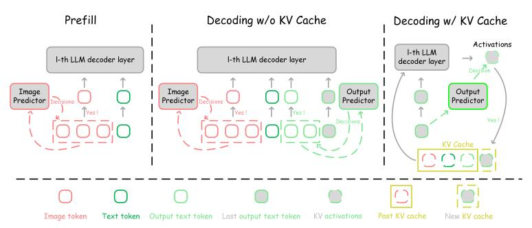

# 3.1 Preliminaries and Notations

Multimodal large language model (MLLM), e.g., LLaVA (Liu et al., 2024b), continues the autoregressive model paradigm (Radford et al., 2019; Liu et al., 2024a) and typically includes prefill and decoding stages during inference. In the prefill stage, features from different modalities are mapped into the same feature distribution as the input embeddings of large language model (LLM). These multimodal features, in conjunction with text tokens, are simultaneously processed by LLM to generate the initial output text token. During the decoding stage, the tokens in the prefill stage, together with all subsequently generated output text tokens, are used in an autoregressive manner to predict the next output text token. In the context of LLM with L Transformer decoder layers, we denote distinct index sets for various types of tokens processed across the stages of the model. Specifically, the index set for image tokens during prefill is denoted as  $\mathcal{I}^I = \{1,2,\cdots,N_l^I\}$ , for text tokens during prefill as  $\mathcal{I}^T = \{1,2,\cdots,N_l^T\}$ , while for output text tokens during decoding as  $\mathcal{I}^{OT} = \{1,2,\cdots,N_l^{OT}\}$ , where  $N_l^I$ ,  $N_l^T$  and  $N_l^{OT}$  are the counts of image tokens, text tokens and output text tokens of l-th decoder, respectively. The sets of image tokens, text tokens, and output text tokens processed by the l-th LLM decoder layer are denoted as  $\mathcal{S}_l^I = \{t_{l,i}^I | \forall i \in \mathcal{I}^I\}$ ,  $\mathcal{S}_l^T = \{t_{l,i}^T | \forall i \in \mathcal{I}^T\}$  and  $\mathcal{S}_l^{OT} = \{t_{l,i}^{OT} | \forall i \in \mathcal{I}^T\}$ , respectively, where  $t_{l,i}^I$ ,  $t_{l,i}^{T}$ ,  $t_{l,i}^{T}$  denotes the i-th token of the

different token sets for the l-th decoder. The sets of all tokens and the corresponding size are defined as  $S_l = S_l^I \cup S_l^T \cup S_l^{OT}$  and  $N_l = N_l^I + N_l^T + N_l^{OT}$ , respectively.

Considering the computation of the standard LLM (Touvron et al., 2023a), the prefill stage of the l-th decoder is simply described as follows:

$$S_{l+1}^P = FFN(MHA(S_l^P, S_l^P, S_l^P)), \tag{1}$$

where  $\mathcal{S}_l^P = \mathcal{S}_l^I \cup \mathcal{S}_l^T$ . MHA $(\cdot, \cdot, \cdot)$  and FFN $(\cdot)$  denote the Multi-Head Attention Block and the Feed-Forward Networks in l-th LLM decoder layer (Vaswani, 2017).

During the decoding stage, there are typically two methods available, *i.e.*, decoding without and with KV cache. First, we consider decoding without KV cache as an extension of the prefill stage. The one-pass decoding is computed as follows:

$$S_{l+1}^P \cup S_{l+1}^{OT} = \text{FFN}(\text{MHA}(S_l^P \cup S_l^{OT}, S_l^P \cup S_l^{OT}, S_l^P \cup S_l^{OT})). \tag{2}$$

For the decoding with KV cache, we further split the MHA operation as follows:

$$Q, K, V = \{W_l^Q \mathcal{S}_{l,N_l^{OT}}^{OT}\}, \{W_l^K \mathcal{S}_{l,N_l^{OT}}^{OT}\}, \{W_l^V \mathcal{S}_{l,N_l^{OT}}^{OT}\},$$

$$\mathcal{S}_l^K = \mathcal{S}_l^K \cup K, \mathcal{S}_l^V = \mathcal{S}_l^V \cup V,$$

$$O = W_O \operatorname{Attention}(Q, \mathcal{S}_l^K, \mathcal{S}_l^V),$$

$$\mathcal{S}_{l+1,N_{l+1}^{OT}}^{OT} = \operatorname{FFN}(O),$$

$$(3)$$

where  $W_l^Q$ ,  $W_l^K$ ,  $W_l^V$  and  $W_l^O$  are the linear layers to obtain the activation sets Q, K, V and O in l-th LLM decoder layer. Attention $(\cdot\,,\,\cdot\,,\,\cdot)$  is the Scaled Dot-Product Attention operation (Vaswani, 2017). And  $\mathcal{S}_{l,N_l^{OT}}^{OT}$  is the last output text token  $(N_l^{OT}$ -th output text token) in the l-th decoder layer during decoding, while  $\mathcal{S}_l^K$  and  $\mathcal{S}_l^V$  are KV cache of the l-th decoder layer.

The primary computation cost of the prefill and decoding without KV cache operations involve processing various sets of tokens and most overhead is in the activation of linear layers. Specifically, the cost of l-th deocder layer during the prefill stage is dictated by the combined size of the image and text token sets, denoted as Computation(Prefill) $_l \propto |\mathcal{S}_l^I \cup \mathcal{S}_l^T|$ , where  $|\cdot|$  denotes the number of tokens. For the decoding stage without KV cache, the computation overhead is determined by the sum of the aforementioned components plus the size of the generated output text tokens, represented as Computation(Decoding\_{\text{W/o cache}})\_l \propto |\mathcal{S}\_l^I \cup \mathcal{S}\_l^{CT} \cup \mathcal{S}\_l^{CT}|. Unlike the previous two methods, decoding with KV cache operation requires only the last output text token to be activated. This decoding method yields lower computation overhead compared to decoding without KV cache. However, it needs additional GPU memory to store the the activated intermediate variables, thereby introducing a higher GPU memory cost (Luohe et al., 2024). The GPU memory overhead of l-th KV cache is also determined by the quantity of the token sets, defined as Memory(Decoding\_{\text{W/cache}})\_l  $\propto |\mathcal{S}_l^I \cup \mathcal{S}_l^{CT} \cup \mathcal{S}_l^{CT}|$ . Given a l-th LLM decoder layer, reducing the sizes  $|\mathcal{S}_l^I|$ ,  $|\mathcal{S}_l^T|$  and  $|\mathcal{S}_l^{CT}|$  results in a corresponding reduction in the number of tokens for layers beyond the l-th decoder layer (Huang et al., 2024b). This reduction decreases the computation consumption and GPU memory overhead during the prefill and decoding stage of LLM.

#### 3.2 MOTIVATION

As mentioned above, the token number affects the computation consumption and GPU memory overhead, while the previous works (Chen et al., 2024a; Shang et al., 2024; Li et al., 2024a; Ye et al., 2024; Arif et al., 2024; Song et al., 2024) focus on reducing the image token set  $\mathcal{S}_l^I$ . However, the reduction in the number of image tokens often primarily accelerates the prefill stage and gradually diminishes in benefit during the decoding stage.

Computation(Prefill)l 
$$\propto |\mathcal{S}_{l}^{I} \cup \mathcal{S}_{l}^{T}|$$
,  
Computation(Decodingw/o cache)l  $\propto |\mathcal{S}_{l}^{I} \cup \mathcal{S}_{l}^{T} \cup \mathcal{S}_{l}^{OT}| \approx |\mathcal{S}_{l}^{OT}|$ ,  
Memory(Decodingw/cache)l  $\propto |\mathcal{S}_{l}^{I} \cup \mathcal{S}_{l}^{T} \cup \mathcal{S}_{l}^{OT}| \approx |\mathcal{S}_{l}^{OT}|$ ,  
where,  $|\mathcal{S}_{l}^{OT}| \to \infty$ . (4)

As shown in Eq. 4 and Fig. 1, with the generation of output text tokens during the decoding stage, the computation consumption and GPU memory overhead increase progressively. Meanwhile, the prefill

Figure 2: The sparsification inference modes for MLLMs. In the prefill stage, only image tokens are dropped based on the decisions of the learnable image predictor. For decoding without KV cache, we reduce both the image tokens and output text tokens to maintain consistent inference efficiency. When decoding with KV cache, the output predictor determines whether the activations generated by the current output text token should be added to KV cache and thereby discard part of the activations to reduce the size of KV cache. Note that the decision regarding the activations of the current output text token will be shared across all subsequent layers beyond the *l*-th layer. Meanwhile, the "Yes" branch means the decision to keep the token or its activations to participate in subsequent calculations.

stage typically computes only once during the generation process of LLM. Therefore, the benefits gained from reducing the number of image tokens diminish over the course of the entire generation process, as their impact becomes less significant during the later stages of decoding. Inspired by this, we propose the  $\textbf{\textit{Dynamic-LLaVA}}$  framework to sparsify both vision context  $\mathcal{S}_l^I$  and language context  $\mathcal{S}_l^{OT}$  involved in LLM generation to achieve the consistently **Efficient MLLM**.

#### 3.3 DYNAMIC VISON-LANGUAGE CONTEXT SPARSIFICATION

#### 3.3.1 OVERVIEW

To compress the image token set and output token set, we use two binary masks  $\mathcal{M}^I$  and  $\mathcal{M}^{OT}$  to determine whether their tokens should be retained or discarded in l-th decoder layer, where  $\mathcal{M}^I = \{m_i | m_i \in \{0,1\} \land \forall i \in \mathcal{I}^I\}$  and  $\mathcal{M}^{OT} = \{m_i | m_i \in \{0,1\} \land \forall i \in \mathcal{I}^{OT}\}$ . The reduced image token set and output text token set are defined as  $\mathcal{S}_l^{I*} = \{\mathcal{S}_{l,i} | \mathcal{M}_i^I = 1 \land \forall i \in \mathcal{I}^I\}$  and  $\mathcal{S}_l^{OT*} = \{\mathcal{S}_{l,i} | \mathcal{M}_i^{OT} = 1 \land \forall i \in \mathcal{I}^{OT}\}$ , respectively, where  $|\mathcal{S}_l^{I*}| \leq |\mathcal{S}_l^I|$  and  $|\mathcal{S}_l^{OT*}| \leq |\mathcal{S}_l^{OT}|$ . In this way, the computation consumption and GPU memory overhead in both the prefill and decoding stages, as described in Eq. 4, are simultaneously reduced. Such optimization contributes to efficient resource utilization during the entire generation process of LLM. In particular, Dynamic-LLaVA uses two learnable predictors  $P^I$  and  $P^{OT}$  to generate the binary masks  $|\mathcal{M}^I|$  and  $|\mathcal{M}^{OT}|$ , respectively. The learnable predictors are applied only once, after the l-th decoder layer of the MLLM. Specifically, once the predictor makes the decisions on tokens, this decisions are shared across all subsequent layers. This one-time token reduction strategy circumvents the need for complex adjustments to sparsity ratios of MLLM decoders. In practice, we follow the work (Chen et al., 2024a) and set l to 2. The ablation study for l is presented in Tab. 6. Note that the learnable predictors consist of lightweight, multi-layer neural networks that introduce only marginal additional computation costs (less than l% of the total). The detailed real GPU latency and memory of the Dynamic-LLaVA framework are shown in Tab. 4 and Tab. 14. Detailed architectures are shown in Appendix A.4.1.

In the following sections, we introduce how to perform the sparsification inference in the prefill and decoding stages of MLLMs in Sec. 3.3.2. We also introduce the end-to-end training for the learnable predictors in Sec. 3.3.3.

#### 3.3.2 Sparsification Inference

As shown in Fig. 2, we apply different sparsification strategies tailored to specific generation stages of MLLMs. For the token sets  $\mathcal{S}_l^I$  and  $\mathcal{S}_l^T$  processed by l-th decoder layer in the prefill stage, we consider the reduction of the image tokens. The image predictor leverages the features of image tokens and predicts the binary mask to select the tokens that participate in the prefill computation.

Specifically, we consider the set  $S_l^I \in \mathbb{R}^{N_l^I \times d}$  as 2D matrices and the pipeline is defined as:

$$\mathcal{D}^{I} = P^{I}(\mathcal{S}_{l}^{I}) \in \mathbb{R}^{N_{l}^{I} \times 2},$$

$$\mathcal{M}^{I} = \operatorname{argmax}_{j}(\mathcal{D}^{I}),$$

$$\mathcal{S}_{l}^{I*} = \{\mathcal{S}_{l,i}^{I} | \mathcal{M}_{i}^{I} = 1 \land \forall i \in \mathcal{I}^{I}\},$$
(5)

where  $P^I(\cdot)$  is the forward propagation of the image predictor,  $\mathcal{D}^I$  is a feature sampling decision generated by  $P^I$ , and  $\operatorname{argmax}_j$  indicates that we sample values of  $\mathcal{D}^I$  along the second dimension. This indicates that a token should be kept if the second value is greater than the first value in the second dimension of  $\mathcal{D}^I$ . Then we replace the reduced token set  $\mathcal{S}_l^{P*} = \mathcal{S}_l^{I*} \cup \mathcal{S}_l^T$  with  $\mathcal{S}_l^P$  in Eq. 1 to perform the prefill stage.

For the decoding stage, we first consider decoding without KV cache. This operation is similar to the prefill stage except that the last output token generates the next output token during decoding. Thus we use the pipeline in Eq. 5 with  $S_l^{OT}$  and  $P^{OT}$ , while keeping  $\mathcal{M}_{N_l^{OT}}^{OT}=1$  to obtain  $S_l^{OT*}$ , where  $\mathcal{M}_{N_l^{OT}}^{OT}$  is the  $N_l^{OT}$ -th value of the mask  $\mathcal{M}^{OT}$ . We further replace the above  $\mathcal{S}_l^{P*}$  and  $\mathcal{S}_l^{OT*}$  with  $\mathcal{S}_l^P$  and  $\mathcal{S}_l^{OT}$  in Eq. 2 to conduct the decoding stage. Note that in both the prefill and decoding without KV cache stages, after the predictors reduce the token set  $\mathcal{S}_l$  to  $\mathcal{S}_l^*$ , all subsequent layers use this reduced token set for computation, *i.e.*, the length of computed token sets is smaller to introduce the computation efficiency.

For decoding with KV cache, our primary goal is to reduce the sizes of KV cache, specifically  $\mathcal{S}_l^K$  and  $\mathcal{S}_l^V$ , to achieve GPU memory savings during the decoding process. We use the last output token  $\mathcal{S}_{l,N_l^{OT}}^{OT}$  and  $P^{OT}$  to get a binary decision  $\mathcal{M}_{N_l^{OT}}^{OT} \in \{0,1\}$  by Eq. 5 and the decoding operation in Eq. 3 is modified to the following operation:

$$\begin{split} Q\,,\,K\,,\,V &= \{W_l^Q \mathcal{S}_{l,N_l^O}^{OT}\}\,,\,\{W_l^K \mathcal{S}_{l,N_l^O}^{OT}\}\,,\,\{W_l^V \mathcal{S}_{l,N_l^O}^{OT}\},\\ O &= W_O\,\text{Attention}(Q\,,\,\mathcal{S}_l^K \cup K\,,\,\mathcal{S}_l^V \cup V),\\ \begin{cases} \mathcal{S}_l^K &= \mathcal{S}_l^K \cup K\,,\,\mathcal{S}_l^V = \mathcal{S}_l^V \cup V, &\text{if}\quad \mathcal{M}_{N_l^O}^{OT} = 1,\\ \mathcal{S}_l^K &= \mathcal{S}_l^K \cup \emptyset\,,\,\mathcal{S}_l^V = \mathcal{S}_l^V \cup \emptyset, &\text{otherwise}, \end{cases} \end{split} \tag{6}$$
 
$$\mathcal{S}_{l+1,N_{l+1}^O}^{OT} &= \text{FFN}(O), \end{split}$$

where the binary mask  $\mathcal{M}_{N^{OT}}^{OT}$  determines whether KV activations of the current output text token should be added to KV cache. Meanwhile, the decision to add the current token's activations to the KV cache is also propagated to subsequent layers, and the size of the KV cache for subsequent layers is reduced accordingly. Note that we still include this token in the current attention computation, regardless of whether it will be discarded in subsequent calculations. This ensures that this token contributes to the attention mechanism immediately, even if it does not persist in KV cache for future decoding steps.

#### 3.3.3 END-TO-END SPARSIFICATION TRAINING

Unlike the sparsification inference phase, where the token sets are directly reduced, we employ the full-token sets along with binary masks to optimize the predictors and LLM in an end-to-end training process, as inspired by (Veit & Belongie, 2018; Herrmann et al., 2020; Rao et al., 2021; Lin et al., 2023). This approach ensures the model dynamically adjusts and learns which tokens are essential during training while maintaining the full set of tokens for comprehensive optimization. The details of the end-to-end sparsification training are presented in Fig. 3 and Appendix A.2.

Given the binary masks of the token sets, we need to use these masks to isolate the influence of non-essential tokens on the important tokens during the LLM training computation. One native idea is to directly set the values of the unnecessary tokens to zero vectors. However, this method introduces a problem: when we sparsify output text tokens during the parallel training of LLM, discarding the value of an output text token will prevent it from autoregressively predicting the next output text token, making it impossible to compute the loss. This "hard training" result is presented in Tab. 7. To address this, we apply the masks to the Softmax(·) operation in Attention(·) during training. Specifically, we firstly obtain a binary mask of the full-token set  $\mathcal{M} = \mathcal{M}^I \cup \{1\}^{N_I^T} \cup \mathcal{M}^{OT}$ .

Then we use the full-token set mask to get the binary mask matrix  $\mathbb{G} = \{\mathcal{M}\}^{N_l} \in \mathbb{R}^{N_l \times N_l}$  and let  $\operatorname{diag}(\mathbb{G}) = 1$ . The  $\operatorname{Softmax}(\cdot)$  is changed to  $\operatorname{MaskedSoftmax}(\cdot, \cdot)$  operation during training:

$$MaskedSoftmax(\mathbb{X}_{i,j}, \mathbb{G}) = \frac{\exp(\mathbb{X}_{i,j})\mathbb{G}_{i,j}}{\sum_{k=1}^{N_l} \exp(\mathbb{X}_{i,k})\mathbb{G}_{i,k}},$$
(7)

where  $\mathbb{X} \in \mathbb{R}^{N_l \times N_l}$  is the input of  $\operatorname{Softmax}(\cdot)$  operation. Eq. 7 allows our framework to maintain parallelism in training while ensuring that the non-essential tokens do not influence the output, without breaking the autoregressive process essential for loss calculation. Note that this form of masking and predictors maintains uniformity between training and inference. Specifically, during training, the presence of the causal attention mask (Brown, 2020) ensures that each token focuses only on prior context information, while the use of MLP in the output predictor  $P^I$  ensures that decisions are based solely on its own features, consistent with the process used during decoding.

In addition to the issues mentioned above, we have the gradient flow problem in the backward propagation of training. The  $\operatorname{argmax}(\cdot)$  operation we performed to obtain  $\mathcal{M}^I$  and  $\mathcal{M}^{OT}$  is non-differentiable and impedes end-to-end training. Thus we use the Gumbel-Softmax (Jang et al., 2016) with Straight-Through Gradient Estimator (Bengio et al., 2013) to avoid the gradient flow problem. Taking the reduction of the image token set as an example and the  $\operatorname{argmax}(\cdot)$  in Eq. 5 is modified to the differentiable operation during training. The forward propagation is formulated as follows:

$$\mathcal{D}^{I\dagger} = \text{GumbelSoftmax}_{j}(\mathcal{D}^{I}, \tau),$$

$$\mathcal{M}^{I} = \operatorname{argmax}_{j}(\mathcal{D}^{I\dagger}),$$
(8)

where  $\tau$  is the temperature of the Gumbel-Softmax function. When  $\tau$  becomes smaller,  $\mathcal{D}^{I\dagger}$  smoothly approaches the discrete distribution. Following the work (Lin et al., 2023), Dynamic-LLaVA employ the exponential decay for  $\tau$  from 1 to 0.1 during training. Meanwhile, in the backward propagation, we propagate the gradient flow from  $\mathcal{M}^I$  to  $\mathcal{D}^{I\dagger}$ :

$$\frac{\partial \mathcal{L}}{\partial \mathcal{D}^{I\dagger}} = \frac{\partial \mathcal{L}}{\partial \mathcal{M}^{I}},\tag{9}$$

where  $\mathcal{L}$  is the objective loss function.

Furthermore, we incorporate a constraint regularization term to constrain binary masks according to a pre-defined keep rate for token sets. This constraint ensures that the predictors retains a certain proportion of tokens, adhering to the desired sparsification strategy. It is worth noting that we found that applying sparsification to  $\mathcal{S}_l^{OT}$  on samples with short output tokens during training lead to instability training and performance degradation. To avoid this problem, we apply  $\mathcal{S}_l^{OT}$  sparsification only to samples where output text tokens exceed a pre-defined length LEN $^{OT} \in \mathbb{N}_0$ , where  $\mathbb{N}_0$  denotes the set of non-negative integers. The constraint regularization term  $\mathcal{R}$  can be defined as:

$$\mathcal{R} = \|\operatorname{sum}(\mathcal{M}^{I})/|\mathcal{S}_{l}^{I}| - r^{I}\|_{F} + \begin{cases} \|\operatorname{sum}(\mathcal{M}^{OT})/|\mathcal{S}_{l}^{OT}| - r^{OT}\|_{F}, & \text{if } |\mathcal{S}_{l}^{OT}| \ge \operatorname{LEN}^{OT}, \\ 0, & \text{otherwise,} \end{cases}$$
(10)

where  $\operatorname{sum}(\cdot)$  is the summation operation and  $\|\cdot\|_F$  denotes the Frobenius norm.  $r^I$  and  $r^{OT}$  are the pre-defined keep rates of  $\mathcal{S}_l^I$  and  $\mathcal{S}_l^{OT}$ , respectively. We directly add this term to the original objective loss function, with a hyper-parameter  $\lambda$  used to control its weight. The trade-off analysis of vision context  $(r^I)$  and language context  $(r^{OT})$  are presented in Tab. 5, while the ablation study of the sample used for training should have a minimum output text token length (LEN $^{OT}$ ) and the weight of the regularization term  $(\lambda)$  are shown in Tab. 6.

#### 4 EXPERIMENTS

#### 4.1 EXPERIMENTAL SETTINGS

**Datasets, Benchmarks, and Metrics.** During training, we use the instruction-tuning dataset 656K Mixture Dataset, as in LLaVA-1.5 (Liu et al., 2024a). For vision understanding evaluations, we use the commonly used vision understanding benchmarks to evaluate the performance similar as LLaVA-1.5, such as VQAv2 (Goyal et al., 2017), GQA (Hudson & Manning, 2019), VizWiz (Gurari et al., 2018), SciQA (Lu et al., 2022), TextVQA (Singh et al., 2019), POPE (Li et al., 2023b), MMBench (en) (Liu

Table 1: Comparison with SoTA vision context sparsification methods on vision understanding benchmarks. The best results are **bolded** and the second best results are <u>underlined</u> in all following tables. The sign "I" and "I | T" mean only the vision sparsification and the vision-language sparsification of Dynamic-LLaVA in all following tables, respectively. "TFLOPs" is only the computation consumption of the image tokens. Dynamic-LLaVA achieves the best performance in most benchmarks using a similar number of image tokens. The "Free" column indicates whether a method is training-free.

| Method                                                                                                                                                                                                                                                  | Free             | Image Token                                                                      | (prefill) TFLOPs                                                                            | VQAv2                                                                                                 | GQA                                                                                        | SciQA                                                                                       | TextVQA                                                                                      | POPE                                                                         | MME                                                                                                   | MMBench                                                                                     | SEED                                      | MMVP                                                 | RealWorldQA                                                   | CVBench-2D                                                     |
|---------------------------------------------------------------------------------------------------------------------------------------------------------------------------------------------------------------------------------------------------------|------------------|----------------------------------------------------------------------------------|------------------------------------------------------------------------------------------------|-------------------------------------------------------------------------------------------------------|--------------------------------------------------------------------------------------------|---------------------------------------------------------------------------------------------|----------------------------------------------------------------------------------------------|------------------------------------------------------------------------------|-------------------------------------------------------------------------------------------------------|---------------------------------------------------------------------------------------------|-------------------------------------------|------------------------------------------------------|---------------------------------------------------------------|----------------------------------------------------------------|
| LLaVA-1.5-7B                                                                                                                                                                                                                                            | -                | 576                                                                              | 10.1                                                                                           | 78.5                                                                                                  | 62.0                                                                                       | 66.8                                                                                        | 58.2                                                                                         | 85.9                                                                         | 1510.7                                                                                                | 64.3                                                                                        | 66.1                                      | 29.3                                                 | 53.7                                                          | 58.5                                                           |
| (Arxiv24) LLaVA-PruMerge+ (ECCV24) LLaVA-FastV k=3,r=0.75 †(ECCV24) LLaVA-FastV k=3,r=0.75 (Arxiv24) VoCo-LLaMA (Arxiv24) LLaVA-HIRED Dynamic-LLaVA-7B I (Ours) Dynamic-LLaVA-7B I (Ours) | X X X X | 146 (-75%) 144 (-75%) 144 (-75%) 128 (-78%) 115 (-80%) 115 (-80%) | 2.5 (-75%) 3.2 (-68%) 3.2 (-68%) 2.2 (-78%) 2.0 (-80%) 2.5 (-75%) 2.5 (-75%) | 76.8 (-1.7) 75.1 (-3.4) 74.2 (-4.3) 76.9 (-1.6) 74.7 (-3.8) 78.0 (-0.5) 77.9 (-0.6) | 57.5 (-4.5) 56.6 (-5.4) 59.8 (-2.2) - <b>61.4 (-0.6)</b> <u>61.3 (-0.7)</u> | 68.3 (+1.5) 68.7 (+1.9) 64.0 (-2.8) - 66.4 (-0.4) 69.1 (+2.3) 68.6 (+1.8) | 57.1 (-1.1) 56.2 (-2.0) 54.3 (-3.9) - 44.2 (-14.0) 57.0 (-1.2) 56.5 (-1.7) | 84.0 (-1.9) 81.0 (-4.9) 82.7 (-3.2) - 85.0 (-0.9) 85.9 (+0.0) | 1462.4 (-48.3) 1458.9 (-51.8) 1292.2 (-218.5) - - - 1479.8 (-30.9) 1501.0 (-9.7) | 64.9 (+0.6) 63.5 (-0.8) 58.6 (-5.7) 61.0 (-3.3) - 65.4 (+1.1) 64.1 (-0.2) |                                           | 24.0 (-5.3) 16.7 (-12.6) - - 26.3 (-3.0) | - 53.7 (-0.0) 49.8 (-3.9) - - - 57.0 (+3.3) | 56.7 (-1.9) 44.7 (-13.8) - - - - 58.3 (-0.2) |
| ‡ LLaVA-1.5-7B+H2O r=0.5 ‡ LLaVA-1.5-7B+H2O k=10,r=0.5                                                                                                                                                   | 1                | 576 576                                                                       | 10.1 10.1                                                                                   | - 77.9 (-0.6)                                                                                      | 61.0 (-1.0)                                                                                | - 41.9 (-16.3)                                                                           | 11.6 (-46.6) 55.9 (-2.3)                                                                  | 50.5 (-30.4) 86.9 (+1.0)                                                  | 500.5 (-1010.2) 1458.4 (-52.3)                                                                     | - 1.4 (-62.9)                                                                            | - 26.8 (-39.3)                         | 0 (-29.3)                                            | - 42.3 (-11.4)                                             | 49.7 (-8.8)                                                    |
| LLaVA-1.5-13B                                                                                                                                                                                                                                           | -                | 576                                                                              | 19.6                                                                                           | 80.0                                                                                                  | 63.3                                                                                       | 71.6                                                                                        | 61.3                                                                                         | 85.9                                                                         | 1531.3                                                                                                | 67.7                                                                                        | 68.2                                      | 30.7                                                 | 55.3                                                          | 62.3                                                           |
| (Arxiv24) LLaVA-PruMerge+ (ECCV24) LLaVA-FastV k=3,r=0.75 Dynamic-LLaVA-13B I (Ours) Dynamic-LLaVA-13B I T (Ours)                                                                                             | X X X      | 146 (-75%) 144 (-75%) 115 (-80%) 115 (-80%)                             | 4.9 (-75%) 6.0 (-69%) 4.7 (-76%) 4.7 (-76%)                                           | 77.8 (-2.2) 77.0 (-3.0) <b>79.1 (-0.9)</b> 78.8 (-1.2)                                       | 60.1 (-3.2) 62.7 (-0.6) 62.5 (-0.8)                                                  | 71.0 (-0.6) 72.8 (+1.2) 72.2 (+0.6) 72.4 (+0.8)                                    | 58.6 (-2.7) 59.0 (-2.3) 59.5 (-1.8) 59.6 (-1.7)                                     | 84.4 (-1.5) 83.2 (-2.7) 86.8 (+0.9) 86.5 (+0.6)                     | 1485.5 (-45.8) 1470.3 (-61.0) 1554.1 (+22.8) 1563.3 (+32.0)                                  | 65.7 (-2.0) 66.9 (-0.8) 68.3 (+0.6) 66.9 (-0.8)                                    | 65.4 (-2.8) 66.6 (-1.6) 66.5 (-1.7) | 28.0 (-2.7) - 31.3 (+0.6)                      | 52.8 (-2.5) - 53.3 (-2.0)                               | 58.9 (-3.4) - 60.7 (-1.6)                                |
| ‡LLaVA-1.5-13b+H2O k=10,r=0.5                                                                                                                                                                                                                | /                | 576                                                                              | 19.6                                                                                           | 78.9 (-1.1)                                                                                           | 62.3 (-1.0)                                                                                | 48.5 (-23.1)                                                                                | 57.5 (-3.8)                                                                                  | 87.3 (+1.4)                                                                  | 1448.3 (-83.0)                                                                                        | 4.7 (-59.6)                                                                                 | 32.3 (35.9)                               | 0 (-30.7)                                            | 43.9 (-11.4)                                                  | 50.8 (-11.5)                                                   |

1 It means that we apply one additional epoch sparsification training for FastV. For a fair comparison, the settings are the same as for Dynamic-LLaVA. The details are presented in Appendix A.4.2.

1 It means that we directly apply the LLIM KV cache compression method H2O to MLLMs. Note that H2O cannot provide the significant computation efficiency in the prefill stage of MLLMs. The details are presented in Appendix A.4.2.

Table 2: Comparison with SoTA efficient vision projector methods on vision understanding benchmarks. Dynamic-LLaVA uses the original vision projector and achieves competitive performance.

| Method                                                    | Projector     |      | Image (p | orefill)   | MMBench | MM-Vet | VQAv2       | GOA  | POPE | VizWiz | Avg. |
|-----------------------------------------------------------|---------------|------|----------|------------|---------|--------|-------------|------|------|--------|------|
|                                                           | <u> </u>      | Res. | Token    | TFLOPs     |         |        |             |      |      |        |      |
| LLaVA-1.5-7B                                              | MLP           | 336  | 576      | 10.1       | 64.3    | 31.1   | 78.5        | 62.0 | 85.9 | 50.0   | 62.0 |
| (Arxiv23) LLaVA-Resampler-7B                              | Resampler     | 336  | 144      | 2.5        | 63.1    | 29.2   | 75.1        | 58.4 | 84.7 | 51.9   | 60.4 |
| (CVPR24) LLaVA-C-Abstractor-7B                            | C-Abstractor  | 336  | 144      | 2.5        | 63.1    | 29.4   | 74.6        | 59.2 | 84.6 | 49.2   | 60.0 |
| (Arxiv24) LLaVA-Pixel-Shuffle-7B                          | Pixel-Shuffle | 336  | 144      | 2.5        | 64.0    | 29.7   | 76.2        | 60.1 | 85.9 | 48.8   | 60.8 |
| (Arxiv24) LLaVA-LDP-v2-7B                                 | LDP-v2        | 336  | 144      | 2.5        | 66.2    | 28.7   | 77.3        | 61.1 | 86.1 | 47.6   | 61.2 |
| Dynamic-LLaVA-7B 1 (Ours)                      | MLP           | 336  | 115      | 2.5        | 65.4    | 29.5   | 78.0        | 61.4 | 86.2 | 50.2   | 61.8 |
| Dynamic-LLaVA-7B I T (Ours)                    | MLP           | 336  | 115      | 2.5        | 64.1    | 32.2   | 77.9        | 61.3 | 85.9 | 51.2   | 62.1 |
| LLaVA-TokenPacker-7B-144Token                             | TokenPacker   | 336  | 144      | 2.5        | 65.1    | 31.7   | 77.9        | 61.8 | 87.0 | 52.0   | 62.6 |
| (Arxiv24) LLaVA-TokenPacker-7B-64Token                    | TokenPacker   | 336  | 64       | 1.1 (-56%) | 64.1    | _      | 77.2        | 61.1 | 86.3 | 50.7   |      |
| (ECCV24) LLaVA-TokenPacker-FastV-7B k=3,r=0.5  | TokenPacker   | 336  | 72       | 1.4 (-44%) | 65.0    | 32.0   | 76.6        | 60.8 | 85.2 | 51.4   | 61.8 |
| Dynamic-LLaVA-TokenPacker-7B 1 (Ours)          | TokenPacker   | 336  | 57       | 1.1 (-56%) | 65.1    | 32.1   | 77.8        | 61.9 | 85.9 | 51.2   | 62.3 |
| Dynamic-LLaVA-TokenPacker-7B I T (Ours)        | TokenPacker   | 336  | 57       | 1.1 (-56%) | 63.5    | 31.9   | <u>77.6</u> | 61.7 | 86.0 | 51.2   | 62.0 |
| LLaVA-TokenPacker-13B-144Token                            | TokenPacker   | 336  | 144      | 4.9        | 68.0    | 34.6   | 78.9        | 62.5 | 87.4 | 55.6   | 64.5 |
| (Arxiv24) LLaVA-TokenPacker-13B-64Token                   | TokenPacker   | 336  | 64       | 2.2 (-55%) | 66.2    | _      | 78.1        | 62.0 | 87.3 | 52.9   | _    |
| (ECCV24) LLaVA-TokenPacker-FastV-13B k=3,r=0.5 | TokenPacker   | 336  | 72       | 2.6 (-47%) | 66.8    | 34.5   | 77.5        | 61.5 | 86.3 | 54.9   | 63.6 |
| Dynamic-LLaVA-TokenPacker-13B 1 (Ours)         | TokenPacker   | 336  | 57       | 2.1 (-57%) | 67.4    | 34.8   | 78.3        | 62.5 | 86.7 | 56.4   | 64.4 |
| Dynamic-LLaVA-TokenPacker-13B I T (Ours)       | TokenPacker   | 336  | 57       | 2.1 (-57%) | 66.8    | 37.1   | 78.3        | 62.1 | 86.3 | 54.8   | 64.2 |

et al., 2023b), SEED (image) (Li et al., 2023a) and MM-Vet (Yu et al., 2023). Furthermore, we also use the vision-centric vision understanding benchmarks, such as MMVP (Tong et al., 2024b), RealWorldQA (xAI, 2024) and CVBench-2D (Tong et al., 2024a). We employ the same evaluation metrics of the above benchmarks to assess the results.

Specially, to evaluate the generation ability of MLLM before and after the generated language context sparsification. We constructed LVIS-VQA single- and multi-round Benchmarks based on the subset of LVIS-Instruct4V (Wang et al., 2023). Meanwhile, we constructed a single-round long generation text benchmark ShareGPT4V-VQA by ShareGPT4V dataset (Chen et al., 2023b). Details of these datasets are presented in Appendix A.4.3 and A.4.4. To ensure a fair comparison, none of the images selected for our benchmarks were included in the training set of the base MLLMs and Dynamic-LLaVA. We evaluate the fluency of the generated responses of MLLMs using the Perplexity Metric (PPL) (Jelinek et al., 1977), and the similarity of the generated answers to the standard answers using the Metric for Evaluation of Translation with Explicit ORdering (METEOR) (Banerjee & Lavie, 2005).

**Implementations.** All of the methods are trained on 8 NVIDIA A100 (80G) using Pytorch (Paszke et al., 2019). For fair comparisons, we utilize the open-source MLLMs weights available in the official GitHub repositories and continue one-epoch instruction-tuning for MLLMs and learnable predictors. The hyper-parameters of which decoder layer to sparsify the tokens (l), the sample used for training should have a minimum output text token length (LEN $^{OT}$ ) and the weight of the regularization term ( $\lambda$ ) are set to 2, 50 and 100 in all experiments, respectively. The details are presented in Appendix A.4.2.

#### 4.2 Main Results

**Vision understanding.** As demonstrated in Tab. 1, our proposed Dynamic-LLaVA framework achieves superior performance compared to SoTA vision context sparsification methods in most benchmarks while reducing image tokens by approximately 80%. Additionally, the Dynamic-LLaVA framework reduces FLOPs by more than 70% for official LLaVA-1.5 base-

Table 3: Comparison of generation ability benchmarks. "Total→Computing" means the total generated token number and the maximum number of tokens involved in decoding. "a/b" means the results in experiments of PPL/METEOR. "TFLOPs" and "Mem." in "Text (decoding)" are measured under decoding w/o and w/ KV cache, respectively, while "Mem." means maximum GPU memory of KV cache. Dynamic-LLaVA achieves significant inference efficiency during the decoding stage with negligible generation ability drop when sparsifying both vision and language.

|                            |                                                                    | Image (prefill) | I                 | Text (decoding)          |                       | l ppr  | METERO |
|----------------------------|--------------------------------------------------------------------|-----------------|-------------------|--------------------------|-----------------------|--------|--------|
| Benchmark                  | Method                                                             | TFLOPs          | Total→Computing   | TFLOPs                   | Mem. (M)              | PPL↓   | METEO  |
|                            | LLaVA-1.5-7B                                                       | 10.1            | I 159/173→159/173 | 2.75/2.99                | 103/91                | 4.59   | 0.3103 |
|                            | LLaVA-FastV-7B k=3,r=0,75                               | 3.2 (-68%)      | 159/172→159/172   | 2.75/2.99                | 103/89                | 4.67   | 0.3074 |
|                            | Dynamic-LLaVA-7B r (Ours)                               | 2.5 (-75%)      | 159/174→159/174   | 2.75/3.02                | 102/89                | 4.70   | 0.3099 |
|                            | Random                                                             | 10.1            | 159/570→79/285    | 2.67/4.98                | 62 (-40%)/157         | 111.52 | 0.2080 |
|                            | Structure                                                          | 10.1            | 159/603→79/302    | 2.68/5.72                | 63 (-39%)/166         | 9.69   | 0.186  |
|                            | H2O r=0.5                                               | 10.1            | 159/589→79/295    |                          | 62 (-40%)/158         | 78.95  | 0.038  |
| 11770 1701                 | $^{\dagger}$ FastV-7B k=3,r=0,75 +H2O r=0,5  | 3.2 (-68%)      | 159/168→79/84     | _                        | 61 (-41%)/58 (-36%)   | 5.62   | 0.307  |
| LVIS-VQA (single-round) | Dynamic-LLaVA-7B I T (Ours)                             | 2.5 (-75%)      | 159/181→84/90     | 1.52 (-45%)/1.57 (-47%)  | 63 (-39%)/46 (-49%)   | 4.90   | 0.310  |
|                            | LLaVA-1.5-13B                                                      | 19.6            | 159/174→159/174   | 5.36/5.88                | 149/143               | 4.39   | 0.314  |
| i                          | LLaVA-FastV-13B k=3 r=0.75                              | 6.0 (-69%)      | 159/176→159/176   | 5.36/5.88                | 152/143               | 4.46   | 0.311  |
|                            | Dynamic-LLaVA-13B 1 (Ours)                              | 4.7 (-76%)      | 159/178→159/178   | 5.36/6.01                | 148/144               | 4.55   | 0.314  |
| 1                          | Random                                                             | 19.6            | 159/262→79/131    | 2.67 (-50%)/4.43         | 88 (-41%)/113         | 10.47  | 0.277  |
|                            | Structure                                                          | 19.6            | 159/330→79/165    | 2.68 (-50%)/5.60         | 88 (-41%)/145         | 8.39   | 0.239  |
|                            | $H2O_{r=0.5}$                                                      | 19.6            | 159/152→79/76     | -                        | 86 (-43%)/62 (-57%)   | 41.44  | 0.042  |
|                            | $^{\dagger}$ FastV-13B k=3,r=0.75 +H2O r=0.5 | 6.0 (-68%)      | 159/168→79/84     | -                        | 84 (-44%)/89 (-38%)   | 5.30   | 0.315  |
|                            | Dynamic-LLaVA-13B I T (Ours)                            | 4.7 (-76%)      | 159/179→84/88     | 2.95 (-44%)/3.06 (-48%)  | 90 (-40%)/72 (-50%)   | 4.76   | 0.315  |
| I                          | LLaVA-1.5-7B                                                       | 10.1            | 351/461→351/461   | 6.12/8.08                | 222/236               | 2.97   | 0.42   |
|                            | LLaVA-FastV-7B $_{k=3,r=0.75}$                                     | 3.2 (-68%)      | 351/463→351/463   | 6.12/8.12                | 227/242               | 3.06   | 0.415  |
|                            | Dynamic-LLaVA-7B 1 (Ours)                               | 2.5 (-75%)      | 351/491→351/491   | 6.12/8.61                | 223/251               | 3.08   | 0.422  |
|                            | Random                                                             | 10.1            | 351/1160→176/580  | 3.04 (-50%)/10.35        | 141 (-38%)/328        | 5.96   | 0.329  |
|                            | Structure                                                          | 10.1            | 351/951→176/475   | 3.04 (-50%)/8.47         | 141 (-38%)/270        | 5.40   | 0.282  |
|                            | $H2O_{r=0.5}$                                                      | 10.1            | 351/503→99/175    | -                        | 133 (-41%)/149 (-38%) | 42.6   | 0.089  |
| LVIS-VOA                   | $^{\dagger}$ FastV-7B k=3,r=0.75 +H2O r=0.5  | 3.2 (-68%)      | 351/482→175/240   | 3.04 (-50%)/4.19 (-48%)  | 140 (-38%)/128 (-47%) | 3.57   | 0.40   |
| multi-round)               | Dynamic-LLaVA-7B I T (Ours)                             | 2.5 (-75%)      | 351/522→182/260   | 3.33 (-45%)/4.38 (-46%)  | 144 (-35%)/140 (-41%) | 3.17   | 0.42   |
| ļ                          | LLaVA-1.5-13B                                                      | 19.6            | 351/497→351/497   | 11.92/16.97              | 331/405               | 2.88   | 0.42   |
|                            | LLaVA-FastV-13B $_{k=3,r=0.75}$                                    | 6.0 (-69%)      | 351/501→351/501   | 11.92/17.11              | 326/399               | 2.96   | 0.41   |
|                            | Dynamic-LLaVA-13B 1 (Ours)                              | 4.7 (-76%)      | 351/507→351/507   | 11.92/17.30              | 328/405               | 2.98   | 0.42   |
|                            | Random                                                             | 19.6            | 351/600→175/300   | 5.92 (-50%)/10.23        | 195 (-41%)/265 (-35%) | 5.40   | 0.39   |
|                            | Structure                                                          | 19.6            | 351/671→176/335   | 5.93 (-50%)/11.48        | 194 (-41%)/303 (-25%) | 4.67   | 0.36   |
|                            | H2O r=0.5                                               | 19.6            | 351/144→99/72     | -                        | 183 (-45%)/283 (-30%) | 18.62  | 0.049  |
|                            | $^{\dagger}$ FastV-13B k=3,r=0.75 +H2O r=0.5 | 6.0 (-69%)      | 351/493→175/247   | -                        | 186 (-44%)/197 (-51%) | 3.45   | 0.41   |
|                            | Dynamic-LLaVA-13B I T (Ours)                            | 4.7 (-76%)      | 351/494→181/242   | 6.40 (-46%)/8.27 (-51%)  | 196 (-41%)/202 (-50%) | 3.07   | 0.42   |
|                            | LLaVA-1.5-7B                                                       | 10.1            | 1555/100→1555/100 | 28.70/1.75               | 1024/50               | 2.52   | ‡0.05  |
|                            | Random                                                             | 10.1            | 1555/450→779/224  | 13.97 (-51%)/3.95        | 664 (-35%)/120        | 6.07   | ‡0.05  |
|                            | Structure                                                          | 10.1            | 1555/531→777/266  | 13.93 (-51%)/4.68        | 644 (-37%)/144        | 30.7   | ‡0.04  |
|                            | H2O r=0.5                                               | 10.1            | 1555/392->777/196 | - '                      | 607 (-41%)/107        | 25.54  | ‡0.01  |
| reGPT4V-VOA                | $^{\dagger}$ FastV-7B k=3,r=0.75 +H2O r=0.5  | 3.2 (-68%)      | 1555/112→777/56   | _                        | 604 (-41%)/27 (-46%)  | 3.56   | ‡0.05  |
| single-round)              | Dynamic-LLaVA-7B I T (Ours)                             | 2.5 (-75%)      | 1555/102→784/51   | 14.97 (-47%)/0.95 (-46%) | 625 (-39%)/28 (-44%)  | 3.14   | ‡0.05  |
| i                          | LLaVA-1.5-13B                                                      | 19.6            | 1555/103→1555/103 | 55.40/3.49               | 1489/83               | 2.43   | ‡0.05  |
| i                          | Random                                                             | 19.6            | 1555/192→777/97   | 27.01 (-51%)/3.30        | 875 (-41%)/265        | 5.32   | ‡0.05  |
|                            | Structure                                                          | 19.6            | 1555/285→777/142  | 27.04 (-51%)/4.88        | 876 (-41%)/126        | 21.10  | ‡0.04  |
|                            | H2O r=0.5                                               | 19.6            | 1555/72→777/36    |                          | 840 (-43%)/29         | 10.51  | ‡0.01  |
|                            | †FastV-13B k=3,r=0.75 +H2O r=0.5             | 6.0 (-79%)      | 1555/115→777/57   | _                        | 835 (-44%)/45 (-46%)  | 3.41   | ‡0.05  |
| ,                          | Dynamic-LLaVA-13B IIT (Ours)                            | 4.76 (-76%)     | 1555/100→763/50   | 27.96 (-49%)/1.78 (-49%) | 854 (-43%)/44 (-46%)  | 3.10   | ‡0.05  |

Table 4: Total time and maximum GPU memory overhead during MLLMs' generation. "2K/4K" means the number of the generated output text tokens. "×" means the generation process has failed due to the OOM. The results are measured in one A100 (80G) and the batch size is fixed to 8.

|                                  | Prefill | Decodi | Decoding w/o KV cache   Decoding w/ KV cache |        |      |      |      |  |  |  |  |
|----------------------------------|---------|--------|----------------------------------------------|--------|------|------|------|--|--|--|--|
| Method                           |         | 1K     | 2K                                           | 4K     | 1K   | 2K   | 4K   |  |  |  |  |
|                                  | Time    | Time   | Time                                         | Time   | Mem. | Mem. | Mem. |  |  |  |  |
| LLaVA-1.5-13B                    | 0.83s   | 1453s  | 4117s                                        | 13368s | 46G  | 58G  | ×    |  |  |  |  |
| LLaVA-FastV-13B $_{k=3,r=0.75}$  | 0.43s   | 1079s  | 3462s                                        | ×      | 41G  | 53G  | 77G  |  |  |  |  |
| Dynamic-LLaVA-13B I T | 0.37s   | 838s   | 2382s                                        | 6184s  | 35G  | 42G  | 56G  |  |  |  |  |

† We apply the Parallel Sparsification Inference for FastV to achieve the batch-parallel inference.

lines in the prefill stage, with only minimal performance degradation across most benchmarks. Especially, for the LLaVA-1.5 with 7B and 13B parameters, the Dynamic-LLaVA even shows performance improvements on the SciQA, POPE, MME, and MMBench benchmarks. For instance, on the SciQA benchmark, the 7B and 13B Dynamic-LLaVA models achieve performance gains of +2.3% and +0.8%, respectively, compared to the original LLaVA-1.5. More comparison of SoTA vision context sparsification methods are presented in Appendix A.5.1.

Table 5: Trade-off of the keep rates of vision context  $(r^I)$  and language context  $(r^{OT})$ .

|          | ı    | ] 1    | oken     | 1     | 1     | Benchmark |      |          |
|----------|------|--------|----------|-------|-------|-----------|------|----------|
| Context  | Rate | Vision | Language | VOAv2 | GOA   | MMVP      | LVIS | (single) |
|          |      | 1      | Language | 1     | - CQA |           | PPL↓ | MET.↑    |
|          | 20%  | 115    | 84/90    | 77.9  | 61.3  | 26.3      | 4.90 | 0.3108   |
| Vision   | 50%  | 288    | 83/86    | 78.8  | 62.3  | 26.3      | 4.88 | 0.3107   |
|          | 80%  | 461    | 83/85    | 78.9  | 62.5  | 26.2      | 4.88 | 0.3090   |
|          | 20%  | 115    | 41/39    | 77.6  | 61.4  | 26.0      | 5.53 | 0.2592   |
| Language | 50%  | 115    | 84/90    | 77.9  | 61.3  | 26.3      | 4.90 | 0.3108   |
|          | 80%  | 115    | 129/138  | 78.0  | 61.6  | 26.0      | 4.76 | 0.3116   |
| LLaVA-7B | 100% | 576    | 159/173  | 78.5  | 62.0  | 29.3      | 4.59 | 0.3103   |

As shown in Tab. 2, for efficient vision projector methods for MLLMs, Dynamic-LLaVA exclusively utilizes the original MLP of LLaVA-1.5 as the vision projector. This approach surpasses those that modify the vision projector across most benchmarks, achieving an average performance that exceeds the best alternative methods by 0.9%. Furthermore, our Dynamic-LLaVA framework can be integrated with other efficient vision projector methods. For instance, our combination with the TokenPacker projector, Dynamic-LLaVA-

TokenPacker, achieves significant reductions in vision tokens by an additional 60% on top of the already reduced count by efficient vision projector methods, with only a minimal loss in performance. Compared to the official LLaVA-TokenPacker method, our Dynamic-LLaVA-TokenPacker incurs only a minimal performance loss of 0.3% and 0.1% (for 7B and 13B models) while using fewer vision tokens (57 vs. 144). Moreover, we observe that the sparsification of the output text tokens does not impede the comprehension ability of MLLMs. This finding is supported by comparisons between Dynamic-LLaVAI and Dynamic-LLaVAI as detailed in last two rows of Tab. 1 and Tab. 2.

**Generation ability.** To evaluate the impact of vision-language context sparsification on generation ability, we utilize the LVIS-VQA (single-round) and LVIS-VQA (multi-round) as benchmarks.

To demonstrate the advantages of Dynamic-LLaVA in dynamically sparsifying the language context, we compare it against traditional static methods, "Random" and "Structure". "Random" refers to randomly discarding  $\sim\!50\%$  output text tokens, while "Structure" involves discarding every alternate output text token.

Table 6: Hyper-parameter ablation for l. LENOT and  $\lambda$ .

| Hyper      | Value | Benchmark |      |      |  |  |  |  |  |
|------------|-------|-----------|------|------|--|--|--|--|--|
| 71         |       | VQAv2     | GQA  | POPE |  |  |  |  |  |
|            | 1     | 77.6      | 61.3 | 85.7 |  |  |  |  |  |
| l          | 2     | 77.9      | 61.3 | 85.9 |  |  |  |  |  |
|            | 4     | 77.9      | 61.4 | 85.8 |  |  |  |  |  |
|            | 0     | 77.4      | 61.0 | 85.5 |  |  |  |  |  |
| $LEN^{OT}$ | 50    | 77.9      | 61.3 | 85.9 |  |  |  |  |  |
|            | 100   | 77.8      | 61.2 | 86.1 |  |  |  |  |  |
|            | 10    | 77.9      | 61.2 | 85.8 |  |  |  |  |  |
| λ          | 100   | 77.9      | 61.3 | 85.9 |  |  |  |  |  |
|            | 1000  | 77.7      | 61.3 | 85.7 |  |  |  |  |  |

As shown in Tab. 3, Dynamic-LLaVA maintains nearly unchanged generation fluency (by PPL) and quality (by METEOR) when only the vision context is sparsified. When sparsifying both vision and language contexts, Dynamic-LLaVA exhibits a slight increase in PPL (less than 0.3) and a minor improvement in METEOR score compared to full-context baselines, while also reducing ~50% FLOPs (decoding without KV cache) and GPU memory overhead (decoding with KV cache) of the output text tokens. In comparison with the traditional static methods under the same condition of discarding ~50% output text tokens, both "Random" and "Structure" methods significantly underperform in terms of fluency and quality of generation compared to Dynamic-LLaVA's language context sparsification. Furthermore, compared to methods only focusing on the image token reduction, Dynamic-LLaVA achieves additional inference efficiency during the decoding stage while maintaining nearly consistent generation ability. Meanwhile, the LLM KV cache compression method H2O, directly discarding historical KV cache does not adapt well to mixed-modality contexts, causing a significant performance degradation. We enhance the generation ability by integrating FastV with H2O. Despite these reductions, Dynamic-LLaVA still maintains a slight advantage in generation ability.

**Practical inference efficiency.** As presented in Tab. 4, we measured the practical inference time and GPU memory usage of MLLMs. The proposed Dynamic-LLaVA framework can perform parallel inference with mini-batch samples, due to the Parallel Sparsification Inference strategy in Appendix A.1. Vision token reduction methods provide noticeable inference benefits during the prefill stage and play a role in subsequent generations. However, the proportion of this efficiency gradually decreases throughout the entire generation process. Dynamic-LLaVA not only achieves significant inference speed improvements during the prefill stage but also reduces generation time by  $\sim\!50\%$  when decoding without KV cache and significantly lowers GPU memory overhead when decoding with KV cache. Moreover, we further report the practical inference lantency of the decoding stage with KV cache, which are presented in Appendix A.5.2.

#### 4.3 ABLATION STUDY

**Trade-off.** We respectively adjust the keep rates of vision context  $(r^I)$  and language context  $(r^{OT})$  during training, as mentioned in Sec. 3.3.3. As in Tab. 5, we observe that increasing the value of  $r^I$ , i.e., retaining more image tokens during inference, significantly enhances the vision understanding performance of Dynamic-LLaVA. On the other hand, adjusting the value of  $r^{OT}$  has negligible effects on vision understanding but impacts the generation ability of Dynamic-LLaVA. By tuning the values of  $r^I$  and  $r^{OT}$  during training, it is possible to achieve a balance between performance and efficiency tailored to specific requirements. More detailed results are presented in Appendix A.5.4.

**Hyper-parameters.** Tab. 6 provides an analysis of which decoder layer to sparsify the tokens (l) and the sample used for training should have a minimum output text token length (LENOT), as mentioned in Sec. 3.3. This analysis enables the Dynamic-LLaVA framework to be easily integrated into various MLLMs. For l and  $\lambda$ , Dynamic-LLaVA shows relative insensitivity in vision understanding performance. We follow the work (Chen et al., 2024a) and let l=2, while  $\lambda=100$ . For LENOT, sparsifying output text tokens of all samples significantly reduces the understanding performance of Dynamic-LLaVA. Incrementally increasing the threshold of LENOT results in diminishing returns.

#### 5 CONCLUSION

In this paper, we proposed a dynamic vision-language context sparsification framework, termed Dynamic-LLaVA. This framework is designed with tailored sparsification inference strategies for the inference modes of MLLMs and can be integrated into MLLMs' training in an end-to-end manner.

