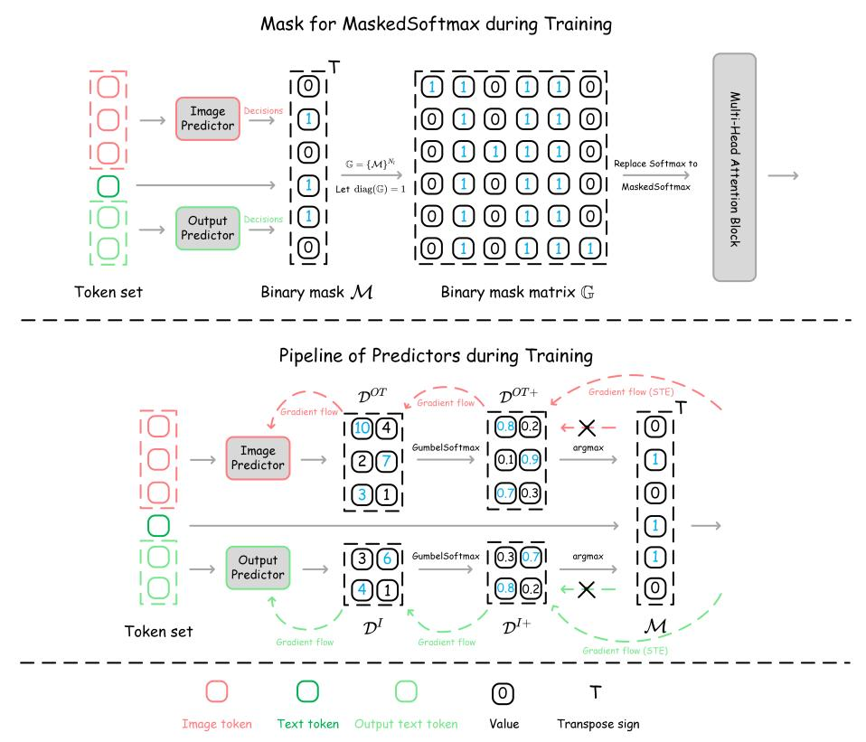
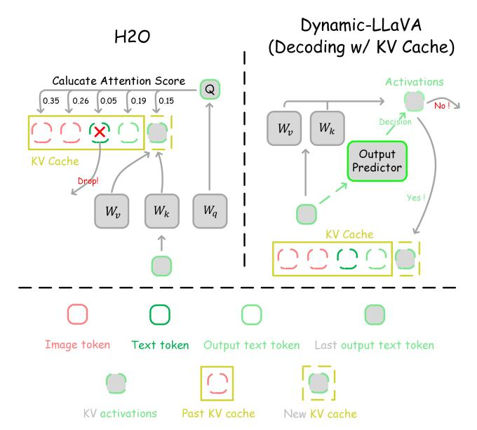

# CONTENTS OF APPENDIX

| A |     | Appendix      |                                                                       | 17 |
|---|-----|---------------|-----------------------------------------------------------------------|----|
|   | A.1 |               | Parallel Sparsification Inference Optimization                        | 17 |
|   | A.2 |               | Detailed Pipeline of End-to-end Sparsification Training               | 17 |
|   | A.3 |               | More Detailed Discussion                                              | 19 |
|   |     | A.3.1         | Inference Efficiency of Dynamic-LLaVA and Token Reduction Methods     | 19 |
|   |     | A.3.2         | Discussion for LLM KV Cache Compression Methods and Dynamic-LLaVA     | 19 |
|   |     | A.3.3         | Additional Discussion for Sparsifying Text Context during Prefill  | 21 |
|   | A.4 |               | Implementation Details                                                | 21 |
|   |     | A.4.1         | Details of Predictor Architecture                                     | 21 |
|   |     | A.4.2         | Details of Settings                                                | 22 |
|   |     | A.4.3         | Details of LVIS-VQA Benchmarks                                     | 23 |
|   |     | A.4.4         | Details of ShareGPT4V-VQA Benchmarks                               | 23 |
|   |     | A.4.5         | Details of Calculation Equation of FLOPs                              | 24 |
|   | A.5 |               | Additional Results                                                    | 24 |
|   |     | A.5.1         | Additional Benchmark Results                                          | 24 |
|   |     | A.5.2         | Additional Practical Inference Efficiency Analysis                 | 25 |
|   |     | A.5.3         | Training Time                                                         | 25 |
|   |     | A.5.4         | Additional Trade-off Analysis                                      | 25 |
|   | A.6 | Visualization |                                                                       | 27 |

#### A APPENDIX

#### A.1 PARALLEL SPARSIFICATION INFERENCE OPTIMIZATION

In this section, we introduce the parallel inference optimization for the sparsification inference described in Sec. 3.3.2. We denote the mini-batch form of  $\mathcal{S}_l^P$  and  $\mathcal{S}_l^{OT}$  in the l-th decoder layer as  $\mathbb{S}_l^P$  and  $\mathbb{S}_l^{OT}$ , respectively. We treat these as matrices, thus  $\mathbb{S}_l^P = \{\mathcal{S}_l^{P(b)} | \forall b \in \{1,2,\cdots,B\}\} \in \mathbb{R}^{B \times (N_l^I + N_l^T) \times d}$  and  $\mathbb{S}_l^{OT} = \{\mathcal{S}_l^{OT(b)} | \forall b \in \{1,2,\cdots,B\}\} \in \mathbb{R}^{B \times N_l^{OT} \times d}$ , where B represents the mini-batch size, and  $\mathcal{S}_l^{P(b)}$  and  $\mathcal{S}_l^{OT(b)}$  refer to the token set for the b-th sample within the batch.

For the prefill stage, we pad the indefinite length mini-batch image token sets and use one-pass parallel inference of the predictor for the padded mini-batch image token set  $\mathbb{S}_l^I = \{\mathrm{LPadding}(\mathcal{S}_l^{I(b)}) | \forall b \in \{1,2,\cdots,B\}\} \in \mathbb{R}^{B \times \max(\mathbb{N}_l^I) \times d}$  to obtain the reduced token set  $\mathbb{S}_l^{P*}$  for prefill, where  $\mathbb{N}_l^I$  is the sizes of the mini-batch image token set,  $\max(\mathbb{N}_l^I)$  denotes the maximum size of the image token sets within the mini-batch and  $\mathrm{LPadding}(\cdot)$  represents the operation of padding zero values in the left of the input token set, extending its size to match the maximum size  $\max(\mathbb{N}_l^I)$ . Considering the computation parallelization, we directly select the tokens with high predictor scores to retain, and the pipeline in Eq. 5 is modified as:

$$\mathbb{D}^{I} = P^{I}(\mathbb{S}_{l}^{I}) \in \mathbb{R}^{B \times \max(\mathbb{N}_{l}^{I}) \times 2}, 
\mathcal{S}_{l}^{I*(b)} = \{\mathbb{S}_{l,i}^{I(b)} | \forall i \in \operatorname{TopkArgmax}_{\lfloor r^{I} \mid \mathcal{S}_{l}^{I(b)} \mid \rfloor}(\mathbb{D}_{*,2}^{I(b)})\}, 
\mathbb{S}_{l}^{P*} = \{\operatorname{LPadding}(\mathcal{S}_{l}^{I*(b)} \cup \mathcal{S}_{l}^{T(b)}) | \forall b \in \{1, 2, \cdots, B\}\} \in \mathbb{R}^{B \times \max(\mathbb{N}_{l}^{P*}) \times d},$$
(11)

where  $\operatorname{TopkArgmax}_k(\cdot)$  the top argmax opeartion with the number of k tokens and  $\lfloor \cdot \rfloor$  is a floor function.  $\mathbb{D}^{I(b)}_{*,2}$  represents the extraction of all the second values along the last dimension of  $\mathbb{D}^{I(b)}$ , serving as the predictor score, with  $\mathbb{D}^{I(b)}_{*,2} \in \mathbb{R}^{\max(\mathbb{N}^I_l)}$ . It allows us to retain a fixed proportion  $r^I$  of the image tokens for each batch's image token set, while simultaneously enabling batch-parallel processing for both the predictor's predictions and the subsequent computations within LLM.

For the decoding without KV cache, we use  $\mathbb{S}_l^{OT}$  to get  $\mathbb{S}_l^{OT*}$  for computation parallelization:

$$\mathbb{D}^{OT} = P^{OT}(\mathbb{S}_{l}^{OT}) \in \mathbb{R}^{B \times \max(\mathbb{N}_{l}^{OT}) \times 2}, \mathcal{M}^{OT(b)} = \operatorname{argmax_{j}}(\mathbb{D}^{OT(b)}),$$

$$\mathcal{S}_{l}^{OT*(b)} = \{\mathbb{S}_{l,i}^{OT(b)} | \mathcal{M}^{OT(b)} = 1 \land \forall i \in \mathcal{I}^{OT}\},$$

$$\mathbb{S}_{l}^{OT*} = \{\operatorname{LPadding}(\mathcal{S}_{l}^{OT*(b)}) | \forall b \in \{1, 2, \dots, B\}\} \in \mathbb{R}^{B \times \max(\mathbb{N}_{l}^{OT*}) \times d}.$$
(12)

Meanwhile, considering the decoding with KV cache, we store a KV cache for the each batch token set and the mini-batch KV cache set can be define as  $\{\{\mathcal{S}_l^{K(b)},\mathcal{S}_l^{V(b)}\}|\forall b\in\{1,2,\cdots,B\}\}\}$ . We apply a similar operation as in Eq. 12 to each last output text token  $\mathcal{S}_{l,N_l^{OT}}^{OT(b)}$ , resulting in the batch-wise binary decision  $\mathcal{M}_{N_l^{OT}}^{OT(b)} \in \{0,1\}$ , which determines whether to add the activations to  $\{\mathcal{S}_l^{K(b)},\mathcal{S}_l^{V(b)}\}$  as outlined in Eq. 6. For the computation in the Attention( $\cdot$ ,  $\cdot$ ,  $\cdot$ ) operation, we utilize the padded KV cache sets  $\{\mathbb{S}_l^K,\mathbb{S}_l^V\} = \{\{\mathrm{LPadding}(\mathbb{S}_l^{K(b)})|\forall b\in\{1,2,\cdots,B\}\},\{\mathrm{LPadding}(\mathbb{S}_l^{V(b)})|\forall b\in\{1,2,\cdots,B\}\}\}$ . In this way, we reduce the activations stored in KV cache, and use these reduced activations to participate in the computation of Attention( $\cdot$ ,  $\cdot$ ,  $\cdot$ ). Note that  $|\mathbb{S}_l^{OT*}| = \max(\mathbb{N}_l^{OT*}) \approx r^{OT}|\mathcal{S}_l^{OT}|$  due to we use Eq. 10 to constrain the number of the output text token set during training, and ensures that each batch  $\mathbb{S}_l^{OT*(b)}$  adheres to a close keep rate of  $r^{OT}$  during inference.

#### A.2 DETAILED PIPELINE OF END-TO-END SPARSIFICATION TRAINING

The mask generation pipeline of the MaskedSoftmax operation is presented in the above figure of Fig. 3. Specifically, we use the mask generated by the predictors to create a matrix for the MaskedSoftmax operation, somewhat analogous to the attention mask in the Multi-Head Attention Block. When values in this matrix are zero, they engage the MaskedSoftmax to set corresponding attention scores in the attention matrix produced by Q and K to zero. This effectively isolates the influence of non-essential tokens on essential tokens during training.

Figure 3: The detailed training pipeline of Dynamic-LLaVA. Above Figure: the mask for Masked-Softmax operation during training. We utilize the predictors to generate the binary mask  $\mathcal{M}$  and subsequently form a binary mask matrix  $\mathbb{G}$ . This generated binary mask matrix is employed in the Multi-Head Attention Block within the MaskedSoftmax operation to isolate the influence of non-essential tokens on essential tokens during training. Bottom Figure: the pipeline of predictors during training. In the forward propagation, we use GumbelSoftmax function to relax the decision matrix  $D^I$  and  $D^{OT}$  to obtain  $D^{I\dagger}$  and  $D^{OT\dagger}$ , respectively. Then, we use argmax operation to generate the binary mask  $\mathcal{M}$  for the token set. During back propagation, we utilize the STE technique Bengio et al. (2013) to directly estimate the gradient of  $D^I$  and  $D^{OT}$  through the binary mask  $\mathcal{M}$ , bypassing the non-differentiable argmax operation to avoid the gradient flow problem.

Table 7: Effect on the MaskedSoftmax operation.

| Method                                                                          | POPE         | VQAv2        | GQA          |
|---------------------------------------------------------------------------------|--------------|--------------|--------------|
| LLaVA-1.5-7B                                                                    | 85.9         | 78.5         | 62.0         |
| Dynamic-LLaVA-7B $_{I T}$ (Ours) Dynamic-LLaVA-7B $_{I T}$ w/o MaskedSoftmax | 85.9 84.5 | 77.8 76.7 | 61.3 59.8 |

As shown in the bottom figure of Fig. 3, we display the pipeline of predictors during training. Simply put, during the forward propagation of training, we relax the decision matrix generated by the predictors. In the backward propagation, we employ the Straight-Through Estimator (STE) (Bengio et al., 2013) technique to circumvent the gradient problem, thus enabling end-to-end training of the predictors.

Furthermore, as shown in Tab. 7, we analyzed the rationale for using the MaskedSoftmax operation instead of directly employing selective approaches during training. It is evident that directly setting the values of unnecessary tokens to zero vectors leads to a significant performance degradation, as observed in VQAv2, GQA, and POPE, where there was a performance loss of over 1%.

Table 8: Benchmark statistics of average token length (rows 2-5) and the total number of tokens that participated in computation during inference (the last 3 rows).

| Dataset                                                                            | VQAv2                   | VizWiz                   | SciQA                    | LVIS-VQA (single)        | LVIS-VQA (multi)         | ShareGPT4V-VQA (single)   |
|------------------------------------------------------------------------------------|-------------------------|--------------------------|--------------------------|--------------------------|--------------------------|---------------------------|
| Avg. image token length Avg. text token length Avg. output text token length | 576 8 2           | 576 10 3           | 576 15 6           | 576 56 159         | 576 205 351        | 576 51 1555         |
| Avg. token length                                                                  | 586                     | 589                      | 597                      | 794                      | 1132                     | 2182                      |
| LLaVA-1.5-13B                                                                      | 586                     | 589                      | 597                      | 794                      | 1132                     | 2182                      |
| LLaVA-13B-FastV $_{k=3,r=0.75}$ Dynamic-LLaVA-13B $_{I T}$                      | 154(-74%) 125 (-79%) | 157 (-73%) 128 (-78%) | 165 (-72%) 136 (-77%) | 359 (-55%) 255 (-68%) | 700 (-38%) 501 (-56%) | 1750 (-20%) 929 (-57%) |

#### A.3 MORE DETAILED DISCUSSION

#### A.3.1 INFERENCE EFFICIENCY OF DYNAMIC-LLAVA AND TOKEN REDUCTION METHODS

To further quantify the improvements of inference efficiency that Dynamic-LLaVA brings by the output text token lengthens, we have presented statistics on the token length for three vision understanding benchmarks and generation ability benchmarks in Table 8. Additionally, we compare the total token lengths of Dynamic-LLaVA and FastV, including both the prefill and decoding stages.

The results indicate that as the output length increases, Dynamic-LLaVA progressively exhibits a significant advantage in terms of token reduction percentage compared to FastV, which only reduces image tokens during the prefill stage.

It should be noted that the vision understanding benchmarks (VQAv2, VizWiz, SciQA) generally need the model responding to multiple-choice questions or providing brief answers. However, real-world scenarios often require MLLMs to provide more detailed and extensive responses, which aligns with our constructed LVIS-VQA and ShareGPT4V-VQA benchmarks. Therefore, the improvement in inference efficiency that Dynamic-LLaVA provides is particularly significant on these two generation ability benchmarks compared to previous MLLM token reduction methods (*e.g.*, FastV Chen et al. (2024a)), which have longer output text lengths. Additionally, Dynamic-LLaVA also demonstrates superior performance in terms of generation fluency and quality.

#### A.3.2 DISCUSSION FOR LLM KV CACHE COMPRESSION METHODS AND DYNAMIC-LLAVA

We further discuss the core distinctions between Dynamic-LLaVA and LLM KV cache compression methods as follows.

First, considering the complete generation process of MLLMs with KV cache. The key distinction between Dynamic-LLaVA and other LLM KV cache compression methods lies in its approach. Dynamic-LLaVA implements a "online" decision-making process to determine whether to add KV activations of the current token to KV cache, rather than removing KV activations from the historical KV cache. As presented in Fig. 4, we show the differences between a commonly used LLM KV cache compression method, H2O (Zhang et al., 2023), and our method. A significant distinction is highlighted between the two methods. In the left figure, H2O computes the attention scores between the current token's query Q and all past KV cache, removing useless KV cache based on their attention scores (e.g., KV cache corresponding to tokens with an attention score of 0.05). While our method (in the right figure) does not decide how to retain historical KV cache. Instead, it calculates KV activations (by  $W_k$  and  $W_v$ ) for the current token and applies an output predictor (on the current token's embedding) to decide whether to add the current token's corresponding KV activations into KV cache (as shown in the "Yes" branch) or not to add them (as shown in the "No" branch).

Second, Dynamic-LLaVA is an MLLM inference acceleration framework that considers the distinct properties of different modalities and incorporates tailored sparsification strategies accordingly. We have implemented the H2O method in conjunction with LLaVA, and the results are presented in Tab. 1 and Tab. 3. We configured the hyperparameters of H2O to retain 50% KV cache in each of the prefill and decoding stages. However, H2O, performs poorly in multimodal scenarios involving vision and language contexts. Our analysis suggests that H2O's strategy of discarding historical KV cache based on attention scores does not adapt well to mixed-modality contexts. To get more comparable results, in the vision understanding benchmarks of Tab. 1, we modified the layer configuration for H2O's KV cache compression to enhance the performance. The first 10 layers do not conduct KV cache compression, and H2O is applied only beyond the 10-th layer. In the generation ability tasks presented

Figure 4: KV cache compression pipeline (H2O [\(Zhang et al., 2023\)](#page-13-6) vs. Dynamic-LLaVA (when decoding with KV cache). Left Figure: the KV cache compression pipeline of H2O involves calculating the attention score between the current Q and past KV cache during the decoding stage. The KV activations corresponding to the minimal attention score is subsequently dropped from historical KV cache. Right Figure: The workflow of Dynamic-LLaVA when decoding with KV cache. Our approach evaluates each current token's features by an output predictor to determine whether its activations which through WK and WV should be added to the KV cache.

in Tab. [3,](#page-8-2) we combined H2O with FastV [\(Chen et al., 2024a\)](#page-10-2). The enhanced H2O implementation on MLLM shows some performance improvements. However, its performance still falls short compared to Dynamic-LLaVA.

Third, Dynamic-LLaVA introduces a tailored sparsification inference scheme specific to various inference modes. In the above discussion, we have extensively discussed the core design of our method and its distinctions from other approaches in the context of decoding with KV cache. However, it is important to emphasize that we have designed efficient inference methods tailored for different scenarios, i.e., prefill, decoding with KV cache, and decoding without KV cache. Decoding with KV cache can be seen as "online KV cache compression". For the scenarios of prefill and decoding without KV cache, although KV cache activations are not involved, Dynamic-LLaVA can still substantially enhance the computational efficiency of MLLMs. This enhancement is an advantage that traditional KV cache compression methods do not provide, demonstrating the broader applicability and effectiveness of our method across various inference modes within MLLMs.

Moreover, enhancing computational efficiency during the prefill and decoding without KV cache stages is equally critical for MLLMs [Liu et al.](#page-12-1) [\(2024b\)](#page-12-1); [Li et al.](#page-12-7) [\(2024d\)](#page-12-7); [Chen et al.](#page-10-2) [\(2024a\)](#page-10-2); [Huang](#page-11-8) [et al.](#page-11-8) [\(2024a\)](#page-11-8); [Cha et al.](#page-10-5) [\(2024\)](#page-10-5); [Leviathan et al.](#page-11-9) [\(2023\)](#page-11-9); [Chen et al.](#page-10-9) [\(2023a\)](#page-10-9); [Liu et al.](#page-12-8) [\(2023a\)](#page-12-8).

There is a positive correlation between the vision understanding performance of MLLMs and image resolution [Liu et al.](#page-12-1) [\(2024b\)](#page-12-1); [Li et al.](#page-12-7) [\(2024d\)](#page-12-7). While achieving improved performance, the increased number of image tokens significantly adds to the computation burden during the MLLM's prefill stage, which includes a rise in computation budgets such as longer image token sequences and increased inference latency [Chen et al.](#page-10-2) [\(2024a\)](#page-10-2); [Huang et al.](#page-11-8) [\(2024a\)](#page-11-8); [Cha et al.](#page-10-5) [\(2024\)](#page-10-5). This challenge echoes the importance of structural information compression in graph representation learning, where methods like GraRep ? reduce complexity via low-dimensional embeddings. Similar graph-based approaches, such as compressing image tokens via graph sparsity ?, further enable efficient MLLM acceleration. Therefore, reducing the number of image tokens to accelerate MLLMs is crucial. However, existing LLM KV cache compression methods typically do not accelerate the computation in the MLLM prefill stage, thus limiting their applicability in MLLMs.

Table 9: Results of Dynamic-LLaVA with text context sparsification during the prefill stage on 3 vision understanding benchmarks.

| Method                                                                                   | POPE         | VQAv2        | GQA          |
|------------------------------------------------------------------------------------------|--------------|--------------|--------------|
| LLaVA-1.5-7B                                                                             | 85.9         | 78.5         | 62.0         |
| Dynamic-LLaVA-7BI T (Ours) Dynamic-LLaVA-7BI T +30% text context sparsification | 85.9 85.1 | 77.8 75.3 | 61.3 60.2 |

For decoding without KV cache, this inference mode still retains advantages over those using KV cache [Vaswani](#page-13-3) [\(2017\)](#page-13-3). For instance, decoding without KV cache does not require the storage of extensive KV activations for subsequent decoding use, which significantly reduces the memory overhead during the MLLM inference process. Accelerating the inference speed of decoding without KV cache also has potential applications in commonly used speculative sampling strategies [Leviathan](#page-11-9) [et al.](#page-11-9) [\(2023\)](#page-11-9); [Chen et al.](#page-10-9) [\(2023a\)](#page-10-9); [Liu et al.](#page-12-8) [\(2023a\)](#page-12-8). These strategies utilize preliminary decoding by smaller LLMs to parallelize the autoregressive decoding of larger LLMs, also enhancing the efficiency of MLLMs in practical deployments. Our Dynamic-LLaVA facilitates this by reducing the number of tokens processed in parallel during decoding, thereby accelerating the parallel decoding of large MLLMs and further improving the inference benefits of speculative sampling strategies.

### A.3.3 ADDITIONAL DISCUSSION FOR SPARSIFYING TEXT CONTEXT DURING PREFILL

In the current design of Dynamic-LLaVA, we only apply sparsification to the image tokens during the prefill stage. Naturally, it is also feasible to perform sparsification on text tokens during the prefill stage. Therefore, we also conduct experiments with sparsifying text tokens during the prefill stage, reducing 30% text tokens. The results on 3 vision understanding benchmarks are presented in Tab. [9.](#page-20-3) Unfortunately, sparsifying text tokens during the prefill stage resulted in a noticeable performance degradation. Across the three benchmarks presented in the table, the performance dropped by an average of 1.45% compared to sparsifying only the image tokens during the prefill stage. These results imply that text tokens during the prefill stage are crucial in the current multimodal scenarios, necessitating a more refined sparsification design. This will also serve as an important direction for our future works.

