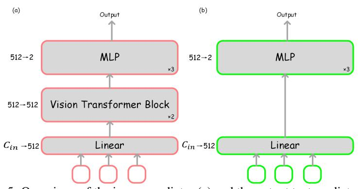

# A.4.1 DETAILS OF PREDICTOR ARCHITECTURE

Figure 5: Overviews of the image predictor (a) and the output text predictor (b).

The architectues of the image predictor and the output text predictor are presented in Fig. [5.](#page-20-4) Both the image predictor and the output text predictor employ a linear layer to reduce the input dimension from MLLMs to 512, thereby decreasing computational demands. The image predictor utilizes two vision transformer blocks [\(Dosovitskiy, 2020;](#page-10-14) [Touvron et al., 2021\)](#page-13-16) and a dimension-reducing three-layer MLP (512 → 256 → 128 → 2). The structure of the output text predictor is similar to that of the image predictor, except it does not use vision transformer blocks. This design choice ensures that

Table 10: The detailed calculation formula for FLOPs.

| Model Name                     | Calculation                                                                                                                                                                                                                                                            |
|--------------------------------|------------------------------------------------------------------------------------------------------------------------------------------------------------------------------------------------------------------------------------------------------------------------|
| LLaVA-1.5-7B                   | $32 \times (32 \times 1 \times 576 \times 4096 \times 4096 \times 1 + 4 \times 1 \times 576 \times 4096) = 10.1T$                                                                                                                                                      |
| LLaVA-PruMerge+                | $32 \times (32 \times 1 \times 146 \times 4096 \times 4096 \times 1 + 4 \times 1 \times 146 \times 146 \times 4096) = 2.5T$                                                                                                                                            |
| LLaVA-FastV                    | $\begin{array}{l} 3\times (32\times 1\times 576\times 4096\times 4096+4\times 1\times 576\times 576\times 4096)+29\times (32\times 1\times 144\times 4096\times 4096\times 4096+4\times 1\times 144\times 4096)=3.2T \end{array}$                                      |
| VoCo-LLAMA                     | $32 \times (32 \times 1 \times 128 \times 4096 \times 4096 \times 1 + 4 \times 1 \times 128 \times 128 \times 4096) = 2.2T$                                                                                                                                            |
| LLaVA-HiRED                    | $32 \times (32 \times 1 \times 115 \times 4096 \times 4096 \times 1 + 4 \times 1 \times 115 \times 115 \times 4096) = 2.07T$                                                                                                                                           |
| Dynamic-LLaVA                  | $\begin{array}{c} 2\times (32\times 1\times 576\times 4096\times 4096+4\times 1\times 576\times 4096)+30\times (32\times 1\times 115\times 4096\times 4096+4\times 1\times 115\times 115\times 4096)=2.5T \end{array}$                                                 |
| LLaVA-1.5-13B                  | $40 \times (32 \times 1 \times 576 \times 5120 \times 5120 + 4 \times 1 \times 576 \times 576 \times 5120) = 19.6T$                                                                                                                                                    |
| LLaVA-PruMerge+                | $40 \times (32 \times 1 \times 146 \times 5120 \times 5120 + 4 \times 1 \times 146 \times 146 \times 5120) = 4.9T$                                                                                                                                                     |
| LLaVA-FastV                    | $\begin{array}{l} 3\times (32\times 1\times 576\times 5120\times 5120+4\times 1\times 576\times 576\times 5120)+37\times (32\times 1\times 144\times 5120\times 5120\times 5120+4\times 1\times 144\times 5120)=6.0T \end{array}$                                      |
| VoCo-LLaMA                     | $40 \times (32 \times 1 \times 128 \times 5120 \times 5120 + 4 \times 1 \times 128 \times 128 \times 5120) = 4.3T$                                                                                                                                                     |
| LLaVA-HiRED                    | $40 \times (32 \times 1 \times 115 \times 5120 \times 5120 + 4 \times 1 \times 115 \times 115 \times 5120) = 3.9T$                                                                                                                                                     |
| Dynamic-LLaVA                  | $\begin{array}{c} 2 \times (32 \times 1 \times 576 \times 5120 \times 5120 + 4 \times 1 \times 576 \times 576 \times 5120) + 38 \times (32 \times 1 \times 115 \times 5120 \times 5120 \times 5120 + 4 \times 1 \times 115 \times 115 \times 5120) = 4.7T \end{array}$ |
| LLaVA-TokenPacker-7B-144Token  | $32 \times (32 \times 1 \times 144 \times 4096 \times 4096 + 4 \times 1 \times 144 \times 144 \times 4096) = 2.5T$                                                                                                                                                     |
| LLaVA-TokenPacker-7B-64Token   | $32 \times (32 \times 1 \times 64 \times 4096 \times 4096 + 4 \times 1 \times 64 \times 64 \times 4096) = 1.1T$                                                                                                                                                        |
| LLaVA-TokenPacker-FastV-7B     | $\begin{array}{l} 3\times (32\times 1\times 144\times 4096\times 4096+4\times 1\times 144\times 144\times 4096)+29\times (32\times 1\times 72\times 4096\times 4096+4\times 1\times 72\times 72\times 4096)=1.4T \end{array}$                                          |
| Dynamic-LLaVA-TokenPacker-7B   | $\begin{array}{c} 2\times (32\times 1\times 144\times 4096\times 4096+4\times 1\times 144\times 144\times 4096)+30\times (32\times 1\times 57\times 4096\times 4096+4\times 1\times 57\times 57\times 4096)=1.1T \end{array}$                                          |
| LLaVA-TokenPacker-13B-144Token | $40 \times (32 \times 1 \times 144 \times 5120 \times 5120 + 4 \times 1 \times 144 \times 144 \times 5120) = 4.9T$                                                                                                                                                     |
| LLaVA-TokenPacker-13B-64Token  | $40 \times (32 \times 1 \times 64 \times 5120 \times 5120 + 4 \times 1 \times 64 \times 64 \times 5120) = 2.2T$                                                                                                                                                        |
| LLaVA-TokenPacker-FastV-13B    | $3\times (32\times 1\times 144\times 5120\times 5120+4\times 1\times 144\times 144\times 5120)+37\times (32\times 1\times 72\times 5120\times 5120+4\times 1\times 72\times 72\times 5120)=2.6T$                                                                       |
| Dynamic-LLaVA-TokenPacker-13B  | $\begin{array}{c} 2\times (32\times 1\times 144\times 5120\times 5120+4\times 1\times 144\times 144\times 5120)+38\times (32\times 1\times 57\times 5120\times 5120\times 5120+4\times 1\times 57\times 57\times 5120)=2.1T \end{array}$                               |

Table 11: Comparison with more SoTA vision context sparsification methods on vision understanding benchmarks.

| Method                                     | Free | Image (    | (prefill) TFLOPs | VQAv2       | GQA         | SciQA        | TextVQA      | POPE        | MME            | MMBench     | SEED         | MMVP        | RealWorldQA  | CVBench-2D  |
|--------------------------------------------|------|------------|---------------------|-------------|-------------|--------------|--------------|-------------|----------------|-------------|--------------|-------------|--------------|-------------|
| LLaVA-1.5-7B                               | 1 -  | 576        | 10.1                | 78.5        | 62.0        | 66.8         | 58.2         | 85.9        | 1510.7         | 64.3        | 66.1         | 29.3        | 53.7         | 58.5        |
| (Arxiv24) LLaVA-PruMerge+                  | X    | 146 (-75%) | 2.5 (-75%)          | 76.8 (-1.7) | -           | 68.3 (+1.5)  | 57.1 (-1.1)  | 84.0 (-1.9) | 1462.4 (-48.3) | 64.9 (+0.6) | -            | -           | -            | -           |
| (ECCV24) LLaVA-FastV k=3,r=0.75 | 1    | 144 (-75%) |                     | 75.1 (-3.4) | 57.5 (-4.5) | 68.7 (+1.9)  | 56.2 (-2.0)  | 81.0 (-4.9) | 1458.9 (-51.8) | 63.5 (-0.8) | 62.8 (-3.3)  | 24.0 (-5.3) | 53.7 (-0.0)  | 56.7 (-1.9) |
| (Arxiv24) VoCo-LLaMA                       | X    | 128 (-78%) | 2.2 (-78%)          | 76.9 (-1.6) | 59.8 (-2.2) | -            | -            | -           | -              | 61.0 (-3.3) | 59.1 (-7.0)  | -           | -            | -           |
| (ECCV24) IVTP                              | X    | -          | 4.7 (-53%)          | 77.8 (-0.7) | 60.4 (-1.6) | 67.8 (+1.0)  | 58.2 (+0.0)  | 85.7 (-0.2) | -              | 66.1 (+1.8) | 54.6 (-11.5) | -           | -            | -           |
| (Arxiv24) TRIM                             | X    | 455 (-21%) | -                   | 76.4 (-2.1) | 61.4 (-0.6) | 48.1 (-18.7) | 53.7 (-4.5)  | 85.3 (-0.6) | 1461.3 (-49.4) | 67.4 (+3.1) | -            | -           | -            | -           |
| (Arxiv24) SparseVLM                        | /    | 449 (-22%) | _                   | 73.8 (-4.7) | 56.0 (-6.0) | 67.1 (+0.3)  | 54.9 (-3.3)  | 80.5 (-5.4) | 1696 (+185.3)  | 60.0 (-4.3) | -            | _           | _            | _           |
| (Arxiv24) LLaVA-HiRED                      | /    | 115 (-80%) | 2.0 (-80%)          | 74.7 (-3.8) | _           | 66.4 (-0.4)  | 44.2 (-14.0) |             | - '            |             | -            | -           | -            | -           |
| Dynamic-LLaVA-7B 1 (Ours)       | X    | 115 (-80%) | 2.5 (-75%)          | 78.0 (-0.5) | 61.4 (-0.6) | 69.1 (+2.3)  | 57.0 (-1.2)  | 85.0 (-0.9) | 1479.8 (-30.9) | 65.4 (+1.1) | 64.6 (-1.5)  | -           | -            | -           |
| Dynamic-LLaVA-7B IIT (Ours)     | Х    | 115 (-80%) | 2.5 (-75%)          | 77.9 (-0.6) | 61.3 (-0.7) | 68.6 (+1.8)  | 56.5 (-1.7)  | 85.9 (+0.0) | 1501.0 (-9.7)  | 64.1 (-0.2) | 65.0 (-1.1)  | 26.3 (-3.0) | 57.0 (+3.3)  | 58.3 (-0.2) |
| $LLaVA-1.5-7b+H2O_{r=0.5,k=10}$            | /    | -          | 10.1                | 77.9 (-0.6) | 61.0 (-1.0) | 41.9 (-16.3) | 55.9 (-2.3)  | 86.9 (+1.0) | 1458.4 (-52.3) | 1.4 (-62.9) | 26.8 (-39.3) | 0 (-29.3)   | 42.3 (-11.4) | 49.7 (-8.8) |

decisions during decoding with KV cache are solely based on the features from the current output text token.

#### A.4.2 DETAILS OF SETTINGS

For Dynamic-LLaVA presented in Tab. 1, we use LLaVA-1.5 (Liu et al., 2024a) as the base model and performing an additional one-epoch of instruction-tuning on its open-source weights. During training, we freeze the vision encoder and projector, updating only the parameters of LLM and predictors. The initial learning rates for LLM and predictors are set at 5e-6 and 2e-4, respectively, with a fixed global batch size of 64. We use the same 656K Mixture Dataset of LLaVA-1.5 for instruction-tuning, exclusively employing data containing images to train the predictors. All the other settings remain consistent with LLaVA-1.5.

For Dynamic-LLaVA-Tokenpacker presented in Tab. 2, we utilize the open-source weights of LLaVA-TokenPacker (Jin et al., 2024) as the base model. All settings remain identical to those described for Dynamic-LLaVA above.

We make adjustments only to the learning rates of the original MLLMs, applying uniform learning rates across all weights and the experiments are conducted on 8 NVIDIA A100 (80G).

For LLaVA-FastV $_{k=3,r=0.75}$  presented in Tab. 1 and Tab. 3, we use FastV to perform token pruning starting from the 3-rd layer of the model, applying FastV to tokens only during the prefill stage.

For  $^{\dagger}$ LLaVA-FastV $_{k=3,r=0.75}$  presented in Tab. 1, we further train LLaVA-FastV $_{k=3,r=0.75}$  for 1 epoch based on the open-source codes. The learning rate and batch size are same as Dynamic-LLaVA, and the discarded tokens are set to 0.

Table 12: More comparison with SoTA vision context sparsification methods on vision understanding benchmarks.

| Method                                 | LLM        |      | Image (p   | orefill)        | VizWiz      | LLaVA-Wild  | MM-Vet      |
|----------------------------------------|------------|------|------------|-----------------|-------------|-------------|-------------|
|                                        |            | Res. | Token      | TFLOPs          |             |             |             |
| LLaVA-1.5-7B                           | Vicuna-7B  | 336  | 576        | 10.1            | 50.0        | 65.8        | 31.7        |
| (Arxiv24) LLaVA-PruMerge+              | Vicuna-7B  | 336  | 146 (-75%) | 2.5 (-75%)      | <u> </u>    | _           | _           |
| (ECCV24) LLaVA-FastV $_{k=3,r=0.75}$   | Vicuna-7B  | 336  | 144 (-75%) | 3.2 (-68%)      | 51.9 (+1.9) | 66.7 (+0.9) | 28.1 (-3.6) |
| (Arxiv24) VoCo-LLaMA                   | Vicuna-7B  | 336  | 128 (-78%) | 2.2 (-78%)      | _           | _           | _           |
| (Arxiv24) LLaVA-HiRED                  | Vicuna-7B  | 336  | 115 (-80%) | 2.0 (-80%)      | _           | -           | -           |
| Dynamic-LLaVA-7B I (Ours)   | Vicuna-7B  | 336  | 115 (-80%) | 2.5+0.01 (-75%) | 50.2 (+0.2) | 67.3 (+1.5) | 29.5 (-2.2) |
| Dynamic-LLaVA-7B I T (Ours) | Vicuna-7B  | 336  | 115 (-80%) | 2.5+0.01 (-75%) | 51.2 (+1.2) | 68.7 (+2.9) | 32.2 (+0.5) |
| LLaVA-1.5-13B                          | Vicuna-13B | 336  | 576        | 19.6            | 53.6        | 72.5        | 36.6        |
| (Arxiv24) LLaVA-PruMerge+              | Vicuna-13B | 336  | 146 (-75%) | 4.9 (-75%)      | -           | _           | _           |
| (ECCV24) LLaVA-FastV $_{k=3,r=0.75}$   | Vicuna-13B | 336  | 144 (-75%) | 6.0 (-69%)      | 54.7 (+1.1) | 74.2 (+1.7) | 34.5 (-2.1) |
| Dynamic-LLaVA-13B 1 (Ours)  | Vicuna-13B | 336  | 115 (-80%) | 4.7+0.01 (-76%) | 53.3 (-0.3) | 73.4 (+0.9) | 37.3 (+0.7) |
| Dynamic-LLaVA-13B $_{I T}$ (Ours)      | Vicuna-13B | 336  | 115 (-80%) | 4.7+0.01 (-76%) | 53.0 (-0.6) | 70.1 (-2.5) | 34.6 (-2.0) |

Table 13: Additional results of Dynamic-LLaVA with the TokenPacker projector on generation ability benchmarks. Dynamic-LLaVA achieves significant inference efficiency during the decoding stage with negligible generation ability drop when both sparsify vision and language.

| Benchmark                  | Method                                                                                                   | Image (prefill)          |                                    | Text (decoding)          |                                  | PPL          | METEOR↑          |  |
|----------------------------|----------------------------------------------------------------------------------------------------------|--------------------------|------------------------------------|--------------------------|----------------------------------|--------------|------------------|--|
|                            |                                                                                                          |                          | Total→Computing                    | TFLOPs                   | Mem. (M)                         |              |                  |  |
| LVIS-VQA (single-round) | LLaVA-TokenPacker-7B-144Token                                                                            | 2.5                      | 159/175→159/175                    | 2.75/3.03                | 102/89                           | 4.60         | 0.3114           |  |
|                            | Dynamic-LLaVA-TokenPacker-7B I (Ours) Dynamic-LLaVA-TokenPacker-7B I T (Ours)      | 1.1 (-56%) 1.1 (-56%) | 159/178→159/178 159/182→83/90   | 2.75/3.08 1.51/1.59   | 111/101 68 (-33%)/54 (-39%)   | 4.72 4.91 | 0.3127 0.3120 |  |
|                            | LLaVA-TokenPacker-13B-144Token                                                                           | 4.9                      | 159/176→159/176                    | 5.36/5.94                | 148/142                          | 4.40         | 0.3166           |  |
|                            | Dynamic-LLaVA-TokenPacker-13B I (Ours) Dynamic-LLaVA-TokenPacker-13B I T (Ours) | 2.1 (-57%) 2.1 (-57%) | 159/178→159/178 159/178→84/88   | 5.36/6.03 2.95/3.08   | 152/149 87 (-41%)/73 (-49%)   | 4.55 4.78 | 0.3149 0.3131 |  |
|                            | LLaVA-TokenPacker-7B-144Token                                                                            | 2.5                      | 351/499→351/499                    | 6.12/8.76                | 222/257                          | 2.97         | 0.4220           |  |
| LVIS-VQA (multi-round)  | Dynamic-LLaVA-TokenPacker-7B I (Ours) Dynamic-LLaVA-TokenPacker-7B I T (Ours)   | 1.1 (-56%) 1.1 (-56%) | 351/507→351/507 351/519→181/258 | 6.12/8.90 3.32/4.48   | 245/270 142 (-36%)/145 (-44%) | 3.09 3.20 | 0.4223 0.4245 |  |
|                            | LLaVA-TokenPacker-13B-144Token                                                                           | 4.9                      | 351/514→351/514                    | 11.92/17.57              | 321/409                          | 2.89         | 0.4232           |  |
|                            | Dynamic-LLaVA-TokenPacker-13B I (Ours) Dynamic-LLaVA-TokenPacker-13B I T (Ours) | 2.1 (-57%) 2.1 (-57%) | 351/514→351/514 351/517→179/253 | 11.92/17.90 6.33/8.54 | 346/426 189(-41%)/207 (-49%)  | 2.97 3.07 | 0.4222 0.4230 |  |

For H2O in vision understanding benchmarks presented in Tab. 1, LLaVA-1.5-7/13B+H2O $_{r=0.5}$  in Tab. 1 means that we directly implement H2O on LLaVA, which retains 50% KV cache in each of the prefill and decoding stages. And LLaVA-1.5-7/13B+H2O $_{k=10,r=0.5}$  means that we still retain 50% KV cache in each of the prefill and decoding stages, but the first 10 layers do not conduct KV cache compression, and H2O is applied only beyond the 10-th layer.

For H2O in generation ability benchmarks presented in Tab. 3.  $\text{H2O}_{r=0.5}$  means that we directly implement H2O on LLaVA, which retains 50% KV cache in each of the prefill and decoding stages. Fastv-7/13Bk=3,r=0.5+H2Or=0.5 means that we use FastV to reduce tokens of the prefill stage, and use H2O to reduce KV cache (retain ratio = 50%) only for the decoding stage.

#### A.4.3 DETAILS OF LVIS-VQA BENCHMARKS

We use the LVIS-Instruct4V Dataset (Wang et al., 2023) to build the generation ability benchmarks.

The LVIS-Instruct4V Dataset contains 220,000 visually aligned and context-aware instructions generated by prompting the advanced GPT-4V model with images sourced from the LVIS database. We created the LVIS-VQA (single-round) Benchmark by selecting 1,000 instances from the LVIS-Instruct4V dataset, specifically focusing on single-round Visual Question Answering (VQA) scenarios where the answer lengths exceed 100 words. Additionally, we constructed the LVIS-VQA (multiround) Benchmark from another subset of 1,000 multi-round VQA instances. The average answer length in this benchmark exceeds 300 words, with interactions spanning more than seven rounds. Examples from the LVIS-VQA benchmark we constructed can be found in Fig. 6 and Fig. 7.

#### A.4.4 DETAILS OF SHAREGPT4V-VQA BENCHMARKS

To evaluate the generation ability of the model in long-text context scenarios, we use the ShareGPT4V dataset (Chen et al., 2023b), extracting VQA samples with long-text caption to construct our ShareGPT4V-VQA benchmark. The original ShareGPT4V dataset consists of 100K VQA samples, with an average caption length of 900 characters. To construct the long generation text benchmark

Table 14: The latency of the model during the entire generation stage with KV cache. For decoding, we report the average latency per token when batch size = 1 and the number of total generation tokens = 1000. The results are measured in one A100 (80G).

| Method                  | Prefill latency (ms) | Decoding latency (ms) |  |  |  |
|-------------------------|----------------------|-----------------------|--|--|--|
| LLaVA-1.5-13B           | 124.52               | 28.42                 |  |  |  |
| †LLaVA-1.5-13B+H2Or=0.5 | 111.84               | 37.71                 |  |  |  |
| Dynamic-LLaVA-13BI T    | 72.51                | 26.85                 |  |  |  |

† H2O requires an additional attention computation process to obtain the attention scores, due to the efficient inference operator implicitly handling attention operations.

Table 15: Training time of Dynamic-LLaVA on 8 A100 (80G).

| Method               | Training time (h) |  |  |  |  |
|----------------------|-------------------|--|--|--|--|
| Dynamic-LLaVA-7BI T  | ∼13               |  |  |  |  |
| Dynamic-LLaVA-13BI T | ∼24               |  |  |  |  |

and obtain the benchmark ShareGPT4V-VQA of the ShareGPT4V dataset (total of 178 samples), we selected the samples with captions containing no less than 300 words, while the average output text length of this benchmark is more than 1,000 tokens.

#### A.4.5 DETAILS OF CALCULATION EQUATION OF FLOPS

For the prefill FLOPs presented in Tab. [1,](#page-7-0) Tab. [2](#page-7-1) and Tab. [3,](#page-8-2) We adopt the equation below to calculate:

$$FLOPs = 32BNC^2 + 4BN^2C, (13)$$

where B, N and C denote the input batch size, the number of image tokens, and the dimensionality of MLLMs [\(Liu et al., 2024b](#page-12-1)[;a\)](#page-12-2) utilizing the LLaMA architecture [\(Touvron et al., 2023a;](#page-13-0)[b;](#page-13-1) [Llama,](#page-12-15) [2024\)](#page-12-15), respectively. The first term in Eq. [13](#page-23-4) represents the computation consumption of the MHA layer, while the second term corresponds to the overhead of the MLP layer. Specific calculations are detailed in Tab. [10.](#page-21-1) Note that we only calculate the FLOPs of the image tokens for prefill stage of MLLMs.

