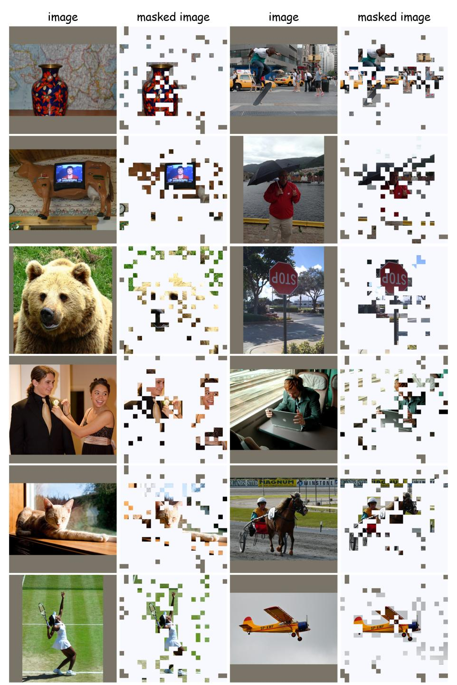

# A.5.1 ADDITIONAL BENCHMARK RESULTS

Vision understanding. Due to constraints on the length of the main text, we have included the remaining experimental results for the three vision understanding benchmarks in Tab. [12.](#page-22-2) Dynamic-LLaVA achieved competitive results on these three benchmarks. In comparison with other methods that only sparsify vision tokens, Dynamic-LLaVA is capable of significantly reducing the number of tokens involved in the computation process.

We further compare the vision understanding performance with more current SoTA and recent token reduction methods, including IVTP [\(Huang et al., 2024a\)](#page-11-8), TRIM [\(Song et al., 2024\)](#page-12-6), and SparseVLM [\(Zhang et al., 2024c\)](#page-13-17). The results in Tab. [11](#page-21-2) are based on evaluations conducted with LLaVA-1.5-7B. Compared to other token reduction methods, Dynamic-LLaVAI|T not only reduces 80% of image tokens in the prefill stage but also decreases 50% of output text tokens during decoding, consistently outperforming both training-free and training-required methods in most cases.

Generation ability of Dynamic-LLaVA with TokenPacker projector. To further demonstrate the comprehensiveness of our proposed method, we present the results of Dynamic-LLaVA using TokenPacker as the vision projector on the LVIS-VQA benchmarks in Tab. [13.](#page-22-3) As shown in Tab. [13,](#page-22-3) compared to LLaVA-TokenPacker, Dynamic-LLaVA that sparsifies both vision and language contexts, significantly reduces computational costs with only a slight compromise in performance. Specifically, Dynamic-LLaVA-TokenPacker-7B/13BI|T can reduce up to ∼50% TFLOPs and 37.75% GPU memory overhead on average, while the PPL increases by a maximum of 0.38 and on average only by 0.275; METEOR decreases by a maximum of 0.0035, and in most cases, the results are improved.

Table 16: More trade-off results of the rates of vision context sparsification and language context sparsification.

| Context  | Rate | Benchmark |         |      |        |         |      |  |  |  |
|----------|------|-----------|---------|------|--------|---------|------|--|--|--|
|          |      | SciQA     | TextVQA | POPE | MME    | MMBench | SEED |  |  |  |
| -        | 20%  | 68.6      | 56.5    | 85.9 | 1501.0 | 64.1    | 65.0 |  |  |  |
| Vision   | 50%  | 68.8      | 57.2    | 85.5 | 1487.0 | 65.7    | 65.5 |  |  |  |
|          | 80%  | 69.7      | 57.3    | 86.1 | 1469.3 | 65.9    | 65.9 |  |  |  |
|          | 20%  | 68.7      | 54.9    | 86.3 | 1483.3 | 64.6    | 64.5 |  |  |  |
| Language | 50%  | 68.6      | 56.5    | 85.9 | 1501.0 | 64.1    | 65.0 |  |  |  |
|          | 80%  | 69.4      | 56.9    | 86.6 | 1473.9 | 64.8    | 64.4 |  |  |  |
| baseline | 100% | 66.8      | 58.2    | 85.9 | 1510.7 | 64.3    | 66.1 |  |  |  |

Table 17: Trade-off of the rates of vision context sparsification and language context sparsification on generation ability benchmarks. Baseline indicates LLaVA-1.5-7B. Note that the definition of "Total—Computing", "TFLOPs", "Mem. (M)" and "a/b" are same as Tab. 3.

| Context  | Rate | LVIS (single-round) |           |          |      | LVIS (multi-round) |                    |           |          |      |        |
|----------|------|---------------------|-----------|----------|------|--------------------|--------------------|-----------|----------|------|--------|
|          |      | Total→Computing     | TFLOPs    | Mem. (M) | PPL↓ | МЕТ.↑              | Total -> Computing | TFLOPs    | Mem. (M) | PPL↓ | MET.↑  |
|          | 20%  | 159/181→84/90       | 1.52/1.57 | 63/46    | 4.90 | 0.3108             | 351/522→182/260    | 3.33/4.38 | 144/140  | 3.17 | 0.4251 |
| Vision   | 50%  | 159/173→83/86       | 1.52/1.53 | 65/202   | 4.88 | 0.3107             | 351/478→178/234    | 3.27/4.34 | 138/125  | 3.15 | 0.4264 |
|          | 80%  | 159/171→83/85       | 1.51/1.56 | 66/284   | 4.88 | 0.3090             | 351/480→179/238    | 3.29/4.40 | 139/124  | 3.16 | 0.4258 |
|          | 20%  | 159/170→41/39       | 0.84/0.82 | 44/22    | 5.53 | 0.2592             | 351/487→84/108     | 1.74/2.28 | 95/69    | 3.47 | 0.4236 |
| Language | 50%  | 159/181→84/90       | 1.52/1.57 | 63/46    | 4.90 | 0.3108             | 351/522→182/260    | 3.33/4.38 | 144/140  | 3.17 | 0.4251 |
|          | 80%  | 159/172→129/138     | 2.26/2.43 | 85/70    | 4.76 | 0.3116             | 351/484→281/387    | 4.98/6.86 | 190/203  | 3.10 | 0.4226 |
| baseline | 100% | 159/173→159/173     | 2.75/2.99 | 103/91   | 4.59 | 0.3103             | 351/461→351/461    | 6.12/8.08 | 222/236  | 2.97 | 0.4227 |

#### A.5.2 ADDITIONAL PRACTICAL INFERENCE EFFICIENCY ANALYSIS

We further report the practical inference latency with KV cache in Tab. 14. We measure the average generation latency per token when the generation length is 1000. The proposed Dynamic-LLaVA framework exhibits an average improvement of 1.57 ms per token in generation latency compared to LLaVA when decoding with KV cache. This result demonstrates that, the learnable lightweight predictors add a negligible increase to inference latency (less than 1%). Meanwhile, for traditional "attention-based" KV cache compression methods (e.g., H2O), the requirement for attention scores during decoding to perform KV cache compression poses a challenge in practical engineering implementations. In many cases, the attention operations of efficient inference operators are implicit, thus requiring an additional computation step to obtain attention scores during inference. This can impact inference speed, especially when dealing with excessively long KV caches. In contrast, Dynamic-LLaVA relies solely on the features of the current token for prediction when decoding with KV cache, thereby avoiding this issue.

#### A.5.3 TRAINING TIME

Same as LLaVA-PruMerge (Shang et al., 2024), Dynamic-LLaVA requires one epoch instruction-tuning based on pretrained LLaVA-1.5. We report the training time of Dynamic-LLaVA in Tab. 15, our training time is similar to the original LLaVA-1.5. Notably, Dynamic-LLaVA achieves efficient inference with superior performance compared to other token sparsification methods that require training (Shang et al., 2024; Song et al., 2024; Huang et al., 2024a; Ye et al., 2024).

#### A.5.4 ADDITIONAL TRADE-OFF ANALYSIS

Trade-off analysis on vision understanding tasks. We further illustrate in Tab. 16 the performance across more vision understanding tasks when adjusting the keep rates of vision context  $(r^I)$  and language context  $(r^{OT})$  during training. Across most datasets, setting higher keep rates leads to better results but also entails greater computational expense. Under the current settings, i.e.,  $r^I = 20\%, r^{OT} = 50\%$ , Dynamic-LLaVA can achieve a balance between computational costs and performance. Additionally, we did not observe sharp fluctuations in performance when adjusting  $r^I$  and  $r^{OT}$ , suggesting that Dynamic-LLaVA has robustness to the keep rates variations.

**Trade-off analysis of generation ability.** Same as vision understanding tasks, we also analysis the trade-off of  $r^I$  and  $r^{OT}$  on LVIS-VQA (single-round) and LVIS-VQA (multi-round). As shown in

Figure 6: Visual representation of dynamic token reduction for LVIS-VQA (single-round). The gray color means the contexts reduced by Dynamic-LLaVA-13B $_{I|T}$ . Note that the reduction of the language context does not imply the texts are not generated. Rather, it refers to the subsequent computational exclusion of these output text tokens to improve inference efficiency. Dynamic-LLaVA-13B $_{I|T}$  is able to reduce the vision and language contexts that are not crucial for generating the next token.

Table 17, when adjusting  $r^I$ , the performance and computational costs of Dynamic-LLaVA remain consistent; whereas, when adjusting  $r^{OT}$ , a small  $r^{OT}$  leads to a significant decrease in computational expenses, along with a decline in generative ability. Setting  $r^{OT}=50$  achieves a balance between performance and computation costs. Although a smaller  $r^{OT}$  significantly lowers computational costs, it concurrently yields a considerable decrease in the model's generative ability. While a larger  $r^{OT}$  leads to higher computational costs, it only results in a slight improvement in performance.

Figure 7: Visual representation of dynamic token reduction for LVIS-VQA (multi-round). The gray color means the contexts reduced by Dynamic-LLaVA-13BI|T . Dynamic-LLaVA-13BI|T is able to reduce the vision and language contexts that are not crucial for generating the next token. Note that the reduction of the language context does not imply the texts are not generated. Rather, it refers to the subsequent computational exclusion of these output text tokens to improve inference efficiency. Dynamic-LLaVA-13BI|T is able to reduce the vision and language contexts that are not crucial for generating the next token.

#### A.6 VISUALIZATION

Visualization of LVIS-VQA. Fig. [6](#page-25-0) shows the dynamic token reduction process of Dynamic-LLaVA on LVIS-VQA (single-round), while Fig. [7](#page-26-1) illustrates the same process in LVIS-VQA (multi-round). In Fig. [6,](#page-25-0) a user asks a question to Dynamic-LLaVA, and the associated input image is shown, with regions marked in gray indicating the dynamically reduced token patches determined by Dynamic-LLaVA. Drawing from the identified mask and the provided input information, the model produces a

Figure 8: Visualization of the vision token patches for COCO. The gray color means the contexts reduced by Dynamic-LLaVA-13BI|T . The first and third columns are the original images, and the second and fourth columns are the reduced vision token patches by Dynamic-LLaVA-13BI|T .

textual mask, with the obscured words or affixes similarly exhibited in gray. This procedure boosts the inference efficiency of the model and ensures effective focus on relevant information for a fast response generation.

Fig. [7](#page-26-1) further shows this process by illustrating the example of multi-round dialogue interaction in LVIS-VQA (multi-round). In this scenario, the model not only considers the current user query and image but also incorporates context from previous rounds of dialogues. The dynamically masked areas in both the image and text are both shown in gray, emphasizing how the model dynamically adjusts its focus based on the ongoing interaction. This enables the model to maintain coherence and context across multiple exchanges while boosting response generation speed.

Visualization of COCO. In Fig. [8,](#page-27-0) we show the visualization results of the vision token patches in COCO Dataset [\(Lin et al., 2014\)](#page-12-16). We set the instruction as "Describe this image" for Dynamic-LLaVA. Notably, the patches focus primarily on the foreground elements of the images, effectively highlighting important features and discarding irrelevant background details. This demonstrates the capability of Dynamic-LLaVA to isolate and retain essential visual features for further process.