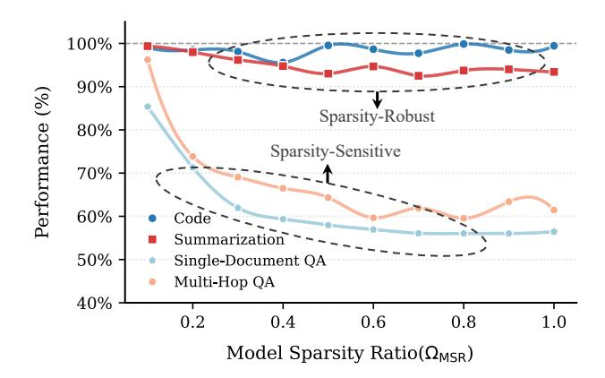
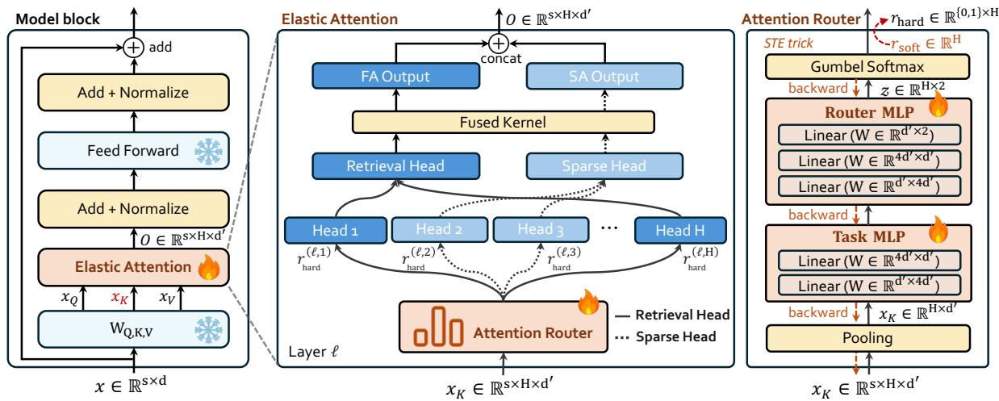

# 2. Preliminary

### 2.1. Retrieval Heads and Sparse Heads

Retrieval Heads and FA Retrieval heads are a class of attention heads specialized in capturing contextually relevant tokens from long sequences, enabling modern LLMs to operate effectively in long-context processing tasks [\(Wu](#page-9-7) [et al.,](#page-9-7) [2024\)](#page-9-7). In practice, retrieval heads typically adopt the standard FA computation mode. Given the Query (Q), Key (K), and Value (V ) states, the computation of FA is :

$$\mathcal{O}_r = \operatorname{Softmax}(QK^\top) V,$$
 (1)

where we omit the scaling factor for simplicity.

Sparse Heads and SA Compared to the retrieval heads, sparse heads reduce computational cost by leveraging SA mode, which retains only a fraction of the most relevant K and V (e.g., 20% of key and value states). The computation

*Figure 2.* Trend of model performance as the hybrid model sparsity ratio (ΩMSR) increases. We report model performance as a relative percentage score with respect to that of FA.

of SA can be defined as:

$$\mathcal{O}_s = \operatorname{Softmax}(Q\tilde{K}^\top)\tilde{V},$$
 (2)

where K˜ and V˜ are partial elements in K and V .

Hybrid Head Mechanism While SA substantially reduces computation, it may lead to performance degradation [\(Lu et al.,](#page-9-8) [2025b\)](#page-9-8). To balance efficiency and performance, recent methods adopt a *hybrid heads* design that mixes retrieval and sparse heads within the same model [\(Xiao et al.,](#page-10-2) [2025;](#page-10-2) [Yu et al.,](#page-10-4) [2025;](#page-10-4) [Bhaskar et al.,](#page-8-6) [2025\)](#page-8-6). Specifically, for a Transformer with L layers and H key–value heads per layer[1](#page-1-0) , the h-th head in the ℓ-th layer is assigned a computation type: π (ℓ,h) ∈ {FA, SA}, and the final output per layer (O(ℓ) ) can be written as:

$$\begin{cases}
\mathbf{O}^{(\ell)} = \operatorname{Concat}\left(\mathcal{O}^{(\ell,1)}, \mathcal{O}^{(\ell,2)}, \dots, \mathcal{O}^{(\ell,H)}\right), \\
\mathcal{O}^{(\ell,h)} = \begin{cases}
\mathcal{O}_r, & \pi^{(\ell,h)} = \operatorname{FA}, \\
\mathcal{O}_s, & \pi^{(\ell,h)} = \operatorname{SA},
\end{cases}$$
(3)

Sparsity Ratio Computation Under the hybrid-head mechanism, given a model fθ, we define two types of model sparsity ratios from two perspectives: (1) the proportion of sparse attention heads, and (2) the proportion of tokens attended to by those heads.

Definition 2.1 (Model Sparsity Ratio, ΩMSR). ΩMSR measures the fraction of sparse heads in the model:

$$\Omega_{\mathrm{MSR}}(f_{\theta}) = \frac{1}{\mathrm{H}} \frac{1}{\mathrm{L}} \sum_{h=1}^{\mathrm{H}} \sum_{l=1}^{\mathrm{L}} \mathbb{I} \left[ \pi^{(\ell,h)} = \mathrm{SA} \right], \quad (4)$$

where I[·] is the indicator function.

1Here we adopt grouped query attention (GQA) [\(Ainslie et al.,](#page-8-7) [2023\)](#page-8-7) definition instead of multi-head attention (MHA), as GQA is widely used in modern LLM architectures.

(a) Architecture of model block (b) Information flow of Elastic Attention and Attention Router (c) Design of Attention Router

*Figure 3.* Illustration of our proposed Elastic Attention. (a) shows the adapted model block with frozen backbone parameters; (b) details the dynamic assignment of heads via the Attention Router module; (c) presents the lightweight design of the Attention Router.

Definition 2.2 (Effective Sparsity Ratio, ΩESR). ΩESR measures the effective sparsity of the entire model, taking both the sparse heads and their corresponding sparsity patterns into account. It can be calculated as:

$$\Omega_{\rm ESR}(f_{\theta}) = \frac{1}{H} \frac{1}{L} \sum_{h=1}^{H} \sum_{\ell=1}^{L} \rho^{(\ell,h)},$$
(5)

where ρ (ℓ,h) ∈ [0, 1) denotes the pruning ratio of each head, with ρ (ℓ,h) = 0 for heads with FA, since no tokens are pruned, and ρ (ℓ,h) = ρSA for heads with SA[2](#page-2-1) .

## 2.2. Impact of ΩMSR on Downstream Tasks

While existing hybrid head mechanisms have achieved strong performance–efficiency trade-offs, they suffer from a critical limitation: *the* ΩMSR *is fixed at inference time, and its relationship with downstream task performance remains unexplored.* In this section, we investigate the impact of varying ΩMSR on different downstream tasks.

Settings We experiment with the Llama3.1-8B-Instruct model [\(Grattafiori et al.,](#page-8-4) [2024\)](#page-8-4) and follow [Wu et al.](#page-9-7) [\(2024\)](#page-9-7) to identify retrieval heads in the model and rank them by their activation frequency. Based on this ranking, we progressively replace retrieval heads with sparse heads, thereby increasing the ΩMSR. We evaluate the above resulting model on LongBench [\(Bai et al.,](#page-8-8) [2024\)](#page-8-8), which consists of 6 distinct long-context downstream tasks. For different values of ΩMSR, we report the model performance as a percentage relative to that of the backbone model (full

FA). For instance, at an ΩMSR = 20%, the resulting model may achieve 73.85% of the backbone model's performance (ΩMSR = 0%). We provide background of retrieval head identification and implementation details in Appendix [C.](#page-11-0)

Results As shown in Figure [2,](#page-1-1) the tasks can be broadly categorized into two categories. The first category, which we refer to as *sparsity-robust tasks*, exhibits performance that is largely insensitive to changes in ΩMSR. This is because these tasks can be solved using only coarse-grained contextual information, e.g., summarization. The second category, *sparsity-sensitive tasks*, shows a sharp decline in performance once ΩMSR exceeds a certain threshold. Such tasks require retrieving fine-grained evidence from the context to produce accurate outputs, as is typical in question-answering tasks. Therefore, *regardless of the number of task types, they can all be mapped into one of these two categories*. Under this setting, the model only needs to determine whether a task requires fine-grained information and then apply the corresponding attention computation mode accordingly.

