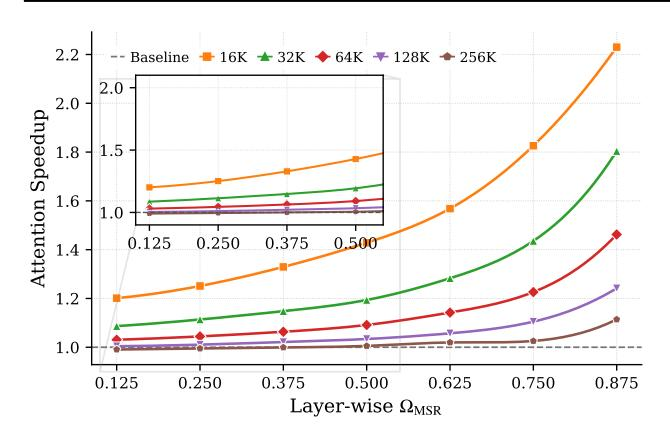

# 3. Elastic Attention

We provide an overview of our approach in Figure [3.](#page-2-2) The sub-figure [3\(](#page-2-2)a) illustrates the overall architecture integrating our Elastic Attention module, whose core component is an Attention Router mechanism. Notably, except for the Elastic Attention components, all backbone model parameters are frozen during training.

## 3.1. Introduce Attention Router

Information Flow of Attention Router As illustrated in sub-Figure [3\(](#page-2-2)b), the attention router operates in a manner

2Different SA strategies correspond to specific ρSA, e.g., if SA only attends to 10% tokens along the sequence dimension, then ρSA = 0.9, meaning that 90% of tokens are pruned.

Figure 4. Comparison of our fused kernel with a Torch-based sequential implementation for layer-wise hybrid attention.

analogous to a Mixture-of-Experts (MoE) (Shazeer et al., 2017) gating mechanism: it determines, based on the input hidden states, which attention computation mode (i.e., FA or SA) is assigned to each key-value head. Specifically, the Key hidden states ( $x_K \in \mathbb{R}^{s \times H \times d'}$ , where s denotes sequence length, d' denotes head dimension) are fed into the attention router. Then, it produces a hard binary decision ( $r_{\text{hard}}^{(\ell,h)} \in \{0,1\}$ ) for each head, indicating whether this head employs FA ( $r_{\text{hard}}^{(\ell,h)} = 0$ ) or SA ( $r_{\text{hard}}^{(\ell,h)} = 1$ ) computation mode. Each head then adopts its allocated attention computation mode, and the resulting head outputs are concatenated along the feature dimension to form the final output.

Architecture Design of Attention Router We show the architecture of the attention router in sub-Figure 3(c), which consists of two components: a task MLP and a router MLP. The task MLP is designed to infer task-specific characteristics from the input hidden states, while the router MLP leverages these task-aware representations to determine the attention computation mode for each head. More concretely, given the Key hidden states  $(x_K)$ , the attention router first applies pooling along the sequence dimension to obtain a task representation  $x_K' \in \mathbb{R}^{H \times d'}$ . The pooled latent  $x_K'$  is then fed into the task MLP and the router MLP to produce a head-wise routing logit matrix  $(z \in \mathbb{R}^{H \times 2})$ , which is then converted into a binary decision  $r_{\text{hard}}^{(\ell,h)}$  for each head via a softmax-based classifier.

#### 3.2. Optimization-based Head Identification

**Attention Router Optimization** Notably, to ensure consistency between training and inference, where inference uses hard routing decisions (i.e., binary classification), we also adopt hard routing during training. This introduces

two challenges: (i) how to make the softmax-based routing distribution closely approximate hard routing decisions, and (ii) how to handle the non-differentiability introduced by hard routing decisions. To address the first issue, we adopt a continuous relaxation scheme based on the Gumbel–Softmax (Jang et al., 2016) with annealing, which gradually sharpens the routing distribution during training toward discrete assignments. Specifically, we feed z to the Gumbel–Softmax and obtain a soft routing matrix  $r_{\rm soft}^{(\ell)} \in \mathbb{R}^{H \times 2}$ , where each column corresponds to the routing probabilities of all heads in layer  $\ell$ . Hard routing decisions are then obtained by applying  $\arg \max$  over the second dimension:

$$r_{\text{hard}}^{(\ell,h)} = \underset{c \in \{0,1\}}{\operatorname{argmax}} \ r_{\text{soft}}^{(h,c)}, \qquad \forall h \in \{1,\dots,H\}. \quad (6)$$

For the second issue, since  $\arg\max$  operation is non-differentiable and would block gradient flow, we employ a straight-through estimator (STE) strategy (Bengio et al., 2013), where  $r_{\rm hard}^{(\ell,h)}$  can be rewritten as:

$$r_{\text{hard}}^{(\ell,h)} = r_{\text{hard}}^{(\ell,h)} + \left[ r_{\text{soft}}^{(\ell,h)} - \text{gradient\_detach} \left( r_{\text{soft}}^{(\ell,h)} \right) \right], \tag{7}$$

which enables gradients to propagate through the soft routing distribution in the backward process while preserving hard routing behavior in the forward pass. We provide more details and theoretical explanations in Appendix F.

Training Objective We use the  $\Omega_{\mathrm{MSR}}$  metric to calculate the predicted sparsity during training and compare it against the task-specific target sparsity t. Notably, instead of enforcing a fixed t for each task, we impose task-dependent nontight constraints with predefined lower and upper bounds since the optimal sparsity for a given task is unknown. To ensure that introducing sparsity does not degrade the language modeling capability, we build a min-max optimization term upon the standard language modeling objective with a sparsity regularization term. Given an input  $\mathcal X$  and corresponding label  $\mathcal Y$ , the training objective is:

$$\max_{\lambda_{1},\lambda_{2}} \min_{\text{language}} \underbrace{L_{\text{language}}(\mathcal{X})}_{\text{language modeling}} + \underbrace{\lambda_{1}L_{\text{diff}}(\mathcal{X}) + \lambda_{2}L_{\text{diff}}^{2}(\mathcal{X})}_{\text{sparsity regularization}},$$

$$\Rightarrow \begin{cases} L_{\text{language}} = \text{CE-Loss}\left(\mathcal{Y} \mid f_{\theta}(\mathcal{X})\right), \\ L_{\text{diff}} = \Omega_{\text{MSR}}\left(f_{\theta}(\mathcal{X})\right) - t, \end{cases}$$
(8)

where CE\_Loss denotes the standard cross-entropy loss for language modeling, and  $\lambda_1, \lambda_2$  are task-specific trainable Lagrange multipliers optimized via gradient ascent (Bhaskar et al., 2025), which decouple the sparsity-performance trade-offs across tasks and mitigate optimization conflicts.

#### 3.3. Efficient Deployment

Since each layer adopts a hybrid-heads computation, where different types of heads cannot be efficiently parallelized at

&lt;sup>3In practice, we avoid pooling over the full sequence, as long context introduces substantial redundancy that degrades the quality of task representation. We investigate this in Appendix H.5.

Table 1. Performance on LongBench-E (Bai et al., 2024). We report average performance (Perf.) and  $\Omega_{\rm MSR}$  per task category. The 1st and the 2nd performance in each comparison group are highlighted with **bold font** and <u>underlined</u>, respectively.

| Method                       | S-De         | oc QA                 | M-D   | oc QA                 | Su        | mm                    | In-C     | ontext                | Syn   | thetic                | C     | ode                   | A            | vg.                   |
|------------------------------|--------------|-----------------------|-------|-----------------------|-----------|-----------------------|----------|-----------------------|-------|-----------------------|-------|-----------------------|--------------|-----------------------|
| Netilou                      | Perf.        | $\Omega_{\text{MSR}}$ | Perf. | $\Omega_{\text{MSR}}$ | Perf.     | $\Omega_{\text{MSR}}$ | Perf.    | $\Omega_{\text{MSR}}$ | Perf. | $\Omega_{\text{MSR}}$ | Perf. | $\Omega_{\text{MSR}}$ | Perf.        | $\Omega_{\text{MSR}}$ |
| Qwen3-4B backbone model      |              |                       |       |                       |           |                       |          |                       |       |                       |       |                       |              |                       |
| Qwen3-4B                     | 43.69        | -                     | 38.48 | -                     | 28.46     | -                     | 66.21    | -                     | 49.59 | -                     | 54.38 | -                     | 48.45        | -                     |
| + InfLLM-V2                  | 43.30        | -                     | 34.97 | -                     | 29.95     | -                     | 64.19    | -                     | 38.54 | -                     | 59.58 | -                     | 46.68        | -                     |
| + DuoAttention               | 41.73        | 0.70                  | 35.72 | 0.70                  | 28.47     | 0.70                  | 64.59    | 0.70                  | 47.17 | 0.70                  | 53.91 | 0.70                  | 46.95        | 0.70                  |
| + PruLong                    | 41.58        | 0.70                  | 37.58 | 0.70                  | 28.53     | 0.70                  | 64.80    | 0.70                  | 47.23 | 0.70                  | 53.20 | 0.70                  | 47.19        | 0.70                  |
| + Elastic Attention (FA-SSA) | 42.20        | 0.66                  | 38.86 | 0.68                  | 28.50     | 0.76                  | 65.73    | 0.73                  | 48.43 | 0.71                  | 54.34 | 0.82                  | 48.08        | 0.73                  |
| + Elastic Attention (FA-XA)  | 44.40        | 0.68                  | 39.42 | 0.71                  | 28.49     | 0.82                  | 65.26    | 0.76                  | 44.35 | 0.74                  | 54.29 | 0.87                  | <u>47.59</u> | 0.76                  |
| Qwen3-8B backbone model      |              |                       |       |                       |           |                       |          |                       |       |                       |       |                       |              |                       |
| Qwen3-8B                     | 45.57        | _                     | 51.59 | _                     | 28.34     | -                     | 66.64    | _                     | 50.16 | -                     | 61.20 | _                     | 52.16        | _                     |
| + InfLLM-V2                  | 42.20        | -                     | 42.33 | -                     | 29.58     | -                     | 64.55    | -                     | 45.87 | -                     | 59.58 | -                     | 49.03        | -                     |
| + DuoAttention               | 45.45        | 0.70                  | 44.52 | 0.70                  | 28.16     | 0.70                  | 66.42    | 0.70                  | 47.50 | 0.70                  | 62.38 | 0.70                  | 50.67        | 0.70                  |
| + PruLong                    | 46.05        | 0.70                  | 46.88 | 0.70                  | 28.30     | 0.70                  | 66.61    | 0.70                  | 48.66 | 0.70                  | 62.24 | 0.70                  | 51.34        | 0.70                  |
| + Elastic Attention (FA-SSA) | 46.15        | 0.64                  | 46.54 | 0.65                  | 28.19     | 0.72                  | 67.52    | 0.71                  | 48.07 | 0.65                  | 62.95 | 0.78                  | 51.51        | 0.69                  |
| + Elastic Attention (FA-XA)  | 44.01        | 0.75                  | 49.99 | 0.76                  | 28.30     | 0.83                  | 66.23    | 0.80                  | 50.95 | 0.77                  | 60.57 | 0.86                  | 51.66        | 0.80                  |
|                              |              |                       |       | Llama-3               | 3.1-8B-In | struct ba             | ckbone 1 | nodel                 |       |                       |       |                       |              |                       |
| Llama-3.1-8B-Instruct        | 48.75        | -                     | 51.85 | -                     | 30.26     | -                     | 68.16    | -                     | 56.00 | -                     | 55.81 | -                     | 53.28        | -                     |
| + InfLLM-V2                  | 43.77        | -                     | 46.30 | -                     | 30.08     | -                     | 67.32    | -                     | 42.03 | -                     | 64.30 | -                     | 50.73        | -                     |
| + DuoAttention               | 48.65        | 0.70                  | 45.21 | 0.70                  | 29.93     | 0.70                  | 67.35    | 0.70                  | 54.56 | 0.70                  | 56.47 | 0.70                  | 51.82        | 0.70                  |
| + PruLong                    | 47.69        | 0.70                  | 43.05 | 0.70                  | 30.02     | 0.70                  | 67.86    | 0.70                  | 53.56 | 0.70                  | 61.07 | 0.70                  | 52.11        | 0.70                  |
| + Elastic Attention (FA-SSA) | 49.92        | 0.64                  | 48.92 | 0.63                  | 30.14     | 0.73                  | 67.99    | 0.74                  | 54.00 | 0.64                  | 60.70 | 0.79                  | 53.35        | 0.69                  |
| + Elastic Attention (FA-XA)  | <u>49.40</u> | 0.71                  | 52.94 | 0.69                  | 30.30     | 0.80                  | 68.55    | 0.79                  | 49.66 | 0.72                  | 56.49 | 0.87                  | <u>52.71</u> | 0.77                  |

runtime, we implement a fused attention kernel that jointly computes retrieval heads and sparse heads "simultaneously". In this work, we focus on single-GPU deployment, without introducing inter-device communication overhead, e.g., head-wise parallelism. In practice, attention kernels are launched over a three-dimensional grid spanning the sequence dimension, attention heads, and batch. When the input sequence length is sufficiently large, parallelism along the sequence dimension dominates the overall execution. Since the number of concurrently active blocks is bounded by the available streaming multiprocessors, the GPU effectively schedules and executes almost all sequence blocks of one head before progressing to the next head. We report the speedup over a Torch-based sequential, layer-wise hybrid attention implementation in Figure 4, which indicates that our fused kernel yields prefill-time acceleration during inference. We show more details in Appendix E.

## 4. Experiment

