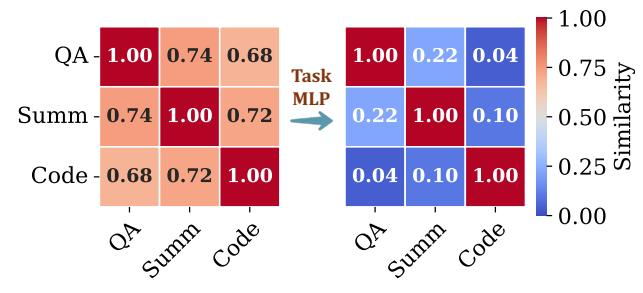
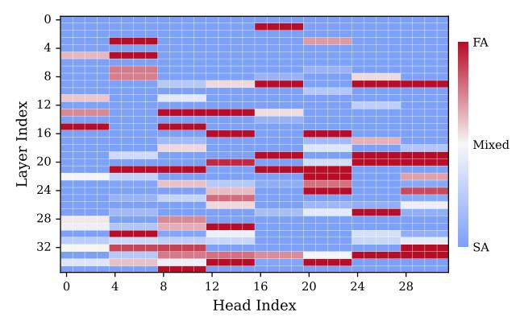
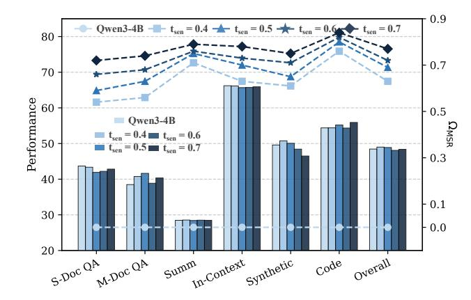
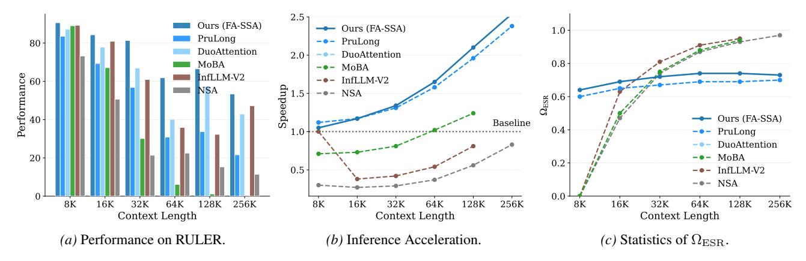

# 5. Ablation Study

In this section, we analyze the Elastic Attention preliminary on the Qwen3-4B and Llama3.1-8B-Instruct models. We investigate the design of its core component, i.e., the Attention Router module (§ [5.1\)](#page-6-0); study the impact of different target sparsity t (§ [5.2\)](#page-6-1); analyze our method's trade-off between performance and inference efficiency (§ [5.3\)](#page-7-0); and show the scalability of Elastic Attention (§ [5.4\)](#page-7-1).

4 InfLLM-V2 does not have a well-defined ΩMSR, as it employs FA when the context length is below 8K tokens and switches to a hybrid attention computation mode for longer contexts.

Figure 5. Visualization of task representation similarity. (Left) before Task MLP, the pooled hidden states exhibit high pairwise cosine similarity across different tasks; (Right) after passing through the Task MLP, the inter-task similarity significantly decreases.

Table 3. Comparison among different MLP hidden dimensions.

| Hidden Size                      | LongBench | RULER | LongBench-V2 | Avg.  |
|----------------------------------|-----------|-------|--------------|-------|
| $2 \times \mathbf{d}'$           | 48.07     | 60.67 | 26.92        | 45.22 |
| $4 \times \mathbf{d}'$ (default) | 48.08     | 61.81 | 27.88        | 45.92 |
| $6\times\mathbf{d}'$             | 48.07     | 62.08 | 26.20        | 45.45 |
| $8 \times \mathbf{d}'$           | 48.47     | 65.27 | 25.48        | 46.40 |

#### 5.1. Design of Attention Router

Effect of Task MLP We analyze the role of the Task MLP within the Attention Router. Specifically, we take the Task MLP from the first layer of the model and calculate the pairwise cosine similarity of task-specific hidden states  $(x_K)$  before and after they are processed by the Task MLP. Notably, a lower cosine similarity indicates greater separation between task representations, reflecting improved task discrimination. As shown in Figure 5, we compare representations across three tasks and observe that, after passing through the Task MLP, inter-task similarity is significantly reduced. This result indicates that the Task MLP effectively disentangles task-specific features and produces more discriminative representations for the subsequent routing decisions performed by the Router MLP. We provide more details and results of other models in Appendix H.1.

Impact of MLP Intermediate Hidden Size We study the impact of the intermediate hidden size in the Task- and the Router-MLP layers within the Attention Router. Specifically, we experiment with the intermediate dimension from  $\times 2 \sim \times 8$ , where  $\times 4$  corresponds to the default setting used in our main experiments. As shown in Table 3, all settings achieve very similar average performance across 3 benchmarks. Although the  $\times 8$  setting attains the highest overall score, we adopt the  $\times 4$  setting in our main experiments, as it provides a more favorable trade-off between performance gains and additional parameter overhead.

**Attention Mode Routing Analysis** The attention computation modes assigned by the Attention Router exhibit strong and consistent patterns at the head level. We observe that, in LLMs, certain heads primarily leverage FA com-

Figure 6. Overview of routing activation frequency of each head in Qwen3-4B. Red indicates heads that are consistently routed to FA (i.e., retrieval heads) across all 6 tasks in LongBench-E, while blue denotes heads that are consistently routed to SA.

Figure 7. Comparison of performance and test-time  $\Omega_{\rm MSR}$  among different training sparsity target t settings. The bar chart denotes the performance and the line chart denotes  $\Omega_{\rm MSR}$  in each task.

putation mode, while others are frequently assigned with SA. As shown in Figure 6, we analyze the distribution of attention computation modes for each head across the 6 LongBench-E sub-tasks. We find that a subset of heads, which are predominantly located in the middle to higher layers, are consistently activated in FA mode. This observation is consistent with prior findings in Wu et al. (2024), indicating that these heads function as retrieval heads. Partial heads that are highlighted in lighter colors exhibit switching behavior across tasks, and the remaining heads are consistently routed to SA. More results are shown in Appendix H.2.

### 5.2. Impact of Target Sparsity t Allocation

We study the impact of target sparsity t (Eq. 8) to model performance. Specifically, we fix the target sparsity of sparsity-robust tasks ( $t_{\rm rob}$ ) to 1, while progressively decreasing target sparsity for sparsity-sensitive tasks ( $t_{\rm sen}$ ) from 0.7 to 0.4. As shown in Figure 7, as  $t_{\rm sen}$  decreases, the resulting ( $\Omega_{\rm MSR}$ ) allocated by the model exhibits slightly greater task-level differentiation across different tasks. Yet,

Figure 8. Comparison of performance and inference speedup on the RULER benchmark across different methods. We adopt Llama-3.1-8B-Instruct as the backbone model and compare with training-based methods (FA-SSA), as well as other cutting-edge sparse attention methods. We report  $\Omega_{\rm ESR}$ , as it provides a fair comparison of the effective proportion of attended tokens across different approaches.

we can find that  $\Omega_{\rm MSR}$  does not strictly match the target t. This is because we adopt task-dependent and non-tight constraints, which do not force the model to exactly satisfy the prescribed sparsity. We provide full training curves with explanations in Appendix H.4. Besides, when  $t_{\rm sen}$  is set too low (e.g., 0.4), i.e., allocating a higher proportion of FA computation, the overall performance can even surpass that of the backbone. Yet, from an inference-efficiency perspective, we adopt  $t_{\rm sen}=0.7$  and  $t_{\rm rob}=1.0$  in our main experiments, which achieves a favorable balance between strong overall performance and high inference efficiency.

#### **5.3.** Overall Performance and Inference Efficiency

We compare different methods on RULER across multiple context-length regimes in terms of both task performance and inference efficiency. Implementation details are provided in Appendix D.2. As shown in Figure 8, our method consistently achieves the best performance among all compared approaches. In addition, its inference speedup increases with longer context lengths, as the model dynamically allocates higher  $\Omega_{MSR}$  for longer inputs. In contrast, several baselines are constrained by architectural designs. For example, NSA and InfLLM-V2 impose strict divisibility requirements on the number of KV attention heads (e.g., multiples of 16), which are not well aligned with Llama-3.1-8B. Moreover, MoBA and InfLLM-V2 must reserve part of the computation budget to pre-compute sequence-level features, leading to GPU out-of-memory failures at 256K context length. Finally, we analyze  $\Omega_{\rm ESR}$ , computed based on the actual number of attended tokens. We observe that, as sequence length increases, training-based hybrid models maintain an approximately constant  $\Omega_{ESR}$ , whereas our method achieves a consistently lower  $\Omega_{ESR}$  and slightly outperforms comparable baselines (e.g., PruLong), indicating superior scalability in effective sparsification. We show more details and comparison results in Appendix H.3.

*Table 4.* Results of implementing retrieval heads with XA.

| Method       | LongBench | RULER | LongBench-V2 | Avg.  |
|--------------|-----------|-------|--------------|-------|
| Qwen3-4B     | 48.45     | 66.00 | 25.96        | 46.80 |
| + XA-SSA     | 48.14     | 63.70 | 25.96        | 45.93 |
| Qwen3-8B     | 52.16     | 75.74 | 31.97        | 53.26 |
| + XA-SSA     | 49.25     | 66.31 | 32.69        | 49.42 |
| Llama-3.1-8B | 53.28     | 83.47 | 32.69        | 56.48 |
| + XA-SSA     | 50.71     | 70.27 | 29.09        | 50.02 |

#### 5.4. Scalability of Elastic Attention

We assess the scalability of Elastic Attention by implementing retrieval heads with XA, yielding the XA–SSA setting where the entire model operates under a full SA regime. As shown in Table 4, the XA–SSA setting can still preserve strong performance. For instance, for Qwen3-4B, the average performance gap across three long-context benchmarks even remains within 1 point. Although 8B-scale models exhibit performance degradation, this trade-off is accompanied by a substantial improvement in inference speed, owing to the fully sparse attention structure of the model.

