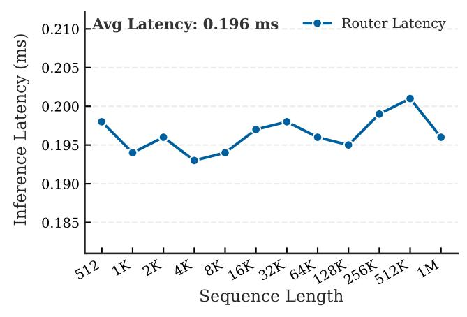
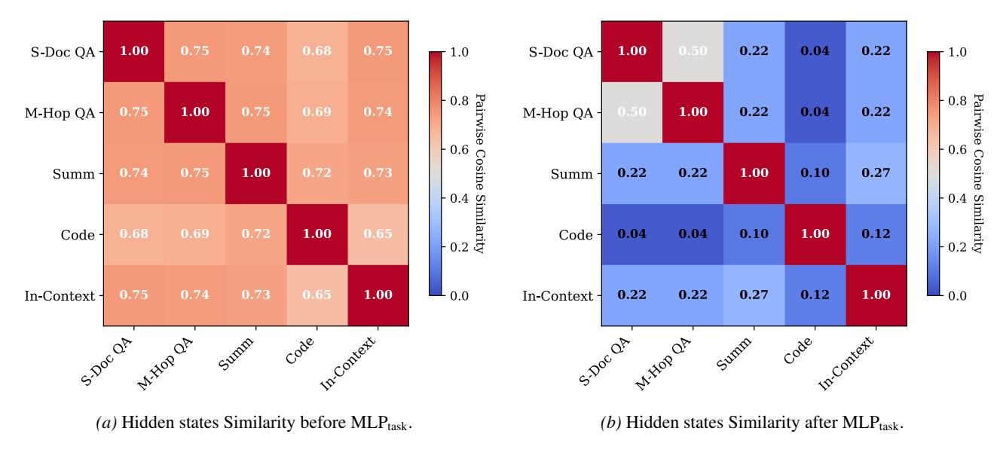
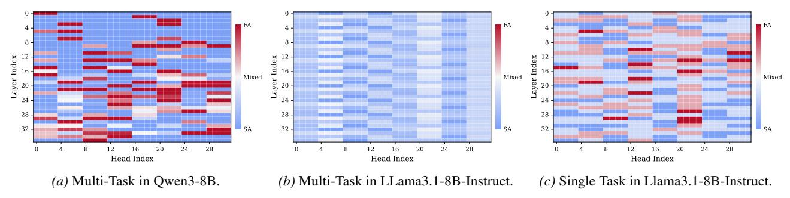
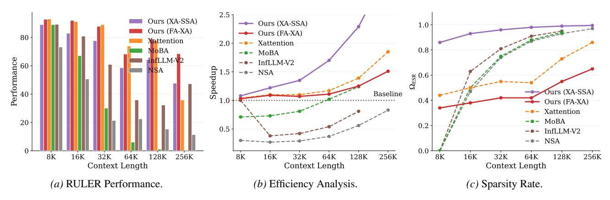
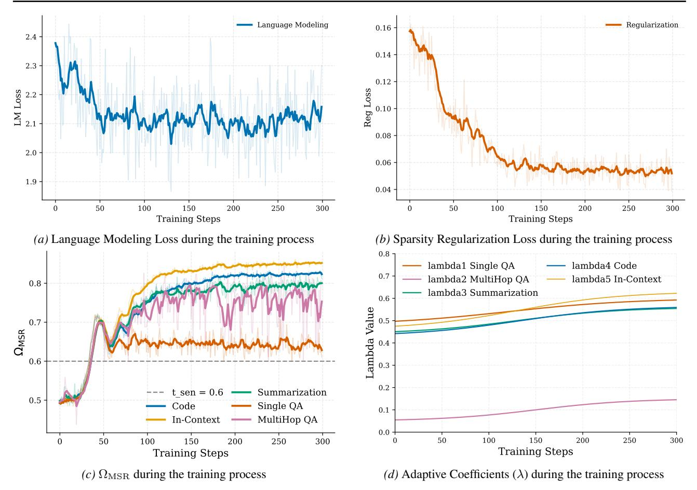
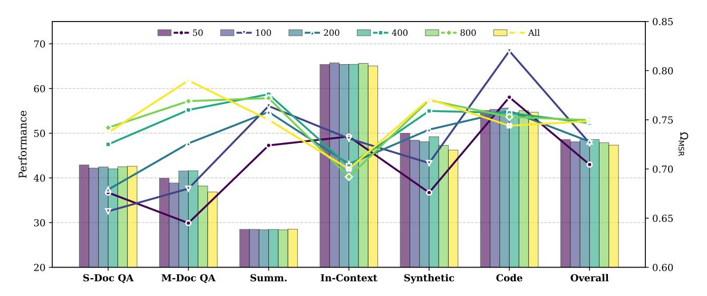

# G.1. Evaluation Results on LongBench

Table [7](#page-15-2) and Table [8](#page-17-1) provides the complete evaluation results on the LongBench-E. We report the performance metrics across all sub-tasks, categorized into 6 categories: Single-Document QA (S-Doc QA), Multi-Document QA (M-Doc QA), Summarization (Summ), In-context Learning (In-Context), Synthetic, and Code Tasks.

## G.2. Evaluation Results on LongBench-V2 and RULER

This subsection details the experimental settings and evaluation results for LongBench-V2 and the RULER benchmark. For RULER, as detailed in Table [9,](#page-17-2) our evaluation on the RULER benchmark covers a comprehensive range of context lengths, extending from 8K to 262K tokens. The comparative performance results are summarized in Table [10.](#page-18-1)

Table 8. Performance on LongBench-E. We report average performance (Perf.) and  $\Omega_{MSR}$  per task category. The 1st and the 2nd performance in each comparison group are highlighted with **bold font** and <u>underlined</u>, respectively. Note that  $\Omega_{MSR}$  is not calculated for XA-SSA as it does not employ retrieval heads.

| Method                       | S-De         | oc QA                 | M-D   | oc QA                 | Su       | ımm                   | In-C         | ontext                | Syn          | thetic                | C     | ode                   | A            | vg.                |
|------------------------------|--------------|-----------------------|-------|-----------------------|----------|-----------------------|--------------|-----------------------|--------------|-----------------------|-------|-----------------------|--------------|--------------------|
| Method                       | Perf.        | $\Omega_{\text{MSR}}$ | Perf. | $\Omega_{\text{MSR}}$ | Perf.    | $\Omega_{\text{MSR}}$ | Perf.        | $\Omega_{\text{MSR}}$ | Perf.        | $\Omega_{\text{MSR}}$ | Perf. | $\Omega_{\text{MSR}}$ | Perf.        | $\Omega_{\rm MSR}$ |
|                              |              |                       |       | Qv                    | ven3-4B  | backbone              | e model      |                       |              |                       |       |                       |              |                    |
| Qwen3-4B                     | 43.69        | -                     | 38.48 | -                     | 28.46    | -                     | 66.21        | -                     | 49.59        | -                     | 54.38 | -                     | 48.45        | -                  |
| + MoBA                       | 38.16        | -                     | 34.30 | -                     | 29.46    | -                     | 64.57        | -                     | 37.42        | -                     | 54.62 | -                     | 45.09        | -                  |
| + NSA                        | 39.13        | -                     | 34.81 | -                     | 27.38    | -                     | 63.44        | -                     | 23.80        | -                     | 58.10 | -                     | 43.02        | -                  |
| + XAttention                 | 41.58        | -                     | 38.85 | -                     | 28.76    | -                     | 65.45        | -                     | 39.01        | -                     | 54.52 | -                     | 46.44        | -                  |
| + Elastic Attention (FA-SSA) | 42.20        | 0.66                  | 38.86 | 0.68                  | 28.50    | 0.76                  | 65.73        | 0.73                  | 48.43        | 0.71                  | 54.34 | 0.82                  | 48.08        | 0.73               |
| + Elastic Attention (FA-XA)  | 44.40        | 0.68                  | 39.42 | 0.71                  | 28.49    | 0.82                  | 65.26        | 0.76                  | 44.35        | 0.74                  | 54.29 | 0.87                  | 47.59        | 0.76               |
| + Elastic Attention (XA-SSA) | 41.92        | -                     | 38.67 | -                     | 28.45    | -                     | 65.25        | -                     | 49.25        | -                     | 55.07 | -                     | 48.14        | -                  |
| Qwen3-8B backbone model      |              |                       |       |                       |          |                       |              |                       |              |                       |       |                       |              |                    |
| Qwen3-8B                     | 45.57        | -                     | 51.59 | -                     | 28.34    | -                     | 66.64        | -                     | 50.16        | -                     | 61.20 | -                     | 52.16        | -                  |
| + MoBA                       | 44.73        | -                     | 43.28 | -                     | 30.33    | -                     | 64.22        | -                     | 48.95        | -                     | 62.55 | -                     | 50.47        | -                  |
| + NSA                        | 40.63        | -                     | 37.45 | -                     | 27.97    | -                     | 67.14        | -                     | 29.00        | -                     | 62.19 | -                     | 46.12        | -                  |
| + XAttention                 | 43.48        | -                     | 48.99 | -                     | 28.39    | -                     | 66.26        | -                     | 42.86        | -                     | 60.62 | -                     | 50.13        | -                  |
| + Elastic Attention (FA-SSA) | 46.15        | 0.64                  | 46.54 | 0.65                  | 28.19    | 0.72                  | 67.52        | 0.71                  | 48.07        | 0.65                  | 62.95 | 0.78                  | 51.51        | 0.69               |
| + Elastic Attention (FA-XA)  | 44.01        | 0.75                  | 49.99 | 0.76                  | 28.30    | 0.83                  | 66.23        | 0.80                  | 50.95        | 0.77                  | 60.57 | 0.86                  | 51.66        | 0.80               |
| + Elastic Attention (XA-SSA) | 39.43        | -                     | 41.38 | -                     | 28.27    | -                     | 66.19        | -                     | 46.73        | -                     | 61.85 | -                     | 49.25        | -                  |
|                              |              |                       |       | Llama-3               | .1-8B-In | struct bac            | kbone n      | nodel                 |              |                       |       |                       |              |                    |
| Llama-3.1-8B-Instruct        | 48.75        | -                     | 51.85 | -                     | 30.26    | -                     | 68.16        | -                     | 56.00        | -                     | 55.81 | -                     | 53.28        | -                  |
| + MoBA                       | 46.63        | -                     | 43.91 | -                     | 30.72    | -                     | 66.78        | -                     | 36.00        | -                     | 64.48 | -                     | 49.69        | -                  |
| + NSA                        | 42.33        | -                     | 40.37 | -                     | 29.93    | -                     | 66.65        | -                     | 15.17        | -                     | 57.65 | -                     | 44.03        | -                  |
| + XAttention                 | 48.82        | -                     | 51.73 | -                     | 30.26    | -                     | 68.57        | -                     | 40.83        | -                     | 56.53 | -                     | 51.00        | -                  |
| + Elastic Attention (FA-SSA) | 49.92        | 0.64                  | 48.92 | 0.63                  | 30.17    | 0.73                  | 67.99        | 0.74                  | 54.00        | 0.64                  | 60.70 | 0.79                  | 53.35        | 0.69               |
| + Elastic Attention (FA-XA)  | <u>49.40</u> | 0.71                  | 52.94 | 0.69                  | 30.30    | 0.80                  | <u>68.55</u> | 0.79                  | <u>49.66</u> | 0.72                  | 56.49 | 0.87                  | <u>52.71</u> | 0.77               |
| + Elastic Attention (XA-SSA) | 48.30        | -                     | 46.40 | -                     | 30.27    | -                     | 67.83        | -                     | 41.37        | -                     | 60.81 | -                     | 50.71        | -                  |

Table 9. Detailed configuration for the RULER benchmark evaluation. We evaluate across exponentially increasing context windows up to 256k tokens.

| PARAMETER               | CONFIGURATION DETAILS                                                                                               |
|-------------------------|---------------------------------------------------------------------------------------------------------------------|
| <b>Context Windows</b>  | 8k, 16k, 32k, 64k, 128k, 256k                                                                                       |
| Sample Size             | 50 samples per task-length pair                                                                                     |
| <b>Evaluation Tasks</b> | Retrieval (NIAH): $single_{1-3}$ , $multikey_{1-3}$ , $multiquery$ , $multivalue$ QA & Extraction: $qa_{1,2}$ , fwe |

## H. Ablation Study

## H.1. Task-Discriminative Geometry of the Attention Router

To elucidate the operational logic of the Attention Router, we examine the geometric structure of the latent space learned by its internal projection layers. We hypothesize that, despite being optimized solely for the sparsity-performance trade-off without explicit task supervision, the router implicitly learns task-discriminative representations to facilitate optimal retrieval head allocation.

Formally, let  $x_K' \in \mathbb{R}^{H \times d'}$  denote the pooled hidden state of an input sequence. The MLPtask maps this context to a latent routing representation  $\mathcal{X}_K = \text{MLP}_{\text{task}}(x_K')$ . To quantify the distinctness of these representations while mitigating the representation anisotropy inherent in pre-trained models, we employ a Pairwise Conditional Rescaling strategy. This approach normalizes the local subspace spanned by a specific task pair (u,v) to measure their geometric relationship independent of global variances. We define the pairwise similarity metric  $M_{uv}$  as follows. Let  $\mathcal{X}_k$  be the set of latent representations corresponding to task k. We first construct the local support set  $\mathcal{S}_{uv} = \mathcal{X}_u \cup \mathcal{X}_v$  and compute the feature-wise standard deviation  $\sigma_{uv}$  within this subset:

$$\sigma_{uv} = \sqrt{\frac{1}{|\mathcal{S}_{uv}|} \sum_{\mathbf{x} \in \mathcal{S}_{uv}} (\mathbf{x} \odot \mathbf{x}) + \epsilon},$$
(15)

| M. J.L.                      |       |       |       | F        | RULER        |           |              |                    |       | Lor   | ngBench-v2 | 2                     |
|------------------------------|-------|-------|-------|----------|--------------|-----------|--------------|--------------------|-------|-------|------------|-----------------------|
| Models                       | 8K    | 16K   | 32K   | 64K      | 128K         | 256K      | Avg. Perf    | $\Omega_{\rm MSR}$ | Easy  | Hard  | Avg. Perf  | Avg. Ω MSR |
|                              |       |       |       | Qwei     | 13-4B ba     | ckbone n  | nodel        |                    |       |       |            |                       |
| Qwen3-4B                     | 87.49 | 86.82 | 60.05 | 70.98    | 53.19        | 43.27     | 66.00        | -                  | 32.67 | 22.18 | 25.96      | -                     |
| + MoBA                       | 81.74 | 71.85 | 40.74 | 42.88    | 12.78        | 8.67      | 44.35        | -                  | 22.00 | 26.32 | 24.76      |                       |
| + NSA                        | 86.82 | 76.94 | 44.18 | 57.62    | 25.96        | 9.18      | 45.29        | -                  | 26.00 | 25.56 | 25.72      |                       |
| + XAttention                 | 85.93 | 84.60 | 60.32 | 67.01    | 48.76        | 38.42     | 61.23        | -                  | 26.00 | 24.81 | 25.24      |                       |
| + Elastic Attention (FA-SSA) | 83.35 | 79.24 | 50.79 | 67.03    | 47.83        | 47.32     | 61.81        | 0.66               | 34.00 | 24.44 | 27.88      | 0.70                  |
| + Elastic Attention (FA-XA)  | 86.56 | 85.38 | 56.88 | 69.42    | 49.48        | 43.47     | 63.27        | 0.67               | 32.00 | 25.94 | 28.12      | 0.72                  |
| + Elastic Attention (XA-SSA) | 81.43 | 80.68 | 51.12 | 65.69    | 49.96        | 53.30     | 63.70        | -                  | 26.00 | 25.94 | 25.96      | -                     |
|                              |       |       |       | Qwei     | 13-8B ba     | ckbone n  | nodel        |                    |       |       |            |                       |
| Owen3-8B                     | 89.69 | 85.62 | 63.23 | 82.39    | 65.84        | 66.71     | 75.74        | -                  | 39.33 | 27.82 | 31.97      | _                     |
| + MoBA                       | 85.17 | 75.26 | 47.88 | 51.64    | 34.68        | 29.64     | 55.68        | -                  | 28.00 | 24.44 | 25.72      |                       |
| + NSA                        | 78.64 | 65.82 | 45.77 | 43.04    | 32.21        | 24.17     | 45.18        | -                  | 34.67 | 27.44 | 30.05      |                       |
| XAttention                   | 83.88 | 84.88 | 63.23 | 80.10    | 63.11        | 62.49     | 72.68        | -                  | 32.67 | 26.69 | 28.85      |                       |
| + Elastic Attention (FA-SSA) | 86.62 | 82.81 | 64.55 | 77.41    | 61.17        | 61.75     | 71.74        | 0.65               | 37.33 | 31.20 | 33.41      | 0.66                  |
| + Elastic Attention (FA-XA)  | 85.07 | 85.12 | 65.08 | 82.34    | 64.57        | 63.41     | 73.87        | 0.76               | 30.68 | 30.77 | 30.74      | 0.78                  |
| + Elastic Attention (XA-SSA) | 71.48 | 74.49 | 56.35 | 69.03    | <u>64.56</u> | 55.73     | 66.31        | -                  | 38.00 | 29.70 | 32.69      | -                     |
|                              |       |       | Lla   | ama-3.1- | 8B-Instr     | uct backl | bone model   |                    |       |       |            |                       |
| Llama-3.1-8B-Instruct        | 92.88 | 92.83 | 89.46 | 70.79    | 80.12        | 72.34     | 83.47        | -                  | 32.00 | 33.08 | 32.69      | -                     |
| + MoBA                       | 89.05 | 67.14 | 30.12 | 6.13     | 1.15         | 0         | 37.38        | -                  | 10.00 | 12.78 | 11.78      | -                     |
| + NSA                        | 73.27 | 50.68 | 21.39 | 22.52    | 15.30        | 11.42     | 30.58        | -                  | 21.33 | 25.19 | 23.80      |                       |
| + XAttention                 | 93.11 | 89.74 | 86.11 | 66.89    | <u>75.55</u> | 41.6      | <u>75.36</u> | -                  | 26.67 | 28.2  | 27.64      |                       |
| + Elastic Attention (FA-SSA) | 89.93 | 83.42 | 80.20 | 56.30    | 68.16        | 56.47     | 72.85        | 0.65               | 28.00 | 29.70 | 29.09      | 0.73                  |
| + Elastic Attention (FA-XA)  | 92.82 | 92.00 | 87.80 | 68.23    | 78.87        | 68.51     | 81.82        | 0.72               | 30.67 | 30.83 | 30.77      | 0.75                  |
| + Flactic Attention (XA-SSA) | 89.07 | 82 00 | 77.74 | 58 86    | 64.48        | 17.68     | 70.27        |                    | 30.67 | 28.20 | 29.09      | _                     |

Table 10. Additional results on RULER and LongBench-v2.

where  $\odot$  denotes the element-wise product, and the calculation assumes zero-centered activations. Using these statistics, we define a projection  $\phi_{uv}(\mathbf{x}) = \mathbf{x} \oslash \boldsymbol{\sigma}_{uv}$  (where  $\oslash$  denotes element-wise division). The metric  $M_{uv}$  is then calculated as the cosine similarity between the projected task centroids:

$$M_{uv} = \operatorname{CosSim}\left(\frac{1}{|\mathcal{X}_u|} \sum_{\mathbf{x} \in \mathcal{X}_u} \phi_{uv}(\mathbf{x}), \ \frac{1}{|\mathcal{X}_v|} \sum_{\mathbf{x} \in \mathcal{X}_v} \phi_{uv}(\mathbf{x})\right). \tag{16}$$

As illustrated in Figure 9b, the latent space exhibits distinct modularity. The observation that similarity scores approach zero  $(M_{uv} \approx 0)$  implies that MLPtask maps different problem types to orthogonal subspaces of the local manifold. This geometric orthogonality confirms that the router implicitly functions as a semantic discriminator, disentangling task representations into independent basis directions to apply specialized sparsity policies without requiring explicit task labels.

## H.2. Attention Mode Routing Analysis

Comparing the multi-task heatmaps reveals a fundamental divergence in attention mechanisms between model families. For Qwen3 (Fig. 11a), we observe **structural universality**: a specific subset of heads remains consistently active (dark red) or sparse (dark blue) across all tasks, suggesting a task-agnostic attention topology. In contrast, Llama3.1 exhibits **context-dependent sparsity**. While the multi-task aggregate (Fig. 11b) shows no universally active heads, the single-task breakdown (Fig. 11c) confirms that strong activations exist but shift dynamically depending on the input context. This indicates that Qwen3 relies on fixed retrieval heads, whereas Llama3.1-8B-Instruct adaptively reallocates attentional resources based on task requirements.

Figure 10. Router latency analysis. The router incurs negligible 19verhead (avg. 0.196 ms). Our design ensures length-invariant stability, maintaining constant speed from 512 to 1M tokens.

Figure 9. Pairwise cosine similarity of routing representations  $\mathbf{z_{task}}$ . The prevalence of near-zero scores ( $M_{uv} \approx 0$ ) indicates that the router maps distinct tasks to orthogonal subspaces on the local manifold. This confirms that the model implicitly disentangles task semantics into independent directions without supervision.

Figure 11. Extended Head Robustness Analysis. Similar to Figure 6, these heatmaps visualize the frequency of full-attention activation for each head. (a) and (b) show the multi-task global robustness for Qwen3-8B and Llama3.1-8B-Instruct, respectively, indicating how attention patterns generalize across tasks. (c) presents the robustness analysis for Llama3.1-8B-Instruct in a single-task setting. Darker blue indicates heads that are universally sparse, while darker red indicates heads that are universally active.

We observe that during training, the effective sparsity levels gradually diverge across different tasks. Despite sharing the same non-tight constraint t, task-dependent

differences emerge. This behavior is enabled by the Lagrangian constraint, which dynamically adjusts the weighting of task losses, allowing each task to tolerate different gaps between the achieved sparsity  $\Omega_{\rm MSR}$  and the target t.

#### H.3. Length Extrapolation and Sparsity Dynamics Analysis

We evaluate the length extrapolation capability on the RULER benchmark (8K-256K) using the Llama-3.1-8B-Instruct backbone. Figure 12 visualizes the interplay between performance, inference speedup, and  $\Omega_{ESR}$ . As the context length extends to 256K, baselines like MoBA and NSA suffer catastrophic degradation (near-zero accuracy). In contrast, our Elastic Attention (FA-XA) demonstrates superior robustness, maintaining a high score of 68.51. Even our highly efficient variant, Elastic Attention (XA-SSA), achieves a score of 47.68, significantly outperforming the standard Xattention baseline (35.82) while operating at a much higher sparsity.

Figure 12 (b) & (c) highlight a critical efficiency advantage. Baselines like NSA and InfLLM-V2 achieve high sparsity (> 0.95) but suffer from limited or regressed speedups (<  $1.0\times$ ) due to heavy dynamic selection overheads or kernel constraints. Conversely, our XA-SSA configuration achieves an extreme sparsity of  $\sim 0.995$  while delivering a massive

Figure 12. Analysis of length extrapolation capability and sparsity dynamics on the RULER benchmark (8K-256K). We adopt Llama-3.1-8B-Instruct as the backbone model to compare our Elastic Attention variants (FA-XA and XA-SSA) with including MoBA and NSA. (a) reports the RULER performance scores; (b) and (c) illustrate the trade-off between inference speedup and ( $\Omega_{\rm ESR}$ ), highlighting the superior Pareto frontier established by our method.

 $3.28 \times$  speedup, verifying the minimal overhead of our router. Meanwhile, Elastic Attention (FA-XA) strikes a balanced trade-off, securing  $1.51 \times$  acceleration while retaining essential information.

In summary, Elastic Attention establishes a superior Pareto frontier. Elastic Attention (FA-XA) prioritizes information retention ( $\Omega_{ESR} \approx 0.65$ ) to effectively mitigate "context collapse", while Elastic Attention (XA-SSA) maximizes throughput through adaptive extreme sparsity. Both configurations consistently outperform comparison methods in their respective regimes of accuracy and efficiency.

#### H.4. Loss Curve and Monitoring metrics

To validate the training stability and the dynamic routing capabilities of our proposed **Elastic Attention**, we visualize the detailed training dynamics in Figure 13. This visualization decomposes the optimization process into four key perspectives: the primary language modeling loss, the sparsity regularization loss, the evolution of the routed sparsity metric ( $\Omega_{MSR}$ ), and the adaptive coefficients ( $\lambda$ ).

**Optimization Stability.** As illustrated in Figure 13a and Figure 13b, the joint optimization of the language modeling objective and the Attention Router parameters is stable. The LM loss decreases rapidly and stabilizes around 2.1, confirming that the integration of the lightweight Attention Router and the injection of sparsity do not hinder the backbone model's convergence. Concurrently, the sparsity regularization loss drops significantly within the first 100 steps (from  $\sim$ 0.16 to  $\sim$ 0.06), indicating that the continuous relaxation scheme (Gumbel-Softmax) effectively guides the router to satisfy the prescribed sparsity constraints.

**Differentiation in Elastic Attention Allocation** ( $\Omega_{MSR}$ ). Figure 13c provides empirical evidence for the motivation described in Section 1: downstream tasks naturally exhibit different sensitivity to attention sparsity.

- Task-Dependent Routing: Starting from a neutral initialization, the Attention Router automatically learns to differentiate between tasks. Consistent with our hypothesis, sparsity-sensitive tasks (such as Code and In-Context learning) converge to higher  $\Omega_{\rm MSR}$  values (approx. 0.80–0.85), indicating a higher allocation of Full Attention (FA) computation to preserve performance.
- Sparsity-Robust Efficiency: Conversely, sparsity-robust tasks like Q&A task plateau at lower values, closer to the target threshold (dashed line, representing  $t_{\rm sen}$ ). This confirms that Elastic Attention successfully identifies tasks that can tolerate higher sparsity levels, thereby improving inference throughput without unnecessary computation.

**Adaptive Coefficients** ( $\lambda$ ). Finally, Figure 13d plots the evolution of the Lagrangian multipliers ( $\lambda$ ), which dynamically scale the penalty for violating sparsity targets. We observe that  $\lambda_5$  (In-Context) increases most aggressively, suggesting that the model prioritizes fulfilling the density requirements for this sensitive task. This adaptive mechanism ensures that

Figure 13. Decomposition of Training Objectives for Elastic Attention. We visualize the training dynamics of the Attention Router, separating the total loss into (a) the primary language modeling objective and (b) the sparsity regularization term. Subfigures (c) and (d) illustrate the task-level differentiation in sparsity allocation ( $\Omega_{MSR}$ ) and adaptive coefficients ( $\lambda$ ), demonstrating how the model automatically distinguishes between sparsity-robust and sparsity-sensitive tasks.

the trade-off between computational cost and model quality is balanced automatically, removing the need for the manual task-specific tuning.

### H.5. Impact of Input Truncation on Task Identification

To optimize the trade-off between routing efficiency and accuracy, we investigate the sensitivity of the Attention Router to the input sequence length. Specifically, we analyze how varying the truncation budget influences the router's ability to distinguish between task types and allocate appropriate sparsity patterns. Figure 14 illustrates the performance and sparsity trends across six downstream tasks as the truncation budget varies from 50 tokens (pooling boundaries) to the full sequence.

**The Boundary-Pooling Hypothesis.** Our default strategy employs a boundary-pooling mechanism that aggregates only the first and last 100 tokens. This design is predicated on the observation that task-specific instructions (System Prompts) typically reside at the beginning of the context, while specific user queries appear at the end. The intermediate content often consists of long context (e.g., documents to be summarized) which, while necessary for the *generation* phase, acts as noise for the *routing* phase.

Analysis of Signal-to-Noise Ratio. As shown in Figure 14, we observe that performance generally saturates around a truncation length of 100-200 tokens. Notably, incorporating the full sequence does not lead to performance improvements and, in some cases (e.g., Multi-Document QA), results in suboptimal routing decisions. We attribute this to a dilution of the task identification signal: as the router processes more tokens from the document body, the distinct semantic signatures of

Figure 14. Impact of router input truncation length on downstream performance and  $\Omega_{MSR}$ . We compare varying truncation budgets  $(L \in \{50, \dots, 800, All\})$  applied to the concatenation of the sequence's prefix and suffix. Results indicate that increasing the input length beyond 100 tokens yields negligible performance gains and may degrade router selectivity due to a lower signal-to-noise ratio.

the instructions become obscured by the high variance of the content. Consequently, the router struggles to classify the task type accurately, leading to a convergence in sparsity patterns (as seen in the flattened sparsity lines for longer lengths) without a corresponding gain in generation quality. These findings validate our selection of a 100-token boundary window as a robust configuration that captures essential task descriptors while filtering out content-induced noise.

