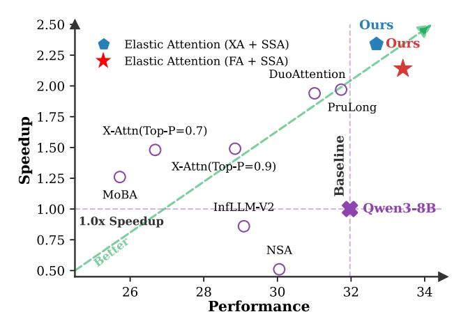

# 1. Introduction

Large language models (LLMs) have demonstrated remarkable capabilities in processing long-context sequences [\(Liu](#page-9-0) [et al.,](#page-9-0) [2025a;](#page-9-0)[b;](#page-9-1) [Mei et al.,](#page-9-2) [2025\)](#page-9-2). However, the quadratic computational and memory complexity of standard full attention (FA) mechanisms [\(Vaswani et al.,](#page-9-3) [2017\)](#page-9-3) poses a significant scalability bottleneck as the context window continues to expand. Sparse attention (SA) mechanisms [\(Child,](#page-8-0) [2019;](#page-8-0) [Zaheer et al.,](#page-10-0) [2020\)](#page-10-0) represent an effective strategy for mitigating this limitation by selectively attending to a subset of critical tokens, thereby substantially reducing computational overhead and improving inference throughput.

To balance the trade-off between reduced computational cost and preserved model quality, i.e., achieving performance

*Preprint. On progress work.*

*Figure 1.* Comparison between Elastic Attention (ours) and existing approaches on LongBench-V2 [\(Bai et al.,](#page-8-1) [2025\)](#page-8-1). "(XA+SSA)" and "(FA+SSA)" denote our different settings.

comparable to FA, existing methods typically adopt hybrid modeling strategies that integrate both SA and FA within a single model [\(Zhang et al.,](#page-10-1) [2025a;](#page-10-1) [Xiao et al.,](#page-10-2) [2025\)](#page-10-2). Yet, downstream task performance is susceptible to the proportion between those two attention computation modes (see our preliminary study in § [2.2\)](#page-2-0), and identifying an appropriate proportion typically requires extensive task-specific validation or tuning, which severely limits robustness and general applicability [\(Peng et al.,](#page-9-4) [2025a\)](#page-9-4).

In this work, we show that downstream tasks naturally fall into two categories: (1) sparsity-robust tasks (e.g., summarization), whose performance remains stable across a wide range of sparsity levels, and (2) sparsity-sensitive tasks (e.g., question answering), which suffer substantial degradation beyond a certain sparsity threshold. Such an observation suggests that a model should only differentiate between these two task regimes and allocate the appropriate sparsity, instead of painstakingly learning distinct sparsity configurations for each task. Going beyond this, we propose *Elastic Attention*, which enables the model to automatically adjust its overall sparsity during the prefill stage to accommodate the two aforementioned task categories. The core of our approach is a lightweight *Attention Router* module integrated into existing transformer architectures.

Specifically, the Attention Router operates analogously to

1 Soochow University, China 2[LCM Laboratory](https://github.com/LCM-Lab) 3Baidu Inc, China. Correspondence to: Juntao Li <ljt@suda.edu.cn>.

Mixture-of-Experts [\(Shazeer et al.,](#page-9-5) [2017\)](#page-9-5): it uses the input hidden states to perform head-wise routing, dynamically assigning each attention head to either FA or SA computation mode, thereby enabling dynamic adjustment of the model's overall sparsity. Notably, the Attention Router introduces negligible overhead, adding only 0.27M parameters per layer (assuming a head dimension of 128), which preserves both inference efficiency and computational cost. To optimize the Attention Router, we adopt a continuous relaxation scheme based on the Gumbel-Softmax [\(Jang et al.,](#page-8-2) [2016\)](#page-8-2) strategy, which alleviates the training–inference discrepancy arising from discrete routing decisions. Furthermore, to stabilize optimization, we employ a straight-through estimator (STE) [\(Bengio et al.,](#page-8-3) [2013\)](#page-8-3) trick for gradient propagation. During inference, different attention heads within the same layer may be routed to different computation modes. We design a fused kernel that enables all routed heads to be processed simultaneously in a single forward pass.

We evaluate our method on 3 widely-used and cutting-edge LLMs (Qwen3-series [\(Yang et al.,](#page-10-3) [2025\)](#page-10-3) and Llama-3.1-8B-Instruct [\(Grattafiori et al.,](#page-8-4) [2024\)](#page-8-4) models), considering both streaming [\(Xiao et al.,](#page-9-6) [2024b\)](#page-9-6) and block-sparse [\(Guo et al.,](#page-8-5) [2024\)](#page-8-5) SA patterns. Across a diverse set of long-context benchmarks (real-world, synthetic retrieval, and long-form reasoning tasks), our method not only learns to allocate different sparsity levels to different tasks but also yields superior performance compared to baselines. Notably, this gain is achieved under limited training budgets, requiring only 12 hours of training on 8×A800 GPUs without modifying the backbone model's parameters. Furthermore, we conduct an in-depth analysis of the Attention Router, studying the impact of its architectural design and parameter capacity, as well as providing detailed training monitoring metrics.

