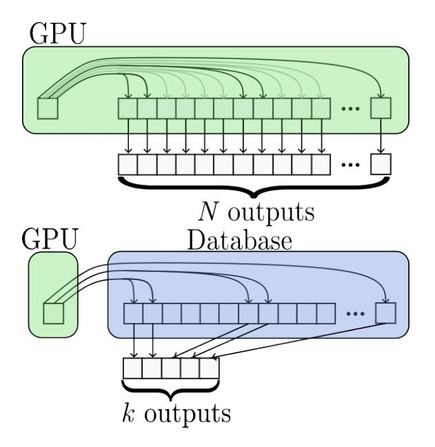

## Exploiting Sparsity for Long Context Inference: Million Token Contexts on Commodity GPUs

Ryan Synk \* 1 Monte Hoover \* 1 John Kirchenbauer 1 Neel Jain 1 Alex Stein 1 Manli Shu 2 Josue Melendez Sanchez 1 Ramani Duraiswami 1 Tom Goldstein 1

## Abstract

There is growing demand for performing inference with hundreds of thousands of input tokens on trained transformer models. Inference at this extreme scale demands significant computational resources, hindering the application of transformers at long contexts on commodity (i.e not data center scale) hardware. To address the inference time costs associated with running self-attention based transformer language models on long contexts and enable their adoption on widely available hardware, we propose a tunable mechanism that reduces the cost of the forward pass by attending to only the most relevant tokens at every generation step using a top-k selection mechanism. We showcase the efficiency gains afforded by our method by performing inference on context windows up to 1M tokens using approximately 16GB of GPU RAM. Our experiments reveal that models are capable of handling the sparsity induced by the reduced number of keys and values. By attending to less than 2% of input tokens, we achieve over 95% of model performance on common benchmarks (RULER, AlpacaEval, and Open LLM Leaderboard). The code is available at [https://github.com/ryansynk/topk-decoding.](https://github.com/ryansynk/topk-decoding)

## 1. Introduction

Long context inference is the process by which models analyze large document collections or follow long and detailed instructions. The *context* is a series of tokens, like a set of documents or a set of files in a codebase. Increasingly, models are trained to handle larger and larger context lengths, with new models training on contexts in the millions [\(Liu](#page-9-0) [et al.,](#page-9-0) [2024b\)](#page-9-0).

Figure 1: (top) Typical attention requires each query vector to compute an inner product with each key vector in the context window. In practice, most key vectors produce insignificant attention scores, and therefore contribute very little to subsequent hidden states, so much of this computation is wasted. (left-bottom) top-k attention retrieves only the keys that contribute significantly to the attention computation, leaving the gray arrows out and achieving sublinear runtime.

Inference is done using a trained model and is divided into two steps: *prefill* and *decoding*. In the prefill stage, tokens pass forward through the model, and their key and value activations from the attention mechanism of each layer are stored in a list. This list is called the *KV cache* [\(Pope et al.,](#page-9-1) [2023\)](#page-9-1). In the decoding stage, the model uses the KV cache to generate new tokens one at a time. In a standard attention mechanism, each new token attends to every cached token in the context. When the context length is very large, both the prefill and decoding stages can become prohibitively expensive.

\*Equal contribution 1University of Maryland, College Park Salesforce Research. Correspondence to: Monte Hoover <mhoover4@umd.edu>, Ryan Synk <ryansynk@umd.edu>.

The prefill stage incurs an  $O(N^2)$  compute and memory cost due to the large attention matrix formed in the computation (where N is the number of tokens in the context). To mitigate this, brute-force methods such as Ring Attention (Liu et al., 2023) were developed. This approach uses round-robin communication between servers to scale computation linearly in the number of GPUs. Despite its apparent effectiveness, while the prefill stage occurs only once, because the decoding stage occurs many hundreds of times for a single user request, the algorithm limited in its practicality outside of the data-center.

Every step during the decoding stage incurs an O(N) compute and memory cost, as each new token must attend over all previous tokens in the cached context. As context lengths grow, the KV cache can become prohibitively large. If each of the N tokens in the context is embedded into a vector of size D (the *hidden dimension*) then the number of floating point numbers in the cache is 2NDL, where L is the number of network layers. For a value of D=4096 and L=32 as in the Llama-3 8B architecture (Grattafiori et al., 2024), at N=100,000 the memory required for the cache alone is 52GB, assuming 16 bit floating point format (Zhang et al., 2024). At this context length the cache is unable to fit on most commodity GPUs.

One approach to save memory during decoding is to offload the KV cache to CPU memory (Sheng et al., 2023). However, the additional data movement required to implement this strategy is itself prohibitive. In the above example, just a single layer's worth of KV cache data is 1.6GB and this payload must be schlepped back and forth hundreds or thousands of times during a single generation. Attacking the problem from a different angle, cache eviction methods try to maintain a fixed cache size on the GPU by selectively removing token vectors deemed irrelevant (Zhang et al., 2023), but because it can be difficult to tell which vectors will be needed in the future, these strategies ultimately hurt performance.

In contrast to the compute and communication intensive solutions discussed thus far, we base our proposal on a simple fact:

