# Modern LLMs only need to pay attention to a handful of tokens at a time.

We exploit this observation to perform fast long context decoding with very little GPU memory. We build an implementation of attention in which keys and values are stored in a vector database in CPU memory. When attention is computed using a query vector at decoding time, we retrieve only the k keys with the highest attention scores. This can be done in sublinear time using an approximate k-nearest neighbor search over the cache database, enabling long context inference using plentiful and cheap CPU memory, and without the heavy computational overhead required for full

<span id="page-1-0"></span>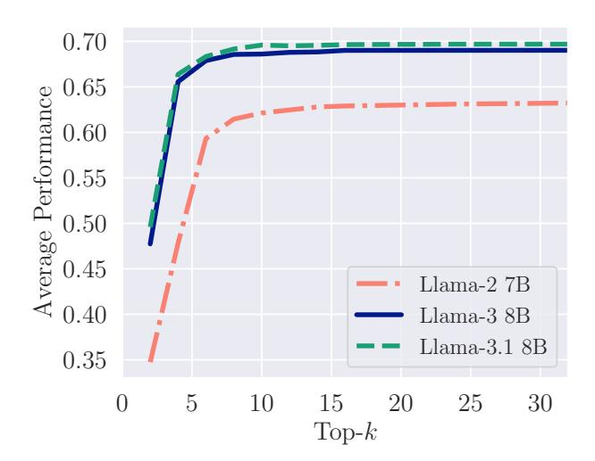

Figure 2: Performance on selected OpenLLM Leaderboard tasks using only the top-k keys for each attention computation. Typical questions have a context length of  $\sim 1000,$  yet only 10 keys are needed to achieve the same performance as full attention. We evaluate an extended set of models in Figure 6.

attention. Due to the fact that the constraint on the number of relevant keys constrains the CPU-GPU transfer volume, our approach incurs minimal data movement costs compared to other KV cache offloading methods since only a fraction of the token representations ever need to be transported between GPU and CPU memory.

To build a deeper understanding of why our approach works, through an array of controlled experiments we interrogate the core "top-k" assumption on which we base our method; that attention in modern LLMs is an inherently sparse operation. While methods exploring the restriction of the attention mechanism to the top-k scores have been studied extensively (Gupta et al., 2021; Liu et al., 2024a; Zhang et al., 2024), prior work does not specifically endeavor to solve resource constrained long-context decoding using scalable tools like approximate nearest neighbor search, nor do they demonstrate million token context inference on single, commodity GPUs.

Our primary contributions are summarized as follows:

- We propose a simple method for sublinear long context generation using top-k attention over preprocessed states in a vector database.
- We show that this technique achieves high fidelity on common benchmarks and long-context tasks (Figure 2).
- We provide an empirical analysis on why top-k attention works and demonstrate its effectiveness at the million token scale.
- We demonstrate the flexibility of our method by varying the top-k budget on a per-layer basis.

<span id="page-2-0"></span>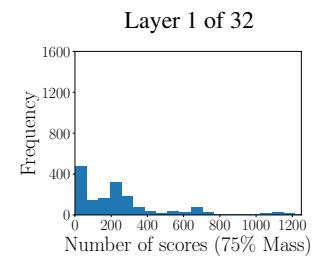

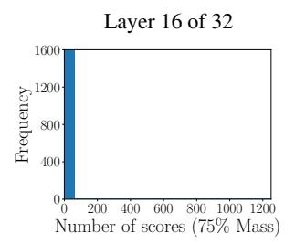

Figure 3: We analyze the number of attention scores that correspond to 75% of the probability mass for generating the next token. Each point is the number of scores of the last 'row' from the attention matrix required to reach 75% of the total attention. We observe each of the 32 heads across 50 samples. On the **left**, we plot the histogram for the first layer in the network, and on the **right** we plot it for layer 16.

#### 2. Motivation

The core assumption underpinning our proposal is the fact that modern language models naturally exhibit sparse attention patterns in which a very small number of tokens make up the vast majority of attention mass. We begin by verifying that this is in fact true for popular models in simple settings.

Observing attention sparsity in the wild. In Figure 3, we analyze 50 4000-token text samples consisting of concatenated Wikipedia article snippets. We encode these samples using a forward pass through Llama-3-8B, and visualize the resulting attention scores. For the last token in each context window, we tabulate the number of keys in the context that are needed to collect 75% of the attention mass. Only a small number of the 4000 tokens are needed to collect this mass, especially for deeper layers of the networks.

Next, we take these multi-article samples and prompt the model to copy one of the articles that relates to a specific topic. Figure 4 demonstrates that in expectation the attention scores (across all heads and layers) are higher for the tokens contained within the correct document.

Having confirmed that attention scores are indeed concentrated in terms of both how many tokens are relevant, and which tokens are highlighted in an input sequence, we zoom out and probe for structure in the attention scores in aggregate by quantifying their overall entropy. In Figure 5 we visualize the entropy of the last-token attention scores in a sequence as a function of layer depth. We observe that the entropy is low in all layers and decreases significantly after the first layer. Further analysis of attention sparsity across task categories and intuition on the connection between sparsity and entropy is provided in Appendix A.1.

<span id="page-2-1"></span>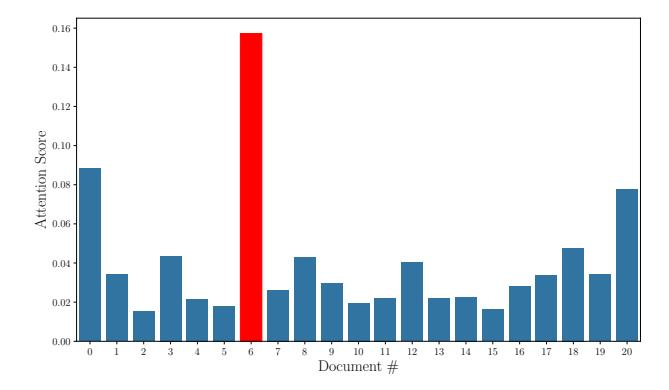

Figure 4: Average attention score per token in a given Wikipedia article for a multi-article long context sample (across all heads and layers). The bar for the article prompted to be copied is highlighted in red. Note how the model focuses its attention on the correct document.

Is it safe to exploit attention sparsity? The observations made in this series of small scale experiments together suggest that only a few key-value pairs should be needed for the model to perform close to its full capabilities. To demonstrate that the observed sparsity can actually be leveraged without compromising performance, we perform a more realistic test.

We evaluate models from the Llama family on small selection of knowledge-intensive benchmark tasks while constraining the attention computation for each query to only use the top-k key-value pairs with the highest attention score (see Section 3.2 for algorithmic details). In these experiments, we use the same number of keys for each layer of the network and average the model performance over all tasks on the OpenLLM leaderboard (see Section 4.1 for task description). In Figure 2 we see that all three models saturate in performance by the 15th key, and the most recent (and most overtrained) variants of the model require only the 10 top keys to achieve the same performance as full-scale attentions. While Figure 3 indicates that there is some spreading of the attention mass for layer 1 of the network, this tail mass seems to be unnecessary for good performance on benchmarks.

Taken as a whole, these simple but motivating experiments evidence the basic sparsity assumptions on which our method is based. Empirically, we find that the attention scores are a native, reliable indicator as to which key-value pairs are most critical during any given inference step, and that very few keys are actually needed to perform accurate inference.

In the next section we introduce the technical details of our approach for using a vector database to retrieve the top-k most influential tokens, thereby disconnecting attention's se-

<span id="page-3-0"></span>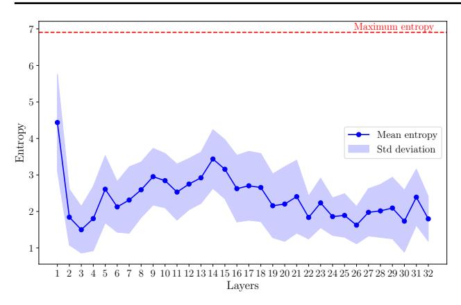

Figure 5: Entropy of the distribution of attention scores for each layer of a model, calculated as  $E = -\sum_{i=1}^{N} a_i \log(a_i)$ , where  $(a_1, \ldots, a_N)$  is the attention score distribution. Attention score distributions are derived from last token of 50 1000-token samples and aggregated over all heads for a given layer. Entropy serves as a measure of how concentrated the attention scores are for a given query token: low entropy indicates a large amount of attention centered over few tokens, and high entropy indicates a more uniform dispersion of attention scores. Maximum entropy occurs when the distribution is perfectly uniform, and for 1000-token contexts is  $-\log(\frac{1}{1000})$ .

lection operations from the rest of the feed-forward computation. This critical separation enables the GPU to perform smaller matrix operations that fit into its limited memory whilst the full cached keys and values live in CPU memory and are searched using CPU compute. In the main experiments that follow, we showcase how our method alleviates both the computational and memory barriers that normally bottleneck long-context inference and unlocks million token contexts for small GPUs.

#### 3. Methodology

In the following sections we elaborate on our method for reducing memory costs during inference time using top-k attention. Along the way, we more concretely define some minimal notation and terminology required to describe inference operations in transformer language models.

#### 3.1. Inference With KV Caches

As stated previously, causal inference using trained transformer models is split into two steps: the prefill and decode stages. Assume we are given a—potentially very large—set of tokens  $\boldsymbol{x}$  of size N that we would like to make many queries over.

The query, key and value embeddings during prefill are of size  $(N \times D)$ , so this stage of inference incurs a maximum

activation memory cost of  $O(N^2)$  due to the size of the attention matrix. Memory saving attention methods like (Dao et al., 2022) can in practice reduce this to an O(N) memory cost by tiling the attention computation. As the cache is being filled, it also grows in size and persistently costs O(N) memory across the duration of the computation.

In the decoding stage, we have a smaller query we would like to make over this context, as well as a pre-filled KV cache. Our queries comes in one token at a time, with decoding in a self-attention layer performed as follows:

$$\operatorname{Attention}(q, K, V) = \operatorname{Softmax}\left(\frac{qK^T}{\sqrt{D}}\right)V \qquad (1)$$

Here  $q \in \mathbb{R}^{1 \times D}$  is the new query vector,  $K, V \in \mathbb{R}^{N \times D}$  are the KV cache for that layer, and D is the hidden dimension. We refer to  $S = qK^T \in \mathbb{R}^{1 \times N}$  as the *score* matrix, and the quantity Softmax  $\left(\frac{S}{\sqrt{D}}\right)$  as the *attention* matrix.

When the incoming query q is multiplied by all previous keys in the cache during decoding, the memory and compute cost incurred for the score matrix at this step is O(N). This dependence on N for the cost of GPU memory during inference can become prohibitive for large context lengths.

#### <span id="page-3-1"></span>3.2. Top-k Attention: Accelerating Decoding

We cut down on the growing memory and compute costs by dynamically considering only the most relevant keys in the KV cache. To do this we perform a k-nearest neighbor search over the key vectors with the new query vector, returning only those value vectors corresponding to the k-largest score values.

The core of our implementation is in Algorithm 1. We assume we are given a prefilled KV cache that is on the CPU. This cache is a sequence  $\{K_\ell, V_\ell\}_{\ell=1}^L$  of key and value activation tensors, one for each layer.

First we convert the key tensors across all layers in the KV cache into a nearest-neighbor search index. This index data structure can be as simple as a list (for exact nearest neighbors) or as sophisticated as a graph-based structure (for approximate nearest neighbors) as in (Malkov & Yashunin, 2020). For multi-head attention, we construct a separate index for each key head at every layer. For each layer we store the indices in a list called K\_index.

We embed each new token during decoding into q,k, and v on the GPU. We offload q to the CPU and perform a nearest neighbor search to get the top-k score values of the query over the context:

$$vals, I = knn\_search(q, K\_index[\ell], k)$$

Here k is the number of the largest score values we'd like

use. The operation knn\_search performs a k-nearest neighbor search of q over the key vector index for layer  $\ell$ , K\_index[ $\ell$ ]. Here the k-nearest neighbor search distance is measured using the dot product metric, mirroring the attention score mechanism. This search returns two items: vals, a vector of size k containing the top-k score values, and I, a list of k integers mapping the score values in vals to their corresponding key vectors. Let  $I = (i_1, \ldots i_k)$ . We collect the relevant keys selected by the nearest neighbor search by concatenating them as row vectors together, denoted as  $V_{\ell}[I]$ :

$$V_{\ell}[I] = \begin{pmatrix} - & V_{\ell}[i_1] & - \\ - & V_{\ell}[i_2] & - \\ & \vdots \\ - & V_{\ell}[i_k] & - \end{pmatrix} \in \mathbb{R}^{k \times D}$$

After the model generates the first token using the context, the key and value embeddings of this token are left on the GPU directly. This splits the total KV cache into two parts: a large part on the CPU constructed from the given context, and a small part on the GPU constructed from previously generated tokens. Given a new query, the knearest neighbor search is only performed on the CPU cache; on the GPU, we compute the attention directly between this query and the keys from previous generated tokens. This process resembles windowed attention (Beltagy et al., 2020a), where a window of recently generated tokens are stored directly on the GPU. These GPU window caches are labeled K\_qen and V\_qen in Algorithm 1.

The  $V_\ell[I]$  and vals are then moved to the GPU. Using these, we perform the final attention computation, combining both the weighted values from the context as well as the value vectors from previously generated tokens. This method gives us a peak GPU memory cost of O(k) GPU memory cost, as opposed to O(N). We find that k can be chosen to be a small fraction (around 1% for most tasks) of N while still recovering near-equivalent performance.

#### 3.3. Prefilling a KV Cache at the Million Token Scale

The prefill forward pass in the construction of a KV cache potentially requires incurring the full  $O(N^2)$  memory cost. However, there are multiple ways one could prefill a cache.

Given (relatively brief) access to large amounts of compute, one could parallelize over many GPUs and construct the cache using algorithms like Ring Attention (Liu et al., 2023). The larger up-front cost of the cache construction would then be amortized over the many queries that would be made over it on much cheaper hardware. Additionally, the attention could be approximated in the construction of the cache. Algorithms like windowed attention would allow for the construction of large caches with more modest compute as in (Child et al., 2019). For small enough N

## <span id="page-4-0"></span>Algorithm 1 Top-k KV Cache Decoding

```
Require: KV-Cache \{K_{\ell}, V_{\ell}\}_{\ell=1}^{L} where K_{\ell}, V_{\ell} \in \mathbb{R}^{N \times D}, token x \in \mathbb{R}^{1 \times D}, k \in \mathbb{N}
  1: N_{gen}=1, K_gen = [], V_gen = []
  2: K_{index} = []
  3: for \ell \in \{1, ..., L\} do
          K_{index}[\ell] \leftarrow build_{index}(K_{\ell})
  5: end for
  6: while N_{qen} < N_{max} do
  7:
          for \ell \in \{1, \ldots, L\} do
  8:
              Pre-attention transformer layer computations...
  9:
              q = xW_{Q_{\ell}}, k = xW_{K_{\ell}}, v = xW_{V_{\ell}}
10:
              K_{gen}[\ell] \leftarrow concat(K_{gen}[\ell], k)
              V_{gen}[\ell] \leftarrow concat(V_{gen}[\ell], k)
11:
12:
              vals, I \leftarrow \text{knn\_search}(q, \text{K\_index}[\ell], \text{k})
              Move V_{\ell}[I], vals to GPU
13:
              \hat{x} \leftarrow \text{Softmax}(\frac{1}{\sqrt{D}}\text{vals})V_{\ell}[I]
14:
              \hat{x} \leftarrow \hat{x} + \operatorname{Softmax}\left(\frac{1}{\sqrt{D}}q \cdot \operatorname{K-gen}[\ell]^T\right)
15:
              Post-attention transformer layer computations...
16:
17:
          x \leftarrow \texttt{sample\_new\_token}(\hat{x})
18:
          N_{gen} \leftarrow N_{gen} + 1
19:
```

(100's of thousands of tokens), and with a high-memory GPU, the vLLM library can quickly construct KV caches by performing a standard forward pass on the model using the paged attention algorithm (Kwon et al., 2023). Finally, for very large N, top-k attention could be employed at cache construction time as well.

For our largest experiments, we utilize Flash Attention and an H100 GPU to prefill the caches  $N=1\mathrm{M}$  tokens of context. This allows us to generate exact prefilled KV caches with only small modifications to the network to accommodate the extreme memory requirements. The exact changes we made in order to prefill caches can be found in the Appendix and we employ a chunking strategy similar to (Gupta et al., 2021). We note that our experiments mimic an important use case of our method, namely a user with a large amount of documents that has access to only a limited amount of compute. In this case, the user can rent the required compute on the cloud for prefill once, then make as many queries as they want quickly with our method on their own hardware.

#### 4. Evaluating Top-k Attention at Scale

We evaluate top-k to highlight the relationship between different values of k and performance. We find that models of various sizes and generations perform well even at small k. In general, we observe that a k equal to 2% of the total length of the context is sufficient to achieve 95% of the

performance achieved with full, standard attention.

#### <span id="page-5-0"></span>4.1. Benchmark Details

We analyze the effectiveness of top-k attention across three benchmarks: RULER, Open LLM Leaderboard v1, and AlpacaEval. Each of these benchmarks highlight a different aspect of top-k attention impact on LLM performance. RULER specifically tests long context abilities and we use Open LLM Leaderboard v1 and AlpacaEval together to examine how different model sizes and families perform under top-k attention. Measuring performance across these benchmarks presents a comprehensive understanding of how the top-k attention mechanism affects a model.

RULER To demonstrate that top-k attention with small k remains effective as the context length increases, we run the RULER [\(Hsieh et al.,](#page-9-9) [2024\)](#page-9-9) benchmark suite over a series of increasing context lengths. As shown in Table [1](#page-5-1) we run over lengths from 4k to 128k. RULER consists of thirteen total tasks from four categories. The evaluation harness runs the original Needle In A Haystack (NIAH) [\(Kamradt,](#page-9-10) [2023\)](#page-9-10) task along with a series of more challenging variations of the task (for example, in one task the text consists entirely of labeled "needles" and the model is queries to retrieve the needle corresponding to a single label.) These NIAH tasks comprise 8 of the 13 tasks, and the remaining tasks are split into three categories: summarization proxies, multi-hop proxies, and question answering.

Open LLM Leaderboard Tasks We investigate the performance of top-k on Open LLM Leaderboard tasks. In particular, we evaluate different models on various values of k on the average of MMLU [\(Hendrycks et al.,](#page-9-11) [2020\)](#page-9-11), ARC tasks both easy and challenge [\(Clark et al.,](#page-9-12) [2018\)](#page-9-12), HellaSwag [\(Zellers et al.,](#page-10-3) [2019\)](#page-10-3), winogrande [\(Keisuke et al.,](#page-9-13) [2019\)](#page-9-13), OpenbookQA [\(Mihaylov et al.,](#page-9-14) [2018\)](#page-9-14), BoolQ [\(Clark](#page-8-2) [et al.,](#page-8-2) [2019\)](#page-8-2), and PiQA [\(Bisk et al.,](#page-8-3) [2020\)](#page-8-3). For each task, we record the normalized accuracy when available; otherwise, we record accuracy. We report the average over tasks. We evaluate the following models on these benchmarks: Llama-1 (7B), Llama-2 (7B), Llama-3 (8B), Llama-3.1 (8B), Vicuna-v1.3 (7B), Llama-2 chat (7B), Llama-3 Instruct (8B), Llama-3.1 instruct (8B), Llama-3.2 1B instruct, and Llama-3.2 3B instruct [\(Touvron et al.,](#page-10-4) [2023a;](#page-10-4) [Zheng et al.,](#page-10-5) [2023;](#page-10-5) [Touvron et al.,](#page-10-6) [2023b;](#page-10-6) [Dubey et al.,](#page-9-15) [2024;](#page-9-15) [AI,](#page-8-4) [2024\)](#page-8-4). The experiments are conducted using lm-eval-harness in a zero-shot setting [\(Gao et al.,](#page-9-16) [2024\)](#page-9-16).

AlpacaEval 2.0 We benchmark top-k attention on AlpacaEval [\(Dubois et al.,](#page-9-17) [2024\)](#page-9-17). AlpacaEval 2.0 requires a model to generate responses to 805 queries. These responses are then compared by an LLM-as-a-Judge with GPT-4 Turbo responses generated from the same query set. The winrate

percentage is the reported metric, and the LLM-as-a-Judge is GPT-4 Turbo.

#### 4.2. Evaluation Results

Top-**k** Performance on RULER We evaluate our method on RULER using GradientAI's Llama-3-8B model that was trained using a context length of 262k tokens. For this model, we find that very small values of k are sufficient to recover near-baseline performance. At every context length evaluated, 95% of the baseline performance can always be achieved with a k value of 1% or less of the total length. In Table [1,](#page-5-1) at k = 2, greater than 60% performance is achieved at all context lengths. The performance on RULER improves as k increases. Nevertheless, even at a context length of 131k tokens to achieve ∼ 98% performance of the full attention only 12.5% of the attention scores are required.

Interestingly, NIAH tasks have high success rates with little variation across choice of k. Question-answering tasks (from SQuAD [\(Rajpurkar et al.,](#page-9-18) [2016\)](#page-9-18) and HotpotQA [\(Yang](#page-10-7) [et al.,](#page-10-7) [2018\)](#page-10-7)) have lower success rates with the 8B-size model, but also show low variation in success rates across different k. In our experiments, word-counting tasks (CWE and FWE) were the tasks most affected by the choice of k. This suggests that in practice, extra compute (larger k) should be allocated to these types of tasks to maintain performance. Table [2](#page-7-0) shows the differences between each of these tasks in terms of what k-value is required to reach near-parity performance.

<span id="page-5-1"></span>Table 1: Results on RULER benchmark at various context lengths. Scores represent an average of 13 tasks in the RULER benchmark, with maximum possible score being 100. The RULER benchmark was run separately for each context length listed, and each context length was run with top-k attention for increasing values of k and also with standard, full attention.

|       | Context Length (tokens) |       |       |       |        |
|-------|-------------------------|-------|-------|-------|--------|
| k     | 8192                    | 16384 | 32768 | 65536 | 131072 |
| 2     | 70.58                   | 71.27 | 68.00 | 67.83 | 64.76  |
| 8     | 83.10                   | 86.69 | 84.92 | 75.99 | 61.28  |
| 32    | 85.38                   | 88.08 | 85.20 | 78.18 | 65.89  |
| 128   | 87.21                   | 89.08 | 85.16 | 77.41 | 73.59  |
| 512   | 88.55                   | 89.31 | 84.56 | 77.41 | 63.58  |
| 2048  | 89.42                   | 89.31 | 84.53 | 77.33 | 64.62  |
| 8192  | –                       | 88.85 | 84.90 | 77.41 | 58.53  |
| 16384 | –                       | –     | 84.81 | 77.26 | 73.40  |
| 32768 | –                       | –     | –     | 78.03 | 73.40  |
| Full  | 90.31                   | 89.45 | 85.03 | 78.87 | 75.17  |

<span id="page-6-0"></span>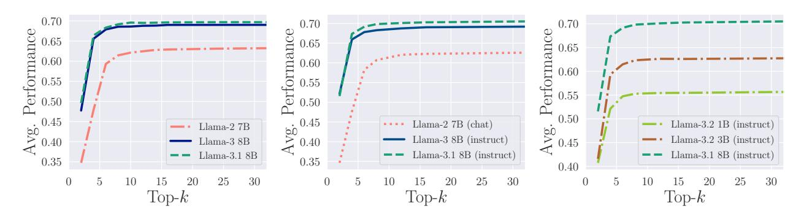

Figure 6: Top-k attention is effective for OpenLLM Leaderboard Tasks even at small values of k. Left shows the average of all tasks as we increase k on pretrained base models. Center shows instruction tuned models. Right investigates the performance on different model sizes.

#### Top-k Performance on OpenLLM Leaderboard Tasks

We evaluate various models to find that top-k behavior exists regardless of instruction tuning, model size, or the number of tokens the model was trained on. Figure 6 left shows that regardless of the number of tokens on which the model was trained, all exhibit a similar trend with performance saturating at k values < 10. When comparing Figure 6 left and center, we see that instruction models and pretrained base models exhibit similar behavior, saturating very quickly. Finally, in Figure 6 right, while different models achieve different performance maximums on the benchmark suite, we see that the effect of top-k is independent of model size.

**Top-k Performance on AlpacaEval** Figure 7 shows that the 95% performance with 2% of attention result holds on generation-intensive tasks as measured by AlpacaEval 2.0. The trend of small k values achieving near-baseline performance holds true across model sizes, and additional results showing performance across model generations can be found in the appendix (Figure 13).

<span id="page-6-1"></span>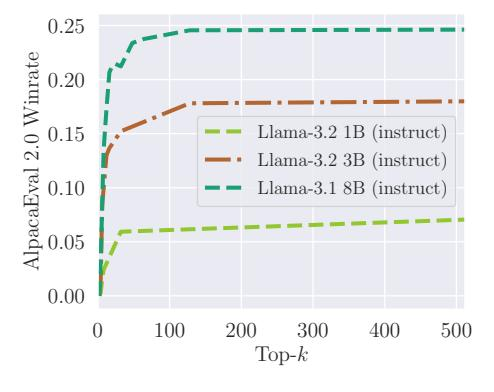

Figure 7: k equivalent to 2% of context length is sufficient to achieve 95% of dense-attention performance on AlpacaEval 2.0, regardless of model size.

<span id="page-6-2"></span>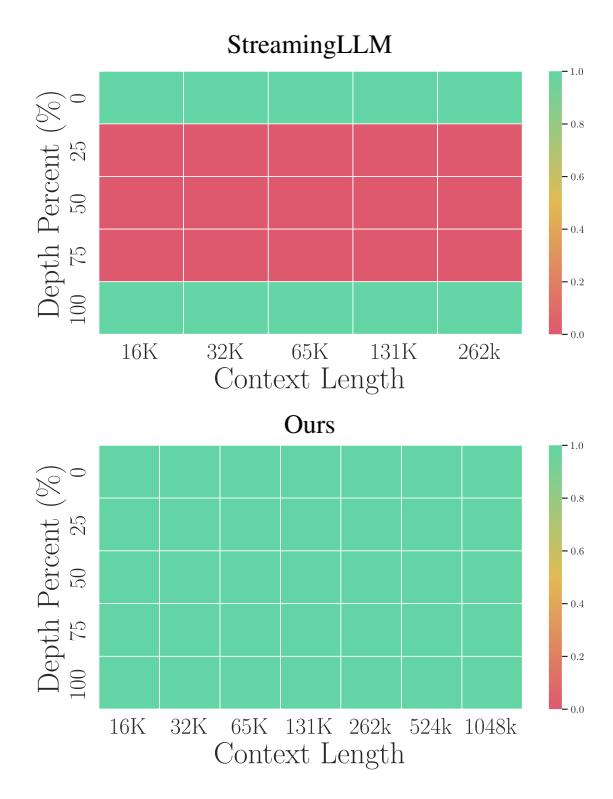

Figure 8: One million token NIAH performance comparing cache eviction (Xiao et al., 2023) and top-k attention. The red cells show that attention sinks are incapable of retrieving tokens outside of the local window or early sink tokens. Top-k attention achieves 100% success with just k=10.

#### 4.3. 1M Token Generation with Top-k

To demonstrate the extreme scaling that top-k attention permits, we use our method to generate tokens conditioned on a context window of *one million* tokens. We choose RULER's Needle In A Haystack task to use for the context, and we use GradientAI's Llama-3-8B model that was trained out to a context length of 1M (Gradient Team, 2024). We run this experiment on a single GPU with a Faiss vector database prefilled with the contents of a KV cache. We also compare our method against (Xiao et al., 2023) for needle in a haystack in Figure 8. Note that top-k attention has a 100% success rate regardless of where in the context the needle is hidden, which cannot be said for any available cache-eviction method.

#### 4.4. Exploring Non-Uniform Choices of k

In this final section we report the results of our studies on the minimal k required for strong performance across different task types and on the impact of applying our top-k operator non-uniformly over the layers of the transformer.

**Optimal k Across Task Types** Table 2 shows how the value of k necessary to achieve 95% of base model performance varies across the tasks in RULER. For the needle in a haystack task, only a tiny fraction of the entire context is necessary to achieve 95% of the base performance of the model, whereas nearly 9% is necessary in the case of Word Counting. Most of the tasks fall under the 1% line.

<span id="page-7-0"></span>Table 2: Percent of attention scores required to reach 95% of dense attention performance for different categories of tasks from the RULER benchmark. k requirements were measured by performance on contexts from 8,000-128,000 tokens. All samples from Llama-3-8B.

| Task Category        | k Required For<br>95% Performance |  |  |
|----------------------|-----------------------------------|--|--|
| Needle In A Haystack | 0.001%                            |  |  |
| Variable Tracking    | 0.11%                             |  |  |
| Question Answering   | 0.23%                             |  |  |
| Multiple NIAH        | 0.27%                             |  |  |
| Word Counting        | 8.87%                             |  |  |

**Layer-Wise Settings for k** Recent work has shown that later layers of a transformer network tend to be less crucial to the computation than earlier ones (Gromov et al., 2024). Our method naturally admits a dimension of flexibility as to where efficiency gains are extracted. As some layers may need a larger k budget than others to accurately capture their

<span id="page-7-2"></span>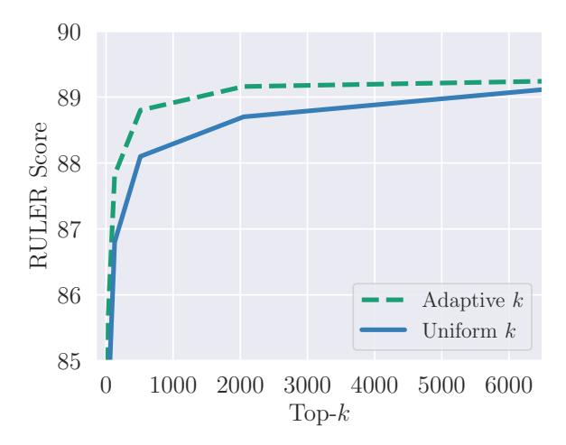

Figure 9: RULER performance of top-k with a fixed vs adaptive k budget across layers. The x axis represents the total k budget, and lines are given for two k budgeting schemes: equal k across all layers and a linearly increasing k from the first to the last layer.

attention distributions, we explore allowing the value of  ${\bf k}$  to vary across layers.

In Figure 9 we vary k and plot the RULER scores as before, but we allocate our budget for k across layers in two different ways. In the uniform strategy, each layer gets the same value of k. In the adaptive strategy, we linearly increase k from the first to the last layer. In each experiment (point on chart), the total k budget remains fixed, e.g. the sum of k over all layers is always the same. We find we are able to gain non-trivial performance boosts simply by changing our strategy for how set k for each layer given a fixed computational budget.

#### 5. Related Work

The problem of making transformer model inference more efficient has been studied from many angles. We briefly survey some of the relevant work below.

#### 5.1. Systems Approaches

There is a long line of work in systems solutions to scale to long contexts in LLMs at inference. Flash Attention, and later Flash-Attention 2, provide theoretical linear memory complexity over the sequence length (Dao et al., 2022; Dao, 2024). vLLM's implementation of Paged Attention (Kwon et al., 2023) optimizes for throughput over many requests, and, like Flash Attention, this Paged Attention implements a block matrix multiplication algorithm that allows for memory savings at inference time. vLLM, while very performant, does not perform any offloading and assumes the cache will

<span id="page-7-1"></span> $<sup>^{1}</sup>$ We use a variety of k values for this experiment find that k = 1 is sufficient to solve Needle In A Haystack with a context length of 1 million tokens.

be able to fit on the GPU. [Liu et al.](#page-9-2) [\(2023\)](#page-9-2) propose Ring Attention, which employs blockwise computation for the self-attention and feedforward operations, distributing long sequences over multiple devices and overlapping key-value block communication with the computation of attention. While the method is highly scalable it assumes access to datacenter-level compute. To the best of our knowledge our approach is the first to achieve inference on million token context windows on a single commodity GPU.

### 5.2. Cache Eviction Methods

A variety of methods exist for evicting tokens from the cache in order to save GPU memory. A straightforward solution is sliding window attention [\(Beltagy et al.,](#page-8-5) [2020b\)](#page-8-5), which keeps only recent tokens of a fixed window size in the cache, and assumes that local interactions dominate. StreamingLLM [\(Xiao et al.,](#page-10-9) [2024\)](#page-10-9) discovered the "attentionsink" phenomenon and proposed a modified sliding window attention that alleviates the performance degradation in windowed attention. Both these works can fail on long contexts as important tokens in the middle of the context window may become evicted from the cache. Another widely used method is H20 [\(Zhang et al.,](#page-10-2) [2023\)](#page-10-2), a cache eviction strategy that uses information about past tokens to remove tokens from the cache. While effective in increasing decode speeds, this method is not dynamically adjustable to different queries, leading some tokens to be evicted that may be important later. Our method keeps all tokens in the cache offloaded to cheap and plentiful CPU memory, but accelerates the lookup process with fast approximate nearest neighbors.

## 5.3. Top-**k** and Dynamic Algorithms

The closest approaches to our method in the literature are all based around the initial work on top-k in [Gupta et al.](#page-9-4) [\(2021\)](#page-9-4). This method computes all scores directly before filtering out the top-k, incurring quadratic computation and demanding the entire KV cache fits on GPU memory. [Chen et al.](#page-8-6) [\(2024\)](#page-8-6) also accelerate decoding by selecting relevant tokens, but take an approach based on sampling attention distributions. [Singhania et al.](#page-10-10) [\(2024\)](#page-10-10) construct a low-cost proxy to full attention using PCA, which informs the token subset for the attention computation. However, these solutions do not support context lengths past a few hundred thousand.

[Tang et al.](#page-10-11) [\(2024\)](#page-10-11) dynamically select relevant tokens from the cache during decoding, but their method relies on a heuristic approximation of top-k divided over cache pages, whereas our method utilizes a nearest-neighbor data structure. The concurrent works of [\(Liu et al.,](#page-9-5) [2024a\)](#page-9-5) and [\(Zhang](#page-10-0) [et al.,](#page-10-0) [2024\)](#page-10-0) bear a resemblance to our method but enforce exactly which kind of nearest-neighbor search algorithm is employed: a custom database in the first and the method of PQ quantization in the second. Our method both generalizes

their method to allow for any database and is extended to 1 million length contexts and beyond.

## 6. Conclusion

In this work we demonstrate the capability of a top-k attention mechanism to operate at the million token scale on a single GPU. We achieve sublinear complexity and evaluate at over 95% of dense attention accuracy on common benchmarks while using only 2% of the context length on average in the attention block. This exploitation of attention sparsity opens up new directions for efficient and viable solutions to long context inference in language models. Our investigation of attention distributions across layers points to future variations of our method that smoothly adapt the top-k method across tasks and layers of a given model suggesting our top-k approach can be used to achieve optimal compute-performance tradeoffs given a specific deployment context.

## References

- <span id="page-8-4"></span>AI, M. Llama 3.2: Revolutionizing edge ai and vision with open, customizable models. [https:](https://ai.meta.com/blog/llama-3-2-connect-2024-vision-edge-mobile-devices/) [//ai.meta.com/blog/llama-3-2-connect-](https://ai.meta.com/blog/llama-3-2-connect-2024-vision-edge-mobile-devices/)[2024-vision-edge-mobile-devices/](https://ai.meta.com/blog/llama-3-2-connect-2024-vision-edge-mobile-devices/), 2024. Accessed: 2024-10-01.
- <span id="page-8-0"></span>Beltagy, I., Peters, M. E., and Cohan, A. Longformer: The long-document transformer. *arXiv:2004.05150*, 2020a.
- <span id="page-8-5"></span>Beltagy, I., Peters, M. E., and Cohan, A. Longformer: The long-document transformer. *CoRR*, abs/2004.05150, 2020b.
- <span id="page-8-3"></span>Bisk, Y., Zellers, R., Bras, R. L., Gao, J., and Choi, Y. Piqa: Reasoning about physical commonsense in natural language. In *Thirty-Fourth AAAI Conference on Artificial Intelligence*, 2020.
- <span id="page-8-6"></span>Chen, Z., Sadhukhan, R., Ye, Z., Zhou, Y., Zhang, J., Nolte, N., Tian, Y., Douze, M., Bottou, L., Jia, Z., and Chen, B. Magicpig: Lsh sampling for efficient llm generation, 2024. URL [https://arxiv.org/abs/2410.](https://arxiv.org/abs/2410.16179) [16179](https://arxiv.org/abs/2410.16179).
- <span id="page-8-1"></span>Child, R., Gray, S., Radford, A., and Sutskever, I. Generating long sequences with sparse transformers, 2019. URL <https://arxiv.org/abs/1904.10509>.
- <span id="page-8-2"></span>Clark, C., Lee, K., Chang, M.-W., Kwiatkowski, T., Collins, M., and Toutanova, K. Boolq: Exploring the surprising difficulty of natural yes/no questions. In *Proceedings of the 2019 Conference of the North American Chapter of the Association for Computational Linguistics: Human Language Technologies, Volume 1 (Long and Short Papers)*, pp. 2924–2936, 2019.

- <span id="page-9-12"></span>Clark, P., Cowhey, I., Etzioni, O., Khot, T., Sabharwal, A., Schoenick, C., and Tafjord, O. Think you have solved question answering? try arc, the ai2 reasoning challenge. *arXiv preprint arXiv:1803.05457*, 2018.
- <span id="page-9-21"></span>Dao, T. Flashattention-2: Faster attention with better parallelism and work partitioning. In *The Twelfth International Conference on Learning Representations*, 2024. URL [https://openreview.net/forum?](https://openreview.net/forum?id=mZn2Xyh9Ec) [id=mZn2Xyh9Ec](https://openreview.net/forum?id=mZn2Xyh9Ec).
- <span id="page-9-6"></span>Dao, T., Fu, D. Y., Ermon, S., Rudra, A., and Re, C. Flashat- ´ tention: Fast and memory-efficient exact attention with ioawareness, 2022. URL [https://arxiv.org/abs/](https://arxiv.org/abs/2205.14135) [2205.14135](https://arxiv.org/abs/2205.14135).
- <span id="page-9-15"></span>Dubey, A., Jauhri, A., Pandey, A., Kadian, A., Al-Dahle, A., Letman, A., Mathur, A., Schelten, A., Yang, A., Fan, A., et al. The llama 3 herd of models. *arXiv preprint arXiv:2407.21783*, 2024.
- <span id="page-9-17"></span>Dubois, Y., Galambosi, B., Liang, P., and Hashimoto, T. B. Length-controlled alpacaeval: A simple way to debias automatic evaluators. *arXiv preprint arXiv:2404.04475*, 2024.
- <span id="page-9-16"></span>Gao, L., Tow, J., Abbasi, B., Biderman, S., Black, S., DiPofi, A., Foster, C., Golding, L., Hsu, J., Le Noac'h, A., Li, H., McDonell, K., Muennighoff, N., Ociepa, C., Phang, J., Reynolds, L., Schoelkopf, H., Skowron, A., Sutawika, L., Tang, E., Thite, A., Wang, B., Wang, K., and Zou, A. A framework for few-shot language model evaluation, 07 2024. URL [https://zenodo.org/records/](https://zenodo.org/records/12608602) [12608602](https://zenodo.org/records/12608602).
- <span id="page-9-19"></span>Gradient Team. Scaling rotational embeddings for longcontext language models. [https://gradient.ai/](https://gradient.ai/blog/scaling-rotational-embeddings-for-long-context-language-models) [blog/scaling-rotational-embeddings](https://gradient.ai/blog/scaling-rotational-embeddings-for-long-context-language-models)[for-long-context-language-models](https://gradient.ai/blog/scaling-rotational-embeddings-for-long-context-language-models), May 2024. Accessed: 2024-10-01.
- <span id="page-9-3"></span>Grattafiori, A. et al. The llama 3 herd of models, 2024. URL <https://arxiv.org/abs/2407.21783>.
- <span id="page-9-20"></span>Gromov, A., Tirumala, K., Shapourian, H., Glorioso, P., and Roberts, D. A. The unreasonable ineffectiveness of the deeper layers, 2024. URL [https://arxiv.org/](https://arxiv.org/abs/2403.17887) [abs/2403.17887](https://arxiv.org/abs/2403.17887).
- <span id="page-9-4"></span>Gupta, A., Dar, G., Goodman, S., Ciprut, D., and Berant, J. Memory-efficient Transformers via Top-k Attention. In *Proceedings of the Second Workshop on Simple and Efficient Natural Language Processing*, pp. 39–52, Virtual, 2021. Association for Computational Linguistics. doi: 10.18653/v1/2021.sustainlp-1.5.

- <span id="page-9-11"></span>Hendrycks, D., Burns, C., Basart, S., Zou, A., Mazeika, M., Song, D., and Steinhardt, J. Measuring massive multitask language understanding. In *International Conference on Learning Representations*, 2020.
- <span id="page-9-9"></span>Hsieh, C.-P., Sun, S., Kriman, S., Acharya, S., Rekesh, D., Jia, F., Zhang, Y., and Ginsburg, B. RULER: What's the Real Context Size of Your Long-Context Language Models?, April 2024.
- <span id="page-9-10"></span>Kamradt, G. Needle in a haystack - pressure testing llms. [https://github.com/gkamradt/](https://github.com/gkamradt/LLMTest) [LLMTest](https://github.com/gkamradt/LLMTest), 2023. GitHub repository.
- <span id="page-9-13"></span>Keisuke, S., Ronan, L. B., Chandra, B., and Yejin, C. Winogrande: An adversarial winograd schema challenge at scale. 2019.
- <span id="page-9-8"></span>Kwon, W., Li, Z., Zhuang, S., Sheng, Y., Zheng, L., Yu, C. H., Gonzalez, J. E., Zhang, H., and Stoica, I. Efficient memory management for large language model serving with pagedattention. In *Proceedings of the ACM SIGOPS 29th Symposium on Operating Systems Principles*, 2023.
- <span id="page-9-5"></span>Liu, D., Chen, M., Lu, B., Jiang, H., Han, Z., Zhang, Q., Chen, Q., Zhang, C., Ding, B., Zhang, K., Chen, C., Yang, F., Yang, Y., and Qiu, L. Retrievalattention: Accelerating long-context llm inference via vector retrieval, 2024a. URL <https://arxiv.org/abs/2409.10516>.
- <span id="page-9-2"></span>Liu, H., Zaharia, M., and Abbeel, P. Ring attention with blockwise transformers for near-infinite context, 2023. URL <https://arxiv.org/abs/2310.01889>.
- <span id="page-9-0"></span>Liu, H., Yan, W., Zaharia, M., and Abbeel, P. World model on million-length video and language with blockwise ringattention, 2024b. URL [https://arxiv.org/](https://arxiv.org/abs/2402.08268) [abs/2402.08268](https://arxiv.org/abs/2402.08268).
- <span id="page-9-7"></span>Malkov, Y. A. and Yashunin, D. A. Efficient and robust approximate nearest neighbor search using hierarchical navigable small world graphs. *IEEE Trans. Pattern Anal. Mach. Intell.*, 42(4):824–836, April 2020. ISSN 0162- 8828. doi: 10.1109/TPAMI.2018.2889473. URL [https:](https://doi.org/10.1109/TPAMI.2018.2889473) [//doi.org/10.1109/TPAMI.2018.2889473](https://doi.org/10.1109/TPAMI.2018.2889473).
- <span id="page-9-14"></span>Mihaylov, T., Clark, P., Khot, T., and Sabharwal, A. Can a suit of armor conduct electricity? a new dataset for open book question answering. In *EMNLP*, 2018.
- <span id="page-9-1"></span>Pope, R., Douglas, S., Chowdhery, A., Devlin, J., Bradbury, J., Heek, J., Xiao, K., Agrawal, S., and Dean, J. Efficiently scaling transformer inference. *Proceedings of Machine Learning and Systems*, 5:606–624, 2023.
- <span id="page-9-18"></span>Rajpurkar, P., Zhang, J., Lopyrev, K., and Liang, P. Squad: 100,000+ questions for machine comprehension of text, 2016. URL [https://arxiv.org/abs/](https://arxiv.org/abs/1606.05250) [1606.05250](https://arxiv.org/abs/1606.05250).

- <span id="page-10-1"></span>Sheng, Y., Zheng, L., Yuan, B., Li, Z., Ryabinin, M., Chen, B., Liang, P., Re, C., Stoica, I., and Zhang, C. Flexgen: ´ high-throughput generative inference of large language models with a single gpu. In *Proceedings of the 40th International Conference on Machine Learning*, ICML'23. JMLR.org, 2023.
- <span id="page-10-10"></span>Singhania, P., Singh, S., He, S., Feizi, S., and Bhatele, A. Loki: Low-rank keys for efficient sparse attention, 2024. URL <https://arxiv.org/abs/2406.02542>.
- <span id="page-10-11"></span>Tang, J., Zhao, Y., Zhu, K., Xiao, G., Kasikci, B., and Han, S. Quest: Query-aware sparsity for efficient longcontext llm inference, 2024. URL [https://arxiv.](https://arxiv.org/abs/2406.10774) [org/abs/2406.10774](https://arxiv.org/abs/2406.10774).
- <span id="page-10-4"></span>Touvron, H., Lavril, T., Izacard, G., Martinet, X., Lachaux, M.-A., Lacroix, T., Roziere, B., Goyal, N., Hambro, E., ` Azhar, F., et al. Llama: Open and efficient foundation language models. *arXiv preprint arXiv:2302.13971*, 2023a.
- <span id="page-10-6"></span>Touvron, H., Martin, L., Stone, K., Albert, P., Almahairi, A., Babaei, Y., Bashlykov, N., Batra, S., Bhargava, P., Bhosale, S., et al. Llama 2: Open foundation and finetuned chat models. *arXiv preprint arXiv:2307.09288*, 2023b.
- <span id="page-10-8"></span>Xiao, G., Tian, Y., Chen, B., Han, S., and Lewis, M. Efficient streaming language models with attention sinks. *arXiv*, 2023.
- <span id="page-10-9"></span>Xiao, G., Tian, Y., Chen, B., Han, S., and Lewis, M. Efficient streaming language models with attention sinks. In *ICLR*. OpenReview.net, 2024.
- <span id="page-10-7"></span>Yang, Z., Qi, P., Zhang, S., Bengio, Y., Cohen, W. W., Salakhutdinov, R., and Manning, C. D. Hotpotqa: A dataset for diverse, explainable multi-hop question answering, 2018. URL [https://arxiv.org/abs/](https://arxiv.org/abs/1809.09600) [1809.09600](https://arxiv.org/abs/1809.09600).
- <span id="page-10-3"></span>Zellers, R., Holtzman, A., Bisk, Y., Farhadi, A., and Choi, Y. HellaSwag: Can a machine really finish your sentence? In *Proceedings of the 57th Annual Meeting of the Association for Computational Linguistics*, pp. 4791– 4800, Florence, Italy, July 2019. Association for Computational Linguistics. doi: 10.18653/v1/P19-1472. URL <https://aclanthology.org/P19-1472>.
- <span id="page-10-0"></span>Zhang, H., Ji, X., Chen, Y., Fu, F., Miao, X., Nie, X., Chen, W., and Cui, B. Pqcache: Product quantization-based kvcache for long context llm inference, 2024. URL <https://arxiv.org/abs/2407.12820>.
- <span id="page-10-2"></span>Zhang, Z., Sheng, Y., Zhou, T., Chen, T., Zheng, L., Cai, R., Song, Z., Tian, Y., Re, C., Barrett, C., Wang, Z., and ´ Chen, B. H2o: Heavy-hitter oracle for efficient generative inference of large language models, 2023. URL [https:](https://arxiv.org/abs/2306.14048) [//arxiv.org/abs/2306.14048](https://arxiv.org/abs/2306.14048).

<span id="page-10-5"></span>Zheng, L., Chiang, W.-L., Sheng, Y., Zhuang, S., Wu, Z., Zhuang, Y., Lin, Z., Li, Z., Li, D., Xing, E., et al. Judging llm-as-a-judge with mt-bench and chatbot arena. *Advances in Neural Information Processing Systems*, 36: 46595–46623, 2023.

## A. Appendix

#### <span id="page-11-0"></span>A.1. Distribution of Attention Scores

In general, 1% of the total attention scores are sufficient for providing 95% of the performance of dense attention on Open LLM Leaderboard, AlpacaEval, and RULER. However, within the subtasks for a given benchmark there is variation in this k-required threshold. This variation is highly correlated with the a measurement we call the *attention entropy*. Attention entropy is calculated by taking the Shannon entropy of a single row of an attention matrix after the softmax transformation is applied, and averaging that over multiple tokens of generation on many different samples of text.

When treating a single, soft-maxed row of an attention matrix as a probability distribution, entropy serves as a good descriptor of how concentrated, or "sparse" it is. The entropy of a maximally concentrated attention distribution is zero, while completely uniform attention scores would have an entropy of the logarithm total scores. Thus low entropy indicates sparse, or concentrated attention. In Table [3](#page-11-1) we show the attention entropy calculated from the first ten tokens of generation from fifty samples of text in each task category. The attention entropy values in the table have a Pearson correlation coefficient of 0.85 with the k-required thresholds for 95% performance in those tasks.

In addition to looking at the attention distributions across tasks, we investigate if there are any systematic trends in the attention sparsity across layers of a model. Figure [10](#page-11-2) shows the attention entropy for RULER subtasks when plotted by layer, and Figure [3](#page-2-0) shows the number of scores required to cover 75% of the full attention distribution, with a histogram plotting this value over hundreds of samples of Wikipedia text. Note that in both figures, the first layer clearly stands out as having the least concentrated attention distributions.

<span id="page-11-1"></span>Table 3: Percent of attention scores required to reach 95% of dense attention performance for different categories of tasks, along with the average entropy of the attention vectors for tokens generated from those tasks.

| Task Category                        | k<br>Required For<br>95% Performance | Attention<br>Entropy |  |
|--------------------------------------|--------------------------------------|----------------------|--|
| Needle In A Haystack                 | 0.001%                               | 1.93                 |  |
| Variable Tracking                    | 0.11%                                | 2.11                 |  |
| Question Answering                   | 0.23%                                | 2.27                 |  |
| Multiple NIAH                        | 0.27%                                | 2.33                 |  |
| Word Counting                        | 8.87%                                | 2.68                 |  |
| k-Required - Entropy Correlation (r) | 0.847                                |                      |  |

<span id="page-11-2"></span>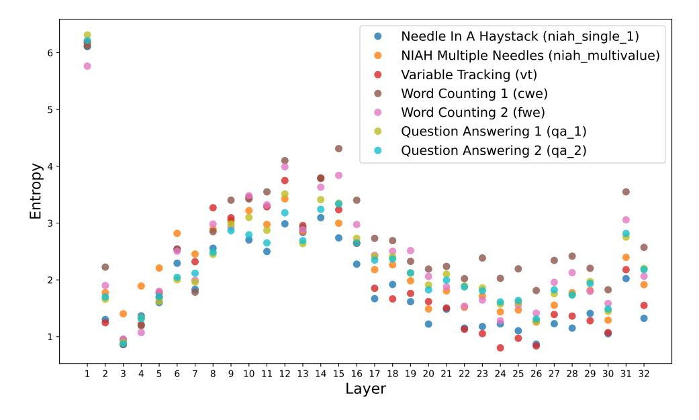

Figure 10: Attention entropy by layer, colored by task category.

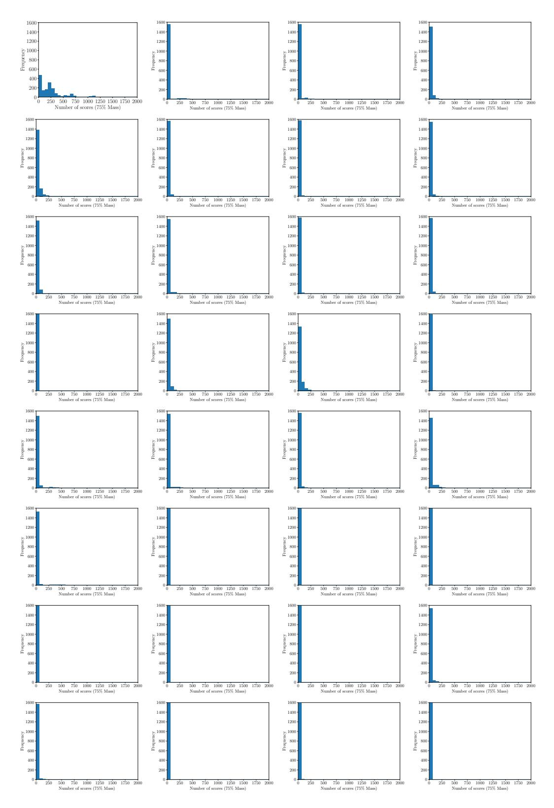

Figure 11: All 32 layers are plotted in order, where the top row represents layers 1, 2, 3, and 4 and last row represents layers 29, 30, 31, and 32.

#### A.2. Additional RULER and AlpacaEval Results

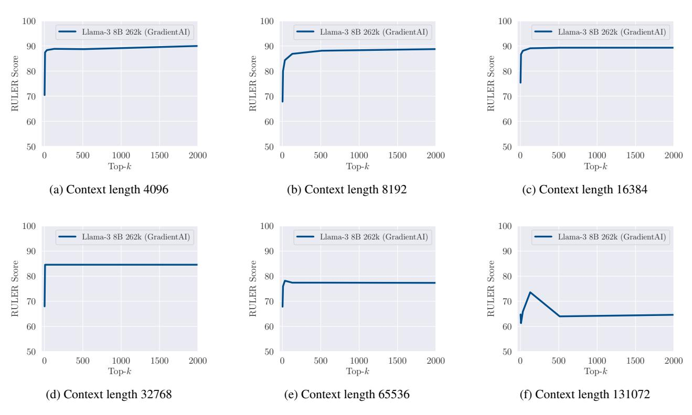

<span id="page-13-0"></span>Figure 12: Results for RULER over various context lengths. This shows the same behavior as Open LLM Leaderboard and AlpacaEval where very few attention scores (very low k) are sufficient to achieve near dense attention performance.

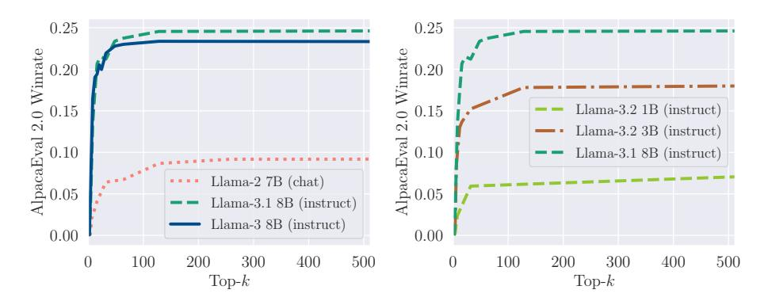

Figure 13: AlpacaEval 2.0 results for various models. Left compares different generations of Llama instruction tuned models. Right investigates how models of different sizes handle small values of k.